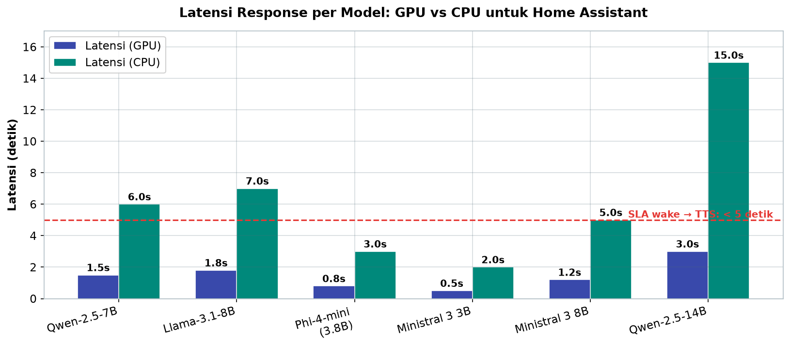
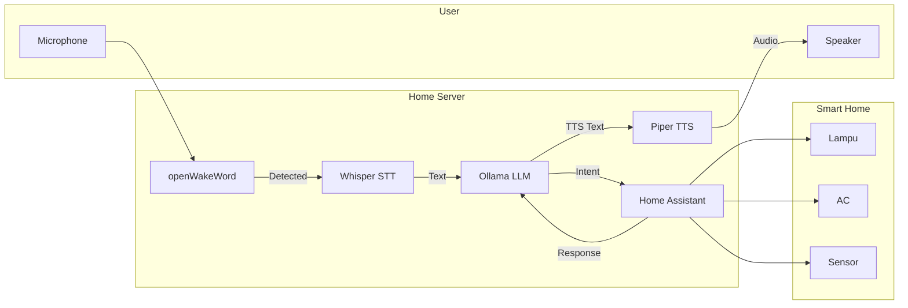

# Bab 6.4: Smart Home

> Bayangkan Anda duduk di sofa, berkata, "Suasana santai," dan dalam hitungan detik lampu meredup, pendingin turun ke 24 derajat, dan musik jazz mengalun pelan. Bukan sulap — itu percakapan antara model bahasa kecil di server keluarga dengan otak rumah yang bernama **Home Assistant**. Sub-bab ini menyatukan keduanya: bagaimana membuat rumah pintar yang *mendengarkan*, *memahami*, dan *bertindak* — tanpa satu byte pun data meninggalkan rumah.

---

## 1. Tujuan Sub-Bab

Setelah membaca sub-bab ini, Anda akan mampu:

- Menjelaskan arsitektur **Home Assistant + LLM**: Home Assistant sebagai otak perangkat, LLM sebagai antarmuka bahasa alami — bukan pengganti, melainkan *frontend*
- Mengintegrasikan **Ollama** dengan Home Assistant sebagai *conversation agent* melalui integrasi bawaan sejak versi 2024.4
- Menyusun *system prompt* dan *context engineering* agar LLM memahami denah rumah, nama perangkat, dan batas kewenangannya
- Membangun **Wyoming voice pipeline** lengkap: openWakeWord → Whisper → Ollama → Piper, dengan setiap komponen berjalan di *container* terpisah
- Merancang automasi cerdas berbasis bahasa alami untuk permintaan ambigu dan *multiple intent* — dan tahu kapan *tidak* perlu melibatkan LLM
- Menerapkan target SLA: latensi *wake → TTS* di bawah 5 detik, dan memahami kapan GPU diperlukan

---

## 2. Arsitektur Home Assistant + LLM

Rumah pintar tradisional dikuasai *juga* oleh aturan YAML yang kaku: "jika sensor suhu di atas 28 derajat, nyalakan AC". Itu bekerja, tetapi tidak *berbicara*. Peran **Home Assistant** adalah otak IoT — mengelola lampu, *climate*, dan sensor; peran **LLM** adalah membuat otak itu bisa diajak bicara. Ini pembagian kerja yang harus ditegaskan sejak awal: **LLM bukan pengganti automasi, melainkan *frontend*-nya**.

Alurnya berbentuk rantai satu arah: **User → Wake Word → Whisper (STT) → Ollama (Intent) → HA API → Action → Piper (TTS)**. Ucapan keluarga menjadi teks oleh Whisper, teks menjadi maksud oleh LLM, maksud menjadi perintah nyata oleh Home Assistant, dan tanggapan menjadi suara oleh Piper. Setiap mata rantai bisa diperbaharui secara terpisah — inilah arsitektur modular yang dianjurkan *Harmony* [3] dan dipraktikkan langsung oleh keluarga di lapangan [2].

Konsekuensi pentingnya: model LLM di sini tidak dituntut menjadi *supergenius* — ia cukup pandai memahami maksud kalimat rumah tangga dan menerjemahkannya ke *service call*. Justru itulah alasan model kecil seperti Ministral 3 atau Qwen-2.5-7B lebih disukai daripada model raksasa: lebih cepat, lebih hemat daya, dan tugasnya memang sederhana [1].

---

## 3. Native Ollama Integration di HA 2024.4+

Sejak versi **2024.4**, Home Assistant memiliki integrasi **Ollama** bawaan — tidak perlu *custom component*. Langkahnya sesederhana membuka **Settings → Devices & Services → Add Ollama**, lalu mengisi URL (default `http://192.168.1.100:11434`), memilih model, dan menyesuaikan parameter.

Dua keputusan penting menyusul. Pertama, **ekspos entity** — tentukan perangkat mana yang boleh dikontrol LLM melalui *Assist*; jangan pernah mengekspos semua entity, karena itu berarti memberi pembantu rumah tangga kunci semua kamar. Kedua, **pilih model dengan *function calling* yang stabil** — rekomendasi utama adalah **Qwen-2.5-7B** (paling stabil untuk *function calling*) dan **Llama-3.1-8B** (serba guna). *Function calling* adalah bahasa yang membuat LLM mampu menyebut nama *service* dan *entity* secara terstruktur — tanpa itu, jawaban model hanya akan menjadi cerita, bukan tindakan.

---

## 4. Custom Prompt dan Context Engineering

LLM tidak lahir mengenal rumah Anda. Ia perlu "diberi tahu" — dan cara pemberi tahuannya disebut *context engineering*. Sebuah *system prompt* yang baik untuk asisten rumah berisi tiga hal: **denah dan konteks rumah** (kamar mana di lantai mana), **daftar perangkat** yang dirujuk dengan nama persis entity-nya (bukan "lampu itu" melainkan `light.living_room`), dan **batas kewenangan** ("kamu hanya boleh menjalankan perintah yang aman").

Teknik pendukungnya adalah **expose_entities** — mekanisme resmi untuk membatasi daftar perangkat yang terlihat oleh LLM, sehingga ia tidak hanya dibatasi *oleh* prompt tetapi juga *oleh* sistem. Contoh nyata: template *prompt* untuk deteksi maksud berubah dari frasa umum "nyalakan lampu ruang tamu" menjadi panggilan layanan terstruktur `light.turn_on` pada entity `light.living_room`. Struktur *prompt* yang rapi seperti inilah yang membuat model kecil sekalipun mampu mengeksekusi dengan presisi [3].

---

## 5. Wyoming Voice Pipeline

Antarmuka paling alami bagi keluarga bukan keyboard, melainkan suara. **Wyoming protocol** adalah standar terbuka yang menghubungkan empat komponen *voice*: **openWakeWord** mendeteksi frasa pemicu ("Hei Rumah"), **Whisper** mengubah ucapan menjadi teks, **Ollama** memproses maksud, dan **Piper** menghasilkan *text-to-speech* — termasuk dukungan suara bahasa Indonesia.

Keunggulan desain Wyoming adalah kemerdekaan setiap komponen: masing-masing berjalan sebagai *container* terpisah dengan port sendiri (10300 untuk Whisper, 10200 untuk Piper), sehingga bisa di-*upgrade* atau diganti tanpa menyentuh komponen lain. Ini adalah contoh nyata dari prinsip *modular agent architecture* yang diadaptasi dari struktur Harmony [3]: satu rantai, banyak bagian yang bisa diganti.

Dengan **Ministral 3 3B** sebagai LLM agent, seluruh pipeline dapat mencapai **< 2 detik end-to-end** (wake → aksi → TTS) — jauh di bawah batas kenyamanan manusia, dan menjadi fondasi pengalaman smart home yang benar-benar responsif [11].

---

## 6. Automasi Cerdas dengan LLM

Ini bagian yang paling sering disalahpahami: **LLM tidak perlu untuk semua trigger**. Sensor suhu naik → nyalakan AC tetap paling baik dijalankan automasi YAML klasik yang deterministik dan *instant*. Melibatkan LLM di sini hanya menambah latensi dan satu titik kegagalan.

Gunakan LLM justru untuk tiga kasus yang memang lemah di YAML. Pertama, **perintah ambigu** — "suasana santai" yang membutuhkan interpretasi (lampu redup, AC 24 derajat, playlist jazz). Kedua, **multiple intent** — "matikan lampu dan nyalakan TV" yang harus dipecah menjadi dua aksi. Ketiga, **integrasi konteks eksternal** — "jadwalkan AC menyala 30 menit sebelum saya pulang", yang menuntut kalender dan *timer logic*.

Studi *GreenIFTTT* [4] menemukan temuan yang mengejutkan: pengguna non-teknis justru lebih mudah merancang rutinitas rumah pintar melalui percakapan dengan *chatbot* LLM daripada melalui editor aturan visual. Artinya, LLM bukan sekadar "kemewahan" — bagi sebagian keluarga, ia adalah satu-satunya jembatan menuju otomasi yang selama ini terasa terlalu teknis.

---

## 7. Kinerja dan SLA

Terakhir, tetapkan janji kinerja. Target latensi untuk pengalaman natural: **wake → TTS kurang dari 5 detik**. Jika keluarga memiliki GPU, target di bawah **3 detik** tercapai (Whisper + LLM berjalan paralel di GPU). Dengan CPU-only, latensi 6-12 detik masih dapat diterima untuk smart home — cukup cepat untuk perintah, cukup lambat untuk membuat anak bosan jika Anda tidak sabar.

Angka-angka ini selaras dengan studi *On-Device LLM for Home Assistant* [1], yang membuktikan bahwa LLM 8-bit di perangkat CPU-only sekalipun mampu menangani *intent detection* dengan latensi yang dapat diterima untuk otomasi rumah. Di sisi lain, studi *Optimizing LLM for Smart Home at the Edge* [5] menunjukkan bahwa optimasi model secara agresif dapat memangkas *response time* hingga 82% (dari 45 detik menjadi 7,9 detik) — bukti bahwa untuk tugas rumah tangga, model kecil yang dioptimasi mengalahkan model besar yang lambat.

---

## 8. Tabel Wajib

### Tabel 1: Perbandingan Model untuk Home Assistant

Enam kandidat model — dari yang paling hemat daya hingga paling akurat.

| Model | Ukuran Q4 | Function Calling | Latensi (GPU) | Latensi (CPU) | Rekomendasi |
|:---|:---:|:---:|:---:|:---:|:---|
| **Qwen-2.5-7B** | ~4.5 GB | Sangat Baik | 1.5 detik | 6 detik | Terbaik untuk HA |
| **Llama-3.1-8B** | ~5.0 GB | Baik | 1.8 detik | 7 detik | Alternatif umum |
| **Phi-4-mini (3.8B)** | ~2.5 GB | Sedang | 0.8 detik | 3 detik | Hemat daya |
| **Ministral 3 3B** | ~1.8 GB | Baik | 0.5 detik | 2 detik | **Terbaik edge** |
| **Ministral 3 8B** | ~4.8 GB | Sangat Baik | 1.2 detik | 5 detik | **Sweet spot home** |
| **Qwen-2.5-14B** | ~8.5 GB | Sangat Baik | 3.0 detik | 15 detik | Akurasi maksimal |

Kesenjangan latensi GPU versus CPU hanya bisa dirasakan ketika digambar — semua model lolos SLA 5 detik di GPU, sementara di CPU hanya model terkecil yang aman.



*Gambar 6.4-1 — Latensi response enam kandidat model pada GPU dan CPU, dengan garis SLA 5 detik. Di GPU semua model lolos, tetapi di CPU hanya Ministral 3 3B (~2 detik) dan Phi-4-mini (~3 detik) yang berada di bawah batas nyaman.*

Ministral 3 (Apache 2.0, Desember 2025) adalah pilihan terbaik untuk Home Assistant karena *edge-optimized* dengan *function calling* yang baik. **Ministral 3 3B** berjalan di CPU dengan latensi hanya 2 detik — ideal untuk perangkat tanpa GPU. Untuk keluarga dengan GPU, **Ministral 3 8B** menawarkan keseimbangan terbaik antara akurasi dan kecepatan. Pola penting dari tabel ini: perbedaan latensi GPU hanya beberapa detik, tetapi selisih CPU bisa 3-8 kali lipat — bagi rumah tanpa GPU, pilihan model adalah segalanya.

### Tabel 2: Komponen Voice Pipeline Wyoming

Sekarang bedah rantai suara komponen per komponen — perhatikan betapa ringannya kebutuhan setiap mata rantai.

| Komponen | Fungsi | Model/Engine | RAM | Latensi (GPU) |
|:---|:---|:---|:---:|:---:|
| **openWakeWord** | Wake word detection | Neural network kecil | ~100 MB | 0.3 detik |
| **Whisper (faster-whisper)** | Speech-to-text | Whisper small/turbo | ~1-2 GB | 0.5-1 detik |
| **Ollama (LLM agent)** | Intent parsing + action | Ministral 3 3B / Qwen-2.5-7B | ~2-5 GB | 0.5-1.2 detik |
| **Piper TTS** | Text-to-speech | Piper medium ID | ~500 MB | 0.5 detik |

Dengan **Ministral 3 3B** sebagai LLM agent, total pipeline *voice* mencapai **< 2 detik end-to-end** (wake → action → TTS) — angka yang sangat responsif untuk smart home. Kesimpulan praktisnya: seluruh rantai suara hanya membutuhkan ~3,6-8,6 GB RAM dan latensi GPU di bawah 3 detik — artinya, pipeline ini bahkan bisa ditaruh di Mini PC *home server* yang sama dengan Home Assistant, tanpa menuntut rig GPU khusus.

### Tabel 3: Contoh Automasi dengan vs Tanpa LLM

Terakhir, perbandingan nyata antara dua dunia: YAML klasik versus bahasa alami.

| Skenario | Tanpa LLM (YAML) | Dengan LLM |
|:---|:---|:---|
| "Suasana santai" | Butuh script kompleks, 15 baris YAML | Satu kalimat natural |
| "Matikan lampu kamar dan nyalakan AC" | 2 automasi terpisah | Multiple intent otomatis |
| "Berapa suhu di luar?" | Butuh template sensor | Query database otomatis |
| "Hidupkan lampu 10 menit lagi" | Timer manual | LLM parse "10 menit" |

Bacaan yang jujur: kolom tanpa LLM bukan musuh — ia deterministik, cepat, dan gratis. Tetapi untuk empat kategori di atas, biaya *engineering*-nya nyata: 15 baris YAML hanya untuk satu suasana, dua automasi terpisah untuk satu kalimat majemuk, dan template rumit untuk pertanyaan sederhana. LLM mentransfer biaya itu dari *pemrogram* ke *bahasa sehari-hari* — dan bagi keluarga yang tidak memiliki pemrogram di dalamnya, itu adalah perbedaan antara "bisa" dan "tidak pernah mencoba" [4].

---

## 9. Diagram & Visualisasi

### Gambar 1: Arsitektur Voice Pipeline

Rantai penuh dari ucapan hingga lampu menyala — dan kembali menjadi suara.



Diagram ini menunjukkan pembagian kerja yang bersih: semua pemrosesan bahasa terjadi di dalam *Home Server*, sementara *Smart Home* hanya menerima aksi. Dua busur penting: `LLM →|Intent| HA` adalah jembatan antara pemahaman dan tindakan, dan `HA →|Response| LLM` adalah putaran balik yang membuat asisten bisa *menjawab* setelah *bertindak*. Dengan latensi per-node yang kita ukur di Tabel 2, rantai ini menutup pengalaman suara di bawah 3 detik di GPU, dan di bawah 6 detik di CPU [1].

### Gambar 2: Alur Eksekusi Multiple Intent

Saat keluarga mengucapkan perintah majemuk, LLM bertindak sebagai juru tulis yang rapi.

```mermaid
graph TD
    CMD[Perintah: "matikan lampu kamar dan nyalakan AC 24 derajat"] --> LLM[LLM: parsing intent]
    LLM --> JSON[JSON array intent]
    JSON --> S1[light.turn_off kamar]
    JSON --> S2[climate.set_temperature AC 24]
    S1 --> HA[Home Assistant API]
    S2 --> HA
    HA --> R[Status eksekusi]
```

Inilah ratusan baris YAML yang "disulap" menjadi satu kalimat: LLM memecah perintah menjadi *JSON array* berisi pasangan entity-service yang terstruktur, dan setiap item dieksekusi berurutan melalui API Home Assistant. Kunci keberhasilannya adalah *temperature rendah* (misalnya 0.1) pada pemanggilan LLM — kita menginginkan ekstraksi yang konsisten, bukan jawaban kreatif.

---

## 10. Praktikum / Hands-On

### Langkah 1: Integrasi Ollama dengan Home Assistant via Docker Compose

Bangun seluruh tumpukan — Home Assistant, Ollama, dan dua layanan Wyoming — dalam satu file.

```yaml
# docker-compose.yml — stack lengkap HA + Ollama + Wyoming
version: "3.8"

services:
  homeassistant:
    image: ghcr.io/home-assistant/home-assistant:stable
    volumes:
      - ./ha-config:/config
    ports:
      - "8123:8123"
    restart: unless-stopped

  ollama:
    image: ollama/ollama:latest
    volumes:
      - ./ollama-models:/root/.ollama
    ports:
      - "11434:11434"
    deploy:
      resources:
        reservations:
          devices:
            - driver: nvidia
              count: 1
              capabilities: [gpu]
    restart: unless-stopped

  wyoming-whisper:
    image: rhasspy/wyoming-faster-whisper:latest
    command: --model tiny-int8 --language id
    ports:
      - "10300:10300"
    restart: unless-stopped

  wyoming-piper:
    image: rhasspy/wyoming-piper:latest
    command: --voice id-ID
    ports:
      - "10200:10200"
    restart: unless-stopped
```

Perhatikan dua detil: bagian `deploy.resources...capabilities: [gpu]` di service Ollama — hapus jika server tidak punya GPU (Ollama akan berjalan CPU-only), dan `command: --model tiny-int8 --language id` untuk Whisper yang menggunakan model ringan berbahasa Indonesia. Jalankan dengan `docker compose up -d`, lalu verifikasi `curl http://localhost:11434/api/tags` di host.

### Langkah 2: Konfigurasi Assist Pipeline di HA

Setelah integrasi Ollama ditambahkan lewat UI, konfigurasikan *conversation agent* lewat `configuration.yaml`.

```yaml
# Di configuration.yaml HA — setup conversation agent
# Setelah Ollama integration ditambahkan via UI:

conversation:
  - platform: ollama
    url: "http://ollama:11434"
    model: "qwen2.5:7b"
    prompt: |-
      Anda adalah asisten rumah pintar yang membantu keluarga.
      Anda mengontrol perangkat berikut:
      
      - {{ entity }}
      
      Anda hanya boleh menjalankan perintah yang aman dan sesuai.
    max_tokens: 150
    temperature: 0.3
    top_p: 0.9

# Ekspos entity via UI: Settings → Voice Assistants → Expose Entities
# Pilih: light.*, climate.*, switch.*, sensor.* (temperature only)
```

Template `` mengotomatiskan *context engineering*: daftar perangkat ditulis langsung ke *system prompt* setiap percakapan, sehingga LLM selalu tahu apa yang boleh dan tidak boleh disentuhnya. Parameter `temperature: 0.3` menjaga jawaban tetap konsisten — untuk *automation*, kreativitas adalah musuh.

### Langkah 3: Automasi Multiple Intent dengan LLM

Untuk kontrol penuh atas pemrosesan *multiple intent*, script kecil berikut menjadi *jembatan* antara bahasa alami dan API Home Assistant.

```python
# custom_agent.py — script untuk menangani multiple intent
# Jalankan sebagai add-on atau service terpisah

import requests
import json

HA_URL = "http://homeassistant:8123/api"
HA_TOKEN = "your-long-lived-token"
OLLAMA_URL = "http://ollama:11434/api/generate"

def parse_intent(user_text):
    """Kirim ke LLM untuk ekstraksi intent terstruktur"""
    prompt = f"""Ekstrak intent dari perintah berikut sebagai JSON array.
    Perintah: "{user_text}"
    Response format: [{{"entity": "light.living_room", "service": "turn_on"}}, ...]
    Hanya output JSON, tanpa penjelasan."""

    resp = requests.post(OLLAMA_URL, json={
        "model": "qwen2.5:7b",
        "prompt": prompt,
        "stream": False,
        "temperature": 0.1
    })

    return json.loads(resp.json()["response"])

def execute_intents(intents):
    """Jalankan intent via HA API"""
    headers = {
        "Authorization": f"Bearer {HA_TOKEN}",
        "Content-Type": "application/json"
    }

    for intent in intents:
        service = intent["service"]  # "light.turn_on"
        entity = intent["entity"]    # "light.living_room"

        domain, service_name = service.split(".")
        url = f"{HA_URL}/services/{domain}/{service_name}"
        requests.post(url, json={"entity_id": entity}, headers=headers)

# Contoh penggunaan
if __name__ == "__main__":
    perintah = "matikan lampu kamar dan nyalakan ac di suhu 24"
    intents = parse_intent(perintah)
    print(f"Parsed: {intents}")
    execute_intents(intents)
```

Ganti `your-long-lived-token` dengan token yang dibuat dari profil pengguna Anda di HA (Profile → Long-Lived Access Token). Saat dijalankan, script akan mencetak `Parsed: [{"entity": "light.kamar", "service": "turn_off"}, ...]` lalu mengeksekusi masing-masing — bukti bahwa satu kalimat keluarga dapat menjadi dua aksi nyata.

---

## 11. Studi Kasus: Rumah Pintar Keluarga Santoso (6 Anggota)

**Setup.** Rumah pintar keluarga Santoso: Home Assistant di Mini PC, Ollama, dan Wyoming Whisper/Piper sebagai rantai suara.

**Perangkat.** 20+ *smart bulbs* (Philips Hue), 3 AC (Broadlink IR), 5 sensor suhu, dan *smart lock* — semua dikontrol lewat bahasa alami, tanpa remote.

**LLM Model.** **Qwen-2.5-7B Q4_K_M** — *function calling* yang stabil menjadikannya pilihan utama, dengan respons di bawah 2 detik di GPU.

**Voice.** Dua *microphone array* ESP32-S3 di ruang tamu dan dapur, dengan kata pemicu "Hei Rumah". Dari ruang tamu anak bisa memanggil asisten; dari dapur orang tua bisa mengatur AC tanpa meninggalkan kompor.

**Automasi LLM.**
- "Suasana makan malam" → lampu redup 30%, AC 24°C, playlist jazz diputar.
- "Kunci pintu dan matikan semua lampu" → *multiple intent* dieksekusi berurutan.
- "Berapa tagihan listrik bulan ini?" → *query* sensor *energy monitoring* langsung dijawab.

**Hasil.** Anak bisa meminta lampu kamar menyala tanpa remote. Orang tua mengatur AC dari dapur. Tidak ada satu pun data yang keluar ke *cloud*. Latensi rata-rata **3,5 detik** (wake → action → TTS) — nyaman di bawah target SLA 5 detik [1].

**Pelajaran.** Keberhasilan keluarga Santoso tidak datang dari model terbesar, melainkan dari pemilihan peran yang tepat: YAML tetap mengurusi trigger sensor yang deterministik, sementara LLM mengambil alih kalimat manusia yang ambigu. Rumah yang "pintar" bukanlah rumah dengan perangkat terbanyak — tetapi rumah yang bisa *dibicarai*.

---

## 12. Referensi

### Paper Jurnal/Konferensi

[1] Lang, M., et al. (2025). *On-Device LLMs for Home Assistant: Dual Role in Intent Detection and Response Generation*. arXiv: [2502.12923](https://arxiv.org/abs/2502.12923). DOI: [10.48550/arXiv.2502.12923](https://doi.org/10.48550/arXiv.2502.12923)

[2] Huang, X., Shen, L., Ma, Z., & Zheng, Y. (2025). *Towards Privacy-Preserving and Personalized Smart Homes via Tailored Small Language Models*. IEEE Transactions on Mobile Computing. arXiv: [2507.08878](https://arxiv.org/abs/2507.08878). DOI: [10.48550/arXiv.2507.08878](https://doi.org/10.48550/arXiv.2507.08878)

[3] Chen, Y., et al. (2024). *Harmony: A Privacy-Preserving and Robust Smart Home Assistant Powered by Locally Deployable Llama3-8B*. arXiv: [2410.14252](https://arxiv.org/abs/2410.14252). DOI: [10.48550/arXiv.2410.14252](https://doi.org/10.48550/arXiv.2410.14252)

[4] Presta, L., et al. (2024). *Designing Home Automation Routines Using an LLM-Based Chatbot*. Designs (MDPI), 8(3), 43. DOI: [10.3390/designs8030043](https://doi.org/10.3390/designs8030043)

[5] Velaga, K.S., & Guo, Y. (2024). *Optimizing Large Language Models Assisted Smart Home Assistant Systems at the Edge: An Empirical Study*. AAAI 2025 Workshop AI4WCN. [https://openreview.net/forum?id=qr2dIjQavP](https://openreview.net/forum?id=qr2dIjQavP)

### Referensi Pendukung

[6] Home Assistant. *Ollama Integration*. [https://www.home-assistant.io/integrations/ollama](https://www.home-assistant.io/integrations/ollama)

[7] Home Assistant. *Wyoming Protocol*. [https://www.home-assistant.io/integrations/wyoming](https://www.home-assistant.io/integrations/wyoming)

[8] Piper TTS. *GitHub Repository*. [https://github.com/rhasspy/piper](https://github.com/rhasspy/piper)

[9] faster-whisper. *GitHub Repository*. [https://github.com/SYSTRAN/faster-whisper](https://github.com/SYSTRAN/faster-whisper)

[10] openWakeWord. *GitHub Repository*. [https://github.com/dscripka/openWakeWord](https://github.com/dscripka/openWakeWord)

[11] Mistral AI. (2025). *Ministral 3: Edge-Optimized for Home Automation*. Apache 2.0, varian 3B/8B/14B. [https://mistral.ai/news/ministral-3/](https://mistral.ai/news/ministral-3/)