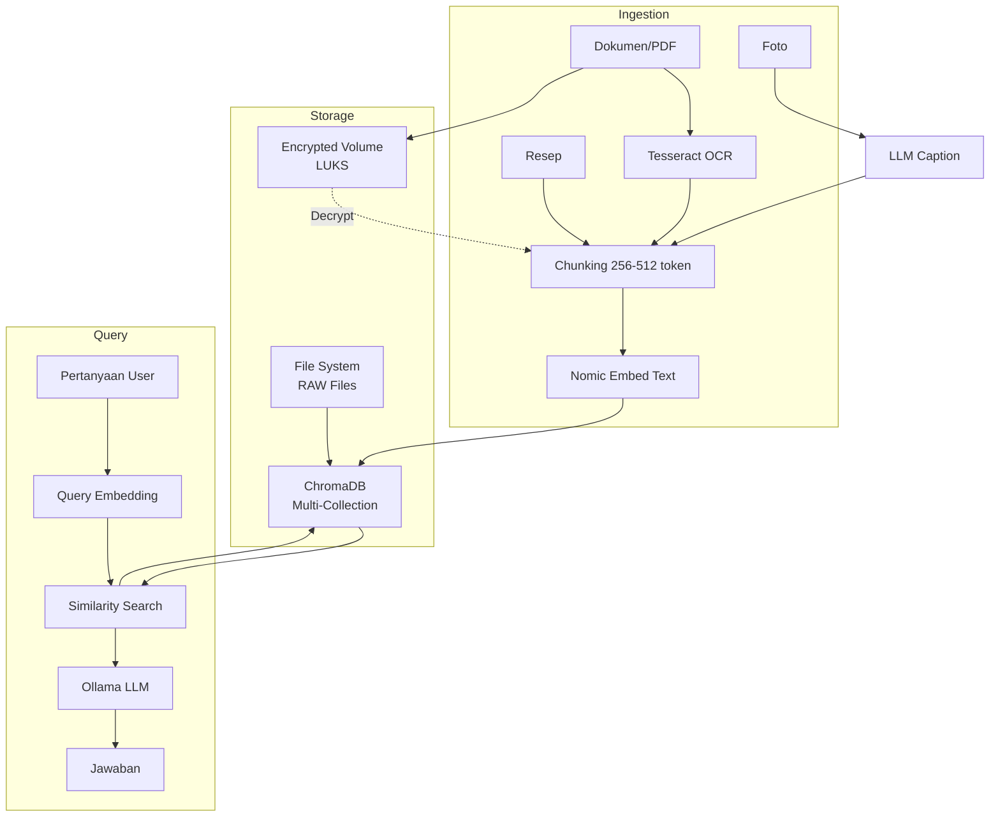

# Bab 6.5: Knowledge Base

> Bayangkan sebuah kotak resep yang bukan hanya menyimpan kertas — ia bisa "diingat" oleh setiap anggota keluarga, menjawab "resep opor ayam nenek yang pakai santan kental" dalam hitungan detik, tanpa membuka laci, tanpa menelpon ibu, tanpa data keluar rumah. Itulah janji *Shared Knowledge Base*: menjadikan LLM lokal sebagai memori kolektif rumah tangga, yang selalu tersedia, selalu privat, dan terus bertumbuh bersama keluarga.

---

## 1. Tujuan Sub-Bab

Setelah membaca sub-bab ini, Anda akan mampu:

- Membangun *RAG pipeline* lokal untuk data keluarga — mulai dari resep, dokumen pajak, catatan sekolah, hingga foto — dengan *vector database* di rumah
- Mengelola *multi-user RAG* dengan isolasi data per anggota keluarga, sehingga anak tidak bisa membaca dokumen pajak ayah dan ayah tidak perlu khawatir data pribadinya tercampur
- Mengimplementasikan enkripsi untuk dokumen sensitif (pajak, catatan medis) menggunakan *encrypted volume* seperti LUKS
- Memilih model *embedding* dan LLM yang tepat untuk dokumen berbahasa Indonesia
- Menyusun pipeline OCR + *chunking* + *embedding* untuk dokumen scan berbahasa Indonesia

---

## 2. Konsep RAG untuk Data Keluarga

### Mengapa LLM Perlu "Mencari Dulu, Baru Menjawab"

Seorang ibu bertanya, "Berapa total pajak tahun 2025?" Jika pertanyaan itu diajukan ke LLM biasa, jawabannya hanyalah tebakan terpelajar — karena model tidak pernah melihat dokumen pajak keluarga Anda. Di sinilah **RAG** (*Retrieval-Augmented Generation*) berperan. Alih-alih menjawab dari pengetahuan internal model semata, RAG bekerja dalam dua tahap: **retriever** mencari dokumen relevan dari *database* vektor, lalu **generator** (LLM) menyusun jawaban berdasarkan dokumen yang berhasil ditemukan [1]. Dengan kata lain, model "mencari dulu di rak arsip keluarga, baru menjawab" — dan selalu mencantumkan dasar jawabannya.

Konsep ini pertama kali diformalkan oleh Lewis et al. (2020) untuk tugas *knowledge-intensive NLP*, dan hingga hari ini arsitektur retriever-generator tersebut masih menjadi fondasi hampir semua sistem tanya-jawab dokumen, termasuk yang Anda bangun di rumah [1].

### Beda dengan Cloud: Data Tidak Pernah Meninggalkan Rumah

Perbedaan paling fundamental antara RAG lokal dan asisten AI di awan bukan pada kualitas jawaban, melainkan pada **lokasi data**. Saat Anda mengunggah dokumen pajak ke asisten cloud, dokumen itu tersimpan di server pihak ketiga — Anda hanya berharap perusahaan tersebut menjaga kerahasiaannya. Pada RAG lokal, *ingestion* hingga *query* terjadi sepenuhnya di dalam rumah: dokumen di-*scan*, dipecah, di-*embed*, dan disimpan di ChromaDB yang berjalan di server Anda sendiri. Data **tidak pernah meninggalkan rumah**, sehingga privasi keluarga menjadi 100% berada di tangan Anda [5].

Ini bukan sekadar soal kepercayaan. Survei *privacy-preserving LLM inference* terbaru menunjukkan bahwa *deployment* lokal menghilangkan seluruh risiko kebocoran data di sisi penyedia cloud, sekaligus membebaskan Anda dari biaya per-*request* yang terus berjalan [5]. Biayanya: Anda harus menyediakan perangkat keras, listrik, dan kesabaran untuk *maintenance* — harga yang wajar untuk kedaulatan data keluarga.

### Use Case yang Langsung Terasa Manfaatnya

Supaya tidak abstrak, bayangkan tiga skenario sehari-hari yang akan berjalan mulus setelah sistem ini berdiri:

- **"Cari resep soto ayam buatan Ibu bulan lalu"** — sistem menemukan resep dari *collection* resep bersama, lengkap dengan takaran bumbu hasil tulisan tangan yang sudah di-OCR
- **"Berapa total pajak tahun 2025?"** — sistem membuka *encrypted volume*, mendekripsi dokumen pajak di memori, menjawab dengan angka, lalu mengunci kembali
- **"Foto keluarga saat lebaran 2024"** — sistem mencari berdasarkan tanggal EXIF dan *caption* yang dibuat otomatis, bukan menebak isi foto

Ketiga skenario ini menggambarkan tiga jenis data yang berbeda (teks, dokumen terenkripsi, foto), dan semuanya dikelola oleh satu arsitektur yang akan kita bangun di seksi berikutnya.

---

## 3. Arsitektur Pipeline RAG Lokal

### Alur Ingestion: dari Kertas ke Vektor

Perjalanan data keluarga menjadi entri *database* vektor terdiri dari empat tahap. **Pertama**, dokumen fisik di-*scan* dan diproses oleh **Tesseract OCR** dengan *language pack* Indonesia untuk mengubah gambar menjadi teks. **Kedua**, teks dipecah menjadi *chunk* dengan strategi yang disesuaikan jenis dokumen. **Ketiga**, setiap *chunk* diubah menjadi vektor oleh model *embedding*. **Keempat**, vektor beserta metadata (pemilik, tanggal, jenis dokumen) disimpan di **ChromaDB** — *vector database* yang menjadi "peta arsip keluarga". Ingestion ini biasanya hanya perlu dilakukan sekali per dokumen; setelah itu, sistem tinggal melayani pertanyaan.

### Alur Query: Tanya, Temukan, Jawab

Saat seorang anggota keluarga bertanya, urutan kebalikannya terjadi: pertanyaan diubah menjadi vektor *query* dengan model *embedding* yang sama, kemudian dilakukan **similarity search** terhadap seluruh *chunk* di *database* — vektor terdekat secara semantik dianggap paling relevan. Hasil pencarian (biasanya 3-5 *chunk*) digabung menjadi konteks, lalu dikirim ke **LLM** bersama pertanyaan asli. LLM menyusun jawaban yang bersumber pada konteks tersebut. Karena konteks datang dari dokumen keluarga, jawabannya akurat secara faktual dan bisa ditelusuri kembali ke sumbernya.

### Toolbox: ChromaDB, Model Embedding, dan Ollama

Untuk *deployment* rumahan, kombinasi yang paling praktis adalah **ChromaDB** sebagai *vector store*, **Nomic Embed Text** atau **BGE-M3** sebagai model *embedding*, dan **Ollama** sebagai *runtime* LLM. ChromaDB dipilih karena *setup*-nya sangat mudah dan hemat memori — sekitar ~500 MB RAM untuk 10 ribu dokumen (lihat Tabel 1). Ukuran dataset keluarga umumnya berada di kisaran **100-500 GB** (foto mendominasi, dokumen teks hanya puluhan MB), tetapi yang masuk ke ChromaDB hanyalah vektor *embedding* berukuran ~100 MB — jauh lebih kecil dari data aslinya.

Untuk dokumen berbahasa Indonesia, rekomendasi model *embedding* adalah **BGE-M3** dari BAAI. Berbeda dengan Nomic Embed Text yang lebih kuat di dokumen Inggris, BGE-M3 dirancang *multi-lingual* — termasuk bahasa Indonesia — sehingga *retrieval quality*-nya lebih baik untuk resep, surat pajak, dan catatan sekolah berbahasa Indonesia [9]. Di sisi LLM, **Ministral 3 8B** menjadi pilihan menarik untuk RAG keluarga: *edge-optimized*, berkonteks **128K token**, sehingga satu *prompt* bisa memuat *chunk* yang lebih besar tanpa kehilangan informasi [11]. Untuk rumah *high-end*, **DeepSeek V4 Flash** dengan konteks **1 juta token** mampu me-*retrieve* ribuan dokumen dalam satu *prompt* tanpa kehilangan konteks; alternatifnya **Ministral 3 14B** dengan 128K konteks sudah lebih dari cukup untuk kebutuhan keluarga biasa [11].

### Ukuran Dataset dan Konsekuensinya

Angka 100-500 GB terdengar besar, tetapi perlu ditegaskan: mayoritas volume itu adalah foto mentah dan dokumen scan yang tetap tersimpan sebagai *file* biasa di *file system*. Yang di-*embed* hanyalah representasi vektornya. Dengan total ~20.000 *chunk* untuk keluarga aktif (lihat Tabel 2), seluruh *embedding* hanya memakan ~100 MB penyimpanan dan ~25 menit waktu *embedding* di CPU. Artinya, sebuah PC rumahan kelas menengah sudah sanggup menjalankan seluruh pipeline tanpa GPU khusus untuk tahap *ingestion*.

---

## 4. Multi-User RAG dengan Isolasi Data

### Satu Rumah, Banyak Pemilik Data

Rumah adalah organisasi kecil: setiap penghuninya punya data sendiri, tapi ada juga data bersama. Resep keluarga boleh dibaca semua; catatan medis dan dokumen pajak adalah ranah pribadi. RAG keluarga harus mencerminkan kenyataan ini. Pola yang digunakan: setiap anggota memiliki folder `/rag/{user}/` sendiri, dan setiap folder dipetakan ke **collection terpisah** di ChromaDB dengan penamaan `{user_id}_{collection_type}` — misalnya `ibu_recipes`, `ayah_finance`, `anak_school`. *Collection* adalah unit isolasi alami di ChromaDB: *query* di satu *collection* tidak akan pernah menyentuh data di *collection* lain.

### Metadata Filtering sebagai Pengaman Kedua

Selain isolasi fisik lewat *collection*, setiap dokumen diberi metadata `user_id` saat disimpan. Ini memungkinkan **metadata filtering** saat *retrieval*: bahkan jika Anda menggabungkan beberapa *collection* dalam satu pencarian, hasilnya tetap bisa disaring berdasarkan pemilik data. Dua lapis ini (pemisahan *collection* + filter metadata) adalah praktik standar *multi-tenant RAG* — seperti dua lemari arsip yang tidak hanya terpisah ruangan, tetapi setiap berkasnya juga diberi label pemilik.

### Akses Data Bersama vs Data Pribadi

Tidak semua data harus diisolasi. Struktur direktori di bawah memisahkan **data bersama** (`shared/`) yang boleh diakses semua anggota — resep, manual peralatan rumah, bahan pelajaran — dari **data pribadi** (`ayah/`, `ibu/`, `anak/`) yang hanya bisa di-*query* oleh pemiliknya. Akses data bersama diperoleh dengan *query* ke `shared_*` collection; akses data pribadi wajib melalui verifikasi identitas pengguna.

### Implementasi Header X-User-ID

Dalam *deployment* nyata, isolasi ini dijembatani oleh lapisan aplikasi. **Open WebUI** — antarmuka web yang umum dipakai bersama Ollama — mendukung *multi-user*, dan setiap *request* bisa membawa header `X-User-ID`. Aplikasi *backend* membaca header ini, menentukan *collection* mana yang boleh diakses, lalu meneruskan *query* ke ChromaDB dengan filter `user_id` yang sesuai. Dengan pola ini, menambah anggota keluarga baru cukup dengan membuat folder dan *collection* baru — tanpa menyentuh kode pipeline inti.

---

## 5. OCR dan Chunking untuk Dokumen Indonesia

### Tesseract dan Bahasa Indonesia

Sebagian besar arsip keluarga masih berwujud kertas — buku resep nenek, fotokopi akta, rapor anak. Untuk memasukkannya ke RAG, kertas harus diubah menjadi teks dulu. **Tesseract OCR** adalah mesin *optical character recognition* open-source yang mendukung bahasa Indonesia melalui paket `tesseract-ocr-ind`. Kualitas OCR Indonesia cukup memadai untuk dokumen cetak yang bersih; untuk dokumen dengan tulisan tangan, akurasinya menurun dan sebaiknya dikonfirmasi manual atau ditulis ulang ke *markdown*.

### Strategi Chunking: 512 untuk Formal, 256 untuk Informal

Pecahnya teks menjadi *chunk* bukan urusan remeh — ukuran *chunk* menentukan seberapa presisi *retrieval* bekerja. Untuk **dokumen formal** (pajak, surat, manual), gunakan *chunk* **512 token dengan overlap 128** — cukup besar untuk menangkap konteks satu pasal atau satu tabel, dan tumpang tindihnya memastikan kalimat tidak terpotong di tengah. Untuk **resep dan catatan informal**, gunakan *chunk* **256 token** tanpa banyak *overlap* — lebih pendek, lebih presisi, karena satu resep biasanya hanya terdiri dari satu atau dua paragraf.

Pilihan ini bukan tanpa dasar. Studi tentang keterbatasan *in-context learning* pada *small language model* menunjukkan bahwa model kecil kehilangan akurasi saat konteks dijejali terlalu banyak informasi yang tidak relevan [3]. *Chunk* yang pendek dan relevan memberi model "bahan bakar" yang tepat — bukan segunung kertas.

---

## 6. Enkripsi Dokumen Sensitif

### Mengapa Dokumen Pajak dan Medis Tidak Boleh "Terlentang"

Dokumen pajak, KTP, akta, dan catatan medis adalah aset paling sensitif dalam arsip keluarga. Jika diretas atau jika *disk* dicuri, dokumen ini membuka pintu pencurian identitas dan penipuan finansial. Oleh karena itu, dokumen semacam ini tidak boleh disimpan sebagai *file* terbuka di *file system*, dan *chunk*-nya tidak boleh tersimpan sebagai *plaintext* di ChromaDB. Ini sejalan dengan prinsip *privacy-preserving inference*: data sensitif harus tetap terenkripsi kecuali saat benar-benar diproses [5].

### Encrypted Volume: LUKS sebagai Lemari Besi

Pendekatan yang paling mudah diimplementasikan dan sulit ditembus adalah **encrypted volume** — file image berukuran tetap (misalnya 10 GB) yang dienkripsi penuh dengan **LUKS** (*Linux Unified Key Setup*). Volume ini di-*mount* hanya saat *query* diproses: dokumen dibaca, dipecah, di-*embed*, lalu dijawab — semuanya di memori — setelah itu volume di-*unmount* dan dikunci kembali. Di luar jendela proses, data berada dalam keadaan terenkripsi.

Alternatif yang lebih ringan: simpan *file* asli terenkripsi, dan di ChromaDB hanya simpan **hash nama file** + *embedding* dari isi yang didekripsi sementara. Saat *retrieval* menemukan *chunk* yang cocok, sistem mendekripsi dokumen sumbernya di memori untuk membentuk konteks jawaban. Kedua pendekatan sama-sama menjamin bahwa *plaintext* tidak pernah mengendap di penyimpanan.

### Titik Lemah yang Sering Dilupakan

Enkripsi sekuat apa pun tidak berguna jika kuncinya disimpan di tempat yang sama. Tuliskan *passphrase* LUKS di *password manager* keluarga, bukan di catatan tempel di samping server. Dan ingat: enkripsi melindungi data saat istirahat (*at rest*) — tetapi selama *query* berlangsung, data ada dalam memori. Pastikan hanya proses pipeline yang sah yang bisa mengakses volume tersebut (lihat Tutorial C).

---

## 7. Pipeline Foto dan Multimedia

### Foto Bukan untuk Di-embed — Caption-nya yang Di-embed

Arsip foto keluarga bisa mencapai puluhan ribu file dan puluhan GB. *Embedding* langsung terhadap gambar akan memakan waktu dan memori yang besar, dan sebagian besar model *embedding* teks tidak bisa "memahami" piksel. Solusi praktisnya: ekstrak **metadata EXIF** (tanggal, lokasi, kamera) dari setiap foto, lalu buat **caption otomatis** menggunakan LLM *vision* (misalnya LLaVA) yang menjelaskan isi foto. Yang disimpan ke ChromaDB adalah *embedding teks* dari kombinasi caption + EXIF — bukan *embedding* gambar.

### Query Berbasis Waktu dan Caption

Dengan pola ini, pertanyaan "Cari foto liburan di Bali tahun 2024" diterjemahkan menjadi pencarian dengan filter waktu (dari EXIF) dan kemiripan semantik dengan *caption*. Sistem tidak menebak-nebak isi piksel; ia memanfaatkan teks deskriptif yang sudah dibuat otomatis saat *ingestion*. Konsekuensinya, kualitas pencarian foto sangat bergantung pada kualitas *caption* — jadi luangkan waktu membuat *caption* yang baik saat foto pertama kali masuk arsip.

---

## 8. Tabel Referensi

### Tabel 1: Perbandingan Vector Database Lokal

Sebelum memutuskan tempat menyimpan vektor keluarga, berikut perbandingan empat kandidat *vector database* yang umum digunakan.

| Fitur | ChromaDB | Qdrant | Weaviate | Milvus |
|:---|:---|:---|:---|:---|
| **Setup** | Sangat Mudah | Mudah | Sedang | Sulit |
| **Multi-Collection** | Ya | Ya | Ya | Ya |
| **Metadata Filter** | Ya | Ya | Ya | Ya |
| **Encryption at Rest** | Tidak | Tidak | Tidak | Tidak |
| **RAM (10K docs)** | ~500 MB | ~1 GB | ~2 GB | ~2 GB |
| **Rekomendasi** | Terbaik untuk pemula | Performa tinggi | Fitur lengkap | Skala besar |

Analisis: perhatikan bahwa **tidak ada satupun** *vector database* yang menyediakan enkripsi saat istirahat — itulah sebabnya enkripsi dokumen sensitif harus ditangani di lapisan atas (LUKS), bukan diserahkan ke ChromaDB. Untuk keluarga, ChromaDB menang di kemudahan *setup* dan jejak memori terkecil; Qdrant baru layak dipilih jika Anda sudah merasakan *query* melambat — yang jarang terjadi di skala puluhan ribu *chunk*. Milvus dengan *setup*-nya yang rumit sebaiknya dihindari untuk skala rumah tangga.

### Tabel 2: Ukuran Dataset Keluarga dan *Embedding Cost*

Tabel berikut memperkirakan volume data khas keluarga aktif beserta biaya pemrosesannya — perhatikan bahwa waktu *embedding* dihitung untuk CPU biasa.

| Tipe Data | Volume | Chunk Size | Jumlah Chunk | Storage Vector | Embedding Time (CPU) |
|:---|:---:|:---:|:---:|:---:|:---:|
| Resep (500 dok) | ~50 MB | 256 token | ~2.000 | ~10 MB | 2 menit |
| Dokumen Pajak (50 PDF) | ~200 MB | 512 token | ~4.000 | ~20 MB | 5 menit |
| Catatan Sekolah (200 doc) | ~100 MB | 256 token | ~4.000 | ~20 MB | 4 menit |
| Foto + Caption (10.000) | ~50 GB (foto) | Caption 128 token | ~10.000 | ~50 MB | 15 menit |
| **Total** | **~50,3 GB** | — | **~20.000** | **~100 MB** | **~25 menit** |

Analisis: dua insight penting muncul dari tabel ini. *Pertama*, penyimpanan vektor total hanya ~100 MB untuk seluruh arsip — hampir tidak terasa di era NVMe 1 TB, dan ini membuktikan bahwa RAG keluarga bukan masalah kapasitas, melainkan disiplin pipeline. *Kedua*, *ingestion* sekali jalan memakan waktu paling banyak dari foto (15 menit dari total 25 menit) karena 10.000 foto harus lewat LLM *vision* untuk *captioning* — jadi lakukan *captioning* bertahap, misalnya 500 foto per malam, agar tidak mengganggu penggunaan server siang hari.

### Tabel 3: Struktur Direktori RAG Keluarga

Kerangka folder berikut menjadi kontrak antara anggota keluarga dan pipeline — setiap orang tahu di mana datanya berada.

```
/rag/
├── shared/           # Data bersama — resep, panduan, info rumah
│   ├── recipes/      # Resep keluarga (markdown)
│   ├── home-manual/  # Manual peralatan rumah
│   └── school/       # Buku pelajaran kurikulum merdeka
├── ayah/
│   ├── work/         # Dokumentasi proyek, coding notes
│   └── finance/      # Pajak, investasi (ENCRYPTED)
├── ibu/
│   ├── medical/      # Catatan medis, jurnal (ENCRYPTED)
│   └── recipes-pribadi/
└── anak/
    ├── pr/           # Tugas sekolah, PR
    └── diary/        # Catatan pribadi anak
```

Analisis: pola penamaan folder ini dirancang agar *script ingestion* bisa otomatis menurunkan `user_id` dan `collection_type` dari jalur file — misalnya `ibu/medical` menjadi collection `ibu_medical`. Folder yang ditandai `ENCRYPTED` harus dilewati oleh *script* kecuali volume LUKS sedang terbuka. Konsekuensi desain ini: menambah anggota baru (misalnya menantu atau kakek) semudah membuat satu folder baru.

---

## 9. Diagram & Visualisasi

### Gambar 1: Pipeline RAG Keluarga

Berikut alur lengkap dari dokumen fisik hingga jawaban pertanyaan, termasuk jalur enkripsi untuk data sensitif.



Diagram ini menampilkan dua dunia yang berjalan paralel. Di atas, dunia *ingestion*: dokumen diformat ulang menjadi *chunk*, lalu menjadi vektor; dokumen sensitif juga disalin ke volume terenkripsi. Di bawah, dunia *query*: pertanyaan diubah menjadi vektor, mencari *chunk* terdekat di ChromaDB, dan jawaban disusun LLM. Garis putus-putus dari volume LUKS menunjukkan bahwa dokumen sensitif hanya didekripsi saat proses *chunking* — bukan disimpan terbuka. Keindahan desain ini: kedua dunia tidak saling memblokir; keluarga bisa bertanya sementara foto-foto baru sedang di-*ingest* di latar belakang.

---

## 10. Tutorial / Hands-On

### Tutorial A: Setup ChromaDB Multi-User RAG

Skrip berikut adalah inti dari seluruh sub-bab ini — pipeline *multi-user* yang mengisolasi data per anggota keluarga. Simpan sebagai `rag_family.py`.

```python
# rag_family.py — pipeline RAG multi-user untuk keluarga
import chromadb
from chromadb.config import Settings
import hashlib

class FamilyRAG:
    def __init__(self, persist_dir="./chroma_data"):
        self.client = chromadb.PersistentClient(
            path=persist_dir,
            settings=Settings(anonymized_telemetry=False)
        )

    def get_collection(self, user_id, collection_type="shared"):
        """Dapatkan collection per user. Otomatis buat jika belum ada."""
        collection_name = f"{user_id}_{collection_type}"
        try:
            return self.client.get_collection(collection_name)
        except:
            return self.client.create_collection(collection_name)

    def add_document(self, user_id, text, metadata, doc_id=None):
        """Add document ke collection user tertentu."""
        collection = self.get_collection(user_id, metadata.get("type", "shared"))
        collection.add(
            documents=[text],
            metadatas=[{**metadata, "user_id": user_id}],
            ids=[doc_id or hashlib.md5(text.encode()).hexdigest()]
        )
        print(f"✅ Added to {user_id}'s collection: {metadata.get('filename', 'unknown')}")

    def query(self, user_id, question, n_results=3):
        """Query hanya di collection user tertentu."""
        collection = self.get_collection(user_id)
        results = collection.query(query_texts=[question], n_results=n_results)

        context = "\n\n".join(results["documents"][0])
        return f"Berdasarkan data {user_id}:\n\n{context}"

# Contoh penggunaan
rag = FamilyRAG()
rag.add_document("ibu", "Resep soto ayam: rebus ayam dengan bumbu...",
                 {"type": "recipes", "filename": "soto-ayam.txt"})
rag.add_document("anak", "Rumus luas lingkaran: π × r²",
                 {"type": "school", "filename": "matematika.txt"})

print(rag.query("ibu", "Bagaimana cara membuat soto?"))
print(rag.query("anak", "Apa rumus luas lingkaran?"))
# User lain tidak bisa mengakses data orang lain
```

Perhatikan dua detail keamanan dalam kode ini. *Pertama*, `anonymized_telemetry=False` memastikan telemetri anonim ChromaDB dimatikan — data keluarga tidak perlu meninggalkan rumah meski hanya sebagai statistik. *Kedua*, `user_id` ditulis dua kali: sebagai penentu nama *collection* dan sebagai metadata setiap dokumen. Coba jalankan `rag.query("anak", "Bagaimana cara membuat soto?")` — hasilnya kosong, karena resep ibu berada di *collection* `ibu_recipes` yang tidak pernah disentuh *query* anak.

### Tutorial B: OCR Dokumen Bahasa Indonesia + Embed

Pipeline lengkap dari PDF scan hingga vektor di ChromaDB, dalam satu skrip bash yang memanggil Python.

```bash
#!/bin/bash
# ingest_docs.sh — pipeline OCR + chunking + embedding untuk dokumen keluarga

# Prerequisites:
# sudo apt install tesseract-ocr tesseract-ocr-ind
# pip install pytesseract pdf2image chromadb nomic[local]

INPUT_DIR="./documents/"
OUTPUT_DB="./chroma_data"

# 1. OCR semua PDF di folder
for pdf in "$INPUT_DIR"*.pdf; do
    echo "Processing: $pdf"
    python3 -c "
import pytesseract
from pdf2image import convert_from_path

images = convert_from_path('$pdf', dpi=300)
for i, img in enumerate(images):
    text = pytesseract.image_to_string(img, lang='ind')
    with open('/tmp/ocr_output.txt', 'a') as f:
        f.write(f'[Page {i+1}]\n{text}\n')
    "
done

# 2. Chunking dan embedding ke ChromaDB
python3 << 'PYEOF'
import chromadb
from nomic import embed

client = chromadb.PersistentClient(path="$OUTPUT_DB")
collection = client.create_collection("shared_docs", get_or_create=True)

with open("/tmp/ocr_output.txt") as f:
    text = f.read()

# Simple chunking per 512 chars
chunks = [text[i:i+512] for i in range(0, len(text), 384)]

collection.add(
    documents=chunks,
    ids=[f"chunk_{i}" for i in range(len(chunks))]
)
print(f"✅ Ingested {len(chunks)} chunks")
PYEOF
```

Catatan penting: pemanggilan OCR menggunakan `lang='ind'` — tanpa ini, Tesseract akan menerka bahasa Inggris dan merusak teks berbahasa Indonesia (huruf `di`, `ke`, `yang` sering salah terjemah). Perhatikan juga pola *overlap* pada *chunking*: potongan teks diambil setiap 384 karakter dengan lebar 512 karakter, sehingga dua *chunk* bertetangga saling tumpang tindih 128 karakter — persis strategi 512/128 untuk dokumen formal yang dibahas di seksi 5. Untuk *production*, ganti *chunking* berbasis karakter ini dengan *tokenizer* LLM agar konsisten dengan batas 512 token.

### Tutorial C: Enkripsi Dokumen Sensitif dengan LUKS

Amankan folder pajak dan medis dalam *encrypted volume* yang hanya terbuka saat diperlukan.

```bash
# 1. Buat encrypted volume 10 GB untuk data sensitif
dd if=/dev/zero of=/home/rag/encrypted_volume.img bs=1M count=10240
sudo cryptsetup luksFormat /home/rag/encrypted_volume.img
sudo cryptsetup open /home/rag/encrypted_volume.img rag_secret
sudo mkfs.ext4 /dev/mapper/rag_secret
sudo mount /dev/mapper/rag_secret /mnt/rag_secret

# 2. Auto-mount saat server startup (systemd)
cat << 'EOF' | sudo tee /etc/systemd/system/rag-decrypt.service
[Unit]
Description=Decrypt RAG sensitive data
After=network.target

[Service]
Type=oneshot
RemainAfterExit=yes
ExecStart=/bin/bash -c 'echo -n "PASSWORD" | cryptsetup luksOpen /home/rag/encrypted_volume.img rag_secret && mount /dev/mapper/rag_secret /mnt/rag_secret'
ExecStop=/bin/bash -c 'umount /mnt/rag_secret && cryptsetup luksClose rag_secret'
EOF
```

Ganti `PASSWORD` pada baris `ExecStart` dengan *passphrase* yang sebenarnya — dan karena *passphrase* kini tercetak di file *service*, batasi hak aksesnya (`sudo chmod 600 /etc/systemd/system/rag-decrypt.service`) serta simpan salinannya di *password manager* keluarga. Perhatikan arsitekturnya: *service* hanya membuka volume saat *startup*; untuk keamanan maksimal sesuai seksi 6, Anda bisa memodifikasinya agar *mount* hanya terjadi saat *ingestion* dokumen pajak dimulai, lalu *unmount* otomatis setelah selesai.

---

## 11. Studi Kasus: Keluarga Gunawan — "Digital Memory" untuk 5 Anggota

**Latar:** Keluarga Gunawan — dua orang tua, dua anak sekolah dasar, dan nenek yang tinggal serumah — memiliki arsip yang menumpuk selama dua dekade: buku resep nenek yang menguning, berkas pajak sejak 2019, puluhan ribu foto liburan, dan PR anak yang kian banyak. Setiap kali ibu ingin memasak opor ayam andalan nenek, ia harus membuka binder resep yang tebalnya lima centimeter. Setiap kali ayah butuh data pajak, ia menggali laci arsip. Rutinitas ini memakan waktu dan sering berakhir dengan kekalahan.

**Pilihan:** Keluarga ini memilih membangun RAG lokal di PC yang sudah ada — RTX 3090, 2 TB NVMe untuk *file*, dan 4 TB HDD untuk arsip foto. Pipeline-nya: **Tesseract OCR** (bahasa Indonesia) untuk buku resep dan dokumen scan → **Nomic Embed Text** untuk *embedding* → **ChromaDB** untuk *storage*. Dokumen pajak masuk ke *encrypted volume* LUKS; foto diberi *caption* otomatis lewat **LLaVA** saat server sedang senggang malam hari.

**Eksekusi:** Buku resep nenek (500+ resep) discan dan di-OCR dalam tiga akhir pekan. Lima puluh dokumen pajak dan keuangan periode 2019-2025 masuk ke folder `ayah/finance` yang terenkripsi. Sepuluh ribu foto diberi *caption* bertahap — sekitar 500 foto per malam. Dua ratus catatan sekolah anak (PDF PR, jadwal ujian) di-*ingest* dengan *chunk* 256 token. Akun Open WebUI dibuat untuk lima anggota; header `X-User-ID` menentukan *collection* yang boleh diakses masing-masing.

**Hasil dan pelajaran:** Tiga *query* yang tadinya memakan berjam-hari kini beres dalam detik. "Cari resep opor ayam dari nenek" langsung menemukan resep di *collection* `shared_recipes`. "Total biaya SPP anak tahun 2025" — pertanyaan yang tadinya memaksa ayah menggelar spreadsheet — dijawab dari `ayah_finance` dengan proses *decrypt-on-the-fly* yang tidak terasa sama sekali. "Foto keluarga saat lebaran 2024" ditemukan lewat filter EXIF + *caption*, bahkan saat ayah lupa tahun pastinya. Ibu tidak lagi mencari binder resep; ayah bisa mengecek pajak kapan saja dari sofa; anak-anak bertanya PR tanpa memburu orang tua. Semua data tetap aman di rumah — tidak ada satu byte pun yang dikirim ke cloud. Pelajaran utama dari studi kasus ini: keberhasilan RAG keluarga tidak ditentukan oleh model, tetapi oleh disiplin data — *chunk* yang rapi, *caption* yang baik, dan folder yang konsisten.

---

## 12. Referensi

### Paper Jurnal/Konferensi

[1] Lewis, P., et al. (2020). *Retrieval-Augmented Generation for Knowledge-Intensive NLP Tasks*. Advances in Neural Information Processing Systems (NeurIPS). DOI: [10.48550/arXiv.2005.11401](https://arxiv.org/abs/2005.11401)
- Paper foundational RAG — arsitektur retriever-generator yang menjadi dasar pipeline sub-bab ini.

[2] Lu, Z., et al. (2024). *Small Language Models: Survey, Measurements, and Insights*. arXiv preprint: 2409.15790. DOI: [10.48550/arXiv.2409.15790](https://arxiv.org/abs/2409.15790)
- Analisis model *embedding* untuk *edge* — data ukuran *embedding*, kecepatan *retrieval*, dan *memory footprint* pada Tabel 1 dan 2.

[3] Lu, Z., et al. (2025). *Demystifying Small Language Models for Edge Deployment*. Proceedings of the 63rd Annual Meeting of the ACL. DOI: [10.18653/v1/2025.acl-long.718](https://aclanthology.org/2025.acl-long.718/)
- Temuan tentang keterbatasan *in-context learning* SLM — dasar pemilihan *chunk size* dan konteks maksimal di pipeline RAG.

[4] Lang, M., et al. (2025). *On-Device LLMs for Home Assistant: Dual Role in Intent Detection and Response Generation*. arXiv preprint: 2502.12923. DOI: [10.48550/arXiv.2502.12923](https://arxiv.org/abs/2502.12923)
- Studi kasus RAG terintegrasi dengan Home Assistant — relevan untuk *shared knowledge base* yang terhubung ke data *smart home*.

[5] Andreoletti, D., et al. (2026). *Privacy-Preserving LLM Inference in Practice: A Comparative Survey of Techniques, Trade-Offs, and Deployability*. Cryptology ePrint Archive, Paper 2026/105. [https://eprint.iacr.org/2026/105](https://eprint.iacr.org/2026/105)
- Justifikasi pentingnya enkripsi data keluarga di pipeline RAG (seksi 6).

[6] Chen, J., et al. (2024). *BGE M3-Embedding: Multi-Lingual, Multi-Functionality, Multi-Granularity Text Embedding*. arXiv preprint: 2402.03216. DOI: [10.48550/arXiv.2402.03216](https://arxiv.org/abs/2402.03216)
- Model *embedding* yang mendukung bahasa Indonesia — rekomendasi untuk dokumen berbahasa Indonesia.

### Referensi Pendukung (Dokumentasi/Repository)

[7] ChromaDB. *Documentation*. [https://www.trychroma.com](https://www.trychroma.com)

[8] Tesseract OCR. *Indonesian Language Pack*. [https://github.com/tesseract-ocr/tessdata](https://github.com/tesseract-ocr/tessdata)

[9] Nomic AI. *Nomic Embed Text*. [https://www.nomic.ai](https://www.nomic.ai)

[10] LangChain. *RAG Documentation*. [https://python.langchain.com/docs/use_cases/question_answering](https://python.langchain.com/docs/use_cases/question_answering)

[11] Mistral AI. (2025). *Ministral 3: Long-Context RAG for Edge Devices*. [https://mistral.ai/news/ministral-3/](https://mistral.ai/news/ministral-3/)
- Konteks 128K pada model *edge-optimized* 3B/8B/14B — memungkinkan RAG dengan *chunk* lebih besar tanpa kehilangan informasi.

[12] LUKS. *Linux Unified Key Setup*. [https://gitlab.com/cryptsetup/cryptsetup](https://gitlab.com/cryptsetup/cryptsetup)
