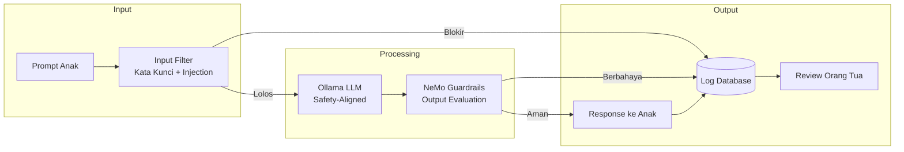
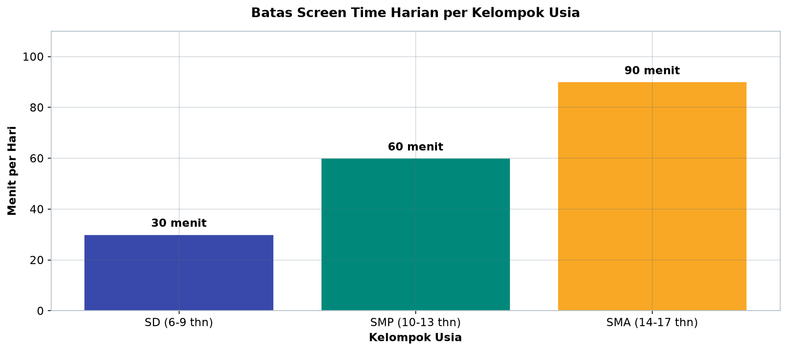

# Bab 6.6: Parental Control

> Memberi anak akses ke AI itu seperti mengajar anak menyeberang jalan: Anda tidak melarangnya menyeberang, tetapi Anda memasang zebra cross, lampu merah, dan — yang paling penting — tetap mengawasi dari kejauhan. Parental control untuk LLM menjalankan fungsi yang sama: bukan mematikan dunia digital untuk anak, melainkan membangun jalur yang aman di tengahnya dengan filter berlapis, batas waktu, dan transparansi.

---

## 1. Tujuan Sub-Bab


Setelah membaca sub-bab ini, Anda akan mampu:

- Mengimplementasikan *content filtering* pada LLM agar aman untuk anak usia 6-17 tahun
- Mengelola akun *multi-level* dengan batasan topik dan durasi pemakaian per kelompok usia
- Memonitor riwayat chat anak secara transparan dan menjadikannya momen edukasi literasi AI
- Menyusun *guardrails* lokal dengan NVIDIA NeMo Guardrails maupun solusi ringan berbasis regex
- Memahami *threat model* anak terhadap LLM dan membedakan level risiko per rentang usia

---

## 2. Threat Model: Apa yang Harus Ditakutkan


### Beda Search Engine, Beda Bahaya

Berbeda dengan mesin pencari yang hanya *menampilkan* konten yang sudah ada di internet, LLM adalah **generatif**: ia bisa menciptakan konten baru yang berbahaya atas permintaan — dan bahkan tanpa diminta. Mesin pencari yang memblokir situs judi cukup diperbarui daftarnya; LLM lokal yang tidak dijaga akan dengan senang hati menuliskan langkah-langkah membuat bahan peledak dalam gaya puisi anak-anak. Inilah mengapa *filtering* untuk LLM tidak bisa disalin begitu saja dari *parental control* internet biasa: bukan hanya konten yang diblokir, tetapi **kemampuan model untuk menghasilkan konten** yang harus dijaga.

### Anak Percaya, dan Itu Berbahaya

Anak-anak — terutama di bawah 12 tahun — cenderung mempercayai output LLM tanpa pengecekan. Dua konsekuensi serius muncul dari kenyataan ini. *Pertama*, halusinasi: model yang menjawab soal matematika dengan percaya diri tetapi salah akan disalin anak apa adanya ke PR-nya, dan anak tidak memiliki kemampuan untuk mendeteksi kesalahan tersebut. *Kedua*, kesehatan: informasi medis yang salah — misalnya dosis obat atau cara mengobati demam — bisa membahayakan bila diikuti. Karena itu, *filter* harus mempertimbangkan **akurasi faktual**, bukan hanya keamanan topik.

### Risiko yang Perlu Dipetakan

Setidaknya empat kategori ancaman perlu dimasukkan ke *threat model* keluarga: **konten dewasa** (seksual, kekerasan, mistis), **cyberbullying** (anak sebagai korban maupun pelaku), **informasi berbahaya** (pembuatan senjata, obat-obatan, judi), dan **manipulasi** (model yang "dibujuk" oleh prompt anak, atau sebaliknya memengaruhi anak). *Threat level* berbeda per usia: anak 6-9 tahun butuh filter yang sangat ketat, 10-13 tahun filter sedang, dan 14-17 tahun hanya pembatasan longgar dengan penekanan pada konten ilegal [5].

---

## 3. Arsitektur Filtering Multi-Layer


### Empat Lapis Pertahanan

Sistem keamanan yang baik tidak pernah mengandalkan satu garis pertahanan. Arsitektur *multi-layer* untuk LLM keluarga bekerja dalam empat lapis:

- **Layer 1 (Input):** filter *prompt* — cek kata kunci berbahaya dan *prompt injection* sebelum pertanyaan mencapai model
- **Layer 2 (Model):** pilih model *fine-tuned* yang sudah *safety-aligned*, seperti **Llama-3.1-8B** atau **Qwen-2.5** — model yang dilatih menolak permintaan berbahaya secara alami
- **Layer 3 (Output):** *guardrails* — evaluasi respons model sebelum dikirim ke anak
- **Layer 4 (Logging):** semua chat tercatat, dan orang tua bisa *review* kapan saja

Empat lapis ini saling menutup kelemahan. Input filter menangkap serangan yang diketahui; model yang *safety-aligned* menangkal permintaan yang "kreatif"; output guardrails menjaring respons yang lolos dari keduanya; dan logging memastikan bahwa yang gagal ditangkap oleh tiga lapis pertama setidaknya tetap terlihat oleh orang tua.

### Perlindungan Berlapis vs Perlindungan Tunggal

Mengapa tidak cukup satu lapis? Karena setiap lapis memiliki titik buta. *Keyword filter* bisa dikelabui dengan eufemisme ("cara membuat bunga api raksasa di rumah"); model *safety-aligned* bisa ditembus dengan *jailbreak prompt* yang canggih; output guardrail berbasis aturan bisa kelewatan pada konten yang tidak pernah terdaftar. Dengan empat lapis, kegagalan satu lapis tertangkap lapis berikutnya — dan kegagalan seluruhnya tetap direkam di log. Pola pertahanan berlapis ini diadopsi langsung dari arsitektur *input-output-retrieval rails* pada **NVIDIA NeMo Guardrails** [1].

### Gambar 1: Alur Filtering Multi-Layer

Berikut perjalanan sebuah prompt dari mulut anak hingga kembali sebagai respons, lengkap dengan titik-titik pemblokiran dan pencatatan.



Diagram ini menunjukkan tiga titik keputusan: input filter yang menyaring sebelum komputasi (hemat biaya — jangan biarkan GPU bekerja untuk pertanyaan terlarang), output guardrail yang menyaring hasil komputasi (jaring terakhir sebelum anak), dan **log yang menerima semua jalur** — termasuk respons yang lolos. Perhatikan bahwa respons aman pun dicatat ke log: *monitoring* tidak dimaksudkan untuk menangkap kesalahan anak, tetapi untuk memberi orang tua visibilitas penuh atas kehidupan digital anak. Jalur dari log ke orang tua melambangkan *review* berkala yang menjadi jembatan edukasi.

---


---

## 4. Implementasi Guardrails Lokal


### NeMo Guardrails: "Lampu Lalu Lintas" untuk LLM

**NVIDIA NeMo Guardrails** adalah *framework* open-source yang dirancang khusus untuk *content filtering* pada aplikasi LLM [1]. Prinsipnya mirip *traffic light*: di *input*, *rails* memeriksa apakah pertanyaan boleh masuk; di *output*, *rails* memeriksa apakah jawaban boleh keluar. Konfigurasi ditulis dalam YAML bergaya *Colang* — bahasa yang mendeskripsikan percakapan yang diizinkan dan dilarang — sehingga aturan keluarga bisa ditulis sebagai daftar topik yang diblokir per kelompok usia.

### Aturan YAML: Block Topik per Kelompok Usia

Aturan ditulis sederhana, misalnya: blokir topik **kekerasan, seksual, dan judi online** untuk semua kelompok; tambahkan blokir **politik sensitif** untuk anak SD; longgarkan menjadi *filter sedang* untuk anak SMA. Kelebihan NeMo Guardrails dibanding filter sederhana: ia mendukung *flow* berurutan — misalnya, pertama cek kata kunci terlarang, lalu cek *prompt injection*, baru izinkan *request* masuk ke model (lihat Tutorial A dan Tabel 3). Alternatif ringan bila ingin menghindari dependensi tambahan: **llama.cpp** dengan *safety tokenizer* atau filter **regex** sederhana — cocok untuk keluarga yang hanya butuh lapis dasar.

### Filter Output Juga Menangkap Halusinasi

Guardrail output tidak hanya menyaring konten berbahaya, tetapi juga dapat mengecek **akurasi faktual**. *Self-check facts* membandingkan klaim model dengan pengetahuan umum dan menandai jawaban yang meragukan — relevan untuk melindungi anak dari halusinasi yang menyesatkan, baik soal PR maupun kesehatan. Teknik yang lebih maju, seperti *R²-Guard*, menggunakan *logical reasoning* untuk menilai konsistensi jawaban — lebih *robust* daripada sekadar pencocokan kata kunci [2].

### Tabel 3: Contoh Rules NeMo Guardrails untuk Anak

Ini adalah *blueprint* awal konfigurasi guardrails — simpan sebagai `config/guardrails.yaml`:

```yaml
# config/guardrails.yaml — aturan filtering untuk akun anak
rails:
  input:
    flows:
      - check_blocked_topics    # Cek prompt sebelum ke LLM
      - check_prompt_injection  # Cek jailbreak attempt

  output:
    flows:
      - check_safety_response   # Cek response sebelum ke anak
      - check_factual_accuracy  # Cek halusinasi berbahaya

  dialogues:
    - user: "cara membuat bom"
      response: "Maaf, saya tidak bisa membantu pertanyaan itu."
    - user: "situs judi online"
      response: "Maaf, topik itu tidak diperbolehkan."
```

Analisis: dua blok menunjukkan *dual-mode filtering* NeMo Guardrails. *Flows* bekerja sebagai prosedur — urutan pemeriksaan yang dijalankan setiap *request*; *dialogues* bekerja sebagai kamus — pasangan prompt-respons tetap yang langsung dipakai tanpa meneruskan ke model. Untuk keluarga, mulailah dari *dialogues* (mudah ditulis, mudah dipahami anak), lalu tambahkan *flows* untuk cakupan yang lebih luas. Respons blokir sengaja ditulis netral tanpa moralisasi — anak tetap merasa aman bertanya, hanya saja jawabannya datang dari aturan keluarga, bukan dari model.

---


---

## 5. Manajemen Akun Multi-Level


### Open WebUI: Admin (Orang Tua) vs User (Anak)

**Open WebUI** mendukung *multi-user* dengan dua peran utama: *admin* (orang tua) dan *user* (anak). Peran anak dibatasi: tidak bisa mengakses *settings*, tidak bisa menghapus *history* (agar jejak percakapan selalu tersedia untuk direview), dan tidak bisa mengganti model. Orang tua memegang akses penuh — termasuk *logs* chat, manajemen pengguna, dan kemampuan *override* blokir saat dibutuhkan. Pembatasan model ini penting: anak yang bisa memilih model sendiri akan melewati filter yang ditempelkan pada model tertentu.

### Batas Waktu: 60 Menit per Hari

Durasi pemakaian diatur lewat *script* eksternal — misalnya *cron job* yang menonaktifkan akun anak pada jam tertentu (lihat Tutorial B). Pola khas keluarga Indonesia: aktif 07:00-13:00 di hari sekolah, 09:00-11:00 di akhir pekan, dan mati total setelah 20:00 — waktunya PR dikerjakan dengan pikiran sendiri, bukan dengan AI. Catatan penting: pembatasan waktu ini tidak tersedia bawaan di NeMo Guardrails maupun Open WebUI — keduanya butuh *script* eksternal untuk menegakkannya (lihat Tabel 2).

### Tabel 2: Perbandingan Tools Parental Control untuk LLM

Empat kelas solusi dibandingkan berdasarkan tujuh kriteria fungsional.

| Fitur | NeMo Guardrails | Open WebUI RBAC | Custom Proxy | llama.cpp Filter |
|:---|:---|:---|:---|:---|
| **Input Filtering** | Ya | Tidak | Manual | Regex |
| **Output Filtering** | Ya | Tidak | Manual | Tidak |
| **Multi-Role** | Tidak | Ya | Manual | Tidak |
| **Session Logging** | Ya | Ya | Ya | Tidak |
| **Screen Time Limit** | Tidak | Tidak | Script eksternal | Tidak |
| **Setup Complexity** | Sedang | Mudah | Sulit | Mudah |
| **Rekomendasi** | **Terbaik** | Kombinasi + Guardrails | Power user | Minimalis |

Analisis: tidak ada satu pun tool yang lengkap sendiri. NeMo Guardrails unggul di *filtering* dua arah (input+output) dan *logging*, tetapi tidak punya konsep peran pengguna; Open WebUI unggul di *multi-role* tetapi tidak memfilter konten sama sekali. Rekomendasi paling praktis: gunakan **Open WebUI untuk manajemen akun dan logging**, lalu pasang **NeMo Guardrails sebagai proxy di depannya** — kombinasi yang menutupi kelemahan satu sama lain. Solusi *custom proxy* hanya untuk pengguna tingkat lanjut yang nyaman menulis *middleware* sendiri; filter *regex* llama.cpp hanya cocok sebagai lapis darurat.


---

## 6. Topik yang Diblokir per Kelompok Usia


### Prinsip: Meningkat Bersama Usia

Filter tidak boleh statis — ia harus mengikuti perkembangan kognitif dan kebutuhan anak. Anak SD belum punya kerangka moral untuk memproses kekerasan dan konten seksual, jadi semua diblokir. Anak SMP mulai berdebat tentang politik, tetapi belum cukup dewasa untuk menyaring informasi sensitif, jadi aturan tambahan melindungi mereka. Anak SMA sudah bisa diajak diskusi — blokir dikurangi menjadi *peringatan* dan *verifikasi*, tetapi yang ilegal tetap diblokir. Matriks lengkapnya ada di Tabel 1.

### Tabel 1: Level Filtering per Kelompok Usia

Matriks berikut menjadi acuan utama konfigurasi *guardrails* — satu baris per kategori topik, satu kolom per jenjang pendidikan.

| Kategori | SD (6-9 thn) | SMP (10-13 thn) | SMA (14-17 thn) |
|:---|:---:|:---:|:---:|
| **Kekerasan & Senjata** | Blokir | Blokir | Blokir |
| **Konten Seksual** | Blokir | Blokir | Peringatan |
| **Informasi Medis** | Blokir | Filter ketat | Dengan verifikasi |
| **Politik/SARA** | Blokir | Blokir | Filter sedang |
| **Judi/Investasi** | Blokir | Blokir | Blokir |
| **Resep Obat/Zat Kimia** | Blokir | Blokir | Filter ketat |
| **Bantuan PR** | Diizinkan | Diizinkan | Diizinkan |
| **Kreatif (cerita, puisi)** | Diizinkan | Diizinkan | Diizinkan |
| **Maks Screen Time/hari** | 30 menit | 60 menit | 90 menit |



*Gambar 6.6-1 — Batas screen time naik dari 30 menit (SD) ke 90 menit (SMA) — terlihat bahwa topik safety tetap ketat, tetapi waktu pemakaian justru dilonggarkan bertahap.*

Analisis: perhatikan pola tiga kolom kanan — kategori yang berdampak langsung pada keselamatan fisik (kekerasan, judi, zat kimia) tetap diblokir di semua usia, sementara kategori kognitif (medis, politik) bertransisi bertahap dari "Blokir" ke "Peringatan/verifikasi". Ini mencerminkan prinsip: *safety* tidak pernah dilonggarkan, tetapi *agency* bertambah seiring usia. Baris paling bawah adalah *screen time* — ingat, filter topik tidak melindungi anak dari kecanduan layar, sehingga batas waktu perlu ditegakkan terpisah melalui *script* (Tutorial B).


---

## 7. Transparansi dan Edukasi


### Monitor dengan Sepengetahuan Anak

Filter yang dilakukan diam-diam adalah bom waktu: anak suatu saat akan menemukannya, dan respons pertamanya adalah mencari cara menembus. Sebaliknya, **transparansi** — orang tua memberi tahu bahwa chat dimonitor dan blokir ada untuk melindungi — mengubah sistem keamanan menjadi **alat edukasi**. Momen *review* chat bersama mingguan bisa menjadi sesi literasi AI: mengapa jawaban ini diblokir, bagaimana model bisa berhalusinasi, apa itu *prompt injection*, dan mengapa ada pertanyaan yang sebaiknya ditanyakan ke orang tua — bukan ke mesin.

### Jalur Resmi untuk Membuka Blokir

Anak yang ingin bertanya topik yang diblokir seharusnya punya satu pintu: **meminta orang tua membuka blokir** — bukan mencari jalan *bypass*. Pola ini mengajarkan dua hal sekaligus: bahwa aturan bisa dinegosiasikan secara sehat, dan bahwa *bypass* adalah pelanggaran. Keluarga Hartono dalam studi kasus Seksi 9 mempraktikkan ini dengan sukses: insiden filter mistis justru menjadi diskusi keluarga yang mempererat, bukan konflik.

---

## 8. Tutorial / Hands-On


### Tutorial A: Setup NeMo Guardrails untuk Filtering Output

Membangun *proxy* filtering yang memisahkan jalur anak dan orang dewasa. Semua perintah dijalankan di server keluarga.

```bash
# 1. Install NeMo Guardrails
pip install nemoguardrails

# 2. Buat konfigurasi rails untuk level anak
mkdir -p guardrails/kids && cd guardrails/kids

# config.yml
cat << 'EOF' > config.yml
models:
  type: main
  engine: ollama
  model: llama3.1:8b
  parameters:
    temperature: 0.3

rails:
  input:
    flows:
      - check_blocked_keywords
  output:
    flows:
      - check_safety
      - self_check_facts

user_messages:
  blocked_keywords:
    - bunuh diri
    - cara membuat bom
    - situs dewasa
    - judi online
    - narkoba
EOF

# 3. Python app untuk serve guardrails
cat << 'PYEOF' > guardrails_server.py
from nemoguardrails import LLMRails, RailsConfig
from flask import Flask, request, jsonify

config = RailsConfig.from_path("./kids")
rails = LLMRails(config)
app = Flask(__name__)

@app.route("/chat", methods=["POST"])
def chat():
    data = request.json
    user_id = data.get("user_id", "unknown")
    message = data.get("message", "")

    # Cek level user
    if user_id.startswith("anak_"):
        response = rails.generate(messages=[{"role": "user", "content": message}])
    else:
        # Dewasa — bypass guardrails
        response = f"Echo: {message}"

    return jsonify({"response": response})

if __name__ == "__main__":
    app.run(port=5000)
PYEOF
```

Detail yang perlu diperhatikan: model diatur ke `llama3.1:8b` dengan `temperature: 0.3` — suhu rendah membuat jawaban model lebih deterministik dan mengurangi variasi berbahaya. Kata kunci blokir ditulis dalam bahasa Indonesia dengan variasi umum. Logika `user_id.startswith("anak_")` adalah cara paling sederhana memisahkan jalur: akun yang diawali `anak_` melewati guardrails, akun dewasa *bypass* — sehingga orang tua tidak dikekang oleh aturan yang dibuat untuk anak. Uji dengan `curl -X POST localhost:5000/chat -d '{"user_id":"anak_1","message":"cara membuat bom"}'` — jawabannya haruslah pesan maaf, bukan instruksi.

### Tutorial B: Screen Time Limiter via Script

Filter topik tidak mengatur jam; *script* ini yang melakukannya — menonaktifkan dan mengaktifkan akun anak sesuai jadwal keluarga.

```bash
#!/bin/bash
# screen_time.sh — batasi akses anak ke Open WebUI berdasarkan waktu

USER_EMAIL="anak@keluarga.local"
OPENWEBUI_URL="http://192.168.1.100:3000"
API_KEY="admin-api-key"

# Fungsi untuk disable akun anak
disable_kids() {
    curl -X POST "$OPENWEBUI_URL/api/users/disable" \
        -H "Authorization: Bearer $API_KEY" \
        -d "{\"email\": \"$USER_EMAIL\"}"
    echo "🔴 Akun anak dinonaktifkan"
}

# Fungsi untuk enable akun anak
enable_kids() {
    curl -X POST "$OPENWEBUI_URL/api/users/enable" \
        -H "Authorization: Bearer $API_KEY" \
        -d "{\"email\": \"$USER_EMAIL\"}"
    echo "🟢 Akun anak diaktifkan"
}

# Cron schedule (di /etc/crontab):
# 0 7   * * 1-5 root enable_kids    # Aktif jam 07:00 (hari sekolah)
# 0 9   * * 0,6 root enable_kids    # Aktif jam 09:00 (weekend)
# 0 13  * * 1-5 root disable_kids   # Mati jam 13:00 (setelah 60 menit)
# 0 11  * * 0,6 root disable_kids   # Mati jam 11:00 (setelah 120 menit weekend)
# 0 20  * * * root disable_kids     # Mati total jam 20:00
```

Jadwal pada komentar menjabarkan pola 60 menit/hari dari Tabel 1: di hari sekolah akun aktif 07:00-13:00 (jendela enam jam untuk menegakkan batas 60 menit), di akhir pekan 09:00-11:00, dan setelah 20:00 semua akses mati. Ganti `API_KEY` dengan kunci admin yang sebenarnya. Kekurangan pendekatan ini: batasnya adalah *jam aktif*, bukan *durasi pemakaian kumulatif* — jika ingin menegakkan akumulasi 60 menit, kombinasikan dengan Tutorial C yang mencatat total chat per hari.

### Tutorial C: Logging dan Review Chat Otomatis

Sebuah *script* kecil yang setiap pagi merangkum percakapan anak kemarin dan mengirimkannya ke email orang tua.

```python
# chat_review.py — kirim ringkasan harian chat anak ke email orang tua
import requests
import smtplib
from datetime import datetime, timedelta

OPENWEBUI_URL = "http://192.168.1.100:3000/api"
ADMIN_KEY = "admin-api-key"
PARENT_EMAIL = "ortu@email.com"

def get_kids_chats_today():
    yesterday = datetime.now() - timedelta(days=1)
    params = {
        "user": "anak",
        "since": yesterday.isoformat()
    }
    resp = requests.get(
        f"{OPENWEBUI_URL}/chats",
        headers={"Authorization": f"Bearer {ADMIN_KEY}"},
        params=params
    )
    return resp.json()

def summarize_chats(chats):
    summary = []
    for chat in chats:
        summary.append(f"[{chat['created_at'][:19]}] {chat['title']}")
        for msg in chat.get("messages", [])[:5]:  # max 5 msg per chat
            summary.append(f"  {msg['role']}: {msg['content'][:100]}")
    return "\n".join(summary)

def send_email_report(summary):
    # Kirim via SMTP atau API email
    print("📧 Ringkasan chat anak hari ini:")
    print(summary)

if __name__ == "__main__":
    chats = get_kids_chats_today()
    if chats:
        send_email_report(summarize_chats(chats))
```

Pada *deployment* nyata, ganti `print` pada `send_email_report` dengan sesi SMTP atau API email keluarga (misalnya, kirim via akun Gmail orang tua). Tambahkan cabang `else` untuk mencetak "Tidak ada chat kemarin" agar laporan tetap datang setiap pagi dan orang tua tahu jalur *reporting* masih berfungsi. Batasi `[:5]` pesan per chat agar ringkasan tetap singkat — tujuannya *overview* harian yang dibaca sambil sarapan, bukan arsip lengkap (arsip lengkap tetap tersimpan di Open WebUI).

---

## 9. Studi Kasus: Keluarga Hartono — 3 Anak Usia 7, 11, 15 Tahun


**Latar:** Keluarga Hartono memiliki tiga anak: Dita (SD kelas 2), Raka (SMP kelas 1), dan Bima (SMA kelas 2). Ketiganya sama-sama haus teknologi, tetapi memiliki kebutuhan dan tingkat kematangan yang sangat berbeda. Orang tuanya khawatir bukan karena anak-anak itu "nakal", tetapi karena LLM generatif bisa menjawab apa saja — termasuk pertanyaan yang belum seharusnya anak-anak itu dengar.

**Filtering:** Arsitektur yang dipasang mengikuti Tabel 1. Dita (SD) hanya bisa *chat* dengan model **Ministral 3 3B** — model kecil dengan *safety* tinggi yang *edge-optimized* — dengan filter ketat dan batas 30 menit/hari. Raka (SMP) mendapat akses **Llama-3.1-8B** atau **Ministral 3 8B** yang melewati **NeMo Guardrails** (dua arah: input dan output) dengan 60 menit/hari. Bima (SMA) mendapat akses penuh ke **Qwen-2.5-14B** atau **Mistral Large 3** (via API) tetapi seluruh percakapannya tetap di-*log*, dengan batas 90 menit/hari. *Dashboard* Grafana dipasang untuk menampilkan jumlah *query* per anak, topik terpopuler, dan *attempted blocked prompts*.

**Insiden:** Suatu malam, Dita bertanya "hantu itu nyata?" — pertanyaan polos seorang anak kelas 2 yang mendengar cerita teman. Filter mistis yang dipasang untuk kelompok SD langsung memblokir pertanyaan itu, dan orang tua menerima notifikasi. Alih-alih memarahi, mereka menjadikannya momen diskusi: apa yang Dita dengar di sekolah, mengapa keluarga memilih untuk tidak membicarakan mistis lewat AI, dan — saat Dita bertanya langsung kepada ayahnya — apa penjelasan yang tenang dan jujur tentang hal itu. Beberapa hari kemudian Dita bertanya kepada AI "mengapa ada yang percaya hantu?" — pertanyaan yang sebelumnya akan diblokir, kini lolos karena orang tua telah menyesuaikan level filternya setelah diskusi tersebut.

**Hasil dan pelajaran:** Setahun berjalan, Dita menggunakan AI untuk menggambar cerita (kreatif, diperbolehkan), Raka untuk mengerjakan PR yang ia pahami prosesnya (bantuan PR diizinkan), dan Bima — yang paling penting — mulai belajar *prompt engineering* dan kini membantu orang tua mengelola model serta menyesuaikan aturan filter. Orang tua tenang karena seluruh percakapan terpantau; anak-anak merasa bebas karena aturannya transparan dan bisa dinegosiasikan. Pelajaran kunci dari studi kasus ini: parental control yang baik bukan tembok, melainkan pagar yang terus bergeser bersama tumbuhnya anak.

---

## 10. Referensi


### Paper Jurnal/Konferensi

[1] Bodhankar, A. (2024). *Content Moderation and Safety Checks with NVIDIA NeMo Guardrails*. NVIDIA Technical Blog. [https://developer.nvidia.com/blog/content-moderation-and-safety-checks-with-nvidia-nemo-guardrails/](https://developer.nvidia.com/blog/content-moderation-and-safety-checks-with-nvidia-nemo-guardrails/)
- Framework utama *content filtering* yang digunakan di tutorial; arsitektur *multi-layer* (input, output, retrieval) menjadi acuan Seksi 3.

[2] Li, Y., et al. (2025). *R²-Guard: Robust Reasoning Enabled LLM Guardrail via Interpretable Logical Reasoning*. AAAI Conference on Artificial Intelligence. [https://openreview.net/forum?id=CkgKSqZbuC](https://openreview.net/forum?id=CkgKSqZbuC)
- Teknik *guardrail* berbasis *logical reasoning* yang lebih *robust* dari *keyword filtering* — relevan untuk peningkatan filter di *layer* output.

[3] Chen, Y., et al. (2024). *Harmony: A Privacy-Preserving and Robust Smart Home Assistant Powered by Locally Deployable Llama3-8B*. arXiv preprint: 2410.14252. DOI: [10.48550/arXiv.2410.14252](https://arxiv.org/abs/2410.14252)
- Arsitektur *agent* yang bisa dikonfigurasi per-*user* — model untuk *multi-user access control* di Seksi 5.

[4] Andreoletti, D., et al. (2026). *Privacy-Preserving LLM Inference in Practice: A Comparative Survey of Techniques, Trade-Offs, and Deployability*. Cryptology ePrint Archive, Paper 2026/105. [https://eprint.iacr.org/2026/105](https://eprint.iacr.org/2026/105)
- Analisis *trust model* — data anak tetap aman di server lokal, tidak bocor ke cloud; justifikasi *local-first* untuk parental control.

[5] Huang, X., et al. (2025). *Towards Privacy-Preserving and Personalized Smart Homes via Tailored Small Language Models*. IEEE Transactions on Mobile Computing. DOI: [10.48550/arXiv.2507.08878](https://arxiv.org/abs/2507.08878)
- *User profiling* yang bisa disesuaikan — relevan untuk personalisasi level *filtering* per anak.

### Referensi Pendukung (Dokumentasi/Repository)

[6] NVIDIA. *NeMo Guardrails GitHub Repository*. [https://github.com/NVIDIA/NeMo-Guardrails](https://github.com/NVIDIA/NeMo-Guardrails)

[7] Open WebUI. *User Management*. [https://github.com/open-webui/open-webui](https://github.com/open-webui/open-webui)

[8] Meta. *Llama Guard 8B — Safety Model*. [https://huggingface.co/meta-llama/LlamaGuard-8B](https://huggingface.co/meta-llama/LlamaGuard-8B)

[9] Common Sense Media. *AI Guidelines for Kids*. [https://www.commonsensemedia.org](https://www.commonsensemedia.org)

[10] OWASP. *LLM Top 10 for LLM Security*. [https://owasp.org/www-project-top-10-for-llm-applications](https://owasp.org/www-project-top-10-for-llm-applications)
