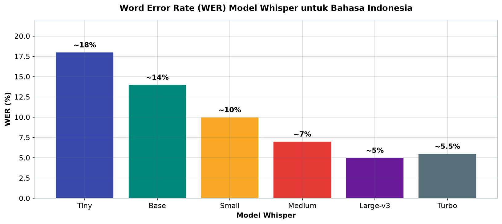
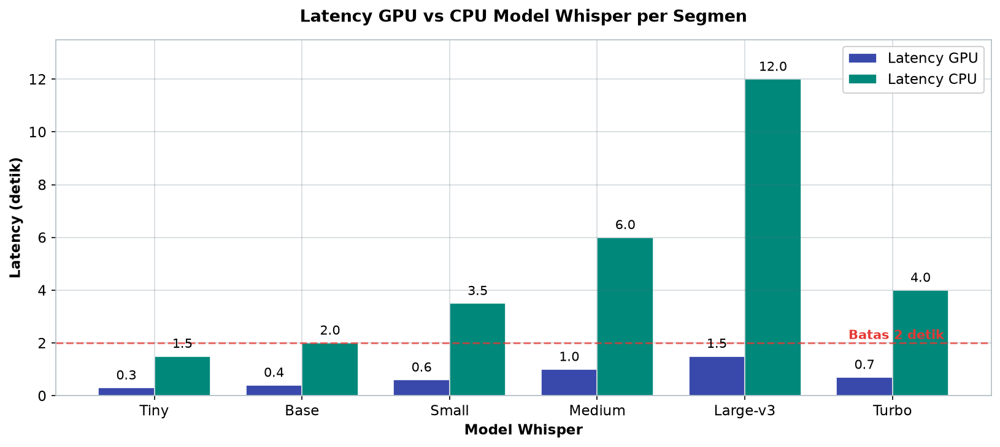
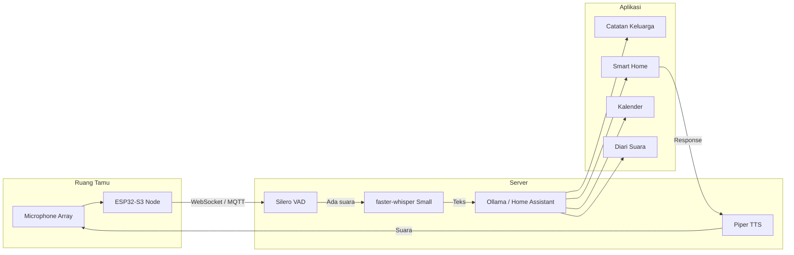

# Bab 6.7: Multimedia AI

> Bayangkan ini: "Bu, ingatkan beli beras!" — diucapkan sambil berlari keluar rumah, dan dua detik kemudian kalimat itu sudah tertulis rapi di catatan keluarga. Tidak ada tombol ditekan, tidak ada aplikasi dibuka, tidak ada data yang melayang ke awan. Inilah janji *voice AI* di ruang tamu: rumah yang mendengar, memahami, dan bertindak — dengan latency sekecil menoleh, karena seluruh proses berjalan di server Anda sendiri.

---

## 1. Tujuan Sub-Bab


Setelah membaca sub-bab ini, Anda akan mampu:

- Menyiapkan pipeline *speech-to-text* real-time dengan Whisper di server rumah
- Mengintegrasikan transkrip suara ke berbagai aplikasi — catatan, *smart home*, *reminder*, diari keluarga
- Mengoptimalkan latensi suara agar terasa natural (*end-to-end* di bawah 2 detik)
- Memilih ukuran model Whisper yang tepat (Tiny hingga Turbo) berdasarkan hardware dan kebutuhan
- Membangun node mikrofon wireless (ESP32-S3) dan server WebSocket untuk audio streaming

---

## 2. Konsep ASR Real-Time di Edge


### Dari Gelombang Suara ke Teks

**Automatic Speech Recognition (ASR)** adalah teknologi yang mengubah audio menjadi teks — dan di antara semua model ASR modern, **Whisper** dari OpenAI adalah bintangnya. Whisper adalah model *transformer* *multilingual* yang dilatih dengan *weak supervision* pada ratusan ribu jam audio, dan — kabar baik untuk keluarga Indonesia — **mendukung bahasa Indonesia secara langsung** [1]. Dengan Whisper, perintah "hidupkan lampu" atau percakapan makan malam bisa ditranskrip tanpa mengonfigurasi bahasa secara manual.

### Real-Time ≠ Streaming

Kesalahpahaman umum: *real-time* berarti transkrip kata-per-kata saat berbicara. Sebenarnya, definisi yang lebih berguna untuk kebutuhan rumah adalah **latensi ujung-ke-ujung di bawah 2 detik** — dari mulut bicara hingga aksi terjadi (atau teks tampil). Streaming *chunk-by-chunk* hanyalah salah satu teknik untuk mencapai itu; pendekatan *segmented* (rekam kalimat, transkrip saat jeda) sering lebih akurat dengan latensi yang hampir sama, seperti akan Anda lihat di Tabel 3.

### Mengapa Lokal Lebih Menang

Menjalankan ASR di server rumah memberi tiga keunggulan sekaligus. **Privasi**: audio keluarga — termasuk percakapan makan malam yang tidak direncanakan — tidak pernah dikirim ke server pihak ketiga. **Latensi**: tanpa perjalanan pulang-pergi ke cloud, respons terasa jauh lebih alami. **Biaya**: tanpa langganan per jam atau per menit; setelah hardware terpasang, transkrip berapa pun gratis. Survei *privacy-preserving LLM inference* menegaskan bahwa menjalankan model di *edge* menghilangkan risiko kebocoran data sekaligus biaya berulang [4].

### Tabel 1: Perbandingan Model Whisper untuk Real-Time

Pilih model dengan mencocokkan prioritas keluarga (kecepatan vs akurasi) terhadap hardware yang tersedia.

| Model | Parameter | Ukuran | WER (ID) | Latency GPU | Latency CPU | RAM | Ideal Untuk |
|:---|:---:|:---:|:---:|:---:|:---:|:---:|:---|
| **Tiny** | 39M | ~75 MB | ~18% | 0.3 detik | 1.5 detik | ~1 GB | Voice command |
| **Base** | 74M | ~140 MB | ~14% | 0.4 detik | 2.0 detik | ~1.5 GB | Command + dictasi |
| **Small** | 244M | ~0.5 GB | ~10% | 0.6 detik | 3.5 detik | ~2 GB | **Sweet spot** |
| **Medium** | 769M | ~1.5 GB | ~7% | 1.0 detik | 6.0 detik | ~4 GB | Transkrip akurat |
| **Large-v3** | 1.55B | ~3.1 GB | ~5% | 1.5 detik | 12 detik | ~6 GB | Akurasi maksimal |
| **Turbo** | 809M | ~1.6 GB | ~5.5% | 0.7 detik | 4.0 detik | ~3 GB | Large quality, small speed |



*Gambar 6.7-1 — WER menurun dari ~18% (Tiny) ke ~5% (Large-v3); Small di ~10% menempati posisi keseimbangan yang menjadi rekomendasi utama untuk rumah.*



*Gambar 6.7-2 — Seluruh model di GPU berada di bawah 2 detik, tetapi di CPU hanya Tiny (1,5 dtk) yang nyaman — GPU-lah penentu pengalaman real-time, bukan modelnya.*

Analisis: dua kolom yang paling menentukan keputusan adalah *Latency CPU* dan *WER*. Jika server keluarga tidak memiliki GPU, hanya Tiny dan Base yang berada di zona nyaman sub-2 detik — dan Tiny dengan WER ~18% masih cukup untuk perintah pendek yang vokabulernya terbatas ("nyalakan lampu", "buat catatan"). Dengan GPU, Small membuka zona akurasi tinggi (~10% WER) dengan latensi hanya 0,6 detik — inilah *sweet spot* yang direkomendasikan di seksi 3. Perhatikan juga kolom RAM: seluruh keluarga Whisper muat di RAM server 16 GB, bahkan dengan LLM pendamping — jadi model bukan pembatas hardware, GPU-lah pembatasnya.


---

## 3. Model Whisper: Memilih Ukuran yang Tepat


### Keluarga Model Whisper

Whisper hadir dalam beberapa ukuran dengan keseimbangan kecepatan-akurasi yang berbeda:

- **Tiny (39M parameter, ~75 MB):** WER ~18%, sangat cepat — ideal untuk *voice command* sederhana
- **Base (74M, ~140 MB):** WER ~14% — kompromi untuk *command* + dikte singkat
- **Small (244M, ~0.5 GB):** WER ~10% — keseimbangan terbaik untuk rumah, dan pilihan utama sub-bab ini
- **Medium (769M, ~1.5 GB):** WER ~7% — untuk transkrip yang butuh akurasi tinggi
- **Large-v3 (1.55B, ~3.1 GB):** WER ~5% — akurasi maksimal, cocok untuk *batch* offline
- **Turbo (809M, ~1.6 GB):** WER ~5.5% — kualitas Large dengan kecepatan Small

Dua peningkatan infrastruktur layak dicatat. **faster-whisper** adalah implementasi ulang Whisper di atas CTranslate2 yang **4× lebih cepat** dari Whisper asli, dengan penggunaan memori lebih kecil. **Whisper Turbo** adalah versi *distilled* yang mempertahankan kualitas Large sambil melaju dengan kecepatan Small.

### Kapan Memilih yang Mana

Aturan praktis untuk rumah: gunakan **Small** sebagai *sweet spot* — akurasinya cukup untuk percakapan normal Indonesia, dan latensinya di GPU hanya ~0,6 detik. Turun ke **Tiny** jika server tidak punya GPU atau jika trafik *voice command* sangat padat; naik ke **Medium/Turbo** jika tujuan utamanya transkrip rapat keluarga atau wawancara yang harus akurat. **Large-v3** hampir tidak pernah diperlukan secara real-time — simpan untuk *batch* file audio di malam hari.

---

## 4. Arsitektur Voice Pipeline untuk Ruang Tamu


### Empat Pilar: Mic, Server, LLM, Output

Pipeline suara ruang tamu terdiri dari empat blok. **Tangkap:** *microphone array* (misalnya MiniDSP UMA-8 dengan 8 mikrofon) atau *node* wireless ESP32-S3 + mikrofon I2S INMP441 yang mengirim audio streaming via **WebSocket**. **Transkrip:** server menjalankan **faster-whisper** + **VAD** (*Voice Activity Detection*) untuk memutuskan kapan seseorang mulai dan selesai bicara. **Pahami & bertindak:** teks diteruskan ke **LLM** (melalui Ollama) yang mengubahnya menjadi aksi — nyalakan lampu, buat catatan, pasang *reminder*. **Ucapkan:** respons dibacakan kembali lewat **TTS** (Piper) atau dijalankan langsung sebagai aksi *smart home*.

### Wake Word: "Hai Rumah"

Agar sistem tidak menyalin seluruh percakapan keluarga sepanjang hari, gunakan **wake word** — kata pemicu yang disadap mikrofon secara kontinu oleh detektor ringan. **openWakeWord** adalah pilihan populer: ringan (~100 MB RAM), berjalan terus-menerus, dan memicu pipeline penuh hanya saat kata seperti "Hai Rumah" terdengar. Dengan *wake word*, biaya komputasi sehari-hari sistem suara mendekati nol.

### Server Tanpa GPU: Mungkin, dengan Syarat

Jalur *CPU-only* tetap bisa berfungsi, tetapi dengan kompromi latensi: Whisper Small di CPU butuh ~3,5 detik per segmen — di atas batas nyaman 2 detik. Solusinya, pilih model yang lebih kecil (Tiny ~1,5 detik), atau gunakan **Ministral 3 3B** sebagai LLM pengolah perintah — hanya butuh ~2 GB RAM dan bisa jalan *CPU-only* dengan latensi di bawah 2 detik. Untuk GPU tersedia, **DeepSeek V4 Flash** dengan konteks 1 juta token bahkan bisa memproses transkrip obrolan keluarga seharian penuh dalam satu *prompt* tanpa kehilangan konteks.

### Tabel 2: Komponen Hardware Voice Pipeline

Perkiraan belanja untuk membangun sisi *input/output* suara rumah.

| Komponen | Fungsi | Rekomendasi | Harga (IDR) |
|:---|:---|:---|:---:|
| **Microphone array** | Tangkap suara ruangan | MiniDSP UMA-8 (8 mic) | ~Rp 1jt |
| **USB microphone** | Alternatif sederhana | Blue Yeti / Fifine | ~Rp 500rb |
| **ESP32-S3 + I2S mic** | Wireless mic node | ESP32-S3 + INMP441 | ~Rp 150rb |
| **Speaker** | Output TTS | Edifier R1280T | ~Rp 600rb |
| **GPU** | Akselerasi Whisper | RTX 3090/4090 | (dari server) |

Analisis: perhatikan bahwa sebagian besar biaya ada di sisi *input* — dan ESP32-S3 + INMP441 di ~Rp 150rb per *node* adalah nilai terbaik untuk rumah yang ingin *multi-room* (tiga ruangan = ~Rp 450rb, masih lebih murah dari satu *microphone array*). MiniDSP UMA-8 unggul bila satu meja makan adalah pusat percakapan — 8 arah berarti siapa pun yang bicara tertangkap jelas. GPU tidak perlu dibeli baru: RTX 3090 yang sudah digunakan server keluarga (lihat Bab 6.8) menjalankan Whisper Small sekaligus LLM tanpa kewalahan.


---

## 5. Optimasi Latency


### VAD: Tahu Kapan Diam Berarti Selesai

Tanpa VAD, sistem tidak tahu kapan sebuah perintah berakhir — ia akan menunggu tanpa batas atau memotong kalimat di tengah. **Silero VAD** dan **WebRTC VAD** memecahkan masalah ini dengan mendeteksi jeda bicara (biasanya ~1 detik diam dianggap akhir kalimat). Ini adalah penghemat latensi terbesar dalam pipeline: tanpa VAD, setiap segmen membawa "ekor diam" yang terbuang.

### Two-Pass: Tiny untuk Memutuskan, Small untuk Menulis

Teknik yang elegan untuk menyeimbangkan kecepatan dan akurasi: **two-pass**. Model Tiny melakukan transkrip cepat untuk memutuskan apakah segmen itu ucapan yang berarti atau hanya suara TV; jika berarti, model Small (atau Turbo) menulis transkrip final. Hasilnya: latensi mendekati Tiny dengan akurasi mendekati Small — kombinasi terbaik untuk *voice command* (lihat Tabel 3).

### Batching dan Transport

Whisper paling efisien saat memproses audio **~30 detik** per batch — lebih panjang justru menambah latensi tanpa manfaat. Untuk transport, **WebSocket lebih cepat dari HTTP polling**: koneksi sekali dibuka, audio mengalir dua arah tanpa *handshake* berulang. Perpaduan VAD + *two-pass* + WebSocket inilah yang membawa latensi turun dari ~6-12 detik (CPU, *single-pass*) menjadi ~0,8 detik di GPU.

### Tabel 3: Perbandingan Pipeline ASR untuk Latency

Empat arsitektur berbeda untuk empat kebutuhan berbeda.

| Pipeline | VAD | Model | Latency (GPU) | Akurasi | Use Case |
|:---|:---:|:---:|:---:|:---:|:---|
| **Two-pass (Cepat)** | Silero VAD | Tiny → Small | 0.8 detik | Tinggi | Voice command |
| **Single-pass (Akurat)** | Silero VAD | Turbo | 1.2 detik | Sangat Tinggi | Transkrip rapat |
| **Streaming (Chunk)** | WebRTC VAD | Tiny | 0.4 detik | Sedang | Quick command |
| **Batch (Offline)** | — | Large-v3 | 2.0 detik | Sangat Tinggi | Transkrip file |

Analisis: baris *Streaming* menunjukkan kecepatan ekstrem (0,4 detik) dengan mengorbankan akurasi — transkrip parsial yang tampil kata-per-kata. *Two-pass* adalah pemenang untuk kebutuhan harian: kecepatan hampir secepat streaming dengan akurasi setara *single-pass*. *Batch* offline bukan pipeline real-time — ia *trade* latensi untuk akurasi maksimal saat memproses rekaman lama atau wawancara. Untuk keluarga yang menginginkan satu pola: jalankan *two-pass* sepanjang hari, dan *batch* Large-v3 seminggu sekali untuk arsip.

---


---

## 6. Multi-Room Audio


### Satu Server, Banyak Telinga

Rumah bukan satu ruangan: mikrofon di ruang tamu, dapur, dan kamar anak bisa berbagi satu server ASR. Setiap *node* memiliki **identifier unik** yang melekat pada aliran datanya, sehingga sistem tahu suara datang dari ruangan mana — berguna saat dua orang bicara bersamaan, atau saat perintah "matikan lampu" harus ditargetkan ke ruangan asal suara. **MQTT** menjadi pilihan transport antar *node* karena *publish-subscribe*-nya yang ringan; WebSocket dipakai untuk aliran audio mentah yang kontinu.

### Musuh Multi-Room: Echo dan Feedback

Dua masalah khas multi-mikrofon adalah *echo* (suara speaker tertangkap mikrofon) dan *feedback* (siulan bernada tinggi). Aturan emasnya: **mute speaker saat pipeline aktif** — sistem yang sedang mendengarkan tidak boleh bersuara, dan sistem yang sedang berbicara (TTS) harus menangguhkan pendengaran. Di arsitektur sederhana, satu jalur *mute* di aplikasi orkestrasi sudah cukup mencegah keduanya.

---

## 7. Aplikasi Transkrip Real-Time


### Empat Guna Utama

Setelah teks mengalir, nilainya bergantung pada aplikasi yang menampungnya:

- **Catatan otomatis:** "Ibu: beli telur di pasar" → tersimpan rapi di notes keluarga
- **Smart home:** "Hidupkan lampu" → aksi Home Assistant, 2 detik kemudian lampu menyala
- **Reminder:** "Ingatkan saya jemput anak jam 3" → masuk kalender bersama notifikasi
- **Diari keluarga:** transkrip obrolan makan malam → arsip mingguan yang bisa dibaca ulang bertahun-tahun

Keempatnya berbagi satu pipeline; yang membedakan hanyalah rute tujuan di lapisan aplikasi — dan semuanya bisa diaktifkan bertahap: mulai dari catatan, lalu *smart home*, baru diari.

### Gambar 1: Pipeline Voice Real-Time

Alur lengkap suara dari ruang tamu hingga aksi di aplikasi keluarga.



Perhatikan dua hal dalam diagram ini. *Pertama*, mikrofon fisik (MIC) dan node wireless (ESP) berada di subgraf "Ruang Tamu" — satu-satunya bagian yang menyentuh kehidupan nyata keluarga — sementara seluruh kecerdasan (VAD, Whisper, LLM, TTS) tinggal di server. *Kedua*, LLM bercabang ke empat aplikasi sekaligus, dan hanya *smart home* yang membutuhkan jalur balik ke TTS (respons suara); catatan dan kalender cukup diam-diam menulis, tanpa perlu "menjawab". Jalur `TTS --> MIC` mungkin tampak aneh di dunia nyata — tujuannya mengingatkan kita pada masalah *echo* dari seksi 6: suara yang keluar dari speaker (MIC di diagram mewakili lokasi fisiknya) harus dimatikan saat mendengarkan.

---


---

## 8. Tutorial / Hands-On


### Tutorial A: Setup faster-whisper untuk Transkrip Real-Time

Pipeline *speech-to-text* siap jalan dengan VAD, transkrip otomatis per kalimat, dan pengiriman hasil ke aplikasi lain. Simpan sebagai `realtime_stt.py`.

```python
# realtime_stt.py — pipeline transkrip suara real-time dengan faster-whisper
import pyaudio
import numpy as np
from faster_whisper import WhisperModel
import webrtcvad
import collections
import threading
import time

# Inisialisasi model Whisper Small (GPU)
model = WhisperModel("small", device="cuda", compute_type="float16")
vad = webrtcvad.Vad(2)  # Aggressiveness 0-3

# Audio config
FORMAT = pyaudio.paInt16
CHANNELS = 1
RATE = 16000
CHUNK = 480  # 30ms per chunk

audio = pyaudio.PyAudio()
stream = audio.open(format=FORMAT, channels=CHANNELS, rate=RATE,
                    input=True, frames_per_buffer=CHUNK)

print("🎤 Mendengarkan... Tekan Ctrl+C untuk berhenti")

buffer = []
silence_counter = 0
MIN_SILENCE = 30  # 30 chunk silent = ~1 detik

def transcribe_audio(audio_chunk):
    """Transkrip chunk audio via faster-whisper"""
    audio_array = np.frombuffer(audio_chunk, dtype=np.int16).astype(np.float32) / 32768.0
    segments, info = model.transcribe(audio_array, language="id", beam_size=5)

    text = " ".join(seg.text for seg in segments)
    if text.strip():
        print(f"📝 [{time.strftime('%H:%M:%S')}] {text}")
        # Kirim ke aplikasi lain via MQTT atau API
        # requests.post("http://localhost:3000/api/transcript", json={"text": text})

try:
    while True:
        chunk = stream.read(CHUNK, exception_on_overflow=False)

        # VAD: deteksi apakah ada suara
        is_speech = vad.is_speech(chunk, RATE)

        if is_speech:
            buffer.append(chunk)
            silence_counter = 0
        else:
            silence_counter += 1
            if silence_counter < MIN_SILENCE and len(buffer) > 0:
                buffer.append(chunk)

        # Jika silent > threshold dan ada buffer, transkrip
        if silence_counter >= MIN_SILENCE and len(buffer) > 0:
            audio_data = b"".join(buffer)
            threading.Thread(target=transcribe_audio, args=(audio_data,)).start()
            buffer = []
            silence_counter = 0

except KeyboardInterrupt:
    print("\n⏹️  Berhenti")
    stream.close()
    audio.terminate()
```

Bongkar tiga bagian kode ini. *Pertama*, `compute_type="float16"` memanfaatkan tensor core GPU — setengah dari memori dan waktu komputasi FP32. *Kedua*, `webrtcvad.Vad(2)` dengan *aggressiveness* 2: nilai 0 terlalu permisif (bising ikut terekam), 3 terlalu agresif (bisa memotong awal kalimat) — 2 adalah titik tengah yang aman untuk ruang keluarga. *Ketiga*, transkrip dijalankan di *thread* terpisah (`threading.Thread`) agar loop pendengaran tidak pernah berhenti meski model sedang memproses kalimat sebelumnya — inilah pola *pipelining* yang menjaga keseluruhan sistem tetap *real-time*. Uji dulu dengan `device="cpu"` jika server belum punya GPU, lalu pindah ke `cuda`.

### Tutorial B: Setup ESP32-S3 sebagai Wireless Microphone Node

Sisi *hardware*: satu node mikrofon wireless yang mengirim audio 16 kHz ke server. Unggah kode ini ke ESP32-S3 dengan Arduino IDE (tambahkan library `WebSocketsClient` dan `I2S`).

```cpp
// esp32_mic_node.ino — ESP32-S3 + INMP441 I2S mic ke server via WebSocket
#include <WiFi.h>
#include <WebSocketsClient.h>
#include <I2S.h>

const char* ssid = "WiFi Keluarga";
const char* password = "password123";
const char* ws_host = "192.168.1.100";  // IP server
const int ws_port = 8765;

WebSocketsClient webSocket;

// I2S config
I2S i2s(INPUT);
const int SAMPLE_RATE = 16000;
const int CHUNK_SIZE = 480;  // 30ms

void setup() {
    Serial.begin(115200);
    WiFi.begin(ssid, password);
    while (WiFi.status() != WL_CONNECTED) delay(500);

    webSocket.begin(ws_host, ws_port, "/audio");
    webSocket.onEvent(webSocketEvent);

    i2s.setDATA(41);  // DIN pin
    i2s.setBCLK(40);  // BCLK pin
    i2s.setMCLK(42);  // MCLK pin (optional)
    i2s.begin(I2S_PHILIPS_MODE, SAMPLE_RATE, 16);
}

void loop() {
    webSocket.loop();

    int16_t buffer[CHUNK_SIZE];
    size_t bytes_read = i2s.readBytes((char*)buffer, CHUNK_SIZE * 2);

    if (bytes_read > 0) {
        webSocket.sendBIN((uint8_t*)buffer, bytes_read);
    }
    delay(10);
}
```

Empat parameter yang harus disesuaikan dengan rumah Anda: SSID dan kata sandi WiFi, IP server (`192.168.1.100` diganti alamat server keluarga), dan tiga pin I2S — `setDATA(41)`, `setBCLK(40)`, `setMCLK(42)` mengikuti konvensi pinout ESP32-S3 standar untuk INMP441, tetapi periksa kembali diagram pin devkit Anda. Perhatikan `CHUNK_SIZE = 480` (30 ms × 16 kHz): ukuran yang sama dengan CHUNK di Tutorial A, sehingga server menerima paket yang sudah sempurna untuk VAD. Tambahkan `delay(10)` dimaksudkan agar loop tidak membanjiri WebSocket; bila audio terputus-putus, kurangi menjadi `delay(1)`.

### Tutorial C: WebSocket Server untuk Menerima Audio

Server penerima yang mengumpulkan paket audio ESP32 dan mentranskripnya setiap 3 detik. Simpan sebagai `ws_audio_server.py`.

```python
# ws_audio_server.py — WebSocket server untuk menerima audio dari ESP32
import asyncio
import websockets
import numpy as np
from faster_whisper import WhisperModel

model = WhisperModel("tiny", device="cuda", compute_type="float16")
audio_buffer = bytearray()

async def handle_audio(websocket):
    global audio_buffer
    print("✅ ESP32 terhubung")
    async for message in websocket:
        audio_buffer.extend(message)

        # Setelah 3 detik audio, transkrip
        if len(audio_buffer) > 48000 * 2:  # 3 detik @ 16kHz 16-bit
            audio_array = np.frombuffer(audio_buffer, dtype=np.int16).astype(np.float32) / 32768.0
            segments, _ = model.transcribe(audio_array, language="id")

            for seg in segments:
                print(f"📝 {seg.text}")
                await websocket.send(f"TRANSCRIPT:{seg.text}")

            audio_buffer = bytearray()

start_server = websockets.serve(handle_audio, "0.0.0.0", 8765)
asyncio.get_event_loop().run_until_complete(start_server)
asyncio.get_event_loop().run_forever()
```

Catatan desain yang penting di sini: server menggunakan model **Tiny**, bukan Small — karena ia bertugas sebagai detektor cepat ala *two-pass* (mendeteksi apa yang dikatakan, secepat mungkin); transkrip final berkualitas Small/Turbo bisa ditambahkan sebagai tahap kedua yang dipicu ketika teks Tiny lolos filter. Konversi `np.int16` → `float32` dengan pembagian `32768.0` adalah standar bagi Whisper yang menerima audio ternormalisasi -1.0..1.0. Batas `48000 * 2` byte setara 3 detik audio 16-bit — modifikasi angka ini untuk mengubah frekuensi transkrip (semakin kecil, semakin cepat tetapi semakin sering terpotong di tengah kalimat).

---

## 9. Studi Kasus: Rumah Keluarga Kusuma — Ruang Tamu dengan Voice AI


**Latar:** Rumah keluarga Kusuma bertipe 36/72 dengan ruang tamu dan dapur terbuka. Lima anggota keluarga aktif berbicara — masalah terbaik yang bisa dimiliki sebuah rumah. Ibu selalu lupa mencatat belanjaan, ayah sering tidak mendengar jeritan "ayah jemput aku jam 3" dari kamar anak, dan lampu ruang tamu selalu menyala karena tak seorang pun mau bangkit dari sofa.

**Hardware dan pipeline:** Dua node **ESP32-S3 + INMP441** dipasang di ruang tamu dan dapur; satu **MiniDSP UMA-8** di meja makan untuk menangkap 8 arah pembicaraan. Server RTX 3090 menjalankan **faster-whisper Small** dengan Silero VAD. Alurnya: ESP32 → WebSocket → VAD → faster-whisper → Ollama → aksi.

**Aplikasi yang hidup:** "Bu, ingatkan beli beras" → tersimpan di notes keluarga. "Hidupkan lampu" → dua detik kemudian lampu ruang tamu menyala. "Ayah, jemput aku jam 3" → notifikasi terkirim ke ponsel ayah. Dan yang paling berharga — transkrip obrolan makan malam dikumpulkan menjadi diari keluarga mingguan, dibaca ulang saat kumpul keluarga besar.

**Hasil dan pelajaran:** Akurasi mencapai ~92% untuk percakapan normal, turun ke ~80% saat TV menyala — penurunan yang wajar dan bisa ditebus dengan *beam size* lebih besar atau model Medium saat dibutuhkan. Latensi rata-rata 1,8 detik dari bicara hingga aksi/TTS — tepat di bawah batas 2 detik yang ditetapkan di seksi 2. Pelajaran utama yang dibagikan keluarga Kusuma: mulailah dari dua aplikasi saja (catatan + lampu), biarkan keluarga terbiasa sebelum menambahkan diari dan reminder — sistem suara yang terlalu banyak fitur di hari pertama justru membuat anggota keluarga enggan berbicara padanya.

---

## 10. Referensi


### Paper Jurnal/Konferensi

[1] Radford, A., et al. (2023). *Robust Speech Recognition via Large-Scale Weak Supervision*. Proceedings of the International Conference on Machine Learning (ICML). DOI: [10.48550/arXiv.2212.04356](https://arxiv.org/abs/2212.04356)
- Paper fundamental Whisper — model ASR *multilingual* yang mendukung bahasa Indonesia; dasar data WER per model di Tabel 1.

[2] Durmus, B., et al. (2025). *WhisperKit: On-device Real-time ASR with Billion-Scale Transformers*. arXiv preprint: 2507.10860. [https://arxiv.org/abs/2507.10860](https://arxiv.org/abs/2507.10860)
- Sistem *on-device* Whisper — latensi 0,46 detik dengan WER 2,2%; arsitektur *streaming encoder-decoder* menjadi acuan pipeline Seksi 4.

[3] Wang, H., et al. (2024). *Simul-Whisper: Attention-Guided Streaming Whisper with Truncation Detection*. INTERSPEECH. DOI: [10.21437/Interspeech.2024-1814](https://arxiv.org/abs/2406.10052)
- Teknik *chunk-based streaming* untuk Whisper tanpa *fine-tuning* — *chunk* 1 detik dengan degradasi WER hanya 1,46%.

[4] Feng, C., et al. (2025). *Edge-ASR: Towards Low-Bit Quantization of Automatic Speech Recognition Models*. arXiv preprint: 2507.07877. [https://arxiv.org/abs/2507.07877](https://arxiv.org/abs/2507.07877)
- Benchmark 8 metode *post-training quantization* untuk Whisper dan Moonshine — *3-bit quantization* masih *viable*; relevan untuk optimasi model di *edge device*.

[5] De Cicco, L., & Mascolo, S. (2025). *Real-Time Speech-to-Text on Edge: A Prototype System for Ultra-Low Latency Communication with AI-Powered NLP*. Information (MDPI), 16(8), 685. DOI: [10.3390/info16080685](https://www.mdpi.com/2078-2489/16/8/685)
- Prototipe STT real-time di *edge* dengan latensi *sub-second* — arsitektur WebSocket menjadi referensi pipeline pada tutorial.

### Referensi Pendukung (Dokumentasi/Repository)

[6] OpenAI. *Whisper GitHub Repository*. [https://github.com/openai/whisper](https://github.com/openai/whisper)

[7] SYSTRAN. *faster-whisper GitHub Repository*. [https://github.com/SYSTRAN/faster-whisper](https://github.com/SYSTRAN/faster-whisper)

[8] Silero. *Silero VAD GitHub Repository*. [https://github.com/snakers4/silero-vad](https://github.com/snakers4/silero-vad)

[9] rhasspy. *Piper TTS GitHub Repository*. [https://github.com/rhasspy/piper](https://github.com/rhasspy/piper)

[10] dscripka. *openWakeWord GitHub Repository*. [https://github.com/dscripka/openWakeWord](https://github.com/dscripka/openWakeWord)
