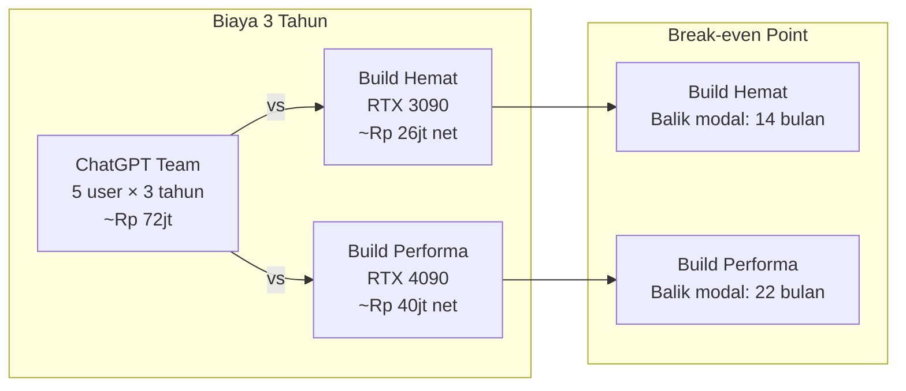

# Bab 6.8: Budgeting Home

> Ada dua cara membeli mobil: mencicil tanpa pernah punya, atau membayar lunas lalu mencicil bensin. Server LLM rumahan adalah pembelian lunas — mahal di depan, murah setelahnya; langganan cloud adalah cicilan abadi — murah di awal, dan tidak pernah berakhir. Sub-bab ini menyediakan kalkulator mental (dan literal) untuk memutuskan mana yang benar untuk keluarga Anda, dengan angka rupiah yang bisa diperiksa lewat tagihan listrik.

---

## 1. Tujuan Sub-Bab

Setelah membaca sub-bab ini, Anda akan mampu:

- Menghitung **total biaya kepemilikan** (TCO) server LLM rumahan dalam 3 tahun — CAPEX hingga OPEX
- Membandingkan biaya LLM lokal versus langganan cloud (ChatGPT, Claude, Gemini) untuk 5 anggota keluarga
- Memahami **break-even point** dan faktor-faktor yang memengaruhi ROI — tarif listrik, jam operasi, nilai jual kembali
- Menyusun build dengan tiga tier anggaran dan menghitung biaya listrik tahunan masing-masing
- Memperhitungkan biaya tersembunyi: UPS, perawatan, upgrade storage, dan kontinjensi

---

## 2. Komponen Biaya Server LLM Rumahan

### CAPEX vs OPEX: Dua Kantong yang Berbeda

Biaya server rumahan terbagi dalam dua kantong. **CAPEX** (*Capital Expenditure*) adalah pengeluaran modal sekali beli: GPU, CPU, RAM, storage, *case*, dan PSU. Ini angka yang besar dan terlihat. **OPEX** (*Operational Expenditure*) adalah biaya operasional tahunan: listrik, internet, penggantian storage, dan *spare part*. Ini angka yang kecil per bulan tetapi berjalan terus — dan justru di sinilah perbandingan lokal vs cloud sering dimenangkan atau dikalahkan. Kerangka *life-cycle cost* semacam ini mengikuti metodologi analisis TCO pada literatur *edge LLM*: biaya total = biaya akuisisi + biaya operasi + biaya pemeliharaan dikurangi nilai sisa [2].

### Biaya Tersembunyi yang Sering Dilupakan

Pembangun server pemula hampir selalu melupakan tiga biaya "hantu": **AC ruangan** (GPU 450W mengubah ruangan server menjadi sauna — ruang ber-AC menambah tagihan yang tidak terlihat di meteran GPU), **UPS** untuk melindungi perangkat keras dari mati listrik mendadak, dan **kabel/alat** kecil yang jumlahnya mengejutkan. Bab ini memasukkan yang paling berdampak ke perhitungan; sisanya dibahas di seksi 6.

---

## 3. Lima Tier Build

### Build Hemat (Rp 25-30 juta)

**RTX 3090 *used* + Ryzen 7 + 32 GB DDR4.** Ini *entry point* yang paling rasional untuk keluarga Indonesia: kartu bekas menawarkan 24 GB VRAM dengan harga jauh di bawah kartu baru, dan kapasitas itu cukup untuk model 7-14B — rangkaian yang mencakup **Ministral 3 8B/14B** yang menjadi andalan RAG keluarga di Bab 6.5. Batasannya: GPU bekas berisiko *wear and tear*, dan hanya satu GPU berarti *upgrade* model besar tidak dimungkinkan tanpa mengulang dari nol.

### Build Performa (Rp 40-45 juta)

**RTX 4090 + Ryzen 7 7800X3D + 64 GB DDR5.** Langkah naik ini membuka kelas model **14-33B** — termasuk Qwen-2.5-14B, Llama-3.1-33B, dan sebagian besar model yang dibahas di jilid ini, cukup cepat untuk *inference* interaktif. DDR5 + X3D juga mempercepat *offload* saat konteks memanjang. Ini adalah build yang paling "tidak akan Anda sesali" dalam 3 tahun — dan studi kasus Seksi 11 memilihnya.

### Build Premium (Rp 55-70 juta)

**Mac Studio M2 Ultra 192 GB.** Pilihan berbeda: *unified memory* 192 GB memungkinkan **model 70B berjalan tanpa kuantisasi** — kualitas penuh yang tidak bisa dicapai build GPU kelas menengah mana pun. Bonusnya, konsumsi daya sangat rendah (~60W rata-rata, lihat Tabel 2) sehingga tagihan listrik tahunan hampir tidak terasa. Kekurangannya: harga tiket masuk tinggi, ekosistem software AI lokal (CUDA) tidak tersedia, dan *upgrade* tidak mungkin sebagian.

### Build Edge Hemat (Rp 8-12 juta)

**NUC/Mini PC + 16 GB RAM.** Pilihan minimalis untuk keluarga yang hanya butuh **Ministral 3 3B/8B secara *CPU-only***. Konsumsi di bawah 30W — hampir gratis dalam hitungan listrik — dan cocok dipasang di rak TV. Ini bukan untuk tugas berat: model 3B tidak akan menjawab soal olimpiade, tetapi untuk *voice command*, catatan, dan otomasi rumah, ia lebih dari cukup (lihat Bab 6.7).

### Build Home High-End (Rp 60-80 juta)

**2× RTX 4090 + Ryzen 9 + 128 GB RAM.** Untuk keluarga yang serius: **DeepSeek V4 Flash** (284B total, 13B aktif) dengan kuantisasi INT4, atau **Mistral Large 3** — kualitas *frontier* di rumah. Konsekuensinya jelas di tagihan listrik: ~350W rata-rata, sekitar Rp 252rb/bulan saja untuk GPU (Tabel 2). Ini investasi untuk pengguna yang benar-benar memakai — *power user* dan programmer keluarga.

Semua build di atas **sudah termasuk komponen pendukung** (case, PSU, storage, networking) — jadi angka yang tercantum adalah angka jadi, bukan harga GPU saja.

---

## 4. Biaya Listrik Tahunan

### Tarif Indonesia dan Pola Pemakaian

Tarif listrik rumah tangga Indonesia berada di kisaran **Rp 1.444 - Rp 1.700 per kWh** tergantung golongan daya. Asumsi yang dipakai seluruh perhitungan sub-bab ini: **Rp 1.500/kWh**, GPU hidup **16 jam/hari** (dimatikan 8 jam saat tidur), dan *duty cycle* pembebanan sekitar 70% idle / 30% load. Perhatikan: GPU *idle* bukan nol watt — RTX 4090 *idle* memakai ~35W, dan beban ini berjalan selama 16 jam meski tidak ada yang bertanya apa-apa.

### Effisiensi per Build

Perbandingan paling jujur ada di Tabel 2, tetapi satu angka layak disebut di sini: **Mac Mini M4 Pro** dengan idle 7W + load 65W menghabiskan sekitar Rp 25rb/bulan — tagihan listrik yang lebih kecil dari satu kali makan keluarga. Sebaliknya **2× RTX 4090** untuk DeepSeek V4 Flash menghabiskan ~Rp 252rb/bulan: lebih dari setahun cloud termurah? Tidak — tetapi angka ini harus masuk kesadaran Anda sebelum membeli hardware kedua.

---

## 5. Perbandingan vs Cloud Subscription

### Harga Langganan Cloud per Keluarga

Ini matematika cloud yang menjadi pembanding seluruh sub-bab. Untuk lima anggota keluarga:

- **ChatGPT Team:** $25/orang/bulan × 5 = $125/bulan ≈ **Rp 2jt/bulan**
- **ChatGPT Plus:** $20/orang/bulan × 5 = $100/bulan ≈ **Rp 1,6jt/bulan**
- **Claude Pro:** $20/orang/bulan × 5 = $100/bulan ≈ **Rp 1,6jt/bulan**

Total cloud 3 tahun untuk 5 pengguna: **Rp 57-72 juta** tergantung tier [9][10]. Angka ini adalah *baseline* — biaya yang sudah dikeluarkan keluarga Anda (atau akan dikeluarkan) tanpa memiliki apa pun di akhir periode.

### Break-Even: Kapan Lokal Menang

Perbandingan jujur tidak berhenti di nominal. *Break-even point* — bulan ketika biaya kumulatif build lokal menyusul biaya cloud kumulatif — untuk **build hemat** tercapai di bulan ke-12 hingga 24, dan untuk **build performa** di bulan ke-24 hingga 30 (lihat Gambar 1). Setelah titik itu, setiap bulan berikutnya adalah penghematan murni. Keluarga yang ragu disarankan mengambil perspektif 3 tahun: dengan rentang hidup GPU 5 tahun, build hemat "membayar dirinya sendiri" dua kali.

---

## 6. Biaya Tersembunyi dan Kontinjensi

### Yang Tidak Muncul di Harga Componen

Di luar CPU dan GPU, ada pos-pos kecil yang wajib dianggarkan:

- **UPS Rp 1-2 juta** (600VA ~Rp 800rb, 1200VA ~Rp 1,8jt): proteksi data dan GPU — mati listrik mendadak dapat merusak komponen mahal [7]
- **Thermal paste + ganti fan:** ~Rp 200rb/tahun — rutinitas yang sering dilupakan sampai suhu GPU menyentuh 80°C
- **SSD upgrade:** ~Rp 1-2jt dalam 3 tahun — model-model baru datang lebih besar dari model lama
- **Internet:** sudah ada — server lokal tidak membutuhkan langganan tambahan
- **Domain?** Tidak perlu — akses via IP lokal dalam jaringan rumah

### Kontinjensi dan Nilai Jual Kembali

Dua angka yang sering absen dari perhitungan pemula: **nilai jual kembali** hardware (asumsikan 30% dari harga beli setelah 3 tahun — GPU bekas tetap laku di pasar Indonesia) dan **kontinjensi** (sisihkan ~10% dari CAPEX untuk pengganti komponen yang gagal dalam garansi). Memasukkan keduanya menghasilkan angka TCO bersih yang jujur, seperti terlihat di Tabel 1.

---

## 7. Nilai Tambah Non-Finansial

### Privasi, Ketersediaan, Edukasi, Kustomisasi

Angka tidak pernah bercerita utuh, dan ada empat nilai yang tidak muncul di kalkulator TCO. **Privasi**: data keluarga — chat, dokumen, audio — tidak dijual atau dipelajari pihak ketiga; survei *privacy-preserving inference* menyoroti bahwa biaya privasi adalah nyata di kedua arah: cloud murah di depan tetapi mahal dalam risiko [4]. **Ketersediaan**: saat internet mati, server tetang melakukan semua yang bisa ia lakukan — fitur yang tidak dimiliki langganan cloud mana pun. **Edukasi**: anak-anak belajar *prompt engineering*, literasi data, dan cara kerja AI di rumah sendiri — nilai pengganti kursus yang bisa puluhan juta rupiah. **Kustomisasi**: model bisa diganti sesuai kebutuhan minggu ini, tanpa negosiasi kontrak.

Apakah nilai-nilai ini pantas dihitung dalam rupiah? Keluarga yang menjawab "ya" cenderung memilih lokal lebih cepat; keluarga yang "tidak" bisa berkonsentrasi penuh pada Tabel 1. Keduanya sah — tetapi kini Anda menghitung dengan dua jenis mata uang sekaligus.

---

## 8. Tabel Referensi

### Tabel 1: TCO 3 Tahun — Build Hemat vs Performa vs Cloud

Tabel ini adalah jantung sub-bab: perbandingan kumulatif tiga opsi untuk lima anggota keluarga.

| Komponen Biaya | Build Hemat (RTX 3090) | Build Performa (RTX 4090) | Cloud ChatGPT Team (5 org) |
|:---|:---:|:---:|:---:|
| **CAPEX Hardware** | Rp 27.000.000 | Rp 45.000.000 | Rp 0 |
| **Listrik/tahun** | Rp 1.800.000 | Rp 2.400.000 | Rp 0 |
| **Subscription/tahun** | Rp 0 | Rp 0 | Rp 24.000.000 |
| **Maintenance/tahun** | Rp 500.000 | Rp 500.000 | Rp 0 |
| **Total Tahun 1** | **Rp 29.300.000** | **Rp 47.900.000** | **Rp 24.000.000** |
| **Total Tahun 2** | Rp 31.600.000 | Rp 50.800.000 | Rp 48.000.000 |
| **Total Tahun 3** | Rp 33.900.000 | Rp 53.700.000 | Rp 72.000.000 |
| **Nilai Jual Kembali (30%)** | -Rp 8.100.000 | -Rp 13.500.000 | Rp 0 |
| **TCO 3 Tahun Bersih** | **~Rp 25.800.000** | **~Rp 40.200.000** | **Rp 72.000.000** |

> Asumsi: tarif listrik Rp 1.500/kWh, GPU hidup 16 jam/hari, cloud ChatGPT Team ($25/user/bulan).

Analisis: baca tabel ini baris per baris dan perhatikan *moral* utamanya. Cloud menang di Tahun 1 (Rp 24jt vs Rp 29,3jt vs Rp 47,9jt) — itulah umpan yang membuat banyak keluarga terjebak *subscription*: tampak murah, padahal belum memiliki apa pun. Di Tahun 3, arah berbalik total: cloud Rp 72jt, build hemat Rp 33,9jt — dan setelah *resale value* dimasukkan, build hemat hanya ~Rp 25,8jt. Artinya: **cloud tiga tahun = hampir 3× build hemat, dan 1,8× build performa**, dengan catatan penting bahwa build lokal tetap menjadi aset fisik di akhir periode. Satu-satunya argumen kuat untuk cloud adalah kebutuhan *frontier model* (yang belum bisa dijalankan lokal) — jika keluarga Anda membutuhkan itu, perlakukan cloud sebagai pelengkap, bukan pengganti.

### Tabel 2: Perbandingan Biaya Listrik per Build

Kalkulasi tagihan listrik tahunan untuk setiap build — data ini paling mudah diverifikasi lewat tagihan PLN bulanan.

| Build | Idle (W) | Load (W) | Rata-rata (W) | kWh/hari | Biaya/bulan | Biaya/tahun |
|:---|:---:|:---:|:---:|:---:|:---:|:---:|
| **RTX 3090 + Ryzen 7** | 80W | 420W | ~180W | 2.88 | ~Rp 130rb | ~Rp 1.56jt |
| **RTX 4090 + Ryzen 7** | 85W | 520W | ~200W | 3.20 | ~Rp 144rb | ~Rp 1.73jt |
| **Mac Mini M4 Pro** | 15W | 85W | ~35W | 0.56 | ~Rp 25rb | ~Rp 300rb |
| **Mac Studio M2 Ultra** | 30W | 150W | ~60W | 0.96 | ~Rp 43rb | ~Rp 516rb |
| **NUC Edge (Ministral 3)** | 8W | 35W | ~15W | 0.24 | ~Rp 11rb | ~Rp 130rb |
| **2x RTX 4090 (DeepSeek V4 Flash)** | 100W | 800W | ~350W | 5.60 | ~Rp 252rb | ~Rp 3.02jt |

> Asumsi: 16 jam operasi/hari, tarif Rp 1.500/kWh. GPU dimatikan 8 jam saat tidur.

Analisis: tiga insight penting. *Pertama*, perbedaan *idle* antar build hampir sama besarnya dengan perbedaan *load* — RTX 4090 yang "idle" (85W) masih mengonsumsi hampir 6× Mac Mini M4 Pro yang sedang bekerja keras (85W vs 15W). *Kedua*, build GPU tidak sefantastis takutannya: ~Rp 130-144rb/bulan setara satu-dua kali belanja pasar mingguan — cukup kecil jika dibandingkan potensi penghematan Rp 4jt/bulan versus cloud di Tabel 1. *Ketiga*, *power management* adalah juru selamat tersembunyi: *auto-shutdown* malam (8 jam mati) menyumbang penghematan ~Rp 50-80rb/bulan pada build GPU — angka yang diwujudkan studi kasus Seksi 11. Konsumsi daya dan kebutuhan *resource* SLM di berbagai perangkat keras ini juga didokumentasikan luas di literatur *edge deployment* [3][5].

### Tabel 3: Estimasi Biaya Tambahan (Opsional)

Pos-pos pelengkap yang menentukan kenyamanan dan umur panjang server — urutkan berdasarkan prioritas.

| Item | Fungsi | Harga (IDR) | Prioritas |
|:---|:---|:---:|:---:|
| **UPS 600VA** | Proteksi mati listrik | ~Rp 800rb | Wajib |
| **UPS 1200VA** | Proteksi + stabilizer | ~Rp 1.8jt | Disarankan |
| **Microphone array** | Voice input | ~Rp 500rb-1jt | Opsional |
| **Smart plug (watt meter)** | Monitoring listrik | ~Rp 200rb | Disarankan |
| **USB microphone** | Voice input awal | ~Rp 300rb | Opsional |
| **NVMe 2TB upgrade** | Storage model | ~Rp 2jt | Saat diperlukan |
| **Fan case tambahan** | Cooling GPU | ~Rp 150rb | Jika suhu > 75°C |

Analisis: klasifikasi prioritas di kolom terakhir mencerminkan urutan rasional belanja: **UPS pertama** (perangkat yang kehilangan data lebih mahal daripada yang kehilangan daya), lalu **smart plug watt meter** (alat yang mengukur tagihan listriknya sendiri — investasi Rp 200rb untuk data yang menghemat jauh lebih besar), lalu *microphone array* jika voice interface direncanakan (Bab 6.7). Perhatikan posisi **fan case**: bukan pembelian awal, melainkan respons terhadap gejala — beli hanya jika suhu GPU terbaca di atas 75°C. Urutan ini menjaga total biaya tambahan tetap di bawah 10% CAPEX kecuali kebutuhan baru muncul.

---

## 9. Diagram & Visualisasi

### Gambar 1: Break-Even Analysis — Lokal vs Cloud

Visualisasi kapan masing-masing build lokal "balik modal" terhadap langganan cloud.



Cara membaca diagram ini: setiap build lokal "menandingi" cloud dalam *duel* biaya 3 tahun (panah `vs`), dan dari duel itu lahir satu angka krusial — bulan *break-even*. Build hemat dengan biaya bersih ~Rp 26jt berhadapan dengan cloud ~Rp 72jt; karena selisih bulanan cloud vs lokal ~Rp 1,85jt, *break-even*-nya jatuh sekitar bulan ke-14. Build performa yang lebih mahal (~Rp 40jt) mundur ke bulan ke-22. Angka-angka ini konsisten dengan rentang yang disebutkan di seksi 5 (12-24 bulan dan 24-30 bulan) — dan keduanya masih di dalam horizon 3 tahun, artinya kedua build lokal "menguntungkan" sebelum garansi kebanyakan komponen berakhir.

---

## 10. Tutorial / Hands-On

### Tutorial A: Kalkulator TCO Lokal vs Cloud

Script interaktif yang menghitung sendiri perbandingan untuk angka keluarga Anda — bukan angka kami.

```python
# tco_calculator.py — hitung TCO server LLM vs cloud
# Jalankan: python tco_calculator.py

def hitung_tco():
    print("=" * 50)
    print("KALKULATOR TCO — LOCAL LLM vs CLOUD")
    print("=" * 50)

    # Input build
    capex = float(input("Total biaya hardware (Rp): ") or "30000000")
    watt_idle = float(input("Daya idle (W): ") or "80")
    watt_load = float(input("Daya load (W): ") or "400")
    jam_per_hari = float(input("Jam operasi/hari: ") or "16")
    tarif_listrik = float(input("Tarif listrik (Rp/kWh): ") or "1500")

    # Input cloud
    user_count = int(input("Jumlah anggota keluarga: ") or "5")
    cloud_per_user = float(input("Biaya cloud/user/bulan (Rp): ") or "200000")

    # Hitung listrik
    watt_rata = (watt_idle * 0.7 + watt_load * 0.3)  # 70% idle, 30% load
    kwh_per_hari = watt_rata * jam_per_hari / 1000
    listrik_per_tahun = kwh_per_hari * 365 * tarif_listrik / 1000

    # TCO lokal 3 tahun
    lokal_tahun = []
    for tahun in range(1, 4):
        if tahun == 1:
            total = capex + listrik_per_tahun
        else:
            total = listrik_per_tahun
        lokal_tahun.append(total)

    # TCO cloud 3 tahun
    cloud_per_tahun = cloud_per_user * user_count * 12
    cloud_tahun = [cloud_per_tahun] * 3

    # Output
    print("\n" + "=" * 50)
    print(f"{'Tahun':<10} {'Lokal (Rp)':<20} {'Cloud (Rp)':<20}")
    print("-" * 50)
    for i in range(3):
        lok = sum(lokal_tahun[:i+1])
        clo = sum(cloud_tahun[:i+1])
        print(f"{i+1:<10} {lok:<20,.0f} {clo:<20,.0f}")

    # Break-even
    lok_kumulatif = 0
    for bulan in range(1, 37):
        if bulan == 1:
            lok_kumulatif += lokal_tahun[0] / 12 + capex / 12
        else:
            lok_kumulatif += lokal_tahun[0] / 12
        cloud_kumulatif = cloud_per_tahun / 12 * bulan

        if lok_kumulatif <= cloud_kumulatif:
            print(f"\n✅ Break-even di bulan ke-{bulan}")
            break

if __name__ == "__main__":
    hitung_tco()
```

Coba tiga skenario: (1) build hemat — `30000000`, `80`, `420`, `16`, `1500`; (2) build performa — `45000000`, `85`, `520`, `16`, `1500`; (3) NUC edge — `12000000`, `15`, `35`, `24`, `1500`. Dua hal yang perlu disadari saat membaca output: *pertama*, model pembebanan 70% idle / 30% load adalah asumsi — ganti dengan angka aktual dari *watt meter* (Tutorial B) setelah sebulan berjalan; *kedua*, script ini belum memasukkan *resale value* — kurangkan 30% CAPEX dari kolom lokal untuk menyamai metodologi Tabel 1. Versi *break-even* di sini juga tidak memasukkan *maintenance* Rp 500rb/tahun; jika ingin presisi penuh, tambahkan ke `listrik_per_tahun`.

### Tutorial B: Monitoring Biaya Listrik Real-Time

Script yang menampilkan biaya listrik GPU secara langsung dari `nvidia-smi` — data nyata, bukan asumsi.

```bash
#!/bin/bash
# monitor_power.sh — monitor pemakaian listrik GPU dan hitung biaya

TARIF=1500  # Rp/kWh

while true; do
    # Ambil power draw GPU dari nvidia-smi
    POWER=$(nvidia-smi --query-gpu=power.draw --format=csv,noheader,nounits | head -1)
    POWER_W=$(echo "$POWER" | cut -d. -f1)

    # Hitung biaya per jam
    KWH=$(echo "scale=4; $POWER_W / 1000" | bc)
    BIAYA_PER_JAM=$(echo "scale=2; $KWH * $TARIF" | bc)

    # Hitung biaya harian (asumsi 16 jam)
    BIAYA_PER_HARI=$(echo "scale=2; $BIAYA_PER_JAM * 16" | bc)

    clear
    echo "=== MONITOR DAYA GPU ==="
    echo "Power draw: ${POWER_W}W"
    echo "Biaya listrik per jam: Rp ${BIAYA_PER_JAM}"
    echo "Biaya per hari: Rp ${BIAYA_PER_HARI}"
    echo "Biaya per bulan: Rp $(echo "$BIAYA_PER_HARI * 30" | bc)"
    echo "Biaya per tahun: Rp $(echo "$BIAYA_PER_HARI * 365" | bc)"
    echo ""
    echo "Tekan Ctrl+C untuk berhenti"
    sleep 5
done
```

Nilai script ini ada di *realisme*: `nvidia-smi` membaca konsumsi GPU yang sebenarnya, sehingga angka "Rp per hari" adalah fakta meteran, bukan estimasi. Dua modifikasi yang disarankan untuk keluarga: tambahkan perintah `nvidia-smi --query-gpu=temperature.gpu` agar suhu ikut tampil (fan case dari Tabel 3 dibeli berdasarkan data ini), dan log hasilnya ke file (`>> /var/log/power.txt`) agar terbentuk dataset mingguan untuk memvalidasi asumsi 70/30 pada Tutorial A. Catatan: script ini hanya menghitung **GPU**, bukan seluruh server — untuk angka total, gunakan *smart plug* di Tutorial C.

### Tutorial C: Setup Smart Plug untuk Monitoring Daya

Memasang *watt meter* digital yang mengubah data konsumsi menjadi biaya rupiah di dashboard Home Assistant.

```yaml
# Di Home Assistant configuration.yaml — monitor daya via smart plug
# Asumsi: smart plug TP-Link HS110

sensor:
  - platform: tplink
    host: 192.168.1.50
    name: "Server LLM Power"

  - platform: template
    sensors:
      server_monthly_cost:
        friendly_name: "Biaya Listrik Server (Bulan Ini)"
        unit_of_measurement: "Rp"
        value_template: >-
          
          {{ (kwh * 1500) | round(0) | int }}
```

Keunggulan *template sensor* di atas dibanding Tutorial B: ia mengukur **seluruh server** (bukan GPU saja) dan mengakumulasikan energi sepanjang bulan, sehingga angka "Biaya Listrik Server (Bulan Ini)" di dashboard adalah tagihan rupiah sebenarnya. Nilai `1500` di baris terakhir harus disesuaikan dengan golongan tarif PLN Anda (Rp 1.444 - Rp 1.700). Kombinasi ketiga tutorial inilah yang membangun *accountability* finansial: Tutorial A menghitung rencana, Tutorial B mengukur GPU, Tutorial C mengukur kenyataan. Sebulan setelah server berdiri, bandingkan ketiganya — perbedaan di antara mereka adalah pembelajaran pertama dalam *budgeting* AI keluarga.

---

## 11. Studi Kasus: Keputusan Investasi Keluarga Firmansyah

**Latar:** Keluarga Firmansyah — lima anggota, dua di antaranya bekerja dari rumah — mengeluarkan **Rp 2,5jt/bulan** untuk AI: ChatGPT Team untuk lima user ditambah Claude untuk satu user. Ayah mulai curiga total tahunannya sudah menyentuh harga laptop baru, dan bertanya: apa yang kami miliki setelah tiga tahun berlangganan?

**Pilihan yang dipertimbangkan:**

- **Opsi A — Lanjut Cloud:** Rp 30jt/tahun × 3 tahun = **Rp 90jt** (dengan asumsi kenaikan harga 10%/tahun)
- **Opsi B — Build Lokal:** Build RTX 4090 ~Rp 45jt + listrik Rp 2,4jt/tahun = **Rp 52,2jt per 3 tahun**

**Keputusan:** Keluarga Firmansyah memilih **Build Lokal**, dengan perhitungan: *break-even* jatuh di bulan ke-20; setelah 3 tahun, penghematan Rp 37,8jt dibanding cloud; setelah 5 tahun, penghematan melampaui Rp 80jt — karena hardware sudah lunas dan yang tersisa hanya listrik. Bonus yang tidak masuk spreadsheet: privasi terjamin, akses *offline*, dan anak-anak belajar AI di rumah sendiri.

**Eksekusi dan hasil:** Build RTX 4090 dibangun dengan anggaran Rp 45jt, dipasangi *smart plug* monitoring, dan dijadwalkan *auto-shutdown* malam. Biaya listrik aktual tercatat **Rp 190rb/bulan** — sedikit di atas estimasi Tabel 2 karena kebiasaan keluarga bertanya sampai larut. Empat anggota keluarga masing-masing menjalankan ~50 *query*/hari tanpa antre. Kepuasan terbesar bukan pada uang: **latensi lokal 2-3 detik vs cloud 5-8 detik** — anak-anak yang dulu bosan menunggu kini mendapat jawaban secepat mereka bisa membaca. Pelajaran kunci dari studi kasus ini: angka cloud di kalkulator mereka murni *subscription* tanpa aset tersisa, sedangkan build lokal menghasilkan aset yang terus memberi nilai setelah bulan ke-20 — dan keluarga yang sadar akan pola itu hampir selalu memilih lokal.

---

## 12. Referensi

### Paper Jurnal/Konferensi

[1] Lu, Z., et al. (2024). *Small Language Models: Survey, Measurements, and Insights*. arXiv preprint: 2409.15790. DOI: [10.48550/arXiv.2409.15790](https://arxiv.org/abs/2409.15790)
- Benchmark 70+ SLM di berbagai perangkat keras — acuan perbandingan *cost-per-token* antar build di Tabel 1.

[2] Qu, Z., et al. (2024). *A Review on Edge Large Language Models: Design, Execution, and Applications*. arXiv preprint: 2410.11845. DOI: [10.48550/arXiv.2410.11845](https://arxiv.org/abs/2410.11845)
- Analisis siklus hidup *edge LLM* — kerangka TCO di seksi 2 merujuk pada metodologi review ini.

[3] Lang, M., et al. (2025). *On-Device LLMs for Home Assistant: Dual Role in Intent Detection and Response Generation*. arXiv preprint: 2502.12923. DOI: [10.48550/arXiv.2502.12923](https://arxiv.org/abs/2502.12923)
- Studi yang membuktikan kelayakan LLM di perangkat 8GB RAM — implikasinya, build hemat Rp 25-30jt sudah cukup untuk kebanyakan kebutuhan keluarga.

[4] Andreoletti, D., et al. (2026). *Privacy-Preserving LLM Inference in Practice: A Comparative Survey of Techniques, Trade-Offs, and Deployability*. Cryptology ePrint Archive, Paper 2026/105. [https://eprint.iacr.org/2026/105](https://eprint.iacr.org/2026/105)
- Analisis *trade-off* biaya: *local deployment* mahal di awal vs cloud murah di awal tetapi mahal jangka panjang.

[5] Lu, Z., et al. (2025). *Demystifying Small Language Models for Edge Deployment*. Proceedings of the 63rd Annual Meeting of the ACL. DOI: [10.18653/v1/2025.acl-long.718](https://aclanthology.org/2025.acl-long.718/)
- Analisis *resource requirements* SLM di *edge* — data RAM, daya, dan *storage* yang menjadi dasar estimasi biaya listrik di Tabel 2.

### Referensi Pendukung (Dokumentasi/Repository)

[6] PLN. *Tarif Tenaga Listrik*. [https://www.pln.co.id](https://www.pln.co.id)

[7] PC Part Picker. *Price Comparison*. [https://pcpartpicker.com](https://pcpartpicker.com)

[8] Tokopedia / Bukalapak. *Harga Hardware Indonesia*.

[9] OpenAI. *ChatGPT Pricing*. [https://openai.com/pricing](https://openai.com/pricing)

[10] Anthropic. *Claude Pricing*. [https://www.anthropic.com/pricing](https://www.anthropic.com/pricing)