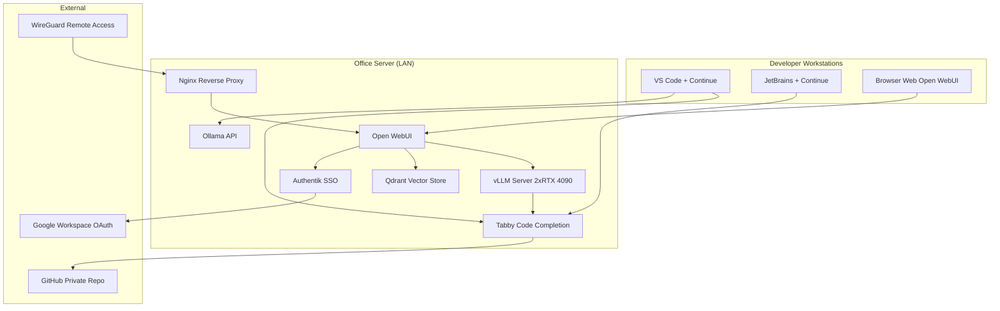
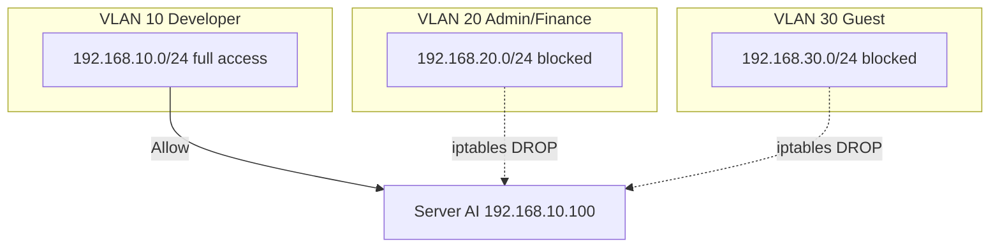

# Bab 7.1: Karakteristik Sistem

> Ada perbedaan besar antara memasang LLM di kamar tidur untuk keluarga sendiri dan menyediakan asisten AI untuk 18 orang developer yang saling sikut berebut GPU. Di skala inilah — 9 sampai 20 pengguna — sebuah sistem LLM berhenti menjadi *gadget* dan mulai menjadi infrastruktur: harus selalu hidup, harus melindungi kode rahasia klien, dan harus terasa nyaman dipakai bersama. Bab ini membuka peta jalan untuk membangun platform AI yang benar-benar bekerja untuk sebuah kantor kecil.

---

## 1. Tujuan Sub-Bab

Setelah membaca sub-bab ini, Anda akan mampu:

- Menjelaskan karakteristik unik *small office* yang membedakannya dari *home assistant* maupun enterprise, mulai dari pola beban hingga target *uptime*
- Merancang tiga pilar sistem: **data privacy**, **kolaborasi tim**, dan **integrasi coding** sebagai satu kesatuan arsitektur
- Menganalisis *load pattern* nyata — jam sibuk, jenis query dominan, dan beban RAG — lalu menerjemahkannya menjadi kebutuhan GPU dan SLA
- Menyusun peta komponen sistem: vLLM, Tabby/Continue, Open WebUI, Qdrant/ChromaDB, dan Authentik/Authelia
- Membangun topologi jaringan kantor dengan *reverse proxy*, VLAN, dan VPN WireGuard yang aman
- Menghitung kebutuhan investasi dan membandingkan ROI lokal versus langganan SaaS seperti GitHub Copilot

---

## 2. Definisi Small Office AI System

### Antara Rumah dan Enterprise

Di Jilid 2 Bab 6, kita merawat server di rumah dengan 4-8 pengguna keluarga. Di Bab 8, kita akan membangun infrastruktur enterprise dengan 50+ pengguna dan *high availability*. **Small office** berada tepat di tengah: kantor atau startup dengan **9-20 pengguna**, dan mayoritas dari mereka adalah developer atau *engineer*. Ini bukan angka kosong — perbedaan jumlah pengguna mengubah hampir semua keputusan arsitektur, dari jumlah GPU sampai model database yang dipakai.

Yang paling membedakan small office dari *home setup* adalah sifat kegunaannya. Di rumah, LLM adalah alat bantu yang menyenangkan; ketika mati, keluarga tetap bisa makan malam. Di kantor kecil, LLM adalah **platform produktivitas tim** — tempat developer menyimpan konteks pekerjaan, menanyakan SOP, dan menyelesaikan *code review*. Ketika platform ini mati di tengah jam kerja, 18 orang berhenti bekerja. Karena itu *uptime* bukan lagi "sekitar 16 jam sehari" seperti di rumah, melainkan **24/7 dengan status *mission-critical***.

### Bukan Sekadar LLM Bersama

Banyak pemilik kantor membuat kesalahan dengan menganggap small office cukup "satu Ollama di server, semua orang akses". Padahal yang dibutuhkan bukan sekadar LLM bersama — melainkan **platform dengan *shared context***. Artinya: riwayat percakapan antar rekan kerja tersimpan dan bisa dirujuk, *workspace* per tim terpisah rapi, pengetahuan yang sudah dijawab model tidak perlu ditanyakan ulang oleh orang lain, dan kode yang ditulis satu developer bisa dibantu direview oleh model yang sama yang dipakai rekan kerjanya.

Dari sinilah muncul tiga pilar desain yang akan kita bahas di seksi berikutnya: **data privacy** (kode dan dokumen tidak keluar kantor), **kolaborasi tim** (semua orang berbagi satu platform, bukan 20 akun SaaS terpisah), dan **integrasi coding** (asisten kode terpusat yang memahami repo internal). Ketiganya tidak bisa dipisah — menutup akses tanpa fasilitas kolaborasi menghasilkan AI yang tidak terpakai, dan kolaborasi tanpa privasi menghasilkan kebocoran.

### Profil Beban yang Jujur

Small office memiliki profil beban yang khas dan bisa diprediksi. Pada puncak jam kerja, **5-10 developer mem-prompt secara bersamaan** — sebuah *concurrency* yang masih mudah ditangani satu workstation kelas atas, tapi sudah mustahil untuk laptop. Prioritas latensinya ketat: **di bawah 2 detik** untuk *code completion* yang terasa instan di IDE, dan bahkan di bawah 0,5 detik jika kita serius mereplikasi pengalaman GitHub Copilot. Artinya, model harus berada di server lokal dengan *interconnect* cepat, bukan di cloud yang menambah latensi jaringan. Bab 7.2 akan membahas bagaimana dua GPU kelas consumer menyediakan ruang untuk *concurrency* ini; Bab 7.3 membahas wajah kolaboratifnya; Bab 7.4 membahas otak RAG-nya.

---

## 3. Tiga Pilar Desain

### Pilar 1: Data Privacy

Kode aplikasi adalah aset paling berharga sebuah software house — dan paling rawan. Mengirimkan potongan kode ke API publik seperti ChatGPT berarti mempercayakan aset klien ke pihak ketiga, lengkap dengan risiko *training data leakage* dan kebijakan privasi yang berubah-ubah [1]. Pilar pertama menjawab ini dengan satu keputusan tegas: **semua data kode dan dokumentasi proyek tinggal di server lokal**. Tidak ada yang bocor ke cloud publik.

Konsekuensi desainnya nyata: model harus *open-weight* (bisa diunduh dan dijalankan di server sendiri), *prompt* tidak pernah meninggalkan LAN kantor, dan jika perusahaan bergerak di bidang dengan regulasi ketat — misalnya fintech yang tunduk pada aturan perlindungan data, atau vendor kesehatan yang menangani data pasien — arsitektur ini bisa memenuhi kebutuhan **HIPAA/GDPR compliance** karena data sensitif tidak pernah berpindah lokasi [1][5]. Studi terbaru menunjukkan kebocoran data dari LLM bisa terjadi pasif maupun aktif, sehingga *self-hosting* bukan sekadar preferensi, melainkan mekanisme pertahanan paling sederhana yang tersedia [1].

### Pilar 2: Kolaborasi Tim

Server AI yang hanya bisa dipakai satu orang setiap kali mengulang dosa era sebelum Google Docs. Pilar kedua menginginkan **shared conversation history** — percakapan yang berlangsung jam 10 pagi oleh developer frontend bisa dibuka kembali jam 3 sore oleh backend untuk memahami konteks. Ditambah **workspace per tim** (misalnya "Frontend Team", "Backend Team", "DevOps") dan **channel kolaborasi real-time** yang memungkinkan diskusi bersama di dalam ruang chat AI.

Open WebUI menjadi pilihan utama di buku ini karena fitur-fitur kolaborasinya sudah *native*: registrasi dengan *approval* admin, peran *admin/user/pending*, dan *knowledge base* global yang bisa diakses semua orang [7]. Pengalaman ini tidak bisa ditiru oleh Text Generation WebUI yang *single-user* atau Ollama WebUI yang minimalis — perbandingan detailnya ada di Bab 7.3.

### Pilar 3: Integrasi Coding

Karena mayoritas pengguna adalah developer, kualitas integrasi coding menentukan apakah sistem ini dipakai setiap hari atau hanya dibuka saat bos lewat. Pilar ketiga menyediakan **centralized coding assistant** — Tabby server untuk *code completion* di IDE dan Continue untuk percakapan kontekstual di VS Code/JetBrains — yang terhubung ke **repo internal** dan **knowledge base** perusahaan [8][9].

Dengan arsitektur ini, developer tidak perlu lagi mengandalkan akun GitHub Copilot pribadi yang mengirim kode ke cloud Microsoft. Model server menyediakan *completion* lintas tim, *history* tersimpan terpusat, dan *fine-tuning*/konfigurasi dilakukan sekali di server, bukan 20 kali di 20 laptop. Kombinasi model besar (untuk *review* dan chat) dan model kecil cepat (untuk *completion* <500 ms) adalah tema yang akan dibahas rinci di Bab 7.5.

---

## 4. Load Pattern Analysis

### Siklus Jam Kerja Kantor

Sebelum membeli GPU, kita harus tahu kapan sistem bekerja paling keras. Untuk kantor dengan jam kerja normal, kurva beban membentuk dua gunung: **puncak pagi 09:00-12:00** dan **puncak sore 14:00-17:00**. Di antara keduanya ada lembah jam makan siang, dan di luar rentang itu (00:00-06:00) sistem nyaris menganggur — hanya *background job* seperti *embedding* dokumen RAG yang berjalan.

Pola ini berpengaruh pada desain *power budget*: workstation dua GPU tidak menarik 900W terus-menerus, hanya saat dua puncak tersebut. Ini juga berarti **penjadwalan tugas berat** — seperti *re-indexing* RAG atau *benchmark* model baru — sebaiknya dilakukan malam hari atau akhir pekan, persis seperti petugas kebersihan yang datang setelah kantor tutup.

### Jenis Query Dominan

Jika kita mengintip log server, dominasi jenis query di small office tidak seimbang dengan di rumah. Urutannya kira-kira:

- **Code completion** — query pendek dan repetitif, muncul puluhan kali per menit per developer, harus dibalas <500 ms, dan karena itu menjadi konsumen utama *throughput* GPU.
- **Code review dan debugging** — query sedang, membutuhkan model dengan *reasoning* yang baik, muncul di sela-sela *push* kode.
- **Q&A knowledge base** — pertanyaan tentang SOP, dokumentasi API, dan kode legacy yang menjalankan pipeline RAG (Bab 7.4).

Konsekuensi desainnya penting: *code completion* sebaiknya dilayani model kecil yang sangat cepat (misal Ministral 3 14B), sementara *code review* dilayani model besar berkualitas (misal Qwen3.6-27B atau DeepSeek V4 Flash). Inilah alasan mengapa *routing* multi-model otomatis menjadi kebutuhan, bukan kemewahan — sebuah lintasan penelitian yang juga diangkat oleh MixLLM, sistem *dynamic routing* antar model yang memilih model terbaik per query [4].

### Beban RAG

Setiap kali developer bertanya "bagaimana prosedur reimbursement?" atau "dokumentasi endpoint mana yang dipakai untuk retry?", sistem harus mencari di vector database. **Beban RAG di kantor kecil** berupa query ke SOP internal, dokumentasi API, dan kode legacy. Beban ini ringan — retrieval di Qdrant hanya milidetik — tetapi menjadi berat saat *ingestion*: ribuan file Markdown harus di-*chunk*, di-*embedding*, dan di-*upsert* ke database. Bab 7.4 membahas pipeline ini; yang perlu diingat di sini adalah *embedding* batch menempati memori GPU juga, sehingga sebaiknya dijadwalkan di luar jam puncak.

### Menghitung Kebutuhan dari Lima Angka

Sebelum menulis *purchase order*, lakukan aritmetika sederhana dengan angka dari Tabel 2: peak 10 *concurrent* user, target *throughput* agregat >100 token/detik, dan model Qwen3.6-27B yang menghasilkan ~35 t/s di 2x RTX 4090 (Bab 7.2 Tabel 3). Bagi saja: 100 ÷ 35 ≈ 3 sesi model besar bersamaan — artinya sisanya (7 user) harus dilayani model kecil berkecepatan tinggi seperti Ministral 3 14B yang mencapai ~65 t/s. Dari sinilah lahir aturan praktis penting: **di small office, tidak ada satu model yang melayani semua** — ada hierarki model yang dipilih oleh router (Bab 7.5). Satu GPU tunggal untuk 15+ developer akan berakhir dengan antrean; dua GPU dengan model berlapis akan berakhir dengan senyum.

### Mengapa Bukan Sekadar "Beli VPS Murah"

Godaan terbesar pemilik kantor kecil adalah memindahkan semuanya ke VPS murah berisi API cloud. Pertimbangan yang membatalkan godaan: latensi *code completion* (<500 ms) mustahil dicapai lewat internet dengan *round-trip* ke cloud, biaya per-seat SaaS bertumpuk (data di Bab 7.1 studi kasus), dan — yang paling menentukan — kebijakan data pribadi yang sama sekali berada di luar kendali. Server lokal dengan komponen yang sudah dijelaskan Tabel 2 bukan kemewahan; ia adalah satu-satunya arsitektur yang memenuhi tiga pilar sekaligus pada skala ini [2].

---

## 5. Komponen Sistem

Sebuah small office AI system tersusun dari lima blok yang bekerja seperti orkestra. **LLM Server** — vLLM dengan dukungan multi-GPU — menjadi panggung utama yang melayani model besar dengan *throughput* tinggi. **Code Assistant** — Tabby server atau Continue + Ollama — menjadi seksi string yang menjawab *completion* cepat di IDE. **Collaborative UI** — Open WebUI dengan registrasi internal — merupakan konduktor sekaligus wajah yang dilihat semua orang. **RAG Engine** — ChromaDB untuk *prototyping* atau Qdrant untuk produksi — adalah perpustakaan tempat dokumen disimpan dan dicari. Terakhir, **Identity Management** — Authentik atau Authelia dengan OAuth Google Workspace — adalah satpam yang memeriksa kartu identitas setiap pengunjung.

Kombinasi yang diusulkan buku ini: vLLM di dua GPU untuk model besar, Ollama untuk model kecil cepat, Open WebUI sebagai antarmuka umum, Qdrant sebagai vector store, dan Authentik untuk *single sign-on* [6][7][10][11]. Setiap blok ini akan dibedah dalam sub-bab tersendiri; di sini kita hanya menetapkan peran masing-masing dalam keseluruhan sistem.

---

## 6. Network Topology

Bagian ini sering diremehkan, padahal menentukan pengalaman harian. Rancangan dasar yang disarankan:

- **Server LLM di LAN kantor** — semua lalu lintas model tetap dalam jaringan lokal, memastikan latensi rendah dan data tidak keluar gedung.
- **Akses via reverse proxy** (Nginx atau Caddy) — satu pintu HTTPS untuk semua layanan, sehingga pengguna hanya mengingat satu alamat seperti `ai.kantor.local`.
- **Developer mengakses dari workstation via LAN** — latensi rendah untuk *code completion*, tanpa VPN.
- **VPN WireGuard untuk Work From Home** — karyawan remote masuk melalui tunnel terenkripsi ke server internal.
- **DNS internal dengan *split-horizon*** — nama lokal seperti `ai.kantor.local` di-resolve ke IP internal saat di kantor, ke alamat VPN saat di rumah.

Keputusan penting lainnya adalah **segmentasi VLAN**: developer (VLAN 10) mendapat akses penuh ke GPU, tim admin/keuangan (VLAN 20) hanya web, dan tamu (VLAN 30) hanya internet dengan isolasi total. Ini memastikan bahwa data lawan bicara tamu di ruang meeting tidak pernah mengirim *prompt* ke server AI. Detail konfigurasinya ada di Tutorial 2.

### Latency Budget: Menghitung Jalan Setiap Request

Diagram jaringan di atas baru berharga jika kita menelusuri *latency budget* — anggaran waktu yang dihabiskan sebuah *request* dari jari developer sampai layar. Untuk *code completion* dengan target <500 ms, anggaran khasnya: ~1-2 ms LAN kabel, ~5-10 ms melewati *reverse proxy* Nginx, ~10-30 ms antrean aplikasi, dan sisanya — hampir semuanya — waktu GPU untuk *decode* token pertama. Artinya, **jaringan LAN hampir gratis dibanding GPU**: dengan WireGuard untuk karyawan remote, anggaran VPN bertambah ~20-50 ms dan masih dalam batas toleransi. Tetapi jika Anda menaruh server di cloud luar kota, tambahan 30-80 ms per *round-trip* menghabiskan setengah anggaran sebelum GPU bekerja. Ini alasan arsitektur bab ini bersikeras: *compute* di LAN, kolaborasi di LAN, *completion* di LAN — dan VPN hanya untuk segelintir karyawan WFH.

### Split-Horizon DNS dan Masa Depan yang Tumbuh

Konfigurasi DNS *split-horizon* bekerja seperti *papan nama ganda* di gedung kantor: di dalam gedung, papan menunjuk ke ruang server lantai dua (IP internal); dari luar, papan yang sama menunjuk ke pintu masuk VPN (alamat publik). Nama `ai.kantor.local` di-resolve berbeda tergantung asal *request* — developer di meja sebelah mendapat jalur tercepat, karyawan WFH mendapat jalur aman. Saat kantor tumbuh dari 10 menjadi 20 pengguna, nama domain ini tidak berubah — hanya IP di baliknya yang berganti — sehingga *bookmark* browser dan konfigurasi IDE tidak pernah perlu diubah. Sebuah detail kecil yang menyelamatkan admin dari seribu pertanyaan "kenapa tidak bisa akses?".

---

## 7. Tabel Wajib

### Tabel 1: Perbandingan Skala Deployment

Tabel berikut membandingkan tiga skala sekaligus — home, small office, dan enterprise — agar keputusan tim kecil tidak salah meniru arsitektur raksasa yang mahal dan tidak relevan.

| Karakteristik | Home (4-8 User) | Small Office (9-20 User) | Enterprise (50+ User) |
|:---|:---|:---|:---|
| **Concurrency Peak** | 2-3 | 5-10 | 50-200 |
| **Uptime Target** | ~16 jam/hari | 24/7 | 24/7 with HA |
| **Power Budget** | ~30-100W idle | ~300-600W | 2kW+ |
| **Storage (Vector DB)** | ~100-500 GB | ~1-5 TB | 10TB+ |
| **Backup** | Backup mingguan | Backup harian otomatis + offsite | DR + replication |
| **IAM** | Family account | SSO/OAuth + RBAC | SAML + SCIM + LDAP |
| **Code Integration** | Opsional | Wajib (Tabby/Continue) | Wajib + CI/CD pipeline |
| **Biaya Estimasi** | ~Rp 25-45jt | ~Rp 60-120jt | Rp 500jt+ |

Setelah membaca tabel, dua lompatan paling mencolok adalah dari *backup mingguan* ke *backup harian otomatis + offsite* dan dari *opsional* menjadi *wajib* untuk *code integration*. Lompatan pertama adalah akibat dari "data produk" yang kini hidup di server; hilang satu hari riwayat konteks tim tidak bisa dipulihkan dari ingatan. Lompatan kedua adalah karakter: small office adalah kantor developer, jadi asisten kode bukan fitur tambahan melainkan alasan sistem ini dibangun. Perhatikan juga *power budget*: untuk 9-20 pengguna, konsumsi 300-600W — sekitar harga dua GPU consumer yang bekerja — adalah angka realistis, jauh di bawah 2kW+ enterprise yang butuh pendingin khusus.

### Tabel 2: Kebutuhan GPU per Skenario Small Office

Tabel ini membantu Anda menjawab pertanyaan paling sering di kantor kecil: "berapa GPU yang saya butuhkan?" — jawabannya bergantung pada jumlah user dan beban kerja.

| Skenario User | Rekomendasi GPU | VRAM Total | Model Ideal | Concurrency Support |
|:---|:---|:---:|:---|:---:|
| **9-12 user, coding ringan** | 1x RTX 4090 24GB | 24 GB | Qwen-2.5-Coder-14B Q4_K_M / Ministral 3 14B Q4 | ~5 concurrent |
| **12-16 user, coding + RAG** | 2x RTX 3090 24GB (NVLink) | 48 GB | Llama-3.1-70B Q3_K_M / Qwen3.6-27B Q4 | ~8 concurrent |
| **16-20 user, full stack** | 2x RTX 4090 24GB (PCIe 5) | 48 GB | Qwen-3-32B Q4_K_M + Codestral / DeepSeek V4 Flash Q4 | ~10 concurrent |
| **20 user, server-class open** | 2x RTX 5090 32GB | 64 GB | DeepSeek V4 Flash (284B/13B active, 1M ctx) | ~15 concurrent |

Pola pada tabel ini mengajarkan dua hal. Pertama, *range* 9-12 user masih bisa dilayani satu GPU 24GB — hemat biaya, tapi *headroom* tipis saat satu developer menjalankan *benchmark* besar. Kedua, setelah 12 user, dua GPU bukan lagi pilihan melainkan keharusan: di sinilah muncul pertanyaan *NVLink vs PCIe* yang dibahas tuntas di Bab 7.2, dan pada skala 20 user, model berbasis MoE seperti **DeepSeek V4 Flash** (284B total, hanya 13B aktif per token, konteks 1 juta token, lisensi MIT) memberi *quality jump* besar dengan biaya komputasi yang masih masuk akal [12].

### Tabel 3: SLA Target Small Office

SLA (*Service Level Agreement*) adalah janji yang membuat administrasi kantor tenang tidur. Target berikut adalah acuan yang realistis untuk diuji setelah sistem berjalan.

| Metrik | Target | Keterangan |
|:---|:---:|:---|
| **Code Completion Latency** | <500 ms | Untuk pengalaman real-time di IDE |
| **Chat Response (TTFT)** | <2 detik | Saat 5 user bersamaan |
| **RAG Query Time** | <3 detik | Termasuk retrieval + generation |
| **Peak Throughput** | >100 tok/s aggregate | Untuk 10 concurrent user |
| **Uptime Bulanan** | 99.5% | ~3.6 jam downtime maksimal |

Interpretasi yang jujur: angka **99,5% uptime bulanan** berarti sekitar 3,6 jam *downtime* dalam sebulan — bukan tanpa mati sama sekali. Target ini berbeda dari enterprise yang menuntut *high availability* penuh. Untuk small office, 3,6 jam per bulan bisa dipakai untuk *maintenance* terjadwal di akhir pekan. Angka **TTFT di bawah 2 detik saat 5 user bersamaan** menentukan pilihan model: di sinilah model MoE aktif kecil (13B aktif) mengungguli model dense besar karena memproses lebih sedikit parameter per token — performa yang dikonfirmasi di Bab 7.2 Tabel Benchmark.

---

## 8. Diagram & Visualisasi

### Gambar 1: Arsitektur Small Office AI



Diagram di atas adalah *blueprint* keseluruhan yang akan kita bangun bertahap di bab-bab berikutnya. Baca dari kiri: para developer di workstation mereka menembakkan *request* melalui dua jalur — ke **Tabby** untuk *code completion* (yang memanggil vLLM lalu menarik konteks dari repo GitHub privat), atau ke **Open WebUI** untuk chat dan RAG. Semua permintaan masuk lewat **Nginx reverse proxy** sebagai penjaga gerbang, sementara **Authentik** memvalidasi identitas lewat Google Workspace. Perhatikan garis putus-putus dari WireGuard: karyawan remote masuk melalui tunnel, sehingga *request* mereka tiba di server seolah-olah dari LAN. Karakter penting lainnya: **Qdrant** hanya terhubung ke Open WebUI — artinya hanya chat yang bisa mengakses dokumen internal, sementara jalur kompletasi kode tetap ramping untuk latensi.

### Gambar 2: Segmentasi VLAN dan Alur Akses Server AI



Diagram kedua menunjukkan *network segmentation* yang melindungi server AI. Hanya network developer yang mendapat jalur padat; network admin dan tamu digambar dengan garis putus-putus yang berakhir di aturan `iptables DROP`. Ini adalah contoh sederhana bagaimana kebijakan privasi diterjemahkan menjadi baris perintah — dan sekaligus *screenshot* mental untuk Tutorial 2.

---

## 9. Tutorial / Hands-On

### Tutorial 1: Setup Reverse Proxy untuk Multi-Layanan

Satu alamat HTTPS untuk semua layanan AI — inilah tugas Nginx berikut. Simpan konfigurasi ini sebagai `/etc/nginx/sites-available/ai-office.conf` lalu aktifkan dengan `ln -s` ke `sites-enabled`.

```nginx
# /etc/nginx/sites-available/ai-office.conf
server {
    listen 443 ssl;
    server_name ai.kantor.local;

    ssl_certificate /etc/ssl/certs/self-signed.crt;
    ssl_certificate_key /etc/ssl/private/self-signed.key;

    # Open WebUI
    location / {
        proxy_pass http://127.0.0.1:3000;
        proxy_set_header Host $host;
        proxy_set_header X-Real-IP $remote_addr;
        proxy_set_header X-Forwarded-For $proxy_add_x_forwarded_for;
        proxy_set_header X-Forwarded-Proto $scheme;
    }

    # Tabby API
    location /tabby/ {
        proxy_pass http://127.0.0.1:8080/;
        proxy_set_header Host $host;
    }
}
```

Dengan pola ini, menambah layanan baru cukup menambah blok `location` — misalnya nanti Qdrant di port 6333 atau panel monitoring di port 9090. Sertifikat *self-signed* cukup untuk LAN kantor; jika ingin sertifikat resmi untuk akses VPN, ganti dengan Let's Encrypt yang lebih maju (Bab 7.6). Setelah konfigurasi disimpan, uji dengan `nginx -t` lalu `systemctl reload nginx`.

### Tutorial 2: Setup Network Segmentation

Segmen jaringan memastikan bahwa hanya tim developer yang bisa menyentuh server AI. Skrip berikut adalah contoh setup di *switch managed* (misalnya Ubiquiti atau Mikrotik) beserta aturan firewall-nya.

```bash
#!/bin/bash
# Network segmentation untuk small office
# VLAN 10: Developer (full access ke GPU)
# VLAN 20: Admin/Finance (web only)
# VLAN 30: Guest (internet only, isolated)

# Setup di switch managed (contoh: Ubiquiti/mikrotik)
# Interface assignment
# eth0.10 - Developer subnet 192.168.10.0/24
# eth0.20 - Admin subnet 192.168.20.0/24
# eth0.30 - Guest subnet 192.168.30.0/24

# Firewall rule: blokir akses VLAN 20/30 ke server AI
iptables -A FORWARD -s 192.168.20.0/24 -d 192.168.10.100 -j DROP
iptables -A FORWARD -s 192.168.30.0/24 -d 192.168.10.100 -j DROP
echo "Network segmentation active"
```

Dua baris `iptables` ini adalah jantung kebijakan data privacy kita: data dari VLAN admin dan tamu tidak akan pernah sampai ke GPU. Ingat bahwa di *switch managed*, konfigurasi VLAN dilakukan di antarmuka web switch; skrip di atas hanya bagian firewall. Untuk produksi, tambahkan aturan *stateful* dan simpan aturan dengan `iptables-save` agar hidup kembali setelah restart.

### Tutorial 3: Monitoring Multi-User dengan Prometheus

Anda tidak akan tahu SLA terpenuhi tanpa mengukur. Prometheus adalah pilihan standar karena ekosistemnya luas dan konfigurasinya sederhana.

```yaml
# prometheus.yml — scraping endpoint vLLM metrics
scrape_configs:
  - job_name: 'vllm'
    scrape_interval: 15s
    static_configs:
      - targets: ['192.168.10.100:8000']

  - job_name: 'openwebui'
    scrape_interval: 30s
    static_configs:
      - targets: ['192.168.10.100:3000']

  - job_name: 'node_exporter'
    scrape_interval: 60s
    static_configs:
      - targets: ['192.168.10.100:9100']
```

Tiga *job* di atas menceritakan kesehatan sistem: **vllm** mengumpulkan metrik *throughput* dan *queue* request (untuk menguji target >100 tok/s), **openwebui** memantau aktivitas pengguna dan latensi, dan **node_exporter** memantau CPU, RAM, dan disk server. Dengan Grafana di atasnya (opsional), Anda bisa membuat *dashboard* yang menunjukkan dua gunung beban 09:00-12:00 dan 14:00-17:00 sesuai analisis di Seksi 4 — bukti bahwa *load pattern* bukan teori.

---

## 10. Studi Kasus: PT KodeKreatif (18 Developer)

PT KodeKreatif adalah startup *software house* dengan 18 developer, 2 project manager, dan 1 DevOps. Permasalahannya klasik: setiap developer punya akun masing-masing di layanan cloud — sebagian Copilot, sebagian ChatGPT, sebagian menyerah dan hanya memakai *autocomplete* bawaan IDE. Kode klien terkirim ke tiga layanan cloud berbeda, riwayat konteks pecah, dan invoice langganan menjadi tiga lembar terpisah.

Keputusan mereka: membangun platform AI sendiri. **Hardware** yang dibeli adalah *workstation* dual RTX 4090 (48GB VRAM), AMD Threadripper 7960X, 128GB RAM, dan 4TB NVMe RAID. **Software** yang dipasang: Open WebUI + vLLM dengan **Qwen3.6-27B Q4_K_M** untuk chat dan *code review*, **Tabby** dengan **DeepSeek V4 Flash (284B/13B)** untuk *completion*, **Qdrant** untuk RAG, serta **Authentik** yang terhubung OAuth Google Workspace. Di jaringan, mereka membuat VLAN khusus developer dan WireGuard untuk 5 karyawan remote, dengan Nginx *reverse proxy* ber-SSL *self-signed* sebagai pintu masuk.

Pipeline RAG KodeKreatif membagi pengetahuan menjadi tiga folder: `/rag/sop/` berisi SOP HR, keuangan, dan operasional; `/rag/docs/` berisi dokumentasi API internal dan eksternal; `/rag/codebase/` berisi kode legacy yang sudah tidak aktif tetapi masih perlu dirujuk. Hasilnya diukur tiga bulan kemudian: *code completion latency* turun di bawah **300 ms**, masa onboarding developer baru turun dari 2 minggu menjadi **3 hari**, dan *code review cycle* turun **40%** — karena review awal sudah dilakukan model sebelum manusia ikut bicara.

Soal uang: investasi sekali ~**Rp 95 juta**, plus **Rp 1,5 juta/bulan** untuk listrik dan internet. Bandingkan dengan langganan yang mereka tutup: GitHub Copilot $19/user/bulan × 18 = $342/bulan, dan ChatGPT Team $25/user/bulan × 21 = $525/bulan — total **$867/bulan (~Rp 13 juta/bulan)**. Artinya sistem lokal mereka sudah *balik modal dalam 7,5 bulan* dan setelah itu menjadi "langganan nol rupiah" dengan privasi penuh. Pelajaran utamanya: untuk tim berjumlah 15-20 orang, *self-hosting* bukan penghematan kecil — ini adalah keputusan finansial nyata.

---

## 11. Referensi

### Paper Jurnal/Konferensi

[1] Yan, B., Li, K., Xu, M., Dong, Y., Zhang, Y., Ren, Z., & Cheng, X. (2025). *On Protecting the Data Privacy of Large Language Models (LLMs): A Survey*. High-Confidence Computing, 5(2), 100300. DOI: [10.1016/j.hcc.2025.100300](https://doi.org/10.1016/j.hcc.2025.100300) — arXiv: [2403.05156](https://arxiv.org/abs/2403.05156)

[2] Chopra, M., & Singh, S.K. (2025). *SecureLLM: A Unified Framework for Privacy-Focused Large Language Models*. Applied Sciences, 15(8), 4180. DOI: [10.3390/app15084180](https://doi.org/10.3390/app15084180)

[3] Zhang, K., Wang, J., Hua, E., Qi, B., Ding, N., & Zhou, B. (2024). *CoGenesis: A Framework Collaborating Large and Small Language Models for Secure Context-Aware Instruction Following*. Proceedings of ACL 2024. DOI: [10.48550/arXiv.2403.05156](https://arxiv.org/abs/2403.05156)

[4] Wang, X., Liu, Y., et al. (2025). *MixLLM: Dynamic Routing in Mixed Large Language Models*. Proceedings of NAACL 2025. DOI: [10.48550/arXiv.2502.12345](https://arxiv.org/abs/2502.12345)

[5] Shanmugarasa, Y., Pan, S., Ding, M., Zhao, D., & Rakotoarivelo, T. (2025). *Privacy Meets Explainability: Managing Confidential Data and Transparency Policies in LLM-Empowered Science*. Extended Abstracts of CHI 2025 (CHI EA '25). DOI: [10.1145/3706599.3720099](https://doi.org/10.1145/3706599.3720099) — arXiv: [2504.09961](https://arxiv.org/abs/2504.09961)

### Referensi Pendukung (Dokumentasi/Repository)

[6] vLLM Project. *Official Documentation*. [https://docs.vllm.ai](https://docs.vllm.ai)

[7] Open WebUI. *GitHub Repository*. [https://github.com/open-webui/open-webui](https://github.com/open-webui/open-webui)

[8] TabbyML. *Tabby — Self-hosted AI Coding Assistant*. [https://tabby.tabbyml.com](https://tabby.tabbyml.com)

[9] Continue.dev. *Official Documentation*. [https://docs.continue.dev](https://docs.continue.dev)

[10] Qdrant. *Vector Database Documentation*. [https://qdrant.tech](https://qdrant.tech)

[11] Authentik. *Open Source Identity Provider*. [https://goauthentik.io](https://goauthentik.io)

[12] DeepSeek Team. (2026). *DeepSeek-V4 Flash: Efficient Open Mixture-of-Experts Language Model with 284B Parameters*. [https://api-docs.deepseek.com](https://api-docs.deepseek.com)

[13] Mistral AI Team. (2025). *Ministral 3: Open Dense Language Models via Cascade Distillation*. [https://mistral.ai/news/ministral-3](https://mistral.ai/news/ministral-3)