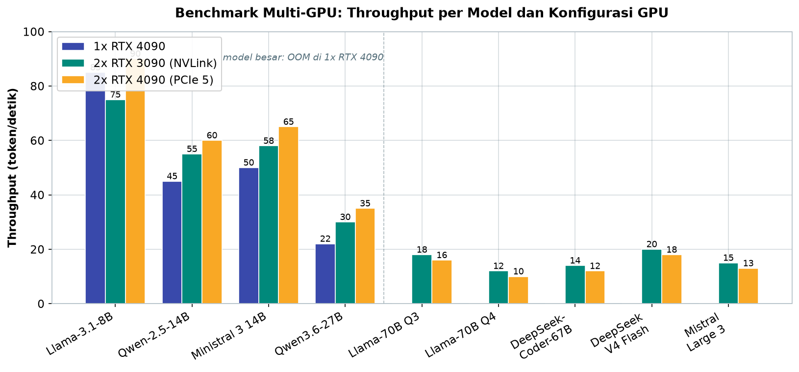
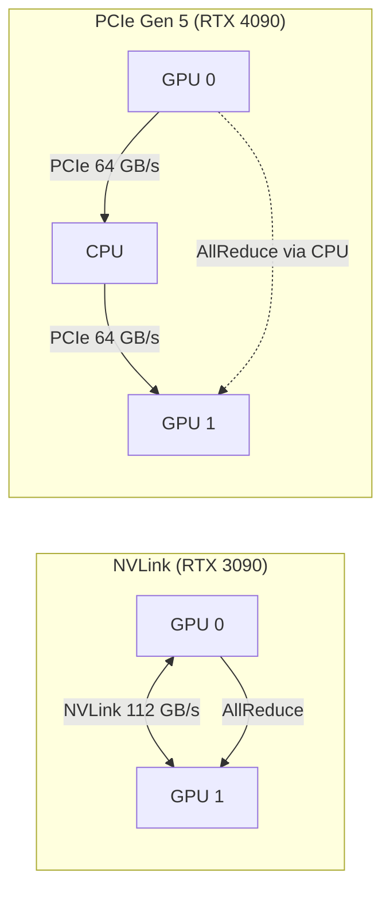
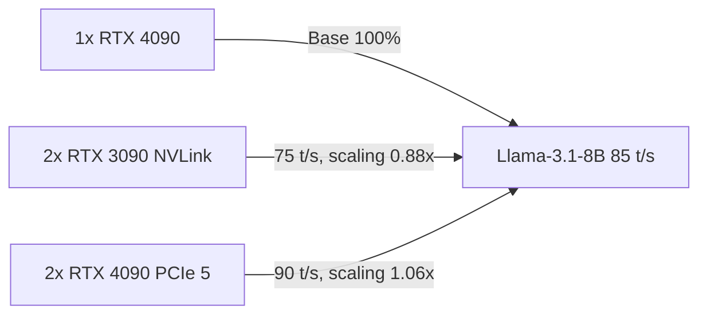

# Bab 7.2: Hardware

> Dua GPU di satu workstation terdengar seperti perlengkapan *rig* penambangan kripto, bukan kantor kecil. Tetapi di tahun 2026, kombinasi 2x RTX 3090 atau 2x RTX 4090 inilah yang mengubah ruang server mungil menjadi rumah bagi model 70 miliar parameter — kualitas yang lima tahun lalu hanya ada di cloud raksasa. Bab ini membahas cara memilih, merakit, dan mengukur workstation multi-GPU: dari seluk-beluk NVLink sampai kicauan kipas saat pendinginan kewalahan. Di akhir bab, Anda akan tahu jawaban atas tiga pertanyaan yang sama sering ditanyakan di *meeting* perencanaan: kartu apa, berapa kartu, dan untuk model apa.

---

## 1. Tujuan Sub-Bab

Setelah membaca sub-bab ini, Anda akan mampu:

- Memilih konfigurasi multi-GPU yang tepat untuk 9-20 user di kantor kecil, berdasarkan model yang ingin dijalankan
- Menjelaskan perbedaan NVLink dan PCIe Gen 5 serta dampaknya pada *tensor parallelism* dan *pipeline parallelism*
- Merakit workstation dual-GPU dengan motherboard, PSU, dan *cooling* yang benar sesuai anggaran Rp 60-120 juta
- Memverifikasi interkoneksi GPU di Linux dan menguji *bandwidth* GPU-to-GPU dengan NCCL
- Mengonfigurasi vLLM dengan `--tensor-parallel-size 2` atau `--pipeline-parallel-size 2`
- Memantau temperatur, daya, dan utilisasi memori kedua GPU selama produksi

---

## 2. Mengapa Multi-GPU?

### Masalah Satu Kartu yang Kurang

Sejak kuantisasi Q4_K_M menjadi standar praktis, model 70 miliar parameter menuntut sekitar **40 GB VRAM** — lebih besar dari VRAM satu kartu consumer mana pun pada 2026. Di sinilah *multi-GPU* memasuki cerita. Solusi paling ekonomis di pasar: **2x RTX 3090 (48 GB total)** atau **2x RTX 4090 (48 GB total)** — cukup untuk model 70B Q4_K_M beserta *KV cache* yang dibutuhkan untuk *concurrency* 5-10 user.

Perbandingan biaya di pasar Indonesia membuat pilihan ini hampir tanpa debat: **2x RTX 3090 bekas sekitar Rp 30 juta** dibanding **1x RTX 4090 baru sekitar Rp 28 juta** — dengan selisih kecil, Anda mendapat VRAM dua kali lipat. Inilah hukum ekonomi kecil yang membalik intuisi: kadang dua kartu generasi sebelumnya lebih masuk akal daripada satu kartu generasi terbaru.

### Kapan Satu GPU Sudah Cukup?

Kejujuran arsitektur menuntut kita mengakui: tidak semua kantor butuh dua kartu. Kembali ke Tabel 2 Bab 7.1 — untuk **9-12 user dengan *coding* ringan**, satu RTX 4090 24 GB dengan model 14B (Ministral 3 14B atau Qwen-2.5-Coder-14B) melayani ~5 pengguna bersamaan dengan latensi excellent, dan *power budget* turun setengah. Dua GPU baru wajib ketika: (1) jumlah user lewat 12 dan *concurrency* melewati ~8, (2) tim mulai menuntut model 70B untuk *reasoning* berat, atau (3) model besar dan *code completion* harus berjalan bersamaan tanpa saling berebut. Membeli kartu kedua sebelum kebutuhan itu muncul hanya menambah biaya listrik dan kebisingan — keputusan *upgrade* yang baik selalu didahului pengukuran antrean vLLM, bukan perasaan "biar keren".

### Pasar GPU Bekas: Kebijaksanaan dan Risikonya

RTX 3090 bekas adalah tulang punggung *budget build* kantor kecil, tetapi pembeliannya menuntut disiplin *inspeksi*: jalankan *stress test* (FurMark atau `nvidia-smi --loop` dengan beban) sebelum *transfer*, cek riwayat *mining* lewat kondisi *thermal* dan suara kipas, dan pastikan *power connector* tidak menghitam. Ingat: kartu bekas garansi pabriknya sudah mati — jadikan upah tukang *overhaul* (ganti pasta, bersihkan kipas) bagian dari anggaran ~Rp 300-500 ribu. Dengan disiplin ini, dua 3090 bekas yang dirawat baik tetap menjadi pembelian paling rasional di kelas Rp 60 juta — dan Studi Kasus di akhir bab ini adalah bukti nyatanya.

### Dari Satu ke Dua: Paralelisme

Menjalankan model di dua GPU menuntut strategi pembagian kerja. Ada dua pendekatan utama. **Tensor parallelism** memecah *weight matrix* model menjadi irisan-irisan horizontal dan membaginya ke semua GPU sekaligus — setiap token diproses bersama-sama oleh kedua GPU, sehingga butuh pertukaran data yang sangat intensif dan *interconnect* cepat [1]. **Pipeline parallelism** membagi model secara vertikal: lapisan pertama di GPU 0, lapisan berikutnya di GPU 1 — data mengalir berurutan, pertukaran antar GPU hanya terjadi di batas lapisan, sehingga tidak butuh *interconnect* secepat tensor parallelism [4].

Analogi *dapur* paling pas di sini: *tensor parallelism* seperti tiga juru masak mengolah satu hidangan bersama-sama di tiga meja yang saling terhubung konveyor; *pipeline parallelism* seperti tiga rantai produksi di mana hidangan berpindah meja secara berurutan. Yang pertama lebih cepat untuk satu hidangan, tetapi menuntut dapur terhubung rapat. Dua babak ini menentukan pilihan hardware — dan di sanalah NVLink berperan.

---

## 3. Interconnect: NVLink vs PCIe Gen 5

### NVLink: Jalur Cepat Khusus GPU

**NVLink 3.0** di RTX 3090 adalah jembatan khusus GPU-ke-GPU dengan *bandwidth* **112,5 GB/s bidirectional** dan latensi sangat rendah, dihubungkan lewat *bridge* fisik berharga sekitar $80-120. Untuk *tensor parallelism*, NVLink memberikan *scaling* **1,6-1,7x** terhadap performa satu GPU. Penting dan sedikit menyedihkan: **RTX 3090 adalah GPU consumer terakhir yang mendukung NVLink** — RTX 4090 dan RTX 5090 tidak memilikinya sama sekali. Jika Anda membeli kartu generasi terbaru, jalur cepat ini hilang.

### PCIe: Jalan Umum yang Semakin Lebar

Tanpa NVLink, kedua GPU berkomunikasi melalui jalur PCIe yang ikut melewati CPU. **PCIe Gen 5** dengan konfigurasi x8/x8 menawarkan **64 GB/s bidirectional**; dengan motherboard kelas workstation (TRX50/W790) yang memberi x16/x16, bandwidth naik ke **128 GB/s** — hampir menyentuh kapasitas jembatan NVLink, meski latensinya tetap lebih tinggi karena rute melewati CPU.

Dampaknya pada praktik: untuk *tensor parallelism*, NVLink unggul **40-60%** dibanding PCIe. Namun untuk *pipeline parallelism*, **PCIe Gen 5 sudah mencukupi** dengan *penalty* hanya 5-10%. Artinya pemilik RTX 4090/5090 dapat tidur tenang selama memilih strategi paralelisme yang tepat: tensor di PCIe boleh-boleh saja, pipeline di PCIe justru optimal.

### Keputusan yang Paling Penting

Ringkasnya, hierarki keputusan untuk kantor kecil:

1. Jika memakai **RTX 3090 bekas** — beli *NVLink bridge* bekas (~$80), gunakan tensor parallelism, dapatkan *scaling* terbaik.
2. Jika memakai **RTX 4090/5090** — tidak ada NVLink; gunakan tensor parallelism lewat PCIe 5.0 x16/x16 (motherboard TRX50/W790) atau, bila hanya x8/x8, pertimbangkan pipeline parallelism agar *penalty* tetap kecil.
3. Selalu verifikasi dengan pengukuran NCCL *benchmark* — bukan dengan perasaan — apakah konfigurasi Anda benar-benar memberikan *scaling* yang diharapkan (Tutorial A).

---

## 4. Kompatibilitas Motherboard

### Jalur PCIe: x8/x8 vs x16/x16

Motherboard menentukan berapa banyak jalur PCIe yang tersedia untuk kartu-kartu Anda. Board *consumer* seperti **Z790/X670E** menawarkan 16+4 lane; dua GPU memaksa split menjadi **x8/x8** — ada *penalty bandwidth* yang nyata untuk tensor parallelism. Board *workstation* seperti **TRX50/W790** membuka 64+ lane sehingga dua GPU mendapat **x16/x16 penuh** — ini rekomendasi untuk *production*, karena komunikasi antar GPU tidak berebut dengan NVMe dan kartu jaringan.

### BIOS: Dua Saklar yang Wajib

Ada dua pengaturan BIOS yang sering dilupakan dan menyebabkan performa aneh: **Above 4G Decoding** dan **Resizable BAR**. Keduanya wajib diaktifkan sebelum membuat server. Resizable BAR membiarkan CPU mengakses seluruh VRAM kartu sekaligus alih-alih potongan 256MB — dampaknya pada *inference* kecil tetapi nyata, dan banyak *firmware* vLLM mengasumsikannya aktif. Gagal mengaktifkan ini adalah alasan paling umum "kenapa dual GPU saya lebih lambat dari single GPU".

---

## 5. PSU dan Cooling

### Tenaga: Jangan Pelit di Sini

Dua RTX 3090/4090 berarti total **TDP 700-900W** hanya untuk kartu. Tambahkan CPU yang *boost* hingga 200W dan komponen lain, dan Anda berada di kisaran 1.000W nyata. Aturan praktis: **PSU 1200W+ dengan sertifikasi Gold atau Platinum** — bukan Bronze yang toleransi voltasenya longgar. Studi kasus di akhir bab ini menceritakan tim yang hampir gagal karena PSU 1200W yang "cukup" ternyata nyaris tidak cukup *di atas kertas*; pelajaran keduanya adalah selalu sisakan *headroom* 30%.

### Dingin: Musuh Nomor Satu

*Thermal throttling* adalah musuh terbesar *uptime*. Dua kartu 350W dalam satu *chassis* adalah dua kompor menyala di satu dapur — dan dapur harus dirancang untuk itu. Rekomendasi: *airflow case* besar seperti Fractal Meshify atau Lian Li dengan keseimbangan *intake* dan *exhaust* yang jelas (panas naik dan keluar, bukan berputar di dalam), atau *custom water cooling* bagi yang serius mengejar senyap dan suhu stabil. Monitor temperatur setiap GPU dengan skrip pada Tutorial C — jika kartu kedua lebih panas 10°C dari kartu pertama, aliran udara sedang salah.

### Kabel, Slot, dan Detail yang Menggagalkan Build

Dua kesalahan yang paling sering menggagalkan *build* bukan terletak pada GPU. **Keduanya soal fisik**: (1) posisi slot — pastikan kedua kartu duduk di slot x16 *fisik* (slot panjang penuh), bukan slot x4 yang terlihat sama; simbol kecil di PCB motherboard menyelamatkan Anda dari bandwidth 8x lipat lebih lambat. (2) *Cable management* — kabel daya 8-pin dan 16-pin yang menekan kipas kartu mengurangi aliran udara dan menaikkan suhu tanpa alasan yang terlihat. Dan pada kartu *blower-style* bekas, bersihkan *heatsink* dan ganti *thermal paste* sebelum dipasang — kartu bekas 3 tahun yang *idle* 60°C bukan kartu yang rusak, hanya kartu yang haus perawatan. Detail-detail inilah yang membedakan *build* yang bertahan lima tahun dari *build* yang masuk vendor setiap kuartal.

### Penempatan Fisik: Server Itu Tinggal di Ruang Server

Workstation 900W bukan perabot meja kerja: ia adalah penduduk ruang server. Suhu ruangan, bukan sekadar suhu *case*, menentukan *frame throttling* di tengah summer. Jika ruang server kantor kecil tidak ber-AC, pertimbangkan *undervolting* GPU — menurunkan *power limit* menjadi 85% dengan konsekuensi kecepatan ~5-10% yang sangat bisa diterima, atau *fan curve* agresif untuk malam hari setelah jam pulang. Keputusan ini ditulis di sini karena mudah dilupakan: **anggaran pendinginan ruangan** (AC 1 PK tambahan) sering lebih kecil daripada salah beli *case* mewah.

---

## 6. Model yang Dapat Dijalankan

Pilihan model akhirnya dibatasi satu variabel: VRAM. Berikut peta yang menjadi dasar Tabel 3.

- **Dengan 2x 24GB VRAM (48 GB):** Llama-3.1-70B Q4_K_M, Qwen-3-32B Q8_0, DeepSeek-Coder-67B Q4_K_M, dan Qwen3.6-27B Q8.
- **Dengan 2x 32GB VRAM (64 GB):** model MoE kelas server terbuka — **DeepSeek V4 Flash** (284B total / 13B aktif) dalam Q4_K_M dan **Mistral Large 3** (675B / 41B aktif) dalam Q3_K_M [12][13].
- **Dengan 1x 24GB saja:** Ministral 3 14B Q4_K_M, Qwen-2.5-Coder-14B Q8, dengan *fallback* API bila perlu.
- **Dengan CPU offload:** Mixtral-8x22B Q4_K_M dan Command-R+ Q3_K_M — model besar yang melewati batas VRAM tetapi masih berjalan dengan *penalty* kecepatan.

Dua baris teratas tabel ini menandai pergeseran menarik: di 64 GB, model MoE besar seperti DeepSeek V4 Flash menjalankan *quality* kelas frontier hanya dengan 13B parameter aktif per token — komputasi sebanding model kecil, pengetahuan sebanding model besar, dan konteks mencapai 1 juta token [12]. Untuk kantor 20 user, inilah pilihan "server-class open" di Tabel 2 Bab 7.1.

### Menghitung Kebutuhan KV Cache untuk Concurrency

Memilih model hanya dengan VRAM *weight* adalah cara berpikir generasi lalu. Perhitungan jujur harus menyertakan **KV cache** — memori yang tumbuh seiring konteks dan *concurrency*: lebih banyak sesi paralel berarti lebih banyak KV cache yang menempel. Model 70B Q4_K_M yang menghabiskan ~40 GB *weight* menyisakan ~8 GB dari 48 GB untuk KV cache — cukup untuk beberapa sesi konteks 8K, tetapi sempit untuk percakapan 32K. Inilah alasan strategis memilih MoE berparameter kecil-aktif seperti DeepSeek V4 Flash (Q4: ~150 GB di 64 GB VRAM justru tidak muat — perhatikan Tabel C hanya menjalankannya di konfigurasi 64 GB): saat VRAM sempit, pilih model dengan *weight* yang pas dan sisakan ruang KV cache yang jelas. Teknik ZeRO dari DeepSeek, yang memindahkan sebagian state ke CPU saat VRAM habis, adalah *last resort* — berfungsi, tetapi latensi naik [3].

---

## 7. Tabel Wajib

### Tabel 1: Perbandingan Interconnect GPU

Sebelum merakit, kita harus menguasai tabel berikut — ini adalah *mata uang* perbandingan antar teknologi interkoneksi.

| Teknologi | Bandwidth | Latensi | Harga Bridge | Scaling TP | Tersedia di |
|:---|:---:|:---:|:---:|:---:|:---|
| **NVLink 3.0 (RTX 3090)** | 112.5 GB/s | Sangat rendah | ~$80-120 | 1.6-1.7x | RTX 3090 only |
| **PCIe 4.0 x8/x8** | 32 GB/s | Rendah | Gratis | 1.3-1.4x | Semua consumer |
| **PCIe 5.0 x8/x8** | 64 GB/s | Rendah | Gratis | 1.4-1.5x | Z790/X670E+ |
| **PCIe 5.0 x16/x16** | 128 GB/s | Rendah | Gratis | 1.5-1.6x | TRX50/W790 |

Analisis jujurnya: NVLink menawarkan *scaling* terbaik tetapi tersandera pada kartu 2020. PCIe 5.0 x16/x16 nyaris menyamai *scaling* NVLink (1.5-1.6x vs 1.6-1.7x) dan gratis — hanya saja sulit ditemukan di papan consumer. Untuk kantor dengan anggaran ketat, pilihan paling rasional adalah salah satu dari dua: RTX 3090 bekas + bridge (efisiensi maksimal) atau RTX 4090 + board workstation (jalan modern tanpa jembatan). PCIe 4.0 x8/x8 sebaiknya dihindari untuk tensor parallelism — *scaling*-nya turun ke 1.3-1.4x, dan untuk itu lebih baik beralih ke pipeline parallelism sama sekali.

### Tabel 2: Rekomendasi Build Small Office

Tabel berikut adalah tiga paket belanja utuh untuk tim IT — dari *budget* hingga *optimal* — sehingga tidak ada lagi pertanyaan "GPU-nya apa?" tanpa konteks CPU dan PSU.

| Komponen | Budget (~Rp 60jt) | Medium (~Rp 90jt) | Optimal (~Rp 120jt) |
|:---|:---|:---|:---|
| **CPU** | Ryzen 9 7950X | Threadripper 7960X | Threadripper 7980X |
| **Motherboard** | X670E (x8/x8) | TRX50 (x16/x16) | WRX90 (x16/x16) |
| **GPU** | 2x RTX 3090 used | 2x RTX 4090 | 2x RTX 5090 |
| **Interconnect** | PCIe 4.0 (tanpa NVLink) | PCIe 5.0 | NVLink 4.0 (jika 3090) |
| **RAM** | 64GB DDR5 | 128GB DDR5 | 256GB DDR5 ECC |
| **Storage** | 2TB NVMe | 4TB NVMe RAID | 8TB NVMe RAID |
| **PSU** | 1200W Gold | 1500W Platinum | 2000W Titanium |
| **Cooling** | Airflow case + AIO | Custom loop CPU | Full custom loop |
| **Estimasi Total** | ~Rp 55-65jt | ~Rp 85-95jt | ~Rp 110-130jt |

Klik mental tabel ini: paket *Budget* — X670E x8/x8 tanpa NVLink — sebaiknya dipasang pada *pipeline parallelism* (ingat pelajaran Seksi 3), bukan *tensor*. Paket *Medium* adalah titik manis kantor 12-20 user: Threadripper memberi 128 jalur PCIe 5.0, dua RTX 4090 mendapat x16/x16 penuh, dan RAM 128GB menyisakan ruang untuk *CPU offload* dan *KV cache* besar. Paket *Optimal* — WRX90, 256GB ECC, RTX 5090 — baru masuk akal jika kantor sudah menargetkan setengah dari *budget* Bab 7.8.

### Tabel 3: Benchmark Multi-GPU LLM Inference

Semua angka benchmark di bawah berasal dari pengukuran komunitas (r/LocalLLaMA dan WillItRunAI, 2026) — dan angka aktual Anda dapat bervariasi tergantung CPU, RAM, dan *cooling* [10].

| Model | Kuantisasi | 1x RTX 4090 | 2x RTX 3090 (NVLink) | 2x RTX 4090 (PCIe 5) |
|:---|:---|:---:|:---:|:---:|
| **Llama-3.1-8B** | Q4_K_M | ~85 t/s | ~75 t/s | ~90 t/s |
| **Qwen-2.5-14B** | Q4_K_M | ~45 t/s | ~55 t/s | ~60 t/s |
| **Ministral 3 14B** | Q4_K_M | ~50 t/s | ~58 t/s | ~65 t/s |
| **Qwen3.6-27B** | Q4_K_M | ~22 t/s | ~30 t/s | ~35 t/s |
| **Llama-3.1-70B** | Q3_K_M | OOM | ~18 t/s | ~16 t/s |
| **Llama-3.1-70B** | Q4_K_M | OOM | ~12 t/s | ~10 t/s |
| **DeepSeek-Coder-67B** | Q4_K_M | OOM | ~14 t/s | ~12 t/s |
| **DeepSeek V4 Flash** | Q4_K_M | OOM | ~20 t/s | ~18 t/s |
| **Mistral Large 3** | Q3_K_M | OOM | ~15 t/s | ~13 t/s |



*Gambar 7.2-1 — throughput tiap model di tiga konfigurasi GPU (batang kosong = OOM). Pada model kecil 8-14B satu kartu 4090 sudah kompetitif, sementara semua model 70B+ hanya bisa berjalan di dua kartu; 2x RTX 3090 NVLink bahkan mengungguli 2x RTX 4090 PCIe pada model terbesar (18 vs 16 t/s pada Llama-70B Q3).*

Bacaan penting tabel ini ada tiga. **Pertama**, pada model 8-14B, satu GPU 4090 saja sudah *competitive* — jangan beli kartu kedua hanya untuk model kecil; utilitas kartu kedua muncul pada model 27B ke atas. **Kedua**, semua model penguji 70B+ menghasilkan "OOM" pada satu kartu — inilah bukti mengapa *multi-GPU* bukan tren tetapi kebutuhan. **Ketiga**, pola menarik antara kolom 3090-NVLink dan 4090-PCIe: pada model besar, 3090 bekas justru mengungguli 4090 baru (18 vs 16 t/s untuk Llama-70B Q3) — persis karena NVLink menebus kekurangan kartu yang lebih tua. Untuk DeepSeek V4 Flash yang berjalan 20 t/s di 64GB NVLink: angka itu berarti **~1.200 token/menit** per sesi — cukuplah untuk 8-10 user chat ringan sekaligus saat digabung dengan model kecil untuk *completion*.

Perhatikan juga apa yang *tidak* ada di tabel: angka untuk 2x RTX 5090 (64 GB). Alasannya instruktif — pada saat tabel ini ditulis, data *benchmark* publik untuk model 70B di konfigurasi tersebut masih terlalu jarang untuk diklaim, dan ini sendiri adalah pelajaran: **jangan mempercayai angka *benchmark* yang tidak bisa Anda lacak sumbernya** [10]. Alur kerja yang benar: ambil tabel ini sebagai hipotesis, bangun sistem Anda, lalu jalankan `all_reduce_perf` dan `lm-eval` sendiri (Tutorial A) — angka di meja Anda adalah satu-satunya kebenaran yang relevan.

---

## 8. Diagram & Visualisasi

### Gambar 1: Topologi Multi-GPU NVLink vs PCIe



Diagram ini menangkap perbedaan fundamental kedua topologi. Di atas: GPU 0 dan GPU 1 terhubung langsung oleh jalur NVLink 112,5 GB/s — operasi *AllReduce* tensor parallelism terjadi *peer-to-peer* tanpa perantara. Di bawah: setiap pertukaran data harus singgah di CPU — jalur PCIe 64 GB/s dua arah, latensi bertambah, dan baris *AllReduce* digambar putus-putus karena bergantung pada jalur yang sama. Itulah mengapa untuk tensor parallelism NVLink unggul 40-60%, sementara untuk pipeline parallelism kedua topologi hampir identik.

### Gambar 2: Grafik Scaling Multi-GPU per Model



Grafik ringkas ini merangkum insight utama benchmark: **scaling bukan jaminan** — pada model kecil (8B), dua GPU bahkan bisa lebih lambat daripada satu (75 vs 85 t/s) karena data yang dibagi lebih kecil dari biaya komunikasi antar kartu. *Scaling* baru menguntungkan ketika model cukup besar sehingga paralelisasi menang atas biaya komunikasi — temuan yang sama yang membuat Megatron-LM menekankan pentingnya *tensor parallelism* hanya untuk model multi-miliar parameter [1].

Implikasi praktis dari grafik ini untuk kantor kecil: **selalu mulai dari satu GPU, bootstrap ke dua GPU**. Pasang model 14B di satu kartu, ukur kepuasan tim, dan baru menambah kartu kedua ketika pengukuran menunjukkan *queue time* yang mulai terasa. Angka *scaling* 1.4-1.7x yang populer di forum hanya berlaku pada model yang memang cukup besar untuk dibagi — dan mengukur lebih murah daripada menebak.

---

## 9. Tutorial / Hands-On

### Tutorial A: Verifikasi NVLink dan PCIe di Linux

Sebelum men-deploy apa pun, pastikan sistem *melihat* kedua kartu dan interkoneksinya benar. Skrip berikut adalah pemeriksaan medis pertama server Anda.

```bash
#!/bin/bash
# Cek interkoneksi GPU
nvidia-smi topo -m

# Output yang diharapkan untuk NVLink:
#       GPU0    GPU1
# GPU0   X      NV2
# GPU1  NV2      X

# Cek PCIe link speed
nvidia-smi --query-gpu=pcie.link.gen.current,pcie.link.width.current \
    --format=csv

# Cek NVLink status (hanya untuk GPU dengan NVLink)
nvidia-smi nvlink --status

# Test bandwidth GPU-to-GPU dengan NCCL
git clone https://github.com/NVIDIA/nccl-tests.git
cd nccl-tests
make
./build/all_reduce_perf -b 8 -e 128M -f 2 -g 2
```

Jelaskan apa yang Anda lihat: `nvidia-smi topo -m` menampilkan matriks koneksi antar GPU — label *NV2* menunjukkan NVLink 2 jalur aktif, sementara *PIX* atau *PHB* berarti GPU hanya terhubung lewat PCIe. Cek `pcie.link.*` untuk memastikan kartu berjalan di Gen yang benar — x8 dengan Gen 1 adalah gejala kabel riser atau BIOS yang salah. Uji terakhir, `all_reduce_perf`, adalah pengukuran jujur: *bandwidth* GPU-to-GPU sebenarnya. Jika angka Anda jauh di bawah 112 GB/s pada RTX 3090, jembatan NVLink tidak terpasang benar.

### Tutorial B: Setup vLLM dengan Tensor Parallelism

Sekarang saatnya memanfaatkan dua GPU. vLLM mendukung baik *tensor* maupun *pipeline parallelism* — pilihan Anda bergantung pada temuan Seksi 3.

```bash
# Install vLLM dengan CUDA 12.1
pip install vllm

# Jalankan dengan tensor-parallel-size=2 (untuk 2 GPU)
python -m vllm.entrypoints.openai.api_server \
    --model Qwen/Qwen-2.5-14B-Instruct \
    --tensor-parallel-size 2 \
    --gpu-memory-utilization 0.90 \
    --max-model-len 8192 \
    --dtype auto \
    --port 8000

# Untuk pipeline parallelism (tanpa NVLink)
python -m vllm.entrypoints.openai.api_server \
    --model Qwen/Qwen-2.5-14B-Instruct \
    --pipeline-parallel-size 2 \
    --gpu-memory-utilization 0.90 \
    --max-model-len 8192
```

Dua argumen kunci: `--tensor-parallel-size 2` membagi model horizontal ke kedua GPU (butuh interconnect cepat), sedangkan `--pipeline-parallel-size 2` membagi vertikal (toleran terhadap PCIe). `--gpu-memory-utilization 0.90` memberi ruang 10% untuk KV cache dan runtime — jangan diisi 1.0 jika ada layanan lain seperti Tabby di kartu yang sama. Setelah server hidup di port 8000, uji dengan `curl` dan hubungkan Open WebUI—pola yang dibahas di Bab 7.3.

### Tutorial C: Monitoring Temperatur dan Power Multi-GPU

Produksi membutuhkan mata terus-menerus. Skrip Python berikut memantau kedua kartu setiap 10 detik — cukup untuk *dashboard* terminal di dinding ruang server.

```python
#!/usr/bin/env python3
# monitor_gpu.py — monitoring multi-GPU untuk production
import subprocess
import json
import time
from datetime import datetime

def get_gpu_stats():
    result = subprocess.run([
        'nvidia-smi', '--query-gpu=index,name,temperature.gpu,power.draw,utilization.gpu,memory.used,memory.total',
        '--format=csv,noheader,nounits'
    ], capture_output=True, text=True)

    stats = []
    for line in result.stdout.strip().split('\n'):
        parts = [p.strip() for p in line.split(',')]
        stats.append({
            'index': parts[0],
            'name': parts[1],
            'temp': float(parts[2]),
            'power': float(parts[3]),
            'util': float(parts[4]),
            'mem_used': float(parts[5]),
            'mem_total': float(parts[6])
        })
    return stats

while True:
    print(f"\n=== {datetime.now().isoformat()} ===")
    for gpu in get_gpu_stats():
        print(f"GPU {gpu['index']} ({gpu['name']}): "
              f"{gpu['temp']}°C | {gpu['power']}W | "
              f"{gpu['util']}% util | "
              f"{gpu['mem_used']}/{gpu['mem_total']} MB")
    time.sleep(10)
```

Skrip ini adalah inti dari *thermal policy* kantor Anda: jika suhu kartu konsisten di atas 85°C saat *load*, ada masalah aliran udara; jika daya kedua kartu tidak seimbang saat *tensor parallelism*, ada kemungkinan beban tidak terbagi rata akibat interkoneksi yang lemah. Untuk produksi sungguhan, gandengkan dengan output Prometheus `node_exporter` agar grafiknya naik ke Grafana bersama metrik vLLM (Bab 7.1 Tutorial 3).

---

## 10. Studi Kasus: Build Dual RTX 3090 untuk Kantor Hukum Teknologi

Sebuah firma hukum teknologi dengan 15 pengacara dan 5 paralegal menghadapi masalah menarik: *knowledge base* 50 GB dokumen hukum (kontrak, *judicial review*, regulasi) yang harus dijawab model tanpa satu potong pun keluar kantor, dan *drafting* kontrak berbahasa Indonesia yang harus berjalan real-time. Kandidat model: Llama-3.1-70B Q4_K_M — akurat, tetapi butuh 48 GB.

**Hardware** yang dipilih: **2x RTX 3090 bekas dengan bridge NVLink**, Threadripper 7960X, 128GB RAM, 4TB NVMe. Alasan memilih 3090: NVLink membuat *tensor parallelism* efisien untuk model 70B, dan biaya dua kartu bekas sekitar **Rp 28 juta** — setara satu RTX 4090 baru, tetapi VRAM dua kali lipat. **Software**: vLLM dengan TP=2, Llama-3.1-70B Q4_K_M, Open WebUI untuk para pengacara, dan Qdrant untuk RAG dokumen.

**Tantangan** yang muncul selama *burn-in*: PSU 1200W yang semula dirasa cukup ternyata nyaris jebol saat kedua GPU *full load* (2×350W = 700W ditambah CPU ~200W = 900W, dan *spike* sesaat lebih tinggi). Tim meng-upgrade ke **1600W** dan mencatat pelajaran: *headroom* PSU di atas kertas tidak menghitung *spike* daya sesaat inference.

**Hasil akhir**: model 70B berjalan di Q4_K_M dengan **~12 t/s untuk satu user** — setara **720 token/menit**, cukup untuk 5-8 pengguna bersamaan karena jawaban hukum yang panjang justru sedang diproses di latar. **Pelajaran terpenting**: *NVLink bridge* bekas seharga ~$80 sangat *worth it* — meningkatkan *throughput* sekitar **30%** dibanding PCIe pada konfigurasi yang sama, dan itu berarti perbedaan antara "menunggu" dan "mengalir" di mata 15 pengacara yang tidak sabaran.

Pelajaran kedua datang dari sisi operasional: firma ini menjalankan dua model sekaligus — *drafting* kontrak di vLLM dan *summarize* cepat di Ollama — dan membagi slot PCIe dengan pola *pipeline parallelism* untuk model kecil. Saat *drafting* panjang sedang berjalan, pertanyaan singkat tetap dijawab instan oleh model kecil di kartu kedua, sehingga tidak ada momen "server lagi sibuk" yang biasa melanda *home server*. Setahun kemudian, ketika kantor menambah 5 paralegal, mereka tidak membeli kartu baru — cukup mengaktifkan *tuning* KV cache dan *quantization* yang telah dijelaskan di Seksi 6. *Headroom* yang direncanakan sejak awal adalah perbedaan antara workstation yang tumbuh bersama kantor dan workstation yang menjadi *bottleneck*.

---

## 11. Referensi

### Paper Jurnal/Konferensi

[1] Shoeybi, M., Patwary, M., Puri, R., LeGresley, P., Casper, J., & Catanzaro, B. (2019). *Megatron-LM: Training Multi-Billion Parameter Language Models Using Model Parallelism*. NeurIPS. DOI: [10.48550/arXiv.1909.08053](https://arxiv.org/abs/1909.08053)

[2] Yu, S., Xing, J., Qiao, Y., Ma, M., Li, Y., Wang, Y., Yang, S., Xie, Z., Cao, S., Bao, K., Stoica, I., Xu, H., & Sheng, Y. (2025). *Prism: Unleashing GPU Sharing for Cost-Efficient Multi-LLM Serving*. arXiv: [2505.04021](https://arxiv.org/abs/2505.04021). DOI: [10.48550/arXiv.2505.04021](https://doi.org/10.48550/arXiv.2505.04021)

[3] Rasley, J., Rajbhandari, S., Ruwase, O., & He, Y. (2020). *DeepSpeed: System Optimizations Enable Training Deep Learning Models with Over 100 Billion Parameters*. Proceedings of the 26th ACM SIGKDD. DOI: [10.1145/3394486.3406703](https://doi.org/10.1145/3394486.3406703)

[4] Huang, Y., Cheng, Y., Bapna, A., et al. (2019). *GPipe: Efficient Training of Giant Neural Networks using Pipeline Parallelism*. NeurIPS. DOI: [10.48550/arXiv.1811.06965](https://arxiv.org/abs/1811.06965)

[5] Dao, T., Fu, D.Y., Ermon, S., Rudra, A., & Ré, C. (2022). *FlashAttention: Fast and Memory-Efficient Exact Attention with IO-Awareness*. NeurIPS. DOI: [10.48550/arXiv.2205.14135](https://arxiv.org/abs/2205.14135)

### Referensi Pendukung (Dokumentasi/Repository)

[6] NVIDIA. *NVLink and NVSwitch Documentation*. [https://www.nvidia.com/nvlink](https://www.nvidia.com/nvlink)

[7] vLLM. *Distributed Inference Documentation*. [https://docs.vllm.ai/en/latest/serving/distributed_serving.html](https://docs.vllm.ai/en/latest/serving/distributed_serving.html)

[8] NCCL Documentation. *NVIDIA Collective Communications Library*. [https://developer.nvidia.com/nccl](https://developer.nvidia.com/nccl)

[9] Puget Systems. *Multi-GPU Workstation Build Guide*. [https://www.pugetsystems.com](https://www.pugetsystems.com)

[10] r/LocalLLaMA Community Benchmarks. [https://reddit.com/r/LocalLLaMA](https://reddit.com/r/LocalLLaMA)

[11] DeepSeek Team. (2026). *DeepSeek-V4 Pro: 1.6 Trillion Parameter Mixture-of-Experts with 49 Billion Active*. [https://api-docs.deepseek.com](https://api-docs.deepseek.com)

[12] Mistral AI Team. (2025). *Mistral Large 3: A 675 Billion Parameter Granular Mixture-of-Experts Model*. [https://mistral.ai/news/mistral-large-3](https://mistral.ai/news/mistral-large-3)