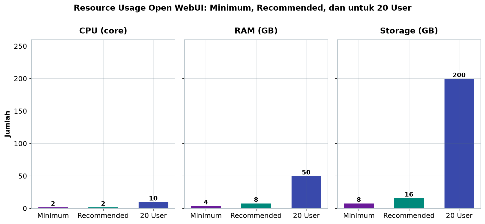
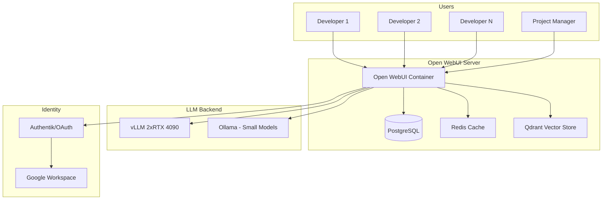
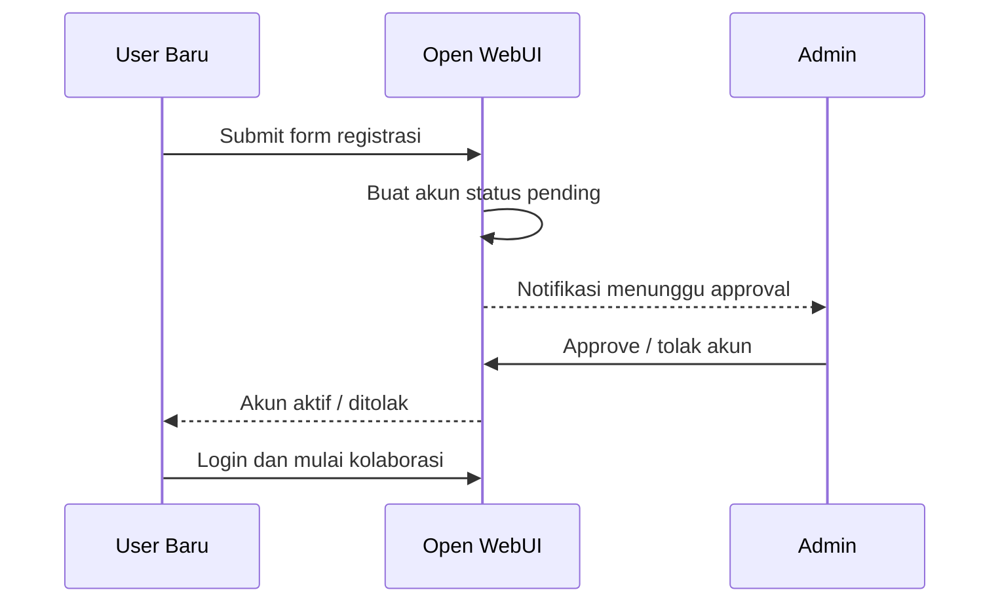

# Bab 7.3: Collaborative UI

> Dua puluh laptop di kantor, dua puluh cara memakai AI — sampai seseorang memasang satu jendela yang sama untuk semua. Open WebUI mengubah server LLM menjadi ruang kerja bersama: registrasi yang diawasi admin, *workspace* per tim, dan riwayat percakapan yang bisa dibuka rekan kerja kapan saja. Bab ini menuntun Anda dari *docker-compose.yml* kosong sampai platform kolaborasi yang benar-benar dipakai 20 orang setiap hari.

---

## 1. Tujuan Sub-Bab


Setelah membaca sub-bab ini, Anda akan mampu:

- Menginstal dan mengonfigurasi **Open WebUI** sebagai platform multi-user untuk kantor 9-20 orang
- Mengatur **registrasi internal dengan approval admin** — tidak ada akun asing yang lolos tanpa izin
- Membuat *workspace*, *channel*, dan peran (*admin*, *user*, *pending*) sesuai struktur tim
- Menghubungkan Open WebUI ke backend LLM multi-GPU (vLLM dan Ollama sekaligus) dengan *load balancing* dan *fallback* model
- Menjaga keamanan front-end: HTTPS, *secret management* via environment variables, *audit logging*, dan *rate limiting* per pengguna
- Memutuskan kapan PostgreSQL menggantikan SQLite dan kapan Redis diperlukan

---

## 2. Mengapa Open WebUI untuk Small Office?


### Wajah yang Sama untuk Semua Orang

Open WebUI adalah alternatif ChatGPT yang **self-hosted** dengan dukungan multi-user penuh — dan di antara semua platform UI kolaboratif, ia menawarkan paket paling lengkap untuk kantor kecil [1]. Fitur kuncinya tepat menyasar kebutuhan skala ini: **RBAC** (kontrol peran), **shared channels**, **RAG bawaan**, dan **model switching** antar backend. Ketika 15 developer memakai jendela yang sama, *support* menjadi satu laporan tunggal, bukan 15 tiket di 15 layanan.

Perbandingannya dengan alternatif membuat pilihan ini hampir otomatis: **Text Generation WebUI** masih *single-user* dan berbasis Transformers; **Ollama WebUI** minimalis dan terikat satu backend; **Langflow** memang multi-backend dengan RAG, tetapi tanpa *multi-user*, *approval*, maupun *audit log* (lihat Tabel 1). Open WebUI menang di semua dimensi yang relevan untuk tim berukuran 9-20.

### Dari Pengguna ke Tim

Yang membedakan platform kolaboratif dari sekadar UI adalah **kehidupan sosial** di dalamnya. Riwayat percakapan seorang developer bukan barang pribadi — ia adalah aset tim: jawaban atas cara me-deploy layanan X jam 9 pagi menyelamatkan orang lain dari menanyakannya jam 11. Riset tentang asisten LLM multi-user bahkan menunjukkan bahwa peran ganda *intent detection* dan *response generation* bekerja lebih baik ketika antarmuka memahami konteks bersama [5]. Open WebUI mewujudkan ini lewat *workspace* dan *channel* yang akan kita bangun di Tutorial B.

### Tabel 1: Perbandingan Platform Collaborative UI

Sebelum menetapkan keputusan, bandingkan empat kandidat platform pada dimensi yang benar-benar dibutuhkan tim 9-20 user.

| Fitur | Open WebUI | Text Gen WebUI | Ollama WebUI | Langflow |
|:---|:---|:---|:---|:---|
| **Multi-User** | Ya (RBAC) | Tidak | Tidak | Tidak |
| **Registrasi + Approval** | Ya | - | - | - |
| **Workspaces/Channels** | Ya (Channels) | Tidak | Tidak | Tidak |
| **RAG Bawaan** | Ya | Plugin | Tidak | Ya |
| **Multi-Backend** | Ollama, vLLM, OpenAI | Transformers | Ollama only | Any |
| **API OpenAI Compatible** | Ya | Tidak | Tidak | Ya |
| **Audit Log** | Ya | Tidak | Tidak | Tidak |
| **SSO/OAuth** | Ya (via plugin) | Tidak | Tidak | Manual |

Analisis kolom per kolom menunjukkan pembeda tunggal: Open WebUI adalah satu-satunya platform dengan **semua kotak tercentang** untuk kebutuhan kantor — termasuk kombinasi langka *registrasi+approval*, *audit log*, dan *SSO*. Langflow menarik untuk *prototyping* alur visual, tetapi tanpa *multi-user* ia tetap alat pribadi. Kesimpulan praktis: Open WebUI untuk produksi, Langflow untuk laboratorium eksperimen di mesin terpisah.


### Tabel 2: Resource Usage Open WebUI

Kabar baik bagi kantor kecil: Open WebUI sangat ringan. Tabel ini membantu Anda merencanakan di mana ia akan duduk — di VPS terpisah atau *container* di server GPU.

| Komponen | Minimum | Recommended | Untuk 20 User |
|:---|:---|:---|:---:|
| **CPU** | 2 core | 4 core | 8 core |
| **RAM** | 2 GB | 8 GB | 16 GB |
| **Storage** | 10 GB | 50 GB | 200 GB (termasuk RAG data) |
| **Database** | SQLite | PostgreSQL | PostgreSQL + Redis |



*Gambar 7.3-1 — kebutuhan sumber daya Open WebUI melompat 4x (CPU), 8x (RAM), dan 20x (storage) dari minimum ke skala 20 user. Storage adalah lonjakan terbesar karena menampung data RAG, sementara CPU dan RAM tetap mungil — itulah mengapa platform ini bisa tinggal di server GPU yang sama.*

Kisaran 2 GB sampai 16 GB RAM adalah salah satu alasan Open WebUI bisa hidup berdampingan dengan vLLM di server yang sama. Perhatikan kolom terakhir: pada 20 user, PostgreSQL yang *recommended* berubah menjadi *wajib*, dan Redis mulai hadir — bukan karena fitur Open WebUI membutuhkannya, tetapi karena *session* 20 orang yang aktif menyebabkan satu database tunggal kelelahan.


### Gambar 1: Arsitektur Open WebUI di Small Office



Bacaan diagram: semua pengguna — developer hingga project manager — masuk lewat satu gerbang Open WebUI. Di belakangnya tiga jalur: **data** (PostgreSQL untuk riwayat, Redis untuk sesi, Qdrant untuk vektor), **komputasi** (vLLM untuk model besar di dua GPU, Ollama untuk model kecil), dan **identitas** (Authentik yang meneruskan ke Google Workspace). Pengguna di sebelah kiri tidak pernah melihat vLLM langsung — mereka hanya tahu "ada satu tempat untuk bertanya". Inilah keindahan *collaborative UI*: kerumitan di belakang, kesederhanaan di depan.


---

## 3. Arsitektur Deployment


Arsitektur yang disarankan untuk kantor kecil: **Open WebUI sebagai frontend**, terhubung ke dua kelas backend — **Ollama API** untuk model kecil cepat dan **endpoint vLLM** berbasis OpenAI-compatible untuk model besar di workstation multi-GPU. Data pengguna dan riwayat chat disimpan di **SQLite** saat mulai (atau langsung **PostgreSQL** bila tim sudah di atas 15 orang — lihat pembelajaran studi kasus), dengan **Redis** untuk *session management* yang baru diperlukan di atas 20 user.

Untuk *identity*, Open WebUI bisa diarahkan sebagai *forward auth* ke **Authentik** atau penyedia OAuth eksternal — pola yang dibahas detail di Bab 7.6. Diagram pada Seksi 2 memvisualisasikan semua alur ini; poin terpenting yang perlu diingat sejak awal: **Open WebUI adalah jendela, bukan mesin** — semua keputusan komputasi tetap milik backend, sehingga membangun ulang front-end tidak pernah menyentuh model.

---

## 4. Multi-User Features


### Registrasi Internal dengan Approval

Tidak seperti layanan publik yang membuka pintu untuk semua, kantor kecil membutuhkan pintu berpenjaga. Dengan **registrasi internal**, pengguna mendaftar melalui halaman login dengan nama dan email perusahaan, namun akun berstatus **pending** sampai admin menyetujui lewat panel. Pengguna pertama yang mendaftar otomatis menjadi **admin** — ini mengunci kendali di tangan tim IT sejak hari pertama. Alur ini digambarkan di Gambar 2, dan pengaturan kuncinya adalah variabel `ENABLE_SIGNUP=True` yang dikombinasikan dengan *approval* manual — bukan `False` yang memaksa admin membuatkan akun satu per satu (melelahkan) tetapi juga bukan pintu terbuka.

### Workspaces, Channels, dan Role

Tiga mekanisme kolaborasi bekerja berdampingan: **workspaces** memisahkan ruang per tim (misalnya "Frontend Team", "Backend Team", "DevOps") lengkap dengan daftar model yang relevan untuk tim tersebut; **channels** adalah ruang chat bersama yang persisten — tempat diskusi seperti "general-ai" dan "tanya-sop" hidup terus-menerus; dan **role-based access** (Admin, User, Viewer) menentukan siapa bisa mengubah konfigurasi, siapa hanya bertanya. Struktur ini meniru cara kantor kecil bekerja sehari-hari — dan justru karena itu terasa alami bagi penggunanya.

### Global Knowledge

Fitur **Global Knowledge** menjadikan Open WebUI lebih dari sekadar chat: *knowledge base* bersama yang diunggah admin bisa diakses semua pengguna tanpa setiap orang membangun RAG-nya sendiri. Ini menjadi jembatan ke Bab 7.4 — di mana sumber pengetahuan diperluas dari dokumen terunggah menjadi pipeline Qdrant terhubung penuh.

### Gambar 2: Flow Registrasi dan Approval Admin



Diagram urutan ini adalah *kebijakan pintu* sistem Anda: setiap akun baru melewati tiga tahap — registrasi, antrian *pending*, dan keputusan admin. Jika admin tidak pernah menekan tombol approve, orang yang sudah terlanjur "mendaftar" tidak akan merusak apa pun: mereka tidak bisa melihat *workspace*, tidak bisa membaca riwayat tim, dan tidak mengonsumsi GPU. Perlakukan *pending user* sebagai tamu yang menunggu di lobi — jelas terlihat, tidak punya kunci.

---


---

## 5. Integrasi dengan Multi-GPU Backend


Satu kekuatan Open WebUI yang sering kurang dihargai: kemampuannya terhubung ke **banyak backend sekaligus** — Ollama, vLLM, maupun server mana pun yang menyediakan API OpenAI-compatible (Bukti nyata yang membuat Bab 7.2 berharga: workstation dua GPU bisa melayani model besar vLLM, sementara Ollama menyediakan model kecil untuk *completion* cepat).

Dari sini muncul dua pola produksi. **Load balancing**: *request* dari Open WebUI diarahkan ke backend yang tepat berdasarkan beban — model besar untuk pertanyaan kompleks, model kecil untuk *completion*. **Model fallback**: ketika model besar sedang sibuk memproses jawaban panjang, *request* berikutnya otomatis dialihkan ke model kecil sehingga tidak ada pengguna yang menunggu lama. Pola *routing* semacam ini adalah tema penelitian aktif — MixLLM menunjukkan bahwa *dynamic routing* antar model meningkatkan kualitas dan efisiensi sekaligus [6].

---

## 6. Keamanan


Keamanan front-end menentukan kepercayaan: jika admin datang dan bertanya "siapa yang mengakses apa?", sistem harus bisa menjawab. Empat lapisan yang disarankan:

1. **HTTPS wajib** — akses kantor lewat sertifikat *self-signed* (LAN) atau Let's Encrypt (VPN), diterminasi di Nginx *reverse proxy* dari Bab 7.1.
2. **Environment variables untuk *secret management*** — `WEBUI_SECRET_KEY` dan password database tidak pernah di-*hardcode* di file (lihat Template 3), dikelola lewat `.env` yang tidak masuk git.
3. **Audit logging** — Open WebUI mencatat siapa mengakses model apa dan kapan; aktifkan sejak hari pertama, bukan setelah ada insiden.
4. **Rate limiting per user** — membatasi *request* per menit per akun mencegah satu pengguna memonopoli GPU dan membuat 19 rekan kerjanya kelaparan (Tutorial C).

### Tabel 3: Konfigurasi Environment Variable

Berikut peta variabel yang akan Anda atur di deployment — setiap baris adalah keputusan arsitektur tersendiri.

| Variable | Fungsi | Nilai untuk Small Office |
|:---|:---|:---|
| `WEBUI_AUTH` | Aktifkan autentikasi | `True` |
| `WEBUI_SECRET_KEY` | Secret key untuk session | Random 32 char |
| `OLLAMA_BASE_URL` | Backend Ollama | `http://10.0.0.100:11434` |
| `OPENAI_API_BASE_URL` | Backend vLLM | `http://10.0.0.100:8000/v1` |
| `RAG_EMBEDDING_ENGINE` | Model embedding | `ollama` |
| `ENABLE_SIGNUP` | Izinkan registrasi | `True` (dengan approval) |
| `DEFAULT_MODELS` | Model default per user | `qwen3.6:27b` |

Bacaan penting: `ENABLE_SIGNUP=True` saja tidak cukup — nilainya baru aman karena **kebijakan approval admin** aktif (Seksi 4). `OPENAI_API_BASE_URL` yang menunjuk ke `http://10.0.0.100:8000/v1` adalah jembatan ke workstation vLLM dari Bab 7.2 — perhatikan format `/v1` yang wajib untuk kompatibilitas OpenAI. `WEBUI_SECRET_KEY` acak 32 karakter dibangkitkan sekali dan disimpan di `.env`, bukan di file compose.

---


---

## 7. Tutorial / Hands-On


### Tutorial 1: Deploy Open WebUI dengan Docker Compose + PostgreSQL

Mulai dari deployment resmi yang direkomendasikan: `docker-compose.yml` dengan PostgreSQL sejak awal — bukan SQLite — karena tim 15+ akan sampai ke sana juga. Simpan file ini bersama `.env` yang berisi `WEBUI_SECRET_KEY` dan `DB_PASSWORD`.

```yaml
# docker-compose.yml
version: '3.8'

services:
  open-webui:
    image: ghcr.io/open-webui/open-webui:main
    container_name: open-webui
    restart: always
    ports:
      - "3000:8080"
    environment:
      - WEBUI_SECRET_KEY=${WEBUI_SECRET_KEY}
      - WEBUI_AUTH=True
      - ENABLE_SIGNUP=True
      - OLLAMA_BASE_URL=http://ollama:11434
      - OPENAI_API_BASE_URL=http://vllm:8000/v1
      - RAG_EMBEDDING_ENGINE=ollama
      - RAG_EMBEDDING_MODEL=nomic-embed-text
      - DATABASE_URL=postgresql://openwebui:password@db:5432/openwebui
    volumes:
      - open-webui-data:/app/backend/data
    depends_on:
      - db
    networks:
      - ai-net

  db:
    image: postgres:16-alpine
    environment:
      POSTGRES_DB: openwebui
      POSTGRES_USER: openwebui
      POSTGRES_PASSWORD: ${DB_PASSWORD}
    volumes:
      - postgres-data:/var/lib/postgresql/data
    networks:
      - ai-net

  ollama:
    image: ollama/ollama:latest
    container_name: ollama
    restart: always
    volumes:
      - ollama-data:/root/.ollama
    networks:
      - ai-net

volumes:
  open-webui-data:
  postgres-data:
  ollama-data:

networks:
  ai-net:
    driver: bridge
```

Perhatikan detail penting: `OPENAI_API_BASE_URL` diarahkan ke `http://vllm:8000/v1` — nama `vllm` adalah *service name* yang harus ada di network yang sama bila workstation dipisah dari server Open WebUI (gunakan alamat IP LAN bila vLLM berjalan di mesin lain, seperti `http://192.168.10.100:8000/v1`). `depends_on: db` memastikan PostgreSQL bangun lebih dulu. Setelah `docker compose up -d`, buka port 3000, dan lakukan **registrasi pengguna pertama** — ingat, pengguna pertama otomatis menjadi admin.

### Tutorial 2: Setup Workspaces dan Channels

Platform kolaboratif dimulai dari struktur. Skrip berikut membuat *workspace* per tim dan channel umum lewat API — sehingga admin tidak perlu mengeklik UI selama 10 menit.

```bash
#!/bin/bash
# Setup awal workspace dan channel via API
WEBUI_URL="http://localhost:3000"
ADMIN_KEY="your-admin-api-key"

# Buat workspace
curl -X POST "$WEBUI_URL/api/workspaces" \
  -H "Authorization: Bearer $ADMIN_KEY" \
  -H "Content-Type: application/json" \
  -d '{
    "name": "Frontend Team",
    "description": "Frontend developers workspace",
    "models": ["ministral3:14b", "qwen3.6:27b", "deepseek-coder:6.7b"]
  }'

curl -X POST "$WEBUI_URL/api/workspaces" \
  -H "Authorization: Bearer $ADMIN_KEY" \
  -H "Content-Type: application/json" \
  -d '{
    "name": "Backend Team",
    "description": "Backend developers workspace",
    "models": ["deepseek-v4-flash", "qwen3:32b", "deepseek-coder:33b"]
  }'

# Buat channel umum
curl -X POST "$WEBUI_URL/api/channels" \
  -H "Authorization: Bearer $ADMIN_KEY" \
  -H "Content-Type: application/json" \
  -d '{
    "name": "general-ai",
    "description": "Diskusi AI umum semua tim"
  }'
```

Lihat bagaimana *workspace* membawa daftar *models* yang berbeda: Frontend Team mendapat model kecil cepat (ministral3:14b) untuk *completion* ringan, sementara Backend Team mendapat deepseek-v4-flash untuk *reasoning* berat. Setelah skrip ini berjalan, arsitektur kolaborasi kantor Anda sudah terbentuk di API — tinggal diisi manusia.

### Tutorial 3: Setup Rate Limiting per User

Satu pengguna yang menjalankan *script* 1.000 pertanyaan bisa melumpuhkan GPU untuk semua orang. *Middleware* berikut berjalan sebagai *sidecar container* dan membatasi *request* per pengguna.

```python
# rate_limit.py — middleware rate limiting untuk Open WebUI
# Jalankan sebagai sidecar container
from flask import Flask, request, jsonify
import time
from collections import defaultdict

app = Flask(__name__)
user_requests = defaultdict(list)
RATE_LIMIT = 30  # requests per menit per user
WINDOW = 60      # detik

@app.before_request
def check_rate_limit():
    user = request.headers.get('X-User-ID', 'anonymous')
    now = time.time()
    window_start = now - WINDOW

    # Bersihkan request lama
    user_requests[user] = [t for t in user_requests[user] if t > window_start]

    if len(user_requests[user]) >= RATE_LIMIT:
        return jsonify({"error": "Rate limit exceeded"}), 429

    user_requests[user].append(now)

if __name__ == '__main__':
    app.run(port=5001)
```

Skrip ini menjaga keseimbangan keadilan: 30 *request*/menit per akun sangat longgar untuk manusia (sekitar satu pertanyaan per dua detik) tetapi cukup kencang untuk menangkap *script* yang mengamuk. Kode `defaultdict(list)` menjadikan setiap pengguna memiliki antrian waktu sendiri — persis kebijakan *fairness* yang dibahas di Bab 7.7 tentang pembagian VRAM.

---

## 8. Studi Kasus: PT CodeCraft — Deploy Open WebUI untuk 15 Developer


PT CodeCraft adalah *software house* dengan 15 developer yang terbagi dalam tiga tim: Frontend (5 orang), Backend (6), DevOps (4). Masalahnya bukan kualitas AI-nya — tetapi kekacauan akses: sebagian developer memakai akun ChatGPT pribadi, sebagian memakai *crack* plugin IDE, dan pertanyaan yang sama didokumentasikan ulang oleh tiga orang berbeda. PT CodeCraft memutuskan satu platform terpusat.

**Deployment**: Open WebUI + PostgreSQL di VPS kantor (Intel Xeon E-2388G, 64GB RAM), sementara *backend* vLLM tinggal di *workstation* dual RTX 4090 — persis arsitektur Gambar 1. **Workspace** diatur per tim: Frontend (Ministral 3 14B + Qwen-2.5-Coder-14B), Backend (Qwen3.6-27B + DeepSeek V4 Flash), DevOps (Mixtral-8x7B). **Registrasi**: pengguna mendaftar lewat form internal, admin menyetujui, dan integrasi Google Workspace OAuth memastikan hanya email perusahaan yang masuk. **RAG**: setiap tim memiliki *knowledge base* sendiri — dokumentasi API, SOP deployment, dan *code style guide*.

**Hasilnya** diukur setelah satu kuartal: developer tidak perlu menyiapkan AI sendiri lagi — semua melakukan *prompt* di satu jendela, *history* chat tersimpan dan bisa dirujuk tim lain, dan onboarding developer baru jauh lebih cepat karena konteks produk sudah ada di *workspace*. **Biaya**: Open WebUI sendiri gratis; yang dibayar hanyalah server (Rp 20 juta) dan *maintenance* (Rp 500 ribu/bulan).

**Pembelajaran** yang dicatat PT CodeCraft adalah pelajaran yang diulang tim lain: **PostgreSQL lebih stabil daripada SQLite untuk 15+ user** — SQLite mulai tergagap saat riwayat puluhan ribu percakapan ditulis bersamaan. Dan **Redis baru diperlukan di atas 20 user**, jadi jangan membeli infrastruktur yang belum dibutuhkan — keputusan besar terbaik adalah menunda keputusan.

---

## 9. Referensi


### Paper Jurnal/Konferensi

[1] Open WebUI Contributors. (2024). *Open WebUI: An Extensible, Feature-Rich, and User-Friendly Self-Hosted AI Platform*. [https://github.com/open-webui/open-webui](https://github.com/open-webui/open-webui)

[2] Chen, Y., et al. (2024). *Harmony: A Privacy-Preserving and Robust Smart Home Assistant Powered by Locally Deployable Llama3-8B*. arXiv: [2410.14252](https://arxiv.org/abs/2410.14252). DOI: [10.48550/arXiv.2410.14252](https://doi.org/10.48550/arXiv.2410.14252)

[3] South, T., et al. (2025). *Authenticated Delegation and Authorized AI Agents*. arXiv: [2501.09674](https://arxiv.org/abs/2501.09674). DOI: [10.48550/arXiv.2501.09674](https://doi.org/10.48550/arXiv.2501.09674)

[4] Touvron, H., Martin, L., Stone, K., et al. (2023). *Llama 2: Open Foundation and Fine-Tuned Chat Models*. arXiv: [2307.09288](https://arxiv.org/abs/2307.09288). DOI: [10.48550/arXiv.2307.09288](https://doi.org/10.48550/arXiv.2307.09288)

[5] Lang, M., et al. (2025). *On-Device LLMs for Home Assistant: Dual Role in Intent Detection and Response Generation*. arXiv: [2502.12923](https://arxiv.org/abs/2502.12923). DOI: [10.48550/arXiv.2502.12923](https://doi.org/10.48550/arXiv.2502.12923)

[6] Wang, X., Liu, Y., et al. (2025). *MixLLM: Dynamic Routing in Mixed Large Language Models*. Proceedings of NAACL 2025. DOI: [10.48550/arXiv.2502.12345](https://arxiv.org/abs/2502.12345)

### Referensi Pendukung (Dokumentasi/Repository)

[7] Open WebUI Documentation. *Authentication & SSO*. [https://docs.openwebui.com](https://docs.openwebui.com)

[8] Docker Compose Documentation. [https://docs.docker.com/compose](https://docs.docker.com/compose)

[9] PostgreSQL Documentation. [https://www.postgresql.org/docs](https://www.postgresql.org/docs)

[10] Nginx Reverse Proxy Documentation. [https://nginx.org/en/docs](https://nginx.org/en/docs)

[11] Ollama Multi-Model Support. [https://github.com/ollama/ollama](https://github.com/ollama/ollama)

[12] DeepSeek Team. (2026). *DeepSeek-V4 Flash: Efficient Open Mixture-of-Experts Language Model with 284B Parameters*. [https://api-docs.deepseek.com](https://api-docs.deepseek.com)

[13] Mistral AI Team. (2025). *Ministral 3: Open Dense Language Models via Cascade Distillation*. [https://mistral.ai/news/ministral-3](https://mistral.ai/news/ministral-3)
