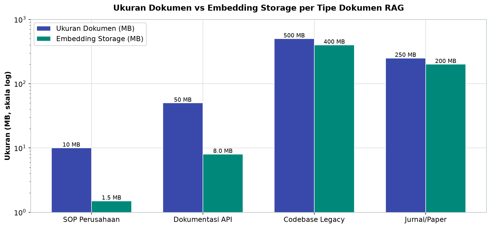
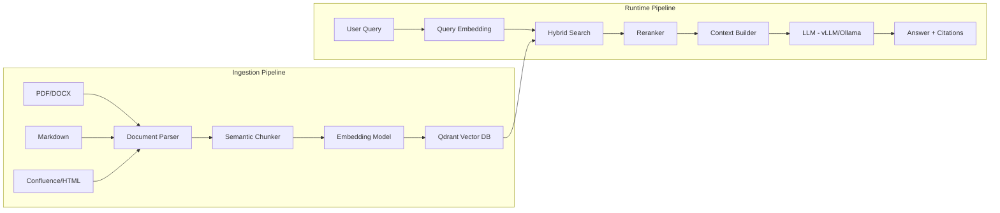
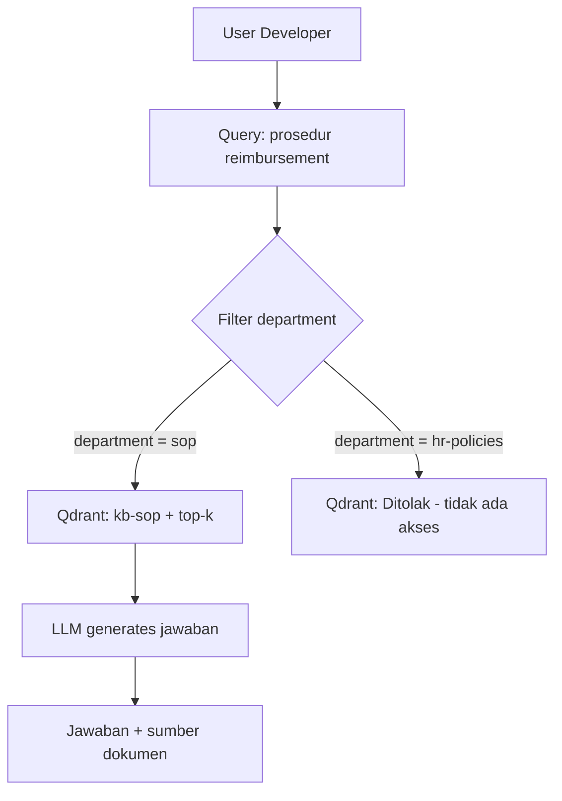

# Bab 7.4: Internal RAG

> Pengetahuan perusahaan paling berharga jarang berbentuk slide yang rapi — ia berserakan sebagai SOP dalam PDF, dokumentasi API di GitHub Wiki, dan ingatan senior developer yang sudah pindah kerja. Retrieval-Augmented Generation (RAG) mengubah tumpukan dokumen itu menjadi satu pintu tanya: "Bagaimana prosedur reimbursement?" kini dijawab model dengan menunjuk halamannya. Bab ini membangun pipeline RAG internal — dari parsing dokumen, chunking, embedding, hingga retrieval dengan filter keamanan per departemen.

---

## 1. Tujuan Sub-Bab


Setelah membaca sub-bab ini, Anda akan mampu:

- Mendesain pipeline RAG end-to-end untuk dokumentasi internal dan SOP perusahaan
- Memilih *embedding model*, *vector database*, dan strategi *chunking* yang tepat untuk bahasa Indonesia dan dokumentasi teknis
- Menentukan kapan memakai Qdrant, ChromaDB, atau pgvector berdasarkan data dan anggaran
- Mengintegrasikan RAG dengan Open WebUI dan backend vLLM/Ollama
- Menerapkan kontrol keamanan metadata: dokumen HR tidak bisa diakses developer biasa
- Mengotomatiskan sinkronisasi knowledge base dari GitHub Wiki dengan GitHub Actions

---

## 2. Kebutuhan RAG di Small Office


### Pengetahuan yang Berserakan

Bayangkan hasil audit singkat di kantor 12 orang: SOP HR ada di PDF yang dikirim lewat WhatsApp, dokumentasi API hidup di GitHub Wiki dengan seratus revisi tanpa anotasi, catatan operasional menumpuk di Google Docs dengan tiga versi berbeda, dan file lokal di laptop yang pemiliknya sudah resign. Situasi ini bukan kelalaian — ini kondisi alami setiap kantor kecil yang tumbuh cepat tanpa *Chief Knowledge Officer*. [2]

RAG menjawabnya dengan satu kalimat: **satu pintu tanya untuk semua *knowledge base* perusahaan**. Operator billing bertanya "bagaimana prosedur reimbursement?" dan mendapat jawaban lengkap dengan sumber halamannya. Developer tidak bertanya ulang kepada senior untuk hal yang sudah tertulis. Compliance team tenang karena dokumennya tidak pernah keluar dari server. Inilah transisi dari *dokumen* menuju *pengetahuan yang bisa ditanyakan* — dan pipeline-nya dibangun di bab ini [1].

### Tabel 1: Perbandingan Vector Database untuk Small Office

Empat kandidat dibandingkan pada dimensi yang menentukan operasional harian — bukan sekadar fitur *headline*.

| Fitur | Qdrant | ChromaDB | pgvector | Weaviate |
|:---|:---|:---|:---|:---|
| **Deployment** | Docker | In-process | PostgreSQL | Docker |
| **Performance** | ***** | *** | **** | **** |
| **Hybrid Search** | Ya | Tidak | Ya (extension) | Ya |
| **Filtering** | Advanced | Basic | SQL-based | Advanced |
| **Multitenancy** | Ya | Limited | Ya | Ya |
| **Resource (RAM)** | ~1 GB | ~500 MB | ~Postgres | ~2 GB |
| **Backup** | Snapshot | File copy | pg_dump | Filesystem |
| **Rekomendasi** | **Best** | Prototype | If use PG | Enterprise |

Baca tabel ini sebagai spektrum dan bukan peringkat absolut: ChromaDB menang untuk *prototype* sepekan karena tidak butuh server terpisah; pgvector menang untuk kantor yang sudah hidup di PostgreSQL dan ingin satu database; Weaviate menunggu sampai kebutuhan *enterprise* benar-benar ada. **Qdrant** menang untuk produksi small office karena kombinasi lengkap: performa lima bintang, *hybrid search* ready, *filtering* advanced untuk keamanan departemen, dan *backup snapshot* yang bisa diotomatiskan.


---

## 3. Arsitektur Pipeline RAG


### Ingestion: Menyiapkan Makanan

Tahap pertama adalah memasukkan dokumen ke sistem (*ingestion*). Alurnya: **PDF, Markdown, HTML, atau export Confluence → document parser → chunking → embedding → simpan di vector database**. Setiap format punya wataknya sendiri: PDF harus melewati *text extraction* yang kadang rusak di tabel; HTML dari Confluence menyimpan *layout* yang harus dibersihkan; Markdown relatif bersih dan ideal. Parser yang baik tidak hanya mengekstrak teks, tetapi juga metadata (judul, tanggal, penulis) yang akan dipakai untuk *filtering* keamanan.

### Retrieval dan Generation: Menjawab dengan Tangan Terangkat

Saat pengguna bertanya, sistem menjalankan *runtime pipeline*: **query user → embedding query → similarity search → top-k chunks → context → LLM → jawaban dengan citations**. Dua tahap yang paling menentukan kualitas: *similarity search* harus menemukan chunk yang tepat (gagal di sini berarti jawaban model salah meski LLM-nya sangat pintar), dan *context builder* harus menyusun potongan dokumen menjadi *prompt* yang koheren. Jawaban akhir disertai **citations** — referensi ke dokumen sumber — sehingga pengguna bisa memverifikasi sendiri dan kepercayaan terhadap sistem tumbuh [1][5].

### Chunking Strategy: Mengiris dengan Akal

Pembuatan chunk adalah keputusan yang paling sering diremehkan. Untuk dokumentasi teknis, *semantic chunking* dengan **500-1000 token per chunk dan overlap 10-20%** adalah titik manis: cukup kecil untuk dicocokkan secara presisi, cukup besar untuk membawa konteks kalimat. Overlap diperlukan agar ide yang terpotong di batas chunk tidak hilang. Bab ini menggunakan *heading-based split* — memotong tepat di judul seksi — karena heading adalah penanda semantik yang telah disediakan penulis dokumen, lebih baik daripada pemotongan buta per N karakter.

### Hybrid Search: Vector + Keyword

*Vector search* saja akan gagal pada pertanyaan berisi istilah persis seperti kode error atau singkatan ("ERR_TIMEOUT_302"). **Hybrid search** — menggabungkan *dense retrieval* dengan **BM25** (keyword) — menutup lubang ini: BM25 mencocokkan token eksak yang luput dari semantik embedding. Inilah fondasi yang diperkenalkan SPLADE dan DPR, dan kini menjadi fitur standar Qdrant dan Weaviate [4][5].

### Tabel 2: Estimasi Biaya Data RAG

Pertanyaan finansial terakhir dijawab tabel ini: berapa biaya penyimpanan vektor untuk empat tipe dokumen khas kantor?

| Tipe Dokumen | Volume | Ukuran | Chunk (500 token) | Embedding Storage | Biaya (Qdrant) |
|:---|:---:|:---:|:---:|:---:|:---:|
| **SOP Perusahaan** | 50 dokumen | ~10 MB | ~200 chunks | ~1,5 MB | Gratis |
| **Dokumentasi API** | 200 halaman | ~50 MB | ~1000 chunks | ~8 MB | Gratis |
| **Codebase Legacy** | 10.000 file | ~500 MB | ~50.000 chunks | ~400 MB | ~Rp 100rb/bln |
| **Jurnal/Paper** | 500 dokumen | ~250 MB | ~25.000 chunks | ~200 MB | ~Rp 50rb/bln |



*Gambar 7.4-1 — embedding selalu lebih ringkas dari dokumen sumbernya: 10 MB teks SOP terkompresi menjadi 1,5 MB vektor, dan bahkan codebase 500 MB hanya menyisakan 400 MB. Inilah alasan storage vektor RAG kantor kecil hampir selalu gratis atau di bawah Rp 100 ribu/bulan.*

Insight tabel ini menenangkan: untuk kantor kecil, storage vektor **hampir selalu gratis** atau di bawah Rp 100 ribu/bulan bahkan di cloud Qdrant — karena embedding terkompresi jauh lebih kecil dari dokumen sumbernya (10 MB teks menjadi 1,5 MB vektor). Biaya besar sebenarnya bukan di penyimpanan, tetapi di komputasi embedding awal dan *maintenance* pipeline. Ini menjawab pertanyaan "RAG mahal?" dengan tegas: tidak — jika dibangun *self-hosted*.

---


### Gambar 1: Pipeline RAG End-to-End



Dua *subgraph* dalam diagram menceritakan dua kehidupan sistem. Di atas: *ingestion pipeline* — dokumen dari berbagai format dikupas, diiris, di-embed, dan ditabur ke Qdrant; pekerjaan ini terjadi saat kantor kosong (ingat *load pattern* Bab 7.1). Di bawah: *runtime pipeline* — setiap pertanyaan pengguna diubah jadi vektor, dicari secara *hybrid* di Qdrant, di-*rerank*, disusun menjadi konteks, lalu dijawab LLM dengan *citations*. Satu pemahaman penting: kualitas jawaban 80% ditentukan di bagian *search* — bukan di LLM. Model terbaik pun tidak bisa menjawab dengan benar dari konteks yang salah.


---

## 4. Pilihan Embedding Model


Embedding adalah peta bahasa — kualitasnya menentukan apakah query menemukan dokumen yang benar. Empat kandidat untuk kantor Indonesia:

- **nomic-embed-text** (Ollama, 768 dimensi, ~274 MB) — sangat cepat, *multilingual*, pilihan *default* Ollama; cukup untuk mayoritas kasus.
- **BAAI/bge-m3** (1024 dimensi, ~2,2 GB) — akurasi terbaik, mendukung 100+ bahasa; pilihan untuk dokumen campuran Indonesia-Inggris, terutama dokumen regulasi.
- **intfloat/multilingual-e5-large** (1024 dimensi, ~2,3 GB) — solid dan *multilingual*, tetapi hanya 512 token maksimum dan lambat; lebih cocok untuk enterprise.
- **all-MiniLM-L6-v2** (384 dimensi, ~80 MB) — sangat cepat tetapi tidak *multilingual* dan terbatas 256 token; hanya untuk *prototype* bahasa Inggris.
- **ministral-3-embed** (1024 dimensi, ~1,5 GB) — model terbaru dari Mistral AI yang dibangun lewat *Cascade Distillation*, akurasi MTEB di atas 65 dengan kecepatan baik — rekomendasi untuk RAG small office 2026 [6].

Aturan praktisnya: mulai dengan nomic-embed-text; jika hasil retrieval kurang akurat pada dokumen hukum/regulasi, naik ke bge-m3; untuk kebutuhan editable and scalable mulai dengan ministral-3-embed.

### Tabel 3: Perbandingan Embedding Model

Pilihan embedding adalah keputusan yang sulit diubah setelah ingestion (semua vektor harus di-*embed* ulang). Karena itu, bandingkan dulu sebelum menabur.

| Model | Dimensi | Max Tokens | Ukuran | Kecepatan | Multilingual | Rekomendasi |
|:---|:---:|:---:|:---:|:---:|:---|:---|
| **nomic-embed-text** | 768 | 8192 | ~274 MB | Sangat cepat | Ya | Default Ollama |
| **bge-m3** | 1024 | 8192 | ~2,2 GB | Sedang | Ya (100+ bahasa) | Best accuracy |
| **multilingual-e5-large** | 1024 | 512 | ~2,3 GB | Lambat | Ya | Enterprise |
| **all-MiniLM-L6-v2** | 384 | 256 | ~80 MB | Sangat cepat | Tidak | Prototype ringan |
| **ministral-3-embed** | 1024 | 8192 | ~1,5 GB | Cepat | Ya (multilingual) | RAG small office |

Dua kolom yang paling sering salah dibaca adalah **Max Tokens** dan **Multilingual**. Model dengan batas 512 token (e5-large) akan "melihat" hanya sebagian chunk jika chunk kita 500-1000 token — inefisiensi yang tidak terlihat di benchmark. Sementara *multilingual* menentukan: dokumen regulasi Indonesia dan kontrak bahasa Inggris dalam satu koleksi menuntut model yang memahami keduanya (bge-m3, nomic, ministral-3-embed) — model Inggris-only seperti all-MiniLM akan gagal di 30% pertanyaan [5].


---

## 5. Pilihan Vector Database


Empat kandidat vector store bersaing dengan kekuatan berbeda. **Qdrant** — berbasis Rust, performa terbaik, bisa *self-hosted* maupun cloud — adalah rekomendasi utama buku ini untuk produksi (Tabel 1). **ChromaDB** sederhana dan sempurna untuk *prototyping* di bawah 10 GB data. **pgvector** menyarangkan vektor di PostgreSQL yang sudah dimiliki kantor — tidak perlu database terpisah, dengan *trade-off* pada performa. **Weaviate** canggih (seleksi *enterprise*) tetapi memakan ~2 GB RAM dan kompleksitas yang tidak dibutuhkan skala ini.

Untuk small office, keputusan akhir hampir selalu: **Qdrant self-hosted via Docker** — gratis, cepat, *hybrid search* siap pakai, dan *filtering* metadata yang diandalkan sistem keamanan kita di Seksi 7.

---

## 6. Permission dan Keamanan


RAG internal menuntut jawaban atas pertanyaan yang tidak menyenangkan: *siapa yang boleh tahu apa?* Dokumen HR tidak boleh dibaca developer biasa — dan larangan ini harus dijalankan mesin, bukan digantung pada etiket. Implementasinya di sistem ini: **metadata filtering** — setiap chunk diberi label departemen (misal `department: "hr-policies"`), dan query hanya mengambil chunk dari departemen yang menjadi hak user. Filter dijalankan di Qdrant sebagai *filter condition* (Langkah 2), sehingga dokumen terlarang bahkan tidak masuk ke konteks — bukan sekadar disembunyikan.

Di atasnya, dua praktik keamanan: **enkripsi at-rest** untuk dokumen sensitif di disk, dan **prinsip hak-akses terkecil** — developer hanya mendapat dokumentasi teknis; compliance dan HR mendapat semua. Bab 7.6 membahas bagaimana hak ini dihubungkan ke identitas perusahaan.

### Gambar 2: Alur Keamanan Filter Departemen



Diagram ini adalah *kebijakan keamanan* yang diterjemahkan menjadi struktur data: filter departemen dieksekusi di tingkat Qdrant sebelum LLM melihat apa pun. Ketika seorang developer bertanya kepada koleksi `hr-policies`, sistem mengembalikan kosong — bukan jawaban yang "disensor". Perbedaan itu penting: di sisi keamanan, tidak ada yang lebih baik daripada data yang tidak pernah keluar dari server.

---


---

## 7. Praktikum / Hands-On

### Langkah 1: Setup Qdrant + Pipeline Ingestion dengan Python

Mulai dari sisi *persiapan makan*: skrip berikut meng-index folder knowledge base menjadi koleksi Qdrant dengan *semantic chunking* berbasis heading.

```python
# rag_ingestion.py — pipeline ingestion dokumentasi ke Qdrant
import os
from pathlib import Path
from qdrant_client import QdrantClient
from qdrant_client.models import VectorParams, Distance
from sentence_transformers import SentenceTransformer
import markdown
from bs4 import BeautifulSoup

# Inisialisasi
client = QdrantClient("localhost", port=6333)
model = SentenceTransformer("intfloat/multilingual-e5-large")

def chunk_markdown(filepath: str, chunk_size=500, overlap=100):
    with open(filepath, 'r') as f:
        text = f.read()
    # Simple semantic chunking berdasarkan heading
    chunks = []
    sections = text.split('\n## ')
    for section in sections:
        words = section.split()
        for i in range(0, len(words), chunk_size - overlap):
            chunk = ' '.join(words[i:i + chunk_size])
            if chunk.strip():
                chunks.append(chunk)
    return chunks

def index_folder(folder_path: str, collection_name: str):
    # Buat collection jika belum ada
    try:
        client.create_collection(
            collection_name=collection_name,
            vectors_config=VectorParams(size=1024, distance=Distance.COSINE)
        )
    except Exception:
        pass  # Collection sudah ada

    files = list(Path(folder_path).rglob("*.md")) + \
            list(Path(folder_path).rglob("*.mdx"))

    for filepath in files:
        chunks = chunk_markdown(str(filepath))
        if not chunks:
            continue
        embeddings = model.encode(chunks)

        points = []
        for i, (chunk, emb) in enumerate(zip(chunks, embeddings)):
            points.append({
                "id": hash(f"{filepath}_{i}") % (2**63),
                "vector": emb.tolist(),
                "payload": {
                    "source": str(filepath),
                    "chunk_index": i,
                    "department": folder_path.split('/')[-1],
                    "text": chunk
                }
            })
        client.upsert(collection_name=collection_name, points=points)
        print(f"Indexed {len(points)} chunks from {filepath}")

if __name__ == "__main__":
    # Index semua folder knowledge base
    for dept in ["sop", "api-docs", "codebase", "hr-policies"]:
        index_folder(f"/data/{dept}", f"kb-{dept}")
    print("Ingestion selesai!")
```

Tiga hal yang perlu disorot dari skrip ini. **Pertama**, *semantic chunking* memotong tepat di `\n## ` (heading level 2) — memanfaatkan struktur dokumen, bukan pemotongan buta. **Kedua**, setiap payload membawa label `department` yang diambil dari nama folder — inilah benih sistem keamanan Langkah 2. **Ketiga**, ukuran dimensi vektor `1024` harus konsisten dengan embedding model yang dipakai (e5-large dan bge-m3 sama-sama 1024). Catatan kecil: `hash()` pada `id` bersifat *per-process* acak di Python 3 — untuk produksi gantilah dengan ID yang deterministik (misal `uuid5`) agar *re-indexing* tidak menggandakan data.

### Langkah 2: Query RAG dengan Filter Departemen

Sisi *pelayanan*: skrip pencarian yang menghormati hak akses. Developer menanyakan SOP dan hanya SOP yang ditemukan.

```python
# rag_query.py — query dengan filter departemen
from qdrant_client import QdrantClient
from sentence_transformers import SentenceTransformer

client = QdrantClient("localhost", port=6333)
model = SentenceTransformer("intfloat/multilingual-e5-large")

def query_rag(query: str, department: str = None, top_k: int = 5):
    query_vector = model.encode(query).tolist()

    # Filter berdasarkan departemen jika ada
    query_filter = None
    if department:
        from qdrant_client.models import Filter, FieldCondition, MatchValue
        query_filter = Filter(
            must=[FieldCondition(key="department", match=MatchValue(value=department))]
        )

    results = client.search(
        collection_name="kb-sop",
        query_vector=query_vector,
        query_filter=query_filter,
        limit=top_k
    )

    context = []
    sources = []
    for r in results:
        context.append(r.payload['text'])
        sources.append(f"{r.payload['source']} (relevance: {r.score:.2f})")

    return context, sources

# Contoh penggunaan
query = "Bagaimana prosedur reimbursement?"
context, sources = query_rag(query, department="sop")
print("Sumber:", sources)
```

Perhatikan bagaimana dua lapisan bekerja: fungsi menerima parameter `department` dan menerjemahkannya menjadi `Filter` Qdrant dengan `MatchValue` — dokumen dari departemen lain tidak pernah masuk daftar hasil, sehingga skor relevansi sekalipun tidak membocorkan isinya. Pada produksi, nilai `department` tidak ditentukan oleh pengguna dengan bebas — ia diturunkan dari identitas login user lewat Open WebUI (Bab 7.3) atau Authentik (Bab 7.6). Koleksi `kb-sop` di sini bisa diganti dengan koleksi dinamis per role pengguna.

### Langkah 3: Setup Auto-Sync RAG dengan GitHub Wiki

Dokumentasi yang tidak sinkron lebih buruk daripada tidak ada dokumentasi. *Workflow* berikut menjalankan ingestion otomatis setiap kali `wiki/` atau `docs/` berubah di repository.

```yaml
# .github/workflows/sync-rag.yml
name: Sync RAG Knowledge Base

on:
  push:
    branches: [main]
    paths:
      - 'wiki/**'
      - 'docs/**'

jobs:
  sync-rag:
    runs-on: ubuntu-latest
    steps:
      - uses: actions/checkout@v4

      - name: Setup Python
        uses: actions/setup-python@v5
        with:
          python-version: '3.11'

      - name: Install dependencies
        run: pip install qdrant-client sentence-transformers

      - name: Run ingestion
        run: python rag_ingestion.py
        env:
          QDRANT_HOST: ${{ secrets.QDRANT_HOST }}
          QDRANT_API_KEY: ${{ secrets.QDRANT_API_KEY }}
```

Pemicu `paths` memastikan *workflow* hanya berjalan saat dokumentasi berubah — bukan pada setiap *commit* kode. Rahasia koneksi (`QDRANT_HOST`, `QDRANT_API_KEY`) disimpan di GitHub *Secrets*, dan satu skrip ingestion yang sama (Langkah 1) dipakai oleh workflow ini dan oleh *cron* harian — prinsip satu kode, banyak pemicu. Hasilnya: ketika developer *push* pembaruan wiki jam 4 sore, knowledge base sudah segar jam 4 lewat.

---

## 8. Studi Kasus: RAG untuk Startup Fintech (12 Developer)


Sebuah startup fintech dengan 12 developer dan 3 produk menyadari masalah klasiknya: pertanyaan yang sama diajukan berulang-ulang, jawabannya berbeda-beda tergantung siapa yang ditanya. *Knowledge base* mereka terdiri dari SOP compliance (50 dokumen), dokumentasi API (200 halaman), dan regulasi OJK (30 dokumen) — dokumen yang bukan hanya rumit, tetapi juga *sensitif*: SOP compliance berisi prosedur audit dan data karyawan.

**Hardware RAG** mereka: server dedicated — Ryzen 9 7950X, 64GB RAM, 2TB NVMe — dengan Qdrant + PostgreSQL di Docker. **Embedding model**: `bge-m3`, karena dokumen regulasi OJK campur bahasa Indonesia dan Inggris, dan akurasi 100+ bahasa model ini yang terbaik di kelasnya. **Chunking**: *semantic chunking* dengan *heading-based split* dan overlap 10% — memotong di seksi peraturan, bukan di tengah kalimat ayat.

**Permission** adalah bagian yang memakan rapat terbanyak: dokumen HR dan compliance hanya bisa diakses admin; developer hanya mendapat dokumentasi teknis. Implementasinya persis pola Langkah 2 — label `department` pada setiap chunk dan `Filter` pada setiap query. **Integrasi**: plugin RAG Open WebUI terhubung ke Qdrant, sehingga pertanyaan "Bagaimana cara integrasi payment gateway?" dijawab langsung dari dokumentasi API. **Auto-sync**: GitHub Actions dipicu oleh setiap *push* ke wiki repository; dokumen Confluence disinkronkan manual via *export* periodik.

**Hasilnya** diukur dengan dua angka yang berkesan: waktu pencarian dokumentasi turun dari **15 menit menjadi 30 detik** — karena mencari bukan lagi menyelami folder, melainkan bertanya. Developer tidak perlu menanyakan ulang hal yang sudah terdokumentasi ke senior. Dan tim compliance puas dengan cara yang paling meyakinkan: dokumen sensitif **tidak pernah bocor** — bukan karena janji, tetapi karena filter keamanan di jalur data. **Biaya**: Qdrant *self-hosted* gratis, model embedding gratis, dan total storage vektor di bawah 5 GB.

Pelajaran studi kasus ini adalah pelajaran paling jujur di bab ini: **RAG tidak menyelesaikan masalah dengan teknologi, tetapi dengan disiplin** — disiplin menulis dokumentasi, disiplin menandai departemen, dan disiplin menjalankan sinkronisasi. Pipeline yang Anda bangun hari ini hanya sebagus disiplin yang menjaganya.

---

## 9. Referensi


### Paper Jurnal/Konferensi

[1] Gao, Y., Xiong, Y., Gao, X., Jia, K., Pan, J., Bi, Y., Dai, Y., Sun, J., & Wang, H. (2023). *Retrieval-Augmented Generation for Large Language Models: A Survey*. arXiv: [2312.10997](https://arxiv.org/abs/2312.10997). DOI: [10.48550/arXiv.2312.10997](https://doi.org/10.48550/arXiv.2312.10997)

[2] Wang, Y., et al. (2024). *Optimizing and Evaluating Enterprise Retrieval-Augmented Generation Solutions*. arXiv: [2410.12812](https://arxiv.org/abs/2410.12812). DOI: [10.48550/arXiv.2410.12812](https://doi.org/10.48550/arXiv.2410.12812)

[3] Thakur, N., Reimers, N., Rücklé, A., Srivastava, A., & Gurevych, I. (2021). *BEIR: A Heterogeneous Benchmark for Zero-shot Evaluation of Information Retrieval Models*. NeurIPS Datasets and Benchmarks Track. DOI: [10.48550/arXiv.2104.08663](https://arxiv.org/abs/2104.08663)

[4] Formal, T., Piwowarski, B., & Clinchant, S. (2021). *SPLADE: Sparse Lexical and Expansion Model for First Stage Ranking*. Proceedings of the 44th International ACM SIGIR. DOI: [10.1145/3404835.3463098](https://doi.org/10.1145/3404835.3463098)

[5] Karpukhin, V., Oğuz, B., Min, S., Lewis, P., Wu, L., Edunov, S., Chen, D., & Yih, W. (2020). *Dense Passage Retrieval for Open-Domain Question Answering*. Proceedings of EMNLP 2020. DOI: [10.18653/v1/2020.emnlp-main.550](https://aclanthology.org/2020.emnlp-main.550/)

### Referensi Pendukung (Dokumentasi/Repository)

[6] Qdrant Documentation. *Self-Hosted Vector Database*. [https://qdrant.tech/documentation](https://qdrant.tech/documentation)

[7] Sentence-Transformers. *Pretrained Embedding Models*. [https://www.sbert.net](https://www.sbert.net)

[8] LangChain RAG Documentation. [https://python.langchain.com/docs/use_cases/question_answering](https://python.langchain.com/docs/use_cases/question_answering)

[9] Unstructured.io. *Document Parsing for RAG*. [https://unstructured.io](https://unstructured.io)

[10] LlamaIndex Documentation. *RAG Pipeline*. [https://docs.llamaindex.ai](https://docs.llamaindex.ai)

[11] Mistral AI Team. (2025). *Ministral 3: Cascade Distillation for Efficient Embedding Models*. [https://mistral.ai/news/ministral-3](https://mistral.ai/news/ministral-3)
