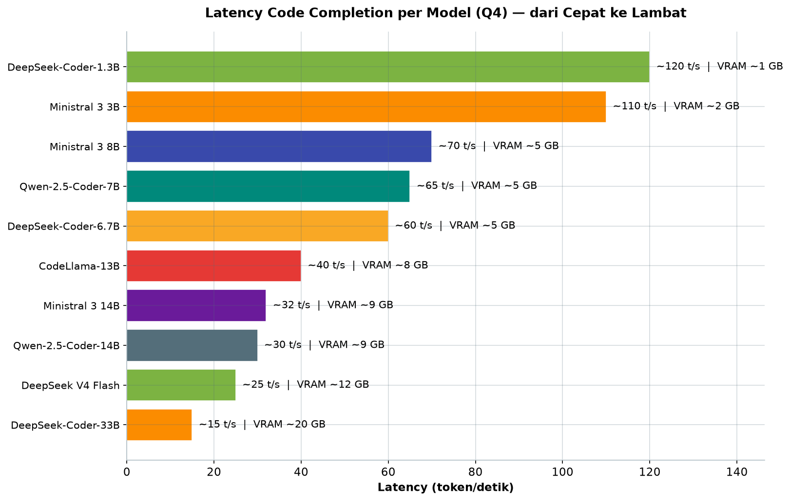
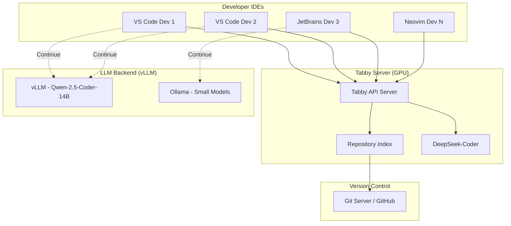

# Bab 7.5: Coding Helper

> Setelah bab 7.4 membekali tim Anda dengan dapur dokumen internal (RAG), sekarang saatnya menyiapkan "koki asisten" untuk para developer. Bayangkan satu GPU di ruang server melayani seluruh tim developer — melengkapi kode saat mengetik, menjawab pertanyaan tentang *codebase*, dan me-review PR — tanpa satu baris kode pun meninggalkan kantor Anda.

---

## 1. Tujuan Sub-Bab


Setelah membaca sub-bab ini, Anda akan mampu:

- Menimbang kapan memilih **Tabby** (*server-based*) versus **Continue** (*IDE extension*) untuk tim Anda
- Men-deploy *centralized coding assistant server* yang melayani seluruh tim dari satu GPU
- Mengkonfigurasi *repository-level context* dan *code indexing* agar saran kode sesuai konvensi internal
- Memilih model coding yang tepat: dari DeepSeek-Coder 1.3B yang ringan hingga DeepSeek V4 Flash dengan konteks 1 juta token
- Mengintegrasikan Continue dengan Tabby, vLLM, atau Ollama sebagai *backend* sesuai kebutuhan
- Mengukur *latency* layanan coding assistant dengan benchmark sederhana sebelum dan sesudah deploy

---

## 2. Kebutuhan Coding Assistant Terpusat untuk Tim


### Satu Server, Banyak Keyboard

Sejak GitHub Copilot meramaikan pasar, para developer di seluruh dunia sudah merasakan manisnya *code completion*: mengetik dua huruf, sisanya disarankan. Namun bagi kantor dengan 9-20 developer, pendekatan "setiap orang pakai AI sendiri" menyisakan tiga masalah klasik: biaya langganan yang berlipat-lipat, konfigurasi yang berbeda-beda, dan — yang paling krusial — **kode perusahaan yang dikirim ke server orang lain**. Kode adalah aset paling sensitif bagi *software house* dan tim internal; mengirimkannya ke GitHub Copilot atau ChatGPT berarti menitipkan kekayaan intelektual ke pihak ketiga.

Solusinya adalah membalik arah aliran data: datangkan assisan ke server Anda, bukan kirim kode Anda ke awan. Sebuah **centralized coding assistant server** — satu mesin dengan GPU, berdiri di ruang server atau di bawah meja admin — melayani semua IDE di tim melalui jaringan lokal. Setiap developer cukup memasang ekstensi di VS Code atau JetBrains, lalu semua permintaan *completion*, *chat*, dan *inline editing* diproses di dalam dinding kantor. Tidak ada kode yang bocor, tidak ada langganan per-user yang menumpuk, dan satu GPU bekerja untuk puluhan keyboard sekaligus.

Perlu ditegaskan sejak awal: *centralized coding assistant* bukan pengganti penuh GitHub Copilot, melainkan pengganti yang **lebih baik secara privasi dan biaya** (lihat Tabel 1). Yang dikorbankan adalah kemudahan *setup* instan dan *ecosystem* penyedia cloud; sebagai gantinya tim mendapat kendali penuh: model bisa diganti kapan saja, konteks kode tim dipahami lebih dalam lewat *indexing*, dan tidak ada satu pun pihak ketiga yang membaca kode klien Anda. Mentalitasnya sama seperti memindahkan dapur kantor ke dalam gedung sendiri setelah sekian lama memesan katering luar.

### Mengapa Tidak Cukup dengan Ollama per Developer?

Ollama di laptop masing-masing developer memang mudah, tetapi mengajarkan kebiasaan buruk: setiap laptop harus punya GPU atau mengorbankan performa; model di laptop A berbeda dengan laptop B sehingga pengalaman tidak konsisten; dan tidak ada satu tempat pun untuk melihat siapa memakai model apa. Dengan server terpusat, tim mendapatkan tiga hal sekaligus: **satu titik konfigurasi** (model, *context window*, kebijakan), **satu sumber data kode** (indexing repository perusahaan), dan **satu dashboard admin** untuk memantau pemakaian — seperti perpustakaan pusat ketimbang tumpukan buku pribadi di setiap meja.

---

## 3. Tabby: Server Code Completion Self-Hosted


### Bangun Arsitektur Tabby

**Tabby** adalah server *code completion* open source yang ditulis dalam **Rust** — pilihan bahasa yang bukan kebetulan, karena Rust memberi kecepatan tinggi dan penggunaan memori yang rendah untuk server yang melayani puluhan koneksi bersamaan. Arsitekturnya terdiri dari tiga lapisan: *server* inti yang mengekspos **REST API**, *indexer* yang membaca repository kode tim, dan *extension* yang dipasang di IDE — VS Code, JetBrains, hingga Vim/Neovim untuk para *terminal purist*. Semua IDE berbicara ke satu API yang sama, sehingga pengalaman menyeluruh seragam.

Fitur unggulan Tabby yang jarang dimiliki asisten coding lain: **repository-level code indexing**. Tabby membaca seluruh kode di repository tim, membangun *index* tentang struktur, nama fungsi, dan pola panggilan, lalu memanfaatkannya agar saran yang muncul benar-benar mengikuti konvensi internal perusahaan. Jika tim Anda menamai fungsi dengan awalan `get_` dan memakai error handling ala tertentu, saran Tabby akan meniru gaya itu — bukan gaya korpus publik dari internet. Ditambah **team management dashboard** untuk melihat siapa aktif, berapa banyak *completion* yang disajikan, dan seberapa sering saran diterima.

### Model dan Kebutuhan GPU

Dari sisi model, Tabby mendukung model open seperti **DeepSeek-Coder**, **StarCoder2**, dan **CodeLlama** melalui *backend* llama.cpp — tanpa dependensi ke layanan komersial mana pun. Kebutuhan sumber dayanya bersahabat untuk small office: **minimal 8 GB VRAM untuk context 16K**, dan **rekomendasi 24 GB untuk context 32K**. Sebuah RTX 4090 24 GB atau dua RTX 3090 yang dipasang *used* sudah cukup untuk melayani belasan developer aktif secara nyaman.

### Tabel 3: Kebutuhan Resource Tabby Server

Terakhir, pilih konfigurasi berdasarkan jumlah pengguna yang harus dilayani — tabel ini menjadi acuan *sizing* sebelum Anda membeli atau mengalokasikan GPU.

| Model Completion | Jumlah User | VRAM | RAM | Storage (Index) |
|:---|:---:|:---:|:---:|:---:|
| DeepSeek-Coder-1.3B | 10 user | 4 GB | 8 GB | ~500 MB |
| Ministral 3 8B | 15 user | 6 GB | 16 GB | ~1.5 GB |
| Qwen-2.5-Coder-7B | 15 user | 8 GB | 16 GB | ~2 GB |
| DeepSeek-Coder-6.7B | 20 user | 10 GB | 16 GB | ~2 GB |
| Qwen-2.5-Coder-14B | 20 user | 12 GB | 24 GB | ~3 GB |
| Ministral 3 14B | 20 user | 12 GB | 24 GB | ~3 GB |
| DeepSeek-Coder-33B | 20 user | 24 GB | 32 GB | ~5 GB |
| DeepSeek V4 Flash | 20 user | 16 GB | 32 GB | ~10 GB |

Tabel ini perlu dibaca sebagai spektrum, bukan daftar harga mati. Jika tim Anda 10 developer dan saran sederhana sudah memadai, DeepSeek-Coder-1.3B dengan 4 GB VRAM bahkan bisa berbagi GPU dengan layanan lain dari Bab 7.7. Namun perhatikan juga *storage index*: model besar dengan konteks panjang (DeepSeek V4 Flash) membutuhkan ~10 GB untuk menampung *index* repository — pastikan partisi data Tabby disimpan di NVMe, bukan HDD, agar pencarian *index* tidak menjadi botol.

---


---

## 4. Continue: Extension IDE dengan Backend Bebas Pilih


### Arsitektur Ringan

Jika Tabby adalah "rumah makan pusat", **Continue** adalah "kantin yang bisa diisi siapa saja". Continue adalah ekstensi untuk VS Code dan JetBrains yang secara arsitektur hanya menjadi *client*: ia tidak menjalankan model sendiri, melainkan terhubung ke *LLM backend* apa pun yang Anda tentukan — **Ollama**, **vLLM**, **OpenAI API**, bahkan **Tabby** itu sendiri. Bagi small office yang sudah memiliki vLLM dari bab 7.7 atau Ollama di workstation, Continue langsung bekerja tanpa server tambahan; cukup pasang, arahkan ke *endpoint*, selesai.

Fitur yang membuat Continue digemari: **@mentions** ke file dan konteks — cukup ketik `@` lalu sebutkan file `auth.service.ts` dan model akan mempertimbangkan isi file itu dalam jawabannya; **inline editing** dengan pintasan **Cmd+I** untuk menyunting seleksi kode secara langsung; dan **tab autocomplete** yang menyarankan kode berikutnya saat mengetik. Fleksibilitas ini menjadikan Continue jembatan antara "langganan cloud" dan "infrastruktur lokal": satu IDE, banyak *backend*, tinggal ganti-ganti.

### Pembagian Peran: Tabby untuk Completion, Continue untuk Chat

Perbedaan filosofi ini penting dipahami sebelum memilih (lihat Tabel 1). Tabby hadir sebagai *server* lengkap dengan *indexing* repository dan dashboard admin; Continue hadir sebagai *client* yang fleksibel tanpa pengelolaan server. Di banyak kasus, jawaban terbaik bukan memilih salah satu, melainkan **kombinasi keduanya**: Tabby sebagai mesin *completion* terpusat, dan Continue di setiap IDE sebagai antarmuka yang menambahkan *chat* dan *inline editing* ke model vLLM yang lebih besar.

---

## 5. Tabby vs Continue: Kapan Memilih yang Mana?


Keputusan pemilihan sebaiknya mengikuti tiga pertanyaan. **Pertama, berapa ukuran tim?** Untuk tim di atas 10 developer, pengelolaan terpusat menjadi kebutuhan — Tabby unggul dengan *centralized management*, *repository indexing*, dan *admin dashboard*. Untuk tim di bawah 10 developer, beban administrasi Tabby bisa berlebihan; Continue yang langsung terhubung ke Ollama/vLLM yang sudah ada lebih praktis. **Kedua, seberapa penting fleksibilitas model?** Continue memenangkan kategori ini dengan dukungan *backend* apa pun. **Ketiga, apakah Anda butuh visibilitas pemakaian?** Hanya Tabby yang menyediakan *dashboard* pemakaian per developer. Bila jawaban ketiganya campur, jangan ragu menjalankan keduanya secara paralel — keduanya open source dan tidak saling mengunci.

### Tabel 1: Tabby vs Continue vs GitHub Copilot

Berikut peta lengkap ketiga pendekatan utama agar keputusan tim Anda berbasis perbandingan langsung, bukan rumor.

| Fitur | Tabby | Continue | GitHub Copilot |
|:---|:---|:---|:---|
| **Arsitektur** | Server + Extension | Extension Only | Cloud |
| **Self-Hosted** | Ya (wajib) | Opsional | Tidak |
| **Code Completion** | Ya | Ya | Ya |
| **Chat** | Ya | Ya | Ya (Copilot Chat) |
| **Inline Editing** | Tidak | Ya (Cmd+I) | Ya |
| **Repository Indexing** | Ya | Limited | Ya (cloud) |
| **Admin Dashboard** | Ya (team mgmt) | Tidak | Ya (business) |
| **Harga** | Gratis (open source) | Gratis | $19/user/bulan |
| **Data Privacy** | 100% lokal | Tergantung backend | Cloud Microsoft |
| **GPU Requirement** | 8-24 GB VRAM | Tidak perlu | Tidak perlu |

Tabel ini langsung menjawab pertanyaan yang paling sering diajukan: mengapa repot diri-*hosting* padahal Copilot tinggal pasang? Jawabannya ada di baris *Data Privacy* dan *Harga*: untuk 15 developer, Copilot menghabiskan $285 per bulan (lihat detail kalkulasinya di Bab 7.8) dan semua konteks kode mengalir ke cloud Microsoft. Tabby menawarkan privasi penuh dan biaya nol per pengguna, dengan syarat Anda menyediakan GPU 8-24 GB. Continue adalah pelengkap sempurna — ia menambahkan *inline editing* yang tidak dimiliki Tabby, sekaligus menjadi *client* untuk segala *backend*.


---

## 6. Model Coding Assistant yang Direkomendasikan


Pemilihan model menentukan dua hal: kualitas saran dan kapasitas pengguna. Untuk **code completion** — tugas yang harus merespons dalam puluhan hingga ratusan milidetik — pilih model kecil yang gesit: **DeepSeek-Coder-6.7B** sebagai pekerja keras serbaguna, **Ministral 3 8B** (Apache 2.0, dibekali *Cascade Distillation* dari Mistral), atau **Qwen-2.5-Coder-7B** yang unggul dalam *multilingual code generation*. Untuk **chat dan code review**, butuh model yang lebih berpikir: **DeepSeek-Coder-33B**, **Qwen-2.5-Coder-14B**, atau **Ministral 3 14B**; sementara **Llama-3.1-8B** bisa menjadi jenderal serbaguna untuk pertanyaan umum.

Untuk tim besar yang sering bekerja dengan *repository* raksasa, ada kelas baru yang menarik: **DeepSeek V4 Flash** (284B parameter, 13B aktif, lisensi MIT, konteks **1 juta token**) — seluruh *codebase* perusahaan dapat masuk ke dalam satu konteks tanpa *chunking*, mengubah cara *code review* dilakukan. Terakhir, jika tim sudah matang, jalan berikutnya adalah **fine-tuning dengan QLoRA** untuk mengadaptasi model ke gaya kode dan domain bisnis Anda sendiri — topik yang akan dibahas lebih dalam pada jilid berikutnya.

Sebagai panduan kasar memilih posisi di Tabel 2: mulailah dari model 6-8B untuk *completion* dan 14B untuk *chat* — pasangan ini adalah titik manis antara kualitas, VRAM, dan *latency* bagi tim di bawah 20 developer. Naik ke 33B hanya jika *review* kode membutuhkan pemahaman lintas file yang dalam; melompat ke DeepSeek V4 Flash hanya jika tim sering membaca *codebase* puluhan ribu baris dalam sekali konteks. Turun ke model 1.3-3B hanya untuk pengujian atau *autocomplete* di mesin tanpa GPU. Prinsipnya: beli kemampuan yang benar-benar dipakai, bukan yang paling mengesankan di *leaderboard*.

### Tabel 2: Model untuk Coding Assistant

Sebelum mengisi konfigurasi, kenali lini model coding yang bisa Anda pakai beserta kebutuhan VRAM dan kecepatannya (asumsi kuantisasi Q4).

| Model | Ukuran | Completion Quality | Chat Quality | VRAM (Q4) | Latency (t/s) |
|:---|:---:|:---:|:---:|:---:|:---:|
| **DeepSeek-Coder-1.3B** | 1.3B | ** | * | ~1 GB | ~120 t/s |
| **Ministral 3 3B** | 3B | *** | ** | ~2 GB | ~110 t/s |
| **Qwen-2.5-Coder-7B** | 7B | **** | *** | ~5 GB | ~65 t/s |
| **DeepSeek-Coder-6.7B** | 6.7B | **** | *** | ~5 GB | ~60 t/s |
| **Ministral 3 8B** | 8B | **** | *** | ~5 GB | ~70 t/s |
| **CodeLlama-13B** | 13B | **** | *** | ~8 GB | ~40 t/s |
| **Qwen-2.5-Coder-14B** | 14B | ***** | **** | ~9 GB | ~30 t/s |
| **Ministral 3 14B** | 14B | ***** | **** | ~9 GB | ~32 t/s |
| **DeepSeek-Coder-33B** | 33B | ***** | ***** | ~20 GB | ~15 t/s |
| **DeepSeek V4 Flash** | 284B/13B aktif | ***** | ***** | ~12 GB (Q4) | ~25 t/s |

Perhatikan polanya: kualitas bintang dan *latency* bergerak berlawanan secara hampir linear. Model 1.3B memberi respons ~120 token/detik namun kualitas saran terbatas; DeepSeek-Coder-33B memberi kualitas terbaik namun melambat ke ~15 t/s dan membutuhkan 20 GB VRAM. Bintang kualitas di sini berakar pada benchmark *code generation* seperti **HumanEval** [5] — standar evaluasi yang memperkenalkan pengukuran pass@1 pada model kode. DeepSeek V4 Flash menarik karena dengan hanya ~12 GB VRAM di Q4 ia memberi kualitas bintang penuh dan throughput ~25 t/s — keunggulan arsitektur MoE yang hanya mengaktifkan 13 miliar parameter per token.



*Gambar 7.5-1 — Spektrum latency turun drastis seiring naiknya kelas model: DeepSeek-Coder-1.3B merespons ~120 t/s tetapi hanya berbintang kualitas dua, sementara DeepSeek-Coder-33B melambat ke ~15 t/s. DeepSeek V4 Flash mematahkan pola itu — ~25 t/s dengan VRAM hanya ~12 GB berkat arsitektur MoE 13B aktif.*


### Diagram 1: Arsitektur Centralized Coding Assistant

Berikut arsitektur lengkap yang akan Anda bangun: semua IDE developer terhubung ke satu server Tabby, dengan jalur paralel menuju backend vLLM via Continue.



Diagram ini memetakan tiga lapisan penting. **Lapisan pertama**, *Developer IDEs*, adalah wajah yang dilihat pengguna — semuanya berbicara ke satu alamat via HTTP. **Lapisan kedua**, Tabby Server, adalah otak: API server menerima permintaan, *Repository Index* yang disinkronkan dari Git menyediakan konteks kode perusahaan, dan model DeepSeek-Coder menghasilkan saran. **Lapisan ketiga** adalah *backend* tambahan untuk Continue — vLLM untuk model chat besar dan Ollama untuk model kecil — yang diakses secara opsional dengan jalur putus-putus. Garis putus-putus inilah yang menandakan fleksibilitas Continue: tanpa mengubah apa pun di sisi server, setiap developer bisa memilih *backend* sesuai kebutuhannya.

Setelah arsitektur hidup, dua tempat patut dikunjungi untuk memastikan semuanya sehat. Pertama, **Tabby admin dashboard** — tampilan yang merangkum *user aktif*, statistik *completion*, dan pemakaian model; dari sini Anda bisa tahu developer mana yang belum memasang ekstensi dan model mana yang paling banyak dipanggil. Kedua, pengalaman **Continue di VS Code** dengan *backend* Tabby — *inline completion* yang muncul saat mengetik adalah ujian paling jujur: jika saran terasa lambat atau meleset, kembali ke Tabel 2 dan Tabel 3 untuk mengevaluasi ulang pilihan model dan kapasitas VRAM.

---


---

## 7. Praktikum / Hands-On


### Langkah 1: Deploy Tabby Server dengan Docker

Langkah pertama membangun rumah makan kode Anda: jalankan Tabby sebagai kontainer Docker dengan akses GPU penuh. Model akan diunduh otomatis saat pertama kali berjalan.

```bash
#!/bin/bash
# Setup Tabby server untuk tim developer

# 1. Pull model coding (DeepSeek-Coder-6.7B)
# Tabby akan download model otomatis saat pertama running

# 2. Jalankan Tabby server
docker run -d \
  --name tabby \
  --restart always \
  --gpus all \
  -p 8080:8080 \
  -v tabby-data:/data \
  -e TABBY_MODEL_CACHE_DIR=/data/models \
  -e TABBY_DISABLE_USAGE_COLLECTION=1 \
  tabbyml/tabby:latest \
  serve --model StarCoder2-7B \
  --device cuda \
  --port 8080

# 3. Verifikasi server
curl http://localhost:8080/v1/health

# 4. Index repository perusahaan
docker exec tabby tabby scheduler \
  --git-url https://github.com/company/internal-lib.git \
  --git-branch main
```

Catatan praktis: ganti `StarCoder2-7B` dengan model pilihan dari Tabel 2 (misalnya DeepSeek-Coder-6.7B) sesuai kapasitas VRAM Anda. Variabel `TABBY_DISABLE_USAGE_COLLECTION=1` mematikan telemetri — sesuai prinsip privasi kode yang menjadi alasan utama memilih self-hosted. Langkah keempat adalah kunci dari *repository-level context*: tanpa menjalankan *scheduler* ini, Tabby tidak akan mengenal kode internal tim.

### Langkah 2: Konfigurasi Continue dengan Backend Tabby

Selanjutnya pasang Continue di VS Code developer dan arahkan ke dua *backend*: Tabby untuk *completion* cepat, dan vLLM untuk *chat* dengan model lebih besar.

```json
// config.json — Continue VS Code extension
{
  "models": [
    {
      "title": "Tabby Completion",
      "provider": "tabby",
      "apiBase": "http://10.0.0.100:8080",
      "apiKey": "tabby-local"
    },
    {
      "title": "Qwen-2.5-Coder-14B (Chat)",
      "provider": "openai",
      "apiBase": "http://10.0.0.100:8000/v1",
      "apiKey": "not-needed",
      "model": "Qwen/Qwen-2.5-Coder-14B-Instruct"
    }
  ],
  "tabAutocompleteModel": {
    "title": "Tabby",
    "provider": "tabby",
    "apiBase": "http://10.0.0.100:8080"
  },
  "slashCommands": [
    {
      "name": "edit",
      "description": "Edit selected code"
    },
    {
      "name": "review",
      "description": "Review this code"
    }
  ]
}
```

Perhatikan bagaimana satu ekstensi memuat dua kepribadian: model `Tabby Completion` menangani *tab autocomplete* (ditunjuk secara khusus lewat `tabAutocompleteModel`), sementara `Qwen-2.5-Coder-14B` menangani *chat*. Keduanya berjalan di dalam kantor — `10.0.0.100` adalah alamat server internal. *Slash commands* `edit` dan `review` membuka pintu menuju *inline editing* (Cmd+I) dan *code review* yang dipersonalisasi.

### Langkah 3: Benchmark Latency Coding Assistant

Setelah server hidup, jangan langsung merayakan kemenangan — ukur dulu apakah *latency*-nya layak dipakai harian. Skrip berikut menguji lima pola pemicu *completion* dari berbagai bahasa dan menghitung P50, P95, dan rata-rata.

```python
# benchmark_tabby.py — uji latency completion
import requests
import time
import statistics

TABBY_URL = "http://localhost:8080/v1/completions"
CODE_SNIPPETS = [
    "def fibonacci(n):",
    "const handleClick = () => {",
    "SELECT * FROM users WHERE",
    "@GetMapping(\"/api/v1/",
    "terraform {",
]

for snippet in CODE_SNIPPETS:
    latencies = []
    for _ in range(10):
        start = time.time()
        r = requests.post(TABBY_URL, json={
            "prompt": snippet,
            "max_tokens": 50,
            "temperature": 0.1
        })
        elapsed = (time.time() - start) * 1000
        latencies.append(elapsed)
    
    print(f"Prompt: {snippet[:30]}...")
    print(f"  P50: {statistics.median(latencies):.0f}ms")
    print(f"  P95: {sorted(latencies)[8]:.0f}ms")
    print(f"  Avg: {statistics.mean(latencies):.0f}ms")
```

Bacaan hasilnya: **P50** mewakili pengalaman pengguna "biasa", sementara **P95** mewakili momen terburuk — misalnya saat delapan developer mengetik bersamaan. Jika P95 melewati ~2 detik, jadwal *burst* tersebut menandakan perlunya mengecilkan model completion (dari 14B ke 7B) atau menambah prioritas pada layanan ini di Bab 7.7. Simpan hasil ini sebagai baseline; bandingkan lagi sebulan kemudian setelah penambahan *index* repository.

---

## 8. Studi Kasus: Centralized Coding Assistant untuk 15 Developer


**Skenario.** Sebuah *software agency* dengan 15 developer — 5 *frontend* (React), 6 *backend* (Node.js, Python, Go), dan 4 *mobile* (Flutter) — selama ini mengandalkan GitHub Copilot. Setiap bulan mereka membayar langganan *per seat*, dan yang lebih merisaukan: kode klien perbankan mereka dikirim ke cloud Microsoft. Pimpinan engineering mendapat mandat membangun asisten internal tanpa mengorbankan kualitas.

**Analisis pilihan.** Tim di atas 10 developer dan membutuhkan pengelolaan terpusat, sehingga **Tabby** jelas memenangkan peran *server*. Namun developer menginginkan *chat* dan *inline editing* ala Copilot yang tidak dimiliki Tabby — jawabannya **Continue** di setiap IDE dengan *backend* Tabby plus vLLM. Hardware yang tersedia adalah *workstation* dengan dual RTX 4090 (48 GB VRAM total). Dari Tabel 3, kombinasi yang pas: **Ministral 3 8B** untuk *completion* (Apache 2.0, ~6 GB VRAM, melayani 15 user) dan **DeepSeek V4 Flash** untuk *chat/review* dengan konteks 1 juta token — sisa VRAM bisa diisi model lain via Bab 7.7.

**Langkah solusi.** Tabby dijalankan dengan Docker (Langkah 1), model completion dijaga di RTX 4090 pertama, sementara vLLM diisi DeepSeek V4 Flash di kartu kedua. *Repository indexing* diaktifkan untuk 5 repo utama. Setiap developer memasang Continue dan menyalin `config.json` ala Langkah 2. Fitur yang langsung dipakai: *tab completion* real-time, *chat* perintah seperti "Refactor function ini pakai async/await", *inline edit* Cmd+I, dan *review* "Review PR ini dari sisi security".

**Hasil.** Setelah empat minggu, developer melaporkan peningkatan kecepatan coding **25-40%**. *Accepted rate* completion mencapai **35%** — di atas standar industri ~30% — karena saran Tabby mengikuti konvensi kode internal berkat *repository indexing*. Jumlah PR per hari naik dari 2,5 menjadi **3,8**. Biaya tambahan nyaris nol: Tabby gratis, inference memakai GPU yang sudah ada, dan hanya *storage indexing* ~5 GB yang tersedot.

**Pelajaran.** Data pemakaian menunjukkan **DeepSeek-Coder-6.7B sudah cukup untuk 90% kasus** — model 33B hanya diperlukan untuk *review* kode kompleks. Jangan membeli kekuatan yang tidak terpakai; naikkan kelas model hanya ketika benchmark P95 (Langkah 3) atau keluhan kualitas benar-benar muncul.

---

## 9. Referensi


### Paper Jurnal/Konferensi

[1] Feng, Z., Guo, D., Tang, D., et al. (2020). *CodeBERT: A Pre-Trained Model for Programming and Natural Languages*. Findings of ACL (EMNLP). DOI: [10.48550/arXiv.2002.08155](https://arxiv.org/abs/2002.08155)
- Landasan *pre-trained model* untuk pemahaman kode; latar belakang arsitektur model coding assistant.

[2] Li, R., Allal, L.B., Zi, Y., et al. (2023). *StarCoder: May the Source Be With You!*. arXiv: 2305.06161. DOI: [10.48550/arXiv.2305.06161](https://arxiv.org/abs/2305.06161)
- Model open code LLM yang menjadi salah satu opsi backend Tabby; dasar pembahasan model completion.

[3] Guo, D., Zhu, Q., Yang, D., et al. (2024). *DeepSeek-Coder: When the Large Language Model Meets Programming — The Rise of Code AI*. arXiv: 2401.14196. DOI: [10.48550/arXiv.2401.14196](https://arxiv.org/abs/2401.14196)
- Model coding utama yang direkomendasikan untuk Tabby; kualitas completion di Tabel 2 merujuk benchmark paper ini.

[4] Qwen Team, Alibaba Group. (2025). *Qwen-2.5-Coder: A Strong Code Language Model*. arXiv: 2502.02368. DOI: [10.48550/arXiv.2502.02368](https://arxiv.org/abs/2502.02368)
- Alternatif model coding terbaru dengan dukungan multilingual; relevan untuk tim multi-bahasa.

[5] Chen, M., Tworek, J., Jun, H., et al. (2021). *Evaluating Large Language Models Trained on Code*. NeurIPS. DOI: [10.48550/arXiv.2107.03374](https://arxiv.org/abs/2107.03374)
- Memperkenalkan benchmark HumanEval — standar evaluasi code generation yang dirujuk di Tabel 2.

### Referensi Pendukung (Dokumentasi/Repository)

[6] TabbyML. *Official Documentation*. [https://tabby.tabbyml.com/docs](https://tabby.tabbyml.com/docs)

[7] Continue.dev. *Official Documentation*. [https://docs.continue.dev](https://docs.continue.dev)

[8] Ollama Code Models. [https://ollama.com/library?q=coder](https://ollama.com/library?q=coder)

[9] BigCode Project. *StarCoder2 Models*. [https://huggingface.co/bigcode](https://huggingface.co/bigcode)

[10] Hugging Face Open LLM Leaderboard for Code. [https://huggingface.co/spaces/bigcode/bigcode-models-leaderboard](https://huggingface.co/spaces/bigcode/bigcode-models-leaderboard)

[11] Mistral AI Team. (2025). *Ministral 3: Open Dense Language Models via Cascade Distillation*. [https://mistral.ai/news/ministral-3](https://mistral.ai/news/ministral-3)
- Model dense 3B/8B/14B Apache 2.0 — alternatif open untuk coding assistant dengan performa kompetitif berkat Cascade Distillation.

[12] DeepSeek Team. (2026). *DeepSeek-V4: Advancing Open Language Models with Mixture-of-Experts*. [https://api-docs.deepseek.com](https://api-docs.deepseek.com)
- DeepSeek V4 Flash (MIT, 284B/13B aktif) membawa konteks 1M ke coding assistant — memungkinkan repository-level code understanding tanpa chunking.
