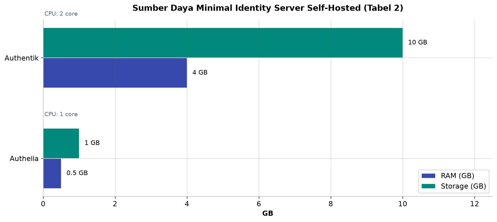
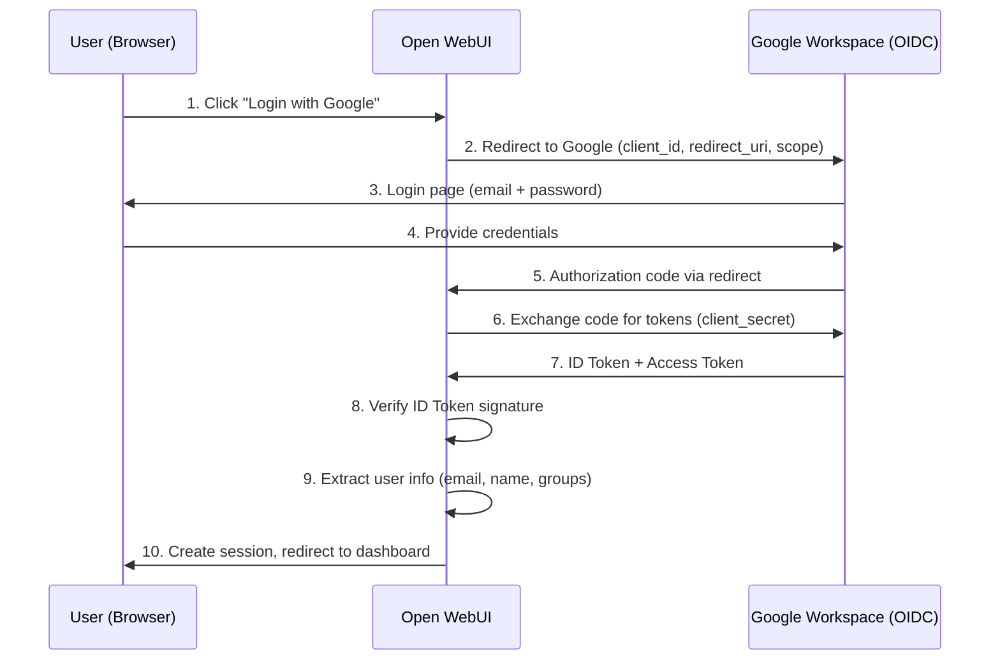
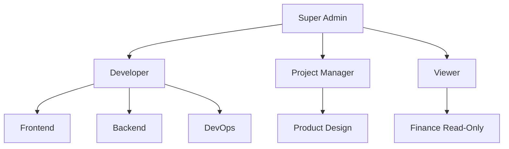

# Bab 7.6: Identity Management

> Pintu masuk platform AI kantor Anda tidak boleh berupa deretan password yang dibagikan berbisik-bisik antar meja. Dengan integrasi Google Workspace atau Microsoft 365 via OAuth, setiap karyawan masuk menggunakan akun yang sudah mereka kenal setiap hari — dan setiap akses tercatat, terkelola, dan bisa dicabut seketika.

---

## 1. Tujuan Sub-Bab

Setelah membaca sub-bab ini, Anda akan mampu:

- Mengintegrasikan **Google Workspace** atau **Microsoft 365** sebagai *identity provider* untuk platform AI small office
- Mengkonfigurasi **OAuth 2.0** dan **OpenID Connect (OIDC)** pada Open WebUI
- Menerapkan **RBAC** (*Role-Based Access Control*) untuk membedakan akses per tim dan departemen
- Membandingkan empat pilihan IDP — Google Workspace, Microsoft Entra ID, Authentik, dan Authelia — secara objektif
- Menerapkan praktik keamanan OAuth: HTTPS, PKCE, *revocation*, dan pemantauan *consent grants*

---

## 2. Mengapa Identity Management Penting untuk Small Office?

### Dari Berbagi Password ke Single Sign-On

Di kantor dengan 9-20 pengguna, godaan terbesar adalah menyederhanakan akses dengan cara yang paling berbahaya: satu password bersama, ditulis di sticky note, ditempel di monitor. Padahal konsekuensinya berlipat: tidak ada yang tahu siapa yang bertanya apa; tidak ada yang bisa dipertanggungjawabkan saat model menghasilkan jawaban produksi; dan ketika seorang karyawan keluar, password itu tetap hidup di tangan semua orang yang pernah melihatnya. *Identity management* mengubah kekacauan ini menjadi ketertiban ala hotel berbintang — setiap tamu punya kartu kamar sendiri, dan resepsionis bisa mencabut aksesnya dalam sekejap.

Solusi paling elegan untuk small office adalah **memanfaatkan akun yang sudah dimiliki karyawan**: Google Workspace untuk mayoritas startup Indonesia, atau Microsoft 365 untuk perusahaan yang hidup di ekosistem Office. Dengan *single sign-on* (SSO) via **OAuth**, karyawan tidak perlu membuat akun baru sama sekali — *zero onboarding friction*. Akun AI adalah akun email kantor; password tinggal satu; dan saat seseorang dipecat atau pindah, pencabutan akses di satu tempat (konsol Google atau Azure) otomatis memutus akses ke platform AI.

SSO juga membawa kenyamanan psikologis yang sering diabaikan: karyawan tidak perlu mengingat "password ke-17 untuk sistem ke-17". Pada skala 9-20 pengguna, beban *password fatigue* ini nyata — dan justru menjadi sumber kebiasaan berbahaya seperti menulis password di post-it atau memakai password yang sama untuk semuanya. Dengan satu pintu masuk yang sudah dikenal, dua masalah dihapus sekaligus: keamanan lebih baik, dan pengalaman pengguna lebih halus. Bonus lain yang tidak kalah penting: *consent screen* Google/Microsoft memberi tahu pengguna aplikasi mana yang meminta akses apa, sehingga transparansi akses menjadi bagian dari alur login itu sendiri.

### Tiga Nilai yang Tidak Bisa Ditawar

Integrasi identitas membawa tiga nilai yang langsung terasa di operasional harian. **Pertama, audit trail**: setiap permintaan ke model bisa dilacak ke pengguna, waktu, dan model yang dipakai — aset penting saat ada pertanyaan "siapa yang meminta ringkasan kontrak itu?". **Kedua, RBAC**: *developer* mendapat akses model coding, tim *finance* hanya melihat RAG SOP, dan admin memegang kendali penuh — tanpa perlu membuat akun terpisah. **Ketiga, otomatisasi onboarding-offboarding**: karyawan baru masuk langsung bisa menggunakan platform; karyawan yang keluar kehilangan akses seketika, tanpa satu pun password bersama yang tersisa.

---

## 3. Arsitektur OAuth 2.0 dan OpenID Connect

### OIDC: Lapisan Identitas di Atas OAuth

Sebelum menyentuh konfigurasi, pahami dulu dua standar yang akan saling bekerja sama. **OAuth 2.0** [1] adalah kerangka *authorization* — ia menjawab pertanyaan "bolehkah aplikasi ini mengakses sumber daya atas nama pengguna?", tanpa terlalu peduli siapa penggunanya. **OpenID Connect (OIDC)** [2] menambahkan lapisan *identity* di atasnya: token yang dikeluarkan kini berisi klaim tentang siapa pengguna — email, nama, dan kelompok — dalam bentuk **ID Token** yang dapat diverifikasi. Dalam praktik sehari-hari: OAuth memberi kunci lemari, OIDC memberi kartu identitas yang menyertainya.

Alur lengkapnya terlihat di Diagram 1, tetapi intinya sederhana: (1) pengguna mengklik "Login with Google" di Open WebUI; (2) browser diarahkan ke Google dengan *client ID*, *redirect URI*, dan *scope*; (3) Google menampilkan halaman login; (4) setelah kredensial benar, Google mengembalikan *authorization code* ke Open WebUI; (5) Open WebUI menukar kode itu dengan **ID Token dan Access Token** menggunakan *client secret*; (6) token ditukar, lalu Open WebUI memverifikasi **tanda tangan ID Token** dan mengekstrak informasi pengguna sebelum membuat sesi lokal. Kunci keamanan utamanya: **password tidak pernah dikirim ke aplikasi** — kredensial hanya berpindah antara pengguna dan Google; verifikasi dilakukan di server internal Anda.

Satu nuansa penting soal *scope*: Open WebUI hanya meminta apa yang benar-benar dibutuhkan — umumnya `openid`, `email`, dan `profile` — bukan akses ke Gmail atau Drive karyawan. Prinsip *least privilege* ini berlaku dua arah: IDP tidak memberi lebih dari yang diminta, dan aplikasi tidak bertanya lebih dari yang diperlukan. Jika suatu hari Anda melihat aplikasi meminta *scope* mencurigakan pada *consent screen*, itu adalah bendera merah yang layak diselidiki sebelum diklik. Kebiasaan membaca *consent screen* — seperti membaca rincian tagihan sebelum membayar — adalah pertahanan pertama pengguna biasa terhadap aplikasi yang rakus izin.

### PKCE: Pengaman Ekstra untuk Web dan Mobile

Ancaman paling nyata pada alur OAuth adalah *authorization code interception* — kode yang dicegat di tengah perjalanan sebelum sempat ditukar dengan token. Jawaban standar industri adalah **PKCE** (*Proof Key for Code Exchange*) [5]: aplikasi membuat *code verifier* acak, hanya mengirim *challenge*-nya ke Google, lalu membuktikan kepemilikannya saat menukar kode. Karena penyerang tidak tahu verifier aslinya, kode curian menjadi tidak berguna. Untuk Open WebUI yang diakses dari browser di kantor, PKCE adalah pengaman wajib yang diaktifkan hampir tanpa biaya konfigurasi — dan menjadi syarat pertama *security checklist* Anda di seksi 6.

---

## 4. Pilihan Identity Provider untuk Small Office

### Cloud: Google Workspace dan Microsoft Entra ID

**Google Workspace** adalah pilihan paling umum untuk startup Indonesia — gratis hingga **300 pengguna** di tier *Workspace Starter*, dan mayoritas karyawan sudah punya akunnya untuk email dan Docs. Dukungannya terhadap OIDC matang, *setup*-nya paling rendah kompleksitasnya, dan MFA sudah *built-in*. **Microsoft Entra ID** (dulu Azure AD) adalah pilihan natural bagi perusahaan yang hidup di Office 365: mendukung **SAML dan OIDC**, *conditional access*, serta sinkronisasi *SCIM* untuk grup. Kekurangan keduanya sama: Anda bergantung pada cloud pihak ketiga, dan pengaturan lebih dalam (misalnya *App Roles* untuk grup) membutuhkan penjelajahan konsol yang tidak selalu ramah.

### Self-Hosted: Authentik dan Authelia

Bagi kantor yang ingin merdeka sepenuhnya dari cloud, ada dua kandidat open source. **Authentik** adalah *identity provider* serba bisa yang menangani OIDC, SAML, dan LDAP sekaligus, dengan antarmuka yang modern — cocok sebagai *bridge* antara Google Workspace dan aplikasi internal, seperti yang akan dilihat di studi kasus. **Authelia** lebih ringan: cukup 1 core CPU dan 512 MB RAM, bisa menyatu dengan LDAP yang sudah ada — ideal jika kantor hanya butuh lapisan login tambahan tanpa ambisi integrasi rumit. Pilih Authentik bila Anda butuh kendali penuh dan mulai dari nol; pilih Authelia bila infrastruktur identitas sudah ada dan yang kurang hanya gerbangnya.

---

## 5. RBAC dan Scope Management

Memiliki IDP hanyalah setengah jalan; setengahnya lagi adalah memutuskan siapa boleh apa. **RBAC** memetakan peran ke hak akses secara eksplisit (lihat Tabel 3): **Super Admin** dengan akses total termasuk panel admin dan manajemen pengguna; **Developer** yang mendapat model coding plus RAG teknis; **Project Manager** yang mendapat model umum dan dokumen proyek; dan **Viewer** yang hanya boleh *chat* dengan akses baca. Pemetaan ini bisa diperluas menjadi *per-group pricing* — misalnya departemen yang memakai model besar dikenakan kuota berbeda — sehingga pemakaian GPU terkontrol sejak pintu masuk, selaras dengan tata kelola resource di Bab 7.7.

Agar RBAC benar-benar efektif, IDP harus menyuplai kelompok pengguna ke Open WebUI — entah melalui *group sync* dari Google Workspace, *App Roles* di Entra ID, atau sinkronisasi LDAP dari Authentik. Begitu kelompok tersinkron, kebijakan di sisi aplikasi tinggal menyambungkannya ke peran. Inilah mengapa arsitektur pada Diagram 1 mencantumkan *groups* sebagai bagian dari informasi yang diekstrak dari ID Token: tanpa data kelompok, RBAC hanya menjadi teks di dokumen, bukan aturan yang berjalan.

Ada satu kesalahan umum yang layak dihindari sejak awal: menerapkan RBAC hanya di lapisan antarmuka. Jika kebijakan akses hanya menyembunyikan tombol di UI, permintaan yang dipalsukan lewat API langsung tetap bisa menembus. Untuk platform AI, pastikan penegakan peran terjadi di sisi *backend* — misalnya saat mengirim request ke vLLM, periksa kembali role pengguna terhadap model yang diminta — sehingga matriks Tabel 3 berlaku juga bagi klien yang tidak memakai Open WebUI. Lapisan ganda ini (UI + API) adalah pembeda antara RBAC tampilan dan RBAC sungguhan.

---

## 6. Security Considerations

### HTTPS dan Higiene Token

Aturan pertama integrasi OAuth di kantor: **HTTPS wajib** — *redirect URI* dari Google dan Microsoft tidak menerima alamat non-HTTPS kecuali `localhost`. Artinya, sebelum menyentuh lingkungan variabel, pastikan `ai.kantor.local` sudah disambangi lewat *reverse proxy* dengan sertifikat (misalnya Caddy atau Nginx + Let's Encrypt). Aturan kedua menyangkut higiene token: *client secret* disimpan hanya di sisi server (via *environment variable*), tidak pernah di kode klien; *access token* dan *refresh token* diperlakukan seperti kunci gudang — disimpan aman, dirotasi berkala, dan dicabut segera saat tidak terpakai.

Pelajaran dari **insiden keamanan Vercel 2026** yang melibatkan *OAuth token* mengingatkan bahwa token yang bocor sekali bisa menghantam banyak layanan sekaligus. Untuk platform AI kantor, terjemahkan itu menjadi tiga kebiasaan: **revoke token** akun yang tidak aktif secara periodik, **monitor OAuth consent grants** di konsol Google/Azure setiap bulan — liat siapa yang memberi izin ke aplikasi apa — dan aktifkan **PKCE** sebagai jaring pengaman alur browser. Keamanan identitas bukan proyek sekali jadi, melainkan rutinitas bulanan seperti mengecek CCTV dan kunci gudang.

Terakhir, satu pertimbangan yang sering terlambat disadari: **masa sesi**. Sesi login yang tidak pernah kedaluwarsa adalah pintu yang tidak pernah terkunci — jika sebuah laptop hilang, akses AI kantor ikut hilang bersama isinya. Atur masa sesi pendek (misalnya 8-24 jam) dan kombinasikan dengan MFA dari IDP agar login kembali tidak memberatkan. Bagi platform AI small office, keseimbangan yang sehat adalah: sesi kerja harian yang nyaman, tetapi penguncian otomatis yang tegas. Karyawan boleh lupa menutup tab; sistem tidak boleh lupa mengunci pintu.

---

## 7. Tabel Perbandingan

Empat tabel berikut merangkum keputusan yang Anda hadapi: memilih IDP, mengalokasikan sumber daya untuknya, dan memetakan peran pengguna. Gunakan ketiganya berurutan — pilih IDP, siapkan host, lalu terjemahkan struktur organisasi ke peran.

### Tabel 1: Perbandingan Identity Provider

Berikut peta perbandingan keempat kandidat IDP agar keputusan Anda berbasis fakta teknis, bukan kebiasaan semata.

| Fitur | Google Workspace | Microsoft Entra ID | Authentik | Authelia |
|:---|:---|:---|:---|:---|
| **Tipe** | Cloud SaaS | Cloud SaaS | Self-hosted | Self-hosted |
| **Harga** | Gratis (starter) | Berbayar | Gratis (OSS) | Gratis (OSS) |
| **Protokol** | OIDC/OAuth 2 | OIDC, SAML | OIDC, SAML, LDAP | OIDC, LDAP |
| **MFA** | Ya (built-in) | Ya (Conditional) | Ya (TOTP/WebAuthn) | Ya (TOTP) |
| **RBAC** | Groups + OU | Groups + Roles | Groups | Groups |
| **User Sync** | Real-time | SCIM | LDAP sync | LDAP sync |
| **Self-hosted** | Tidak | Tidak | Ya | Ya |
| **Kompleksitas Setup** | Rendah | Sedang | Sedang | Rendah |

Membaca tabel ini, keputusan utama Anda sebenarnya hanya dua. Jika tim sudah hidup di Google Workspace — kondisi mayoritas startup Indonesia — integrasi langsung ke Google adalah jalan tercepat dengan kompleksitas terendah; Microsoft Entra ID baru masuk akal bila langganan Office 365 sudah ada dan kebutuhan *conditional access* muncul. Jika kantor menolak dependensi cloud untuk identitas, Authentik menawarkan keseimbangan fitur terbaik, sementara Authelia cocok sebagai lapisan ringan yang menyatu dengan LDAP yang sudah berjalan.

### Tabel 2: Resource Identity Server

Jika Anda memilih jalur self-hosted, alokasikan sumber daya sekecil ini untuk IDP:

| Provider | CPU | RAM | Storage | Catatan |
|:---|:---:|:---:|:---:|:---|
| **Authentik (self-hosted)** | 2 core | 4 GB | 10 GB | Postgres + Redis |
| **Authelia** | 1 core | 512 MB | 1 GB | SQLite/Redis |
| **Google Workspace** | - | - | - | Cloud, tidak perlu server |

Tabel ini menegaskan bahwa biaya identitas self-hosted nyaris nol — Authentik butuh 2 core dan 4 GB RAM karena menumpang database Postgres dan Redis, sementara Authelia cukup 512 MB. Keduanya bahkan bisa berbagi host dengan Open WebUI atau IDP server lain. Bandingkan dengan biaya tiket cloud tahunan; secara strategis, keputusan self-hosted IDP hampir selalu layak dipertimbangkan meski kompleksitas setup-nya "Sedang".



*Gambar 7.6-1 — Authentik menuntut 8x RAM (4 GB vs 512 MB) dan 10x storage (10 GB vs 1 GB) karena membawa Postgres + Redis, sementara Authelia cukup satu core. Selisih ini tetap nol rupiah berlisensi — hanya berpengaruh saat menyewa VPS atau berbagi host.*

### Tabel 3: Konfigurasi RBAC untuk Small Office

Matriks peran berikut adalah cetak biru kebijakan akses yang akan Anda terjemahkan ke grup di IDP:

| Role | Akses Model | Akses RAG | Upload File | Admin Panel | Manajemen User |
|:---|:---|:---|:---|:---|:---:|
| **Super Admin** | Semua | Semua | Ya | Ya | Ya |
| **Developer** | Coding + General | Teknis | Ya | Tidak | Tidak |
| **Project Manager** | General + Chat | Dokumen Proyek | Ya | Tidak | Tidak |
| **Viewer** | Chat only | Read only | Tidak | Tidak | Tidak |

Dua hal patut diperhatikan. Pertama, **minimalisasi hak**: *Viewer* bahkan tidak bisa mengunggah file — batasan yang meredam risiko kebocoran data dan pemborosan GPU sekaligus. Kedua, pemisahan domain RAG: *Developer* hanya menjangkau RAG teknis, *PM* hanya dokumen proyek, sehingga sebuah permintaan tidak pernah secara tidak sengaja menceburkan konteks kuangan ke model umum. Mulailah dari matriks ini, lalu sesuaikan kelompoknya saat tim bertumbuh.

---

## 8. Diagram & Visualisasi

### Diagram 1: Flow OAuth 2.0 + OpenID Connect

Inilah perjalanan lengkap sebuah login: dari klik tombol di browser hingga sesi terbuka di Open WebUI.



Perhatikan dua detail penting dalam diagram ini. **Pertama**, kredensial pengguna (langkah 3-4) hanya berpindah antara browser dan Google — Open WebUI tidak pernah melihat password, sebuah prinsip yang membuat platform AI kantor Anda tidak perlu menyimpan rahasia pengguna sama sekali. **Kedua**, langkah 8-9 adalah titik di mana *identity* sungguhan terbentuk: verifikasi tanda tangan ID Token menggunakan kunci publik dari *issuer*, lalu ekstraksi email, nama, dan *groups* — kelompok inilah yang kemudian dipetakan ke peran RBAC pada Tabel 3.

### Diagram 2: Struktur RBAC per Departemen

Pohon peran berikut menggambarkan kebijakan akses kecil yang bisa langsung diterapkan di kantor 15 orang.



Pohon ini menunjukkan dua prinsip RBAC yang baik: **pemisahan fungsi** — *Developer* terbagi menjadi Frontend, Backend, dan DevOps dengan konteks RAG teknis masing-masing — dan **eskalasi terpusat** — semua peran berujung ke Super Admin sebagai satu-satunya titik kendali. *Finance* ditempatkan sebagai anak *Viewer* dengan akses baca, sesuai Tabel 3. Saat tim tumbuh, tambahkan cabang tanpa mengubah struktur inti.

---

## 9. Praktikum / Hands-On

### Langkah 1: Integrasi Google Workspace OAuth di Open WebUI

Mulai dari jalur paling umum: jadikan Google Workspace sebagai IDP Open WebUI. Siapkan dulu *OAuth Client ID* di Google Cloud Console, lalu jalankan kontainer dengan lingkungan yang diisi.

```bash
#!/bin/bash
# 1. Buat project di Google Cloud Console
#    - APIs & Services -> Credentials -> Create OAuth 2.0 Client ID
#    - Application type: Web application
#    - Authorized redirect URI: https://ai.kantor.local/oauth/google/callback

# 2. Set environment variables di Open WebUI container
docker run -d \
  --name open-webui \
  -p 3000:8080 \
  -v open-webui:/app/backend/data \
  -e WEBUI_SECRET_KEY=your-secret-key \
  -e GOOGLE_CLIENT_ID=1234567890.apps.googleusercontent.com \
  -e GOOGLE_CLIENT_SECRET=GOCSPX-your-client-secret \
  -e GOOGLE_REDIRECT_URI=https://ai.kantor.local/oauth/google/callback \
  -e OAUTH_PROVIDERS=google \
  ghcr.io/open-webui/open-webui:main

# 3. Verifikasi: buka browser, coba login dengan Google
```

Dua hal yang paling sering salah di langkah ini: `redirect URI` di Google Cloud Console tidak persis sama dengan nilai di lingkungan — karakter trailing slash pun diperhitungkan — dan `WEBUI_SECRET_KEY` yang lemah. Gunakan `openssl rand -hex 32` untuk membuat kunci sesi yang kuat; layanan ini menandatangani sesi login seluruh tim, jadi perlakukannya seperti password root. Setelah berhasil, Anda akan melihat alur persis Diagram 1 terjadi dalam hitungan detik.

### Langkah 2: Integrasi Microsoft Entra ID (Azure AD)

Untuk kantor yang berjalan di Microsoft 365, lakukan pendaftaran aplikasi di Azure Portal lalu isi lingkungan berikut:

```bash
#!/bin/bash
# 1. Setup di Azure Portal
#    App Registrations -> New Registration
#    Redirect URI: https://ai.kantor.local/oauth/microsoft/callback
#    Certificates & Secrets -> New client secret

# 2. Konfigurasi Open WebUI
MICROSOFT_CLIENT_ID="your-azure-client-id"
MICROSOFT_CLIENT_SECRET="your-azure-client-secret"
MICROSOFT_TENANT_ID="your-tenant-id"  # atau "common" untuk multi-tenant

docker run -d \
  --name open-webui \
  -p 3000:8080 \
  -v open-webui:/app/backend/data \
  -e WEBUI_SECRET_KEY=your-secret-key \
  -e MICROSOFT_CLIENT_ID=$MICROSOFT_CLIENT_ID \
  -e MICROSOFT_CLIENT_SECRET=$MICROSOFT_CLIENT_SECRET \
  -e MICROSOFT_TENANT_ID=$MICROSOFT_TENANT_ID \
  -e MICROSOFT_REDIRECT_URI=https://ai.kantor.local/oauth/microsoft/callback \
  -e OAUTH_PROVIDERS=microsoft \
  ghcr.io/open-webui/open-webui:main

# 3. Optional: sync Azure AD groups ke RBAC
#    Di Azure: buat App Role di Enterprise Application
```

Perhatikan variabel khas Microsoft: **TENANT ID** menentukan siapa yang boleh login — gunakan ID tenant spesifik untuk mengunci hanya karyawan perusahaan Anda, atau `common` jika benar-benar berniat menerima akun Microsoft mana pun (jarang diperlukan di small office). Langkah opsional ketiga adalah kunci RBAC: *App Roles* yang didefinisikan di konsol Azure akan hadir sebagai klaim dalam token, dan Open WebUI dapat memetakannya ke peran pada Tabel 3.

### Langkah 3: Setup Authentik (Self-Hosted IDP) + Open WebUI

Bagi kantor yang ingin kantor pos identitasnya sendiri, siapkan *docker-compose* dengan Authentik di depan Open WebUI:

```yaml
# docker-compose.yml — Authentik + Open WebUI
version: '3.8'

services:
  authentik:
    image: ghcr.io/goauthentik/server:latest
    command: server
    environment:
      AUTHENTIK_SECRET_KEY: ${AUTHENTIK_SECRET_KEY}
      AUTHENTIK_POSTGRESQL__NAME: authentik
      AUTHENTIK_POSTGRESQL__USER: authentik
      AUTHENTIK_POSTGRESQL__PASSWORD: ${DB_PASS}
      AUTHENTIK_POSTGRESQL__HOST: postgres
    ports:
      - "9000:9000"
      - "9443:9443"
    volumes:
      - authentik-media:/media
    depends_on:
      - postgres
      - redis

  open-webui:
    image: ghcr.io/open-webui/open-webui:main
    ports:
      - "3000:8080"
    environment:
      WEBUI_SECRET_KEY: ${WEBUI_SECRET_KEY}
      # OIDC config untuk Authentik
      OAUTH_PROVIDERS: authentik
      OAUTH_OIDC_CLIENT_ID: open-webui
      OAUTH_OIDC_CLIENT_SECRET: ${OIDC_CLIENT_SECRET}
      OAUTH_OIDC_ISSUER_URL: https://auth.kantor.local/application/o/open-webui/
      OAUTH_OIDC_REDIRECT_URI: https://ai.kantor.local/oauth/oidc/callback
    volumes:
      - open-webui-data:/app/backend/data

  postgres:
    image: postgres:16-alpine
    environment:
      POSTGRES_DB: authentik
      POSTGRES_USER: authentik
      POSTGRES_PASSWORD: ${DB_PASS}
  
  redis:
    image: redis:alpine
```

Konfigurasi ini menunjukkan pola *bridge* yang akan dipakai di studi kasus: Authentik berdiri sebagai IDP internal (sumber kebenaran identitas), sementara Open WebUI menjadi *relying party* yang percaya pada issuer-nya. Tiga komponen pendukung — Postgres untuk data identitas, Redis untuk sesi, dan volume media — adalah *backbone* yang juga akan dipakai untuk layanan lain di Bab 7. Ganti placeholder `${...}` dengan nilai dari file `.env` yang di-generate sekali dan disimpan aman.

Setelah salah satu dari tiga jalur di atas selesai, jalankan *checklist* verifikasi singkat ini sebelum mengumumkan ke tim:

- [ ] Login sekali dengan akun Google/Microsoft/Authentik benar-benar membuka Open WebUI tanpa akun manual
- [ ] User yang tidak terdaftar di IDP ditolak, bukan dibuatkan akun otomatis
- [ ] Kelompok IDP (Engineering, Finance, dst.) muncul di halaman manajemen pengguna Open WebUI
- [ ] Pengguna dengan role Viewer tidak dapat mengunggah file dan tidak melihat model coding
- [ ] *Redirect URI* yang salah menampilkan halaman error yang jelas (bukan *stack trace*)
- [ ] `WEBUI_SECRET_KEY` dan seluruh *client secret* hanya ada di environment, tidak di kode atau git

Checklist ini meniru apa yang dilakukan auditor: bukan "apakah login bekerja?", melainkan "apakah login *berhenti bekerja* pada titik yang seharusnya berhenti?" — momen penolakan adalah bukti konfigurasi yang paling jujur.

---

## 10. Studi Kasus: Integrasi Google Workspace untuk Startup 15 Orang

**Skenario.** Sebuah startup SaaS dengan 15 karyawan hidup sepenuhnya di Google Workspace — email, Docs, dan Drive. Mereka membangun platform AI internal (Open WebUI + Tabby dari Bab 7.5) dan menghadapi keputusan: karyawan tidak mau lagi membuat akun baru; pimpinan tidak mau password bersama; dan saat ada yang keluar, akses harus hilang seketika tanpa menunggu manusia mengingatkan.

**Analisis pilihan.** Google Workspace gratis dan semua karyawan sudah memilikinya — menjadi IDP utama yang paling masuk akal. Namun mereka membutuhkan lebih dari sekadar login: *group sync* dari Google ke platform AI, plus satu *bridge* yang bisa mengatur banyak aplikasi (Open WebUI, Tabby, dan *internal wiki*). Di sinilah **Authentik** masuk sebagai IDP perantara: ia berdiri di depan, terhubung ke Google Workspace via OIDC, lalu melayani setiap aplikasi internal sebagai issuer tunggal. Hasilnya: satu pintu (Google) yang dikelola banyak aplikasi tanpa konfigurasi berulang.

**Setup & RBAC.** Mengikuti Langkah 3, Authentik disiapkan dengan Postgres dan Redis, lalu Open WebUI, Tabby, dan wiki dihubungkan ke issuer-nya. Grup di Google Workspace disinkronkan melalui provider ala LDAP pada Authentik, kemudian dipetakan ke peran: **Engineering (8 orang)** mendapat akses model coding + RAG teknis + upload file; **Product/Design (4 orang)** akses chat + RAG dokumen produk; **Ops/Finance (3 orang)** chat + RAG SOP; dan **Admin (Founder + CTO)** akses penuh. Saat seorang karyawan dipecat dari Google Workspace — satu tindakan di konsol — akses AI-nya otomatis mati karena sumber identitasnya lenyap.

**Hasil.** Onboarding karyawan baru menjadi *zero-day*: akun Google dibuat, platform AI langsung bisa dipakai tanpa konfigurasi. Offboarding juga otomatis dan dapat dipertanggungjawabkan. Tidak ada satu pun password bersama yang beredar, dan *audit trail* memungkinkan tim finance melacak siapa yang mengakses RAG SOP. **Pelajaran terpenting:** Google OAuth sangat stabil — satu-satunya insiden yang pernah terjadi berasal dari konfigurasi Google Cloud Console yang tidak sengaja diubah. Simpan *snapshot* konfigurasi OAuth (client ID, redirect URI, scopes) di dokumentasi internal agar perubahan tak sengaja mudah dideteksi.

---

## 11. Referensi

### Paper Jurnal/Konferensi (Standar & Whitepaper)

[1] Hardt, D. (2012). *The OAuth 2.0 Authorization Framework*. IETF RFC 6749. DOI: [10.17487/RFC6749](https://www.rfc-editor.org/rfc/rfc6749)
- Standar OAuth 2.0 yang menjadi dasar semua alur autentikasi pada sub-bab ini.

[2] Sakimura, N., Bradley, J., Jones, M., de Medeiros, B., & Mortimore, C. (2014). *OpenID Connect Core 1.0*. OpenID Foundation Specification. [https://openid.net/specs/openid-connect-core-1_0.html](https://openid.net/specs/openid-connect-core-1_0.html)
- Spesifikasi OpenID Connect yang menambahkan lapisan identitas di atas OAuth 2.0.

[3] South, T., et al. (2025). *Identity Management for Agentic AI: The New Frontier of Authorization, Authentication, and Security for an AI Agent World*. OpenID Foundation Whitepaper. DOI: [10.48550/arXiv.2510.25819](https://arxiv.org/abs/2510.25819)
- Whitepaper tentang manajemen identitas untuk agen AI; relevan untuk desain RBAC platform AI small office.

[4] Miller, J., & South, T. (2025). *Authenticated Delegation and Authorized AI Agents*. arXiv: 2501.09674. DOI: [10.48550/arXiv.2501.09674](https://arxiv.org/abs/2501.09674)
- Ekstensi OAuth 2.0/OIDC untuk delegasi akses AI; acuan perancangan authorization di small office.

[5] Denniss, W., & Bradley, J. (2020). *OAuth 2.0 for Browser-Based Applications*. IETF BCP 216 / RFC 8628. DOI: [10.17487/RFC8628](https://www.rfc-editor.org/rfc/rfc8628)
- Praktik terbaik OAuth untuk aplikasi berbasis browser — relevan dengan implementasi Open WebUI dan PKCE.

### Referensi Pendukung (Dokumentasi)

[6] Google Workspace OAuth Documentation. [https://developers.google.com/identity/protocols/oauth2](https://developers.google.com/identity/protocols/oauth2)

[7] Microsoft Entra ID OAuth Documentation. [https://learn.microsoft.com/en-us/entra/identity-platform](https://learn.microsoft.com/en-us/entra/identity-platform)

[8] Authentik Documentation. [https://docs.goauthentik.io](https://docs.goauthentik.io)

[9] Open WebUI OAuth Configuration. [https://docs.openwebui.com/getting-started/env-configuration](https://docs.openwebui.com/getting-started/env-configuration)

[10] OWASP OAuth Security Cheat Sheet. [https://cheatsheetseries.owasp.org/cheatsheets/OAuth_Security_Cheat_Sheet.html](https://cheatsheetseries.owasp.org/cheatsheets/OAuth_Security_Cheat_Sheet.html)