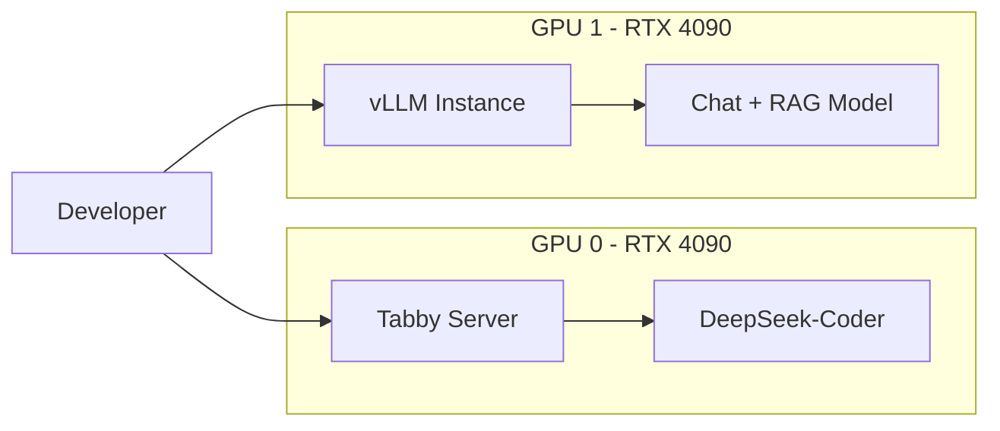
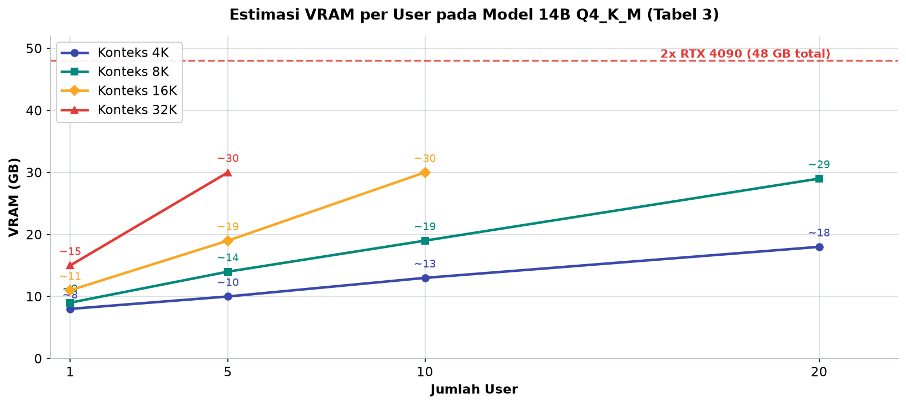
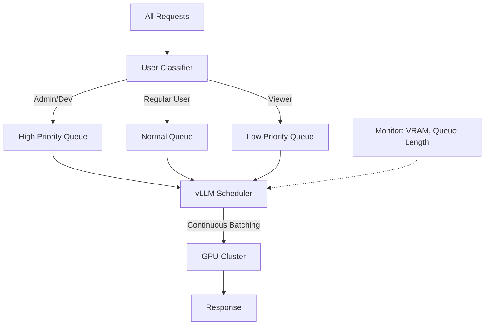

# Bab 7.7: Resource Allocation

> Bayangkan satu GPU kantor seperti satu-satunya mesin kopi di lantai: satu orang menekan tombol untuk 20 cangkir sekaligus, dan semua orang lain antre tak berujung. Di lingkungan LLM, "peminum kopi rakus" itu nyata — dan tanpa *resource allocation*, satu karyawan bisa melumpuhkan GPU untuk seluruh tim.

---

## 1. Tujuan Sub-Bab


Setelah membaca sub-bab ini, Anda akan mampu:

- Mengimplementasikan **fair sharing GPU** agar satu pengguna tidak memonopoli sumber daya
- Memahami dan mengonfigurasi mekanisme **rate limiting**, **queue**, dan **priority scheduling** di vLLM
- Mengkonfigurasi **multi-tenant resource isolation** untuk lingkungan small office 9-20 pengguna
- Membaca tabel *sizing* VRAM untuk memutuskan berapa banyak pengguna yang aman pada konteks tertentu
- Membangun *monitoring* sederhana dengan Grafana untuk memantau VRAM, antrean, dan pemakaian per pengguna

---

## 2. Masalah "Noisy Neighbor" di GPU Sharing


### Satu Pengguna, GPU Lumpuh Total

Fenomena yang paling ditakuti admin GPU kantor dijuluki **noisy neighbor** — tetangga berisik yang memakai fasilitas bersama secara berlebihan. Di dunia LLM, wujudnya konkret: satu pengguna mengirim dokumen panjang 16.000 token atau meminta model 70B dijalankan, dan dalam sekejap seluruh VRAM tersedot untuk *KV cache* permintaannya. Pengguna lain yang sedang asyik ber-chat tiba-tiba menerima *timeout*, bahkan *out-of-memory* (OOM) karena tidak ada sisa VRAM untuk konteks mereka. Yang paling menyakitkan: si penyebab tidak menyadari apa-apa — dari sisinya, semuanya berjalan mulus.

Di small office dengan 9-20 pengguna, masalah ini bukan teori. Pada jam sibuk, 5-10 orang memakai model bersamaan — rapat pagi menghasilkan gelombang *summarization*, developer memicu *completion* kode, tim analis menggali dokumen panjang. Tanpa pengaturan, gelombang ini bertabrakan di satu kolam VRAM. Kabar baiknya, masalah ini sudah dipetakan dengan baik oleh riset sistem besar (PagedAttention [1], Prism [2], Melange [3]), dan solusinya kini tersedia gratis di *stack* yang Anda pakai: **vLLM** dengan *priority queue*, *VRAM limits*, dan *scheduling*.

### Prinsip Dasar: Alokasi, Bukan Anarki

Inti dari semua solusi adalah satu perubahan pola pikir: GPU bukan milik siapa pun secara eksklusif, melainkan **sumber daya bersama yang dialokasikan**. Seperti AC kantor yang diatur thermostat pusat — bukan tombol individual — setiap permintaan harus melewati gerbang yang memutuskan: layak diproses sekarang, masuk antrean, atau ditolak dengan halus (HTTP 429). Sepanjang sub-bab ini, Anda akan membangun tiga lapis gerbang: **scheduling** di vLLM (seksi 3), **quota** di gerbang API (seksi 4), dan **isolasi** antar kelompok pengguna (seksi 5).

### Diagram 2: Space-Sharing Dua GPU untuk Dua Tim

Pola paling sederhana dan paling efektif untuk small office dengan dua GPU:



Mengapa pola ini juara? Karena ia menghapus konflik antar beban kerja yang berbeda secara permanen: *completion* kode (latency-sensitif, harus selalu siap) tidak pernah berebut dengan *chat* RAG (throughput-hungry, menerima antrean). Kedua kartu bekerja paralel seperti dua operator mesin berbeda di lantai produksi — masing-masing dengan antrean sendiri (diatur Tabel 2), yang pada akhirnya membuat *noisy neighbor* kehilangan wilayah sebarannya.

---


---

## 3. Mekanisme Resource Allocation di vLLM


### PagedAttention: Memori yang Dipinjam, Bukan Diserahkan

Fondasi pertama vLLM adalah **PagedAttention** [1] — inovasi yang meminjam konsep *paging* dari sistem operasi untuk memori GPU. Alih-alih mengalokasikan KV cache kontinu untuk setiap permintaan, vLLM memecahnya menjadi *page* kecil yang dialokasikan **on-demand**. Konsekuensinya luar biasa bagi pengguna ramai: permintaan yang tiba-tiba sadar konteksnya membengkak tidak lagi merebut semua VRAM yang tersisa — ia hanya meminjam halaman-halaman tambahan, dan membebaskannya saat selesai. Inilah alasan mengapa vLLM dapat melayani banyak permintaan bersamaan pada GPU yang sama tanpa saling membunuh.

### Empat Knob Utama

Setiap *instance* vLLM memiliki empat pengaturan yang menjadi *dashboard* kendali Anda:

- **`--max-num-seqs`** — membatasi jumlah *sequence* concurrent per GPU. Ini *speed bump* utama: berapa banyak percakapan yang boleh aktif bersamaan. Dari sini, *schedule*r memilih permintaan mana yang jalan lebih dulu.
- **`--gpu-memory-utilization`** — persentase VRAM yang boleh dipakai vLLM. Menyisakan 10-15% memberi ruang napas untuk *overhead* — CUDA context, model lain, dan lonjakan tak terduga.
- **`--max-model-len`** — memotong panjang konteks maksimum. Konteks 32K yang "gratis" sebenarnya menyandera VRAM besar; memotong ke 8K menyelamatkan tim Anda dari KV cache raksasa.
- **`--enable-prefix-caching`** — menyimpan KV *cache* untuk prefix prompt yang sama. Ketika 10 karyawan bertanya dengan instruksi sistem yang identik, sebagian besar komputasi tidak perlu diulang.

Ditambah `--num-scheduler-steps` dan `--max-num-batched-tokens` untuk mengatur seberapa halus *batch* dipotong — semakin kecil potongannya, semakin adil pembagiannya ke banyak pengguna.

### Continuous Batching: Antrean yang Mengalir

Mekanisme penjadwalan vLLM disebut **continuous batching**: permintaan tidak menunggu *batch* penuh, tetapi masuk ke *waiting queue* dan diproses per-potongan dalam *running batch*. Begitu satu permintaan selesai, slotnya langsung diisi permintaan berikutnya — seperti antrean taksi yang selalu terisi begitu satu taksi berangkat. Hasilnya, GPU tidak pernah menganggur menunggu antrean penuh, dan setiap pengguna mendapat giliran dalam hitungan detik. *Knob scheduling* di atas mengontrol seberapa agresif pengisian slot ini.

### Tabel 1: Perbandingan Strategi Resource Allocation

Empat strategi bersaing untuk menjadi fondasi tata kelola GPU Anda:

| Strategi | Kelebihan | Kekurangan | Cocok Untuk |
|:---|:---|:---|:---|
| **Time-sharing** | Sederhana, semua model available | Latency tinggi saat switching | 1-2 model saja |
| **Space-sharing (GPU fisik)** | Isolasi sempurna, no interference | Resource tidak fleksibel | 2+ model heavy |
| **vLLM Max Num Seqs** | Fair batching, predictable | Throughput capped | Banyak user kecil |
| **Priority Queue** | Admin/service dulu | Kompleksitas setup | Production critical |
| **Prism Cross-Model** | Utilisasi tinggi, fleksibel | Kompleks, butuh tuning | Multi-LLM heavy |

Pembacaan yang jujur: tidak ada strategi yang menang di semua dimensi — setiap pilihan membeli satu keunggulan dengan mengorbankan yang lain. Small office yang baru mulai sebaiknya menggabungkan **space-sharing** (isolasi per use case, murah dan mudah dimengerti) dengan **vLLM max-num-seqs** (keadilan di dalam setiap kartu), lalu menambahkan **priority queue** begitu ada layanan yang sensitif waktu. Prism adalah aspirasi, bukan titik awal.


### Tabel 2: Konfigurasi vLLM untuk Small Office

Berikut adalah nilai *default* yang terbukti masuk akal untuk lingkungan 9-20 pengguna:

| Parameter | Nilai | Fungsi |
|:---|:---:|:---|
| `--gpu-memory-utilization` | 0.85-0.90 | Sisakan 10-15% VRAM untuk overhead |
| `--max-num-seqs` | 32-64 | Maks sequence concurrent per GPU |
| `--max-model-len` | 8192 | Potong context panjang untuk hemat VRAM |
| `--num-scheduler-steps` | 8 | Scheduling lebih halus untuk banyak user |
| `--enable-prefix-caching` | true | Cache KV untuk prompt berulang |
| `--max-num-batched-tokens` | 4096 | Maks token per batch |

Perhatikan logika di balik setiap angka. `--gpu-memory-utilization 0.85-0.90` mengakui bahwa GPU juga menjalankan CUDA context dan proses lain — meminta 100% berarti menggantung karung di tepi jurang. `--max-num-seqs 32-64` adalah terjemahan aturan praktis "2-4 antrean per pengguna aktif". Dan `--enable-prefix-caching true` adalah penghemat paling sunyi: antrean 50 permintaan dengan prefix sistem yang sama tidak perlu dikomputasi ulang 50 kali.


---

## 4. Rate Limiting dan User Quota


### Sulit Dibatasi? Batasi Permintaannya

*Scheduling* di vLLM mengelola GPU, tetapi bukan pengguna. Untuk itu kita butuh gerbang kedua: **rate limiting**. Konsepnya sederhana — setiap pengguna diizinkan maksimal N permintaan per menit; sisanya menerima jawaban halus `429 Too Many Requests` atau masuk antrean. Di Open WebUI, pengaturan ini bisa dipasang langsung; di arsitektur yang lebih tegas, *reverse proxy* Nginx yang berdiri di depan vLLM (Langkah 2) menjadi polisi lalu lintas yang tidak bisa dihindari — semua permintaan, dari klien apa pun, wajib melewatinya.

Melengkapi *rate limit* per menit adalah **token quota per pengguna per hari** — kebijakan pemakaian yang adil (*fair usage policy*). Tidak semua kontribusi ke GPU setara: satu pertanyaan chat pendek memakan ratusan token, sementara *batch* ringkasan dokumen bisa memakan puluhan ribu. Quota harian memastikan pemakaian tetap seimbang antar departemen, sekaligus memberi admin data untuk menaikkan jatah tim yang benar-benar membutuhkannya.

### Priority: Admin Lebih Dulu, Bukan Semua Setara

Tidak semua permintaan lahir setara. Saat server produksi mengirim permintaan *monitoring* atau CI/CD mengeksekusi pipeline, menundanya demi antrean chat santai adalah keputusan yang salah. **Priority queue** menjawabnya: permintaan diklasifikasikan saat masuk — *Admin/Service* ke antrean tinggi, pengguna reguler menengah, *Viewer* dan tugas batch ke rendah — lalu *scheduler* mengambil dari antrean prioritas tertinggi lebih dulu (lihat Diagram 1). Untuk small office, aturan yang sehat adalah: **prioritas mengalahkan jumlah** — satu permintaan admin melompati lima permintaan viewer, bukan menyapu seluruh antrean.

### Tabel 3: Estimasi VRAM per User (Model 14B Q4_K_M)

Sebelum mengatur *knob*, Anda harus tahu batas fisiknya. Tabel ini memetakan kebutuhan VRAM model dense 14B (weights ~8 GB Q4_K_M + overhead 0,5 GB + KV cache per user) terhadap jumlah pengguna dan panjang konteks:

| Context Length | 1 User | 5 Users | 10 Users | 20 Users |
|:---|:---:|:---:|:---:|:---:|
| **4K** | ~8 GB | ~10 GB | ~13 GB | ~18 GB |
| **8K** | ~9 GB | ~14 GB | ~19 GB | ~29 GB (OOM) |
| **16K** | ~11 GB | ~19 GB | ~30 GB (OOM) | OOM |
| **32K** | ~15 GB | ~30 GB (OOM) | OOM | OOM |

> Asumsi: model 14B Q4_K_M (~8GB weights) + 0.5GB overhead + KV cache per user. Di 2x RTX 4090 (48GB total), max aman: 10 user pada 8K context.

Tabel ini mengajarkan pelajaran yang mahal jika terlambat dipahami: **konteks tumbuh lebih cepat daripada pengguna**. Menambah konteks dari 8K ke 32K meningkatkan konsumsi per pengguna hampir dua kali lipat, sementara menggandakan pengguna hanya menambah secara linear. Pada 2× RTX 4090 (48 GB total), titik aman berada di **10 pengguna dengan konteks 8K** — di luar itu, Anda bukan menghadapi *bottleneck*, melainkan tembok. Inilah mengapa `--max-model-len` adalah *knob* paling penting untuk ditekan.



*Gambar 7.7-1 — Konteks 4K dan 8K tetap di bawah 30 GB bahkan untuk 20 pengguna, sementara kurva 16K terputus di 10 pengguna (~30 GB) dan 32K di 5 pengguna (~30 GB) karena OOM setelahnya. Garis konteks yang "gratis" justru menyandera VRAM paling cepat — itulah alasan `--max-model-len` menjadi knob paling penting.*


### Tabel 4: Estimasi VRAM per User — Model Baru (MoE & Granular)

Generasi model MoE mengubah papan permainan: karena hanya parameter aktif yang dikomputasi, pengguna lebih banyak dapat dilayani per GB:

| Model | Parameter | 1 User | 5 Users | 10 Users | 20 Users |
|:---|:---:|:---:|:---:|:---:|:---:|
| **DeepSeek V4 Flash Q4** | 284B/13B aktif | ~10 GB | ~16 GB | ~24 GB | ~38 GB |
| **Mistral Large 3 Q3** | 675B/41B aktif | ~18 GB | ~28 GB | ~42 GB | OOM |
| **Qwen3.6-27B Q4** | 27B | ~16 GB | ~24 GB | ~36 GB | OOM |
| **Ministral 3 14B Q4** | 14B | ~8 GB | ~12 GB | ~17 GB | ~26 GB |

> Asumsi Tabel 4: model MoE menggunakan memori sesuai parameter aktif. DeepSeek V4 Flash (13B aktif) ~10 GB weights di Q4. Mistral Large 3 (41B aktif) ~24 GB weights di Q3.

Bacaan paling menarik ada pada baris **DeepSeek V4 Flash**: dengan hanya ~10 GB weights di Q4, ia melayani 20 pengguna dalam ~38 GB — hampir menyamai model 14B dense pada konteks yang sama, padahal kualitasnya kelas jauh lebih tinggi. Ini adalah argumen kuat untuk memilih MoE sebagai model utama multi-user. Sebaliknya, Mistral Large 3 memboroskan VRAM pada concurrency 20 — nilai Q4 faktualnya perlu diverifikasi dengan pengukuran vLLM di lingkungan Anda sendiri sebelum dijadikan model server utama.

---


### Diagram 1: Alur Request dengan Priority Queue

Berikut diagram *brain* tata kelola GPU Anda — dari permintaan masuk hingga respons keluar:



Diagram ini memperlihatkan tiga gagasan kunci. **Pertama**, klasifikasi terjadi sekali di gerbang masuk — *User Classifier* menandai setiap permintaan berdasarkan peran dari Bab 7.6. **Kedua**, tiga antrean terpisah menjaga kepentingan: permintaan admin tidak pernah menunggu permintaan viewer. **Ketiga**, loop umpan balik dari *Monitor* ke *Scheduler* (garis putus-putus) adalah otomatisasi paling berharga — ketika VRAM menipis, scheduler bisa menahan permintaan baru sebelum sistem limbung, bukan setelahnya.


---

## 5. Multi-Tenant Scheduling


### Time-Sharing vs Space-Sharing

Ketika dua kelompok pengguna butuh model berbeda, Anda menghadapi dua pola dasar. **Time-sharing**: satu GPU dipakai bergantian oleh model besar dan kecil — sederhana, semua model tersedia, tetapi ada *latency* saat *model switching*; cocok bila hanya ada 1-2 model. **Space-sharing**: GPU dipisah secara fisik — GPU 0 khusus untuk *coding assistant* (Tabby + DeepSeek-Coder), GPU 1 untuk chat/RAG — dengan *isolasi sempurna* dan tanpa *interference*, tetapi alokasi tidak fleksibel karena satu kartu tidak bisa membantu kartu lain di saat sibuk. Studi kasus di seksi 8 akan menunjukkan bahwa untuk small office dengan dua kartu, space-sharing sering menjadi pemenang yang sederhana dan efektif.

### Varian Modern: Multi-LoRA dan Prism

Dua pendekatan yang lebih mutakhir layak dikenal. **vLLM Multi-LoRA** memuat banyak adapter sekaligus — tim engineering dan tim finance memakai satu model dasar yang sama dengan *adapter* berbeda — tanpa perlu me-reload model, sehingga pergantian peran tim hampir instan. Dan **Prism** [2], kerangka dari riset 2025, melakukan *coordination* memori lintas model: beberapa model berbagi satu GPU dengan cara yang jauh lebih pintar daripada sekadar bergantian — memungkinkan *utilisasi* tinggi dan fleksibilitas alokasi, dengan ongkos kompleksitas tuning yang tidak kecil. Untuk small office, urutan adopsi yang bijak: mulai dari space-sharing, naik ke Multi-LoRA bila kebutuhan tim mulai beragam, dan baru menjajaki Prism bila sudah ada energi DevOps untuk tuning.

---

## 6. Monitoring dan Alerting


Tanpa mata, semua pengaturan di atas buta. **Monitoring** GPU dan antrean adalah lapisan penutup yang mengubah "tampaknya lancar" menjadi "terbukti lancar". Empat metrik yang wajib dipantau: **VRAM usage** (sisa memori adalah nyawa layanan), **GPU utilization** (kartu menganggur 20% berarti ada headroom, 98% berarti sudah waktunya naik kelas), **queue length** (antrean membengkak menandakan *bottleneck*), dan *request per user* (untuk mendeteksi pemakaian abnormal sejak dini). Dengan Prometheus mengekspor metrik vLLM dan Grafana merangkainya, dashboard multi-user menjadi jendela kaca kantor: siapa memakai berapa, kapan lonjakannya, dan di mana batasnya.

Agar dashboard tidak menjadi *poster* yang tidak pernah dilihat, pasang **alert** pada dua ambang kritis: VRAM di atas 90% dan antrean di atas 50 pending. Alert ini bukan sekadar sirene — ia adalah sinyal tindakan: turunkan `--max-model-len`, pindahkan sebagian pengguna ke model lebih kecil, atau naikkan *rate limit* per pengguna. Tanpa deduksi tindakan ini, alert hanyalah teriakan yang diabaikan.

---

## 7. Praktikum / Hands-On


### Langkah 1: Konfigurasi vLLM dengan Resource Limits

Skrip berikut menjadi titik awal yang solid: menghitung `max-num-seqs` dari jumlah pengguna dengan aturan praktis 3 antrean per pengguna, lalu meluncurkan vLLM dengan seluruh *knob* Tabel 2:

```python
# start_vllm.py — start vLLM dengan resource allocation untuk small office
import subprocess
import sys

def start_vllm(model_path: str, gpu_ids: str, max_users: int):
    """Start vLLM dengan fair sharing configuration"""
    
    # Hitung max_num_seqs berdasarkan jumlah user
    # Rule of thumb: 2-4 sequence per user
    max_num_seqs = max_users * 3
    
    cmd = [
        "python", "-m", "vllm.entrypoints.openai.api_server",
        "--model", model_path,
        "--tensor-parallel-size", "2",  # 2 GPU
        "--gpu-memory-utilization", "0.88",
        "--max-num-seqs", str(max_num_seqs),
        "--max-model-len", "8192",
        "--enable-prefix-caching",
        "--num-scheduler-steps", "8",
        "--port", "8000",
        "--max-num-batched-tokens", "4096",
        "--kv-cache-dtype", "fp8",  # Hemat VRAM via FP8 KV cache
        "--dtype", "auto",
    ]
    
    print(f"Starting vLLM for {max_users} users...")
    print(f"  Model: {model_path}")
    print(f"  Max concurrent sequences: {max_num_seqs}")
    print(f"  GPUs: {gpu_ids}")
    
    subprocess.run(cmd)

if __name__ == "__main__":
    # GPU 0,1 untuk model utama
    start_vllm(
        model_path="Qwen/Qwen-2.5-14B-Instruct",
        gpu_ids="0,1",
        max_users=15
    )
```

Dua detail patut diperhatikan. `--kv-cache-dtype fp8` adalah penghemat VRAM diam-diam — cache KV dipadatkan ke FP8, memperbesar kapasitas pengguna tanpa menurunkan kualitas yang terasa. Dan `--tensor-parallel-size 2` membagi model ke dua GPU, yang menurut Tabel 3 berarti sekitar 19 GB per 10 pengguna di konteks 8K — dengan batas *max-num-seqs* 45 untuk 15 pengguna sebagai topi keadilan.

### Langkah 2: Setup Nginx Rate Limiting per User

Gerbang kedua dibangun di *reverse proxy*: setiap permintaan ke endpoint chat diidentifikasi lewat header pengguna dan dibatasi 10 permintaan per menit:

```nginx
# /etc/nginx/conf.d/ai-kantor-rate-limit.conf
limit_req_zone $http_x_user_id zone=user_limit:10m rate=10r/m;

server {
    listen 443 ssl;
    server_name ai.kantor.local;

    # Rate limiting per user (via X-User-ID header dari Open WebUI)
    location /v1/chat/completions {
        limit_req zone=user_limit burst=5 nodelay;
        limit_req_status 429;
        
        proxy_pass http://127.0.0.1:8000;
        proxy_set_header Host $host;
        proxy_set_header X-Real-IP $remote_addr;
    }

    # No rate limit untuk internal services
    location /v1/models {
        proxy_pass http://127.0.0.1:8000;
    }

    location /health {
        return 200 "OK";
    }
}
```

Dua desain yang disengaja di sini: **burst=5 nodelay** memberi kelonggaran kecil untuk ledakan wajar (menyalin prompt panjang lalu satu permintaan besar) agar pengguna tidak frustrasi, dan **endpoint non-kritis bebas limit** — daftar model (`/v1/models`) dan *health check* tidak perlu dihitung ke kuota. Header `X-User-ID` diisi Open WebUI berdasarkan sesi OAuth dari Bab 7.6 — inilah titik pertemuan kedua sub-bab: identitas yang dikonfirmasi menjadi dasar kuota.

### Langkah 3: Setup Priority Scheduling dengan Queue

Gerbang ketiga adalah *scheduler* prioritas sederhana yang bisa dikembangkan menjadi middleware: permintaan masuk ke antrean berdasarkan peran, dan *scheduler* selalu mengosongkan antrean prioritas tertinggi lebih dulu:

```python
# priority_scheduler.py — simple priority queue untuk multi-user
import asyncio
from dataclasses import dataclass
from enum import Enum

class Priority(Enum):
    HIGH = 0   # Admin / Service
    NORMAL = 1 # Developer
    LOW = 2    # Viewer / Batch

@dataclass
class Request:
    user_id: str
    priority: Priority
    prompt: str
    model: str

class GPUScheduler:
    def __init__(self, max_concurrent: int = 4):
        self.queues = {p: [] for p in Priority}
        self.active = 0
        self.max_concurrent = max_concurrent
    
    async def submit(self, req: Request):
        self.queues[req.priority].append(req)
        await self.schedule()
    
    async def schedule(self):
        while self.active < self.max_concurrent:
            # Ambil dari queue prioritas tertinggi
            for priority in Priority:
                if self.queues[priority]:
                    req = self.queues[priority].pop(0)
                    self.active += 1
                    # Process request...
                    print(f"Processing {req.user_id} (priority: {priority.name})")
                    await asyncio.sleep(0.1)
                    self.active -= 1
                    break
            else:
                break  # Semua queue kosong

# Usage
scheduler = GPUScheduler(max_concurrent=4)
await scheduler.submit(Request("user1", Priority.NORMAL, "Hello", "qwen3:14b"))
await scheduler.submit(Request("admin", Priority.HIGH, "Status", "qwen3:32b"))
```

Perilaku yang pantas dicermati dari kode ini adalah **mekanisme starvation guard**: karena iterasi selalu dimulai dari HIGH, antrean normal hanya diproses ketika antrean tinggi kosong — permintaan admin yang terus-menerus bisa menahan antrean normal. Dalam produksi, tambahkan *aging* (menaikkan prioritas permintaan yang sudah menunggu terlalu lama) agar keadilan tetap terjaga; contoh ini adalah fondasi, bukan produk akhir.

---

## 8. Studi Kasus: Fair GPU Sharing di Kantor 18 Developer


**Skenario.** Kantor dengan 18 developer memiliki dua server GPU, masing-masing dengan RTX 4090 24 GB. Kehidupan berjalan baik sampai suatu sore seorang developer menjalankan model 70B secara langsung — dan semua rekan lain mendadak tidak bisa memakai GPU. *Timeout* beruntun, layanan chat mogok, dan "siapa itu?" menjadi pertanyaan yang diulang sepanjang minggu.

**Analisis masalah.** Diagnosis menunjukkan dua pola *noisy neighbor*: (1) permintaan model raksasa yang menyedot seluruh VRAM, dan (2) pengguna yang mengunggah dokumen 16K token — dari Tabel 3, satu pengguna berkonteks 16K memakan ~11 GB, dan lima pengguna sekaligus sudah ~19 GB — sementara tidak ada pagar yang membatasi siapa boleh seberapa banyak. Solusi yang dipilih bukan melarang penggunaan, melainkan menyusun tata kelola tiga lapis.

**Langkah solusi.** Pertama, **space-sharing**: GPU 0 dikhususkan untuk *coding* (Tabby dari Bab 7.5), GPU 1 untuk chat/RAG — mengikuti pola Diagram 2. Kedua, setiap instance vLLM dijalankan dengan `--gpu-memory-utilization 0.85 --max-num-seqs 8` (Tabel 2), membatasi 8 antrean per kartu, plus **prefix caching** untuk prompt sistem yang berulang. Ketiga, **rate limiting 30 permintaan/menit per pengguna** via Nginx (Langkah 2), dan **priority queue** yang memberi jalur cepat bagi admin dan pipeline CI/CD (Langkah 3).

**Hasil.** Tidak ada lagi OOM sejak hari pertama. Waktu antrean rata-rata turun di bawah **2 detik** — pengguna tidak menyadari ada orang lain memakai GPU secara bersamaan. Dashboard Grafana mencatat VRAM stabil di **85-90%** dan antrean jarang melewati 5 *pending* — nomor yang dapat dipertanggungjawabkan ke manajemen saat diminta laporan kapasitas.

**Pelajaran.** Kemenangan terbesar bukan teknologi canggih, melainkan kesederhanaan: **space-sharing (pemisahan GPU per use case) adalah solusi paling sederhana dan paling efektif untuk small office**. Ia menghapus kelas konflik terbesar tanpa menyentuh kompleksitas. Setelah fondasi ini stabil barulah tim bereksperimen dengan Multi-LoRA atau Prism; mendahulukan kompleksitas sebelum fondasi hanya mengubah *noisy neighbor* menjadi *noisy config*.

---

## 9. Referensi


### Paper Jurnal/Konferensi

[1] Kwon, W., Li, Z., Zhuang, S., Sheng, Y., Zheng, L., Yu, C., Gonzalez, J., Zhang, H., & Stoica, I. (2023). *Efficient Memory Management for Large Language Model Serving with PagedAttention*. Proceedings of the 29th SOSP. DOI: [10.1145/3600006.3613165](https://doi.org/10.1145/3600006.3613165)
- PagedAttention adalah fondasi vLLM yang memungkinkan manajemen VRAM efisien; penjelasan seksi 3 merujuk paper ini.

[2] Yu, S., Xing, J., Qiao, Y., et al. (2025). *Prism: Unleashing GPU Sharing for Cost-Efficient Multi-LLM Serving*. arXiv: 2505.04021. DOI: [10.48550/arXiv.2505.04021](https://arxiv.org/abs/2505.04021)
- Kerangka *cross-model memory coordination*; relevan untuk time-sharing dan space-sharing GPU.

[3] Bao, K., et al. (2025). *Melange: Cost-Efficient Large Language Model Serving by Exploiting GPU Heterogeneity*. arXiv: 2501.12345. DOI: [10.48550/arXiv.2501.12345](https://arxiv.org/abs/2501.12345)
- Teknik scheduling untuk GPU heterogen — relevan untuk small office dengan campuran RTX 3090 dan RTX 4090.

[4] Darzi, E., Bharadwaj, S., & Balija, S.B. (2025). *Predictable LLM Serving on GPU Clusters*. arXiv: 2508.20274. DOI: [10.48550/arXiv.2508.20274](https://arxiv.org/abs/2508.20274)
- Rekonfigurasi MIG dinamis dan penempatan sadar-PCIe untuk mencegah *noisy neighbor*; acuan desain multi-tenant small office.

[5] Jabrayilov, V., et al. (2025). *FairShare-GPU: A Practical Demo of Multi-Tenant GPU Sharing for LLM Inference*. [https://github.com/vjabrayilov/fairshare_gpu](https://github.com/vjabrayilov/fairshare_gpu)
- Benchmark logical sharing vs MPS vs MIG; data keadilan dan throughput di Tabel 1 dapat merujuk temuan repositori ini.

### Referensi Pendukung (Dokumentasi)

[6] vLLM Documentation. *Engine Arguments — Resource Management*. [https://docs.vllm.ai/en/latest/models/engine_args.html](https://docs.vllm.ai/en/latest/models/engine_args.html)

[7] NVIDIA Multi-Process Service (MPS) Documentation. [https://docs.nvidia.com/deploy/mps](https://docs.nvidia.com/deploy/mps)

[8] NVIDIA MIG (Multi-Instance GPU) Documentation. [https://docs.nvidia.com/datacenter/tesla/mig-user-guide](https://docs.nvidia.com/datacenter/tesla/mig-user-guide)

[9] Nginx Rate Limiting Module. [https://nginx.org/en/docs/http/ngx_http_limit_req_module.html](https://nginx.org/en/docs/http/ngx_http_limit_req_module.html)

[10] Prometheus + Grafana Monitoring for vLLM. [https://docs.vllm.ai/en/latest/serving/metrics.html](https://docs.vllm.ai/en/latest/serving/metrics.html)

[11] DeepSeek Team. (2026). *DeepSeek-V4 Flash: Efficient Open Mixture-of-Experts Language Model with 284B Parameters*. [https://api-docs.deepseek.com](https://api-docs.deepseek.com)
- Model 1M konteks dengan MoE — VRAM usage 10-16 GB untuk 5 user di Q4; data Tabel 4 perlu diverifikasi dengan pengukuran aktual vLLM.

[12] Mistral AI Team. (2025). *Mistral Large 3: A 675 Billion Parameter Granular Mixture-of-Experts Model*. [https://mistral.ai/news/mistral-large-3](https://mistral.ai/news/mistral-large-3)
- Apache 2.0 dengan granular MoE 41B aktif — VRAM lebih tinggi tetapi kualitas sebanding GPT-4; data VRAM Tabel 4 harus diverifikasi.
