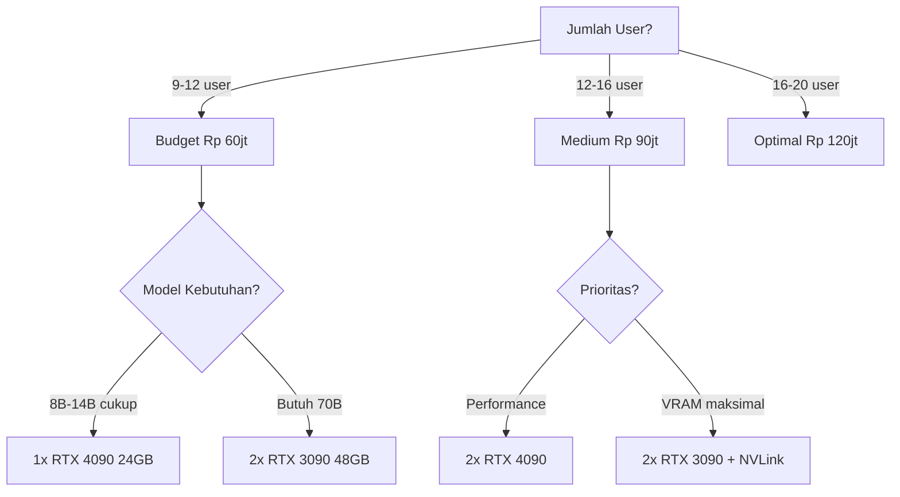
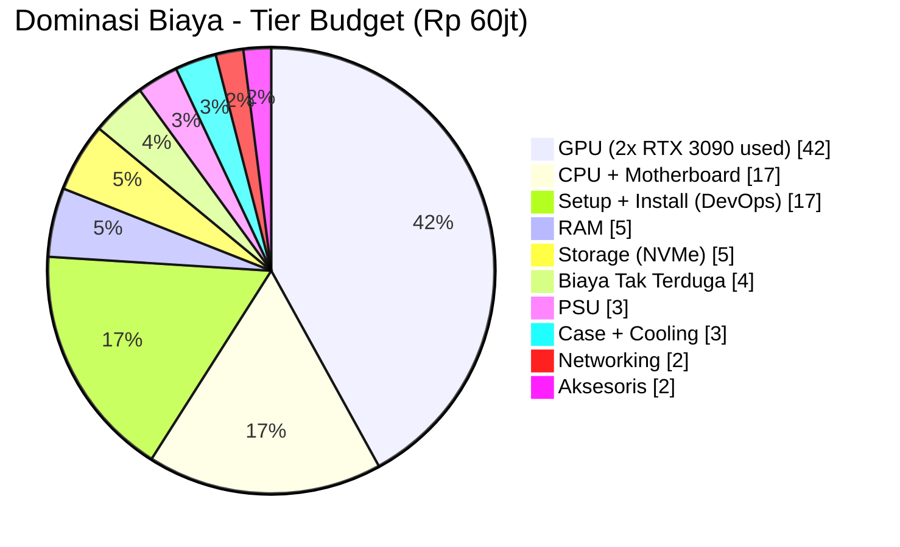

# Bab 7.8: Budgeting

> Sebelum menekan tombol "beli", setiap pemilik usaha bertanya satu hal: apakah ini investasi atau pemborosan? Jawabannya tidak terletak pada harga GPU, melainkan pada kalkulasi jangka panjang — dan bab ini akan menunjukkan bagaimana server lokal seharga Rp 60-120 juta bisa menang telak dibanding langganan cloud dalam tiga tahun.

---

## 1. Tujuan Sub-Bab

Setelah membaca sub-bab ini, Anda akan mampu:

- Menyusun anggaran lengkap untuk deployment LLM small office (9-20 pengguna) dari komponen terkecil hingga biaya tak terduga
- Membandingkan biaya **self-hosted** versus **cloud API** dalam kerangka TCO 3 tahun
- Menghitung **ROI** dan **break-even point** investasi AI untuk tim Anda
- Mengenali *hidden cost* — listrik, pendingin, internet, backup, dan tenaga kerja — yang sering luput dari proposal
- Menyiapkan dokumen *purchase request* yang siap disetujui pihak finance

---

## 2. Komponen Biaya: Membaca Struktur Sebelum Memutuskan

### Capex dan Opex: Dua Dompet Berbeda

Setiap investasi AI small office terbagi menjadi dua dompet yang tidak boleh tercampur. **Capex** (*Capital Expenditure*) adalah pengeluaran sekali — hardware: GPU, CPU, RAM, *storage*, *networking*, rack dan casing — yang menjadi aset perusahaan, dapat disusutkan, dan bisa dihitung *resale value*-nya. **Opex** (*Operational Expenditure*) adalah pengeluaran berulang bulanan — listrik, internet, hosting cloud jika ada, dan *maintenance*. Kesalahan paling umum di proposal internal adalah hanya menampilkan Capex dan menutup mata pada Opex; kesalahan kedua adalah membandingkan "Capex 100 juta" dengan "langganan 6 juta/bulan" tanpa menyetarakan periodenya. TCO (setara 3 tahun) menjawab keduanya sekaligus.

### Software Gratis, Tenaga Kerja Tidak

Kabar baik yang jarang disadari: seluruh *software stack* dalam buku ini — **Ollama, vLLM, Open WebUI, Qdrant, Tabby** — adalah **open source** dengan biaya lisensi nol. Inilah keunggulan struktural self-hosting yang tidak bisa ditandingi model bisnis subscription. Namun ada satu "lisensi" yang tidak gratis: **tenaga kerja**. Setup awal memakan **1-2 minggu waktu DevOps** — bagian tersulit adalah integrasi OAuth (Bab 7.6), tata kelola GPU (Bab 7.7), dan pembiasaan tim. Setelah berjalan, *maintenance* berkala **2-4 jam per minggu** cukup untuk update model, rotasi token, dan inspeksi dashboard. Masukkan keduanya sebagai Opex — tenaga kerja yang "sudah ada" tetap punya biaya kesempatan.

---

## 3. Tiga Tier Budget: Memilih Berdasarkan Jumlah Pengguna

### Budget (~Rp 60jt): Dua RTX 3090 Sahabat Tim Kecil

Tier pertama menyasar tim **9-12 pengguna**: **2× RTX 3090 used** — kartu bekas pakai yang harganya jauh lebih bersahabat dan tetap bertenaga 24 GB per kartu — dipasang di CPU kelas konsumen (Ryzen) dengan motherboard konsumen dan 64 GB RAM. Nilainya: 48 GB VRAM total, cukup untuk model 70B dalam Q4 atau model 32B dalam kualitas Q8. Tabel 4 akan menunjukkan bahwa tier ini sudah mampu memberi kualitas "Sangat Baik" untuk 10 pengguna. Trade-off-nya: garansi GPU *used* terbatas, dan daya tahan jangka panjang perlu dimonitor via *thermal* (Bab 7.7).

### Medium (~Rp 90jt): RTX 4090 untuk Tim Bertumbuh

Tier menengah untuk tim **12-16 pengguna** memasang **2× RTX 4090** di platform Threadripper dengan 128 GB RAM. Lompatan terbesarnya bukan pada VRAM (sama-sama 48 GB total), melainkan pada bandwidth dan keandalan: RTX 4090 memindahkan data dua kali lebih cepat dan tidak bergantung pada kondisi kartu bekas. Hasilnya di Tabel 4: *concurrency* lebih tinggi, *latency* lebih rendah, dan ruang untuk model *granular MoE* seperti Mistral Large 3 mulai terbuka. Tier ini adalah pilihan paling seimbang bagi tim yang sudah menindaklanjuti Bab 7.7 dengan serius.

### Optimal (~Rp 120jt): RTX 5090 untuk 16-20 Pengguna

Tier tertinggi memasang **2× RTX 5090** di platform Threadripper Pro dengan 256 GB ECC RAM. Kartu generasi terbaru membuka 64 GB VRAM — *headroom* untuk DeepSeek V4 Flash Q4 melayani ~15 pengguna bersamaan, atau model 70B dalam Q8. Ilusinya sederhana: ini bukan membeli GPU tambahan, melainkan membeli **waktu tenang selama 3-5 tahun** — tidak perlu upgrade di tengah jalan ketika tim dan model tumbuh. Perhatikan bahwa label tier ("~Rp 120jt") sedikit berbeda dari jumlah rincian komponen di Tabel 1 (~Rp 160jt) — wajar, karena harga GPU generasi baru bergejolak; jadikan rincian komponen sebagai pegangan anggaran yang lebih jujur.

---

## 4. Self-Hosted vs Cloud API: Pertarungan TCO

### Menghitung Lawan dari Awan

Untuk membandingkan secara adil, pertama-tama hitung tagihan cloud yang sedang (atau akan) Anda bayar. Skenario standar 15 pengguna: **OpenAI ChatGPT Team** $25/pengguna/bulan dan **GitHub Copilot** $19/pengguna/bulan — total $44/pengguna/bulan, atau untuk 15 pengguna: $660/bulan ≈ **Rp 10,5 juta/bulan**. Sebelum lanjut, sadari ini hanya "paket dasar" — *usage limit* per pengguna masih ada, dan tagihan *API* tambahan menyusul saat tim mulai membangun otomatisasi.

### Saat Garis-Garis Bersilangan

Melawan angka itu, self-hosted menawarkan **Rp 60-120 juta sekali** ditambah **Rp 1-3 juta/bulan** untuk listrik dan maintenance (rincian di Tabel 2). Kurva keduanya saling berpotongan: cloud mulai lebih murah (nol modal), tetapi garisnya naik tak pernah berhenti; self-hosted menanjak di awal, lalu mendatar. Titik persilangan itulah **break-even point** — sekitar **6-12 bulan** untuk tier Budget, bergantung jumlah pengguna dan intensitas pemakaian. Pada akhir tahun ketiga (Tabel 3), selisihnya bukan kecil-kecilan: self-hosted Budget menghemat **±Rp 153 juta** dibanding cloud.

---

## 5. Biaya Tersembunyi: Musuh dalam Selimut

Anggaran yang matang selalu menganggarkan hal-hal yang tidak menyenangkan. Lima *hidden cost* yang paling sering terlupakan: **listrik** — GPU yang menyala 24/7 memakan Rp 1-3 juta per bulan tergantung tarif dan TDP, jangan hitung berdasarkan pemakaian 8 jam kerja; **cooling** — AC tambahan untuk ruang server, wajib di Indonesia; **internet** — *static IP* atau VPN server $10-20/bulan agar tim bisa mengakses dari luar kantor (otentikasi dari Bab 7.6 tidak berguna jika servernya tak bisa dijangkau); **backup** — storage cadangan untuk model dan database; dan **downtime** — *opportunity cost* saat server mati, jarang terjadi tetapi perlu dianggarkan psikologisnya.

Praktik keuangan yang bijak: sisihkan **buffer biaya tak terduga 5-10%** dari total Capex — untuk GPU pengganti saat kartu *used* mati, kabel power rusak, atau upgrade PSU mendadak. Tabel 1 memasukkannya sebagai baris tersendiri, dan ini bukan pemborosan: ini premi asuransi untuk proyek yang menggerakkan produktivitas seluruh perusahaan.

---

## 6. ROI Projection: Mengapa Investasi Ini Layak

ROI *hardware* tidak bisa dihitung semanis startup valuation, tetapi tiga sumber pengembaliannya nyata. **Pertama, penghematan substitusi**: Rp 10,5 juta/bulan langganan cloud (ChatGPT Team + Copilot) berhenti seketika — angka yang konkret dan bisa ditagih ke finance. **Kedua, produktivitas developer**: peningkatan 25-40% — sulit diukur langsung, tetapi nyata: PR lebih cepat selesai, *onboarding* anggota baru turun dari 2 minggu menjadi **3 hari** berkat RAG internal dari Bab 7.4 yang memuat dokumen on-boarding. **Ketiga, knowledge retention**: RAG menyimpan pengetahuan yang selama ini menguap di kepala karyawan — aset yang bertambah setiap bulan tanpa langganan tambahan.

Cara paling jujur menyajikan ROI ke pemilik usaha adalah dua angka: *break-even* (berapa bulan sampai investasi kembali) dan *settlement* 3 tahun (berapa juta yang dihemat selama 3 tahun dibanding tetap di cloud). Keduanya ada di Tabel 3 dan kalkulator di Langkah 1. Jika satu angka itu sudah meyakinkan, sisanya hanya formalitas teknis.

---

## 7. Tabel Anggaran dan Perbandingan

### Tabel 1: Rincian Biaya per Tier

Berikut cetak biru anggaran lengkap untuk tiga tier — dari GPU hingga biaya tak terduga:

| Komponen | Budget (~Rp 60jt) | Medium (~Rp 90jt) | Optimal (~Rp 120jt) |
|:---|:---:|:---:|:---:|
| **2x GPU** | Rp 25jt (RTX 3090 used) | Rp 56jt (RTX 4090) | Rp 80jt (RTX 5090) |
| **CPU + MB** | Rp 10jt (Ryzen 9 + X670) | Rp 18jt (Threadripper + TRX50) | Rp 25jt (Threadripper + WRX90) |
| **RAM** | Rp 3jt (64GB DDR5) | Rp 6jt (128GB DDR5) | Rp 15jt (256GB DDR5 ECC) |
| **Storage** | Rp 3jt (2TB NVMe) | Rp 5jt (4TB NVMe) | Rp 8jt (8TB NVMe RAID) |
| **PSU** | Rp 2jt (1200W Gold) | Rp 3jt (1500W Platinum) | Rp 5jt (2000W Titanium) |
| **Case + Cooling** | Rp 2jt | Rp 3jt | Rp 5jt |
| **Networking** | Rp 1jt | Rp 2jt | Rp 3jt |
| **Aksesoris** | Rp 1jt (NVLink bridge) | Rp 1jt | Rp 2jt |
| **Setup + Install** | Rp 10jt (DevOps 1 minggu) | Rp 10jt | Rp 10jt |
| **Biaya Tak Terduga** | Rp 3jt | Rp 6jt | Rp 7jt |
| **Total** | **~Rp 60jt** | **~Rp 110jt** | **~Rp 160jt** |

> Catatan: Harga dapat berubah. RTX 3090 used sangat fluktuatif. Harga dalam IDR estimasi 2026.

Bacaan penting tabel ini bukan sekadar total, melainkan **struktur dominannya**: GPU selalu menyumbang 40-50% anggaran, disusul CPU+motherboard. Perhatikan pula bahwa *Setup + Install* (Rp 10jt) konstan di semua tier — tenaga kerja DevOps tidak menjadi lebih mahal hanya karena kartunya lebih besar, dan biaya tak terduga naik seiring mahalnya komponen yang harus diganti. Bila total rincian dijumlahkan, Medium mencapai ±Rp 110jt dan Optimal ±Rp 160jt — angka label tier di header adalah *target* anggaran, sedangkan rincian komponen adalah *realita* pasar yang lebih jujur untuk diajukan ke finance.

### Tabel 2: Biaya Operasional Bulanan

Setelah server berdiri, inilah tagihan bulanan yang akan menemani Anda terus-menerus:

| Komponen | Budget | Medium | Optimal |
|:---|:---:|:---:|:---:|
| **Listrik (24/7, Rp 1.500/kWh)** | Rp 1.500.000 | Rp 2.000.000 | Rp 3.000.000 |
| **Internet (static IP/business)** | Rp 500.000 | Rp 500.000 | Rp 500.000 |
| **VPN/Proxy** | Rp 200.000 | Rp 200.000 | Rp 200.000 |
| **Cloud Backup** | Rp 200.000 | Rp 500.000 | Rp 1.000.000 |
| **Maintenance (DevOps)** | Rp 500.000 | Rp 500.000 | Rp 500.000 |
| **Penyusutan (3 tahun)** | Rp 1.670.000 | Rp 3.060.000 | Rp 4.440.000 |
| **Total Opex Bulanan** | **~Rp 4.6jt** | **~Rp 6.8jt** | **~Rp 9.6jt** |

Dua baris layak ditegaskan. **Listrik** adalah biaya terbesar dan paling stabil — dihitung dengan tarif PLN Rp 1.500/kWh untuk operasi 24/7; GPU idle pun tetap menyala. **Penyusutan** membagi Capex ke 36 bulan — baris yang menormalkan beban di laporan laba-rugi, sekaligus mengingatkan bahwa aset ini "habis" seiring waktu. Total Opex bahkan di tier Optimal (±Rp 9,6 juta) masih lebih murah daripada tagihan cloud satu bulan (±Rp 10,5 juta) — kesimpulan yang terasa ironis tetapi matematis: **server termahal kantor Anda masih lebih murah daripada langganan terkecilnya**.

### Tabel 3: Perbandingan Self-Hosted vs Cloud (TCO 3 Tahun)

Inilah tabel yang paling sering difotokopi untuk rapat anggaran:

| Metrik | Cloud API | Budget Self-Hosted | Medium Self-Hosted |
|:---|:---:|:---:|:---:|
| **Biaya Awal** | Rp 0 | Rp 60jt | Rp 110jt |
| **Biaya Bulanan** | Rp 10.5jt | Rp 4.6jt | Rp 6.8jt |
| **Total 1 Tahun** | Rp 126jt | Rp 115jt | Rp 192jt |
| **Total 3 Tahun** | Rp 378jt | Rp 225jt | Rp 354jt |
| **Penghematan 3 Tahun** | - | **Rp 153jt** | **Rp 24jt** |
| **Break-even** | - | **~6 bulan** | **~11 bulan** |

> Asumsi: 15 user, masing-masing pakai ChatGPT Team + GitHub Copilot (Rp 700rb/user/bulan).

Perhatikan bagaimana cerita berubah seiring waktu. Di tahun pertama, cloud "hanya" Rp 126 juta dan seolah unggul dari Medium (Rp 192 juta) — inilah mengapa proposal cloud selalu menang di slide pertama. Tetapi di tahun ketiga, kurvanya bersilangan telak: Budget menghemat **Rp 153 juta**, dan bahkan Medium yang lebih mahal tetap menghemat Rp 24 juta *plus* menyisakan aset hardware bernilai jual. Cloud tidak pernah berhenti menagih; server lokal berhenti setelah lunas. *Break-even* ±6 bulan (Budget) membuat keputusan ini bukan lagi soal "mampukah menunggu", melainkan soal disiplin menjalankan setup.

### Tabel 4: Perbandingan Model Berdasarkan Budget VRAM

Terakhir, peta kualitas yang bisa Anda beli di setiap rentang VRAM — untuk memastikan tier yang dipilih benar-benar menghidupkan model yang dibutuhkan:

| Budget VRAM | GPU | Model Maksimal | Concurrency | Kualitas |
|:---|:---|:---|:---:|:---:|
| **24 GB** | 1x RTX 4090 | Llama-3.1-8B Q8 / Qwen-3-32B Q4 / Ministral 3 14B Q8 | ~5 user | Baik |
| **48 GB** | 2x RTX 3090+NVLink | Llama-3.1-70B Q4 / Qwen-3-32B Q8 / Qwen3.6-27B Q8 | ~10 user | Sangat Baik |
| **48 GB** | 2x RTX 4090 PCIe | Llama-3.1-70B Q4 / DeepSeek-Coder-67B Q4 / Mistral Large 3 Q3 | ~8 user | Sangat Baik |
| **64 GB** | 2x RTX 5090 | Llama-3.1-70B Q8 / DeepSeek V4 Flash Q4 / DeepSeek V4 Pro Q4 | ~15 user | Excellent |
| **80 GB** | 1x A100/H100 | DeepSeek V4 Flash Q8 / Mistral Large 3 Q4 / Qwen3.7-Max (API) | ~12 user | Excellent |

Tabel ini mematahkan mitos "semakin mahal semakin baik" dengan dua temuan. **Pertama**, 48 GB sudah cukup untuk Llama-3.1-70B Q4 — tier Budget yang memasang 2× RTX 3090 (48 GB, 10 user) bisa melayani lebih banyak pengguna daripada 2× RTX 4090 (48 GB, 8 user) pada model yang sama, karena *NVLink bridge* mempercepat koordinasi antar kartu; harga kartu *used* pun jauh lebih rendah. **Kedua**, baris 80 GB (A100/H100) yang harganya berlipat kali lipat tidak menambah *concurrency* dibanding 64 GB — kelipatan investasi hanya membeli kualitas presisi (Q8/Q4), bukan jumlah pengguna.

---

## 8. Diagram & Visualisasi

### Diagram 1: Decision Tree Budget

Berikut peta pengambilan keputusan yang memandu dari jumlah pengguna hingga konfigurasi GPU:



Pohon ini mengajarkan satu pola kunci: **jumlah pengguna menentukan tier, kebutuhan model menentukan kartu**. Menariknya, cabang-cabangnya sering menyimpang dari intuisi — tim 9-12 pengguna yang membutuhkan model 70B justru melompat ke 2× RTX 3090 (48 GB via NVLink) daripada membeli satu RTX 4090, karena Tabel 4 menunjukkan 48 GB adalah ambang bagi 70B Q4. Selalu tanya dua pertanyaan ini dalam urutan yang sama, dan keputusan hardware menjadi hampir deterministik.

### Diagram 2: Komponen Biaya Tier Budget (Pie Chart)

Dari Tabel 1, beginilah wajah anggaran Rp 60 juta saat dipotret dari atas:



Pie chart ini menunjukkan isi perut anggaran: hampir **setengah dana (42%)** mengalir ke GPU — bukti bahwa pilihan GPU *used* adalah keputusan anggaran paling strategis Anda. *Setup + Install* (17%) setara dengan CPU+motherboard — angka yang sehat untuk disajikan ke pemilik usaha sebagai alasan mengapa "server murah" tetap membutuhkan DevOps. Tiga potongan terakhir (networking, aksesoris, case) mengingatkan bahwa komponen "kecil-kecil" tetap perlu kursi di meja; di sinilah Rp 60 juta menjadi Rp 63 juta tanpa pengawasan.

---

## 9. Praktikum / Hands-On

### Langkah 1: Kalkulator TCO Self-Hosted vs Cloud

Jalankan kalkulator berikut untuk menghitung TCO dengan angka tim Anda sendiri — ubah masukan sesuai harga pasar saat ini:

```python
# tco_calculator.py — hitung Total Cost of Ownership
def calculate_tco():
    print("=== TCO Calculator: Self-Hosted vs Cloud ===\n")
    
    # Input
    users = int(input("Jumlah user: "))
    
    print("\n--- SELF-HOSTED ---")
    capex = float(input("Capex (hardware sekali): Rp "))
    opex_monthly = float(input("Opex bulanan (listrik+dll): Rp "))
    
    print("\n--- CLOUD API ---")
    api_per_user = float(input("Biaya API per user/bulan: Rp "))
    
    print("\n--- HASIL ---")
    for month in [12, 24, 36]:
        self_hosted = capex + (opex_monthly * month)
        cloud = (api_per_user * users) * month
        
        savings = cloud - self_hosted
        print(f"\n{month} bulan:")
        print(f"  Self-Hosted: Rp {self_hosted:,.0f}")
        print(f"  Cloud API:   Rp {cloud:,.0f}")
        if savings > 0:
            print(f"  ✅ Hemat Rp {savings:,.0f}")
        else:
            print(f"  ❌ Lebih mahal Rp {abs(savings):,.0f}")
    
    # Break-even
    monthly_savings = (api_per_user * users) - opex_monthly
    if monthly_savings > 0:
        be_month = capex / monthly_savings
        print(f"\nBreak-even: {be_month:.1f} bulan")

# Contoh untuk 15 user
# Self-hosted: Capex 90jt, Opex 6.8jt/bulan
# Cloud: 700rb/user/bulan
```

Uji skenario Anda di sini sebelum membuka rapat. Contoh bawaan (15 pengguna, Capex 90jt, Opex 6,8jt/bulan, cloud Rp 700rb/pengguna) akan menampilkan *break-even* ±8,5 bulan — konsisten dengan studi kasus Perusahaan B pada seksi 10. Kalkulator ini juga jujur menampilkan *loss* di bulan-bulan awal: menjalankannya bersama pemilik usaha lebih meyakinkan daripada sekadar menunjukkan angka final.

### Langkah 2: Template Purchase Request untuk Manajemen

Angka yang kuat perlu dibungkus dokumen yang benar. Template berikut siap diisi dan diajukan:

```markdown
# PURCHASE REQUEST: AI Workstation Small Office

## Ringkasan
Investasi AI server untuk [N] developer.
Estimasi: Rp XXjt (Capex) + Rp XXjt/bulan (Opex)

## Justifikasi
1. Penghematan langganan cloud: Rp XXjt/bulan
2. Data privacy: kode dan data klien tidak ke cloud
3. Produktivitas: estimasi peningkatan 25-40%

## Rincian Hardware
- GPU: 2x RTX 4090 / RTX 3090 used
- CPU: AMD Threadripper / Ryzen 9
- RAM: 128GB / 64GB DDR5
- Storage: 4TB / 2TB NVMe
- PSU: 1500W Platinum / 1200W Gold

## Biaya
- Capex: Rp XXjt (sekali)
- Opex: Rp XXjt/bulan (listrik + maintenance)

## ROI
- Break-even: X bulan
- Penghematan 3 tahun: Rp XXjt

## Approval
- [ ] CTO
- [ ] Finance
- [ ] CEO
```

Template ini disusun dengan psikologi persetujuan yang disengaja: **justifikasi berbasis penghematan dan privasi** (bukan "ingin coba AI"), **rincian hardware konkret** (bukan istilah teknis kabur), dan **ROI dua angka** (*break-even* + penghematan 3 tahun). Baris approval ditempatkan terakhir bukan sebagai formalitas — mengubah kepala perusahaan menjadi sponsor proyek adalah setengah dari keberhasilan deployment.

### Langkah 3: Setup Budget Monitoring Bulanan

Setelah server hidup, buat disiplin pencatatan biaya nyata — bukan estimasi:

```bash
#!/bin/bash
# budget_monitor.sh — catat biaya operasional bulanan
LOG_FILE="/var/log/ai-budget.log"
DATE=$(date +%Y-%m)

# Ukur daya GPU
GPU_POWER=$(nvidia-smi --query-gpu=power.draw --format=csv,noheader,nounits | paste -sd+ | bc)
echo "$DATE GPU Power: $GPU_POWER W" >> $LOG_FILE

# Hitung biaya listrik (Rp 1.500/kWh, 24 jam)
KWH=$(echo "scale=2; $GPU_POWER * 24 * 30 / 1000" | bc)
COST=$(echo "scale=0; $KWH * 1500" | bc)
echo "$DATE Estimasi listrik GPU: Rp $COST" >> $LOG_FILE

# Catat jumlah user aktif
USERS=$(curl -s http://localhost:3000/api/users | jq '. | length')
echo "$DATE User aktif: $USERS" >> $LOG_FILE

# Tampilkan ringkasan
echo "=== Ringkasan Biaya $DATE ==="
echo "Listrik GPU bulan ini: Rp $COST"
echo "User aktif: $USERS"
```

Skrip ini mengubah klaim "listrik ±Rp 2 juta/bulan" menjadi fakta terukur: daya aktual GPU dibaca dari `nvidia-smi`, dikalikan 24 jam 30 hari dengan tarif Rp 1.500/kWh, lalu dicatat berbulan-bulan. Setelah tiga bulan, Anda memiliki *trend line* biaya nyata yang bisa dibandingkan dengan estimasi Opex pada Tabel 2 — sekaligus data untuk menanggapi pertanyaan "server-nya sebenarnya mahal atau tidak?" dengan jawaban, bukan perasaan.

---

## 10. Studi Kasus: TCO Tiga Perusahaan dan Keputusan Startup

### Perusahaan A, B, C: Tiga Tier, Tiga Waktu Balik Modal

**Perusahaan A (Budget, 10 developer)** memilih **2× RTX 3090 used + Ministral 3 14B** (Apache 2.0) dengan Capex ±Rp 55jt dan Opex Rp 4,6jt/bulan. Langganan cloud 10 orang (±Rp 7jt/bulan) membuat *break-even*-nya **4,5 bulan** — hampir secepat gaji satu bulan. **Perusahaan B (Medium, 15 developer)** memasang **2× RTX 4090 + DeepSeek V4 Flash** (MIT, konteks 1 juta token) dengan Capex ±Rp 95jt dan Opex Rp 6,8jt/bulan; *break-even* **8,5 bulan** — setahun pertama sudah balik modal. **Perusahaan C (Optimal, 20 developer)** membeli **2× RTX 5090 + Mistral Large 3** (Apache 2.0, MoE 675B) dengan Capex ±Rp 150jt; *break-even*-nya **13 bulan**, paling lama karena modal terbesar.

Pelajaran yang tidak terlihat di kalkulator: Perusahaan C membeli sesuatu yang tidak bisa dibeli cloud dengan harga sebanding — kemampuan menjalankan **model MoE 675B di Q3 untuk 15+ pengguna bersamaan**. Cloud dengan harga ±Rp 14jt/bulan tidak akan pernah menyediakan kualitas dan *concurrency* itu. Rekomendasi jujurnya: tim di bawah 12 orang paling hemat di Budget; tim di atas 16 orang, investasi Medium/Optimal terbayar dalam waktu kurang dari satu tahun — dengan syarat pemakaian tim benar-benar intensif dan tidak berhenti di bulan ketiga.

### Startup yang Memilih Cloud vs Self-Hosted

Dua startup kembar mengambil jalan berbeda. **Startup A (cloud)** membayar Rp 10,5jt/bulan untuk 15 pengguna — setelah 2 tahun: **Rp 252jt**, dan tidak ada satu pun aset yang tersisa; tagihan berlanjut ke tahun ketiga tanpa batas. **Startup B (self-hosted)** mengeluarkan Rp 90jt awal + Rp 6,8jt/bulan — setelah 2 tahun: **±Rp 253jt** — angka yang hampir identik, tetapi dengan tiga perbedaan kualitatif: server bernilai jual ±Rp 40jt; kode dan data klien tidak pernah menyentuh cloud; dan model yang bisa dijalankan lokal (70B) melampaui batas paket cloud yang tersedia di kelas harga sama.

Rangkuman filosofis dari kedua studi kasus: dalam rentang 2 tahun, biaya cloud dan self-hosted seringkali menyentuh angka yang sama — **bedanya, self-hosted menyisakan aset, privasi, dan kebebasan model, sementara cloud menyisakan kwitansi**. Keputusan akhir bukan murni matematika, tetapi pertanyaan tentang aset seperti apa yang ingin Anda miliki begitu tagihan berhenti dibayar.

---

## 11. Referensi

### Paper/Artikel Jurnal & Industri

[1] de Vries, A. (2023). *Power Hungry Processing: Watts Driving the Cost of AI Deployment?* ACM Conference on Fairness, Accountability, and Transparency (FAccT). DOI: [10.1145/3593013.3594069](https://doi.org/10.1145/3593013.3594069) — analisis biaya listrik dan TCO deployment model besar; dasar perhitungan Opex pada studi kasus bab ini.

[2] Amini, H., et al. (2024). *A Survey on Efficient Inference for Large Language Models*. arXiv preprint. DOI: [10.48550/arXiv.2404.14294](https://arxiv.org/abs/2404.14294) — referensi teknik kuantisasi/batching yang menurunkan biaya per token untuk skala 9-20 user.

[3] Meta AI. (2025). *Cost Projection for LLM Deployment: Cloud API vs On-Premises*. [https://www.llama.com/docs/deployment/cost-projection/](https://www.llama.com/docs/deployment/cost-projection/)
- Panduan resmi Meta untuk memproyeksikan biaya deployment LLM; metodologi yang digunakan Tabel 3 dan Tabel 4.

[4] Hartley, S. (2026). *Local LLMs vs Cloud APIs: A Real Cost Comparison*. DEV Community. [https://dev.to/samhartley_dev/local-llms-vs-cloud-apis-a-real-cost-comparison-2026-2igh](https://dev.to/samhartley_dev/local-llms-vs-cloud-apis-a-real-cost-comparison-2026-2igh)
- Perbandingan biaya nyata 500 query/hari; acuan estimasi biaya per query.

[5] AgentCalc. (2026). *LLM Local vs API Cost Calculator*. [https://agentcalc.com/llm-local-vs-api-cost-calculator](https://agentcalc.com/llm-local-vs-api-cost-calculator)
- Kalkulator interaktif self-hosted vs API; metodologi kalkulasi dijadikan referensi.

[6] DevTK. (2026). *Self-Host LLM vs API: Real Cost Breakdown 2026*. [https://devtk.ai/en/blog/self-hosting-llm-vs-api-cost-2026](https://devtk.ai/en/blog/self-hosting-llm-vs-api-cost-2026)
- *Breakdown* biaya tersembunyi self-hosting — listrik, maintenance, tenaga kerja; data dipakai untuk Opex Tabel 2.

[7] Practical Web Tools. (2026). *Local LLMs vs API Costs: A Real-World Comparison for Small Teams in 2026*. [https://practicalwebtools.com/blog/local-llm-vs-api-costs-small-teams-2026](https://practicalwebtools.com/blog/local-llm-vs-api-costs-small-teams-2026)
- Studi kasus tim kecil yang beralih dari cloud ke self-hosted; data *real-world* untuk tim 5-20 orang.

### Referensi Pendukung (Dokumentasi)

[8] Meta Llama Deployment Guide. *Cost Projection*. [https://www.llama.com/docs/deployment/cost-projection](https://www.llama.com/docs/deployment/cost-projection)

[9] OpenAI API Pricing. [https://openai.com/api/pricing](https://openai.com/api/pricing)

[10] GitHub Copilot Pricing. [https://github.com/features/copilot/plans](https://github.com/features/copilot/plans)

[11] Menlo Ventures. *State of Generative AI in the Enterprise 2025*. [https://menlovc.com](https://menlovc.com)

[12] Puget Systems. *Workstation Pricing Guide*. [https://www.pugetsystems.com](https://www.pugetsystems.com)

[13] DeepSeek Team. (2026). *DeepSeek-V4 Flash: 284B MoE Model with MIT License for Cost-Effective Deployment*. [https://api-docs.deepseek.com](https://api-docs.deepseek.com)
- Model 284B/13B aktif berlisensi MIT — biaya inferensi lebih rendah dari model dense 70B karena hanya 13B parameter aktif per *forward pass*.

[14] Mistral AI Team. (2025). *Mistral Large 3: Apache 2.0 Licensed 675B MoE*. [https://mistral.ai/news/mistral-large-3](https://mistral.ai/news/mistral-large-3)
- Lisensi Apache 2.0 tanpa restriksi enterprise — model berkualitas tinggi tanpa biaya lisensi.

**Catatan asumsi harga:** seluruh angka IDR pada bab ini adalah estimasi 2026, sebaiknya diverifikasi terhadap harga toko online Indonesia (Tokopedia, Bhinneka, Enter Komputer) sebelum diajukan; tarif listrik mengikuti golongan PLN B-3 (Rp 1.500-1.700/kWh).