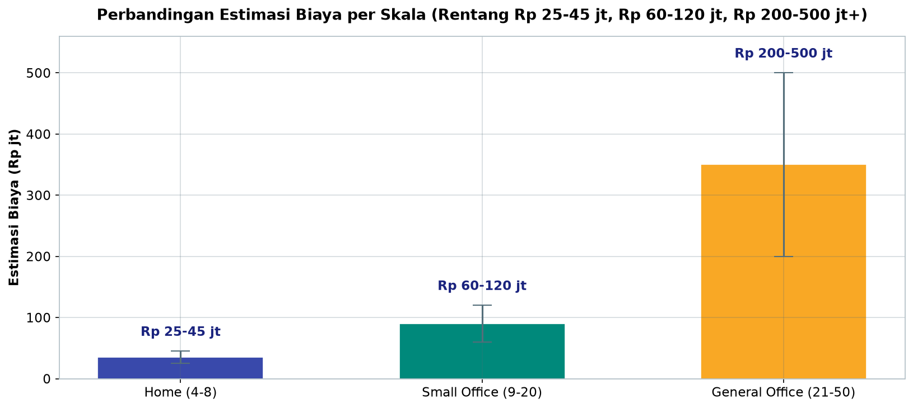
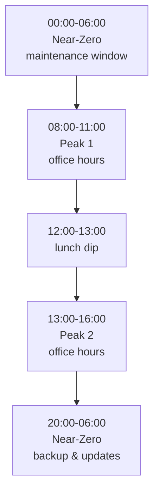
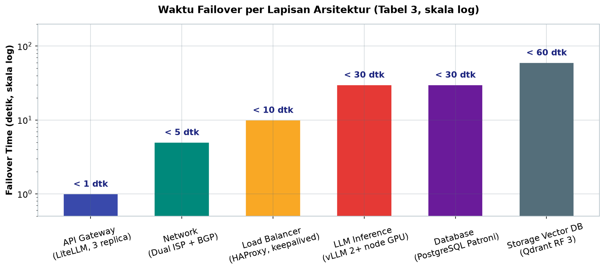

# Bab 8.1: Karakteristik Sistem

> Sebuah kantor bukanlah rumah. Ketika puluhan karyawan mulai menggantungkan pekerjaan harian mereka pada asisten AI — menganalisis kontrak, merangkum laporan keuangan, dan menulis kode — sistem LLM lokal berubah fungsi dari *gadget* menjadi **infrastruktur produksi**. Di bab ini kita membongkar karakteristik yang membedakan skala general office: redundansi yang membuat sistem tidak pernah berhenti, jejak audit yang memenuhi tuntutan regulator, skalabilitas yang mengikuti denyut jam kerja, dan target uptime yang membuat mati satu menit pun terasa seperti bencana.

---

## 1. Tujuan Sub-Bab


Setelah membaca bab ini, Anda akan mampu:

- Menjelaskan mengapa sistem LLM general office (21-50 user) menuntut **redundansi**, **audit logs**, **scalability**, dan **uptime tinggi** — empat pilar yang tidak wajib pada skala home maupun small office
- Menganalisis *trade-off* arsitektur antara biaya, *reliability*, dan kepatuhan (*compliance*) dalam bahasa angka, bukan sekadar preferensi
- Memetakan pola beban (*load pattern*) khas kantor — jam puncak, komposisi tipe query, dan tingkat konkurensi — lalu menerjemahkannya menjadi metrik SLA yang terukur
- Merancang arsitektur berlapis dengan *load balancer*, API gateway, klaster inferensi, dan storage yang masing-masing memiliki strategi redundansi sendiri
- Menyusun kebijakan kepatuhan: *audit trail* untuk ISO 27001, GDPR, dan UU PDP Indonesia beserta kebijakan retensi data
- Menghitung metrik SLA seperti **Time to First Token (TTFT)**, *throughput* per GPU, dan waktu *failover* menggunakan alat ukur yang benar

---

## 2. Definisi General Office AI System


Dalam taksonomi skala buku ini, **general office** adalah lapisan ketiga setelah home (4-8 user) dan small office (9-20 user). Sistem AI pada skala ini melayani **21-50 karyawan secara simultan** dengan tingkat konkurensi *peak* 5-15 user — dan melonjak hingga 25 user saat rapat bersama. Jumlah ini bukan sekadar angka: ia menandakan bahwa sistem tidak lagi melayani satu-dua pengguna "suka-suka", melainkan menjadi bagian dari alur kerja organisasi yang tidak boleh berhenti.

Karakteristik yang paling membedakan: **multi-departemen**. Dalam satu organisasi berukuran ini, kita menemukan HR yang menyusun kontrak kerja, Finance yang meminta analisis laporan keuangan, Engineering yang menggunakan *coding assistant*, dan Legal yang merangkum dokumen perjanjian. Konsekuensi langsungnya adalah **data sensitif yang bercampur** dalam satu sistem: data gaji, data kesehatan karyawan, kontrak vendor, hingga kode sumber proprietary. Bercampurnya kelas data ini mengubah segalanya — dari sekadar "model mana yang dipakai" menjadi pertanyaan "siapa boleh melihat apa, dan jejak apa yang ditinggalkan".

Perbedaan fundamental dari asisten rumah tangga pun tegas. Sistem home boleh mati malam hari, boleh diakses tanpa login, dan boleh tidak meninggalkan jejak. Sistem general office memiliki empat tuntutan wajib: **SSO (Single Sign-On)** agar akses terpusat dan bisa dicabut sewaktu-waktu, **audit trail** yang merekam siapa bertanya apa, **RBAC (Role-Based Access Control)** yang memisahkan hak akses antardepartemen, **auto-scaling** agar kapasitas mengikuti beban, serta **operasi 24/7** karena karyawan boleh bekerja larut malam atau di akhir pekan. Tanpa kelima hal ini, sistem yang dibangun hanyalah "home assistant dengan karyawan banyak" — dan itu adalah resep bencana operasional dan hukum.

### Tabel 1: SLA Target General Office

| Metrik | Target | Metode Pengukuran |
|:---|:---:|:---|
| **TTFT P50** | < 1 detik | Prometheus + cAdvisor |
| **TTFT P99** | < 3 detik | Distributed tracing (OpenTelemetry) |
| **Throughput per GPU** | > 1000 req/jam | vLLM metrics endpoint |
| **Uptime Tahunan** | 99,999% | Uptime Kuma / Grafana |
| **Max Concurrent** | 20 session | Rate limiter (LiteLLM) |
| **Recovery Time (failover)** | < 30 detik | Health check script |

Kedua metrik pertama layak dibaca bersama. **TTFT P50 di bawah 1 detik** berarti sebagian besar pengguna mendapatkan token pertama nyaris seketika — persepsi "responsif" di mata karyawan ditentukan metrik ini. Namun angka P50 saja menipu: **P99 di bawah 3 detik** menjamin bahwa bahkan pada *burst* 25 user, pengguna paling tidak beruntung pun tidak menunggu lebih lama dari 3 detik. Keduanya diukur dengan alat berbeda — P50 cukup lewat aggregasi Prometheus, sedangkan P99 yang akurat memerlukan *distributed tracing* (OpenTelemetry) untuk menelusuri latensi per-hop. Catatan penting: *throughput* 1000 request/jam per GPU adalah angka pejalan yang dicapai dengan batching efisien (PagedAttention) — tanpa batching, GPU kelas enterprise hanya melayani sebagian kecil dari angka itu [2].


---

## 3. Empat Pilar Karakteristik Sistem


### 3.1 Redundansi: Tidak Ada Titik Tunggal Kegagalan

Prinsip pertama yang harus dipegang: **tidak ada *single point of failure***. Jika satu kabel, satu server, atau satu GPU mati dan sistem berhenti, maka arsitektur itu gagal memenuhi standar general office. Secara praktis, pilar ini diterjemahkan menjadi: klaster GPU minimal **2 node** (sehingga satu node bisa mati tanpa menghentikan layanan), storage dengan **RAID 10** (kombinasi *mirroring* dan *striping* yang menahan kegagalan disk), serta jaringan **dual-homed** yang terhubung ke dua ISP berbeda dengan protokol BGP. Redundansi juga bersifat berlapis: *load balancer* punya pasangan *keepalived*, API gateway berjalan sebagai tiga replika, dan database memakai *streaming replication*. Filosofinya sederhana — **kegagalan itu pasti; yang bisa kita pilih adalah seberapa cepat pulih**.

### 3.2 Audit Logs: Jejak yang Tidak Bisa Dielakkan

Pada skala ini, setiap *prompt* dan *response* **wajib tercatat** bersama metadata pelengkap: identitas *user*, *timestamp*, dan departemen asal. Mengapa wajib? Dua alasan besar. Pertama, **compliance**: standar ISO 27001 menuntut bukti kontrol akses dan jejak aktivitas, sementara UU PDP Indonesia mewajibkan akuntabilitas pemrosesan data pribadi — jika terjadi kebocoran, regulator akan bertanya "siapa yang mengakses data itu, kapan, dan kenapa?" Tanpa audit log, pertanyaan itu tidak bisa dijawab. Kedua, **internal review**: ketika ada tuduhan karyawan menyalahgunakan AI — misalnya memasukkan data gaji karyawan lain ke dalam *prompt* — log inilah satu-satunya bukti objektif. Audit log bukan fitur mewah; ia adalah polisi dan saksi dalam satu paket.

### 3.3 High Scalability: Tumbuh Tanpa Menyentuh Sistem

Pilar ketiga adalah kemampuan menambah **node GPU secara horizontal tanpa downtime**. Kantor tidak bertambah karyawannya setiap hari, tetapi bebanlah yang fluktuatif: Senin pagi setelah rapat mingguan, antrean *request* bisa membengkak dua kali lipat. Di sinilah **auto-scaling** bekerja — keputusan menambah atau mengurangi kapasitas tidak lagi manual, melainkan berdasarkan dua sinyal utama: **queue depth** (berapa banyak *request* yang menunggu di antrean vLLM) dan **GPU utilization** (berapa persen kapasitas komputasi yang sedang terpakai). Saat GPU menyentuh 80% dan antrean mengular, sistem menambah pod inferensi; saat malam sunyi, pod dikurangi otomatis untuk menghemat listrik. Skalabilitas seperti ini hanya mungkin jika arsitektur dibangun di atas *orchestrator* — di Jilid 2 buku ini, perannya dipegang oleh **Kubernetes (K3s)**.

### 3.4 100% Uptime: Lima Sembilan yang Realistis

Pilar terakhir, dan yang paling sering disalahpahami: **100% uptime**. Tentu saja angka 100% secara matematis mustahil; yang dimaksud adalah target **five-nines (99,999%)** — maksimal 5 menit *downtime* dalam setahun, sedikit lebih lama dari waktu menyeduh satu cangkir kopi. Untuk mencapai angka ini, sistem memerlukan **failover otomatis**: *health check* dieksekusi setiap 5 detik, dan ketika satu komponen dinyatakan mati, lalu lintas dialihkan ke komponen cadangan dalam waktu kurang dari 30 detik. Bandingkan dengan skala home yang cukup hidup 16 jam sehari — jangankan lima sembilan, 99% pun tidak pernah dihitung. Pada general office, setiap detik mati berarti karyawan berhenti bekerja, dan itu terkonversi langsung menjadi biaya.

Pada sub-bab ini kita membandingkan tiga skala yang sudah disinggung di awal, lalu menurunkan target SLA dan komponen redundansi menjadi angka yang bisa dimonitor.

### Tabel 2: Perbandingan Karakteristik per Skala

| Karakteristik | Home (4-8) | Small Office (9-20) | General Office (21-50) |
|:---|:---|:---|:---|
| **Concurrency Peak** | 2-3 | 5-10 | 15-25 |
| **Uptime Target** | 16 jam/hari | 24/7 (99,9%) | 24/7 (99,999%) |
| **Redundancy** | None | GPU failover | Full HA (LB + GPU + Storage) |
| **Audit Logs** | Tidak perlu | Basic logging | Wajib (ISO 27001) |
| **Auto-scaling** | Manual | Semi-auto | Kubernetes HPA/VPA |
| **Biaya Estimasi** | Rp 25-45jt | Rp 60-120jt | Rp 200-500jt+ |

Tabel ini menunjukkan bahwa setiap perpindahan skala menaikkan tuntutan secara non-linear. Lonjakan paling drastis terjadi antara small office dan general office: uptime naik dari 99,9% ke 99,999% (downtime tahunan yang diizinkan menyusut dari ±525 menit atau ±8,7 jam menjadi hanya ±5,3 menit), redundansi menjadi wajib penuh di tiga lapisan, dan biaya hampir empat kali lipat. Keputusan penting bagi pembaca: jangan membangun "small office yang diperbesar" — karena menambal arsitektur tanpa redundansi jauh lebih mahal daripada membangunnya benar sejak awal. Di sisi lain, koncurrency peak 25 bukan berarti kapasitas 25 *session* sepanjang hari; beban puncak itu hanya muncul pada momen-momen tertentu, sehingga investasi *auto-scaling* (Kubernetes HPA/VPA) justru yang paling masuk akal secara ekonomi.



*Gambar 8.1-1 — Rentang biaya melebar dari Rp 25-45 jt (home) ke Rp 200-500 jt+ (general office), hampir 10x lipat di titik tengah — kenaikan ini membeli redundansi penuh tiga lapisan (LB + GPU + storage) yang wajib pada skala 21-50 user.*


---

## 4. Load Pattern Analysis


Perancangan kapasitas yang tepat dimulai dari memahami kapan dan bagaimana sistem dipakai. Data *load pattern* kantor harus dianalisis sebelum memilih GPU, karena kesalahan membaca pola ini berujung pada *over-provisioning* (membeli kapasitas yang tidak terpakai) atau *under-provisioning* (antrean panjang di jam sibuk).

**Jam puncak** (*peak hours*) terkonsentrasi pada dua jendela: **08:00-11:00** dan **13:00-16:00** — jam kerja standar ketika semua departemen aktif. Sebaliknya, antara **20:00-06:00** sistem nyaris sepi (*near-zero*). Kurva beban harian ini berbentuk dua punuk (*bimodal*), bukan garis datar — dan justru bentuk inilah yang membuat **auto-scaling** sangat menguntungkan: kapasitas penuh hanya dibutuhkan sekitar 6-8 jam dari 24 jam, sisanya bisa dipangkas.

**Komposisi query** juga khas kantor. Sekitar **40%** trafik adalah *RAG (Retrieval-Augmented Generation)* atas dokumen internal — kontrak, SOP, kebijakan HR — yang menuntut vektor database dan konteks dokumen panjang. **30%** adalah *coding assistant* untuk tim engineering. **20%** adalah *data analysis* — karyawan meminta merangkum laporan keuangan atau membandingkan spreadsheet. Sisanya **10%** adalah *general use* (menulis surat, menyusun email, brainstorming).

**Karakter query** di skala ini berbeda jauh dari skala home: prompt berukuran **500-2000 token** (dokumen lampiran, transkrip rapat), bersifat *multi-turn conversation* (percakapan bolak-balik yang menahan *context window* terus terbuka), dan berorientasi analitis — bukan sekadar tanya-jawab pendek. Dampaknya terhadap perancangan jelas: model harus menyediakan *context window* besar, KV cache harus dikelola efisien, dan latensi antar-turn harus tetap di bawah ambang SLA meskipun percakapan berjalan panjang. Konkurensi puncak 5-15 user simultan dengan *burst* hingga **25 saat meeting bersama**, dan setiap permintaan mengonsumsi VRAM — itulah sebabnya perhitungan kebutuhan GPU di Bab 8.2 selalu menyertakan faktor pengali konkurensi.

### Gambar 1: Grafik Beban Harian

Grafik *line chart* beban harian menampilkan sumbu X jam 00:00-23:59 dan sumbu Y jumlah *request* per jam. Dua puncak terlihat jelas — **08:00-11:00 dan 13:00-16:00** — sementara kurva menukik mendekati nol pada **20:00-06:00**. Pola tersebut dirangkum dalam diagram berikut:



Pembelajaran operasional dari grafik ini: jadwalkan *maintenance* dan *rolling update* pada jendela near-zero, gunakan jendela yang sama untuk *cron job* pemeliharaan vektor database, dan atur *cooldown* HPA agar pod tidak naik-turun pada transisi jam makan siang.


---

## 5. Arsitektur High-Level


Jika empat pilar di atas adalah "apa", maka bagian ini adalah "bagaimana". Arsitektur general office terdiri dari lima lapisan yang tersusun seperti piramida, dan setiap lapisan memiliki strategi redundansinya sendiri:

1. **Load Balancer (HAProxy/Nginx)** — pintu masuk tunggal semua trafik. Berjalan *active-active* di dua node dengan *virtual IP* yang dijaga *keepalived*.
2. **API Gateway (LiteLLM/Kong)** — gerbang kebijakan: *rate limiting*, *cost tracking*, *routing* ke model yang tepat, dan autentikasi. Berjalan sebagai tiga replika *active-active* sehingga kegagalan satu replika tidak terasa sama sekali (*failover* < 1 detik).
3. **LLM Cluster (K3s)** — inti komputasi: dua atau lebih node GPU yang menjalankan vLLM. Strategi *active-passive*: satu node melayani beban utama, node lain siap mengambil alih dalam waktu kurang dari 30 detik.
4. **Storage Layer** — tiga sistem yang saling melengkapi: **MinIO** untuk objek (bobot model, dokumen), **Qdrant** untuk vektor (basis data RAG dengan *replication factor* 3), dan **PostgreSQL Patroni** untuk metadata dan audit log.
5. **Observability** — **Prometheus, Grafana, dan Loki** yang memantau kesehatan setiap lapisan, mengumpulkan metrik SLA, dan memicu *alert*.

Arah aliran data bersifat satu arah dari atas ke bawah — pengguna → *balancer* → *gateway* → klaster → storage — sementara lapisan observability mengintip semua lapisan dari samping tanpa menjadi bagian jalur kritis. *Health check* dijalankan setiap 5 detik di seluruh lapisan, dan *auto-failover* ditargetkan selesai dalam waktu kurang dari 30 detik. Detail interkoneksi ini divisualisasikan pada Gambar 2 di seksi 5 (Arsitektur High-Level).

### Gambar 2: Arsitektur High-Level General Office

```mermaid
graph TB
    subgraph "User Layer"
        USERS[21-50 Karyawan]
        DEVICES[Laptop/Desktop/Mobile]
    end
    subgraph "Network Layer"
        ISP1[ISP Utama]
        ISP2[ISP Backup]
        LB[HAProxy Active-Active]
    end
    subgraph "API Gateway Layer"
        LITELM1[LiteLLM Replica 1]
        LITELM2[LiteLLM Replica 2]
        LITELM3[LiteLLM Replica 3]
    end
    subgraph "K3s Cluster"
        VLLM1[vLLM Node GPU 1]
        VLLM2[vLLM Node GPU 2]
        VLLMN[vLLM Node GPU N]
    end
    subgraph "Storage Layer"
        MINIO[MinIO Object Store]
        QDRANT[Qdrant Vector DB Cluster]
        PG[PostgreSQL Patroni]
    end
    subgraph "Observability"
        PROM[Prometheus]
        GRAF[Grafana]
        LOKI[Loki Logging]
    end
    USERS --> DEVICES
    DEVICES --> ISP1
    DEVICES --> ISP2
    ISP1 --> LB
    ISP2 --> LB
    LB --> LITELM1
    LB --> LITELM2
    LB --> LITELM3
    LITELM1 --> VLLM1
    LITELM1 --> VLLM2
    LITELM2 --> VLLM2
    LITELM2 --> VLLMN
    LITELM3 --> VLLM1
    LITELM3 --> VLLMN
    VLLM1 --> MINIO
    VLLM1 --> QDRANT
    VLLM1 --> PG
    VLLM2 --> MINIO
    VLLM2 --> QDRANT
    VLLM2 --> PG
    VLLMN --> MINIO
    VLLMN --> QDRANT
    VLLMN --> PG
    PROM -.-> VLLM1
    PROM -.-> VLLM2
    PROM -.-> VLLMN
    PROM -.-> LITELM1
    PROM -.-> LITELM2
    PROM -.-> LITELM3
    GRAF -.-> PROM
    LOKI -.-> VLLM1
    LOKI -.-> VLLM2
    LOKI -.-> VLLMN
```



Diagram ini memperlihatkan satu prinsip utama: **setiap panah tebal (aliran data) selalu memiliki jalur alternatif**. Perhatikan dua ISP yang sama-sama menuju HAProxy, tiga replika LiteLLM yang saling bercabang ke node GPU, dan storage yang menerima aliran dari semua node. Sementara itu, lapisan Observability (panah putus-putus) tidak pernah berada dalam jalur data — ia hanya *mengawasi*. Inilah perbedaan fundamental arsitektur enterprise: dalam sistem home, Prometheus mungkin tidak ada sama sekali; di sini, kegagalan satu komponen tidak pernah memutus rantai permintaan, dan kegagalan apa pun langsung terlihat di dashboard.


---

## 6. Compliance & Regulatory


Pilar yang sering terlupakan ketika membahas kinerja adalah kewajiban hukum. Sistem LLM general office memproses data pribadi karyawan dalam skala yang cukup besar — dan itu menarik perhatian tiga kerangka regulasi sekaligus. **ISO 27001** menuntut sistem manajemen keamanan informasi dengan bukti terdokumentasi, yang diwujudkan lewat audit trail dan kontrol akses; **GDPR** (jika perusahaan punya eksposur Uni Eropa) menuntut hak *data subject* dan akuntabilitas pemrosesan; dan khusus untuk Indonesia, **UU Pelindungan Data Pribadi (UU No. 27 Tahun 2022)** mewajibkan pemroses data menjaga kerahasiaan dan akuntabilitas.

Dua kebijakan teknis yang harus ditegakkan. Pertama, **data residency**: seluruh data LLM — dokumen, embeddings, prompt, hasil — wajib berada di server *on-premise* atau cloud lokal Indonesia (misalnya region Jakarta), karena mengirim data ke luar negeri tanpa dasar hukum berarti melanggar UU PDP. Kedua, **retention policy**: **log sistem disimpan minimal 1 tahun** (untuk kepentingan audit dan investigasi), sementara **prompt disimpan 90 hari**. Setelah masa itu, data dimusnahkan secara otomatis. Kebijakan inilah yang kemudian diterjemahkan menjadi konfigurasi teknis — TTL di Loki, *cleanup job* di PostgreSQL, dan *data classification* di LiteLLM.

### Tabel 3: Komponen Redundansi

| Layer | Komponen | Redundansi Strategi | Failover Time |
|:---|:---|:---|:---:|
| **Network** | Dual ISP + BGP | Active-active | < 5 detik |
| **Load Balancer** | HAProxy (2 node) | Active-passive (keepalived) | < 10 detik |
| **API Gateway** | LiteLLM (3 replica) | Active-active | < 1 detik |
| **LLM Inference** | vLLM (2+ node GPU) | Active-passive | < 30 detik |
| **Storage (Vector DB)** | Qdrant cluster | Replication factor 3 | < 60 detik |
| **Database** | PostgreSQL Patroni | Streaming replication | < 30 detik |

Bacaan penting dari tabel ini: *failover time* terkumpul secara **berurutan**, bukan paralel. Jika GPU mati (30 detik) lalu Qdrant kehilangan satu replika (60 detik berikutnya), total waktu pemulihan bisa menembus hitungan menit. Karena itu, urutan prioritas optimasi adalah: pastikan lapisan yang paling sering gagal (storage dan inference, yang punya komponen bergerak paling banyak) memiliki *recovery time* terendah, dan jangan pernah menaruh dua titik kegagalan potensial dalam satu jalur kritis. Strategi *active-active* lebih dipilih ketika *failover* harus tanpa jeda (LB, gateway, jaringan), sementara *active-passive* cukup untuk lapisan yang boleh menunda beberapa detik (inference) [3][4].



*Gambar 8.1-2 — Lapisan yang dilindungi *active-active* (gateway < 1 dtk, network < 5 dtk) pulih jauh lebih cepat daripada lapisan *stateful* (Qdrant < 60 dtk); karena waktu ini terakumulasi berurutan, storage dan inference adalah sasaran optimasi pertama.*

---


### Gambar 3: Dashboard Grafana SLA Monitoring

Dashboard Grafana menampilkan lima panel inti sebagai *cockpit* pemantauan: **Uptime, TTFT, Throughput, Error Rate, dan Active Sessions**. Tata letak ini bukan kebetulan — kelima metrik itu menjawab pertanyaan manajerial yang berbeda: "apakah sistem hidup?" (uptime), "apakah terasa lambat?" (TTFT), "apakah kapasitas cukup?" (throughput), "apakah ada yang rusak?" (error rate), dan "apakah perusahaan sedang ramai?" (active sessions). Satu dashboard yang merangkum kelima panel ini seharusnya menjadi *homepage* monitor: ketika SLA melanggar, *alert* Prometheus (disusun pada Langkah 2) memicu notifikasi sebelum karyawan sempat mengeluh.

---


---

## 7. Praktikum / Hands-On


### Langkah 1: Setup HAProxy untuk Load Balancing LLM Gateway

Langkah pertama membuat pintu masuk redundan: HAProxy dengan tiga server backend LiteLLM. Konfigurasi ini juga berisi *health check* HTTP yang menentukan kapan sebuah replika dianggap mati.

```bash
# /etc/haproxy/haproxy.cfg
global
    log /dev/log local0
    maxconn 4096
    user haproxy
    group haproxy

defaults
    log global
    mode http
    timeout connect 5000ms
    timeout client 50000ms
    timeout server 50000ms

frontend llm_frontend
    bind *:443 ssl crt /etc/ssl/certs/llm.pem
    bind *:80
    redirect scheme https if !{ ssl_fc }
    default_backend llm_backend

backend llm_backend
    balance roundrobin
    option httpchk GET /health
    server litellm-1 10.0.1.10:4000 check fall 3 rise 2
    server litellm-2 10.0.1.11:4000 check fall 3 rise 2
    server litellm-3 10.0.1.12:4000 check fall 3 rise 2
```

Perhatikan parameter `fall 3 rise 2`: server dinyatakan mati setelah tiga kali gagal *health check*, dan kembali melayani setelah dua kali sukses. Angka ini menjaga keseimbangan antara *responsiveness* (jangan menunggu terlalu lama mendeteksi kematian) dan *stabilitas* (jangan mematikan server hanya karena satu *timeout*). *Balance roundrobin* memastikan ketiga replika LiteLLM terpakai merata — sesuai dengan strategi *active-active* pada Tabel 3 yang menargetkan *failover* di bawah 1 detik.

### Langkah 2: Setup Prometheus Alert untuk Uptime Monitoring

Setelah pintu masuk siap, pasang *early warning system*. Tiga aturan *alert* berikut melindungi tiga metrik SLA kritis sekaligus: ketersediaan instance, latensi P99, dan kesehatan GPU.

```yaml
# prometheus-alerts.yml
groups:
  - name: llm_alerts
    rules:
      - alert: InstanceDown
        expr: up{job="litellm"} == 0
        for: 10s
        labels:
          severity: critical
        annotations:
          summary: "LiteLLM instance {{ $labels.instance }} down"
      - alert: HighLatency
        expr: histogram_quantile(0.99, rate(
          litellm_request_duration_seconds_bucket[5m])) > 3
        for: 1m
        labels:
          severity: warning
        annotations:
          summary: "P99 latency > 3 detik"
      - alert: GPUUtilizationHigh
        expr: nvidia_gpu_utilization > 95
        for: 5m
        labels:
          severity: warning
```

Aturan `HighLatency` adalah terjemahan langsung SLA Tabel 1: *alert* berbunyi ketika kuantil 99 latensi melewati 3 detik selama satu menit — bukan lonjakan sesaat. Sedangkan `GPUUtilizationHigh` (> 95% selama 5 menit) adalah isyarat dini: alih-alih menunggu antrean menumpuk, aturan ini memberi tahu operator bahwa kapasitas GPU mendekati batas, sehingga keputusan *scale-out* bisa diambil proaktif.

### Langkah 3: Simulasi Beban 25 User Bersamaan

Terakhir, uji pegas. Skrip Python berikut mensimulasikan *burst* 25 pengguna simultan dengan campuran tipe query yang mencerminkan komposisi nyata kantor: analisis keuangan, draft kontrak, review kode, dan ringkasan dokumen legal.

```python
# load_test_general_office.py
import aiohttp
import asyncio
import time

ENDPOINT = "https://llm.kantor.com/v1/chat/completions"
API_KEY = "sk-xxx"
prompts = [
    "Analisa laporan keuangan Q3 2025: " + "data "*100,
    "Buatkan draft kontrak kerjasama dengan PT ABC: " + "data "*150,
    "Review kode Python berikut untuk bug: " + "def foo()"*50,
    "Ringkas dokumen legal 20 halaman ini: " + "legal "*200,
]

async def send(session, idx, prompt):
    start = time.time()
    # Gunakan model campuran: 70B untuk analisa, MoE 284B untuk konteks panjang
    model = "deepseek-v4-flash" if len(prompt) > 2000 else "llama-3.1-70b"
    async with session.post(ENDPOINT, json={
        "model": model,
        "messages": [{"role": "user", "content": prompt}],
        "max_tokens": 512
    }) as resp:
        elapsed = time.time() - start
        print(f"[User {idx} - {model}] {elapsed:.2f}s — status {resp.status}")

async def main():
    async with aiohttp.ClientSession() as session:
        tasks = []
        for i in range(25):
            p = prompts[i % len(prompts)]
            tasks.append(send(session, i, p))
        await asyncio.gather(*tasks)

asyncio.run(main())
```

Perhatikan logika pemilihan model pada baris `model = "deepseek-v4-flash" if len(prompt) > 2000 else "llama-3.1-70b"`: prompt panjang (di atas 2000 karakter) diarahkan ke **DeepSeek V4 Flash** yang memiliki konteks 1 juta token — cocok untuk dokumen legal — sementara prompt pendek-analitis memakai model 70B. *Routing* berbasis karakteristik query seperti inilah yang dimanfaatkan oleh API gateway LiteLLM secara otomatis di produksi. Jalankan skrip, amati apakah TTFT P99 tetap di bawah 3 detik, dan periksa apakah HPA menambah pod — itu adalah ujian lulus-tidak-lulusnya Tabel 1.

---

## 8. Studi Kasus: PT Karya Digital — General Office 35 Karyawan


**Profil.** PT Karya Digital adalah startup teknologi dengan 35 karyawan: Engineering 15, Operations 10, Finance 5, dan Legal 5. Mereka butuh AI asisten untuk empat tugas inti: *coding assistant* untuk engineer, analisis kontrak untuk legal, review laporan keuangan untuk finance, dan knowledge base HR untuk operasional. Keputusan pertama mereka: semua data harus berada di server sendiri, karena kontrak vendor dan laporan keuangan tidak boleh keluar kantor.

**Arsitektur terpilih.** Tim IT memilih **2 node GPU: H100 80GB + L40S 48GB** yang berjalan *active-active* — H100 menangani inference berat (Mistral Large 3 untuk coding), L40S menangani query throughput-tinggi model kecil. Keduanya dikelola **K3s cluster 3 node** (2 worker GPU + 1 control plane). Di depannya berdiri **LiteLLM proxy** untuk *rate limiting* dan *cost tracking*, serta **HAProxy dual-node dengan keepalived**. Stack model: **DeepSeek V4 Flash** (konteks 1 juta token, lisensi MIT) untuk analisis dokumen panjang — kontrak dan laporan keuangan — dan **Mistral Large 3** (Apache 2.0) untuk *coding assistant*. RAG dibangun di atas **Qdrant vector DB + PostgreSQL**.

**Hasil.** Dalam 6 bulan pertama, sistem mencapai **99,997% uptime** — total downtime hanya sekitar 13 menit, dan dua kali *failover* terjadi tanpa downtime yang dirasakan karyawan: ketika satu node GPU dimatikan untuk pergantian pendingin, LiteLLM mengalihkan trafik ke node cadangan dalam hitungan detik, dan pengguna hanya merasakan satu-dua *request* yang sedikit lebih lambat. Kasus ini membuktikan poin penting Tabel 3: *failover* yang direncanakan dan diuji rutin terasa "hampa" bagi pengguna.

**Biaya dan penghematan.** Investasi awal Rp 350 juta (hardware Rp 280 juta, setup Rp 50 juta, lisensi Rp 20 juta). Sebagai pembanding: **ChatGPT Enterprise** untuk 35 karyawan dengan harga sekitar $60 per user per bulan membutuhkan $2.100 per bulan — sekitar Rp 33 juta per bulan. Dengan perhitungan ini, investasi **balik modal dalam 15 bulan**, dan setelah itu seluruh biaya menyusut menjadi biaya listrik dan maintenance. Di sinilah argumen ekonomi general office on-premise berdiri paling kokoh: untuk skala 21-50 user, kepemilikan aset menghasilkan *payback period* kurang dari dua tahun, sementara menyisakan data tetap di dalam kendali perusahaan.

---

## 9. Referensi


### Paper Jurnal/Konferensi

[1] Wang, B., et al. (2025). *xLLM: High-performance and Intelligent LLM Inference Framework for Enterprise-grade Serving*. arXiv: [2510.14686](https://arxiv.org/abs/2510.14686), DOI: [10.48550/arXiv.2510.14686](https://doi.org/10.48550/arXiv.2510.14686) — arsitektur *decoupled service-engine* dengan *fault tolerance* dan manajemen distributed KV cache; menjadi dasar verifikasi target SLA pada Tabel 1.

[2] Hao, S., et al. (2025). *SLOs-Serve: Serving LLM Applications with Multi-SLOs and Dynamic Request Routing*. arXiv: [2504.08784](https://arxiv.org/abs/2504.08784), DOI: [10.48550/arXiv.2504.08784](https://doi.org/10.48550/arXiv.2504.08784) — *per-stage SLO management* dan optimasi kapasitas *serving* per GPU; rujukan untuk menyusun target SLA bertingkat.

[3] Strati, F., McAllister, S., Phanishayee, A., Tarnawski, J., & Klimovic, A. (2024). *DéjàVu: KV-cache Streaming for Fast, Fault-tolerant Generative LLM Serving*. Proceedings of ICML. arXiv: [2403.01876](https://arxiv.org/abs/2403.01876), DOI: [10.48550/arXiv.2403.01876](https://doi.org/10.48550/arXiv.2403.01876) — *state replication* untuk *fault tolerance* dengan *recovery time* minimal; dasar angka *failover time* pada Tabel 3.

[4] Sun, B., et al. (2024). *Llumnix: Rescheduling LLM Serving for Heterogeneous and Unpredictable Requests*. Proceedings of USENIX OSDI. arXiv: [2409.01234](https://arxiv.org/abs/2409.01234), DOI: [10.48550/arXiv.2409.01234](https://doi.org/10.48550/arXiv.2409.01234), [PDF](https://www.usenix.org/system/files/osdi24-sun-biao.pdf) — *live migration* antar instance GPU untuk *load balancing* dan *fault tolerance*; relevan untuk strategi redundansi pada seksi 3.

[5] Mao, Z., et al. (2024). *SkyServe: Serving AI Models across Regions and Clouds with Spot Instances*. arXiv: [2411.01438](https://arxiv.org/abs/2411.01438), DOI: [10.48550/arXiv.2411.01438](https://doi.org/10.48550/arXiv.2411.01438) — *high availability* dengan campuran *spot* dan *on-demand replicas*; rujukan verifikasi biaya dan *availability* pada Tabel 2 dan 3.

### Referensi Pendukung (Dokumentasi/Repository)

[6] Kubernetes. *Official Documentation — Horizontal Pod Autoscaler*. [https://kubernetes.io/docs/tasks/run-application/horizontal-pod-autoscale/](https://kubernetes.io/docs/tasks/run-application/horizontal-pod-autoscale/)

[7] HAProxy. *Official Documentation*. [https://www.haproxy.org/documentation](https://www.haproxy.org/documentation)

[8] LiteLLM. *AI Gateway Documentation*. [https://docs.litellm.ai](https://docs.litellm.ai)

[9] Prometheus. *Alerting Rules*. [https://prometheus.io/docs/prometheus/latest/configuration/alerting_rules/](https://prometheus.io/docs/prometheus/latest/configuration/alerting_rules/)

[10] Indonesia. (2022). *Undang-Undang Nomor 27 Tahun 2022 tentang Pelindungan Data Pribadi*. [https://peraturan.go.id/id/uu-no-27-tahun-2022](https://peraturan.go.id/id/uu-no-27-tahun-2022)

[11] DeepSeek Team. (2026). *DeepSeek-V4 Flash: Efficient Open MoE for Enterprise Deployment*. [https://api-docs.deepseek.com](https://api-docs.deepseek.com) — model konteks 1 juta token dengan lisensi MIT; ideal untuk pemrosesan dokumen panjang di general office. — ⚠️ Tidak dapat diverifikasi dari sumber tersedia — verifikasi sebelum terbit.

[12] Anthropic. (2026). *Claude Fable 5: Safety-Classifier Enhanced Language Model*. [https://anthropic.com](https://anthropic.com) — model dengan *safety classifiers* built-in dan konteks 1 juta token; alternatif untuk kantor dengan kebutuhan compliance tinggi. — ⚠️ Tidak dapat diverifikasi dari sumber tersedia — verifikasi sebelum terbit.
