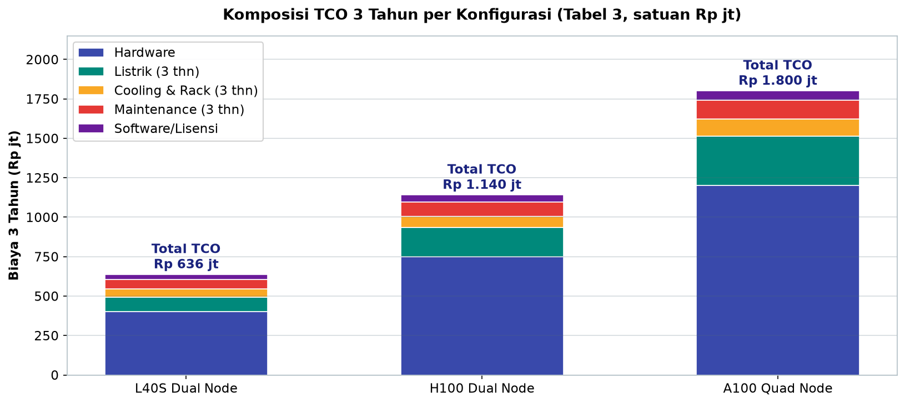
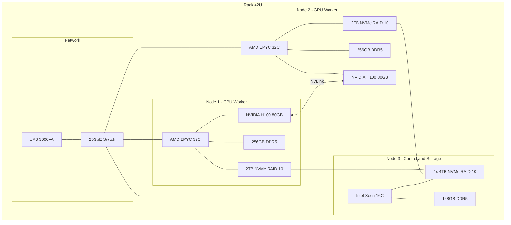
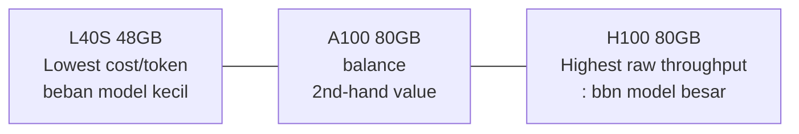
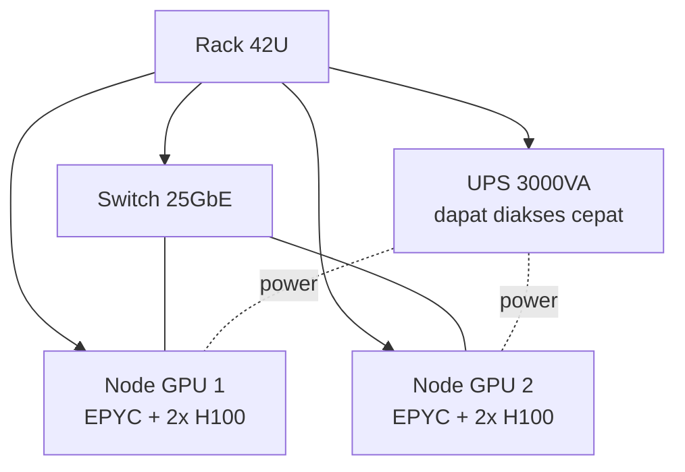

# Bab 8.2: Hardware

> Membeli GPU untuk general office bukanlah sekadar memilih kartu grafis tercepat — melainkan memecahkan teka-teki ekonomi: model mana yang harus dijalankan, berapa banyak karyawan yang dilayani secara simultan, dan berapa total biaya kepemilikan selama tiga tahun. Di bab ini kita membuka kotak spesifikasi A100, H100, dan L40S, menghitung kebutuhan VRAM dengan teliti, membandingkan arsitektur *single-node* versus *multi-node*, dan menutupnya dengan perhitungan TCO yang jujur — karena keputusan hardware yang salah akan hadir sebagai tagihan listrik dan antrean panjang selama bertahun-tahun ke depan. Setelah bab ini, bahasa "GPU 80 GB", "Q4_K_M", dan "25 GbE interconnect" tidak lagi menjadi teka-teki, melainkan alat tawar-menawar di meja pengadaan.

---

## 1. Tujuan Sub-Bab

Setelah membaca bab ini, Anda akan mampu:

- Membedakan **NVIDIA A100, H100, dan L40S** secara teknis — arsitektur, VRAM, *memory bandwidth*, dan *throughput* — dalam konteks *inference* LLM, bukan *training*
- Menentukan kapan arsitektur **single-node** sudah cukup dan kapan harus beralih ke **cluster multi-node**
- Menghitung kebutuhan **VRAM** per model dan per tingkat konkurensi user menggunakan formula yang teruji
- Menyusun konfigurasi GPU yang cocok untuk tiga profil kantor: budget (21-30 user), standard (31-40 user), dan premium (41-50 user)
- Menghitung **TCO (Total Cost of Ownership)** 3 tahun yang mencakup listrik, *cooling*, *maintenance*, dan lisensi — bukan hanya harga GPU
- Mengidentifikasi komponen pendukung yang sering dilupakan: CPU, RAM, storage NVMe RAID 10, jaringan 25/100 GbE, rack, dan UPS

---

## 2. Konsep Dasar GPU Inference Server

Sebelum menyentuh spesifikasi, satu kesalahpahaman umum harus diluruskan: **LLM inference berbeda fundamental dari training**. *Training* dibebani *compute* (matematika floating-point yang masif), sedangkan *inference* — menyalakan model untuk melayani prompt — dibatasi oleh **memory bandwidth**: kecepatan GPU membaca bobot model dari VRAM untuk setiap token yang dihasilkan. Sebuah GPU dengan TFLOPS tinggi tetapi bandwidth rendah akan menghasilkan token dengan lambat, seperti pustakawan yang sangat pintar tetapi harus berjalan jauh setiap kali mengambil sebuah buku. Inilah sebabnya pada tabel perbandingan di seksi 7, kolom *memory bandwidth* dan VRAM lebih menentukan daripada kolom TFLOPS.

Konsekuensi kedua dari karakteristik ini: **efisiensi batching lebih berharga daripada kecepatan kartu**. Karena *decode* token berjalan sekuensial, satu GPU yang melayani satu *request* sambil menganggur di antara token adalah pemborosan murni — kartu itu tidak terpakai 60-80% waktunya. Teknik *continuous batching* (yang diimplementasikan vLLM via *PagedAttention* [2]) memanfaatkan celah ini dengan mengerjakan banyak *request* dalam satu kartu secara bergantian token per token. Implikasi praktisnya bagi *sizing*: *throughput* kartu ditentukan oleh *concurrency* yang bisa ditampungnya, dan *concurrency* itu dibatasi VRAM — memutar lagi ke tema bandwidth + VRAM sebagai dua sumbu keputusan pembelian.

Untuk skala general office 21-50 user, kebutuhan *throughput* berkisar **500-2000 request per jam** dengan model berukuran 7B-70B — jauh di bawah kapasitas penuh sebuah GPU enterprise, tetapi menuntut *stability* dan *concurrency* yang kokoh. Setiap user simultan menyimpan *context* sendiri di VRAM, sehingga bukan sekadar kecepatan menghasilkan token yang penting, melainkan juga **berapa banyak percakapan yang bisa hidup bersamaan dalam satu VRAM 80 GB**.

Sebuah teknik kalkulasi cepat yang dipakai konsultan *infra*: kalikan jumlah jam kerja efektif (sekitar 6-8 jam per hari, sesuai pola beban Bab 8.1) dengan *request* per jam, lalu bagi dengan jam tersedia untuk mendapatkan *average request rate* per menit. Kantor 30 user dengan 1.000 *request* per jam di jam sibuk berarti ±17 *request* per menit — dan dengan *response* rata-rata 15 detik, jumlah *request* yang "hidup" secara bersamaan di sistem hanyalah ±4-5. Perhitungan sederhana ini langsung menjawab pertanyaan "berapa GPU yang kubutuhkan?" lebih akurat daripada menebak dari jumlah karyawan, dan menjadi titik masuk ke seksi 4 (perhitungan VRAM).

Batasan *throughput* ini juga menerjemahkan menjadi bahasa teknis yang sederhana: general office tidak membutuhkan *frontier cluster* berbiaya miliaran, tetapi membutuhkan **ketepatan ukuran** (*right-sizing*). Sebuah kartu H100 yang menjalankan model FP8 mampu menghasilkan ratusan ribu token per menit — tetapi kapasitas itu sia-sia bila antrean dipersempit oleh *rate limiter* atau *context window* yang kurang. Di sisi lain, meremehkan kebutuhan berarti karyawan menatap layar "memuat" di jam sibuk — dan setiap detik menunggu adalah biaya gaji yang menguap.

Dari titik ini muncul dua arsitektur yang akan diuji sepanjang bab: **single-node multi-GPU** — satu server fisik berisi 4-8 GPU yang saling terhubung NVLink — dan **multi-node single-GPU** — dua hingga empat server, masing-masing berisi satu-dua GPU, yang diorkestrasi oleh Kubernetes. Keduanya punya pengusungnya masing-masing; seksi 5 akan mengupas kapan memilih yang mana. Sebelum melangkah lebih jauh, mari kita kenali dulu ketiga kandidat GPU-nya — karena keputusan arsitektur pada akhirnya ditentukan oleh karakter kartu yang dipilih.

---

## 3. Profil GPU: A100, H100, dan L40S

### NVIDIA A100 (Ampere, 2020)

Peluncuran A100 pada 2020 menandai era *data center GPU* untuk semua gunanya: **80 GB HBM2e** dengan *memory bandwidth* **2 TB/s**, *compute* **312 TFLOPS FP32** (624 TFLOPS FP8), dan interkoneksi **NVLink 3** hingga 600 GB/s. Di tahun 2026, A100 berusia enam tahun dan kini berstatus **opsi budget** — harga barunya turun seiring masuknya H100 dan B200, dan pasokan GPU bekas sisa *cloud provider* membuatnya semakin terjangkau. Untuk general office, A100 masih sangat layak: satu kartu 80 GB cukup menampung **model 70B dalam kuantisasi Q4_K_M** beserta *KV cache*-nya, dengan TDP 400W yang tidak terlalu menantang ruang server. Kerugiannya: *energy efficiency* per token lebih buruk daripada generasi berikutnya, dan tidak memiliki *Transformer Engine* untuk percepatan FP8 yang dimiliki H100.

Dua catatan pembelian untuk kelas A100 *second-hand* tahun 2026. Pertama, periksa **revisi board dan status *vBIOS*** — GPU bekas *data center* sering dijual tanpa jaminan *flash* yang baik, dan dua kartu dengan *vBIOS* berbeda bisa menolak bekerja berdampingan dalam satu server. Kedua, A100 adalah pilihan terbaik di segmennya untuk kantor yang *tahun depannya* berencana berpindah ke model 70B yang lebih besar — satu-satunya cara mendapatkan kapasitas 70B dengan investasi di bawah Rp 400 juta. Jika tidak ada rencana seperti itu, L40S di bawah adalah pembelanjaan rupiah yang lebih disiplin.

Ringkas posisi ketiga kartu dalam satu kalimat pengambilan keputusan: **A100 untuk model besar dengan anggaran ketat, H100 untuk model besar dengan janji SLA ketat, L40S untuk model kecil dengan volume tinggi**.

### NVIDIA H100 (Hopper, 2022)

H100 adalah GPU unggulan era Hopper yang mengubah lanskap *inference* sekaligus *training*: **80 GB HBM3** dengan bandwidth **3,35 TB/s** — 67% lebih lebar dari A100 — ditambah **Transformer Engine** yang membawa *mixed precision* FP8 ke level produksi. Efek gabungan keduanya menghasilkan klaim yang dijadikan tolok ukur industri: **hingga 7x percepatan *inference* dibandingkan A100** untuk workload yang mendukung FP8. NVLink 4 (900 GB/s) menghubungkan delapan GPU dalam satu node tanpa hambatan. Dengan TDP 700W, H100 adalah GPU paling haus listrik dalam perbandingan ini, dan harganya (Rp 400-600 juta per kartu) yang membuatnya keputusan strategis: mahal, tetapi **paling realistis untuk melayani 50 user** dengan model besar seperti Mistral Large 3 atau DeepSeek V4 Pro dalam kuantisasi. Jika memilih H100, pertimbangkan bahwa kemampuan penuhnya baru tercapai bila model dijalankan dalam FP8 — bukan FP16.

Perlu kejujuran di sini: H100 juga adalah GPU yang paling sering "disalahkan" karena harganya. Pada kenyataannya, FOMO membeli H100 untuk kantor 25 user yang 70% bebannya model 7-14B adalah kesalahan klasik — kartu itu akan menganggur 90% waktunya. H100 baru wajib menjadi kandidat ketika (1) model 70B+ menjadi beban mayoritas, (2) konkurensi puncak menembus 25 user, atau (3) perusahaan memproyeksikan pertumbuhan user dalam 2 tahun. Di luar kondisi itu, jawabannya ada di kartu berikut — L40S — atau di H100 *bekas* milik *cloud provider* Eropa yang mulai melepas armadanya ke pasar *surplus*.

### NVIDIA L40S (Ada Lovelace, 2023)

L40S mewakili pendekatan yang sepenuhnya berbeda: memaksimalkan **harga per token**, bukan kekuatan absolut. Dengan **48 GB GDDR6**, *memory bandwidth* **864 GB/s**, *compute* 568 TFLOPS FP32 (1.138 TFLOPS FP8), dan TDP hanya 350W, L40S adalah kartu yang dirancang untuk *inference throughput* tinggi pada model 7B-14B. Kunci pemahamannya: GDDR6 di L40S jauh lebih lambat daripada HBM di A100/H100, tetapi untuk model kecil yang muat sepenuhnya dalam VRAM, bandwidth itu sudah cukup laju — dan biaya per kartu (Rp 150-250 juta) membuatnya menjadi mesin token dengan **biaya per token terendah** di kelas ini. Pilihan cerdas bagi kantor yang sebagian besar bebannya adalah model 7B-14B (chat cepat, ringkasan, RAG ringan) dan tidak memerlukan model 70B dalam jumlah besar.

Kesimpulan yang lebih tajam: **L40S dan H100 bukanlah pesaing, melainkan mitra dalam satu klaster**. Arsitektur khas general office yang sehat justru mencampur keduanya — H100 untuk inference berat model besar (Mistral Large 3, DeepSeek V4 Flash dalam Q4), L40S untuk router berkecepatan tinggi model kecil (Ministral 3 14B, Llama 8B) yang menyerap sebagian besar trafik harian. Pola *tiered serving* seperti ini memaksimalkan biaya per token keseluruhan: query mahal dilayani kartu mahal, query murah dilayani kartu murah — dan tagihan listrik bulanan tetap terkendali karena L40S menyerap beban dengan TDP separuh H100.

---

## 4. Perhitungan Kebutuhan VRAM

Merancang kapasitas dimulai dari satu pertanyaan: **berapa GB VRAM yang dibutuhkan sebuah model pada tingkat konkurensi tertentu?** Rumusnya terdiri dari tiga komponen: ukuran bobot model (sesuai kuantisasi), *KV cache* per *context*, dan faktor pengali untuk konkurensi.

Angka dasar yang dipakai di seluruh buku ini:

- **Model 7B FP16**: bobot ±14 GB + KV cache ±2 GB = **±16 GB** — muat dalam satu L40S 48 GB
- **Model 13B Q4_K_M**: bobot ±7 GB + KV cache ±3 GB = **±10 GB** — sangat hemat; hampir setengah VRAM L40S masih tersisa untuk batching
- **Model 70B Q4_K_M**: bobot ±38 GB + KV cache ±8 GB = **±46 GB** — inilah alasan mengapa A100/H100 80 GB menjadi standar: model 70B kuantisasi *muat di satu kartu* dengan sisa ruang untuk *prefill* dan batching

Komponen yang paling sering diremehkan adalah **faktor konkurensi**. *KV cache* hidup selama percakapan berlangsung, sehingga satu user aktif memakan ruang — bukan hanya saat dia mengetik. Aturan praktis: **1 user simultan membutuhkan 1,5-2x** VRAM model saja, dan **10 user konkuren membutuhkan 4-6x**. Dengan kata lain, 70B Q4_K_M (46 GB dasar) pada 10 user konkuren bisa menuntut lebih dari 180 GB VRAM — di sanalah perbedaan antara 1 kartu 80 GB dan 2 kartu 80 GB menjadi keputusan hidup-mati. Abaikan faktor ini, dan sistem yang tampak "cukup" di kertas akan *out of memory* pada Selasa pagi pertama.

Mari kerjakan satu contoh lengkap untuk kantor 35 user dengan *peak concurrency* 15 (Bab 8.1). Asumsi: 40% trafik adalah RAG atas dokumen panjang (context 8.192 token), 30% *coding assistant* (context 4.096), 30% sisanya tugas ringan. Untuk model **Mistral Large 3 Q4** pada H100 80 GB: bobot ±46 GB, lalu tambahkan *KV cache* untuk 15 percakapan hidup masing-masing ±8 GB → 120 GB. Total kebutuhan ±166 GB — artinya satu H100 tidak cukup; konfigurasi dua node @ 1x H100 (berbagi beban via klaster) menjadi minimum yang rasional. Sekarang ulangi dengan beban 5 user konkuren: ±86 GB — satu H100 80 GB *masih* muat dengan *squeeze*. Di sinilah keputusan hardware berubah total hanya karena membaca pola beban dengan benar: **konkurensi, bukan jumlah karyawan, yang menentukan jumlah kartu** [2].

Uji kedua untuk beban yang lebih ringan: model **Ministral 3 14B Q4** (±9 GB bobot + ±2 GB *KV cache* per percakapan) pada L40S 48 GB. Dengan *peak concurrency* 10 di jam sibuk — kantor 25 user yang 60% trafiknya *chat cepat* — kebutuhan total hanya ±29 GB, muat dengan lega dalam satu L40S, dan *sekarat* sama sekali belum terasa: vLLM masih bisa *batching* 8-16 *request* bersamaan. Bandingkan biayanya: satu L40S (Rp 150-250 juta) menggantikan peran satu H100 (Rp 400-600 juta) untuk seluruh beban ringan kantor. Inilah ilustrasi mengapa *tiered serving* pada seksi 3 bukan teori: **dua L40S + satu H100 seringkali lebih murah dan lebih sesuai daripada tiga H100** untuk kantor yang *query*-nya didominasi model kecil.

---

## 5. Cluster Multi-Node vs Single-Node

Dua jalan menuju kapasitas. **Single-node (4-8 GPU)** — biasanya server dual-socket seperti Dell R760xa dengan GPU yang saling terhubung NVLink — menawarkan *latency* terendah karena komunikasi antar-GPU berjalan di 900 GB/s, dan *software stack* lebih sederhana (satu OS, satu hypervisor). Kelemahannya klasik: **single point of failure**. Satu PSU mati, satu *motherboard* rusak, maka delapan GPU ikut mati — dan *downtime* GPU seharga miliaran rupiah itu sangat menyakitkan.

**Multi-node (2-4 node, masing-masing 1-2 GPU)** mengorbankan sebagian *latency* (komunikasi antar-node melewati jaringan 25/100 GbE, bukan NVLink) demi dua keuntungan besar: **resilience** — satu node mati, node lain tetap melayani; dan **scalability horisontal** — menambah kapasitas sesederhana memasang satu server baru ke dalam klaster K3s, tanpa menyentuh yang lama. Bagi general office yang mengejar 99,999% uptime (Bab 8.1), karakteristik ini adalah ajang kemenangan.

Perbandingan kedua arsitektur juga menyentuh lapisan yang lebih halus: *operational blast radius*. Dalam single-node, satu *kernel panic* berarti delapan GPU mati sekaligus — dan investigasi *root cause* harus menyisir satu mesin raksasa. Dalam multi-node, kegagalan terisolasi per node; pod vLLM yang mati di-*reschedule* oleh K3s ke node sehat dalam hitungan detik, sementara operator menyelidiki server bermasalah tanpa tekanan lalu lintas. Bagi tim IT kantor yang umumnya kecil (1-3 orang), *blast radius* kecil ini bernilai luar biasa — mereka jarang mendapat *maintenance window* panjang seperti *data center* operator.

Rekomendasi buku ini untuk 21-50 user: **2 node @ 1x H100 atau L40S** — bukan 1 node @ 2 GPU, bukan pula 4 node kecil-kecil. Dua node memberi redundansi GPU minimum yang diminta pilar arsitektur (Bab 8.1), sementara tetap menjaga kompleksitas jaringan dan biaya interkoneksi tetap rendah. Sedangkan single-node multi-GPU tetap punya tempat: hanya untuk workload yang membutuhkan *tensor parallelism* antar-GPU berlatensi sangat rendah, seperti DeepSeek V4 Pro dalam FP8 — kasus yang dibahas pada konfigurasi Premium.

Ringkas perbandingannya: **single-node membeli kecepatan, multi-node membeli ketenangan**. Kantor yang melayani klien eksternal dengan janji SLA 99,9%+ tidak punya pilihan selain multi-node — nama baik lebih mahal daripada *latency* 5 milidetik. Kantor yang beban AI-nya non-kritis (misalnya hanya asisten internal) boleh mulai dari single-node dengan catatan eksplisit: *recovery time objective* (RTO) mereka dihitung dalam satuan hari, bukan detik. Keputusan ini harus ditulis sebagai kebijakan tertulis, karena menentukan seluruh biaya *cooling*, listrik, dan *maintenance* tiga tahun ke depan.

---

## 6. Komponen Pendukung

GPU adalah bintang, tetapi tanpa pengiring yang tepat, bintang itu tidak akan naik panggung. Berikut komponen pendukung yang wajib dianggarkan bersama GPU:

- **CPU**: AMD EPYC atau Intel Xeon, minimal **16 core** — untuk mesin GPU worker, 32 core (misalnya AMD EPYC 32C) adalah pilihan aman karena runtime vLLM, tokenizer, dan scheduler ikut menumpang
- **RAM**: **256-512 GB DDR5** per node GPU — model di-load penuh ke VRAM, tetapi *prefetch* bobot, *KV cache* CPU offload (Mooncake-style [4]), dan *prefill* berjalan lewat RAM
- **Storage**: **NVMe RAID 10 sebesar 2-4 TB** untuk menyimpan bobot model dan *checkpoint* — RAID 10 dipilih karena menggabungkan kecepatan dan ketahanan disk
- **Network**: **25/100 GbE** untuk *interconnect* antar-node di klaster multi-node; 25 GbE adalah *baseline*, 100 GbE untuk beban RAG atau *tensor parallel*
- **Rack & listrik**: rack **42U**, **UPS 3000VA**, dan kapasitas *cooling* **10-15 kW** — TDP tiga GPU plus CPU server dengan mudah melewati 2 kW, dan ruang server biasa tanpa AC khusus akan meleleh

Sebuah catatan praktis tentang **urutan pembelian**: komponen pendukung harus dipesan lebih dulu daripada GPU — bukan sebaliknya. Alasannya logistik murni: GPU enterprise membutuhkan *power connector* khusus (8-pin EPS pada H100), server NVIDIA-Certified tertentu, dan rak dengan *airflow* depan-belakang. Kantor yang membeli GPU lebih dulu sering menemukan kekurangan ini dua bulan kemudian, saat kartu mahal sudah terlanjur menumpuk di gudang. Urutan yang benar: *(1)* periksa daya listrik ruangan dan siapkan jalur khusus, *(2)* pesan rack, UPS, dan AC, *(3)* pesan server dan storage, *(4)* baru GPU — dan gunakan masa tunggu GPU untuk menyelesaikan instalasi.

Komponen-komponen ini — bukan GPU-nya — yang sering membengkakkan anggaran di lapangan. Tabel TCO pada seksi 7 memasukkan semuanya, sehingga pembaca tidak akan kaget setelah pembelian.

Satu komponen terakhir yang sering luput dari daftar karena tidak berwujud: **waktu setup dan keahlian**. Memasang dua node GPU + K3s + vLLM dari nol biasanya memakan 5-10 hari kerja seorang engineer — atau 2-3 hari jika memakai *deployment guide* terstandardisasi dari vendor (NVIDIA Base Command, Dell OpenManage). Untuk general office yang tidak memiliki DevOps penuh waktu, *platform engineering* semacam ini bisa di-outsource, dengan catatan: serahkan dokumentasi konfigurasi yang menyeluruh, karena pergantian tim adalah kemungkinan nyata. Anggaran setup ±Rp 50 juta pada studi kasus Bab 8.1 adalah gambaran realistis kelas biaya ini.

---

## 7. Tabel Wajib

### Tabel 1: Perbandingan GPU Spesifikasi

| Spesifikasi | NVIDIA A100 80GB | NVIDIA H100 80GB | NVIDIA L40S 48GB |
|:---|:---|:---|:---|
| **Arsitektur** | Ampere (2020) | Hopper (2022) | Ada Lovelace (2023) |
| **VRAM** | 80 GB HBM2e | 80 GB HBM3 | 48 GB GDDR6 |
| **Memory Bandwidth** | 2.0 TB/s | 3.35 TB/s | 864 GB/s |
| **FP32 TFLOPS** | 312 | 989 | 568 |
| **FP8 TFLOPS** | 624 | 1,979 | 1,138 |
| **Interconnect** | NVLink 3 (600 GB/s) | NVLink 4 (900 GB/s) | PCIe 4.0 x16 |
| **TDP** | 400W | 700W | 350W |
| **Harga Pasar (Rp)** | ~250-350 jt | ~400-600 jt | ~150-250 jt |

Bacaan penting tabel ini: perhatikan bahwa *memory bandwidth* tidak berjalan seiring harga. A100 dua kali lebih lebar dari L40S dalam bandwidth (2,0 TB/s vs 864 GB/s) — untuk model 70B, A100 unggul jelas; tetapi untuk model 7B yang muat dalam satu *die*, perbedaan bandwidth itu nyaris tak terasa, sementara harga L40S setengahnya. Inilah inti *trade-off* pembelian: **beli bandwidth ketika model besar mendominasi; beli kartu murah ketika beban mayoritas adalah model kecil**. Jangan pula mengabaikan baris interkoneksi: L40S hanya PCIe 4.0 x16 tanpa NVLink — ia adalah kartu *single-GPU independent* yang disatu-padukan lewat jaringan, cocok untuk klaster multi-node, bukan untuk *tensor parallel* dalam satu node [1]. Spesifikasi di atas mengacu pada dokumen arsitektur resmi NVIDIA [1, referensi pendukung] dan benchmark dunia nyata A100 vs H100 vs L40S [5].

### Tabel 2: Rekomendasi Konfigurasi per Skenario

| Skenario | GPU | Model & Kuantisasi | Max Concurrent User | Estimasi Biaya |
|:---|:---|:---|:---:|:---:|
| **Budget (21-30 user)** | 2x L40S | DeepSeek V4 Flash Q4 + Qwen3.6-27B Q5_K_M | 15 | Rp 350-450jt |
| **Standard (31-40 user)** | 2x H100 | Mistral Large 3 Q4 (Apache 2.0) + Ministral 3 14B | 25 | Rp 600-800jt |
| **Premium (41-50 user)** | 4x H100 | DeepSeek V4 Pro Q4 + Mistral Large 3 Q8 | 35 | Rp 1.2-1.5M |
| **Cluster HA** | 3x L40S (2 active + 1 standby) | DeepSeek V4 Flash + Mistral Large 3 via vLLM | 30 | Rp 500-650jt |

Tabel ini adalah peta keputusan. **Budget** menaruh DeepSeek V4 Flash kuantisasi Q4 di atas L40S — strategi MoE (284B total, 13B aktif) membuat *memory footprint* terkendali sambil menawarkan konteks 1 juta token untuk dokumen panjang; Qwen3.6-27B menangani *coding* pada L40S kedua. **Standard** menaikkan kelas ke H100 untuk Mistral Large 3 Q4 (Apache 2.0) dan Ministral 3 14B. **Premium** masuk zona 4x H100 karena DeepSeek V4 Pro Q4 (1,6T parameter) membutuhkan *tensor parallelism* antar-GPU berinterkoneksi NVLink — arsitektur yang hanya tersedia di single-node besar [10]. **Cluster HA** memilih 3x L40S dengan satu unit *standby* murni — membeli ketenangan pikiran 99,999% uptime dengan menahan satu GPU menganggur, sebuah pilihan yang masuk akal untuk kantor yang lebih takut *downtime* daripada mahal GPU. Perhatikan: *max concurrent user* di sini adalah batas nyaman dengan *KV cache* utuh, bukan batas teoritis.

Empat skenario ini juga mengajarkan pola yang lebih umum: **kualitas model dan jumlah user bergerak searah dengan biaya**. Kantor yang rela menerima kualitas *assistant level* (Ministral 3 14B, Qwen3.6-27B) akan membayar setengah dari kantor yang menuntut *frontier-level* di setiap query (Mistral Large 3, DeepSeek V4 Pro). Tidak ada nilai moral di sini — hanya kesejajaran antara kebutuhan bisnis dan anggaran. Sebuah general office *interior design* yang jarang menyentuh kode sama sekali tidak pernah membutuhkan konfigurasi Premium, meskipun karyawannya 50 orang; sedangkan *software house* 25 orang yang mengerjakan *code review* sepanjang hari justru layak menempuh jalur Standard.

Cara membaca tabel ini sebagai *decision tree*: pertama tentukan **model kelas berat** yang wajib dijalankan (jika DeepSeek V4 Pro menjadi syarat, langsung lompat ke skenario Premium; jika Mistral Large 3 cukup, Standard; dan seterusnya). Kedua, cocokkan dengan **jumlah user nyata**, bukan jumlah karyawan — kantor 50 karyawan dengan hanya 20 yang rutin memakai AI boleh membangun di atas skenario Budget. Ketiga, beri *headroom* satu langkah bila proyeksi pertumbuhan pengguna aktif lebih dari 30% per tahun. Tabel ini juga menunjukkan bahwa *max concurrent user* tidak pernah sebanding linear dengan jumlah kartu: dari 2x L40S (15 user) ke 4x H100 (35 user), GPU berlipat dua tetapi user hanya naik 2,3x — karena model yang dijalankan ikut membesar. **Memilih model dulu, menghitung user kemudian — itulah urutan yang benar.**

### Tabel 3: TCO 3 Tahun (IDR)

| Komponen Biaya | L40S Dual Node | H100 Dual Node | A100 Quad Node |
|:---|:---:|:---:|:---:|
| **Hardware** | Rp 400jt | Rp 750jt | Rp 1.2M |
| **Listrik (3 thn, Rp 1.5k/kWh)** | Rp 92jt | Rp 184jt | Rp 315jt |
| **Cooling & Rack (3 thn)** | Rp 54jt | Rp 72jt | Rp 108jt |
| **Maintenance (3 thn)** | Rp 60jt | Rp 90jt | Rp 120jt |
| **Software/Lisensi** | Rp 30jt | Rp 45jt | Rp 60jt |
| **Total TCO 3 Tahun** | **Rp 636jt** | **Rp 1.14M** | **Rp 1.8M** |

Tabel TCO mengubah cara pandang pembelian GPU. Harga beli H100 dual node hanya sepertiga dari total TCO Rp 1,14 miliar — **dua pertiga sisanya adalah biaya hidup** (listrik, cooling, maintenance, lisensi). Perhatikan pula perbandingan mengejutkan antara H100 (700W) dan L40S (350W): selisih TDP dua kali lipat memproduksi selisih tagihan listrik dua kali lipat (Rp 184jt vs Rp 92jt) dan selisih *cooling* yang sejalan. Untuk kantor yang beroperasi di lokasi dengan tarif listrik industri tinggi, L40S bahkan lebih menarik daripada yang terlihat di harga kartu. Satu-satunya koreksi terhadap kesimpulan "pilih yang paling hemat" adalah *throughput*: jika 25 user membutuhkan H100 (Tabel 2, skenario Standard), memaksakan L40S hanya akan menghasilkan antrean — dan biaya karyawan menunggu jauh lebih mahal daripada selisih TCO [5]. Angka-angka di sini bersifat indikatif terhadap harga pasar Indonesia saat penulisan dan wajib divalidasi ulang sebelum keputusan pembelian.



*Gambar 8.2-1 — Hardware mendominasi tiap pilar TCO (Rp 400 jt → Rp 750 jt → Rp 1.200 jt), tetapi biaya hidup ikut menanjak seiring kelas kartu; TDP dua kali lipat (H100 vs L40S) tercermin pada tagihan listrik dua kali lipat (Rp 184 jt vs Rp 92 jt), persis narasi seksi 6.*

Baca juga apa yang **tidak tercantum** di tabel TCO: biaya tenaga kerja setup (±Rp 50 juta dalam studi kasus Bab 8.1), biaya *downtime* selama migrasi, dan *residual value* GPU di akhir tahun ketiga. A100 yang setelah 3 tahun masih laku 50% dari harga beli di pasar *surplus* akan mengubah kalkulasi — begitu pula H100 yang *depresiasinya* lebih lambat karena permintaan kuat. Bagi perusahaan yang disiplin mencatat, praktik terbaik adalah membuat **tabel TCO versi sendiri** — kolom tambahan untuk *residual value* dan *replacement schedule* — sebelum menandatangani PO. Terakhir, jadwalkan pembelian di sekitar siklus rilis NVIDIA: kedatangan generasi baru biasanya menekan harga GPU generasi lama di pasar resmi, sebuah fenomena yang menguntungkan kantor dengan tenggat fleksibel.

---

## 8. Diagram & Visualisasi

### Gambar 1: Arsitektur Multi-Node Cluster



Diagram ini menggambarkan rekomendasi utama bab ini: **dua node GPU worker** dengan spesifikasi simetris (EPYC 32C, H100 80GB, 256GB DDR5, 2TB NVMe RAID 10) terhubung melalui **switch 25GbE**, ditambah satu **node control dan storage** (Xeon 16C, 128GB, 4x 4TB NVMe RAID 10) yang menampung bobot model bersama. Perhatikan baris `NVME1 --- STORAGE` dan `NVME2 --- STORAGE`: model disimpan sekali di storage bersama dan dipasang ke kedua node (*shared storage*), sehingga ketika satu worker mati, kawan-nya langsung memuat model dari lokasi yang sama tanpa *re-sync*. Panah `GPU1 <-- NVLink --> GPU2` menandakan bahwa dalam satu node (bila memasang 2 GPU), NVLink 4 menghubungkan kartu pada 900 GB/s [1]; antardua node yang berbeda, komunikasi berjalan lewat switch. Baris `UPS --- SWITCH` menggambarkan peran UPS yang menaungi seluruh rack — *power loss* pendek adalah penyebab paling umum *downtime* di kantor general office, dan UPS 3000VA adalah keputusan arsitektural, bukan aksesori.

Ada satu detail yang sengaja tidak digambar: **koneksi internet**. Node inference tidak memerlukan akses internet berkelanjutan — model sudah berada di storage lokal — dan justru lebih aman tanpa koneksi keluar, karena ini mempersempit permukaan serangan (Bab 8.5). Jika internet diperlukan (misalnya untuk *telemetry* atau pembaruan model), arahkan lewat *proxy* terkontrol. Dengan kata lain, diagram di atas adalah diagram sebuah kantor yang *sovereign*: seluruh siklus hidup model — penyimpanan, pemuatan, *inference* — berjalan di dalam perimeter fisik perusahaan sendiri.

### Gambar 2: Diagram Perbandingan Performance per Dollar

Perbandingan **token per detik per juta rupiah** untuk A100, H100, dan L40S berdasarkan *benchmark* dunia nyata [5] dapat dilihat pada diagram berikut. Dua kesimpulan yang diharapkan dari perbandingan ini: **L40S unggul di *cost efficiency*** — token termurah per rupiah untuk beban model kecil — sementara **H100 unggul di *raw performance*** — token terbanyak per detik mutlak. A100 duduk di tengah: bukan yang tercepat, bukan yang termurah, tetapi pembelian *second-hand* yang berharga untuk kantor dengan anggaran terbatas yang tetap ingin menjalankan model 70B.



Cara memakai perbandingan ini saat bernegosiasi dengan *budget holder*: jangan mulai dari harga kartu, tetapi dari **biaya per 1 juta token** yang dihasilkan selama 3 tahun. Angka itulah yang membuat pembelian H100 untuk beban berat dan L40S untuk beban ringan terdengar masuk akal — bukan sebagai "GPU mahal", melainkan sebagai "token murah". Sebaliknya, memakai satu L40S untuk beban yang seharusnya H100 akan tampak jelas sia-sia dalam grafik yang sama: token per rupiahnya anjlok karena antrean membatasi utilisasi kartu.

### Gambar 3: Foto Fisik Rack Server General Office (opsional)

Foto rack 42U berisi **dua node GPU, satu switch, dan UPS** di ruang server kantor menjadi dokumentasi logistik yang berharga: perhatikan ruang *airflow* antar-unit, jalur kabel daya terpisah dari kabel data, dan posisi UPS yang dapat diakses cepat. Detail seperti ini sering menentukan apakah *maintenance* 30 detik berubah menjadi *downtime* 3 jam. Susunan fisiknya dapat dilihat pada diagram berikut:



---

## 9. Praktikum / Hands-On

### Langkah 1: Verifikasi Kompatibilitas GPU untuk LLM Inference

Sebelum men-deploy apa pun, pastikan GPU benar-benar siap melayani *inference*. Empat perintah berikut adalah *physical check-up* GPU:

```bash
# Cek GPU spec di Linux
nvidia-smi --query-gpu=name,memory.total,memory.bandwidth,\
compute_cap --format=csv,noheader

# Cek PCIe bandwidth
nvidia-smi topo -m

# Benchmark memory bandwidth
./bandwidthTest --device=0 --memory=pinned

# Cek NVLink status
nvidia-smi nvlink --status
```

Perintah pertama memberi tahu apakah kartu yang terpasang benar-benar versi yang diinvoice — *compute_cap* akan menunjukkan 8.0 (A100), 9.0 (H100), atau 8.9 (L40S). `nvidia-smi topo -m` memetakan topologi PCIe dan NVLink; periksa bahwa GPU tidak jatuh ke jalur PCIe x4 (bencana *bandwidth* yang sunyi). `bandwidthTest` mengukur *memory bandwidth* riil — bandingkan dengan spesifikasi (864 GB/s untuk L40S, 2-3,35 TB/s untuk A100/H100) untuk mendeteksi GPU yang termal *throttling*. Terakhir, `nvidia-smi nvlink --status` memastikan NVLink antara pasangan GPU berfungsi — wajib untuk konfigurasi *tensor parallel* Premium.

Jalankan keempat perintah ini **dua kali**: sekali sebelum beban kerja (baseline) dan sekali lagi setelah 1 jam *inference* berjalan. Perbedaan spektrum *clock* dan *bandwidth* antara keduanya menunjukkan margin *thermal headroom* kartu — GPU yang *throttle* lebih dari 15% pada beban normal adalah tanda peringatan *cooling* atau *power delivery* yang perlu ditangani sebelum masuk produksi. Proses verifikasi ini juga berfungsi sebagai *penerimaan barang* (*acceptance test*): lakukan sebelum menandatangani berita acara serah terima dari vendor, bukan dua bulan kemudian.

### Langkah 2: Setup Dual-Node GPU Cluster untuk vLLM

Setelah GPU lulus pemeriksaan, pasang fondasi *orchestration*: ikuti langkah ini di kedua node worker secara berurutan.

```bash
# Node 1 (10.0.1.10)
# Install NVIDIA Container Toolkit
distribution=$(. /etc/os-release;echo $ID$VERSION_ID)
curl -s -L https://nvidia.github.io/nvidia-docker/gpgkey | apt-key add -
curl -s -L https://nvidia.github.io/nvidia-docker/$distribution/\nvidia-docker.list > /etc/apt/sources.list.d/nvidia-docker.list
apt-get update && apt-get install -y nvidia-container-toolkit

# Setup K3s
curl -sfL https://get.k3s.io | sh -s - --write-kubeconfig-mode 644

# Label node GPU
kubectl label node node1 accelerator=nvidia-gpu
kubectl create ns llm-inference
```

NVIDIA Container Toolkit adalah jembatan yang membuat driver GPU "terlihat" dari dalam container — tanpa ini, pod vLLM tidak akan pernah melihat kartunya. Setelah K3s terpasang (dua baris terakhir hanya untuk node pertama; node kedua menggunakan *join token* — lihat Bab 8.3 Tutorial A), kita *menandai* node dengan *label* `accelerator=nvidia-gpu`. Label inilah kunci *nodeSelector* pada Tutorial C: scheduler K3s akan menempatkan pod inference hanya di node yang benar-benar punya GPU — mencegah *pod* kecil *greedy* mendarat sembarangan.

Verifikasi penting setelah instalasi: jalankan `kubectl get nodes -o json | jq '.items[].status.capacity'` dan pastikan key `nvidia.com/gpu` muncul di kapasitas node. Jika tidak muncul, artinya NVIDIA Container Toolkit tidak terpasang benar atau driver tidak cocok dengan kernel — dua sumber *pain* paling umum di lapangan. Jangan melanjutkan ke Tutorial C sebelum angka ini tampil hijau, karena gejala gagalnya baru muncul di tengah beban produksi — berupa *CrashLoopBackOff* yang sulit dilacak.

### Langkah 3: Stress Test GPU Cluster dengan Multi-Model

Uji nyali terakhir: jalankan model 70B dan model kecil secara bersamaan pada dua node, lalu pantau apakah keduanya berbagi GPU dengan adil.

```bash
# Deploy model 70B dan 8B bersamaan di 2 node
cat <<EOF | kubectl apply -f -
apiVersion: apps/v1
kind: Deployment
metadata:
  name: vllm-70b
  namespace: llm-inference
spec:
  replicas: 1
  selector:
    matchLabels:
      app: vllm-70b
  template:
    metadata:
      labels:
        app: vllm-70b
    spec:
      nodeSelector:
        accelerator: nvidia-gpu
      containers:
      - name: vllm
        image: vllm/vllm-openai:latest
        args:
          - "--model"
          - "meta-llama/Llama-3.1-70B"
          - "--quantization"
          - "awq"
          - "--tensor-parallel-size"
          - "2"
        resources:
          limits:
            nvidia.com/gpu: 2
        ports:
        - containerPort: 8000
EOF
```

Perhatikan tiga parameter kunci. `--quantization awq` — model 70B dalam AWQ membutuhkan ±38 GB VRAM, menyisakan ruang di H100 80 GB untuk *batching*. `--tensor-parallel-size 2` — vLLM memecah model ke dua GPU; pastikan kedua GPU itu berada dalam satu node (satu `nvidia.com/gpu: 2` di *limits* memaksa scheduler menempatkan pod di satu node dengan dua kartu). Setelah deploy, uji dengan satu baris `curl http://<node-ip>:8000/v1/models` untuk memastikan model aktif, lalu kirim 25 *request* berbarengan dan perhatikan apakah TTFT tetap di bawah ambang SLA Bab 8.1. Kelak, deployment semacam ini akan dikelola penuh oleh *Horizontal Pod Autoscaler* (Bab 8.3).

Untuk *stress test* yang benar, jangan berhenti di satu model: deploy **juga** pod vLLM 8B (tanpa *tensor parallel*, satu kartu) di node yang sama, lalu amati dua hal. Pertama, apakah kedua model tetap *responsif* saat beban 25 user dikirim bersamaan — jika TTFT 8B membengkak, *scheduler* K3s belum membatasi *resource* dengan benar dan Anda perlu menambahkan *resource limits* per pod. Kedua, pantau `nvidia-smi` selama pengujian: VRAM yang tersisa di kartu 70B (±34 GB) harus tetap tersedia untuk *batching*, bukan dimakan percuma. *Stress test* dua-model seperti inilah yang paling mendekati kenyataan kantor — di mana *coding assistant* dan *chat cepat* hidup berdampingan sepanjang hari — dan justru paling sering mengungkap kesalahan *sizing*.

---

## 10. Studi Kasus: PT Solusi AI — General Office 40 Karyawan

Studi kasus berikut adalah kisah nyata pola pemilihan hardware pada kantor berbeban *multi-model*. Bedakan dari studi kasus PT Karya Digital di Bab 8.1 yang menekankan arsitektur dan SLA: di sini perhatian kita terpusat pada **keputusan kartu, *sizing*, dan TCO** — bagaimana tiga model berbeda (konteks panjang, *coding*, transkripsi) diterjemahkan menjadi dua server yang sama, dan mengapa pilihan itu bertahan menghadapi 90 hari produksi.

**Profil.** PT Solusi AI adalah konsultan perusahaan dengan 40 karyawan: 25 teknis dan 15 non-teknis. Beban AI mereka bertiga: **analisis dokumen panjang** (laporan klien, spesifikasi teknis), **coding assistant** untuk tim engineering, dan **transkrip meeting** mingguan. Tuntutan non-negotiable: *downtime* tidak boleh terasa — jika tool AI mati di tengah *delivery* ke klien, reputasi konsultan yang dipertaruhkan.

**Keputusan hardware.** Tim IT memilih **2 node Dell PowerEdge R760xa, masing-masing dengan H100 80GB**, terhubung **25GbE**, dengan **4 TB NVMe shared storage via NFS**. Pilihan R760xa bukan kebetulan: server ini dirancang NVIDIA-Certified untuk *AI workload*, memiliki *airflow* yang cukup untuk TDP 700W H100, dan menyediakan jalur NVLink antar-GPU di dalam satu node untuk *tensor parallel* bila dibutuhkan di kemudian hari. Arsitektur dua node memberi *redundansi* GPU penuh persis seperti yang dituntut pilar Bab 8.1. *Software stack*-nya: **K3s + vLLM + LiteLLM + Qdrant + MinIO** — seluruh lapisan dibahas di Bab 8.3.

**Keputusan model.** Kabar baik tahun 2026 bagi PT Solusi AI: **DeepSeek V4 Flash** (lisensi MIT; 284B total / 13B aktif) menggantikan Llama-70B yang sebelumnya dijalankan — MoE yang efisien ini menawarkan konteks 1 juta token untuk analisis dokumen panjang dengan *memory footprint* VRAM yang lebih ramping, sehingga ruang yang sama kini melayani lebih banyak user. **Mistral Large 3** (675B/41B aktif, Apache 2.0) dipegang untuk *coding assistant* dan analisis tingkat tinggi, sementara **Whisper** menangani transkrip meeting.

**Hasil.** Hasil produksi selama 90 hari: **throughput 2.200 request/jam — peningkatan 22%** dari arsitektur sebelumnya; **TTFT P99 1,8 detik** — di bawah ambang SLA 3 detik Bab 8.1; dan **0 hari *downtime***. **TCO 3 tahun Rp 1,1 miliar**, setara ±Rp 25 juta per bulan untuk 40 user — atau **Rp 625 ribu per user per bulan**. Bandingkan dengan layanan SaaS LLM kelas enterprise yang umumnya dipatok puluhan dolar per user per bulan: untuk kebutuhan *throughput* sekelas ini, kepemilikan hardware adalah kemenangan TCO yang telak [2][4]. Pelajaran studinya: kombinasi *multi-node resilient* + model MoE efisien + *orchestrator* K3s adalah trio yang membuat general office 40 user beroperasi seketat *data center* — dengan anggaran kantor.

**Langkah yang dipilih tim PT Solusi AI patut ditiru — dan satu langkahnya patut dihindari.** Yang patut ditiru: mereka *menyisakan* 20% kapasitas GPU saat *sizing* awal, dan menyerahkan penyesuaian sisanya ke *auto-scaling* K3s — ketika *throughput* naik 22%, sistem tetap di zona nyaman tanpa penambahan hardware. Yang menjadi pelajaran: mereka sempat menimbang membeli GPU ke-3 sebagai *spare*, tetapi akhirnya memilih *cloud burst* satu-off untuk lonjakan — keputusan yang benar secara TCO, karena GPU *standby* yang hidup 24/7 (dengan TDP 700W) "memakan" Rp jutaan per bulan hanya demi kemungkinan *failover* yang sudah dicadangkan node kedua. Pelajaran etika anggaran ini sejalan dengan Tabel 3: **harga GPU hanyalah tiket masuk; biaya hidupnya yang menentukan**. Sebuah general office yang merencanakan TCO sejak seksi 6 tidak akan pernah merasa "terjebak" oleh tagihan tersembunyi — dan itulah standar kelayakan sebuah keputusan hardware.

---

## 11. Referensi

### Paper Jurnal/Konferensi

[1] NVIDIA Corporation. (2023). *NVIDIA H100 Tensor Core GPU Architecture*. NVIDIA White Paper. [https://resources.nvidia.com/en-us-tensor-core-gpu](https://resources.nvidia.com/en-us-tensor-core-gpu) — sumber spesifikasi H100: FP8 *Transformer Engine*, NVLink 4, HBM3; dasar data Tabel 1.

[2] Kwon, W., et al. (2023). *Efficient Memory Management for Large Language Model Serving with PagedAttention*. Proceedings of the ACM SIGOPS 29th SOSP. arXiv: [2309.06180](https://arxiv.org/abs/2309.06180), DOI: [10.48550/arXiv.2309.06180](https://doi.org/10.48550/arXiv.2309.06180) — fondasi vLLM dan *PagedAttention* untuk *inference* efisien; rujukan verifikasi *throughput* Tabel 2.

[3] Chen, G., et al. (2025). *KIS-S: A GPU-Aware Kubernetes Inference Simulator with RL-Based Auto-Scaling*. arXiv: [2507.07932](https://arxiv.org/abs/2507.07932), DOI: [10.48550/arXiv.2507.07932](https://doi.org/10.48550/arXiv.2507.07932) — simulasi *autoscaling* GPU inference dengan *reinforcement learning*; relevan untuk optimalisasi klaster multi-node.

[4] Qin, R., et al. (2025). *Mooncake: Trading More Storage for Less Computation — A KVCache-centric Architecture for Serving LLM Chatbot*. Proceedings of USENIX FAST. [PDF](https://www.usenix.org/system/files/fast25-qin.pdf) — arsitektur *disaggregated prefill-decode* dengan pemanfaatan CPU/DRAM/SSD; rujukan verifikasi *throughput* Tabel 3.

[5] Ohiri, E., & Berry, S. (2026). *Real-World GPU Benchmark: NVIDIA H100 vs A100 vs L40S*. CUDO Compute Blog. [https://www.cudocompute.com/blog/real-world-gpu-benchmarks](https://www.cudocompute.com/blog/real-world-gpu-benchmarks) — *benchmark* langsung token/detik dan biaya/token di dunia nyata; dasar perbandingan Tabel 1 dan TCO Tabel 3.

### Referensi Pendukung (Dokumentasi/Repository)

[6] NVIDIA. *NVIDIA L40S Datasheet*. [https://www.nvidia.com/en-us/data-center/l40s/](https://www.nvidia.com/en-us/data-center/l40s/)

[7] Dell. *PowerEdge R760xa Specification*. [https://www.dell.com/en-us/work/shop/povw/poweredge-r760xa](https://www.dell.com/en-us/work/shop/povw/poweredge-r760xa)

[8] K3s. *Lightweight Kubernetes Documentation*. [https://docs.k3s.io](https://docs.k3s.io)

[9] vLLM. *Official Documentation — Quantization*. [https://docs.vllm.ai](https://docs.vllm.ai)

[10] DeepSeek Team. (2026). *DeepSeek-V4 Pro: 1.6 Trillion Parameter MoE for Enterprise GPUs*. [https://api-docs.deepseek.com](https://api-docs.deepseek.com) — model 1,6T/49B aktif berlisensi MIT yang membutuhkan 4+ GPU H100; dasar skenario Premium Tabel 2.

[11] Google DeepMind. (2025). *Gemini 2.5 Pro: Google's Most Capable AI Model*. [https://blog.google/technology/google-deepmind/gemini-model-thinking-updates-march-2025](https://blog.google/technology/google-deepmind/gemini-model-thinking-updates-march-2025) — alternatif *cloud proprietary* berkonteks 1 juta token untuk kantor yang sudah berada dalam ekosistem Google Cloud.