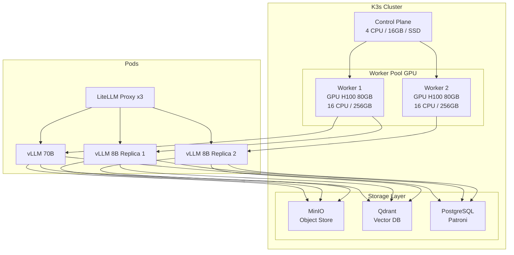
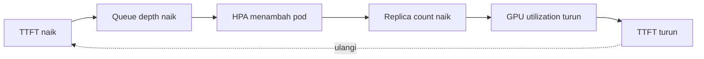
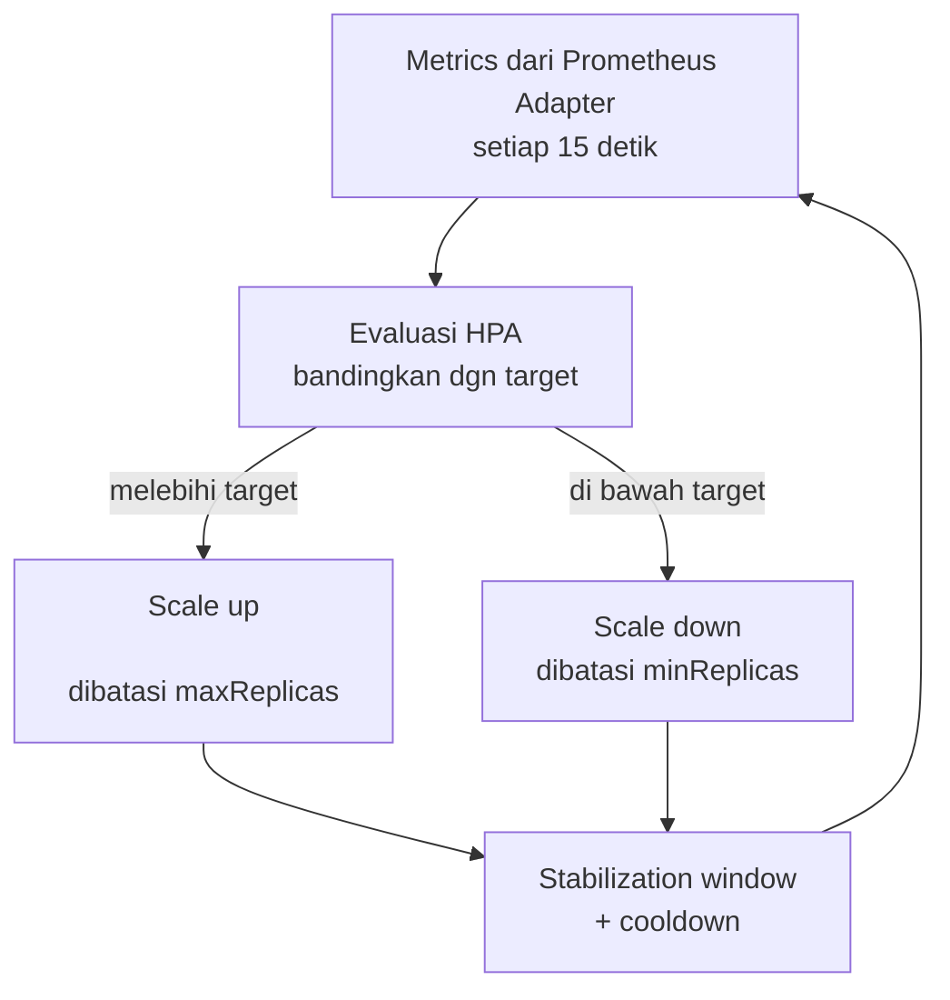

# Bab 8.3: Kubernetes

> Bayangkan sebuah kantor tempat setiap meja karyawan otomatis mendapat AI assistant saat jam sibuk, dan profesi tersebut berhenti bekerja di malam hari tanpa aba-aba — itulah janji *orchestration*: sistem yang menambah dan mengurangi kapasitas sendiri mengikuti denyut beban, tanpa manusia berdiri di depan server. Di bab ini kita masuk ke dapur *orchestrator*: mengapa **K3s** — bukan Kubernetes penuh — menjadi pilihan rasional untuk general office 21-50 user, bagaimana *auto-scaling* berbasis GPU utilization dan *queue depth* bekerja, serta bagaimana GPU dijadwalkan, state disimpan, dan klaster diamankan. Setelah bab ini, *deployment*, *HorizontalPodAutoscaler*, dan NVIDIA GPU Operator bukan lagi istilah asing — melainkan alat sehari-hari.

---

## 1. Tujuan Sub-Bab

Setelah membaca bab ini, Anda akan mampu:

- Menjelaskan mengapa **K3s**, bukan Kubernetes (K8s) penuh, adalah pilihan tepat untuk general office 21-50 user — dari ukuran *binary*, cara kerja, hingga kesiapan produksi di *on-premise*
- Merancang arsitektur klaster K3s untuk LLM: *control plane*, *worker pool* GPU, storage Longhorn/OpenEBS, dan ingress Traefik/NGINX
- Menyusun strategi **auto-scaling** dengan *Horizontal Pod Autoscaler* (HPA) berbasis *custom metrics* vLLM — *GPU utilization*, *queue depth*, TTFT, dan penggunaan memori
- Mengoperasikan **GPU scheduling**: NVIDIA GPU Operator, *nodeSelector* dan *affinity rules*, serta perbedaan *time-slicing* vs MIG
- Men-deploy workload *stateful* — model yang disimpan di persistent volume, Qdrant, dan PostgreSQL Patroni — dengan benar di atas klaster
- Mengamankan klaster dengan *NetworkPolicy*, *mTLS*, dan isolasi antar-*namespace*

---

## 2. Mengapa K3s untuk General Office?

Halaman dokumentasi K3s membuka diri dengan kalimat yang langsung membungkam perdebatan: *"Lightweight Kubernetes — easy to install, half the memory, all in a binary of less than 100 MB"*. Untuk general office, kalimat terakhir itulah yang paling penting. **Binary K3s kurang dari 100 MB**, sementara Kubernetes penuh membutuhkan *binary* sekitar 1 GB dan rangkaian komponen yang jauh lebih rumit: kube-apiserver, etcd, controller-manager, scheduler, kubelet, kube-proxy, plus *add-ons* yang dipasang terpisah. K3s mengemas semuanya — termasuk **etcd built-in** dan **cert-manager terintegrasi** — ke dalam satu biner yang bisa dijalankan dengan satu perintah *curl*. Untuk klaster berukuran 2-5 node di ruang server kantor, inilah *keseimbangan sempurna* antara kekuatan Kubernetes dan kemudahan operasi.

Perbandingannya bukan sekadar soal ukuran toko. K3s memang dibangun untuk *edge* dan *on-premise* kecil: ia menggantikan sebagian komponen default-nya dengan implementasi ringan (misalnya kubelet *tuned* dan Traefik sebagai ingress built-in), sementara *API surface*-nya 100% kompatibel dengan Kubernetes — *manifest* YAML yang Anda tulis untuk K8s penuh berjalan apa adanya di K3s. Yang sering tidak disadari calon pengguna: **cluster upgrade** K3s cukup satu perintah (`k3s upgrade`), sertifikat diperbarui otomatis, dan *backup etcd* didukung langsung ke S3 — tiga pekerjaan yang di K8s penuh biasanya memakan hari kerja DevOps.

Terakhir — dan ini paling relevan bagi skala kita — **dukungan GPU K3s bersifat *mature***: NVIDIA GPU Operator (dibahas di seksi 5) dipasang di atas klaster mana pun secara seragam. Kombinasi *lightweight core* + kompatibilitas penuh + dukungan GPU dewasa membuat K3s menjadi jawaban "orchestrator mana?" untuk 21-50 user; K8s penuh baru masuk akal ketika klaster melampaui belasan node atau perusahaan sudah memiliki tim *platform engineering* khusus — dan Docker Swarm atau Nomad (Tabel 1) hanya menjadi alternatif di kasus-kasus yang sangat spesifik.

---

## 3. Arsitektur K3s Cluster untuk LLM

### Control Plane dan Worker Pool

Arsitektur referensi untuk general office terdiri dari **1 node control plane** — cukup 4 core CPU, 16 GB RAM, SSD — dan **2-3 node worker** yang berpemandangan GPU: masing-masing **16+ core, 256 GB RAM**, dan minimal satu kartu GPU kelas enterprise. Control plane adalah "otak" klaster: ia hanya menjalankan *control loop* (scheduler, API server, controller) dan *tidak boleh* menerima workload inference — taruh GPU di worker, bukan di otak. Karena beban orchestration K3s sangat ringan, control plane dengan spesifikasi di atas bahkan menyisakan ruang untuk *monitoring stack* (Prometheus + Grafana) sebagai *colocation* yang praktis.

Satu keputusan yang membedakan arsitektur general office dari *homelab*: **storage**. Bobot model berukuran 20-300 GB per model (Tabel 2), Qdrant menahan *embeddings* dalam ratusan GB, dan PostgreSQL menyimpan metadata serta audit log — semuanya harus hidup di atas **persistent volume**. Praktik terbaik K3s adalah memasang **Longhorn** (storage *distributed* buatan Rancher — sama-sama rumah K3s) atau **OpenEBS** sebagai *storage class* default. Dengan Longhorn, volume data direplikasi lintas node — sebuah model yang tersimpan di worker 1 tetap bisa dipasang di worker 2 ketika worker 1 mati, persis seperti pilar redundansi Bab 8.1.

### Ingress dan Routing

Lalu lintas dari LiteLLM (*gateway*) menuju pod vLLM bisa diarahkan lewat **Traefik (ingress built-in K3s)** atau **NGINX Ingress Controller** yang dipasang manual. Untuk general office, Traefik bawaan sudah lebih dari cukup: ia menangani TLS, *routing* per-*host*, dan *rate limiting* dasar. NGINX dipilih jika tim sudah terlatih dengannya atau membutuhkan fitur lanjutan (misalnya *canary release* per replica). Yang lebih penting daripada pilihan *ingress* adalah pola *service* di dalam klaster: setiap model inferensi sebaiknya diekspos sebagai *Service* sendiri (misalnya `vllm-70b` di port 8000), dan LiteLLM-lah yang menjadi *single entry point* ke dunia luar — bukan pod vLLM individual. Arsitektur penuh divisualisasikan pada Gambar 1.

---

## 4. Auto-scaling Strategy

Inilah jantung *orchestration* untuk LLM: **kemampuan sistem menyesuaikan jumlah pod secara otomatis**. Empat mekanisme bekerja berdampingan:

**Horizontal Pod Autoscaler (HPA)** — mekanisme utama. HPA memantau metrik *request/limit* pada pod (CPU, memori, atau *custom metrics*) dan menambah/mengurangi jumlah *replica* secara periodik. Untuk LLM, metrik GPU yang diekspos vLLM — **`gpu_cache_usage`**, **`num_requests_running`** atau **`num_requests_waiting`** (kedalaman antrean), dan **`avg_time_per_token`** — adalah sinyal yang jauh lebih akurat daripada CPU: sebuah pod vLLM bisa memiliki CPU rendah tetapi GPU penuh. HPA dengan *custom metrics* membaca sinyal-sinyal ini melalui *custom metrics adapter* (Prometheus Adapter) dan menambah pod ketika antrean mengular — Tabel 3 merangkum ambang batasnya.

**Vertical Pod Autoscaler (VPA)** — pasangan HPA yang bekerja pada sumbu *y*: ia mengoptimalkan *resource request/limit* tiap pod. Untuk beban *inference* yang volumenya fluktuatif, VPA berguna di fase awal untuk menemukan "ukuran sepatu" yang tepat (misalnya 8 core / 32 GB untuk pod DeepSeek V4 Flash), lalu biasanya dipatikan agar tidak berkonflik dengan HPA.

**Cluster Autoscaler** — menambah/mengurangi *node fisik*. Di *on-premise*, kemampuannya terbatas: menambah node berarti membeli server. Karena itu, untuk general office, *Cluster Autoscaler* lebih relevan sebagai konsep cadangan (*capacity buffer* manual) daripada mekanisme harian — perannya dominan di *cloud*, yang menjadi bahan perbandingan di seksi 5 buku ini.

**Custom Metrics** adalah bahan bakar ketiganya. vLLM mengekspos endpoint metrik Prometheus dengan nama seperti `vllm_num_requests_waiting`, `vllm_gpu_cache_usage`, dan `avg_time_per_token`; Prometheus mengumpulkannya, dan *Prometheus Adapter* menerjemahkannya menjadi metrik yang dapat dibaca HPA. Rantai inilah yang membuat auto-scaling LLM menjadi *data-driven* — bukan tebakan operator — dan menjadi dasar tutorial B di seksi 9.

---

## 5. GPU Scheduling

GPU bukan CPU: ia tidak bisa dibagi begitu saja oleh *scheduler* default Kubernetes. Di sinilah **NVIDIA GPU Operator** memainkan peran segitiga: ia men-deploy (1) **device plugin** yang mendaftarkan tiap GPU sebagai sumber daya `nvidia.com/gpu`, (2) **runtime** (nvidia-container-toolkit) yang membuat container melihat GPU, dan (3) **DCGM exporter** untuk metrik pemantauan. Setelah operator terpasang, *scheduler* tahu berapa GPU yang tersedia di tiap node, dan pod yang meminta `nvidia.com/gpu: 1` akan ditempatkan hanya di node yang punya kartu kosong.

Kontrol *penempatan* dilakukan dengan dua alat standar. **NodeSelector** paling sederhana: pod hanya boleh mendarat di node berlabel tertentu (misalnya `accelerator=nvidia-gpu`), cocok untuk memisahkan worker GPU dari control plane. **Affinity rules** lebih ekspresif — misalnya *pod affinity* yang memaksa replica model besar dan model kecil berada di node berbeda untuk mencegah *GPU contention*, atau *anti-affinity* agar dua replica model yang sama tidak pernah menumpuk di satu kartu *dan* satu node. Aturan praktis: gunakan *nodeSelector* untuk isolasi kelas (GPU vs non-GPU), dan *affinity rules* untuk keadilan antar-workload (GPU vs GPU).

Ketika sebuah GPU ingin dibagi oleh banyak workload ringan — misalnya dua pod 8B berbagi satu L40S — dua teknologi muncul sebagai kandidat: **time-slicing** membagi GPU secara *waktu* (tiap pod mendapat giliran memakai seluruh kartu, sederhana tetapi tidak ada isolasi memori dan *latency* bisa saling mengganggu), sedangkan **MIG (Multi-Instance GPU)** membagi GPU secara *fisik* menjadi beberapa *instance* terisolasi dengan memori dan *compute* terpisah — tetapi MIG hanya didukung A100/H100, tidak oleh L40S, dan memerlukan perencanaan partisi yang lebih teliti. Rekomendasi untuk general office: mulai dengan satu pod per GPU (isolasi paling sederhana dan kinerja paling terprediksi), jadikan *time-slicing* sebagai opsi saat kartu mulai langka, dan baru pertimbangkan MIG untuk kasus H100 yang bebannya benar-benar ringan [2].

---

## 6. Persistent Storage StatefulSet

Tidak semua beban LLM bersifat *stateless*. Tiga komponen menuntut penyimpanan persisten, dan masing-masing punya pola *deployment* yang benar:

- **Model storage** — bobot model (20-300 GB per model) sebaiknya disimpan di **MinIO** (objek store) atau **NFS**, lalu dipasang ke pod vLLM sebagai volume baca-saja. Pola ini memungkinkan banyak replica membaca model yang sama tanpa *duplikasi storage*, dan berperan penting pada *failover*: pod baru di node lain langsung mencolok volume yang sama.
- **Vector DB** — **Qdrant** (atau Milvus) sebagai **StatefulSet** dengan *persistent volume claim* (PVC). Qdrant membawa *replication factor* 3 (Bab 8.1), dan *headless service* bernama (`qdrant-0`, `qdrant-1`, dan seterusnya) memastikan setiap *replica* menancap pada volume pribadinya.
- **Database** — **PostgreSQL** dengan **Patroni** (cluster HA) untuk metadata dan audit log; Patroni mengelola *streaming replication*, *failover* otomatis, dan *slot* yang dipasang pada PVC per *replica*.

Mengapa *StatefulSet* dan bukan *Deployment* untuk ketiganya? Karena *Deployment* menganggap semua *replica* identik dan bisa dihapus-tanam kapan saja (pod baru mendapat identitas baru), sedangkan *StatefulSet* memberi setiap *replica* identitas stabil (`qdrant-0`, `postgres-0`) yang melekat pada volume dan alamat *network*-nya — persyaratan mutlak untuk *replication*, *leader election*, dan *streaming*.

---

## 7. Networking & Security

Klaster yang sehat juga klaster yang tertutup. **NetworkPolicy** menjadi alat isolasi pertama: secara default, semua pod di Kubernetes bisa saling berbicara — sesuatu yang tidak kamu inginkan ketika pod analisis dokumen HR berdampingan dengan pod *engineering*. Dengan *NetworkPolicy*, kita menetapkan aturan *allowlist* per-*namespace*: hanya pod `litellm` yang boleh menjangkau `vllm-*`, hanya `vllm-*` yang boleh menjangkau `qdrant` dan `postgres`, dan tidak ada pod *training* yang boleh menyentuh apa pun di luar *namespace*-nya sendiri.

Di atas isolasi, **mTLS** menyandikan komunikasi antar-pod sehingga data yang lewat antar-layanan — termasuk *prompt* yang dikirim dari LiteLLM ke vLLM — tidak bisa disadap di dalam jaringan klaster. Penerapan paling sederhana adalah **Linkerd** atau **Istio** dengan *injection* otomatis: sertifikat dibuat oleh cert-manager (sudah terintegrasi di K3s), diperbarui otomatis, dan *policy* didefinisikan per-*workload*. Untuk general office, Linkerd cukup — *service mesh* Istio lebih berat dan nilainya baru terasa pada klaster berskala besar. Catatan jujur: *service mesh* bersifat **opsional**; jika tim belum siap mengoperasikannya, *NetworkPolicy* + TLS pada *ingress* (haproxy/Traefik) sudah menutup 90% permukaan serangan — dan bisa dilakukan penambahan *mesh* di kemudian hari tanpa *rewrite* aplikasi.

---

## 8. Tabel Wajib

### Tabel 1: Perbandingan Orchestration Options

| Fitur | K3s | K8s Full | Docker Swarm | Nomad |
|:---|:---|:---|:---|:---|
| **Ukuran Binary** | ~100 MB | ~1 GB | ~50 MB | ~200 MB |
| **GPU Support** | Baik (via operator) | Sangat baik | Terbatas | Baik |
| **Auto-scaling** | HPA + custom metrics | HPA/VPA/CA | Manual | Baik (Nomad autoscaler) |
| **Production Ready** | Ya (edge/on-prem) | Ya (cloud/DC) | Terbatas | Ya |
| **Kemudahan Setup** | Sangat mudah | Kompleks | Sangat mudah | Sedang |
| **Best For** | On-prem, edge, small-medium | Cloud, large-scale | Simple deploy | Multi-workload |

Tabel ini menjawab pertanyaan "mengapa bukan yang lain?" dalam satu pandang. **Docker Swarm** menang di kemudahan tetapi kalah telak di *auto-scaling* (manual) dan dukungan GPU (terbatas) — untuk general office yang menjadikan HPA sebagai jantung kapasitas, Swarm gugur lebih dulu. **Nomad** menarik untuk *multi-workload* (mencampur batch job dan layanan), tetapi HPA Kubernetes jauh lebih dikenal, dan ekosistem *LLM serving* (vLLM, GPU Operator, Prometheus Adapter) tumbuh paling pesat di atas Kubernetes. **K8s Full** menang di *cloud* dan *large-scale* — justru wilayah yang bukan medan general office. Posisi K3s paling kuat pada titik temu "kuat seperti K8s, sederhana seperti Swarm" — dan faktor *binary* 100 MB vs 1 GB tidak hanya soal ruang disk, melainkan soal *surface area* yang harus diamankan dan di-update tim IT kantor yang kecil.

### Tabel 2: Resource Allocation per Pod

| Workload | CPU Request | RAM Request | GPU | Storage | Replicas |
|:---|:---:|:---:|:---:|:---:|:---:|
| **vLLM DeepSeek V4 Flash Q4** | 8 core | 32 GB | 1x H100 80GB | 50 GB | 1-2 |
| **vLLM Mistral Large 3 Q4** | 12 core | 48 GB | 2x H100 80GB | 80 GB | 1-2 |
| **vLLM Llama 8B FP16** | 4 core | 16 GB | 1x L40S 48GB | 20 GB | 2-4 |
| **vLLM Ministral 3 14B Q4** | 4 core | 16 GB | 1x L40S 48GB | 20 GB | 2-4 |
| **LiteLLM Proxy** | 2 core | 4 GB | None | 10 GB | 2-3 |
| **Qdrant Vector DB** | 4 core | 16 GB | None | 100 GB | 2-3 |
| **PostgreSQL Patroni** | 4 core | 16 GB | None | 200 GB | 2-3 |
| **MinIO Object Store** | 2 core | 8 GB | None | 500 GB | 2-3 |

Tiga bacaan penting dari tabel alokasi ini. Pertama, **GPU bukan satu-satunya sumber daya yang harus di-*request***: pod Mistral Large 3 meminta 12 core dan 48 GB RAM karena *prefill*, tokenizer, dan scheduler vLLM hidup di CPU/RAM — meminta GPU saja akan membuat pod *pending* karena kelaparan CPU. Kedua, perhatikan **pola *replicas***: workload besar (DeepSeek V4 Flash, Mistral Large 3) justru berreplica rendah (1-2) karena setiap replica menelan satu GPU H100 — *scaling* dilakukan lewat model kecil yang murah (Llama 8B, Ministral 3 14B: 2-4 replica) yang menyerap lonjakan trafik harian. Ketiga, **komponen non-GPU (LiteLLM, Qdrant, PostgreSQL, MinIO) berreplica 2-3** untuk memenuhi tuntutan redundansi Tabel 3 Bab 8.1 — semuanya *stateless-proxies* atau *stateful dengan replikasi*, dan semuanya menuntut disiplin: setiap *request limit* yang terlalu kecil adalah undangan *throttling* di jam puncak [4].

### Tabel 3: HPA Auto-scaling Rules

| Metric | Target | Scale Up | Scale Down | Cool Down |
|:---|:---:|:---:|:---:|:---:|
| **GPU Utilization** | > 80% | +1 pod | < 40% (5 menit) | 3 menit |
| **Queue Depth (vLLM)** | > 10 requests | +1 pod | < 3 (5 menit) | 3 menit |
| **Avg TTFT** | > 2 detik | +1 pod | < 1 detik (5 menit) | 5 menit |
| **Memory Usage** | > 85% | +1 pod | < 60% (10 menit) | 5 menit |

Tabel HPA ini adalah *konstitusi* kapasitas klaster — dan asimetrisnya angka *scale up* vs *scale down* adalah kebijakan tersirat: **naik cepat, turun lambat**. *Scale up* hanya butuh jendela singkat (+1 pod, *cool down* 3 menit) agar lonjakan 25 user di jam rapat tidak menciptakan antrean; *scale down* mensyaratkan metrik bertahan rendah selama 5-10 menit dan *cool down* lebih panjang (5 menit), mencegah *flapping* — pod naik-turun seperti yoyo ketika beban berosilasi. Perhatikan sinyal per metrik: *Queue Depth* menangkap *backlog* secara langsung (lebih dari 10 *request* menunggu = tambah pod), *GPU Utilization* menangkap *kejenuhan* (di atas 80%), TTFT menangkap *persepsi pengguna*, dan *Memory* menjaga *KV cache* tidak mendekati *throttling* [1][3]. Dalam praktik, gunakan minimal dua metrik bersamaan (misalnya *Queue Depth* + *Memory Usage*) — otak HPA akan mempertimbangkan rata-rata keduanya, dan hasilnya lebih stabil daripada satu metrik tunggal.

---

## 9. Diagram & Visualisasi

### Gambar 1: Arsitektur K3s Cluster untuk LLM



Diagram ini merangkum seluruh bab dalam satu gambar. **Control plane** mengatur dua **worker GPU**; pada worker 1 hidup pod vLLM 70B (tugas berat) dan *replica 1* vLLM 8B, pada worker 2 hunian *replica 2* vLLM 8B — pola *anti-affinity* yang memastikan replica model cepat tidak pernah menumpuk di satu node. Ketiga lapisan storage menampung semua pod; perhatikan bahwa LiteLLM (kotak *Pods*) tidak memegang panah ke storage — ia murni *router*, dan *bottle neck* jaringan justru harus dijaga di sini: setiap *request* yang lewat LiteLLM harus tiba di vLLM dalam hitungan milidetik, jadi *pod* LiteLLM sebaiknya di-*co-locate* pada node yang sama dengan *halaman* vLLM-nya (topologi ini tidak digambar untuk menjaga diagram tetap sederhana, tetapi diingat saat *scheduling*).

### Gambar 2: Dashboard Grafana Auto-scaling Metrics

Dashboard menampilkan empat panel yang menjadi *cockpit* operator: **GPU utilization** (kapan kartu mulai jenuh), **queue depth** (berapa *request* mengantre), **pod replica count** (aksi HPA yang sedang berlangsung), dan **TTFT** (persepsi pengguna). Kunci membaca dashboard ini adalah *kausalitas*: TTFT naik → beberapa menit kemudian queue depth naik → HPA menambah pod → replica count naik → GPU utilization turun → TTFT turun. Urutan itu adalah siklus auto-scaling yang sehat; jika urutannya patah (misalnya queue naik tetapi replica tidak), operator tahu masalahnya ada di *metric pipeline* — bukan di model. Alur kausalitasnya:



### Gambar 3: Diagram Siklus Auto-scaling (Flowchart)

Flowchart berikut menggambarkan perulangan kontrol HPA: **metrics → evaluasi HPA → scale up/down → cooldown → kembali ke metrics**. Setiap 15 detik, HPA menarik metrik dari Prometheus Adapter; jika nilai rata-rata melampaui target, jumlah replica dihitung ulang (dibatasi `minReplicas`-`maxReplicas`); setelah perubahan, *stabilization window* dan *cooldown* mencegah perintah berikutnya datang terlalu cepat. Siklus inilah yang membuat klaster "bernafas" mengikuti beban — dan memahami urutannya adalah prasyarat untuk *debugging* auto-scaling yang gagal (biasanya kesalahan ada di satu dari empat titik: metrik tidak muncul, adapter tidak menerjemahkan, target salah, atau *policy* membatasi).



---

## 10. Praktikum / Hands-On

### Langkah 1: Deploy K3s Cluster dengan GPU Support

Rangkaian perintah berikut membangun klaster dari nol: control plane, dua worker, lalu *GPU operator*.

```bash
# Control Plane
curl -sfL https://get.k3s.io | sh -s - \
  --write-kubeconfig-mode 644 \
  --disable traefik \
  --etcd-s3 \
  --etcd-s3-bucket k3s-backup \
  --etcd-s3-region us-east-1

# Worker Nodes
curl -sfL https://get.k3s.io | K3S_URL=https://<CP_IP>:6443 \
  K3S_TOKEN=<token> sh -

# Install NVIDIA GPU Operator via Helm
helm repo add nvidia https://helm.ngc.nvidia.com/nvidia
helm repo update
helm install gpu-operator nvidia/gpu-operator \
  --namespace nvidia-gpu-operator \
  --create-namespace \
  --set driver.enabled=false

# Verifikasi GPU terdeteksi
kubectl get nodes -o json | jq '.items[].status.capacity'
kubectl logs -n nvidia-gpu-operator -l app=nvidia-operator-validator
```

Dua detail penting. `--disable traefik` mematikan ingress bawaan agar bisa memasang NGINX sendiri bila diperlukan. `--etcd-s3` menyalin *backup etcd* ke bucket S3 — untuk kantor, ini berarti riwayat konfigurasi klaster aman meskipun server mati total; ganti region dan bucket dengan milik Anda. Pada worker, token didapat dari `/var/lib/rancher/k3s/server/node-token` di control plane. Setelah *GPU Operator* terpasang, `kubectl get nodes -o json | jq '.items[].status.capacity'` harus menunjukkan `nvidia.com/gpu: 1` (atau sesuai jumlah kartu) pada tiap worker — dan baris `kubectl logs -l app=nvidia-operator-validator` berakhir dengan `Successfully ran all validations` adalah *sertifikat kelulusan* klaster.

### Langkah 2: HPA Berbasis Custom Metrics (vLLM Queue Depth)

Setelah klaster berbunyi GPU, pasang *konstitusi kapasitas*: HPA yang menambah pod ketika *queue depth* atau *KV cache* mendekati batas.

```yaml
# vllm-hpa.yaml
apiVersion: autoscaling/v2
kind: HorizontalPodAutoscaler
metadata:
  name: vllm-70b-hpa
  namespace: llm-inference
spec:
  scaleTargetRef:
    apiVersion: apps/v1
    kind: Deployment
    name: vllm-70b
  minReplicas: 1
  maxReplicas: 4
  metrics:
    - type: Pods
      pods:
        metric:
          name: vllm_num_requests_waiting
        target:
          type: AverageValue
          averageValue: 10
    - type: Pods
      pods:
        metric:
          name: vllm_gpu_cache_usage
        target:
          type: AverageValue
          averageValue: 0.85
  behavior:
    scaleUp:
      stabilizationWindowSeconds: 60
      policies:
      - type: Pods
        value: 1
        periodSeconds: 60
    scaleDown:
      stabilizationWindowSeconds: 300
      policies:
      - type: Pods
        value: 1
        periodSeconds: 120
```

Manifest ini menerjemahkan dua baris pertama Tabel 3 ke dalam YAML. Metrik `vllm_num_requests_waiting` (rata-rata > 10 *request* menunggu) dan `vllm_gpu_cache_usage` (rata-rata > 0,85 = 85% *KV cache* terpakai) dibaca dari Prometheus Adapter yang sudah mengumpulkan ekspor vLLM di node tersebut. Blok `behavior` adalah mesin "naik cepat, turun lambat": *scale up* distabilkan 60 detik, *scale down* 300 detik — korespondensi 1:1 dengan kolom *Cool Down* Tabel 3. Prasyarat penting: ekspor metrik vLLM (`--metrics-port`, default 8000 `/metrics`) harus dikonfigurasi di *service monitor* Prometheus, dan *Prometheus Adapter* harus punya *rule* yang memetakan `vllm_num_requests_waiting` dari series Prometheus ke metrik HPA.

### Langkah 3: Deploy vLLM StatefulSet dengan Persistent Volume

Langkah terakhir menyatukan semuanya: pod vLLM yang *stateful*, membaca model dari *persistent volume* yang dipasang dari storage bersama.

```yaml
# vllm-statefulset.yaml
apiVersion: apps/v1
kind: StatefulSet
metadata:
  name: vllm-8b
  namespace: llm-inference
spec:
  serviceName: vllm-8b
  replicas: 2
  selector:
    matchLabels:
      app: vllm-8b
  template:
    metadata:
      labels:
        app: vllm-8b
    spec:
      nodeSelector:
        accelerator: nvidia-gpu
      containers:
      - name: vllm
        image: vllm/vllm-openai:latest
        env:
        - name: MODEL_NAME
          value: "deepseek-ai/DeepSeek-V4-Flash"
        - name: MODEL_PATH
          value: "/models/deepseek-v4-flash"
        args:
        - "--model"
        - "$(MODEL_PATH)"
        - "--max-num-seqs"
        - "256"
        - "--max-model-len"
        - "8192"  # 1M context but limited for multi-tenant
        resources:
          limits:
            nvidia.com/gpu: 1
            memory: 32Gi
            cpu: 8
        ports:
        - containerPort: 8000
        volumeMounts:
        - mountPath: /models
          name: model-storage
      volumes:
      - name: model-storage
        persistentVolumeClaim:
          claimName: model-pvc
```

Dua replica `vllm-8b` (keduanya meminta satu GPU) adalah wujud HPA dari Langkah 2: `maxReplicas: 4` pada skenario tersebut berarti HPA bisa menaikkan *replica* StatefulSet ini dari 2 menjadi 4 saat antrean memuncak. Perhatikan `nodeSelector: accelerator: nvidia-gpu` — hanya worker GPU yang menerima pod; sedangkan `--max-num-seqs 256` membatasi *batch* agar *KV cache* tidak meledak di *multi-tenant* (batas 8.192 token per *request* sengaja ditetapkan untuk penyewaan bersama — konteks penuh 1 juta token khusus untuk RAG satu user). Proses *failover*-nya elegan: salah satu worker mati, K3s men-*reschedule* pod ke worker sehat, dan *persistent volume* (melalui Longhorn) ikut berpindah — manual: cek dengan `kubectl describe statefulset vllm-8b` bahwa volume *Bound* dan pod *Running* di node berbeda.

---

## 11. Studi Kasus: Deploy K3s General Office 35 User di PT Maju Teknologi

**Profil.** PT Maju Teknologi adalah perusahaan software dengan **35 karyawan** yang tersebar di tiga tim. Permintaan manajemen tegas: semua data — termasuk kode internal dan dokumen klien — **tidak boleh keluar perimeter perusahaan** karena klausul kerahasiaan di kontrak klien. Solusi SaaS cloud gugur sejak awal; jawabannya adalah *on-premise* dengan *orchestration* yang matang.

**Cluster.** Tim platform (dua orang) membangun **3 node K3s**: 1 control plane + 2 worker GPU — satu worker berisi **H100 80GB**, satu lagi **L40S 48GB** (pola *tiered* dari Bab 8.2). Storage memakai Longhorn dengan replikasi 2x antar-worker; ingress Traefik; observability Prometheus + Grafana + Loki; dan **HPA berbasis GPU utilization + queue depth** yang membawa *replica* vLLM dari 1 ke 3 saat jam puncak 08:00-11:00 dan 13:00-16:00 — persis pola beban Bab 8.1.

**Workload.** Empat keluarga pod berjalan berdampingan: **vLLM DeepSeek V4 Flash Q4** (1 juta token konteks) melayani RAG dokumen panjang klien; **vLLM Mistral Large 3 Q4** (Apache 2.0) untuk analisis dan penyusunan dokumen; **Ministral 3 14B** untuk *chat* cepat sehari-hari; plus LiteLLM, Qdrant, PostgreSQL Patroni, dan MinIO sesuai Tabel 2. *Routing* di LiteLLM: query pendek → Ministral 3, dokumen panjang → DeepSeek V4 Flash, analisis berat → Mistral Large 3 — setiap rupiah komputasi terpakai pada kartu yang tepat.

**Hasil.** Catatan produksi tiga bulan: **0% *downtime* orchestration** — seluruh *restart* dan *upgrade* dilakukan sebagai *rolling update* tanpa satu pun *request* gagal; **CPU overhead K3s di bawah 5%** — kontrol plane yang ramping tidak "memakan" kapasitas yang seharusnya untuk inference; dan **auto-scaling merespons dalam waktu di bawah 2 menit** dari lonjakan beban hingga pod baru melayani trafik. **Biaya operasional Rp 5-7 juta per bulan** (listrik + storage + *maintenance*) — angka yang jauh di bawah gaji satu DevOps tambahan, dan itulah argumen ekonomi *orchestration* yang paling jujur: K3s menggantikan jam kerja manusia dengan otomatisasi yang terukur [1][4].

**Pelajaran.** Tiga dari studi kasus ini layak dibawa pulang. Pertama, *pipeline metrik* adalah tulang punggung auto-scaling: PT Maju Teknologi menghabiskan satu minggu menyelaraskan *service monitor*, *Prometheus Adapter*, dan *rule* HPA sebelum percaya pada otomatisasi — dan investasi itu terbayar ketika *scale-out* bekerja tanpa intervensi di jam puncak. Kedua, *anti-affinity* antar *replica* model cepat mencegah dua pod *identical* berebut satu kartu — masalah yang biasanya baru muncul di bulan kedua produksi. Ketiga, jangan menaruh semua telur di satu *storage class*: model berat di MinIO, embeddings di Qdrant, metadata di Patroni — *blast radius* kegagalan terpotong tiga, dan *recovery* satu sistem tidak pernah mengganggu dua lainnya.

---

## 12. Referensi

### Paper Jurnal/Konferensi

[1] Chen, G., et al. (2025). *KIS-S: A GPU-Aware Kubernetes Inference Simulator with RL-Based Auto-Scaling*. arXiv: [2507.07932](https://arxiv.org/abs/2507.07932), DOI: [10.48550/arXiv.2507.07932](https://doi.org/10.48550/arXiv.2507.07932) — dasar *auto-scaling* GPU inference dengan *reinforcement learning* di Kubernetes; rujukan verifikasi aturan HPA pada Tabel 3.

[2] Li, X., et al. (2025). *Kant: An Efficient Unified Scheduling Platform for Large-Scale AI Container Clusters*. arXiv: [2510.01256](https://arxiv.org/abs/2510.01256), DOI: [10.48550/arXiv.2510.01256](https://doi.org/10.48550/arXiv.2510.01256) — *co-scheduling* job training + inference, manajemen *GPU quota*, dan *fair scheduling*; relevan untuk optimalisasi *GPU scheduling* seksi 5.

[3] Wang, L., et al. (2025). *HeteroScale: Coordinated Autoscaling for Heterogeneous and Disaggregated LLM Inference*. arXiv: [2508.19559](https://arxiv.org/abs/2508.19559), DOI: [10.48550/arXiv.2508.19559](https://doi.org/10.48550/arXiv.2508.19559) — *auto-scaling* arsitektur *prefill-decode disaggregated*; rujukan kebijakan *scale up/down* Tabel 3.

[4] Weber, S., et al. (2025). *Automated Dynamic AI Inference Scaling on HPC-Infrastructure: Integrating Kubernetes, Slurm and vLLM*. arXiv: [2511.21413](https://arxiv.org/abs/2511.21413), DOI: [10.48550/arXiv.2511.21413](https://doi.org/10.48550/arXiv.2511.21413) — *auto-scaling* berbasis metrik vLLM (GPU load dan *queue time*); rujukan verifikasi alokasi resource Tabel 2.

[5] Ho, L., et al. (2025). *Design of a GPU Dynamic LLM Inference Task Scheduling Architecture Based on KubeAI*. arXiv (preprint). [https://github.com/leoho0722/llm-gpu-scheduler](https://github.com/leoho0722/llm-gpu-scheduler) — *scheduler* GPU-aware untuk LLM di Kubernetes yang mengatasi limitasi *default scheduler*; relevan untuk seksi 5.

### Referensi Pendukung (Dokumentasi/Repository)

[6] K3s. *Official Documentation*. [https://docs.k3s.io](https://docs.k3s.io)

[7] NVIDIA. *GPU Operator Helm Chart Documentation*. [https://docs.nvidia.com/datacenter/cloud-native/gpu-operator/](https://docs.nvidia.com/datacenter/cloud-native/gpu-operator/)

[8] vLLM. *Kubernetes Deployment Guide*. [https://docs.vllm.ai/en/latest/deployment/kubernetes.html](https://docs.vllm.ai/en/latest/deployment/kubernetes.html)

[9] Kubernetes SIGs. *Prometheus Adapter for Custom Metrics*. [https://github.com/kubernetes-sigs/prometheus-adapter](https://github.com/kubernetes-sigs/prometheus-adapter)

[10] DeepSeek Team. (2026). *DeepSeek-V4 Flash: Deployment Guide for Kubernetes Clusters*. [https://api-docs.deepseek.com](https://api-docs.deepseek.com) — panduan deployment MoE konteks 1 juta token yang optimal untuk *auto-scaling*.

[11] Mistral AI. (2025). *Mistral Large 3: Apache 2.0 Licensed MoE for On-Premise Deployment*. [https://mistral.ai/news/mistral-large-3](https://mistral.ai/news/mistral-large-3) — model 675B/41B aktif yang aman lisensinya untuk deployment K3s *on-premise*.