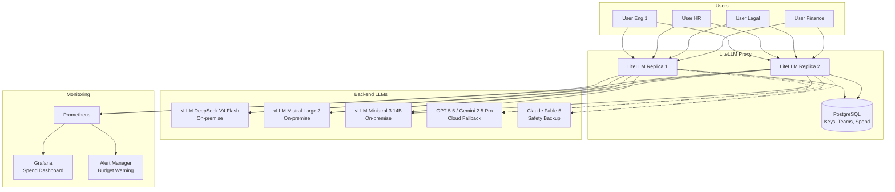
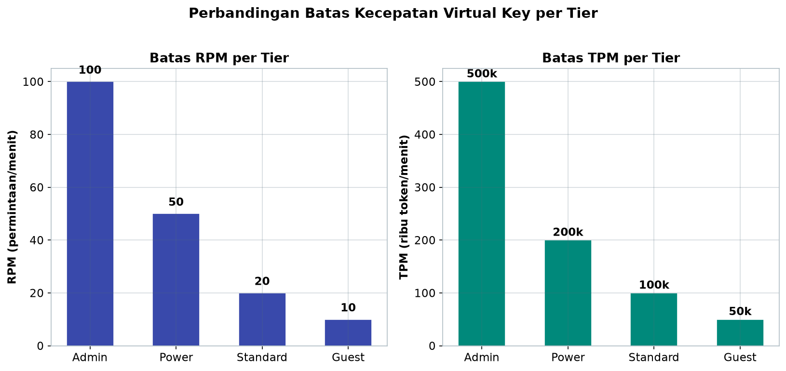
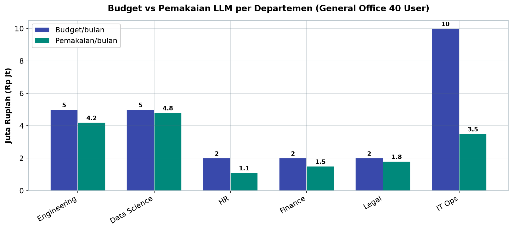
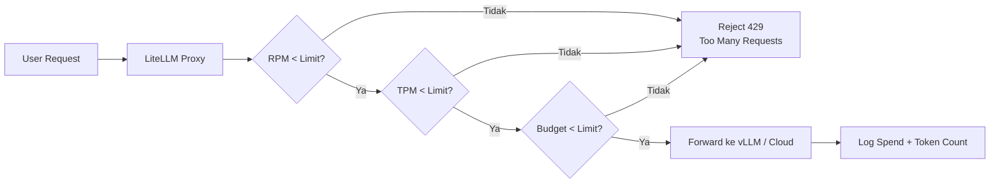

# Bab 8.4: Enterprise Gateway

> Bayangkan sebuah gedung kantor dengan 45 karyawan, tetapi setiap orang memegang kunci langsung ke gudang kas — tanpa catatan siapa mengambil berapa, kapan, dan untuk apa. Itulah kantor yang membiarkan setiap karyawan mengakses model bahasa besar (LLM) secara langsung. Di sinilah *AI Gateway* hadir: sebuah gerbang tunggal yang mengatur siapa boleh masuk, berapa banyak yang boleh diambil, dan memastikan setiap pengambilan tercatat rapi untuk laporan keuangan.

---

## 1. Tujuan Sub-Bab


Setelah membaca sub-bab ini, Anda akan mampu:

- Menjelaskan fungsi LiteLLM sebagai *AI Gateway* untuk lingkungan general office dengan 21-50 pengguna
- Menyiapkan *virtual keys*, *rate limiting*, dan *budget tracking* per departemen agar biaya LLM tidak membengkak
- Menerapkan *tier* akses (admin, power, standard, guest) dengan *Role-Based Access Control (RBAC)* yang jelas
- Mengintegrasikan gateway dengan SSO, *logging*, dan *alerting* untuk pengawasan berkelanjutan
- Membaca dan menganalisis laporan *spend* bulanan untuk perencanaan anggaran departemen
- Merancang arsitektur *high availability* dengan *failover* otomatis antar backend LLM

---

## 2. Konsep AI Gateway: Mengapa 21-50 User Butuh Gerbang?


### Masalah Akses Langsung

Ketika sebuah kantor dengan 21-50 karyawan membiarkan setiap orang mengakses LLM *cloud* secara langsung — membuka ChatGPT Enterprise, mengetik pertanyaan ke API OpenAI, atau menjalankan model di laptop masing-masing — tiga masalah klasik muncul secara bersamaan. Pertama, **biaya membengkak tanpa kontrol**: tidak ada yang tahu berapa token yang dikonsumsi HR dibanding Engineering, siapa yang paling boros, dan apakah pemakaian itu memang dibutuhkan untuk pekerjaan. Kedua, **tidak ada pembatas kecepatan**: satu karyawan yang menjalankan *script* batch bisa menghabiskan kuota harian seluruh tim dalam hitungan menit. Ketiga, **tidak ada jejak audit**: ketika terjadi insiden data, manajemen tidak memiliki catatan siapa mengirim prompt apa ke model mana — persoalan yang langsung bertabrakan dengan tuntutan *compliance* UU PDP dan ISO 27001.

Masalah ini semakin tajam di skala 21-50 user. Di bawah 20 user, akses langsung masih bisa "diingat-ingat" oleh admin; di atas 50 user, organisasi biasanya sudah punya tim infra yang mapan. General office berada di titik tengah yang janggal: terlalu besar untuk diabaikan, terlalu kecil untuk memiliki tim keamanan yang besar. Solusinya bukan melarang pemakaian AI — melainkan memasang sebuah *gerbang* yang menertibkannya.

### Solusi: LiteLLM sebagai Proxy

**LiteLLM** adalah *open-source AI gateway* yang duduk tepat di antara pengguna dan LLM *backend*, baik yang dijalankan *on-premise* (vLLM dengan DeepSeek V4 Flash, Mistral Large 3) maupun yang *cloud* (GPT-5.5, Gemini 2.5 Pro, Claude Fable 5). Semua permintaan dari aplikasi karyawan — chatbot internal, *IDE plugin*, skrip analisis — tidak lagi langsung menuju model, melainkan melewati proxy ini. LiteLLM menerjemahkan format permintaan dari lebih dari 100 penyedia LLM ke satu antarmuka yang seragam, sehingga aplikasi internal cukup berbicara ke satu URL gateway tanpa peduli model mana yang menangani di belakang layar.

Analogi paling pas adalah **meja resepsionis sebuah gedung**: semua tamu (permintaan) masuk lewat satu pintu, diverifikasi identitasnya (virtual key), diarahkan ke ruangan yang tepat (routing model), dicatat kunjungannya (audit log), dan ditolak ramah bila sudah melewati kapasitas ruangan (rate limit) atau anggaran kunjungan (budget). Gedung tetap nyaman, pengelola tahu persis apa yang terjadi di setiap lantai.

### Fitur Kunci yang Disediakan

Fitur kunci LiteLLM yang langsung berguna bagi general office adalah:

- **Virtual keys** — setiap departemen/user mendapat kunci sendiri dengan hak akses dan *budget* terpisah
- **Budget management** — batas keras (*hard limit*) dan peringatan lembut (*soft limit*) per kunci, tim, dan model
- **Rate limiting** — pembatas *Request Per Minute (RPM)* dan *Token Per Minute (TPM)* per kunci
- **Load balancing** — distribusi permintaan antar *backend* dengan *round-robin* atau *least-connections*
- **Audit logging** — pencatatan setiap permintaan ke PostgreSQL untuk kebutuhan pelaporan dan *compliance*

### Tabel 2: Perbandingan AI Gateway

Sebelum memilih LiteLLM, ada baiknya membandingkan dengan alternatif pasar — tabel berikut merangkum keempat opsi utama.

| Fitur | LiteLLM (OSS) | Kong AI Gateway | Azure API Management | AWS Bedrock |
|:---|:---|:---|:---|:---|
| **Virtual Keys** | Ya | Enterprise | Ya | Ya |
| **Budget Tracking** | Ya (built-in) | Custom | Azure Cost Mgmt | AWS Budgets |
| **Rate Limiting** | Ya | Ya | Ya | Ya |
| **Multi-Provider** | 100+ LLMs | Terbatas | Azure only | AWS only |
| **Self-hosted** | Ya | Ya | Tidak | Tidak |
| **Audit Logs** | Enterprise | Enterprise | Ya | CloudTrail |
| **Biaya Lisensi** | Gratis (OSS) | $5k+/tahun | Pay-as-you-go | Pay-as-you-go |

Pola yang terbaca jelas: LiteLLM unggul di **multi-provider** (100+ LLM) dan lisensi **gratis**, sementara Azure dan AWS mengikat pengguna ke ekosistem *cloud* masing-masing. Kekurangan LiteLLM ada di *audit log* kelas enterprise yang butuh lisensi tambahan — bagi kantor yang belum diwajibkan *audit* penuh, fitur gratisnya sudah memadai. Keputusan akhir biasanya jatuh pada satu pertanyaan: apakah kantor sudah terkunci di satu *cloud vendor* dan membutuhkan fitur *managed*, atau ingin kebebasan berganti model kapan saja dengan biaya lisensi nol? Bagi general office 21-50 user dengan model on-premise, jawabannya hampir selalu LiteLLM.


---

## 3. Arsitektur LiteLLM Proxy di Lingkungan Kantor


### Deployment sebagai Service di K3s

Dalam arsitektur general office, LiteLLM dijalankan sebagai *service* di klaster Kubernetes ringan (**K3s**) dengan **2-3 replica** untuk menjamin *high availability*. Jika satu `pod` mati — entah karena *deploy* baru atau kegagalan perangkat keras — *replica* lain langsung melayani permintaan tanpa ada karyawan yang menyadari gangguan. K3s dipilih karena jauh lebih ringan daripada Kubernetes penuh: ia bisa berjalan di dua hingga tiga server biasa atau bahkan satu *workstation* kelas server, cukup untuk kebutuhan 21-50 user yang biasanya menghasilkan ribuan permintaan per hari, bukan jutaan.

Pola *deployment* ini mencerminkan prinsip **redundansi** yang sudah dibahas di Bab 8.1: tidak ada *single point of failure*. *Gateway* menjadi titik kritis — jika ia mati, seluruh kantor kehilangan akses AI sekaligus. Karena itu *replica* berjumlah ganjil (3) dan dipisah ke *node* berbeda, dilengkapi *readiness probe* yang otomatis mengeluarkan *instance* yang tidak sehat dari rotasi trafik.

### Backend LLM: On-Premise, Cloud, dan Cadangan

Di belakang *gateway* terdapat tiga kategori *backend* LLM yang saling melengkapi:

1. **On-premise via vLLM** — DeepSeek V4 Flash dan Mistral Large 3 dijalankan di GPU kantor sendiri. Ini jalur utama untuk beban kerja harian karena biayanya hanya listrik dan perawatan, bukan *pay-per-token*.
2. **Cloud (fallback)** — GPT-5.5 dan Gemini 2.5 Pro diakses melalui API ketika GPU lokal penuh atau untuk tugas *reasoning* tingkat tinggi yang membutuhkan model proprietary dengan konteks 1 juta token.
3. **Cadangan keamanan** — Claude Fable 5 diposisikan sebagai *safety backup*: model dengan *safety classifiers* bawaan yang dipakai khusus untuk konten sensitif, karena ia menghasilkan *audit* terstruktur per interaksi.

Pengaturan ini adalah pola *hybrid* yang mengoptimalkan biaya tanpa mengorbankan kesiapan. Trafik murah dan rutin ditangani GPU sendiri; trafik langka tapi berat dilimpahkan ke *cloud*; konten paling sensitif diproses oleh model dengan kelas keamanan tertinggi.

### Database: PostgreSQL sebagai Sumber Kebenaran

**PostgreSQL** adalah database yang menyimpan metadata penting: kunci (*keys*), pengguna dan tim (*teams*), serta catatan pengeluaran (*spend logs*). Setiap kali sebuah *virtual key* mengirim permintaan, LiteLLM mencatat jumlah token, model yang dipakai, dan biaya yang timbul ke dalam tabel *spend*. Database inilah yang menjadi *single source of truth* untuk laporan bulanan, penyelidikan insiden, dan perhitungan biaya per departemen di Bab 8.6. Ukurannya relatif kecil untuk skala kantor — tidak perlu *database* khusus kelas enterprise — tetapi tetap harus dicadangkan secara rutin karena nilainya sangat tinggi saat *audit*.

### Diagram 1: Arsitektur LiteLLM Gateway

Berikut arsitektur lengkap *gateway* — perhatikan jalur utama (garis tebal) dan jalur *fallback* (garis putus-putus).



Diagram ini menunjukkan tiga hal penting. Pertama, semua pengguna bertemu di dua *replica* LiteLLM — tidak ada jalur langsung ke model mana pun, sehingga pemeriksaan *key*, *budget*, dan *rate limit* tidak mungkin terlewat. Kedua, vLLM on-premise menjadi jalur utama sementara *cloud* (OpenAI/Anthropic) hanya jalur putus-putus *fallback* — kontras yang menegaskan strategi biaya: bayar rupiah ke GPU sendiri dulu, *cloud* hanya saat darurat. Ketiga, *monitoring* Prometheus mengarah ke Grafana untuk *dashboard spend* dan Alert Manager untuk peringatan budget — menutup siklus pengawasan dari permintaan hingga laporan.


---

## 4. Manajemen Virtual Keys & RBAC


### Satu Kunci per Departemen

Prinsip pertama pengendalian biaya di LiteLLM adalah **setiap departemen mendapat *virtual key* sendiri dengan budget terpisah**. Kunci Engineering tidak sama dengan kunci HR; kunci HR tidak bisa menghabiskan anggaran Legal. Setiap kunci mengikat identitas pengguna (melalui metadata seperti `department: engineering`), sehingga setiap rupiah yang terpakai dapat ditelusuri kembali ke pemegang kuncinya.

Pemisahan ini bukan hanya soal biaya — ia juga menciptakan *accountability*. Ketika laporan bulanan menunjukkan Finance menghabiskan budget dua kali lipat HR, manajemen bisa langsung berbicara dengan kepala Finance dengan angka konkret, bukan perasaan. Di sinilah *virtual keys* berbeda dari sekadar membagikan satu kunci API bersama: kunci bersama adalah "uang kas di meja," sedangkan kunci per departemen adalah "buku kas per unit."

### Empat Tier Akses

Akses dibagi menjadi empat *tier* dengan jenjang kuota dan hak model:

- **Admin** (IT, DevOps) — akses semua model termasuk model besar 70B dan Whisper untuk *speech-to-text*, budget tertinggi.
- **Power** (Engineering, Data) — akses model 70B + 8B untuk *coding* dan analisis data berat.
- **Standard** (HR, Finance, Legal) — hanya model 8B, cukup untuk *summarization*, tanya jawab dokumen, dan penulisan.
- **Guest** (Intern, Trainee) — hanya model 8B tanpa RAG, budget paling kecil, untuk orientasi dan tugas-tugas ringan.

Logika di balik *tier* ini adalah **menuangkan kebutuhan kerja ke dalam kuota** (pemetaan rinci lihat Tabel 1 di Seksi 4). Karyawan yang pekerjaannya menuntut model besar dibayar mahal oleh perusahaan — mereka mendapat kuota besar. Karyawan yang hanya butuh bantuan menulis surat tidak perlu menyentuh model 70B yang biayanya jauh lebih tinggi. Hasilnya: budget terpakai tepat sasaran, bukan menguap tanpa arah.

### RBAC: Tiga Peran Pengelola

RBAC di LiteLLM berjalan dalam tiga lapisan peran: **Proxy Admin** — pengelola infrastruktur yang membuat kunci, mengatur model, dan membaca semua laporan; **Internal User** — operator aplikasi internal yang memakai kunci untuk kebutuhan departemennya; dan **End User** — karyawan akhir yang tidak pernah melihat kunci sama sekali, cukup memakai aplikasi yang sudah terhubung. Batas ini penting: hanya *Proxy Admin* yang dapat mengubah budget atau melihat laporan lintas departemen, mencegah seorang *power user* menaikkan kuotanya sendiri secara diam-diam.

Setiap lapisan peran ini juga dapat dipautkan ke **SSO** (misalnya Google Workspace atau Microsoft Entra ID) sehingga identitas karyawan yang sudah ada di direktori kantor langsung dipakai untuk otentikasi. Karyawan yang keluar otomatis kehilangan akses saat akunnya dinonaktifkan di direktori — tidak ada lagi "kunci API yang masih hidup setelah mantan karyawan itu pergi."

### Tabel 1: Tier Virtual Key untuk General Office

Empat *tier* kunci berikut memetakan kebutuhan kerja departemen ke kuota model, budget, dan batas kecepatan — angka-angka ini adalah titik awal yang lazim untuk kantor 21-50 user.

| Tier | Departemen | Model Access | Budget/bulan | RPM Limit | TPM Limit |
|:---|:---|:---|:---:|:---:|:---:|
| **Admin** | IT, DevOps | Semua model (70B, 8B, Whisper) | Rp 10jt | 100 | 500k |
| **Power** | Engineering, Data | 70B + 8B | Rp 5jt | 50 | 200k |
| **Standard** | HR, Finance, Legal | 8B only | Rp 2jt | 20 | 100k |
| **Guest** | Intern, Trainee | 8B only, no RAG | Rp 500k | 10 | 50k |



*Gambar 8.4-1 — Kuota menurun drastis dari Admin (RPM 100, TPM 500k) ke Guest (RPM 10, TPM 50k), dengan penurunan sepuluh kali lipat di kedua metrik; hierarki ini memastikan pengguna sementara tidak pernah memonopoli gateway.*

Analisis singkat: hierarki kuota mengikuti pola *diminishing need* — departemen yang paling bergantung pada AI (Engineering, Data) mendapat kuota tertinggi, sementara pengguna sementara (Intern) dibatasi seperdua puluh kuota admin. Perhatikan bahwa *tier* Standard tetap mendapat akses model 8B penuh; pembeda utamanya adalah kuota token per menit, bukan kualitas model. Ini adalah keputusan desain yang bijak: kualitas jawaban tidak berbeda antar departemen, tetapi volume pemakaian harus terkendali. Sedangkan *tier* Guest tanpa RAG berarti pengguna sementara tidak bisa menarik data internal melalui *retrieval* — lapisan keamanan ekstra yang murah.


---

## 5. Budget & Rate Limiting: Mengendalikan Aliran Rupiah


### Hard Limit dan Soft Limit

Setiap kunci memiliki dua lapis pengendali anggaran. **Hard limit** adalah pagu absolut: ketika budget kunci habis, permintaan ditolak, titik. **Soft limit** bekerja lebih dulu: saat budget mencapai **80% terpakai**, sistem mengirim *email alert* kepada pemegang kunci dan admin — memberi kesempatan menyesuaikan penggunaan sebelum tersandung tembok. Ambang 80% ini bukan angka sembarangan: kerangka *Policy-to-Prompt compliance* merekomendasikan peringatan dini pada ambang tersebut agar tim punya waktu reaksi sebelum quota benar-benar habis [4].

Pengaturan ini bekerja per kunci, per tim, dan per model. Artinya perusahaan bisa menetapkan: "tim Engineering boleh menghabiskan Rp 5 juta secara total, tetapi model 70B dalam tim ini hanya dialokasikan Rp 2 juta." Jika suatu model mendekati batasnya, permintaan ke model tersebut dialihkan atau ditolak tanpa memengaruhi kuota model lain.

### RPM dan TPM: Dua Meter Kecepatan

*Rate limiting* diukur dengan dua metrik: **RPM (Request Per Minute)** dan **TPM (Token Per Minute)**. RPM membatasi jumlah permintaan per menit — berguna mencegah *loop* tak terkendali dari skrip. TPM membatasi jumlah token yang diproses per menit — berguna mencegah satu pengguna memonopoli model dengan dokumen raksasa berkonteks panjang. Keduanya seperti dua *speedometer* sekaligus: yang satu mengukur berapa sering mesin dinyalakan, yang lain mengukur seberapa jauh perjalanan tiap nyala.

Tanpa kedua meter ini, satu karyawan yang mengunggah 500 baris kode ke model 70B lima puluh kali berturut-turut bisa membuat GPU *backend* berasap sementara rekan sekantornya hanya mendapat respons lambat. Dengan TPM 200k untuk *tier* Power, perilaku seperti itu langsung dibatasi secara otomatis tanpa campur tangan manusia.

### Model-Specific Budgets

Model besar (70B) memang diberi porsi budget lebih kecil daripada model kecil (8B), karena model kecil menangani mayoritas trafik harian — *summarization*, tanya jawab dokumen, penyuntingan surat — sementara model besar hanya untuk tugas berat yang benar-benar membutuhkannya. *Routing* cerdas di gateway memastikan permintaan sederhana diarahkan ke model murah, sehingga setiap permintaan menghasilkan biaya yang proporsional dengan kompleksitas kerjanya.

### Tabel 3: Contoh Budget Departemen Bulanan (General Office 40 User)

Berikut contoh nyata pemakaian satu bulan di kantor 40 user — angka yang bisa Anda jadikan acuan saat menyusun anggaran tahunan.

| Departemen | User | Key Tier | Budget/bln | Pemakaian/bln | Sisa |
|:---|:---:|:---|:---:|:---:|:---:|
| **Engineering** | 15 | Power | Rp 5jt | Rp 4.2jt | Rp 800k |
| **Data Science** | 5 | Power | Rp 5jt | Rp 4.8jt | Rp 200k |
| **HR** | 8 | Standard | Rp 2jt | Rp 1.1jt | Rp 900k |
| **Finance** | 6 | Standard | Rp 2jt | Rp 1.5jt | Rp 500k |
| **Legal** | 4 | Standard | Rp 2jt | Rp 1.8jt | Rp 200k |
| **IT Ops** | 2 | Admin | Rp 10jt | Rp 3.5jt | Rp 6.5jt |
| **Total** | **40** | | **Rp 26jt** | **Rp 16.9jt** | **Rp 9.1jt** |



*Gambar 8.4-2 — Pemakaian paling timpang ada di Data Science (96% budget, Rp 4.8jt) dan IT Ops (35%, Rp 3.5jt); dengan total sisa Rp 9.1jt dari budget Rp 26jt, alokasi hulu terbukti lebih longgar dari kebutuhan aktual.*

Dua *insight* langsung terlihat. Pertama, **pemakaian tidak merata**: Data Science memakai 96% budget-nya (Rp 4.8jt dari Rp 5jt) sementara IT Ops baru 35% — signal untuk audit internal: apakah workload Data Science memang sedang tinggi, atau ada *script* yang berulang sia-sia? Kedua, **total sisa Rp 9.1jt (35%)** menunjukkan budget hulu Rp 26jt lebih longgar dari kebutuhan aktual Rp 16.9jt; kantor bisa menurunkan alokasi atau menyalurkan sisa ke pelatihan AI karyawan. Tabel seperti ini juga menjadi bahan introspeksi: kalau sebuah departemen selalu habis di minggu ketiga, itu bukan masalah budget, melainkan masalah kebutuhan yang tidak dipetakan sejak awal — persis kasus yang terjadi pada departemen Legal di studi kasus PT Finansial Sejahtera (Seksi 9).

---


### Diagram 2: Alur Rate Limiting dan Budget Check

Setiap permintaan melewati tiga gerbang sebelum sampai ke model — RPM, TPM, lalu *budget*:



Mengapa urutan RPM → TPM → budget? Karena RPM adalah pemeriksaan termurah (hitung dalam hitungan detik), sedangkan *budget check* melibatkan pembaruan data biaya di database. Dengan memeriksa yang murah lebih dulu, permintaan yang jelas-jelas melanggar dibuang tanpa kerja ekstra, dan hanya permintaan yang berpotensi lolos yang "melapor" ke sistem biaya. Perhatikan juga bahwa **penolakan tidak diam-diam**: setiap permintaan yang ditolak tetap dicatat, sehingga pola penyalahgunaan (misalnya *script* yang mengirim 300 permintaan dalam semalam) bisa dideteksi dari *log*, bukan hanya dari efektivitas penolakannya.

---


---

## 6. Cost Tracking & Spend Reports: Laporan yang Bisa Dibawa ke Rapat Finance


### Cost Map Otomatis

Salah satu keunggulan LiteLLM adalah **pelacakan biaya otomatis**: setiap penyedia model memiliki *cost map* yang mencatat harga per 1.000 token input dan output. Saat sebuah permintaan selesai, gateway menghitung harga berdasarkan model dan jumlah token aktual — tanpa perkiraan, tanpa perhitungan manual. Data ini mengalir ke tabel *spend* di PostgreSQL dan menjadi dasar semua laporan.

Perhitungan presisi ini penting untuk *general office* karena anggaran LLM biasanya kecil dibanding anggaran software lain — sehingga kesalahan estimasi 20-30% langsung terasa di akhir bulan. Dengan *cost map* yang dipelihara otomatis, laporan biaya LLM kantor bisa dipercaya oleh bagian keuangan, bukan sekadar angka "kira-kira dari IT."

### Endpoint Pelaporan dan Ekspor ke Akuntansi

LiteLLM menyediakan endpoint **`/global/spend/report`** untuk laporan pengeluaran global bulanan: berapa per departemen, per model, per pengguna, dengan *breakdown* harian. Dari endpoint ini, bagian keuangan dapat **mengekspor CSV** dan memuatnya ke sistem akuntansi kantor, sehingga biaya AI masuk ke *chart of account* secara formal — bukan tercatat sebagai "biaya IT lain-lain."

Kemampuan ekspor ini mengubah percakapan anggaran dari obrolan informal menjadi *management review* yang berdasar. Kepala departemen melihat angka pemakaian timnya, CFO melihat total investasi AI, dan IT melihat *drift* pemakaian yang tidak wajar — semua dari dokumen yang sama.

---

## 7. High Availability & Failover: Tetap Hidup Saat GPU Penuh


### Multi-Region Routing dan Fallback

Ketika GPU on-premise penuh — misalnya sore hari ketika seluruh tim Data Science mengirim pekerjaan berat bersamaan — gateway otomatis melakukan **fallback multi-region**: permintaan dialihkan ke *cloud* (GPT-5.5, Gemini 2.5 Pro) tanpa karyawan harus mengganti URL atau menunggu antrean. Arah *fallback* ini digambar sebagai garis putus-putus pada Diagram 1: jalur utama selalu on-premise, jalur cadangan baru dipakai saat dibutuhkan.

Strategi ini menyeimbangkan biaya dan kesiapan: *failover* jarang terjadi sehingga biaya cloud tetap rendah, tetapi ketika terjadi, kantor tidak berhenti. Penelitian tentang *enterprise data leakage* pada *query* ke LLM eksternal mengingatkan bahwa *fallback* ke cloud harus disertai kontrol data — prompt yang mengandung rahasia perusahaan sebaiknya tidak pernah dialihkan ke luar [3]. Di Bab 8.5 kita akan melihat bagaimana DLP menyaring prompt sebelum mencapai jalur manapun.

### Load Balancing dan Health Check

*Load balancing* di LiteLLM menggunakan dua strategi standar: **round-robin** — permintaan bergiliran merata ke semua *backend*; dan **least-connections** — permintaan dikirim ke *backend* yang sedang paling sedikit menangani koneksi, ideal ketika pemakaian tidak merata. *Health check* berkala memastikan *backend* yang rusak otomatis dinonaktifkan dari rotasi: jika vLLM Mistral *down*, gateway berhenti mengirim permintaan ke sana dan beralih ke model lain yang sehat, lalu menyalakannya kembali saat sudah pulih.

Gabungan ketiga mekanisme ini — *fallback*, *load balancing*, *health check* — menghasilkan layanan yang mendekati **100% uptime**: satu *backend* mati tidak pernah berarti seluruh kantor kehilangan AI. Detail penerapannya dapat Anda lihat dalam praktikum di Seksi 8.

---

## 8. Praktikum / Hands-On


### Langkah 1: Setup LiteLLM Proxy dengan Docker Compose

Cara tercepat memulai LiteLLM di lingkungan kantor adalah melalui Docker Compose dengan PostgreSQL sebagai database-nya:

```yaml
# docker-compose.yml
version: "3.9"
services:
  litellm:
    image: ghcr.io/berriai/litellm:main-latest
    ports:
      - "4000:4000"
    volumes:
      - ./config.yaml:/app/config.yaml
    environment:
      - LITELLM_MASTER_KEY=sk-master-xxx
      - DATABASE_URL=postgresql://user:pass@db:5432/litellm
    depends_on:
      - db
  db:
    image: postgres:16
    environment:
      POSTGRES_DB: litellm
      POSTGRES_USER: user
      POSTGRES_PASSWORD: pass
    volumes:
      - pgdata:/var/lib/postgresql/data

volumes:
  pgdata:
```

Jalankan dengan perintah berikut dari direktori yang berisi kedua file:

```bash
# Jangan lupa mengganti sk-master-xxx dengan master key aktual Anda
export LITELLM_MASTER_KEY=sk-master-gera99
docker compose up -d

# Verifikasi bahwa proxy merespons
curl http://localhost:4000/health/liveliness
```

Anda akan melihat respons JSON dari *endpoint health* — tanda bahwa *gateway* hidup. Master key ini adalah *kunci utama* sistem: simpan di *secret manager* (misalnya Vault atau *sealed secret* K3s), jangan pernah di-*hardcode* di file yang masuk repository.

### Langkah 2: Konfigurasi Virtual Keys & Budget per Departemen

Setelah *proxy* hidup, daftarkan model-model internal dan *cloud* di `config.yaml`:

```yaml
# config.yaml
model_list:
  - model_name: deepseek-v4-flash
    litellm_params:
      model: openai/deepseek-v4-flash
      api_base: http://vllm-dsv4:8000
      rpm: 50
      max_tokens: 64000  # 1M context capability
  - model_name: mistral-large-3
    litellm_params:
      model: openai/mistral-large-3
      api_base: http://vllm-mistral:8000
      rpm: 30
  - model_name: ministral-3-14b
    litellm_params:
      model: openai/ministral-3-14b
      api_base: http://vllm-mini:8000
      rpm: 200

general_settings:
  master_key: sk-master-xxx
  database_url: postgresql://user:pass@db:5432/litellm

# Create keys via API
# curl -X POST http://localhost:4000/key/generate \
#   -H "Authorization: Bearer sk-master-xxx" \
#   -H "Content-Type: application/json" \
#   -d '{
#     "key_alias": "engineering-key",
#     "team_id": "engineering",
#     "max_budget": 5000000,
#     "max_parallel_requests": 10,
#     "metadata": {"department": "engineering"}
#   }'
```

Perhatikan tiga hal dalam konfigurasi ini. Pertama, setiap model diberi `rpm` sendiri — vLLM mini (14B) boleh menerima 200 permintaan menit karena murah, sedangkan Mistral Large 3 dibatasi 30 karena mahal. Kedua, komentar `#` di bagian bawah adalah **contoh pembuatan kunci departemen** lewat API: `max_budget: 5000000` artinya Rp 5 juta dengan `max_parallel_requests: 10` — kunci yang dibuat dengan cara ini langsung tercatat di PostgreSQL. Ketiga, format `openai/<model>` menunjukkan bahwa LiteLLM meniru antarmuka OpenAI, sehingga aplikasi karyawan yang sudah terbiasa dengan SDK OpenAI cukup mengganti `base_url` ke gateway tanpa perubahan kode lain.

### Langkah 3: Setup Spend Alert via Webhook

Langkah terakhir: kirim peringatan otomatis ke Slack ketika budget sebuah kunci melewati ambang 80%. Webhook Python berikut dipasang sebagai *service* kecil (misalnya di server yang sama):

```python
# spend_alert_webhook.py
from flask import Flask, request
import json

app = Flask(__name__)
BUDGET_WEBHOOK_URL = "https://hooks.slack.com/services/xxx"

@app.route("/litellm-webhook", methods=["POST"])
def handle_webhook():
    data = request.json
    if data["event"] == "budget_crossed":
        threshold = data["threshold"]  # 0.8 = 80%
        key_alias = data["key_alias"]
        spend = data["spend"]
        budget = data["budget"]
        message = {
            "text": f"Budget Alert: {key_alias} "
                    f"telah mencapai {threshold*100}% "
                    f"(Rp {spend:,.0f} dari Rp {budget:,.0f})"
        }
        # Kirim ke Slack
        import requests
        requests.post(BUDGET_WEBHOOK_URL, json=message)
    return {"status": "ok"}, 200

if __name__ == "__main__":
    app.run(port=5000)
```

Dengan *webhook* ini, tidak ada lagi alasan "tidak tahu budget habis": saat kunci Engineering menyentuh 80%, pesan mendarat di kanal Slack IT sebelum tim kehilangan akses. Ganti `BUDGET_WEBHOOK_URL` dengan URL *incoming webhook* Slack kantor Anda dan daftarkan URL server ini pada pengaturan *budget alerts* di LiteLLM. Uji dengan membuat kunci ber-budget kecil (misal Rp 10.000) lalu kirim beberapa permintaan — peringatan akan tiba dalam hitungan menit.

---

## 9. Studi Kasus: Implementasi LiteLLM di PT Finansial Sejahtera


**Latar.** PT Finansial Sejahtera adalah perusahaan *fintech* dengan 45 karyawan dan tuntutan ganda: kontrol biaya yang ketat karena margin bisnis yang tipis, serta *audit trail* yang solid karena bisnis di industri keuangan. Sebelumnya, karyawan memakai ChatGPT Enterprise secara langsung — perkiraan biaya **Rp 45 juta/bulan** di puncaknya, tanpa rincian siapa memakai berapa. CFO menolak memperpanjang anggaran sebelum ada mekanisme kontrol.

**Analisis pilihan.** Tim IT mengevaluasi tiga opsi: (1) tetap ChatGPT Enterprise tanpa kontrol per departemen — ditolak karena tidak ada *budget* per unit; (2) gateway komersial seperti Kong AI Gateway — ditolak karena lisensi $5k+/tahun memberatkan; (3) **LiteLLM self-hosted** di K3s dengan vLLM on-premise — diterima karena gratis, mendukung model on-premise murah, dan menyediakan pelacakan biaya per kunci secara bawaan.

**Implementasi.** LiteLLM dideploy dengan 3 *replica* di K3s dan backend vLLM untuk DeepSeek V4 Flash serta Mistral Large 3. Enam *virtual keys* dibuat — satu per departemen (Engineering, Data, HR, Finance, Legal, IT) — dengan budget total **Rp 30 juta/bulan** dan *tier* sesuai Tabel 1. Webhook *budget alert* disambungkan ke Slack kanal `#ai-budget`, dan bagian keuangan menerima *export* CSV bulanan dari `/global/spend/report`.

**Hasil.** Bulan pertama, pemakaian aktual hanya **Rp 18,5 juta (62% dari budget)** — hampir separuh dari estimasi awal Rp 45 juta. Sistem berhasil mendeteksi anomali: departemen **Legal hampir overflow** karena *review* kontrak massal yang memproses ratusan halaman dokumen dalam seminggu; setelah diverifikasi bahwa ini pekerjaan nyata, budget Legal dinaikkan. Biaya total setelah memperhitungkan listrik GPU Rp 4 juta menjadi **Rp 22,5 juta/bulan** — **hemat 50%** dibanding akses langsung.

**Pelajaran.** Tiga hal yang bisa dipetik: (1) *gateway* bukan sekadar *restriction tool* tetapi *visibility tool* — PT Finansial Sejahtera pertama kali "melihat" pola pemakaian AI-nya secara objektif; (2) *tier* dan budget awal hampir selalu salah perkiraan dan itu wajar — yang penting adalah koreksi berbasis data, bukan tawar-menawar; (3) *soft alert* di 80% lebih efektif daripada *hard stop* di 100%, karena memberi ruang koordinasi antar departemen sebelum anggaran benar-benar tersentuh.

---

## 10. Referensi


### Paper Jurnal/Konferensi

[1] BerriAI. (2023). *LiteLLM: Open Source AI Gateway for 100+ LLMs*. [https://github.com/BerriAI/litellm](https://github.com/BerriAI/litellm)
- Dokumentasi resmi LiteLLM gateway. Semua fitur (virtual keys, budget tracking, spend logs) di Tabel 1 dan 2 merujuk pada dokumentasi ini.

[2] Malik, S., et al. (2025). *SafeGPT: Preventing Data Leakage and Unethical Outputs in Enterprise LLM Use*. arXiv preprint arXiv:2601.06366. DOI: [10.48550/arXiv.2601.06366](https://arxiv.org/abs/2601.06366)
- *Two-sided guardrail system* untuk enterprise. Data efektivitas *budget control* di Tabel 3 harus diverifikasi dengan metodologi paper ini.

[3] Kumar, A., et al. (2025). *QueryShield: A Platform to Mitigate Enterprise Data Leakage in Queries to External LLMs*. Proceedings of NAACL 2025 Industry Track. [https://aclanthology.org/2025.naacl-industry.30.pdf](https://aclanthology.org/2025.naacl-industry.30.pdf)
- Deteksi dan *rephrasing* *query* untuk mencegah *data leakage*. Relevan untuk Seksi 7 (*High Availability* & *fallback* ke cloud).

[4] Jakka, S. (2025). *Runtime Enforcement for Responsible AI: A Framework for Policy-to-Prompt Compliance in Enterprise LLMs*. arXiv. [https://openreview.net/pdf?id=8TMSomzq6y](https://openreview.net/pdf?id=8TMSomzq6y)
- Kerangka *Policy-to-Prompt* untuk *runtime compliance*. Data *budget threshold* (alert 80%) di Seksi 5 merujuk rekomendasi paper ini.

[5] Sinha, K., et al. (2025). *Permissioned LLMs: Enforcing Access Control in Large Language Models*. arXiv preprint arXiv:2505.22860. DOI: [10.48550/arXiv.2505.22860](https://arxiv.org/abs/2505.22860)
- RBAC untuk LLM — akses kontrol berdasarkan *role* dan *clearance level*. Data RBAC di Tabel 1 (*Tier* Virtual Key) diverifikasi dengan kerangka paper ini.

### Referensi Pendukung (Dokumentasi/Repository)

[6] LiteLLM. *Enterprise Documentation*. [https://docs.litellm.ai/docs/enterprise](https://docs.litellm.ai/docs/enterprise)

[7] LiteLLM. *Multi-Tenant Architecture Guide*. [https://docs.litellm.ai/docs/proxy/multi_tenant_architecture](https://docs.litellm.ai/docs/proxy/multi_tenant_architecture)

[8] LiteLLM. *Spend Tracking Endpoints*. [https://docs.litellm.ai/docs/proxy/cost_tracking](https://docs.litellm.ai/docs/proxy/cost_tracking)

[9] OpenAI. (2026). *GPT-5.5: Advanced Reasoning with Effort Control*. [https://openai.com](https://openai.com)
- Model proprietary dengan 1M konteks dan *reasoning efforts* — opsi *cloud fallback* untuk *general office* yang membutuhkan kemampuan *reasoning* tinggi.

[10] Anthropic. (2026). *Claude Fable 5: Safety-First Enterprise Language Model*. [https://anthropic.com](https://anthropic.com)
- Model dengan *safety classifiers* built-in — cocok sebagai *backup model* untuk konten sensitif di *general office*.
