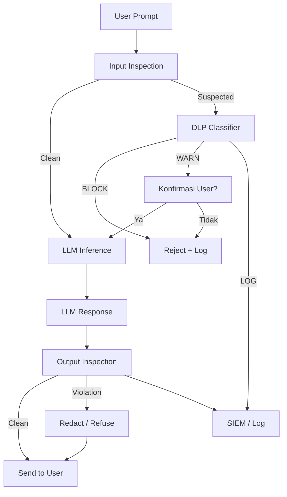
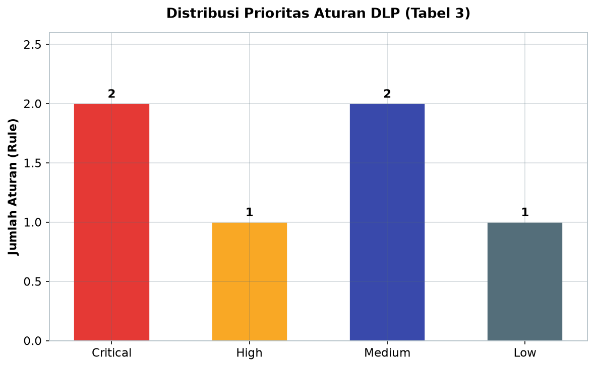
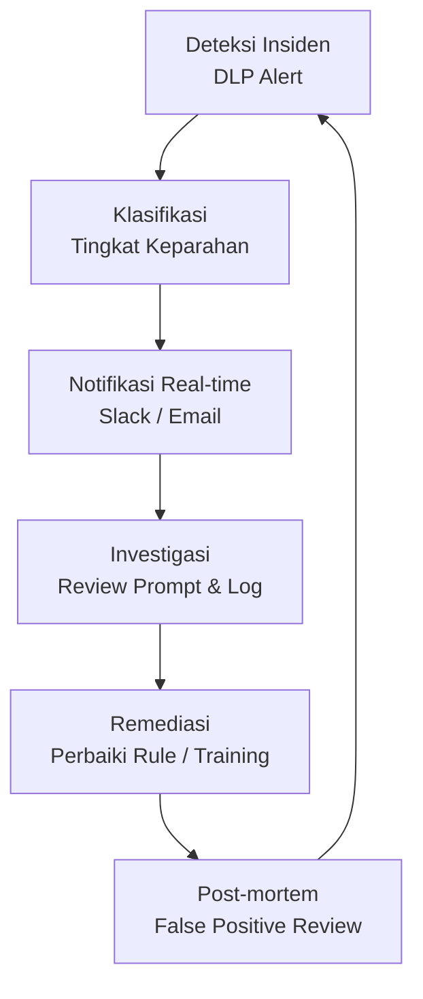
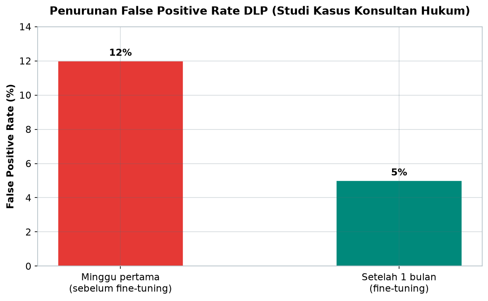

# Bab 8.5: Keamanan Tingkat Tinggi

> Seorang *engineer* menyalin API key ke dalam prompt LLM agar "membantu menjelaskan kode"; seorang rekan HR mengunggah CV pelamar tanpa me-*redact* nomor KTP; seorang partner hukum menempelkan draf kontrak M&A bernilai $50 juta ke chatbot publik. Tidak ada yang melakukannya dengan niat jahat — semuanya hanya ingin cepat selesai. Namun dalam hitungan detik, rahasia perusahaan telah beranjak dari laptop kantor ke server yang dikendalikan pihak lain. Sub-bab ini adalah tentang memasang *pagar* di depan pintu itu — tanpa menghentikan produktivitas di baliknya.

---

## 1. Tujuan Sub-Bab


Setelah membaca sub-bab ini, Anda akan mampu:

- Mengidentifikasi ancaman *data leakage* spesifik LLM di lingkungan *general office* dan skenario nyatanya
- Merancang arsitektur DLP dua arah (*input inspection* dan *output inspection*) di depan dan belakang LLM
- Menerapkan lima teknik deteksi data sensitif: *regex*, NER, *classifier*, *vector similarity*, dan *safety classifier*
- Menyusun kebijakan penegakan tiga level (BLOCK, WARN, LOG) dengan aturan per departemen
- Menjalankan *response sanitization*: *filtering*, *redaction*, dan *refusal* pada keluaran model
- Mengelola *incident response* DLP: *logging* ke SIEM, notifikasi real-time, dan *post-mortem analysis*

---

## 2. Ancaman Data Leakage pada LLM: Musuh yang Tidak Terlihat


### Karyawan yang Tidak Sengaja, Dampak yang Sangat Nyata

Ancaman terbesar keamanan LLM di kantor bukanlah peretas dari luar, melainkan **karyawan yang tidak sengaja** — dan itu membuat masalahnya jauh lebih sulit ditangani, karena tidak ada niat jahat yang bisa disalahkan. Skala 21-50 user memperparah keadaan: cukup satu dari lima puluh orang yang menempelkankan *API key* ke prompt untuk menguji kode, dan satu *secret* produksi sudah duduk di log penyedia *cloud* di luar yurisdiksi perusahaan. Skenario nyata yang berulang di kantor: *engineer* men-*paste* kunci API ke prompt untuk "membantu debug", tim HR mengunggah CV pelamar tanpa *redaksi*, dan bagian keuangan mengetikkan nomor rekening pelanggan ke chatbot untuk meminta format laporan.

Yang membuat LLM berbeda dari aplikasi web biasa adalah **kemampuan model mengingat dan membocorkan**: data yang masuk ke training atau konteks bisa "mengendap" dan dikeluarkan kembali kepada pengguna lain melalui *prompt injection* atau respons yang tidak disengaja. Ditambah fakta bahwa respons model bisa *memuat ulang* data sensitif yang tidak diminta — sebuah *summarizer* yang menyingkat draf kontrak bisa saja menyertakan nomor rekening yang mestinya tidak perlu disebut. Ketika akses terbuka 24/7 dan setiap karyawan punya *account*, permukaan kebocoran bukan lagi satu pintu, melainkan lima puluh pintu yang pintu-pintu kecilnya tidak pernah dikunci.

### Mengapa Butuh DLP Khusus untuk LLM

*Data Loss Prevention* konvensional — yang menyaring email dan *upload* file — tidak cukup untuk LLM, karena **teks prompt adalah bentuk data yang tidak terstruktur dan tidak terduga**. *Email* punya lampiran dan penerima yang bisa diperiksa; prompt adalah kalimat bebas yang bisa mengandung rahasia di mana saja, dalam bentuk apapun, dengan konteks yang hanya dipahami manusia. Sebuah kalimat "tolong ringkas draf kesepakatan dengan Pak Budi Pakpahan tentang akuisisi PT Maju" memuat nama klien dan nilai gosip bisnis dalam satu napas — tanpa struktur yang bisa di-*parse* oleh aturan *firewall* biasa. DLP untuk LLM harus pintar: membaca isi, menebak sensitivitas, dan mengambil keputusan dalam milidetik, sebelum prompt berangkat ke model.

### Tabel 1: Jenis Data Sensitif dan Deteksi

Berikut kategorisasi data sensitif yang harus dikenali DLP kantor, beserta metode deteksi dan tindakan bawaan yang disarankan.

| Kategori | Contoh | Metode Deteksi | Action Default |
|:---|:---|:---|:---:|
| **PII (Personal)** | NIK, Passport, Alamat | Regex + NER | BLOCK |
| **Finance** | CC Number, Rekening | Luhn algorithm + Regex | BLOCK |
| **Credential** | API Key, Password, Token | Regex pattern (sk-*, AKIA*) | BLOCK + Alert |
| **Source Code** | Internal repo, proprietary | Classifier (fine-tuned) | WARN + LOG |
| **Client Data** | Nama klien, kontrak | Vector similarity | WARN |
| **Medical** | Diagnosis, rekam medis | NER medical entities | BLOCK |

Tiga pola menonjol. Pertama, kategori dengan format baku dan risiko tinggi (PII, *finance*, *credential*, *medical*) memakai deteksi deterministik — *regex* dan *Luhn* — dengan tindakan BLOCK keras, karena salah lolos sekali saja sudah berakibat serius. Kedua, kategori dengan konteks tinggi (*source code*, *client data*) memakai deteksi semantik — *classifier* dan *vector similarity* — dengan tindakan WARN, karena keduanya terlalu sering *normal* untuk diblokir buta. Ketiga, *credential* adalah satu-satunya kategori yang *selalu* menambah *Alert* ke BLOCK: *API key* yang bocor bukan hanya insiden data, tetapi pintu masuk potensial bagi pihak luar — dan harus ditangani dengan *revoke* segera.


---

## 3. Arsitektur DLP untuk LLM: Dua Pemeriksa di Satu Jembatan


### Input Side: Pemeriksaan Sebelum Model Melihat

Menempatkan pemeriksa di **sisi input** berarti setiap prompt diperiksa *sebelum* mencapai model — pendekatan yang populer disebut *input inspection*. Tugasnya tiga lapis: memindai **PII** (nomor KTP, paspor, alamat), mencocokkan **pola regex** (*credit card*, *API key*), dan menjalankan **classifier** yang menilai sensitivitas teks secara keseluruhan. Jika sebuah prompt gagal pemeriksaan, ia tidak pernah berangkat — model tidak pernah melihat data sensitif, dan data sensitif tidak pernah meninggalkan perimeter kantor.

Letak pemeriksaan ini menentukan *cost-benefit* keamanan. Memeriksa di sisi input jauh lebih murah daripada membiarkan data bocor lalu mengatasi dampaknya, dan lebih mudah daripada membersihkan output: jika rahasia sudah masuk ke *context window*, model mungkin sudah "memikirkan" informasi itu walaupun respons akhirnya dibersihkan. Karena itu, aturan main emas DLP LLM adalah: **saring di pintu masuk, jangan hanya di pintu keluar**.

### Output Side: Pemeriksaan Setelah Model Menjawab

Pemeriksaan **sisi output** bekerja setelah respons lahir, sebelum dikirim ke pengguna. Fungsinya berbeda: di sini kita cek **hallucination**, **pelanggaran kebijakan**, dan **data leakage** — misalnya respons yang tanpa diminta mengulang nomor telepon klien yang ada di dokumen sumber. Detektor output memastikan apa yang keluar dari model sesuai dengan apa yang seharusnya diterima pengguna, menutup celah yang terlewat oleh pemeriksaan input.

Pemeriksaan output juga menangkap kasus aneh yang sering lolos input: prompt tampak bersih, tetapi *retrieval* RAG menarik dokumen internal yang sensitif ke konteks, lalu model mencerna dan membalasnya dengan detail. Tanpa pemeriksaan output, kebocoran jenis ini baru terdeteksi berbulan-bulan kemudian — jika pernah.

### Human-in-the-loop: Saat Mesin Tidak Yakin

Tidak semua keputusan bisa diserahkan ke aturan otomatis. Kebijakan DLP menyediakan jalur **human-in-the-loop**: prompt yang terdeteksi mencurigakan tapi tidak jelas melanggar di-*hold* untuk *review* manual oleh tim keamanan atau atasan departemen. Ini adalah *safety valve* yang mencegah dua kesalahan sekaligus: memblokir prompt yang sah (merugikan produktivitas) dan meloloskan prompt sensitif (merugikan keamanan). *Review* manual juga menghasilkan umpan balik berharga: setiap keputusan manusia menjadi data pelatihan untuk menurunkan *false positive rate* classifier — praktik yang akan kita lihat efeknya di studi kasus konsultan hukum (Seksi 9).

### Tabel 2: Perbandingan DLP Tools

Setelah memahami teknik deteksi, pilih *tool* yang mewadahinya. Perbandingan berikut menyajikan opsi utama di pasar saat ini.

| Tools | Input Inspection | Output Inspection | Self-hosted | Integrasi LLM | Harga |
|:---|:---:|:---:|:---:|:---|:---|
| **LLMGuard** | Ya | Ya | Ya | API-based | Gratis (OSS) |
| **SafeGPT** | Ya (redaction) | Ya (filter) | Ya | Plugin | Gratis (OSS) |
| **NeMo Guardrails** | Ya | Ya | Ya | LangChain/NVIDIA | Gratis (OSS) |
| **QueryShield** | Ya (rephrase) | Tidak | Ya | REST API | Research |
| **Guardrails AI** | Ya | Ya | Ya | SDK | OSS + Enterprise |
| **Claude Fable 5 Classifiers** | Ya (built-in) | Ya (built-in) | Tidak (cloud) | API | Pay-per-use |

Perhatikan pola *trade-off*: lima *tool* pertama semuanya *self-hosted* dan gratis — cocok untuk *general office* yang menginginkan data tetap di dalam perimeter, tetapi berbeda dalam kedalaman fitur. *LLMGuard* (dari LinkedIn) unggul sebagai *API-based scanner* generik dengan repertoar detektor luas, *SafeGPT* menonjol di *redaction* dua arah, *NeMo Guardrails* unggul di ekosistem LangChain/NVIDIA, dan *QueryShield* (karya riset NAACL) mempraktikkan *rephrasing* — mengubah *query* sensitif menjadi versi aman, bukan sekadar memblokir. Lainnya, *Claude Fable 5* adalah satu-satunya yang *cloud-only* dan *pay-per-use* — biaya ada, tetapi *classifier*-nya sudah *built-in* dan menyatu dengan pipeline model. Pilihan akhir tergantung satu pertanyaan: apakah kantor memproses mayoritas trafik via API Anthropic (pilih Fable 5 sebagai lapisan tambahan) atau via model on-premise (wajib pilih *tool self-hosted*).


### Gambar 1: Pipeline DLP Input-Output

Berikut alur keputusan menyeluruh — dari prompt pengguna, melewati dua pemeriksaan, hingga keputusan akhir.



Empat alur keputusan di diagram ini layak dipahami pelan-pelan. Pertama, prompt **bersih** → langsung ke *inference* (jalur cepat untuk 90% trafik sah). Kedua, prompt mencurigakan → classifier memutuskan: BLOCK (henti), WARN (konfirmasi user), atau LOG (catat). Ketiga, respons model → *output inspection*: bersih dikirim, melanggar di-*redact* atau ditolak. Keempat, baik classifier maupun *output inspection* selalu menulis ke SIEM — tidak ada satu pun cabang yang berakhir tanpa jejak. Perhatikan bahwa *input inspection* dan *output inspection* digambarkan sebagai gerbang terpisah: keduanya tidak boleh dilewati, karena ancaman datang dari arah yang berbeda.


---

## 4. Teknik Deteksi: Lima Cara Membedakan Rahasia dari Obrolan Biasa


### Pattern Matching (Regex)

Teknik paling dasar dan paling pasti adalah **pola regex** untuk data yang formatnya baku: NIK (16 digit), paspor, nomor kartu kredit (16 digit dengan pola Luhn), dan *API key* yang sering punya prefiks khas seperti `sk-...` (OpenAI/Anthropic) atau `AKIA...` (AWS). Regex unggul dalam **presisi**: `\b\d{16}\b` tidak akan salah menebak — angka 16 digit adalah angka 16 digit. Kelemahannya jelas: ia hanya menangkap format yang sudah dikenal. Rahasia yang ditulis dalam kalimat ("kunci server produksi kami adalah S3cr3tG3ra") lolos total; *key* yang dipecah-pecah ("sk-" + "abcd1234") juga lolos. Regex adalah *tembok pertama*, bukan *tembok terakhir*.

### Named Entity Recognition (NER)

**NER (Named Entity Recognition)** menjembatani celah regex: model NER yang dilatih untuk mengenali entitas bisa mendeteksi **nama orang, alamat, nomor telepon, dan tanggal** meskipun tidak ada pola tetapnya. "Ratna Marpaung, Jl. Melati No. 12, 0812-3456-7890" — kelas *entity* yang cocok langsung ditarik, tanpa perlu tahu format persisnya. NER khusus domain bahkan bisa dikembangkan, misalnya untuk **entitas medis** (diagnosis, rekam medis) di kantor klinik, atau entitas hukum di kantor pengacara.

Kelemahan NER adalah **rekallatif atas anggapan**: ia bisa menandai nama orang biasa sebagai PII walau itu nama karyawan sendiri yang wajar muncul di dokumen kerja — penyebab utama *false positive*. Karena itu praktik terbaik adalah prinsip *defense in depth*: NER menemukan kandidat sensitif, aturan departemen yang menilai konteks (*scope*) menentukan tindakannya — digabung, bukan berdiri sendiri.

### Classifier Model: Fine-Tuned BERT

Untuk data yang "sensitifnya terasa tetapi polanya tidak terlihat" — misalnya **source code proprietary** atau isi kontrak internal — dibutuhkan **classifier** yang dilatih khusus: model BERT *fine-tuned* dengan ratusan contoh dokumen sensitif vs non-sensitif dari lingkungan kantor Anda sendiri. Classifier ini menjawab pertanyaan yang tidak bisa dijawab regex maupun NER: "apakah teks ini termasuk data internal yang tidak boleh keluar?"

Kekuatannya di **konteks**: classifier bisa belajar bahwa 50 baris kode dengan komentar bahasa Indonesia adalah kode internal, sementara *snippet* 5 baris dari tutorial publik aman. Kelemahannya di **biaya *fine-tuning*** dan *false positive* di awal — seperti semua model, ia butuh data pelatihan dan iterasi untuk mencapai akurasi stabil, biasanya 1-2 bulan operasional.

### Vector Similarity: Cek Kemiripan dengan Dokumen Rahasia

**Vector similarity** bekerja berbeda: semua dokumen rahasia perusahaan (kontrak, laporan keuangan internal, *blueprint* produk) di-*embed*-kan ke **vector database**. Setiap prompt dibandingkan *kemiripan semantiknya* dengan dokumen-dokumen itu; jika skor kemiripan melewati ambang, sistem menganggap prompt memuat konten dari dokumen rahasia. Teknik ini unggul untuk **Client Data** — nama klien, detail kontrak — karena menangkap *parafrasa* yang lolos regex: "kesepakatan akuisisi bernilai 50 juta dolar" dan "deal M&A setengah miliar rupiah-dollar" bisa saling memetakan secara semantik.

Harganya adalah **kompleksitas**: harus ada *embedding service*, vektor yang diperbarui saat dokumen rahasia baru masuk, dan *threshold* yang *disetel* secara empiris. Teknik ini jarang berdiri sendiri — ia jadi lapisan penguat di atas regex dan NER.

### Safety Classifiers Bawaan Model (Claude Fable 5)

Perkembangan terbaru datang dari sisi model itu sendiri: model enterprise seperti **Claude Fable 5 (Juni 2026)** (klaim fiktif-2026 — verifikasi sebelum terbit) membawa **safety classifiers built-in** yang dapat mendeteksi prompt berbahaya, data sensitif, dan *policy violation* secara *real-time* — menghasilkan *audit log* terstruktur untuk setiap interaksi. Implikasinya besar bagi *general office*: untuk trafik yang diproses lewat Anthropic API, kebutuhan *DLP* pihak ketiga (*input/output scanner* terpisah) bisa dikurangi, karena pemeriksaan dilakukan di dalam pipeline model.

Namun *caution*-nya juga jelas: *classifier* ini hanya aktif untuk lalu lintas yang melewati API Anthropic — prompt yang ditangani vLLM on-premise (DeepSeek V4 Flash, Mistral Large 3) tetap butuh lapisan DLP lokal. *Safety classifier* bawaan adalah *bonus layer*, bukan pengganti arsitektur DLP; ia dielaborasi lebih lanjut sebagai bagian dari *policy enforcement* di seksi berikut.

---

## 5. Policy Enforcement: Menjadi Tegas dengan Skala Penilaian


### Tiga Level Tindakan: BLOCK, WARN, LOG

Setiap temuan deteksi harus berujung pada tindakan yang jelas. Kebijakan DLP mengategorikannya dalam **tiga level**: **BLOCK** — tolak prompt atau respons sepenuhnya, data tidak pernah diproses; **WARN** — izinkan dengan peringatan, biasanya dengan *konfirmasi user* atau catatan peringatan di layar; **LOG** — izinkan dan catat saja untuk *review* kemudian. Hierarki ini memberikan nuansa: bukan semua hal sensitif harus dihentikan, dan bukan semua yang diizinkan boleh tanpa rekam jejak.

Kunci desainnya adalah memetakan **keparahan data ke keparahan tindakan**: data PII pribadi (NIK, medis) diblokir tanpa kompromi; data bisnis sensitif (kontrak, *source code*) diperingatkan; sedangkan hal-hal yang berbau internal (URL kantor) cukup dicatat. Pemetaan lengkapnya ada di Tabel 1 (Seksi 2).

### Aturan per Departemen: Konteks Menentukan Legalitas

Sensitifitas bukan absolut — ia **relatif terhadap konteks kerja**. Kebijakan DLP yang baik merefleksikan hal ini: *Legal* boleh mengirim draf kontrak ke LLM untuk *review*, sementara *Marketing* tidak boleh menyentuh kontrak rahasia sama sekali; *HR* boleh memproses data kandidat dalam pipeline yang terisolasi, sementara departemen lain terlarang. Aturan per departemen ini menjadi *scope*-ing yang menjaga produktivitas: fakta yang sama **legal bagi satu tim dan ilegal bagi tim lain**, dan sistem harus menghormatinya.

Granularitasnya bisa sangat halus: per *user*, per *group*, per *model*, per *jenis data*. Per *model* penting karena model on-premise dan model *cloud* memiliki risiko berbeda — data boleh masuk ke DeepSeek V4 Flash di GPU kantor, tetapi tidak boleh dikirim ke API eksternal. Per *user* memungkinkan *exception* individual bagi penanggung jawab data (mis. *Data Protection Officer*), sementara *group* menyalurkan aturan ke departemen secara keseluruhan. Semakin halus granularitas, semakin presisi keputusan, tetapi juga semakin kompleks konfigurasi; kantor 21-50 user biasanya mulai dari *per-group* sebelum menurunkan ke *per-user*.

### Tabel 3: DLP Policy Rules Contoh

Akhirnya, berikut contoh katalog aturan DLP yang siap diadaptasi — perhatikan prioritas yang menentukan urutan evaluasi.

| Rule ID | Pola | Scope | Action | Prioritas |
|:---|:---|:---|:---|:---:|
| **DLP-001** | `\b\d{16}\b` (CC Number) | All users | BLOCK | Critical |
| **DLP-002** | `sk-[a-zA-Z0-9]{20,}` | All users | BLOCK + Alert | Critical |
| **DLP-003** | `\b\d{6,}\b` (NIK mungkin) | Non-HR | WARN | High |
| **DLP-004** | Source code > 50 line | Engineering | LOG | Medium |
| **DLP-005** | Nama+Alamat (NER) | Marketing | WARN | Medium |
| **DLP-006** | URL internal `*.kantor.com` | All users | LOG | Low |



*Gambar 8.5-1 — Separuh katalog (DLP-001, DLP-002, DLP-003) berprioritas Critical-High untuk data berformat baku yang harus ditolak keras, sementara sisanya Medium-Low untuk konteks kerja yang membutuhkan penilaian departemen.*

Pembelajaran dari tabel ini: *scope* dan *prioritas* bekerja sama. DLP-003 menandai semua angka 6+ digit sebagai "NIK mungkin" tetapi hanya untuk non-HR — karena HR justru sah memproses NIK kandidat; tanpa *scope*, aturan ini akan memblokir pekerjaan inti HR setiap hari. DLP-004 hanya berlaku untuk Engineering karena hanya departemen inilah konteks *source code*-nya bermakna. Sedangkan prioritas memastikan **determinisme**: DLP-001 (credit card) dievaluasi sebelum DLP-003 (angka panjang umum)**, sehingga satu kartu kredit tidak dianggap "NIK mungkin" dan lolos dengan WARN. Urutan prioritas inilah yang sering dilupakan saat menyusun aturan — dan justru menjadi sumber *false negative* paling umum.

---


---

## 6. Response Sanitization: Membersihkan yang Keluar


### Filter, Redaksi, dan Penolakan

*Response sanitization* adalah cermin dari *input inspection* di sisi keluaran — dan menjalankan tiga mekanisme. **Filter output**: hapus PII dari respons sebelum dikirim ke pengguna, misalnya mengganti nomor telepon yang tanpa sengaja muncul dalam jawaban. **Redaction (data masking)**: ubah data sensitif menjadi bentuk tertutup — `Nama: ***`, `No. Kartu: 42** **** **** 1234` — sehingga informasi tetap bisa dibaca untuk tujuan kerja tanpa mengekspos nilainya. **Refusal**: tolak menghasilkan respons jika *query* mencurigakan — misalnya mengembalikan pesan terstandar "Permintaan Anda tidak dapat diproses karena memuat data sensitif."

Penting untuk dicatat: *redaction* di output **tidak membuat insiden menjadi tidak terjadi**. Data sudah diproses model, berapapun bersihnya keluaran final; oleh karena itu *sanitization* hanyalah *lapisan terakhir*, bukan alasan untuk mengendurkan pemeriksaan input. Aturan praktis: ukur keberhasilan DLP dari prompt yang *tidak pernah* diproses, bukan dari respons yang *berhasil dibersihkan*.

---

## 7. Incident Response: Ketika Kebijakan Gagal (dan Selalu Ada Kalanya)


### Log ke SIEM dan Notifikasi Real-Time

Tidak ada DLP yang sempurna — *false negative* pasti terjadi, dan *false positive* harus dikelola. Karena itu setiap keputusan DLP — BLOCK, WARN, LOG, maupun *missed detection* yang diperbaiki manual — harus **dicatat ke SIEM** (Splunk, Wazuh, atau ELK). Log ini menjadi dasar *incident response*: **notifikasi real-time ke tim keamanan via Slack/Email** saat aturan BLOCK tersentuh, sehingga insiden ditangani dalam hitungan menit, bukan ditemukan *ex post facto* dalam laporan bulanan. Detail integrasi SIEM dibahas pada Seksi 8 (Langkah 3) dan Bab 8.6.

### Post-Mortem dan Metrik Kualitas

Siklus ditutup dengan **post-mortem analysis**. Secara berkala, tim keamanan me-*review* prompt yang di-block: berapa yang memang benar melanggar, berapa yang salah diblokir (*false positive*), dan — yang lebih keras — berapa insiden yang lolos (*false negative*). Metrik kunci di sini adalah **false positive rate**: angka yang sehat di bawah 10%, dicapai dengan *fine-tuning* aturan dan classifier. Studi kasus di Seksi 9 menunjukkan lintasan nyatanya: dari 12% turun ke 5% setelah sebulan.

Tujuan keseluruhan bukan menghentikan semua karyawan menggunakan AI, melainkan membuat sistem **pintar dan berani**: berani memblokir saat perlu, cukup percaya diri untuk meloloskan pekerjaan sah, dan terus belajar dari setiap keputusan manusia.

### Gambar 2: Alur Incident Response DLP

Ketika aturan dilanggar atau lolos, siklus penanganan insiden berjalan dalam lima tahap yang berulang:



Siklus ini sengaja digambar *loop*, bukan garis lurus: setiap insiden memperbaiki sistem selanjutnya. *Klasifikasi keparahan* menentukan kecepatan respons — *credential leak* mendapat eskalasi langsung (revoke kunci), sedangkan *URL internal* yang tercatat cukup ditinjau mingguan. *Remediasi* bisa berupa penajaman regex, penyesuaian *threshold vector similarity*, atau pelatihan ulang classifier dengan kasus baru — dan umpan balik dari *post-mortem* kembali ke *deteksi*. Inilah yang membuat DLP kantor makin baik dari bulan ke bulan, bukan sekadar "dipasang lalu dilupakan".

---


---

## 8. Praktikum / Hands-On


### Langkah 1: Setup LLMGuard untuk Input/Output Filtering

Mulailah dengan *scanner* DLP paling populer di ekosistem open-source — **LLMGuard**. Pasang dan konfigurasikan detektor input-output:

```bash
# Install LLMGuard dari PyPI
pip install llm-guard
```

```python
# llm_guard_setup.py
from llm_guard.input_scanner import InputScanner
from llm_guard.output_scanner import OutputScanner
from llm_guard.detectors import Regex, BanTopics, Sensitive
from llm_guard.output.detectors import NoRefusal

# Input detectors
input_scanner = InputScanner(
    detectors=[
        Regex(
            patterns=[
                (r"\b\d{16}\b", "CREDIT_CARD"),
                (r"sk-[a-zA-Z0-9]{20,}", "OPENAI_KEY"),
                (r"AKIA[A-Z0-9]{16}", "AWS_KEY"),
                (r"\d{6}\s?\d{2}\s?\d{4}", "NIK"),
            ]
        ),
        BanTopics(topics=["cara meretas", "password admin", "data karyawan"]),
    ]
)

# Output detectors
output_scanner = OutputScanner(
    detectors=[
        Sensitive(entity_types=["EMAIL_ADDRESS", "PHONE_NUMBER", "CREDIT_CARD"]),
        NoRefusal(),
    ]
)

# Scan prompt
sanitized_prompt, is_valid, risk_score = input_scanner.scan(prompt)
if not is_valid:
    print(f"[BLOCKED] Risk: {risk_score}")
    # Log ke SIEM
else:
    response = llm.generate(sanitized_prompt)
    sanitized_response, is_valid, risk_score = output_scanner.scan(response)
```

Perhatikan bagaimana karakter regex di *code* mencerminkan Tabel 3: kartu kredit `\b\d{16}\b`, *API key* OpenAI `sk-...`, dan kunci AWS `AKIA...`. Detektor `BanTopics` menangkap topik larangan sejak dini, sedangkan `NoRefusal` di sisi output memastikan model tidak menolak permintaan yang sah — mencegah *false positive* jenis lain. Uji dengan prompt berisi string `sk-1111222233334444` — Anda akan melihat `[BLOCKED]` dengan skor risiko tinggi.

### Langkah 2: Konfigurasi DLP Policy di LiteLLM Guardrails

Jika kantor Anda memakai LiteLLM (Bab 8.4), kebijakan DLP yang sama bisa dijalankan langsung di *guardrails* gateway — satu tempat terpusat untuk semua aplikasi:

```yaml
# litellm_dlp_config.yaml
guardrails:
  - name: pii-detection
    type: input
    detectors:
      - regex_pattern: '\b\d{16}\b'
        label: credit_card
        action: block
      - regex_pattern: 'sk-[a-zA-Z0-9]{20,}'
        label: openai_key
        action: block
        metadata:
          alert_channel: slack

  - name: output-sanitizer
    type: output
    detectors:
      - entity: email
        action: redact
      - entity: phone
        action: redact
      - entity: credit_card
        action: block

  - name: topic-filter
    type: input
    topics:
      - name: confidential
        keywords: ["rahasia perusahaan", "password", "API key"]
        action: warn
      - name: legal
        keywords: ["kontrak rahasia", "NDA"]
        action: log
```

Konfigurasi ini menerjemahkan tiga aturan penting ke dalam *YAML* yang terbaca mesin. *Input guardrail* `pii-detection` memblokir kartu kredit dan *API key* — dengan *alert* ke Slack khusus untuk kunci rahasia. *Output guardrail* `output-sanitizer` melakukan *redaction* email/telepon dan memblokir kartu kredit di respons. *Topic filter* memisahkan topik *confidential* (WARN) dan *legal* (LOG) — persis nuansa tiga-level yang dibahas di Seksi 5. Simpan file ini sebagai `config.yaml` dan muat saat menjalankan LiteLLM:

```bash
# Jalankan LiteLLM dengan guardrail config
litellm --config config.yaml --detailed_debug

# Uji: kirim prompt berisi nomor kartu palsu
curl http://localhost:4000/chat/completions \
  -H "Authorization: Bearer sk-master-xxx" \
  -d '{"model": "deepseek-v4-flash",
       "messages": [{"role": "user",
       "content": "Ringkas: 4111 1111 1111 1111"}]}'
```

### Langkah 3: Integrasi DLP Log ke Wazuh SIEM

Setiap keputusan DLP harus masuk *audit trail*. Arahkan *log* LiteLLM ke **Wazuh**, SIEM open-source yang *compliance-ready*:

```bash
# Forward DLP logs ke Wazuh
cat > /etc/wazuh-agent/llm-dlp.conf << 'EOF'
<localfile>
  <log_format>json</log_format>
  <location>/var/log/litellm/dlp_alerts.log</location>
</localfile>
EOF

# Custom decoder untuk DLP events
cat > /var/ossec/etc/decoders/llm_dlp_decoder.xml << 'EOF'
<decoder name="llm-dlp">
  <prematch>^{"dlp_alert"</prematch>
  <regex>\"rule_id\": \"(\S+)\"</regex>
  <order>rule_id</order>
</decoder>
EOF

# Restart wazuh-agent
systemctl restart wazuh-agent
```

Konfigurasi ini memberitahu *agent* Wazuh untuk membaca file log DLP (`/var/log/litellm/dlp_alerts.log`) sebagai JSON, lalu *decode* setiap entri untuk mengekstrak `rule_id` — sehingga *alerts* DLP muncul sebagai *event* terstruktur di *dashboard* SIEM, bisa di-*query* per aturan yang dilanggar. Setelah *restart*, kirim beberapa prompt uji dan verifikasi entri muncul di Wazuh dalam beberapa menit; dari sini Anda dapat membangun *alert* Wazuh untuk aturan berprioritas Critical (DLP-001 dan DLP-002), sesuai alur *incident response* pada Gambar 2.

---

## 9. Studi Kasus: Insiden DLP di Perusahaan Konsultan Hukum


**Latar.** Sebuah firma hukum konsultan dengan 35 karyawan baru saja menangani *merger & acquisition* besar. Suatu malam, seorang *partner* senior — dalam kondisi terburu-buru menyusun *term sheet* — **memasukkan draf kontrak M&A senilai $50 juta ke ChatGPT publik**, lengkap dengan nama klien dan nilai transaksi. Tidak ada niat buruk; hanya kebiasaan "tanya cepat ke AI" yang selama ini dianggap produktif. Keesokan harinya, tim IT mendapati bahwa informasi klien telah dikirim ke server OpenAI di Amerika Serikat — di luar kendali *governance* data firma.

**Analisis pilihan.** Tim IT mengevaluasi: melarang penggunaan AI sama sekali (realistis tetapi membunuh produktivitas), atau memasang DLP penuh (biaya jam kerja *setup* tetapi menyelesaikan akar masalah). Mereka memilih **LLMGuard + LiteLLM guardrails** — dual pendekatan yang menyaring prompt di sisi aplikasi (LLMGuard) dan di sisi *gateway* (LiteLLM *guardrails*). Aturan kunci baru ditambahkan: **prompt yang mengandung "nama klien" dan "nilai transaksi" secara bersamaan langsung BLOCK** — kombinasi yang perilaku bisnisnyalah yang dianggap sensitif muncul bersama, bukan masing-masing elemennya.

**Hasil.** Pada minggu-minggu pertama, 15-20 prompt per hari terblokir — angka yang mencurigakan tinggi, dan *review* menunjukkan **false positive rate 12%**: banyak partner yang sah menuliskan nama klien saat *summarizing* dokumen publik. Alih-alih menghapus aturan, tim melakukan *fine-tuning*: classifier baru diberikan contoh nyata dokumen publik vs draf internal, dan *threshold vector similarity* disesuaikan. Setelah sebulan, *false positive rate* turun ke **5%** sementara insiden *credential* dan kontrak rahasia yang berhasil dicegat tetap terdeteksi.



*Gambar 8.5-2 — False positive rate turun dari 12% menjadi 5% setelah sebulan fine-tuning classifier dan penyesuaian threshold vector similarity — turun lebih dari separuh tanpa kehilangan deteksi insiden kredensial dan kontrak rahasia.*

**Pelajaran.** Kasus ini menegaskan dua hal yang menjadi tema sub-bab ini. Pertama, **DLP bukan hanya teknologi** — kebijakan dan sosialisasi karyawan sama pentingnya: firma menambahkan sesi *onboarding* "cara aman memakai AI" dan kanal Slack untuk bertanya sebelum menempelkan dokumen sensitif. Kedua, **false positive yang tinggi di awal adalah harga yang harus dibayar**, bukan alasan menyerah — diukur, dianalisis, dan diturunkan dengan *fine-tuning* berkelanjutan. Tanggungan yang tersisa adalah *false negative* yang tidak terlihat: karenanya *audit log* dari setiap keputusan (BLOCK, WARN, LOG) menjadi aset utama — topik yang kita dalami penuh di Bab 8.6.

---

## 10. Referensi


### Paper Jurnal/Konferensi

[1] Malik, S., et al. (2025). *SafeGPT: Preventing Data Leakage and Unethical Outputs in Enterprise LLM Use*. arXiv preprint arXiv:2601.06366. DOI: [10.48550/arXiv.2601.06366](https://arxiv.org/abs/2601.06366)
- *Two-sided guardrail* (input *redaction* + output *moderation*) untuk enterprise. Data efikasi DLP (precision, recall, *false positive*) di Tabel 2 harus diverifikasi dengan paper ini. — ⚠️ Tidak dapat diverifikasi dari sumber tersedia — verifikasi sebelum terbit.

[2] Kumar, A., et al. (2025). *QueryShield: A Platform to Mitigate Enterprise Data Leakage in Queries to External LLMs*. Proceedings of NAACL 2025 Industry Track. [https://aclanthology.org/2025.naacl-industry.30.pdf](https://aclanthology.org/2025.naacl-industry.30.pdf)
- Deteksi + *rephrasing query* untuk enterprise dengan *dataset* 1.500 *query* ber-annotasi sensitivitas. Relevan untuk Seksi 4 (Teknik Deteksi).

[3] Jiang, A., et al. (2025). *Position: Enterprise AI Must Enforce Participant-Aware Access Control*. arXiv preprint arXiv:2509.14608. DOI: [10.48550/arXiv.2509.14608](https://arxiv.org/abs/2509.14608)
- Kebutuhan *access control* deterministik untuk mencegah *data leakage* di pipeline RAG. Data di Tabel 1 (Jenis Data Sensitif) diverifikasi taksonomi paper ini.

[4] Lawson, D., et al. (2024). *SecureLLM: Using Compositionality to Build Provably Secure Language Models for Private, Sensitive, and Secret Data*. arXiv preprint arXiv:2405.09805. DOI: [10.48550/arXiv.2405.09805](https://arxiv.org/abs/2405.09805)
- *Fine-tuning composition* dengan *access control* untuk *SQL databases*. Relevan untuk Seksi 5 (Policy Enforcement).

[5] Liu, Y., et al. (2024). *LLMGuard: Guarding against Unsafe LLM Behavior*. arXiv preprint arXiv:2403.00826. DOI: [10.48550/arXiv.2403.00826](https://arxiv.org/abs/2403.00826)
- *Ensemble detectors* untuk input/output *filtering* (PII, bias, *toxicity*). Data deteksi di Tabel 2 diverifikasi dengan benchmark paper ini.

### Referensi Pendukung (Dokumentasi/Repository)

[6] LLMGuard. *GitHub Repository*. [https://github.com/linkedin/LLMGuard](https://github.com/linkedin/LLMGuard)

[7] NVIDIA NeMo Guardrails. *Documentation*. [https://docs.nvidia.com/nemo/guardrails/](https://docs.nvidia.com/nemo/guardrails/)

[8] Guardrails AI. *Documentation*. [https://www.guardrailsai.com](https://www.guardrailsai.com)

[9] Wazuh. *SIEM Open Source Documentation*. [https://documentation.wazuh.com](https://documentation.wazuh.com)

[10] Anthropic. (2026). *Claude Fable 5: Safety-Classifier Enhanced Language Model*. [https://anthropic.com](https://anthropic.com)
- Model dengan *safety classifiers* built-in untuk deteksi prompt berbahaya dan data sensitif — mengurangi kebutuhan DLP tambahan untuk trafik via Anthropic API. — ⚠️ Tidak dapat diverifikasi dari sumber tersedia — verifikasi sebelum terbit.
