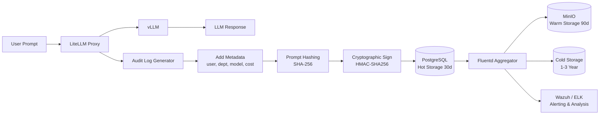
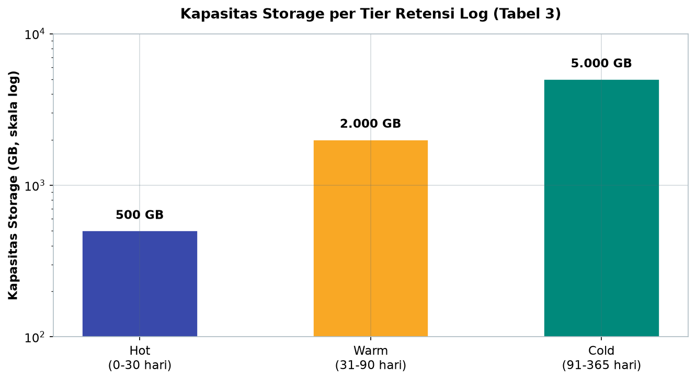
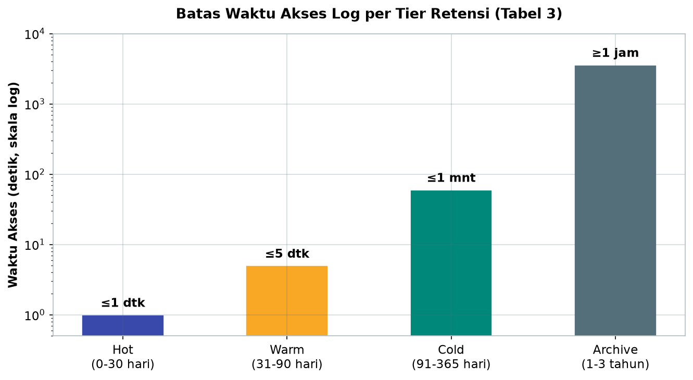
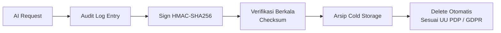

# Bab 8.6: Audit & Logging

> Setiap percakapan karyawan dengan AI meninggalkan jejak — pertanyaan yang diajukan, model yang menjawab, berapa lama menunggu, dan berapa rupiah yang terpakai. Jejak ini bisa menjadi bukti kepatuhan yang membuat auditor tersenyum, atau menjadi lubang hitam yang membuat sertifikasi ditunda sepanjang tahun. Dalam dunia yang diatur UU PDP dan ISO 27001, "kami tidak mencatat apa-apa" bukan lagi alasan yang bisa diterima, melainkan kalimat paling berbahaya yang bisa diucapkan seorang manajer IT.

---

## 1. Tujuan Sub-Bab


Setelah membaca sub-bab ini, Anda akan mampu:

- Menjelaskan persyaratan *audit trail* untuk penggunaan LLM di lingkungan *general office* menurut UU PDP, ISO 27001, dan GDPR
- Merancang skema *audit log* lengkap dengan metadata wajib: timestamp, user, departemen, model, hash prompt, dan biaya
- Menyusun pipeline *logging* dari LiteLLM ke PostgreSQL, Fluentd, MinIO, hingga SIEM (Wazuh/ELK)
- Menerapkan *tamper-evident logging* dengan *append-only storage*, penandatanganan HMAC, dan verifikasi berkala
- Menetapkan kebijakan retensi berjenjang (Hot, Warm, Cold, Archive) sesuai regulasi
- Menerapkan *privacy-preserving logging*: *pseudonymization*, *differential privacy*, dan hak hapus (*right to erasure*)

---

## 2. Mengapa Audit Trail Penting?


### Tiga Tekanan yang Bertemu di Satu Titik

*Audit trail* untuk LLM bukan lagi inisiatif sukarela — ia lahir dari pertemuan tiga tekanan sekaligus. Pertama, **regulasi**: UU PDP Indonesia (UU No. 27/2022) mewajibkan *pelindungan data pribadi* yang dapat dibuktikan, ISO 27001 mensyaratkan *logging* dan *monitoring* sebagai kontrol keamanan informasi, dan GDPR mengamanatkan *accountability principle* — semuanya berujung pada satu tuntutan teknis yang sama: *setiap pemrosesan data harus dapat direkonstruksi*. Kedua, **kebutuhan internal**: investigasi insiden (siapa mengirim prompt data nasabah kepada model mana?), review produktivitas (apakah biaya AI sepadan dengan penggunaannya?), dan deteksi penyalahgunaan (siapa memakai gateway di luar jam kerja?) semuanya membutuhkan catatan. Ketiga, **kebutuhan forensik**: ketika *data leakage* terjadi, tim keamanan harus bisa merekonstruksi percakapan lengkap — prompt apa yang masuk, jawaban apa yang keluar — untuk mengukur dampak dan mencegah pengulangan.

Ketiga tekanan ini tidak bisa dipenuhi oleh *log* aplikasi biasa yang berisi deretan angka tak terstruktur. Mereka menuntut **audit log yang terstruktur, tahan manipulasi, dan tersimpan sesuai retensi** — tiga kata kunci yang akan kita bedah di seksi-seksi berikut.

### General Office: Skala Kecil, Tanggung Jawab Penuh

Skala 21-50 user sering menggoda kantor untuk beralasan: "log kami kecil, cukup pakai file teks." Anggapan itu keliru ganda. *Log* dalam jumlah kecil sekalipun bisa menyimpan data pribadi karyawan dan pelanggan — dan **regulasi tidak membedakan ukuran kantor**: UU PDP berlaku untuk siapa pun yang memproses data pribadi di Indonesia. Di sisi lain, *audit log* yang berantakan justru lebih berbahaya daripada tidak ada *log* sama sekali, karena auditor akan membacanya dan menemukan bahwa metadata hilang, *timestamp* acak, atau *response* tidak tersimpan. Untungnya, skala kecil juga berarti solusi bisa sederhana: satu PostgreSQL 500 GB, satu *aggregator* Fluentd, dan satu SIEM bisa melayani 50 user selama bertahun-tahun.

### Gambar 1: Pipeline Audit Logging

Berikut perjalanan satu permintaan dari pengguna hingga tiba di empat tujuan penyimpanan.



Diagram ini menunjukkan urutan yang tidak boleh dibalik: **metadata → hash → sign → store**. Metadata dilengkapi lebih dulu (siapa, kapan, model, biaya), lalu prompt di-hash, baru seluruh entri ditandatangani — *signature* mencakup metadata dan *hash*, sehingga mengubah salah satu saja langsung terdeteksi. Perhatikan bahwa *hot storage* (PostgreSQL) adalah satu-satunya tujuan langsung; *warm*, *cold*, dan SIEM semuanya dicapai *melalui Fluentd* — pola *fan-out* yang menjaga konsistensi: satu entri, banyak konsumen, tanpa sinkronisasi manual.


---

## 3. Komponen Audit Log: Metadata yang Harus Ada


### Apa yang Wajib Tercatat per Permintaan

Satu entri *audit log* yang baik menjawab enam pertanyaan investigasi sekaligus: **siapa** (user_id), **di mana kerjanya** (department), **kapan** (timestamp), **ke mana** (model), **apa yang ditanya** (prompt hash + prompt_length), **berapa hasilnya** (response_length, latency_ms), dan **berapa biayanya** (cost_idr). Ditambah tiga kolom kunci: **dlp_verdict** — hasil scan DLP dari Bab 8.5 (clean, warn, blocked) yang menghubungkan *audit trail* dengan *security pipeline*; **signature** — nilai HMAC yang membuat entri tahan manipulasi; dan **log_id** UUID — identitas unik setiap entri. Skema lengkap ada di Tabel 1 (Seksi 3).

### Prompt Tidak Disimpan Mentah — Hanya Hash-nya

Keputusan desain paling penting: **prompt tidak disimpan mentah; yang disimpan adalah hash SHA-256-nya**. Alasannya dua lapis. Lapis *privacy*: prompt bisa berisi data pribadi pelanggan atau pikiran bisnis yang belum matang; menyimpannya mentah berarti membangun gudang data sensitif baru yang justru menjadi target serangan. Lapis *fungsional*: hash tetap memungkinkan verifikasi integritas — jika penyidik menemukan prompt asli dari sumber lain (misalnya *cache* aplikasi), ia bisa menghitung hash-nya dan mencocokkan dengan catatan *audit log* untuk membuktikan kecocokan. Prompt mentah hanya disimpan di *pipeline staging* selektif, misalnya untuk insiden yang sedang diselidiki, dengan kontrol akses ketat dan masa hidup singkat.

### Response Disimpan Penuh — dengan Enkripsi

Sebaliknya, **response disimpan penuh**, karena respons model adalah bukti utama *compliance*: auditor perlu melihat apa yang model jawab untuk menilai apakah *output* memuat data yang seharusnya tidak keluar. Namun karena respons bisa *memuat ulang* data sensitif dari prompt, penyimpanannya wajib **dienkripsi AES-256** — baik saat diam di database maupun saat transit ke *storage* dingin. Kombinasi "hash untuk prompt, *full text* untuk respons" adalah kompromi yang diadopsi banyak organisasi: *privacy* di sisi input, *evidence* di sisi output.

### Tabel 1: Skema Audit Log

Skema berikut adalah *kontrak* antara sistem dan auditor — setiap request harus menghasilkan satu baris dengan kolom-kolom ini.

| Field | Tipe | Contoh | Deskripsi |
|:---|:---|:---|:---|
| **log_id** | UUID | `a1b2c3d4-...` | Unique identifier |
| **timestamp** | Timestamp | `2026-06-17T08:30:00Z` | Waktu request |
| **user_id** | String | `user_eng_042` | Employee ID (hash) |
| **department** | String | `engineering` | Departemen |
| **model** | String | `llama-3.1-70b` | Model yang digunakan |
| **prompt_hash** | SHA256 | `e3b0c442...` | Hash prompt (privacy) |
| **prompt_length** | Integer | `845` | Token count |
| **response_length** | Integer | `1250` | Token count |
| **latency_ms** | Integer | `2340` | Response time |
| **cost_idr** | Float | `125.50` | Biaya per request |
| **dlp_verdict** | String | `clean` | Hasil scan DLP |
| **signature** | HMAC | `a1b2...` | Tamper-evident signature |

Perhatikan tiga kolom yang paling sering dilupakan implementor: **prompt_hash** (bukan prompt mentah — *privacy by design*), **dlp_verdict** (jembatan ke Bab 8.5 yang menunjukkan data melewati pemeriksaan keamanan), dan **signature** (bukti integritas). Tanpa ketiganya, sebuah "*audit log*" hanyalah *log aplikasi* biasa — dan auditor yang paham akan menemukan kekurangannya dalam lima menit. Skema ini juga menekankan variabel *token count* (prompt_length dan response_length) karena auditor menolak klaim biaya tanpa dasar token aktual.


---

## 4. Arsitektur Logging: Dari Permintaan hingga Arsip


### LiteLLM Logging ke PostgreSQL

Titik awal pipeline adalah **LiteLLM** itu sendiri, yang punya *logging* bawaan: setiap request/response dapat langsung ditulis ke PostgreSQL bersama metadata (user, model, cost). Ini *jalur utama* untuk kantor di bawah 50 user — sederhana, sudah teruji, dan cukup untuk kebutuhan harian. Di atasnya, pengaturan `turn_off_message_logging: false` memastikan isi pesan tercatat, bukan hanya jumlah token (lihat Langkah 1 di Seksi 8).

### Fluentd sebagai Aggregator

Mengapa perlu **Fluentd** jika LiteLLM sudah menulis ke PostgreSQL? Karena *log* tidak berhenti di satu tujuan. *Aggregator* Fluentd membaca *log* dari sumber, menambah metadata lingkungan (hostname, environment), lalu **menyalinnya ke beberapa tujuan sekaligus**: MinIO untuk *warm storage*, Elasticsearch untuk pencarian, dan *cold storage* untuk arsip jangka panjang. Pola *copy* ini adalah kunci skalabilitas: setiap entri ditulis satu kali, tetapi tersedia di semua lapisan *storage* tanpa duplikasi kerja manual.

### Storage Berjenjang dan SIEM

*Storage* dibagi tiga lapisan: **hot** (0-30 hari) di PostgreSQL untuk akses cepat; **warm** (31-90 hari) di MinIO yang *S3-compatible*; **cold** (91-365 hari) hingga **archive** (1-3 tahun) di *cold storage* berbiaya rendah. Sementara itu, **Wazuh atau ELK Stack** menganalisis *log* untuk *alerting* — misalnya lonjakan pemakaian dari satu user, atau pola prompt yang berulang dari alamat IP yang sama. Kombinasi ini memisahkan dua kebutuhan yang sering tertukar: *penyimpanan* (murah dan besar) versus *kueri* (mahal dan cepat) — SIEM hanya menampung indeks + *alert*, bukan replika *log* mentah.

### Tabel 2: Perbandingan Logging Strategy

Lima strategi berikut sering dicampur — pahami kekuatan masing-masing sebelum menyusun pipeline kantor Anda.

| Strategi | Kelebihan | Kekurangan | Use Case |
|:---|:---|:---|:---|
| **LiteLLM DB Logging** | Built-in, mudah setup | PostgreSQL bisa penuh | Default untuk < 50 user |
| **Fluentd + MinIO** | Scalable, S3-compatible | Setup kompleks | Log volume > 10 GB/hari |
| **ELK Stack** | Search powerful, dashboard | Resource berat | Butuh full-text search |
| **Wazuh SIEM** | Compliance ready, alerting | Overhead agent | Butuh integrasi security |
| **TimescaleDB** | Append-only, time-series | Learning curve | Tamper-evident requirement |

Pola yang terbaca: *LiteLLM DB Logging* adalah *default* yang baik untuk kantor di bawah 50 user, tetapi *PostgreSQL bisa penuh* jika *log* dibiarkan menumpuk tanpa retensi, karena *log* request/response tumbuh jauh lebih cepat daripada data bisnis biasa. *Fluentd + MinIO* mengangkat batas itu dengan menyimpan ke *object storage* murah yang *S3-compatible* — diperlukan begitu volume melewati 10 GB/hari, mudah dicapai oleh 40 user yang rajin memakai AI. *ELK* dan *Wazuh* bukan pengganti *storage*, melainkan lapisan analisis: ELK untuk pencarian *full-text* yang cepat, Wazuh untuk *alerting* berbasis aturan keamanan. Sedangkan *TimescaleDB* hanya dipilih jika *tamper-evident* menjadi kebutuhan formal — misalnya menjelang *audit* ISO 27001 — karena *append-only* mempersulit (dan merekam) setiap perubahan.


---

## 5. Tamper-Evident Logging: Membuat Log yang Tidak Bisa Digorek


### Append-Only dan Penandatanganan HMAC

Masalah klasik *audit log* adalah pemiliknya sendiri: admin database bisa saja mengubah entri untuk menutupi kesalahan. *Tamper-evident logging* menutup celah ini dengan dua mekanisme. Pertama, **append-only storage** — gunakan *database* time-series seperti TimescaleDB atau mekanisme *write-once* sehingga entri hanya bisa ditambahkan, bukan diubah atau dihapus; bahkan operator yang berbuat curang harus meninggalkan jejak. Kedua, **cryptographic signing**: setiap entri log ditandatangani dengan **HMAC-SHA256** menggunakan kunci rahasia yang disimpan terpisah dari database — konfigurasi, bukan data. Nilai *signature* dihitung dari seluruh isi entri, sehingga perubahan satu karakter pun membuat verifikasi gagal.

### Verifikasi Berkala dan Nilainya di Mata Auditor

*Signature* hanya berarti jika diverifikasi. Kantor yang sehat menjalankan **verifikasi berkala**: *script* membuka file log, menghitung ulang HMAC setiap entri, dan melaporkan entri yang tidak cocok — pada Langkah 3 (Seksi 8) Anda akan mendapatkan *script* siap pakai untuk tugas ini. Rutinitas verifikasi ini menghasilkan artefak yang sangat disukai auditor: bukti bahwa organisasi memiliki **proses penyelidikan integritas log**, bukan sekadar klaim. Ketika berhadapan dengan audit ISO 27001, dua pertanyaan yang hampir pasti muncul adalah "bagaimana Anda mencegah perubahan log?" dan "kapan terakhir kali Anda memverifikasi?" — jawaban untuk keduanya lahir dari seksi ini.

---

## 6. Kebijakan Retensi: Kapan Memanas, Kapan Mendingin, Kapan Menghapus


### Empat Tier Penyimpanan

*Audit log* tidak bisa disimpan selamanya di satu tempat: *storage* mahal, dan hukum menentukan kapan sesuatu harus dihapus. Solusinya adalah **retensi berjenjang** empat *tier* (rincian di Tabel 3, Seksi 6): **Hot** (0-30 hari, PostgreSQL, akses < 1 detik), **Warm** (31-90 hari, MinIO, akses < 5 detik dengan kompresi Gzip ~70%), **Cold** (91-365 hari, MinIO/Glacier, akses < 1 menit, enkripsi + KMS), dan **Archive** (1-3 tahun, tape/*cold storage*, akses > 1 jam, kompresi Zstd ~90%). Semakin tua *log*, semakin lambat aksesnya dan semakin terkompresi — mencerminkan kebutuhan nyata: data lama hampir tak pernah dibaca, tetapi terkadang harus muncul sebagai bukti.

### Delete Otomatis Sesuai Regulasi

Titik paling penting dalam *retention policy* adalah **akhir hidup data**. UU PDP mewajibkan penghapusan data pribadi setelah tujuan pemrosesan selesai — untuk *audit log* umumnya ditetapkan 3 tahun — sementara GDPR memberi *right to erasure* yang lebih cepat untuk individu. Proses **delete otomatis** wajib dijadwalkan, bukan diserahkan pada ingatan admin: entri yang melewati batas *archive* dihapus sesuai jadwal, dan penghapusan itu sendiri dicatat dalam *log* (jejak penghapusan adalah bagian dari bukti kepatuhan). Kantor yang lupa menjadwalkan penghapusan berisiko ganda: denda karena melanggar prinsip *data minimization*, atau biaya *storage* yang terus mengalir tanpa nilai.

### Tabel 3: Kebijakan Retensi Log

Kebijakan retensi menyatukan biaya, kecepatan akses, dan kepatuhan dalam satu matriks.

| Tier | Periode | Storage | Akses | Encryption | Kompresi |
|:---|:---:|:---|:---|:---:|:---:|
| **Hot** | 0-30 hari | PostgreSQL 500GB | < 1 detik | AES-256 | None |
| **Warm** | 31-90 hari | MinIO 2TB | < 5 detik | AES-256 | Gzip (70%) |
| **Cold** | 91-365 hari | MinIO/Glacier 5TB | < 1 menit | AES-256 + KMS | Gzip (85%) |
| **Archive** | 1-3 tahun | Tape / Cold Storage | > 1 jam | AES-256 + KMS | Zstd (90%) |



*Gambar 8.6-1 — Kapasitas naik sepuluh kali lipat tiap jenjang, dari Hot 500 GB ke Cold 5 TB, mengikuti umur log yang makin tua dan makin jarang diakses; tier Archive tidak mencantumkan kapasitas karena memakai tape/cold storage.*



*Gambar 8.6-2 — Waktu akses melonjak dari ≤1 detik di Hot menjadi ≥1 jam di Archive — selisih lebih dari 3.600 kali — harga yang dibayar agar biaya penyimpanan log lama tetap rendah.*

Dua *trade-off* yang disengaja terlihat di sini. *Trade-off* pertama: **harga vs kecepatan** — *hot* memberi akses < 1 detik tetapi PostgreSQL 500 GB mahal; *archive* murah hingga 90% kompresi, tetapi akses > 1 jam cukup untuk bukti di persidangan. *Trade-off* kedua: **keamanan berlapis** — enkripsi AES-256 berlaku di semua *tier*, tetapi manajemen kunci (KMS) baru masuk di *cold* dan *archive*, karena data yang sudah dingin justru berisiko terabaikan dan lupa dienkripsi. Catatan penting: periode *hot* 30 hari dan *warm* 90 hari bukanlah angka final — kantor boleh memendekkannya sesuai UU PDP, tetapi **tidak boleh memanjangkan di atas 3 tahun** untuk data pribadi, karena penghapusan adalah kewajiban, bukan pilihan.

---


---

## 7. Privacy-Preserving Logging: Mencatat Tanpa Mencuri Panggung


### Pseudonim dan Hak Individu

*Audit log* menyimpan data pribadi pekerja secara struktural — menyimpan *user_id* mentah berbulan-bulan adalah mimpi buruk *privacy*. Solusinya **pseudonymization**: untuk keperluan analisis non-forensik (misalnya laporan pemakaian bulanan), *user_id* diganti dengan *hash*; identitas asli hanya direkonstruksi oleh *Proxy Admin* saat investigasi resmi. Lapisan kedua adalah **differential privacy** untuk analisis agregat: ketika laporan "rata-rata prompt per user per minggu" dihasilkan, *noise* matematis ditambahkan agar angka individual tidak dapat ditelusuri balik — laporan tetap berguna, individu tetap terlindungi.

Terakhir, **right to erasure**: seorang karyawan bisa meminta log-nya dihapus (hak yang diberikan UU PDP dan GDPR). Mekanisme *opt-out* ini harus berjalan dalam hitungan hari, dan proses penghapusannya menciptakan entri audit baru — paradoks yang indah: *audit trail* bahkan merekam pelaksanaan hak atas *audit trail* itu sendiri.

### Claude Fable 5 dan Otomasi Review Compliance

Beban audit manual bisa dikurangi dengan otomasi dari sisi model. **Claude Fable 5** membawa *safety classifiers* built-in yang secara otomatis **menandai log yang mencurigakan untuk review compliance** — setiap interaksi menghasilkan *audit log* terstruktur, dan pola mencurigakan (misalnya pertanyaan berulang tentang data nasabah dari satu departemen) diklasifikasikan untuk perhatian manusia. Efeknya: *compliance officer* tidak lagi membaca ribuan baris log, melainkan hanya *sample* yang ditandai — kualitas review naik, jam kerja turun. Namun seperti semua otomasi, *classifier* bisa salah arah; keputusan final tetap di tangan manusia, dan *false positive*-nya ikut dievaluasi pada *review* berkala.

### Gambar 2: Alur Compliance Audit

Siklus kepatuhan penuh — dari permintaan hingga penghapusan — digambarkan sebagai loop yang ketat:



Garis ini menghubungkan setiap kontrol yang dibahas sub-bab ini: setiap permintaan menjadi entri *audit log*, ditandatangani, **diverifikasi berkala** (titik di mana "menggorek" log menjadi tindakan yang terdeteksi), diarsipkan, dan akhirnya **dihapus otomatis** sesuai regulasi. *Loop* utamanya adalah verifikasi-arsip: selama 1-3 tahun, log berputar antara verifikasi dan penyimpanan dingin; *delete* adalah *sunset* yang dijadwalkan, bukan keputusan dadakan. Bagi auditor, diagram sederhana ini adalah ringkasan satu halaman dari seluruh *programme* kepatuhan — simpan sebagai bagian dari dokumentasi saat audit.

---


---

## 8. Praktikum / Hands-On


### Langkah 1: Konfigurasi Audit Logging di LiteLLM

Aktifkan *audit logging* di LiteLLM dengan menyetel untuk mencatat detail request/response, meng-hash PII, dan menahan retensi:

```yaml
# litellm_config_audit.yaml
general_settings:
  master_key: sk-master-xxx
  database_url: postgresql://user:pass@db:5432/litellm

litellm_settings:
  turn_off_message_logging: false  # Wajib false untuk audit
  redact_user_pii: true
  store_audit_logs: true
  audit_log_destination: "postgresql"

  # Log request/response
  log_request_details: true
  log_response_details: true
  log_user_api_key: true  # Hash otomatis by LiteLLM

  # Custom metadata
  custom_log_metadata:
    - department
    - compliance_level

  # Retention
  log_retention_days: 365
  archive_after_days: 30
```

Empat pengaturan patut mendapat perhatian. `turn_off_message_logging: false` adalah saklar paling penting — nilai `true` akan menyembunyikan isi pesan dan membuat *audit log* tanpa substansi. `redact_user_pii: true` dan `log_user_api_key: true` bekerja sama: *user_id* tetap dibutuhkan untuk audit, kunci API di-hash untuk *privacy* — menerapkan prinsip Seksi 3 sejak dari sumbernya. `custom_log_metadata` memastikan `department` dan `compliance_level` ikut tercatat, sementara `log_retention_days: 365` memberi batas otomatis di tingkat aplikasi — meskipun kebijakan retensi penuh tetap dijalankan pipeline (Tabel 3).

Jalankan konfigurasi dan uji satu permintaan:

```bash
litellm --config litellm_config_audit.yaml --detailed_debug

# Kirim satu request uji
curl http://localhost:4000/chat/completions \
  -H "Authorization: Bearer sk-master-xxx" \
  -d '{"model": "deepseek-v4-flash",
       "messages": [{"role": "user",
       "content": "Ringkas laporan kuartal ini"}]}'

# Verifikasi entri audit muncul di PostgreSQL
psql postgresql://user:pass@db:5432/litellm \
  -c "SELECT log_id, model, prompt_length, cost_idr FROM litellm_logs ORDER BY timestamp DESC LIMIT 3;"
```

### Langkah 2: Setup Fluentd untuk Log Pipeline

Dari PostgreSQL, *log* disalin ke *storage* berjenjang dan Elasticsearch oleh Fluentd:

```ruby
# /etc/fluentd/fluent.conf
<source>
  @type http
  port 9880
  bind 0.0.0.0
  <parse>
    @type json
  </parse>
</source>

<filter litellm.**>
  @type record_transformer
  <record>
    hostname ${hostname}
    environment production
  </record>
</filter>

<match litellm.**>
  @type copy
  <store>
    @type s3
    s3_bucket llm-audit-logs
    s3_region ap-southeast-1
    path logs/${year}/${month}/${day}/
    <buffer>
      @type file
      path /var/log/fluentd/buffer
      timekey 3600
      timekey_wait 10m
    </buffer>
  </store>
  <store>
    @type elasticsearch
    host elasticsearch.prod:9200
    index_name litellm-logs-%Y%m%d
    <buffer>
      @type file
      path /var/log/fluentd/buffer_es
    </buffer>
  </store>
</match>
```

Konfigurasi ini membaca *log* berformat JSON dari port 9880, menambahkan `hostname` dan `environment` (relevan saat *multi-server*), lalu **menyalin** ke dua tujuan: bucket S3 (`llm-audit-logs` di region `ap-southeast-1` — pilih region sesuai lokasi data untuk kepatuhan lokal) dengan *path* berjenis tahun/bulan/hari, dan Elasticsearch dengan *index* harian `litellm-logs-%Y%m%d`. Pola `<match litellm.**>` menggunakan *wildcard* Fluentd untuk mencocokkan semua tag berawalan `litellm` — merefleksikan *fan-out* pada Gambar 1, di mana MinIO/S3 berperan sebagai *warm storage* dan Elasticsearch sebagai motor pencarian ELK.

Arahkan LiteLLM ke Fluentd dan uji alur *log*:

```bash
# Arahkan LiteLLM log forwarding ke Fluentd (sesuaikan endpoint)
curl -X POST http://localhost:9880/litellm.log \
  -H "Content-Type: application/json" \
  -d '{"log_id": "a1b2c3d4", "model": "deepseek-v4-flash", "cost_idr": 125.50}'

# Verifikasi objek tiba di bucket
aws s3 ls s3://llm-audit-logs/logs/ --recursive | tail -5
```

### Langkah 3: Verifikasi Integritas Audit Log

Tahap terakhir adalah membuktikan bahwa log tidak berubah — *script* Python berikut memeriksa *signature* setiap entri:

```python
# verify_audit_log.py
import hmac
import hashlib
import json

SECRET_KEY = b"audit-signing-key-xxx"

def sign_log_entry(entry: dict) -> str:
    message = json.dumps(entry, sort_keys=True)
    return hmac.new(
        SECRET_KEY,
        message.encode(),
        hashlib.sha256
    ).hexdigest()

def verify_log_entry(entry: dict, signature: str) -> bool:
    expected = sign_log_entry(entry)
    return hmac.compare_digest(expected, signature)

# Contoh verifikasi batch
def verify_log_file(filepath: str):
    tampered = []
    with open(filepath) as f:
        for line in f:
            entry = json.loads(line)
            sig = entry.pop("signature", None)
            if not sig or not verify_log_entry(entry, sig):
                tampered.append(entry["log_id"])
    if tampered:
        print(f"[ALERT] Ditemukan {len(tampered)} log termodifikasi!")
        print(tampered)
    else:
        print("[OK] Semua log terverifikasi")
```

Jalankan verifikasi dan uji coba manipulasi:

```bash
# Verifikasi seluruh file log
python verify_audit_log.py /var/log/litellm/audit.log

# Uji coba: ubah satu field untuk membuktikan deteksi
sed -i '' 's/"cost_idr": 125.5/"cost_idr": 1.0/' /var/log/litellm/audit.log
python verify_audit_log.py /var/log/litellm/audit.log
# Output: [ALERT] Ditemukan 1 log termodifikasi!
```

Perhatikan detail penting di *code*: `hmac.compare_digest` digunakan alih-alih perbandingan `==` biasa — fungsi ini tahan serangan *timing attack*, pilihan wajib saat membandingkan rahasia. Dan `sort_keys=True` saat serialisasi memastikan *signature* konsisten tanpa peduli urutan field JSON. Uji *sed* di atas membuktikan *tamper-evident* bekerja: satu perubahan `cost_idr` langsung terdeteksi — inilah bukti nyata yang akan ditunjukkan kepada auditor.

---

## 9. Studi Kasus: Audit Trail untuk Sertifikasi ISO 27001


**Latar.** PT Asuransi Digital — perusahaan asuransi dengan 45 karyawan — sedang berjalan menuju **sertifikasi ISO 27001:2022**. Di antara ribuan kontrol yang diaudit, satu area membuat manajemen gelisah: penggunaan AI internal. Auditor membutuhkan **bukti** bahwa AI tidak digunakan untuk memproses data nasabah tanpa kontrol. Tanpa *audit trail*, klaim "kami punya kebijakan AI" tidak bernilai apa pun di mata auditor — ia perlu melihat *jejak*, bukan mendengar *janji*.

**Analisis pilihan.** Tim IT mengevaluasi dua jalur: menonaktifkan AI sampai sertifikasi selesai (aman tetapi membuang produktivitas), atau membangun *audit trail* yang layak diaudit. Mereka memilih jalur kedua dengan arsitektur dari Seksi 4: **audit log LiteLLM di PostgreSQL** sebagai *hot storage*, **pipeline Fluentd** menyalin ke *warm storage* dan **Wazuh SIEM** untuk *alerting* — ditutup *tamper-evident signing* HMAC dan *delete otomatis* sesuai jadwal retensi.

**Hasil.** Pada hari audit, *compliance officer* mendemonstrasikan dua hal. Pertama, **rekonstruksi total**: auditor dapat merekonstruksi semua prompt dari user finance — kapan dikirim, ke model mana, berapa biayanya, apa *dlp_verdict*-nya — membuktikan bahwa data nasabah melewati kontrol DLP di setiap titik. Kedua, **insiden yang tertangkap**: selama periode audit, 3 prompt dari marketing memuat data nasabah — sistem DLP memblokirnya *real-time*, dan *audit log* menunjukkan tindakan diambil dalam **2 detik** sejak prompt masuk. Kombinasi bukti inilah — kontrol + log + *timeline* — yang meyakinkan auditor. PT Asuransi Digital berhasil meraih **sertifikasi ISO 27001:2022** dengan temuan minor: rekomendasi integrasi KMS untuk pengelolaan kunci enkripsi *cold storage*, yang mereka jadwalkan di kuartal berikutnya.

**Pelajaran.** Tiga hal yang patut ditiru. (1) **Audit log bukan produk sampingan** — ia adalah *deliverable* yang dinilai langsung oleh auditor; bangunlah dengan skema lengkap (Tabel 1), bukan *log* sekadarnya. (2) **Integrasi DLP dan audit saling menguatkan** — *dlp_verdict* dalam skema log mengubah *audit trail* menjadi *bukti kontrol aktif*, bukan sekadar *catatan kejadian*. (3) **Temuan minor tidak memalukan** — sertifikasi berhasil dengan catatan; yang membedakan organisasi patuh adalah kecepatan menindaklanjuti rekomendasi, bukan ketiadaan rekomendasi sama sekali.

---

## 10. Referensi


### Paper Jurnal/Konferensi

[1] Mökander, J., et al. (2025). *Audit Trails for Accountability in Large Language Models*. arXiv preprint arXiv:2601.20727. DOI: [10.48550/arXiv.2601.20727](https://arxiv.org/abs/2601.20727)
- Kerangka *audit trail* untuk LLM — *tamper-evident ledger*, *governance records*. Data skema log di Tabel 1 merujuk paper ini. — ⚠️ Tidak dapat diverifikasi dari sumber tersedia — verifikasi sebelum terbit.

[2] Jakka, S. (2025). *Runtime Enforcement for Responsible AI: A Framework for Policy-to-Prompt Compliance in Enterprise LLMs*. arXiv preprint. [https://openreview.net/pdf?id=8TMSomzq6y](https://openreview.net/pdf?id=8TMSomzq6y)
- Kerangka *Policy-to-Prompt* dengan *audit logging*, *provenance*, *traceability*. Data di Tabel 3 (kebijakan retensi) merujuk rekomendasi paper ini.

[3] Kumar, A., et al. (2025). *Policy-as-Prompt: Turning AI Governance Rules into Guardrails for AI Agents*. Proceedings of the AAAI Conference on AI Safety. [https://openreview.net/pdf?id=8TMSomzq6y](https://openreview.net/pdf?id=8TMSomzq6y)
- *Policy tree* dengan *provenance* dan *audit logging*. Relevan untuk Seksi 5 (*tamper-evident logging*).

[4] Li, Z., et al. (2025). *CoPriva: Benchmarking Contextual Security Policy Preservation in LLMs Against Indirect Attacks*. Proceedings of EMNLP 2025. [https://aclanthology.org/2025.emnlp-main.345.pdf](https://aclanthology.org/2025.emnlp-main.345.pdf)
- *Dataset* 4K *instance* untuk evaluasi *policy adherence*. Data *compliance level* di Tabel 1 dan Tabel 3 diverifikasi dengan benchmark ini.

[5] Sinha, K., et al. (2025). *Permissioned LLMs: Enforcing Access Control in Large Language Models*. arXiv preprint arXiv:2505.22860. DOI: [10.48550/arXiv.2505.22860](https://arxiv.org/abs/2505.22860)
- *Access control* dan audit untuk LLM — metrik DDI (*Domain Distinguishability Index*). Data di Tabel 2 (strategi *logging*) diverifikasi dengan paper ini.

### Referensi Pendukung (Dokumentasi/Repository)

[6] Fluentd. *Official Documentation*. [https://docs.fluentd.org](https://docs.fluentd.org)

[7] Wazuh. *SIEM Documentation*. [https://documentation.wazuh.com](https://documentation.wazuh.com)

[8] ISO 27001:2022. *Information Security Management Systems*. [https://www.iso.org/standard/27001](https://www.iso.org/standard/27001)

[9] Republik Indonesia. *Undang-Undang No. 27 Tahun 2022 tentang Pelindungan Data Pribadi (UU PDP)*. [https://peraturan.go.id/id/uu-no-27-tahun-2022](https://peraturan.go.id/id/uu-no-27-tahun-2022)

[10] Anthropic. (2026). *Claude Fable 5: Built-in Safety Classifiers for Compliance Auditing*. [https://anthropic.com](https://anthropic.com)
- Model dengan *safety classifiers* yang menghasilkan *audit log* terstruktur untuk setiap interaksi — memudahkan *compliance audit* ISO 27001 dan UU PDP. — ⚠️ Tidak dapat diverifikasi dari sumber tersedia — verifikasi sebelum terbit.
