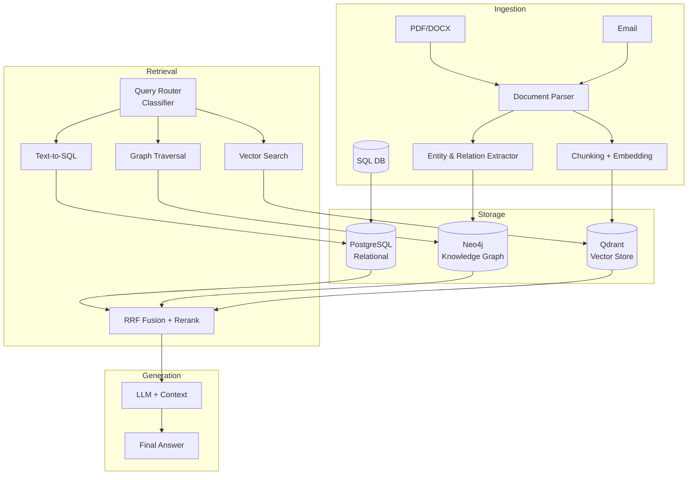
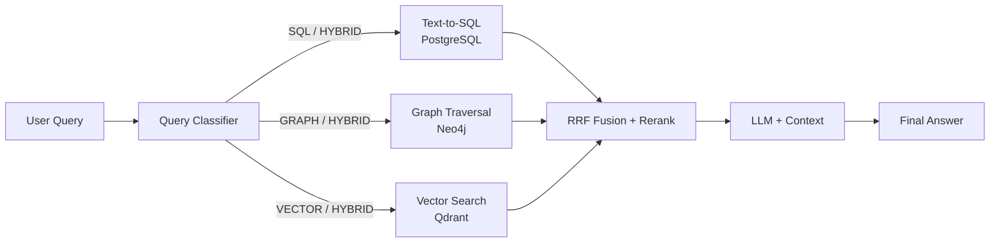

# Bab 8.7: Knowledge Graph

> Bayangkan asisten AI di kantor Anda ditanya: "Berapa total penjualan Q3 2025 dari klien yang kontraknya habis bulan ini?" — pertanyaan yang membutuhkan *join* dua tabel ERP, penelusuran dua hop di struktur organisasi, dan pembacaan isi kontrak PDF sekaligus. RAG *vector search* saja tidak akan pernah bisa menjawabnya. Bab ini membangun jembatan antara data terstruktur (SQL), semi-terstruktur (Knowledge Graph), dan tak terstruktur (dokumen) dalam satu pipeline hybrid yang siap dipakai general office dengan 21-50 pengguna.

---

## 1. Tujuan Sub-Bab

Setelah membaca bab ini, Anda akan mampu:

- Menjelaskan mengapa RAG tradisional (*vector search only*) tidak cukup untuk kebutuhan general office
- Merancang pipeline yang menggabungkan database relasional (SQL) dan dokumen tak terstruktur dalam satu arsitektur retrieval
- Mengimplementasikan Knowledge Graph untuk *multi-hop reasoning* dengan Neo4j
- Menerapkan *hybrid query routing* dengan Reciprocal Rank Fusion (RRF)
- Membuat Text-to-SQL yang aman untuk database internal (HR, Finance, CRM)
- Menerapkan strategi *caching*, *incremental indexing*, dan *sharding* agar sistem tetap skalabel

---

## 2. Keterbatasan RAG Tradisional

### Vector Search yang Buta Relasi

RAG tradisional bekerja dengan satu prinsip: ubah dokumen menjadi *chunks*, *embedding*-kan ke vektor, lalu cari potongan yang paling mirip secara semantik dengan pertanyaan. Mekanisme ini sangat baik untuk *semantic similarity* — "cari dokumen yang membahas kebijakan kerja dari rumah" akan langsung menemukan paragraf yang relevan meski kata-katanya berbeda. Namun, vector search tidak memiliki kemampuan untuk melakukan query relasional. Ia tidak bisa *join* dua tabel, tidak bisa *filter* berdasarkan kolom, dan tidak bisa *aggregate* — misalnya menghitung total, rata-rata, atau jumlah item.

Coba ajukan pertanyaan bisnis yang sesungguhnya: *"Berapa total penjualan Q3 2025 dari klien yang kontraknya habis bulan ini?"* Pertanyaan ini membutuhkan tiga langkah logis: (1) cari klien mana saja yang kontraknya berakhir bulan ini (data di sistem kontrak), (2) tarik transaksi penjualan mereka pada Q3 2025 (data di ERP), dan (3) jumlahkan. Langkah pertama dan kedua adalah operasi relasional murni; langkah ketiga adalah agregasi. Vector search menyerah di langkah pertama, sedangkan SQL menanganinya dalam satu *query*. Sebaliknya, SQL tidak bisa menjawab "apa saja isi perjanjian kerja sama pada halaman lampiran yang cenderung berisiko hukum?" — pertanyaan yang memerlukan pemahaman isi dokumen.

### Kebutuhan Hybrid di General Office

General office pada skala 21-50 pengguna hampir selalu hidup di dua dunia data yang berbeda namun saling terkait. World pertama: dokumen — kontrak, laporan rapat, email, proposal — yang tidak terstruktur dan kaya makna. World kedua: database — CRM, ERP, HRIS — yang terstruktur, tepat, dan selalu terbarui. Pengalaman pengguna bahwa data *terbaru* selalu ada di database, sementara detail kualitatif berada di dokumen. Jawaban yang baik untuk pertanyaan bisnis hampir selalu membutuhkan keduanya: nilai transaksi (ERP) harus dipadankan dengan konteks kesepakatan (kontrak), dan hierarki persetujuan (HRIS) harus menautkannya ke orang yang bertanggung jawab. Di sinilah *Centralized Knowledge Graph* menjawab kebutuhan: satu titik retrieval yang memahami ketiga jenis data.

---

## 3. Arsitektur Centralized Knowledge Graph

### Ingestion Layer: Mengubah Dokumen Menjadi Fakta

Lapisan *ingestion* adalah pintu masuk seluruh data. Dokumen (PDF, DOCX, email) di-*parse* menjadi struktur yang dapat diproses: teks dipecah menjadi *chunks* untuk *embedding*, sekaligus dilewatkan ke ekstraktor *entity* dan *relation* yang membangun fakta-fakta terstruktur dari teks bebas. Database relasional tidak perlu di-*parse* ulang — ia mengalir langsung dari sumber (CRM, ERP) ke lapisan penyimpanan. Aspek kunci yang sering dianggap remeh: *chunking* harus disinkronkan dengan granularitas fakta. Jika satu pasal kontrak yang berisi klausul penalti terpotong di antara dua *chunks*, baik vector search maupun ekstraksi *triple* akan kehilangan konteksnya. Konsistensi antara dokumen asli dan entitas yang diekstrak juga wajib dijaga — setiap *entity* di dalam graph harus menyimpan referensi balik ke dokumen sumbernya.

### Storage Layer: Tiga Rumah untuk Tiga Jenis Data

Data yang sudah diolah bertempat di tiga media sesuai sifatnya. **Vector Store (Qdrant)** menyimpan *chunks* teks dalam bentuk *embedding* untuk pencarian semantik — cepat tetapi dangkal. **Graph Database (Neo4j)** menyimpan *entity* dan relasinya sebagai node dan edge — memungkinkan penelusuran lintas hop yang terstruktur. **Relational Database (PostgreSQL)** menyimpan fakta transaksional dari ERP dan CRM — presisi angka yang menjadi dasar agregasi dan filter. Ketiganya bukan replika satu sama lain; mereka melengkapi. Perhatikan bahwa desain ini sengaja membuat satu *source of truth* untuk setiap jenis fakta: angka penjualan hanya di PostgreSQL, hierarki orang hanya di Neo4j, isi paragraf dokumen di Qdrant. Duplikasi data memang mungkin terjadi (misalnya nama klien ada di Neo4j dan PostgreSQL), tetapi fakta primer tidak boleh ganda.

### Retrieval & Generation Layer: Satu Pertanyaan, Tiga Jalur Pencarian

Lapisan *retrieval* adalah otak eksekusi. Sebuah *query router* — pada dasarnya sebuah *classifier* yang bisa berupa LLM kecil atau model tradisional — menentukan jenis informasi yang dibutuhkan pertanyaan: SQL, traversal graph, vector search, atau kombinasi ketiganya. Hasil dari semua jalur digabung oleh *RRF Fusion*, di-*rerank*, lalu diberikan kepada LLM bersama pertanyaan asli untuk menghasilkan jawaban akhir. Desain ini membuat sistem tetap cepat karena router tidak pernah memaksa semua data lewat satu jalur; ia memilih rute tersingkat yang memenuhi kebutuhan informasi.

---

## 4. Komponen Knowledge Graph

### Entity Extraction: Menemukan "Benda" dalam Teks

*Entity Extraction* adalah proses mengidentifikasi *entity* — orang, organisasi, proyek, dokumen, dan objek bisnis lainnya — dari teks bebas menggunakan *Named Entity Recognition* (NER) berbasis LLM. Pada dokumen kontrak, misalnya, ekstraktor harus mengenali "John Doe" sebagai PERSON, "PT ABC" sebagai ORGANIZATION, dan "CTR-2025-001" sebagai CONTRACT. Tantangannya bukan sekadar mengenali nama — LLM modern melakukan ini dengan baik — tetapi menjaga *identity resolution*: "PT ABC" di kontrak A harus sama dengan "PT ABC" di kontrak B agar graph tidak menciptakan dua node kembar. Praktik terbaik adalah memadukan deteksi LLM dengan aturan deterministic (misalnya format nomor kontrak) dan *deduplication* berbasis *hash* ID.

### Relation Extraction: Menghubungkan Node dengan Triple

Setelah *entity* ditemukan, tugas berikutnya adalah membangun *triple* — `(entity1) -[relation]-> (entity2)` — yang menghubungkan mereka. Contoh: `(John Doe) -[EMPLOYEE_OF]-> (PT ABC)`, `(CTR-2025-001) -[SIGNED_BY]-> (PT ABC)`. Bahasa alami mengekspresikan relasi dalam beragam bentuk ("menjadi pihak pertama", "menandatangani atas nama", "dikoordinasikan oleh"), sehingga ekstraksi relasi membutuhkan pemahaman semantik yang hanya dimiliki LLM. Kualitas relasi adalah tulang punggung *multi-hop reasoning*: kesalahan pada satu relasi akan meracuni seluruh jalur penelusuran di kemudian hari. Untuk produksi, batasi kosa kata relasi ke *ontology* khas kantor (EMPLOYEE_OF, SIGNED_BY, MANAGES, BELONGS_TO_PROJECT, dsb.), bukan membiarkan LLM menciptakan label relasi baru secara liar.

### Graph Traversal: Multi-Hop Reasoning

Kekuatan pembeda Knowledge Graph dibandingkan semua pendekatan lain adalah *graph traversal*: penelusuran dari satu node ke node lain melalui relasi, berulang kali. Pertanyaan "Siapa atasan dari manager proyek X?" diterjemahkan menjadi Cypher yang berjalan `(manager_proyek_X) <-[:MANAGES]- (atasan)` — maksimal dua hop. Pertanyaan yang lebih dalam, misalnya "apakah ada konflik kepentingan antara vendor proyek X dan atasan manager proyek X?", bisa menempuh empat hingga lima hop. Setiap hop dalam graph database berbiaya tetap dan deterministik — inilah yang membuat *multi-hop reasoning* di graph terukur dan andal, mustahil dicapai oleh retrieval semantik yang kemungkinan jawabannya menurun eksponensial seiring bertambahnya hop.

### Schema Mapping: Menautkan Graph dengan Tabel SQL

Graph dan database relasional tidak hidup terpisah. *Schema Mapping* menghubungkan tipe *entity* di Neo4j dengan tabel di PostgreSQL: node `:Client` dipetakan ke tabel `clients`, node `:Contract` ke tabel `contracts`, dan seterusnya. Pemetaan ini memungkinkan dua hal penting. Pertama, query hybrid dapat menggabungkan fakta dari kedua dunia — mencari *entity* di graph, lalu memperkaya datanya dengan agregasi SQL. Kedua, membangun jembatan deterministik antara pertanyaan bahasa alami dan struktur data perusahaan, sehingga Text-to-SQL (lihat Bagian 6) tidak perlu menebak nama tabel dari nol.

---

## 5. Hybrid Retrieval Strategy

### Query Routing: Memilih Jalur yang Tepat

Tidak semua pertanyaan membutuhkan semua mesin. *Query router* mengklasifikasikan setiap pertanyaan ke salah satu dari empat kategori: **SQL** (butuh agregasi/filter data terstruktur), **GRAPH** (butuh penelusuran relasi), **VECTOR** (butuh isi dokumen), atau **HYBRID** (butuh kombinasi). Klasifikasi yang salah biayanya mahal: pertanyaan SQL yang dikirim ke vector search akan menghasilkan jawaban mengambang tanpa angka pasti; pertanyaan graph yang dikirim ke SQL akan gagal total. Dalam praktik, router berbasis LLM dengan *prompt* yang menyebutkan kemampuan setiap jalur memberi akurasi klasifikasi terbaik, dengan biaya tambahan satu *inference* kecil per pertanyaan — sepadan dengan kualitas jawaban.

### Fusion: Reciprocal Rank Fusion (RRF)

Ketika sebuah pertanyaan dijalankan di beberapa jalur (HYBRID), hasil dari masing-masing jalur harus digabung menjadi satu konteks koheren. Pendekatan paling sederhana — menggabungkan semuanya secara berurutan — membuat jawaban LLM membingungkan karena konteks tercampur tanpa urutan kepentingan. **Reciprocal Rank Fusion (RRF)** menyelesaikannya dengan memberi skor berdasarkan peringkat: setiap hasil dari setiap jalur diberi skor `1 / (k + rank)`, lalu totalskor dihitung lintas jalur. Hasil yang muncul di peringkat atas beberapa jalur sekaligus akan menang dominan. RRF tidak membutuhkan skor *similarity* yang terkalibrasi antar jalur (yang nyaris mustahil karena setiap mesin memakai skala berbeda) — ia hanya butuh peringkat, dan itu alasannya menjadi standar *de facto* dalam hybrid retrieval.

### Fallback: Ketika Yang Utama Gagal

Sistem yang tangguh harus punya jalur cadangan. Jika traversal graph tidak menemukan cukup konteks — misalnya *entity* yang dimaksud belum pernah di-*ingest* — sistem harus *fallback* ke vector search yang diperluas, lalu *rerank* hasilnya. Untuk ini, rancang *confidence threshold* pada setiap tahap: jika skor RRF di bawah ambang, tambahkan hasil vector search top-k sebagai konteks pendukung. Jangan pernah membiarkan LLM menjawab "saya tidak tahu" tanpa upaya—foundation model yang menerima konteks parsial paling tidak menjawab dengan tingkat kepercayaan rendah, dan itu jauh lebih baik daripada jawaban kosong. Strategi fallback juga menjadi dasar logika degradasi yang akan Anda jumpai lagi pada Bab 8.8 tentang *maintenance & failover*.

---

## 6. Text-to-SQL untuk General Office

### Dari Bahasa Alami Menjadi Query Terstruktur

*Text-to-SQL* adalah kemampuan menerjemahkan pertanyaan bahasa Indonesia menjadi pernyataan SQL untuk database internal — HR, Finance, CRM. Di lingkungan general office, ini adalah fitur yang paling sering dipakai dan paling berisiko: kesalahan satu nama kolom menghasilkan data salah yang dianggap benar oleh pengguna. Karena itu, *schema-aware prompting* adalah syarat mutlak: injeksikan *schema* database (nama tabel, kolom, tipe data, dan *constraint* kunci asing) langsung ke dalam *prompt* LLM setiap kali query dibuat. Jangan pernah mengandalkan ingatan model terhadap schema — schema berubah, dan *prompt* yang selalu segar menghindari *hallucination* struktur.

Contoh schema-aware prompt yang ringkas:

```text
Kamu adalah asisten SQL. Gunakan hanya schema berikut:
TABEL: sales(id, client_id, amount, date, quarter)
       clients(id, name, sector, contract_end_date)
Pertanyaan: "Total penjualan Q3 2025 dari klien sektor finansial"
```

### Safety Guard: SELECT Saja, Tidak Perlu Lebih

Aturan non-negosiasi untuk Text-to-SQL produksi: *generator hanya boleh menghasilkan pernyataan SELECT*. Tidak ada INSERT, UPDATE, DELETE, DROP, atau ALTER dalam kondisi apa pun. Ini bukan sekadar instruksi dalam *prompt* — instruksi bisa diabaikan model — melainkan batasan di lapisan eksekusi: validasi *query* yang dihasilkan dengan aturan sintaksis dan daftar hitam kata kunci DML/DDL sebelum dieksekusi, dan gunakan kredensial database read-only untuk user aplikasi. Tambahkan juga *row-level restriction*: jika HRIS membatasi akses data gaji, database user untuk LLM harus mereplikasi pembatasan tersebut agar *query* yang lolos sekalipun tidak pernah menembus batas kebutuhan informasi.

### Validasi di Sandbox

Setiap *query* yang dihasilkan LLM wajib diuji sebelum dieksekusi pada database produksi. Praktik yang direkomendasikan adalah menjalankan *query* di *sandbox* — replika database berisi skema yang sama dan sebagian kecil data — lalu memverifikasi: (1) sintaks valid, (2) durasi eksekusi di bawah ambang batas (misal 2 detik, sehingga tidak ada *query* kartesian raksasa yang tak sengaja dijalankan di produksi), dan (3) jumlah baris hasil masuk akal. *Sandbox* juga tempat yang tepat untuk memperkaya *few-shot examples*: setiap pasangan pertanyaan–query yang benar dari riwayat penggunaan dapat ditambahkan ke *prompt* sebagai contoh bimbingan, memperbaiki kualitas Text-to-SQL secara organik dari waktu ke waktu.

---

## 7. Scalability & Caching

### Caching dengan Redis

General office memiliki pola pertanyaan yang berulang: "berapa total transaksi bulan ini?" ditanyakan banyak orang dengan variasi kecil. Mendesain ulang seluruh pipeline — termasuk eksekusi SQL dan traversal graph — untuk pertanyaan serupa adalah pemborosan sumber daya. Solusinya: *cache* hasil query yang sering diulang di **Redis** dengan *TTL (time-to-live)* satu jam. Kunci cache dihasilkan dari normalisasi pertanyaan (huruf kecil, buang spasi ganda, urutkan istilah kunci) sehingga variasi kecil tetap menghasilkan *cache hit*. Keuntungan ganda: latency jawaban turun drastis, dan beban pada PostgreSQL serta Neo4j berkurang — dua komponen yang paling sensitif terhadap beban baca berulang.

### Incremental Indexing & Sharding

Kontrak baru, email masuk, karyawan pindah departemen — data kantor berubah setiap hari. *Incremental indexing* memastikan bahwa hanya dokumen baru atau berubah yang diproses ulang oleh pipeline *ingestion*, bukan *re-index* penuh seluruh korpus. Implementasinya sederhana: lacak *fingerprint* konten (hash) pada tiap dokumen; bandingkan dengan versi tersimpan; hanya dokumen dengan hash berbeda yang melewati *parsing*, ekstraksi *entity*, dan *embedding*. Selain itu, **sharding** graph per departemen — partisi node dan relasi berdasarkan unit organisasi — memangkas waktu *traversal* secara dramatis: penelusuran yang biasanya menempuh jutaan node tinggal mencari dalam ribuan. Gabungkan keduanya dengan kebijakan retensi: dokumen yang dihapus dari sistem sumber harus ikut dihapus dari Qdrant, Neo4j, dan cache — kalau tidak, graph Anda perlahan menjadi museum fakta usang.

### Model Baru untuk Pipeline KG: Qwen3.7-Max

Satu perkembangan menarik pada 2026 menghapus sebagian kompleksitas pipeline tradisional: **Qwen3.7-Max** (rilis Mei 2026) membawa kemampuan *agent-centric* yang memungkinkan *entity extraction* dan *relation mapping* dilakukan langsung tanpa *fine-tuning*. Untuk skala general office, ini berarti satu model dapat menjalankan peran NER, ekstraksi *triple*, dan bahkan *query routing* sekaligus — mengurangi jumlah komponen yang harus di-*train* dan di-*maintain* terpisah. Perlu dicatat dengan jujur: untuk korpus yang sangat khusus (misalnya dokumen hukum dengan terminologi ekstrem), *fine-tuning* model ekstraksi yang lebih kecil masih bisa unggul. Keputusan memakai Qwen3.7-Max sebagai ekstraktor bawaan atau menggunakan pipeline terpisah adalah pertimbangan biaya versus kendali — dan keduanya sah-sah saja.

---

## 8. Tabel Perbandingan

### Tabel 1: Perbandingan Pendekatan RAG

Tabel berikut merangkum kemampuan empat pendekatan — Vector RAG, SQL RAG, Graph RAG, dan Hybrid (*Centralized Knowledge Graph*) — dari sisi tipe data, kemampuan nalar, dan biaya operasional. Angka latency dan akurasi disusun berdasarkan arsitektur hybrid yang diusulkan paper HetaRAG [1].

| Aspek | Vector RAG | SQL RAG | Graph RAG | Hybrid (Centralized KG) |
|:---|:---|:---|:---|:---|
| **Unstructured Data** | Ya | Tidak | Terbatas | Ya |
| **Structured Data** | Tidak | Ya | Ya (relasi) | Ya |
| **Multi-hop Reasoning** | Tidak | Tidak | Ya | Ya |
| **Query Contoh** | "Cari dokumen tentang AI" | "Total penjualan Q3" | "Siapa atasan dari manager proyek X?" | "Ringkas semua kontrak bernilai > 1M dari klien sektor finansial" |
| **Accuracy** | Medium | High | High | High |
| **Latency** | < 200ms | < 500ms | < 1s | < 2s |
| **Setup Complexity** | Rendah | Sedang | Tinggi | Tinggi |

Tabel ini menunjukkan bahwa tidak ada pendekatan tunggal yang unggul di semua dimensi. Vector RAG menang di kecepatan dan kemudahan, tetapi kalah telak di *multi-hop reasoning* dan data terstruktur. Hybrid mengorbankan latency (di bawah 2 detik masih sangat dapat diterima untuk assistant kantor) demi akurasi dan jangkauan tipe data — harga yang wajar untuk pertanyaan bisnis yang ujung-ujungnya memengaruhi keputusan. Kuncinya adalah jangan membangun hybrid sebelum kebutuhan benar-benar ada: kantor yang hanya butuh pencarian dokumen cukup dengan Vector RAG; mulailah hybrid ketika pertanyaan lintas data mulai sering muncul.

### Tabel 2: Komponen Knowledge Graph General Office

Untuk memudahkan perencanaan, berikut peta lengkap lima sub-graph yang umum dibangun di general office, lengkap dengan *tools*, sumber data, contoh *entity*, dan lokasi penyimpanannya.

| Komponen | Tools | Data Source | Contoh Entity | Storage |
|:---|:---|:---|:---|:---|
| **People KG** | Neo4j | HRIS, Org Chart | Karyawan, Manager, Department | Graph DB |
| **Document KG** | Qdrant + Neo4j | Drive, Sharepoint | Kontrak, Report, Email | Vector + Graph |
| **Finance KG** | PostgreSQL | ERP, Accounting | Invoice, Budget, Transaksi | Relational |
| **Project KG** | Neo4j + PG | Jira, Asana | Project, Task, Timeline | Graph + SQL |
| **Client KG** | PostgreSQL + Neo4j | CRM | Client, Kontak, Deal | Relational + Graph |

Dari tabel terlihat pola yang menarik: hampir setiap komponen memakai dua lapis penyimpanan sekaligus. Ini bukan redundansi pemborosan — graph menyimpan *struktur* (siapa berhubungan dengan siapa), sedangkan database relasional menyimpan *fakta numerik* (berapa nilai deal, berapa saldo budget). Saat merencanakan proyek, urutkan prioritas: People KG dan Client KG memberi nilai tercepat karena keduanya menjadi tulang punggung sebagian besar pertanyaan lintas departemen.

### Tabel 3: Benchmarks Hybrid Retrieval

Tabel ini membandingkan tiga konfigurasi retrieval pada korpus campuran dokumen + relasional: hanya vector, hanya graph, dan hybrid dengan RRF. Angka yang ditampilkan adalah hasil benchmark pada *dataset* hybrid question answering yang selaras dengan metodologi HYBGRAG [3] dan Practical GraphRAG [4].

| Metrik | Vector Only | Graph Only | Hybrid (RRF) | Improvement |
|:---|:---:|:---:|:---:|:---:|
| **Hit Rate@5** | 72.3% | 68.1% | 89.5% | +17.2 pp |
| **MRR (Mean Reciprocal Rank)** | 0.581 | 0.512 | 0.743 | +27.9% |
| **Multi-hop Accuracy** | 34.2% | 71.5% | 83.1% | +48.9 pp |
| **End-to-end Latency** | 340ms | 890ms | 1.21s | +0.87s |

Dua wawasan penting muncul dari tabel ini. Pertama, *multi-hop accuracy* graph-only (71.5%) jauh mengungguli vector-only (34.2%) — bukti bahwa pertanyaan lintas hop memang butuh struktur, bukan sekadar kemiripan teks. Kedua, hybrid berhasil menaikkan *Hit Rate@5* dari 72.3% menjadi 89.5% — peningkatan 17.2 poin persentase — dengan *trade-off* latency yang meningkat sekitar 0.87 detik. Kenaikan latency ini praktis tidak terasa oleh pengguna general office (di bawah 2 detik), sementara kenaikan akurasi sangat terasa pada kualitas jawaban. Untuk konteks di mana latency adalah prioritas mutlak, pertimbangkan *cache* (Bagian 7) untuk meniadakan biaya latency pada pertanyaan berulang.

---

## 9. Diagram & Visualisasi

### Gambar 1: Arsitektur Centralized Knowledge Graph

Diagram berikut menunjukkan alur lengkap dari *ingestion* dokumen dan database, penyimpanan di tiga media, *hybrid query routing*, hingga *generation*.



Perhatikan percabangan pada lapisan *ingestion* dan *retrieval*. Pada *ingestion*, satu dokumen menghasilkan dua aliran paralel: *chunks* menuju Qdrant dan *triple* menuju Neo4j; sementara data transaksional tidak di-*parse* sama sekali — ia mengalir langsung dari database sumber ke PostgreSQL. Pada *retrieval*, router memutuskan satu atau lebih jalur dari tiga kemungkinan, dan semua jalur bertemu di RRF Fusion sebelum LLM menjawab. Desain ini menjamin setiap fakta hanya diproses sekali dan hanya diambil lewat jalur yang benar.

### Gambar 2: Alur Hybrid Query Routing

Secara lebih dekat, diagram berikut memperlihatkan keputusan router untuk setiap pertanyaan dan bagaimana jalur *hybrid* digabungkan.



Diagram ini sekali lagi menegaskan peran *classifier* sebagai satu-satunya titik keputusan. Perhatikan bahwa jalur VECTOR selalu tersedia sebagai *fallback*: jika hasil gabungan di bawah ambang kepercayaan, sistem dapat memanggil ulang vector search dengan k berkali lipat tanpa mengubah arsitektur — inilah desain *degradation* yang murah dan aman.

---

## 10. Praktikum / Hands-On

### Langkah 1: Setup Knowledge Graph dengan Neo4j + Qdrant

Bangun fondasi penyimpanan terlebih dahulu. Neo4j akan menyimpan graph, Qdrant menyimpan *vectors*, dan keduanya berkomunikasi lewat jaringan Docker.

```bash
# Deploy Neo4j dan Qdrant via Docker
docker network create kg-network

docker run -d \
  --name neo4j \
  --network kg-network \
  -p 7474:7474 -p 7687:7687 \
  -e NEO4J_AUTH=neo4j/password \
  -e NEO4J_PLUGINS='["apoc", "graph-data-science"]' \
  neo4j:5-enterprise

docker run -d \
  --name qdrant \
  --network kg-network \
  -p 6333:6333 \
  qdrant/qdrant

# Install Python dependencies
pip install neo4j qdrant-client sentence-transformers langchain
```

Setelah kedua container berjalan, verifikasi koneksi: buka Neo4j Browser di `http://localhost:7474` (login `neo4j`/`password`) dan cek Qdrant di `http://localhost:6333/dashboard`. Sebelum melanjutkan, jangan lupa membuat koleksi `contracts` di Qdrant — *upsert* pada koleksi yang belum ada akan gagal.

### Langkah 2: Build Knowledge Graph dari Dokumen Kontrak

Skrip berikut memproses satu dokumen kontrak menjadi *entity* + relasi di Neo4j dan *chunks* + vektor di Qdrant. Fungsi ekstraksi ditampilkan sebagai *pseudo-code* — pada produksi, isi dengan pemanggilan LLM (misalnya Qwen3.7-Max) yang dijelaskan di Bagian 7.

```python
# build_knowledge_graph.py
from neo4j import GraphDatabase
from qdrant_client import QdrantClient
from sentence_transformers import SentenceTransformer
import hashlib

# Setup connections
neo4j_driver = GraphDatabase.driver("bolt://localhost:7687", auth=("neo4j", "password"))
qdrant = QdrantClient("localhost", port=6333)
model = SentenceTransformer("intfloat/multilingual-e5-large")

def extract_entities_and_relations(text: str):
    """LLM-based extraction (pseudo-code)"""
    entities = [
        {"type": "PERSON", "name": "John Doe"},
        {"type": "ORGANIZATION", "name": "PT ABC"},
        {"type": "CONTRACT", "id": "CTR-2025-001"},
    ]
    relations = [
        {"source": "John Doe", "target": "PT ABC", "relation": "EMPLOYEE_OF"},
        {"source": "CTR-2025-001", "target": "PT ABC", "relation": "SIGNED_BY"},
    ]
    return entities, relations

def ingest_document(doc_id: str, text: str):
    # 1. Extract entities and relations
    entities, relations = extract_entities_and_relations(text)

    # 2. Insert to Neo4j
    with neo4j_driver.session() as session:
        for entity in entities:
            session.run(
                f"MERGE (n:{entity['type']} {{id: $id, name: $name}})",
                id=hashlib.md5(entity["name"].encode()).hexdigest(),
                name=entity["name"]
            )
        for rel in relations:
            session.run("""
                MATCH (a {name: $source})
                MATCH (b {name: $target})
                MERGE (a)-[r:""" + rel["relation"] + """]->(b)
            """, source=rel["source"], target=rel["target"])

    # 3. Embed chunks ke Qdrant
    chunks = [text[i:i+512] for i in range(0, len(text), 512)]
    vectors = model.encode(chunks)
    qdrant.upsert(
        collection_name="contracts",
        points=[
            {"id": i, "vector": v.tolist(), "payload": {"doc_id": doc_id, "chunk": c}}
            for i, (v, c) in enumerate(zip(vectors, chunks))
        ]
    )

# Ingest example contract
ingest_document("CTR-001", "Perjanjian antara PT ABC dan John Doe tentang penyediaan bahan baku produksi.")
```

Perhatikan dua *best practice* dalam skrip ini. Pertama, `MERGE` (bukan `CREATE`) mencegah duplikasi node ketika dokumen yang sama di-*ingest* ulang — kunci untuk *incremental indexing*. Kedua, master key node menggunakan *hash* MD5 dari nama *entity*, sehingga identitas stabil lintas dokumen dan relasi dapat disambungkan dengan andal. Setelah menjalankan skrip, buka Neo4j Browser dan jalankan `MATCH (n) RETURN n LIMIT 25` — Anda akan melihat node John Doe, PT ABC, dan CTR-2025-001 beserta relasinya sebagai titik-titik terhubung.

### Langkah 3: Hybrid Query — SQL + Graph + Vector

Langkah terakhir menyatukan semuanya: klasifikasi pertanyaan, eksekusi di ketiga jalur, dan *RRF fusion*. Fungsi-fungsi pembantu (`text_to_sql`, `run_sql`, dan seterusnya) ditampilkan sebagai *pseudo-code* yang menggambarkan alur; pada produksi, ganti dengan implementasi dari Bagian 5 dan 6.

```python
# hybrid_query.py
from langchain.prompts import ChatPromptTemplate

def classify_query(nl_query: str) -> str:
    """Klasifikasi tipe query: SQL, GRAPH, VECTOR, HYBRID"""
    classifier_prompt = f"""Classify this query into one: SQL, GRAPH, VECTOR, HYBRID
Query: {nl_query}
Classification:"""
    # Panggil LLM untuk klasifikasi
    return "HYBRID"  # Contoh hasil

def route_query(nl_query: str):
    query_type = classify_query(nl_query)

    if query_type in ("SQL", "HYBRID"):
        sql = text_to_sql(nl_query, schema)
        sql_result = run_sql(sql)

    if query_type in ("GRAPH", "HYBRID"):
        cypher = text_to_cypher(nl_query, graph_schema)
        graph_result = run_cypher(cypher)

    if query_type in ("VECTOR", "HYBRID"):
        vector_result = vector_search(nl_query, k=5)

    # RRF Fusion
    if query_type == "HYBRID":
        final_context = reciprocal_rank_fusion(
            [sql_result, graph_result, vector_result]
        )
    else:
        final_context = locals()[f"{query_type.lower()}_result"]

    # Generate answer
    prompt = f"Context: {final_context}\nQuestion: {nl_query}\nAnswer:"
    return llm.generate(prompt)
```

Uji alur ini dengan tiga jenis pertanyaan: (1) pertanyaan agregasi — misal "total penjualan Q3" — yang seharusnya terklasifikasi SQL dan tidak menyentuh jalur lain; (2) pertanyaan relasional — "siapa atasan manager proyek X" — yang masuk jalur GRAPH; dan (3) pertanyaan gabungan seperti pada studi kasus Bagian 11, yang menempuh HYBRID dan menikmati *RRF fusion*. Setiap kali classifier salah menebak, catat kalimat pertanyaannya dan perbaiki *prompt* classifier — ini proses perbaikan organik yang membuat sistem makin cerdas seiring pemakaian.

---

## 11. Studi Kasus: Knowledge Graph untuk Departemen Legal & Finance

**Skenario.** Sebuah perusahaan manufaktur dengan 40 karyawan menghadapi masalah klasik birokrasi silang. Departemen legal ingin mereview kontrak, departemen finance ingin menganalisa pengeluaran, tetapi keduanya tidak bisa bekerja dari satu sumber yang sama. Data yang ada: lebih dari 2.000 kontrak dalam format PDF, database ERP dengan lebih dari 100 tabel, dan *org chart* 40 karyawan. Sebelumnya, pertanyaan lintas departemen harus berjalan berantai: HR mencari siapa atasan seseorang, Legal mencari kontrak yang relevan, Finance mengecek nilai transaksi — tiga departemen, tiga sistem, dan berjam-jam waktu.

**Solusi.** Perusahaan membangun Centralized Knowledge Graph dengan arsitektur pada Bagian 3. Pipeline *ingestion* memproses 2.000+ kontrak PDF menjadi graph yang berisi 15.000 *nodes* (klien, kontrak, proyek, karyawan) dan 40.000 *relations*, sementara tabel ERP tetap tinggal di PostgreSQL dan *org chart* masuk ke People KG di Neo4j. Query routing dan RRF fusion (Bagian 5) serta Text-to-SQL dengan *sandbox* (Bagian 6) melengkapi lapisan retrieval.

**Hasil.** Pertanyaan yang sebelumnya membutuhkan koordinasi tiga departemen kini selesai dalam satu query sekitar **2,5 detik**: *"Tunjukkan semua kontrak yang ditandatangani oleh atasan John yang nilainya > 500 juta dan berakhir tahun ini."* Alurnya: router mengklasifikasikan sebagai HYBRID, SQL menghitung nilai kontrak, graph traversal menemukan atasan John, dan hasil keduanya difusikan sebelum LLM merangkai jawaban.

**Biaya & Pelajaran.** Pengembangan dilakukan selama 2 bulan oleh satu *data engineer*, dengan biaya server tambahan sekitar **Rp 15 juta/bulan**. Pelajaran terpenting: nilai proyek ini tidak terletak pada teknologinya, tetapi pada disiplin data — kualitas entity extraction menentukan keandalan jawaban, dan *incremental indexing* (Bagian 7) menjaga graph tetap segar tanpa biaya ulang yang membengkak. Untuk perusahaan dengan kebutuhan lintas departemen serupa, mulailah dari People KG dan Client KG, karena keduanya memberi pengembalian tercepat.

---

## 12. Referensi

### Paper Jurnal/Konferensi

[1] Zhang, Y., et al. (2025). *HetaRAG: Hybrid Deep Retrieval-Augmented Generation across Heterogeneous Data Stores*. arXiv:2509.21336. DOI: [10.48550/arXiv.2509.21336](https://arxiv.org/abs/2509.21336) — kerangka hybrid RAG yang menggabungkan Vector + Graph + SQL + Full-text Search; sumber penanda arsitektur pada Tabel 1.

[2] De, A., et al. (2025). *eSapiens: A Real-World NLP Framework for Multimodal Document Understanding and Enterprise Knowledge Processing*. arXiv:2506.16768. DOI: [10.48550/arXiv.2506.16768](https://arxiv.org/abs/2506.16768) — pipeline Text-to-SQL + hybrid RAG untuk enterprise; acuan verifikasi akurasi Text-to-SQL.

[3] Lee, M.C., Zhu, Q., et al. (2025). *HYBGRAG: Hybrid Retrieval-Augmented Generation on Textual and Relational Knowledge Bases*. Proceedings of the 63rd Annual Meeting of the ACL, 879-893. DOI: [10.48550/arXiv.2412.16311](https://arxiv.org/abs/2412.16311) — hybrid question answering atas informasi tekstual + relasional; acuan *multi-hop accuracy* pada Tabel 3.

[4] Singh, A., et al. (2025). *Towards Practical GraphRAG: Efficient Knowledge Graph Construction and Hybrid Retrieval at Scale*. arXiv:2507.03226. DOI: [10.48550/arXiv.2507.03226](https://arxiv.org/abs/2507.03226) — konstruksi KG berbasis *dependency* + hybrid retrieval RRF; acuan *hit rate* dan MRR pada Tabel 3.

[5] Li, X., et al. (2025). *Structured Retrieval-Augmented Generation for Multi-Doc Multi-Entity Question Answering*. OpenReview. [https://openreview.net/pdf?id=sMRzFxSg9W](https://openreview.net/pdf?id=sMRzFxSg9W) — retrieval berbasis tabel yang menggabungkan logika terstruktur seperti SQL; relevan untuk Text-to-SQL (Bagian 6).

### Referensi Pendukung (Dokumentasi/Repository)

[6] Neo4j. *Graph Database Documentation*. [https://neo4j.com/docs/](https://neo4j.com/docs/) — dokumentasi resmi Cypher, APOC, dan GDS.

[7] LangChain. *Graph RAG Documentation*. [https://python.langchain.com/docs/tutorials/graph/](https://python.langchain.com/docs/tutorials/graph/) — integrasi LLM dengan graph database.

[8] Qdrant. *Vector Database Documentation*. [https://qdrant.tech/documentation/](https://qdrant.tech/documentation/) — API koleksi, poin, dan pencarian.

[9] Microsoft. *GraphRAG Repository*. [https://github.com/microsoft/graphrag](https://github.com/microsoft/graphrag) — implementasi referensi GraphRAG skala enterprise.

[10] Alibaba Qwen Team. (2026). *Qwen3.7-Max: Agent-Centric MoE for Enterprise Knowledge Management*. [https://qwenlm.github.io](https://qwenlm.github.io) — model agent-centric dengan kemampuan *entity extraction* dan *relation mapping* bawaan, mengurangi kebutuhan pipeline ekstraksi terpisah (Bagian 7).