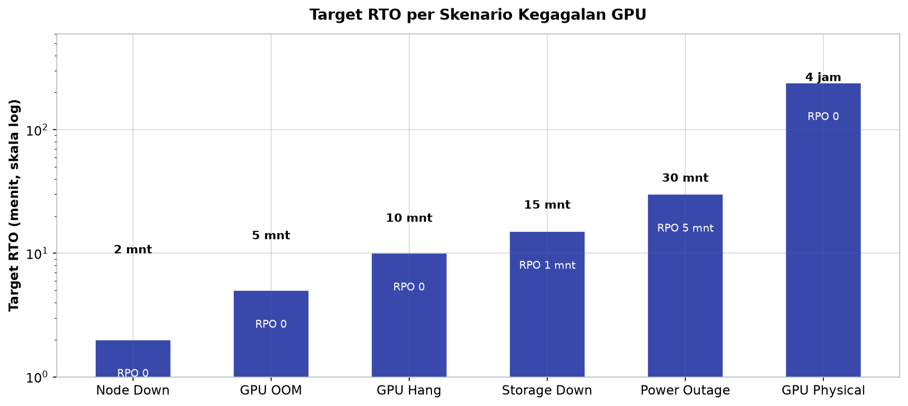
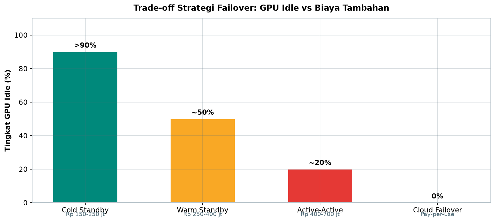
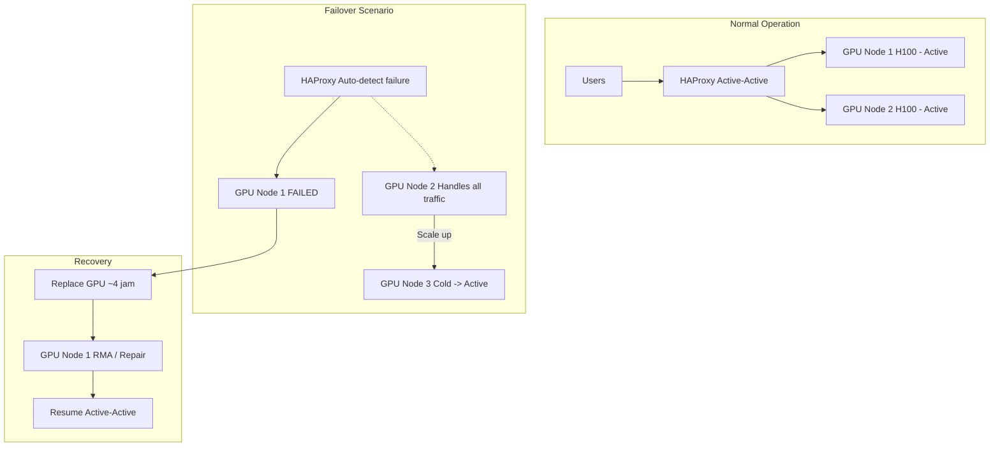
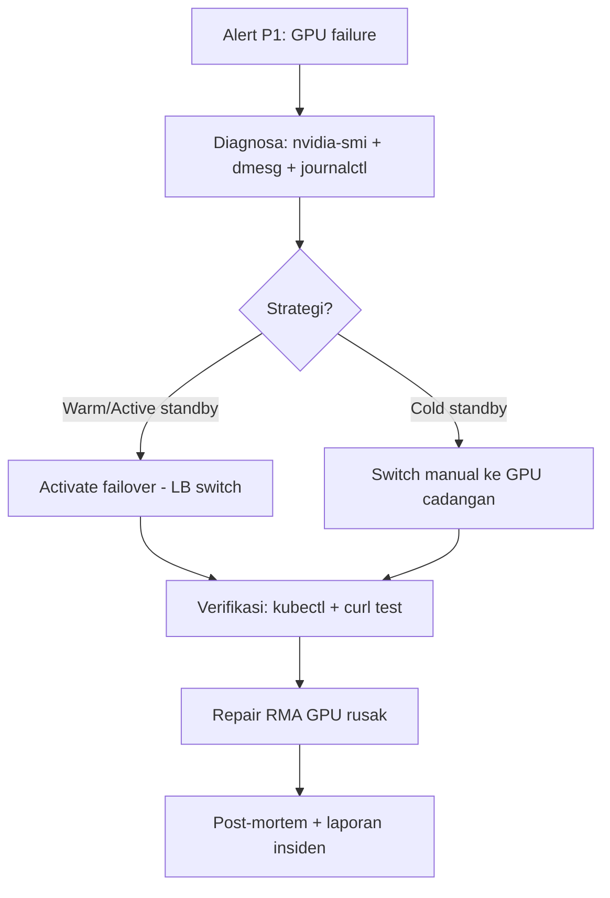

# Bab 8.8: Maintenance & Failover

> Pukul 10:30 pagi, jam sibuk kantor. Asisten AI tiba-tiba tidak menjawab, antrean permintaan menumpuk, dan panel monitoring menunjukkan suhu GPU yang melambung. Fan mati, *thermal shutdown*, satu node hilang dari cluster. Pertanyaan yang menentukan bukanlah "apakah itu terjadi?" — melainkan "berapa lama hingga layanan kembali?" Bab ini menyiapkan Anda menghadapi GPU yang mati di tengah jam kerja: skenario kegagalan, strategi failover, *runbook* langkah demi langkah, dan jadwal *preventive maintenance* yang mencegah insiden serupa terulang.

---

## 1. Tujuan Sub-Bab


Setelah membaca bab ini, Anda akan mampu:

- Mengidentifikasi enam skenario kegagalan GPU dan memperkirakan dampaknya pada operasional general office
- Membandingkan strategi *cold standby*, *warm standby*, dan *active-active* beserta biaya dan RTO-nya
- Menyusun Disaster Recovery Plan yang mencakup *snapshot*, *point-in-time recovery*, dan redundansi geografis
- Membangun *monitoring & alerting* berbasis Prometheus, Grafana, dan PagerDuty
- Menjalankan *runbook* pemulihan GPU hang hingga DR drill simulasi kegagalan
- Menyusun jadwal *preventive maintenance* bulanan untuk menekan frekuensi insiden

---

## 2. Skenario Kegagalan


### GPU Hang: Driver Crash dan Proses Stuck

Kegagalan paling umum dan paling ringan dampaknya. Proses inference *stuck* karena driver CUDA macet, atau vLLM tidak merespons tanpa alasan yang jelas. Gejalanya halus: `nvidia-smi` menjadi *timeout*, log inference berhenti bertambah, dan user mulai melaporkan jawaban yang tidak pernah selesai. Sayangnya, GPU hang sering dianggap "nanti juga sembuh sendiri" — padahal tanpa intervensi, antrean di vLLM akan terus menumpuk hingga server kehabisan memori. Prosedur yang benar: restart komponen yang hang — *container* vLLM di Kubernetes, atau bila perlu k3s-agent — lalu verifikasi GPU kembali responsif sebelum trafik dibuka.

### GPU OOM (Out of Memory)

*Out of Memory* terjadi ketika permintaan melebihi kapasitas VRAM: *batch size* terlalu besar, konteks yang diproses lebih panjang dari yang direncanakan, atau model baru tidak muat dalam GPU yang sama. Berbeda dengan hang, OOM selalu disertai jejak log yang jelas di vLLM — *error log* yang menyebutkan *exceeded memory* atau *CUDA out of memory*. Penanganannya dua lapis: jangka pendek, turunkan *batch size* dan restart pod; jangka panjang, perbaiki konfigurasi *max_model_len* dan *gpu_memory_utilization* agar sesuai kapasitas VRAM (lihat Bab 5 tentang inference). OOM yang berulang dalam seminggu adalah sinyal bahwa model dan GPU sudah tidak cocok.

### GPU Physical Failure: Fan Mati dan Thermal Shutdown

Ini skenario yang paling ditakuti: kerusakan fisik — fan berhenti berputar, *thermal throttle* berkepanjangan, atau GPU tidak lagi terdeteksi oleh sistem. Gejala awal biasanya muncul sebagai tren suhu yang terus naik di panel monitoring selama berminggu-minggu sebelum ambang *shutdown* tercapai. Ketika GPU gagal total, tidak ada perbaikan software yang bisa menyelamatkannya; satu-satunya jalan adalah penggantian unit (RMA) yang memakan waktu berjam-jam hingga berhari-hari. Inilah alasan *spare GPU* bukan kemewahan, melainkan komponen standar perencanaan kapasitas.

### Network Failure: Node Terputus dari Storage

Infrastruktur LLM general office bergantung pada jaringan yang menghubungkan node GPU dengan storage — NFS untuk RAG, MinIO untuk *snapshot* model, dan database. Ketika jaringan gagal, node GPU masih hidup secara fisik tetapi kehilangan akses ke data: RAG tidak bisa mengambil konteks, model tidak bisa di-*load*. Gejala yang paling jelas adalah *NFS timeout* berulang di log dan *latency* membaca yang memanjang. Strategi penanganan: alihkan baca ke *read-replica* storage sambil memperbaiki jalur jaringan primer.

### Power Outage: Listrik Padam dan UPS Habis

Di Indonesia, *power outage* bukan pertanyaan "jika" melainkan "kapan". Saat listrik padam, UPS memberi *secondary power* beberapa menit, dan sistem harus memutuskan lebih cepat dari itu: *auto-shutdown* yang rapi (menyimpan *checkpoint*, menutup transaksi database) jauh lebih murah daripada *crash* tiba-tiba yang berisiko korup data. Setelah listrik kembali, jangan menyalakan semua node sekaligus — nyalakan bertahap agar beban *inrush* tidak menjatuhkan UPS lagi, dan verifikasi database melakukan *recovery* dengan benar sebelum layanan dibuka.

### Model Fallback: Keunggulan MoE Saat GPU Utama Bermasalah

Satu faktor yang mengubah persamaan failover di 2026 adalah model MoE dengan *memory footprint* rendah. **DeepSeek V4 Flash** (284B total / 13B parameter aktif) membutuhkan VRAM hanya sekitar 10 GB dalam kuantisasi Q4, dan **Mistral Large 3** berlisensi Apache 2.0 dapat dijalankan bebas di multi-node tanpa biaya lisensi. Implikasinya nyata: ketika GPU utama bermasalah, Anda tidak harus menurunkan seluruh infrastruktur — cukup *reschedule* model ke GPU cadangan yang spesifikasinya lebih rendah — dan *RTO* (Recovery Time Objective) menjadi jauh lebih cepat karena model muat di satu GPU saja. Tabel dan studi kasus pada bab ini akan terus menyentuh keunggulan ini.

### Tabel 1: Skenario Kegagalan dan RTO/RPO

Tabel berikut merangkum enam skenario kegagalan — cara deteksi, dampak, target *RTO* dan *RPO*, serta strategi penanganannya. Nilai RTO mengacu pada praktik *fault-tolerant serving* pada DejaVu (recovery cepat via KV-cache replica) dan Llumnix (rescheduling) [1][4].

| Skenario | Deteksi | Dampak | RTO | RPO | Strategi |
|:---|:---|:---|:---:|:---:|:---|
| **GPU Hang** | nvidia-smi timeout | Service down 1 GPU | 10 menit | 0 | Restart containerd + nvidia-smi |
| **GPU OOM** | vLLM error log | Request failed | 5 menit | 0 | Turunkan batch size, restart pod |
| **GPU Physical** | GPU not detected | Service down total | 4 jam | 0 | Cold standby ganti GPU |
| **Node Down** | Node NotReady | Lost 1/2 cluster | 2 menit | 0 | Pod reschedule ke node lain |
| **Power Outage** | UPS alarm | Total shutdown | 30 menit | 5 menit | Auto-shutdown + UPS power |
| **Storage Down** | NFS timeout | RAG tidak bisa akses | 15 menit | 1 menit | Switch ke read-replica |



*Gambar 8.8-1 — Target RTO per skenario kegagalan pada skala logaritmik: Node Down pulih dalam 2 menit, GPU Physical menunggu 4 jam, dan hanya Power Outage (RPO 5 menit) serta Storage Down (RPO 1 menit) yang berisiko kehilangan data.*

Bacaan kunci dari tabel ini ada dua. Pertama, perhatikan kesenjangan RTO: *GPU Physical* butuh 4 jam — satu-satunya skenario yang tidak bisa dipangkas oleh software, karena menunggu penggantian fisik. Inilah mengapa *cold standby* (Bagian 4) adalah investasi minimum yang masuk akal: 4 jam downtime bukanlah insiden kecil, melainkan kehilangan produktivitas satu hari penuh bagi sebagian besar pengguna. Kedua, perhatikan RPO pada *Power Outage* (5 menit) dan *Storage Down* (1 menit) — satu-satunya skenario yang kehilangan data. Semua skenario lain memiliki RPO 0, artinya data aman asalkan database memakai *WAL archiving* dari Bagian 5.


---

## 3. Dampak pada User


Dampak kegagalan pada pengguna ditentukan oleh satu variabel: berapa banyak jalur layanan yang tersisa. Pada konfigurasi **single GPU dengan cold standby**, satu GPU mati berarti *downtime* total selama 10-30 menit — tidak ada user yang bisa mengakses asisten AI sama sekali. Ini pengalaman terburuk yang harus dikomunikasikan dengan transparan: beri tahu user lewat status page, bukan membiarkan mereka menebak. Pada **multi-GPU cluster dengan HA (high availability)**, kegagalan satu node biasanya ditangani failover otomatis dalam waktu kurang dari 30 detik — user mungkin hanya merasakan *latency* naik sesaat, tanpa sadar bahwa layanan baru saja pindah rumah.

Prinsip prioritas yang wajib dipegang: **model kritis harus failover pertama**. Model yang melayani aplikasi *customer-facing* (misalnya chatbot yang diakses perwakilan penjualan) mendapat hak prioritas atas model internal untuk *summarization* dokumen. Terakhir, tetapkan *SLA commitment* yang realistis dan terukur: untuk standar 99.999% *uptime*, total *downtime* maksimum hanya **5 menit per tahun**. Angka ini menyingkap kenyataan pahit — SLA tersebut hanya terpenuhi dengan strategi failover otomatis (warm standby ke atas), bukan dengan prosedur manual. Jika perusahaan Anda tidak punya anggaran untuk itu, turunkan SLA secara jujur menjadi 99.9% (sekitar 8,7 jam/tahun) dan kelola ekspektasi user sejak awal.

---

## 4. Strategi Failover


### Cold Standby: Cadangan yang Tidur

*Cold standby* berarti GPU cadangan menyala secara fisik tetapi *idle* — tidak menjalankan model apa pun. Saat GPU utama mati, peralihan dilakukan manual atau otomatis melalui *Kubernetes taint*: node bermasalah ditandai, beban dijalankan ulang ke node cadangan, model di-*load* dari penyimpanan, dan layanan kembali. Proses *loading* model-lah yang membuat RTO-nya 5-15 menit — cukup cepat untuk uji coba fitur, cukup lambat untuk membuat user tidak sabar. Keunggulannya jelas: biaya tambahan hanya sekitar Rp 150-250 juta untuk GPU + server, dengan GPU idle lebih dari 90% waktu. Ini pilihan paling masuk akal untuk anggaran terbatas dengan 21-30 user.

### Warm Standby: Cadangan yang Menunggu

*Warm standby* meningkatkan satu level: GPU cadangan sudah menjalankan model — *replica* vLLM dengan 0 *request* — sehingga saat failover, hanya *load balancer* yang perlu mengalihkan trafik, tanpa menunggu model di-*load*. RTO turun drastis menjadi 30-60 detik dengan biaya tambahan Rp 250-400 juta (GPU idle sekitar 50% karena menanggung *replica*). Strategi ini adalah standar untuk 31-40 user: keseimbangan terbaik antara biaya dan kecepatan pulih. Satu catatan penting: *replica* yang menganggur tidak berarti gratis — ia tetap memakan listrik dan VRAM, dan versi modelnya harus tetap disinkronkan dengan model utama.

### Active-Active: Semua GPU Melayani

*Active-active* mengabaikan konsep "cadangan": semua GPU melayani trafik sekaligus. Ketika satu GPU mati, *load balancer* mengalihkan *request*-nya ke GPU lain yang masih hidup, dan RTO turun ke bawah 5 detik — pengguna yang tidak menengah pun mungkin tidak menyadarinya. Efisiensi GPU juga tertinggi (idle hanya sekitar 20%), tetapi biayanya paling besar: Rp 400-700 juta tambahan, plus kompleksitas tinggi karena manajemen *state* dan *session* lintas node harus rapi. Di sinilah teknik dari penelitian *fault-tolerant serving* — seperti *KV-cache streaming* pada DejaVu [1] dan *rescheduling* pada Llumnix [4] — memberi dasar teknis bagi sistem produksi. *Active-active* adalah pilihan premium untuk 41-50 user atau layanan yang SLA-nya tidak bisa ditawar.

### Cloud Failover: Jaring Pengaman Eksternal

Keempat, *cloud failover*: saat infrastruktur on-premise mati total (misalnya banjir atau listrik padam berkepanjangan), layanan dipindahkan ke GPU cloud seperti RunPod atau Vast.ai. RTO 2-5 menit dengan biaya *pay-per-use* — 0% GPU menganggur di rumah. Strategi ini paling masuk akal sebagai *hybrid*: on-premise untuk operasi harian, cloud sebagai jaring pengaman insidental, sekaligus jalur pengujian beban puncak. Kelemahannya: data berada di server pihak ketiga, sehingga *cloud failover* hanya boleh dipakai untuk workload yang tidak sensitif terhadap kebijakan data perusahaan (lihat pembahasan keamanan data di Bab 8.9).

### Tabel 2: Perbandingan Strategi Failover

Empat strategi failover dibandingkan dari sisi RTO, biaya tambahan, tingkat GPU idle, kompleksitas, dan kasus penggunaan yang tepat.

| Strategi | RTO | Biaya Tambahan | GPU Idle | Complexity | Use Case |
|:---|:---:|:---:|:---:|:---:|:---|
| **Cold Standby** | 5-15 menit | Rp 150-250jt | > 90% | Rendah | Budget terbatas, 21-30 user |
| **Warm Standby** | 30-60 detik | Rp 250-400jt | ~50% | Sedang | Standard, 31-40 user |
| **Active-Active** | < 5 detik | Rp 400-700jt | ~20% | Tinggi | Premium, 41-50 user |
| **Cloud Failover** | 2-5 menit | Pay-per-use | 0% | Sedang | Hybrid on-prem + cloud |



*Gambar 8.8-2 — Trade-off empat strategi failover: RTO yang makin cepat selalu dibeli dengan GPU idle yang makin rendah dan biaya tambahan yang makin tinggi — dari >90% idle (cold standby) hingga 0% pada cloud failover yang bayar per pemakaian.*

Pola yang terlihat jelas: RTO yang semakin kecil selalu dibeli dengan biaya dan kompleksitas yang semakin besar. Tidak ada strategi yang "benar" secara absolut — yang benar adalah strategi yang selaras dengan SLA perusahaan (Bagian 3). Perusahaan 21-30 user yang baru memulai cukup mengambil *cold standby*; perusahaan 41-50 user dengan layanan *customer-facing* tidak punya pilihan selain *active-active*. Satu hal yang sering terlupakan: pilih strategi, lalu *uji* strategi itu berkala — RTO pada tabel ini adalah angka desain, dan angka sesungguhnya baru diketahui setelah DR drill pertama.


### Gambar 1: Arsitektur Failover Active-Active

Diagram berikut memperlihatkan siklus hidup lengkap *active-active*: operasi normal dengan dua node GPU, skenario failover saat satu node jatuh, hingga pemulihan.



Tiga hal yang perlu diperhatikan dari diagram ini. Pertama, pada operasi normal, HAProxy membagi trafik ke kedua node secara paralel — tidak ada node "utama". Kedua, saat failover, node yang masih hidup menerima seluruh trafik (garis putus-putus), sementara *cold standby* dinaikkan statusnya menjadi aktif (label "Scale up") — itu sebabnya RTO dapat dijaga di bawah 5 detik. Ketiga, siklus recovery — RMA, penggantian GPU sekitar 4 jam, dan kembali ke *active-active* — adalah bagian dari arsitektur, bukan urusan nanti-nanti.


---

## 5. Disaster Recovery Plan


### Backup Model Weights: Snapshot Harian di MinIO

Model adalah aset yang paling sulit dipulihkan — unduh ulang 16-160 GB dari Hugging Face memakan waktu dan bergantung pada koneksi internet. *Disaster Recovery Plan* (DR plan) yang sehat memulai dari *snapshot* harian seluruh bobot model ke **MinIO** (object storage on-premise yang kompatibel S3) dengan **retensi 30 hari**. Snapshot ini bukan salinan mentah: simpan juga metadata versi model, format kuantisasi, dan konfigurasi serving yang cocok dengannya (berasal dari kanal *staging*, sesuai Bagian 7). Dengan begitu, *restore* di GPU cadangan menjadi operasi pembacaan lokal yang cepat, bukan unduhan dari internet.

### Backup Database: Point-in-Time Recovery

PostgreSQL dan Qdrant menyimpan *state* yang berubah setiap detik — tabel cache, vektor dokumen, metadata graph. Snapshot harian tidak cukup, karena Anda akan kehilangan seluruh perubahan hari itu. Solusinya adalah *WAL archiving* (Write-Ahead Log): setiap perubahan ditulis berurutan ke arsip WAL, memungkinkan *point-in-time recovery* — memulihkan database ke detik tepat sebelum insiden. Praktik yang baik: simpan WAL ke MinIO yang sama, lakukan *restore test* bulanan (database yang tidak pernah di-*restore* sama dengan database yang tidak punya backup), dan ukur *RPO* (Recovery Point Objective) aktual dari hasil uji tersebut.

### Geographic Redundancy: Ketika On-Premise Mati Total

Jika seluruh data center on-premise mati — tidak hanya satu GPU — redundansi geografis adalah jawaban terakhir. Prinsipnya sederhana: Kubernetes tidak peduli di mana node berada; dengan konfigurasi yang benar, beban dapat dipindahkan ke GPU cloud (RunPod, Vast.ai) dan layanan berjalan dari sana sementara infrastruktur primer diperbaiki. Agar ini benar-benar berfungsi saat dibutuhkan, dua hal wajib dipersiapkan sejak awal: konfigurasi kluster yang *cloud-ready* (image container, manifest, dan kredensial tersusun rapi), dan proses uji coba berkala — karena *runbook* yang tidak pernah diuji adalah dokumen fiksi.

### Kontak Vendor: SLA 4 Jam Response

DR plan yang lengkap tidak berakhir di infrastruktur; ia berakhir di telepon. Catat dan uji jalur komunikasi ke vendor: NVIDIA support untuk kartu GPU, vendor server tempat Anda membeli unit, dan penyedia storage jaringan. Standar yang dapat dinegosiasikan untuk general office adalah *SLA response 4 jam* — artinya dalam 4 jam sejak laporan, vendor baru mulai merespons, bukan menyelesaikan masalah. Hitung implikasi RTO: GPU physical failure (4 jam) hingga vendor datang menandakan bahwa *cold standby* adalah komponen wajib, bukan opsi — tidak ada perusahaan yang menunggu 4 jam untuk layanan asisten AI-nya.

---

## 6. Monitoring & Alerting


### Metrics GPU dan Service

Anda tidak bisa memulihkan kegagalan yang tidak Anda ketahui. Lapisan pertama monitoring adalah *metrics* perangkat keras GPU — suhu, utilisasi memori, *power draw*, dan kecepatan fan — yang dibaca dari `nvidia-smi` dan diekspos ke **Prometheus** melalui *exporter*. Lapisan kedua adalah metrics layanan: *queue depth* vLLM, *TTFT (time-to-first-token)*, dan *error rate*, yang divisualisasikan di **Grafana**. Keduanya harus menyatu dalam satu *dashboard* karena keduanya saling menerangkan: *queue depth* yang memanjang bisa berarti trafik naik, tetapi bisa juga berarti GPU sedang *thermal throttle* dan melambat — tanpa kedua angka itu berdampingan, diagnosis salah arah.

### Alerting: PagerDuty dan AlertManager

Setiap metric yang naik tidak perlu membangunkan manusia. Aturan *alerting* dirancang bertingkat berdasarkan urgensi. **P1** (GPU mati, layanan turun) — kirim notifikasi langsung ke 3 orang via PagerDuty melalui integrasi dengan Prometheus *AlertManager*; harus dijawab dalam hitungan menit. **P3** (suhu GPU tinggi, tanda awal degradasi) — cukup email; tahu siapa yang bertanggung jawab, tetapi tidak perlu mengganggu jam tidur. Kunci keberhasilan *alerting* bukan jumlah alert, melainkan disiplin dua arah: alert P1 harus selalu bisa ditindaklanjuti (artinya *runbook* siap), dan alert yang tidak pernah berguna harus dihapus — *alert fatigue* adalah pembunuh diam-diam bagi responsivitas tim operasi.

---

## 7. Preventive Maintenance


### Jadwal Bulanan: Membersihkan Debu dan Memeriksa Fan

Kegagalan GPU jarang terjadi tanpa pendahuluan; tugas *preventive maintenance* adalah menangkap tanda-tanda itu sebelum menjadi insiden. Jadwal bulanan mencakup tiga hal: membersihkan debu dari *filter* GPU (debu adalah isolator panas yang perlahan menaikkan suhu operasi), memeriksa putaran fan secara fisik, dan meninjau tren suhu di Grafana selama sebulan terakhir. Kegiatan ini nyaris selalu memerlukan downtime singkat sekitar 10 menit — jadwalkan di luar jam kerja, dokumentasikan dalam kalender preventif, dan jangan pernah melewatkannya: dalam praktik, GPU yang *thermal shutdown* hampir selalu punya riwayat suhu yang mencurigakan pada bulan-bulan sebelumnya.

### Thermal Management: Target di Bawah 75C

Aturan suhu yang berlaku untuk GPU data center modern: **target suhu operasi di bawah 75C**, dengan *throttle point* di sekitar **85C**. Di antara keduanya, GPU mulai menurunkan *clock* — *throughput* menurun tanpa Anda sadari, dan kualitas servis menurun lebih dulu daripada kegagalan. Jika tren suhu GPU menyentuh 80C secara konsisten, itu bukan masalah GPU; itu masalah ruang: aliran udara, posisi rack, atau kapasitas pendingin ruangan. Selesaikan akarnya (perbaikan aliran udara) daripada menekan gejalanya (menurunkan *power limit* dan kehilangan *throughput*).

### Driver, Firmware, dan Staging

**NVIDIA driver + CUDA toolkit** harus diperbarui terjadwal (sekitar setiap 3 bulan), tetapi peraturan yang tidak bisa ditawar: semua pembaruan driver diuji di *staging* dulu sebelum menyentuh produksi — satu versi driver baru yang bermasalah dengan workload Anda dapat menghabiskan durasi downtime sebesar insiden yang ingin Anda cegah. Firmware (BIOS server, BMC/iDRAC, firmware NIC) diperbarui per 6 bulan; keuntungannya, *update* firmware BMC tidak mengganggu layanan karena ia dapat *reboot* terpisah dari host OS. Terakhir, jadwal yang sering diabaikan: **DR drill** — uji coba pemulihan penuh setiap 6 bulan, yang akan Anda praktikkan langsung pada Bagian 8 (Tutorial C).

### Tabel 3: Preventive Maintenance Schedule

Jadwal *preventive maintenance* yang disarankan untuk general office, lengkap dengan frekuensi, durasi, penanggung jawab, dan dampaknya terhadap *downtime*.

| Aktivitas | Frekuensi | Duration | Dilakukan Oleh | Impact |
|:---|:---:|:---:|:---|:---|
| **Check GPU temperature & fan** | Harian | 5 menit | Auto (Grafana) | None |
| **Dust cleaning GPU filter** | Bulanan | 30 menit | Teknisi | Downtime 10 menit |
| **NVIDIA driver update** | 3 bulan | 60 menit | DevOps | Downtime 30 menit (staging first) |
| **BMC/iDRAC firmware** | 6 bulan | 30 menit | IT Admin | Reboot BMC only |
| **Full disaster recovery drill** | 6 bulan | 120 menit | DevOps + IT | Simulasi total blackout |

Tabel ini menegaskan satu prinsip: *preventive maintenance* yang baik itu bertingkat. Yang sering (harian) wajib otomatis dan tanpa dampak — pengecekan suhu dan fan manual setiap hari adalah pemborosan yang tidak berkelanjutan. Yang berdampak *downtime* (pembersihan debu, update driver) dijadwalkan jarang dan di luar jam kerja. Yang paling berat — DR drill full simulasi *blackout* selama 2 jam setiap 6 bulan — justru paling jarang dilewati, karena dialah satu-satunya latihan nyata yang membuat seluruh *runbook* terdokumentasi dan tim terlatih.

---


### Gambar 2: Alur Incident Response GPU Failure

Ketika alert P1 masuk, urutan tindakan tidak boleh mengambang. Diagram berikut adalah *runbook* ringkas yang menyelaraskan tim.



Alur ini menekankan tiga titik kritis. Pertama, *diagnosa* selalu mendahului *keputusan* — tahan keinginan untuk langsung failover; terkadang GPU hang cukup diselesaikan dengan restart (Tutorial B di Bagian 8). Kedua, *verifikasi* adalah gerbang wajib sebelum layanan dinyatakan sehat — failover tanpa verifikasi hanya memindahkan masalah. Ketiga, *post-mortem* menutup siklus: setiap insiden harus menghasilkan pembaruan *runbook* atau perubahan konfigurasi, sehingga insiden berikutnya lebih cepat ditangani.

---


---

## 8. Praktikum / Hands-On


### Langkah 1: Setup Otomatis Failover dengan Kubernetes

Jantung *auto-failover* adalah mekanisme *taint* Kubernetes: ketika node bermasalah ditandai, *pod* yang memiliki *toleration* akan dimigrasikan otomatis ke node sehat. Ikuti langkah berikut pada kluster k3s Anda.

```bash
# 1. Taint node yang bermasalah
kubectl taint nodes node-gpu-1 gpu.failure=true:NoExecute
```

```yaml
# 2. Deployment vllm-failover dengan toleration + nodeSelector
apiVersion: apps/v1
kind: Deployment
metadata:
  name: vllm-failover
  namespace: llm-inference
spec:
  replicas: 2
  strategy:
    type: RollingUpdate
    rollingUpdate:
      maxUnavailable: 1
  selector:
    matchLabels:
      app: vllm-failover
  template:
    metadata:
      labels:
        app: vllm-failover
    spec:
      tolerations:
      - key: "gpu.failure"
        operator: "Exists"
        effect: "NoExecute"
        tolerationSeconds: 10
      nodeSelector:
        accelerator: nvidia-gpu
      containers:
      - name: vllm
        image: vllm/vllm-openai:latest
        args: ["--model", "llama-3.1-8b"]
        resources:
          limits:
            nvidia.com/gpu: 1
```

```bash
# 3. Verifikasi pod pindah
kubectl get pods -n llm-inference -o wide
```

Perhatikan pasangan `taint` (Langkah 1) dan `toleration` (di manifest): node yang terkena taint `NoExecute` mengusir pod yang tidak bertoleransi; pod Anda bertoleransi selama 10 detik (`tolerationSeconds: 10`) lalu ikut diusir — dan *nodeSelector* `accelerator: nvidia-gpu` memastikan pod baru mendarat di node GPU yang masih sehat. Setelah `kubectl apply -f` manifest, simulasi: beri taint pada node sehat dan amati perpindahan pod dengan `kubectl get pods -o wide` — inilah mekanisme yang sama yang dipakai pada studi kasus Bagian 9.

### Langkah 2: Prosedur Recovery GPU Hang

Ketika GPU *hang* (bukan mati fisik), *runbook* berikut adalah urutan yang disarankan — dari diagnosis, restart normal, hingga *modprobe* ulang modul kernel NVIDIA.

```bash
# Step 1: Diagnosa GPU status
nvidia-smi
nvidia-smi -q -d ECC
dmesg | grep -i nvidia | tail -20
journalctl -u k3s | grep -i error | tail -10

# Step 2: Restart service GPU
kubectl delete pod -n llm-inference -l app=vllm
kubectl rollout status deployment/vllm -n llm-inference

# Step 3: Jika GPU driver hang
sudo systemctl stop k3s-agent
sudo nvidia-smi -pm 0
sudo nvidia-smi -r
sudo nvidia-smi -pm 1
sudo systemctl start k3s-agent

# Step 4: Jika masih tidak terdeteksi
sudo rmmod nvidia_uvm nvidia_drm nvidia_modeset nvidia
sudo modprobe nvidia
sudo nvidia-smi

# Step 5: Verifikasi semua normal
kubectl get pods -A | grep -E "vllm|litellm"
kubectl logs -n llm-inference -l app=vllm --tail 50
```

Disiplin yang harus dijaga: kerjakan *step by step* dan verifikasi di setiap tahap, jangan pernah melompat. Step 1 adalah diagnosis (pastikan dulu benar-benar hang — bukan OOM, bukan storage down); Step 2 menyelesaikan sekitar separuh kasus tanpa menyentuh sistem operasi; Step 3 sampai 4 baru menyentuh driver CUDA — *reset* mode persistensi lalu, jika perlu, *reload* modul kernel NVIDIA. Step 5 wajib: layanan hanya dinyatakan pulih setelah pod berjalan kembali dan log bersih.

### Langkah 3: DR Drill — Simulasi GPU Failure

Latihan yang sesungguhnya. Skrip berikut mensimulasikan kegagalan GPU pada jam non-peak, menguji seluruh rantai failover, lalu memulihkan kondisi awal.

```bash
#!/bin/bash
# dr-drill.sh — Simulasi GPU failure di production (jam non-peak)
set -e

echo "[DR DRILL] ==== Simulasi GPU Failure ===="
echo "[1/5] Cek cluster status"
kubectl get nodes
kubectl get pods -n llm-inference

echo "[2/5] Inject GPU failure pada node-gpu-1"
kubectl taint nodes node-gpu-1 \
  dr.drill=true:NoExecute --overwrite

echo "[3/5] Tunggu rescheduling (60 detik)"
sleep 60
kubectl get pods -n llm-inference -o wide

echo "[4/5] Test API response"
curl -X POST http://litellm:4000/v1/chat/completions \
  -H "Content-Type: application/json" \
  -d '{"model":"llama-8b","messages":[{"role":"user","content":"ping"}]}'

echo "[5/5] Restore node"
kubectl taint nodes node-gpu-1 dr.drill-
kubectl uncordon node-gpu-1

echo "[DONE] DR Drill selesai"
echo "Log: /var/log/dr-drill-$(date +%Y%m%d).log"
```

Notasi lain perlu diingat. Langkah 4 adalah verifikasi paling penting: *curl* permintaan nyata ke LiteLLM setelah *rescheduling* — tanpa ini, drill hanya membuktikan pod pindah, bukan layanan pulih. Ukur durasi langkah 3-4 dan catat: itulah *RTO* aktual Anda. Setelah drill, lakukan *post-mortem* singkat: apakah *tolerationSeconds* cukup? Apakah model restart butuh waktu yang dapat diterima? Bekali hasilnya ke Bagian 8 (Tabel 2), karena *RTO aktual* sering berbeda dengan *RTO desain* — dan perbedaan itulah yang harus dikelola.

---

## 9. Studi Kasus: GPU Failure Saat Jam Sibuk (10:30 AM)


**Insiden.** Pukul 10:30 pagi, GPU Node 1 (H100) mati total. Fan tidak berputar, dan GPU melakukan *thermal shutdown*. Ini bukan *hang* yang bisa di-restart — ini kegagalan fisik yang hanya bisa ditangani penggantian unit.

**Deteksi.** Sistem tetap tidak mengejutkan: alert Prometheus `GPU_TEMPERATURE_CRITICAL` menyala, dan Ops menerima *pager* dalam 30 detik — persis seperti desain *alerting* Bagian 6. Tanpa monitoring, insiden ini baru ditemukan satu jam kemudian, ketika user yang tidak aktif bertanya mengapa asisten AI tidak menjawab.

**Tindakan.** DevOps membuka *runbook* failover: pod model di-*taint* dan di-*reschedule* ke Node 2 (L40S) — seluruh proses selesai dalam **45 detik**. Perhatikan pilihan model: infrastruktur ini menjalankan **DeepSeek V4 Flash** (MoE, 13B parameter aktif). Karena arsitektur MoE jauh lebih efisien VRAM, model ini muat di L40S yang spesifikasinya lebih rendah dari H100 — *failover* tidak mungkin dilakukan secepat ini dengan *dense* 70B yang hampir memenuhi VRAM H100.

**Dampak ke user.** *P50 latency* naik dari 1,2 detik menjadi 1,8 detik — kenaikan 0,6 detik yang nyata tetapi jauh lebih kecil daripada dampak model 70B *dense*, karena MoE hanya mengaktifkan 13B parameter per *forward pass*. Sebagian besar pengguna menganggapnya sebagai "koneksi sedang lambat", bukan "sistem rusak".

**Recovery.** GPU rusak dikirim RMA dan diganti dalam 4 jam. Setelah kembali, kluster normal kembali ke *active-active*.

**Pelajaran.** Model MoE seperti **DeepSeek V4 Flash** memberi *failover resilience* yang lebih baik karena *footprint*-nya kecil: model dapat dijalankan di GPU cadangan yang spesifikasinya lebih rendah, *RTO* menjadi lebih cepat, dan dampak ke pengguna lebih kecil. Ketika merencanakan infrastruktur, masukkan "kemampuan failover" sebagai kriteria pemilihan model — bukan hanya kualitas jawaban dan harga — karena pada jam 10:30 pagi itu, kriteria tersebut yang menentukan apakah insiden menjadi catatan kaki atau berita utama.

---

## 10. Referensi


### Paper Jurnal/Konferensi

[1] Strati, F., McAllister, S., Phanishayee, A., Tarnawski, J., Klimovic, A. (2024). *DejaVu: KV-cache Streaming for Fast, Fault-tolerant Generative LLM Serving*. Proceedings of the 41st ICML. DOI: [10.48550/arXiv.2403.01876](https://arxiv.org/abs/2403.01876) — replikasi *state* KV-cache untuk *fault tolerance* dan *recovery* cepat; acuan nilai RTO pada Tabel 1.

[2] Miao, X., Shi, C., et al. (2024). *SpotServe: Serving Generative Large Language Models on Preemptible Instances*. Proceedings of ACM ASPLOS 2024. DOI: [10.48550/arXiv.2311.15566](https://arxiv.org/abs/2311.15566) — *fault tolerance* untuk GPU instance yang dapat di-preempt; migrasi konteks menjadi rujukan strategi recovery pada Tabel 2.

[3] Mao, Z., et al. (2024). *SkyServe: Serving AI Models across Regions and Clouds with Spot Instances*. arXiv:2411.01438. DOI: [10.48550/arXiv.2411.01438](https://arxiv.org/abs/2411.01438) — *high availability* dengan campuran dinamis *spot + on-demand replicas*; acuan *failover time* cold/warm/active pada Tabel 2.

[4] Sun, B., et al. (2024). *Llumnix: Rescheduling LLM Serving for Heterogeneous and Unpredictable Requests*. Proceedings of USENIX OSDI 2024. [https://www.usenix.org/system/files/osdi24-sun-biao.pdf](https://www.usenix.org/system/files/osdi24-sun-biao.pdf) — *live migration* request antar instance GPU; acuan *rescheduling time* pada skenario Node Down di Tabel 1.

[5] Hao, S., et al. (2025). *SLOs-Serve: Serving LLM Applications with Multi-SLOs and Dynamic Request Routing*. arXiv:2504.08784. DOI: [10.48550/arXiv.2504.08784](https://arxiv.org/abs/2504.08784) — serving multi-replica dengan *bursty arrivals*; acuan dampak *latency* saat failover pada studi kasus.

### Referensi Pendukung (Dokumentasi/Repository)

[6] NVIDIA. *NVIDIA-SMI Documentation*. [https://developer.nvidia.com/nvidia-system-management-interface](https://developer.nvidia.com/nvidia-system-management-interface) — perintah `nvidia-smi` untuk diagnosis dan *reset* GPU.

[7] Prometheus. *Alerting Rules Documentation*. [https://prometheus.io/docs/prometheus/latest/configuration/alerting_rules/](https://prometheus.io/docs/prometheus/latest/configuration/alerting_rules/) — sintaks aturan alert seperti `GPU_TEMPERATURE_CRITICAL`.

[8] Grafana. *Dashboard Documentation*. [https://grafana.com/docs/grafana/latest/dashboards/](https://grafana.com/docs/grafana/latest/dashboards/) — pembuatan *dashboard* monitoring GPU dan service.

[9] PagerDuty. *Integration with Prometheus AlertManager*. [https://www.pagerduty.com/docs/guides/prometheus-alertmanager-integration-guide/](https://www.pagerduty.com/docs/guides/prometheus-alertmanager-integration-guide/) — penerusan alert P1/P3 ke on-call.

[10] DeepSeek Team. (2026). *DeepSeek-V4 Flash: Efficient MoE for Resilient Enterprise Deployment*. [https://api-docs.deepseek.com](https://api-docs.deepseek.com) — model MoE 284B/13B aktif, hanya butuh VRAM ~10 GB dalam Q4; lebih mudah dipindahkan antar node saat failover.

[11] Mistral AI Team. (2025). *Mistral Large 3: Apache 2.0 Granular MoE for High Availability*. [https://mistral.ai/news/mistral-large-3](https://mistral.ai/news/mistral-large-3) — lisensi Apache 2.0 tanpa restriksi, bebas dipakai di multi-node tanpa biaya lisensi tambahan untuk konfigurasi HA.
