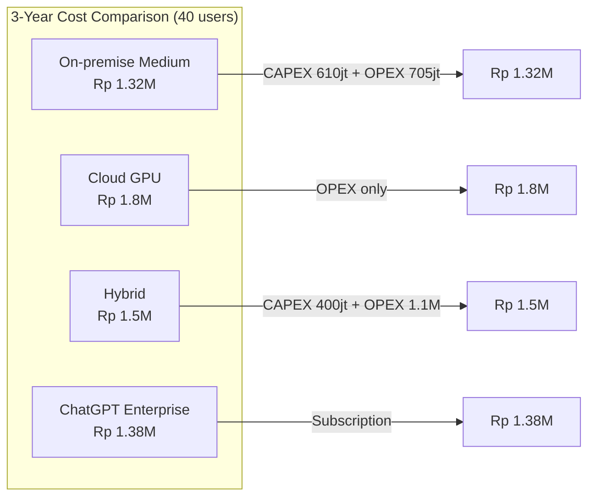
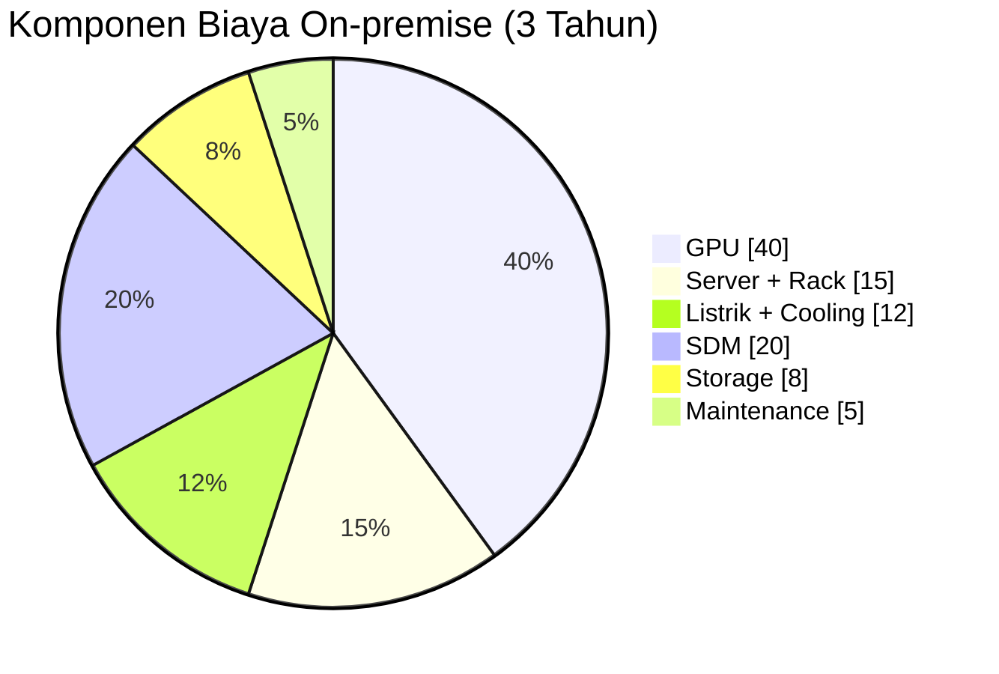
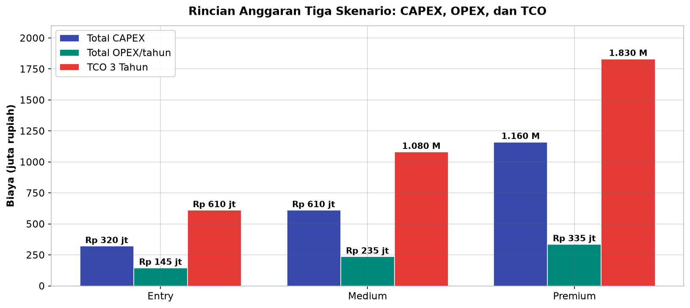
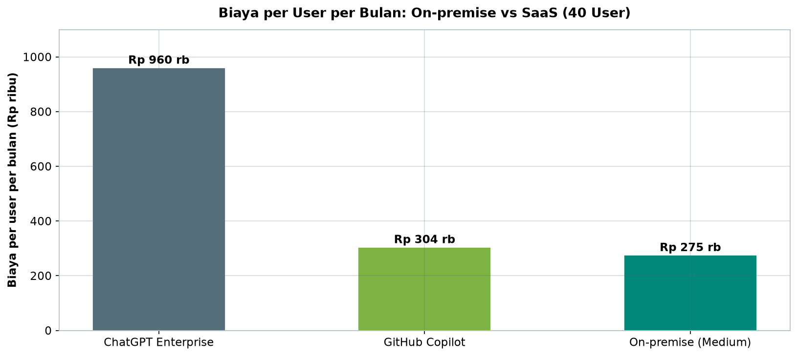

# Bab 8.9: Budgeting

> Anggaran AI general office bukan pengeluaran — itu keputusan arsitektur. Entah memilih langganan ChatGPT Enterprise sebesar Rp 461 juta per tahun, membangun server sendiri senilai Rp 610 juta, atau memadukan keduanya secara hybrid, setiap pilihan membawa konsekuensi yang baru bisa dihitung setelah tiga tahun. Bab ini membedah komponen biaya total kepemilikan (TCO), membandingkan on-premise, cloud, dan hybrid untuk 21-50 pengguna, serta menghitung kapan investasi kembali lunas — dengan angka-angka yang dapat Anda uji sendiri.

---

## 1. Tujuan Sub-Bab


Setelah membaca bab ini, Anda akan mampu:

- Menguraikan komponen biaya total kepemilikan (TCO) untuk LLM general office 21-50 user ke dalam CAPEX, OPEX, dan biaya software
- Membandingkan tiga skenario anggaran — Entry, Medium, dan Premium — beserta spesifikasi hardware dan model yang cocok untuk masing-masing
- Menganalisis kelebihan dan kekurangan on-premise, cloud GPU, dan hybrid dari sisi biaya, keamanan, latency, dan fleksibilitas
- Menghitung biaya listrik dan cooling berdasarkan TDP GPU dan tarif kWh
- Menghitung ROI dan *payback period* dibandingkan langganan SaaS seperti ChatGPT Enterprise dan GitHub Copilot

---

## 2. Komponen Biaya


### CAPEX: Investasi Sekali Bayar

*Capital Expenditure* adalah seluruh pengeluaran yang terjadi di awal proyek dan dinikmati selama bertahun-tahun: server GPU, *rack*, UPS, sistem *cooling*, dan *network switch*. Ciri khasnya: sekali bayar, lalu *depresiasi* selama 3-5 tahun. Dalam perhitungan TCO, CAPEX tidak dihitung mentah — ia dibagi rata sepanjang umur pakai, karena itulah satu-satunya cara jujur membandingkannya dengan langganan bulanan. Dua kesalahan umum yang sering terjadi di sini: pertama, lupa menghitung biaya pengiriman dan instalasi (di Indonesia sering besar); kedua, memilih GPU termahal "biar aman" padahal skenario pada Bagian 3 menunjukkan bahwa kebutuhan 21-30 user hanya memerlukan L40S.

### OPEX: Pengeluaran Bulanan yang Terus Mengalir

*Operational Expenditure* adalah seluruh biaya rutin: listrik, *maintenance* perangkat keras, penyimpanan data (NVMe, MinIO), koneksi internet, dan sumber daya manusia (SDM). OPEX tampak kecil per bulan, tetapi karena mengalir setiap bulan tanpa henti, dalam tiga tahun ia kerap melebihi CAPEX. Perhatikan ilusi yang sering menjebak: server Rp 610 juta terasa mahal, tetapi tabel anggaran (Tabel 1) menunjukkan OPEX per tahun untuk skenario Medium adalah Rp 235 juta — gabungan keduanya inilah yang menentukan keputusan, bukan salah satunya.

### Software: Lisensi dan Layanan

Komponen ketiga sering terlupakan: biaya software. Untuk model *open-weight* modern, biaya lisensi sebenarnya bisa nol — **DeepSeek V4 Flash** berlisensi MIT dan **Mistral Large 3** berlisensi Apache 2.0 bebas digunakan tanpa royalti, menghemat sekitar Rp 20-60 juta per tahun dibandingkan model *proprietary* berlangganan. Tetapi ada biaya software lain yang tetap muncul: *framework* inference, monitoring, dan — untuk arsitektur hybrid — biaya sewa GPU cloud yang dihitung *pay-per-use* setiap kali *burst* dipicu.

### Gambar 1: Perbandingan Biaya 3 Tahun (40 User)

Diagram berikut merangkum keputusan besar dalam satu pandangan: total biaya 3 tahun untuk empat jalur — on-premise, cloud, hybrid, dan langganan SaaS.



Perhatikan dua hal yang sering salah dibaca. Pertama, *cloud bukan yang termurah*: tanpa CAPEX ia justru menjadi yang termahal dalam 3 tahun. Kedua, *on-premise dan langganan SaaS hampir setara* (Rp 1,32 miliar vs Rp 1,38 miliar) — selisihnya hanya 5%, tetapi karakter biayanya berbeda total: SaaS adalah arus keluar mulus setiap bulan, sementara on-premise menumpuk modal awal lalu "menuai" di tahun-tahun berikutnya. Perbedaan karakter inilah yang menentukan apakah keputusan terbaik bagi arus kas perusahaan Anda adalah jalur A, B, C, atau D.


### Gambar 2: Pie Chart Komponen Biaya On-premise

Untuk memahami ke mana uang pergi, berikut komposisi biaya on-premise (skenario medium, 3 tahun) dalam bentuk proporsi.



Informasi yang paling mengejutkan dari pie chart ini mungkin bukan GPU (40%) — itu sudah diduga, melainkan **SDM (20%)** dan **Listrik + Cooling (12%)**: gabungan keduanya (32%) hampir menyamai server + storage (23%). Artinya, ketika Anda membeli server seharga Rp 610 juta, Anda juga sedang menandatangani komitmen biaya manusia dan energi yang lebih besar dari separuh komponen hardware. Kesimpulan praktis: *negosiasi paling efektif untuk menekan TCO bukan pada harga GPU, melainkan pada desain yang mereduksi kebutuhan SDM dan listrik* — misalnya *cold standby* hemat energi (Bab 8.8) dan otomasi operasional yang mengurangi jam kerja DevOps.

---


---

## 3. Skenario Anggaran


### Budget Entry (Rp 200-300 juta): 21-30 User

Skenario pemula untuk kantor yang baru pertama kali membangun asisten AI internal. Spekifikasinya sederhana: **1-2 GPU L40S**, *cold standby*, *single node*, kluster K3s, dan RAG yang masih sederhana — belum ada Knowledge Graph. Model yang direkomendasikan: **Ministral 3 14B** untuk tugas ringan sehari-hari dan **DeepSeek V4 Flash Q4** untuk tugas yang membutuhkan kualitas lebih tinggi. Dengan 21-30 user, beban *concurrent* masih rendah sehingga arsitektur satu node cukup; *cold standby* dari Bab 8.8 memberikan jaring pengaman minimal dengan biaya yang terkendali. Skenario ini adalah titik masuk yang paling rasional: terbukti salah, kerugiannya terbatas; terbukti benar, ia menjadi justifikasi untuk naik kelas.

### Budget Medium (Rp 300-500 juta): 31-40 User

Tingkatan standar untuk kantor yang asisten AI-nya sudah menjadi bagian alur kerja harian. Spesifikasinya: **2 GPU H100**, *warm standby*, *dual node*, K3s + LiteLLM + Qdrant + Knowledge Graph. Model utama: **DeepSeek V4 Flash** untuk *throughput* harian dan **Mistral Large 3 Q4** (Apache 2.0, tanpa biaya lisensi) untuk tugas berkualitas tinggi. *Warm standby* (RTO 30-60 detik, Bab 8.8) menjadi wajib karena jumlah user mulai membuat downtime terasa mahal, dan Knowledge Graph (Bab 8.7) mulai diperlukan karena pertanyaan lintas data mulai sering muncul pada skala ini.

### Budget Premium (Rp 500-800 juta+): 41-50 User

Tingkatan tertinggi untuk kantor yang asisten AI-nya setara layanan produksi. Spesifikasinya: **3-4 GPU H100**, *active-active*, *multi-node cluster*, dan *full knowledge graph*. Model utamanya melompat ke kelas atas: **DeepSeek V4 Pro Q4** untuk kualitas maksimal dan **Mistral Large 3 Q8** untuk presisi tertinggi. *Active-active* (RTO di bawah 5 detik) bukan lagi kemewahan melainkan kebutuhan — pada 41-50 user, satu menit downtime berarti puluhan orang tidak bekerja. Perhatikan bahwa skenario premium hampir dua kali lipat TCO skenario entry — perbedaan inilah yang harus dipertimbangkan pada Bagian 7 (ROI), karena setiap rupiah tambahan harus bisa dijustifikasi oleh produktivitas pengguna.

### Tabel 1: Rincian Anggaran 3 Skenario

Tabel berikut merinci seluruh komponen biaya untuk tiga skenario — Entry, Medium, Premium — dari GPU hingga TCO 3 tahun. Semua harga dalam rupiah bersifat indikatif dan wajib diverifikasi dengan harga pasar terkini saat proposal disusun.

| Komponen | Entry (Rp) | Medium (Rp) | Premium (Rp) |
|:---|:---:|:---:|:---:|
| **GPU (1-4 unit)** | 200jt (L40S x1) | 400jt (H100 x2) | 800jt (H100 x4) |
| **Model Rekomendasi** | DeepSeek V4 Flash Q4 | Mistral Large 3 Q4 | DeepSeek V4 Pro Q4 |
| **Server + Rack** | 50jt | 80jt | 150jt |
| **UPS & Cooling** | 20jt | 40jt | 70jt |
| **Network (Switch 25GbE)** | 10jt | 20jt | 30jt |
| **Storage (NVMe + MinIO)** | 15jt | 30jt | 50jt |
| **Setup & Instalasi** | 25jt | 40jt | 60jt |
| **Total CAPEX** | **Rp 320jt** | **Rp 610jt** | **Rp 1,16M** |
| **Listrik/tahun** | 15jt | 35jt | 60jt |
| **Maintenance/tahun** | 10jt | 20jt | 35jt |
| **SDM/tahun** | 120jt | 180jt | 240jt |
| **Total OPEX/tahun** | **Rp 145jt** | **Rp 235jt** | **Rp 335jt** |
| **TCO 3 Tahun** | **Rp 610jt** | **Rp 1,08M** | **Rp 1,83M** |

*Catatan: M = miliar. Semua harga bersifat indikatif.*



*Gambar 8.9-1 — Rincian anggaran tiga skenario: CAPEX dan TCO membentuk kurva yang sama-sama menanjak dari Entry ke Premium, sementara OPEX/tahun hanya naik sekitar 2,3x — isyarat bahwa skala lebih besar lebih banyak dibayar di muka, bukan per bulan.*

Pesan utama tabel ini ada di tiga baris terakhir. Pertama, GPU memang mendominasi CAPEX, tetapi perhatikan bahwa *SDM/tahun* — bukan GPU — adalah komponen OPEX terbesar, dan pada skenario premium nilainya (Rp 240 juta/tahun) menyamai harga satu H100. Kedua, TCO 3 tahun menanjak hampir tiga kali lipat dari Entry (Rp 610 juta) ke Premium (Rp 1,83 miliar) — kenaikan yang harus dihubungkan langsung dengan jumlah user yang dilayani pada Bagian 3. Ketiga, model terpilih evolusinya mengikuti anggaran: DeepSeek V4 Flash Q4 untuk entry, Mistral Large 3 Q4 untuk medium, dan DeepSeek V4 Pro Q4 untuk premium — semuanya *open-weight* yang menghapus komponen biaya lisensi.


---

## 4. Perbandingan On-premise vs Cloud vs Hybrid


### On-premise: Kendali Penuh, Modal Besar

On-premise berarti seluruh infrastruktur dibeli dan dikelola sendiri di kantor. Keunggulannya jelas: **CAPEX tinggi tetapi OPEX rendah** — setelah server terpasang, biaya bulanan hanya listrik, *maintenance*, dan SDM. Data 100% berada dalam kendali perusahaan (keamanan data "sangat tinggi"), *latency P99* rendah (di bawah 3 detik), dan tidak ada kebocoran ke server pihak ketiga. Kelemahannya: kapasitas terbatas — jika kebutuhan tiba-tiba berlipat, Anda menunggu pengadaan baru; dan kompleksitas tinggi, karena seluruh stack dari hardware hingga software menjadi tanggung jawab tim internal.

### Cloud GPU: Tanpa Modal, Tagihan Bulanan

Cloud GPU (misalnya *instance* GPU AWS atau GCP di *ap-southeast-1*) membalik persamaan: **CAPEX nol, OPEX tinggi**. Anda menyewa GPU per jam dan menambah-mengurangi kapasitas kapan saja — fleksibilitas yang tidak bisa ditiru on-premise, dengan kompleksitas rendah karena operasional ada di penyedia. Namun tiga konsekuensi harus diterima: total biaya 3 tahun lebih tinggi (Tabel 2: Rp 1,8 miliar vs Rp 1,32 miliar on-premise medium); data berada di *shared infrastructure* penyedia; dan *latency P99* naik menjadi 3-8 detik karena lalu lintas jaringan publik. Cloud lebih cocok sebagai titik awal uji coba atau pelengkap, bukan sebagai rumah permanen data sensitif.

### Hybrid: Best of Both Worlds

Hybrid menggabungkan keduanya: **on-premise untuk beban harian**, cloud untuk *burst* saat puncak — dan, seperti dibahas di Bab 8.8, sebagai jalur *cloud failover* saat keadaan darurat. Hasilnya: total biaya 3 tahun (Rp 1,5 miliar) berada di antara keduanya, keamanan data terjaga untuk beban utama (tinggi), *latency P99* tetap rendah (di bawah 3 detik), dan fleksibilitas jauh lebih baik daripada on-premise murni. Kompleksitasnya sedang — Anda harus mengelola dua dunia sekaligus, termasuk cara memigrasikan beban antar keduanya. Untuk perusahaan yang volume kerjanya berfluktuasi musiman (misalnya akhir kuartal), hybrid adalah tempat paling sehat untuk uang mereka.

### Tabel 2: Perbandingan On-premise vs Cloud vs Hybrid (40 User, 3 Tahun)

Untuk menempatkan keputusan dalam satu tabel, berikut perbandingan tiga jalur implementasi untuk konfigurasi medium dengan 40 user selama 3 tahun.

| Aspek | On-premise (Medium) | Cloud GPU (AWS/GCP) | Hybrid (On-prem + Burst) |
|:---|:---:|:---:|:---:|
| **CAPEX 3 Tahun** | Rp 610jt | Rp 0 | Rp 400jt |
| **OPEX 3 Tahun** | Rp 705jt | Rp 1,8M | Rp 1,1M |
| **Total 3 Tahun** | **Rp 1,32M** | **Rp 1,8M** | **Rp 1,5M** |
| **Data Security** | Sangat tinggi | Sedang (shared) | Tinggi |
| **Latency P99** | < 3 detik | 3-8 detik | < 3 detik |
| **Scalability** | Terbatas | Sangat fleksibel | Fleksibel |
| **Kompleksitas** | Tinggi | Rendah | Sedang |

Tiga wawasan dari tabel ini. Pertama, *CAPEX nol bukan berarti murah*: cloud GPU justru menjadi opsi termahal dalam 3 tahun (Rp 1,8 miliar) karena seluruh biaya ditagih bulanan tanpa henti. Kedua, on-premise menang total di keamanan (sangat tinggi) dan latency (di bawah 3 detik) untuk data sensitif — dua baris yang menentukan bagi perusahaan di sektor teratur. Ketiga, hybrid hanya kalah Rp 180 juta dari on-premise murni dalam 3 tahun, tetapi membeli fleksibilitas *burst* dan jaring pengaman failover (Bab 8.8) — untuk perusahaan dengan fluktuasi musiman, selisih semacam ini adalah premi asuransi yang wajar.


---

## 5. Biaya Listrik & Cooling


### Matematika Sederhana Daya Server LLM

Biaya listrik adalah OPEX yang paling sering diremehkan, padahal dapat diprediksi dengan tiga angka. GPU data center modern mengonsumsi **350-700 Watt per unit** (L40S di ujung bawah, H100 di ujung atas), dan satu server lengkap — CPU, motherboard, RAM, ditambah *cooling* untuk menghilangkan panas yang dihasilkan — total sekitar **3-5 kW**. Kalikan dengan jam operasi 24 jam, 365 hari: biaya listrik untuk sistem 4 kW dengan tarif industri Rp 1.600/kWh adalah 1.600 x 24 x 365 x 4 = **Rp 56 juta per tahun**. Angka ini adalah beban minimum; *cooling* AC ruangan menambahkan lagi **30-50% dari biaya listrik GPU** — sebuah server yang "murah" bisa menagihkan listrik lebih besar dari biaya *maintenance*-nya.

### Implikasi Desain: Utilisasi Menentukan Tagihan

Biaya listrik tidak linear terhadap pemakaian: server LLM yang menyala 24 jam membayar listrik penuh bahkan saat idle (kecuali di-*power down*). Inilah alasan mengapa *cold standby* (Bab 8.8) secara ekonomi menarik — GPU kadang menyala tapi idle tetap membayar listrik, sehingga memilih *standby* yang tepat sama pentingnya dengan memilih model yang tepat. Saat menghitung skenario anggaran, gunakan *kalkulator* pada Langkah 2 (Bagian 8) untuk menghitung sendiri: masukkan jumlah GPU, TDP, tarif PLN Anda, dan faktor *cooling* — angka yang keluar adalah komitmen bulanan yang harus dimasukkan ke Tabel 1.

---

## 6. Biaya SDM


### DevOps, IT Support, dan Training

Perangkat keras hanyalah separuh biaya; manusia adalah separuh lainnya. Untuk general office 21-50 user, kebutuhan SDM relatif ringan dibandingkan data center korporat: **DevOps/Platform Engineer paruh waktu (0,5 FTE)** dengan kisaran **Rp 10-15 juta/bulan** untuk mengelola kluster, pemantauan, dan failover; **IT Support (0,25 FTE)** sekitar **Rp 3-5 juta/bulan** untuk dukungan pengguna dan perawatan; dan **training & onboarding karyawan** sekitar **Rp 5-10 juta sekali** — biaya yang dihabiskan di awal untuk memastikan pengguna benar-benar memakai sistem, karena infrastruktur yang tidak terpakai adalah biaya terbesar yang halus.

### Mengapa SDM Harus Masuk TCO

Lihat Tabel 1: baris SDM/tahun adalah komponen OPEX terbesar — Rp 120 juta (entry), Rp 180 juta (medium), Rp 240 juta (premium) — melebihi gabungan listrik dan *maintenance*. Keputusan "hemat" yang sering dilakukan perusahaan adalah menekan baris ini: mempekerjakan 0,25 FTE atau meminta IT *generalist* belajar sambil jalan. Hemat jangka pendek, mahal jangka panjang — kesalahan kecil dalam konfigurasi kluster, *alerting* yang tidak ada yang memantau, atau *runbook* yang tidak pernah diuji (Bab 8.8) bisa menelan biaya *downtime* berkali lipat dari gaji yang dihemat. Untuk konteks ini, tuliskan SDM dalam proposal anggaran secara jujur, bukan optimistis.

---

## 7. ROI & Payback Period


### Titik Tolak: Berapa yang Sudah Anda Bayar?

ROI tidak pernah bisa dihitung tanpa titik tolak. Untuk general office, titik tolaknya adalah biaya langganan yang sedang berjalan: **ChatGPT Enterprise $60/user/bulan** atau **GitHub Copilot $19/user/bulan**. Untuk 40 user, langganan ChatGPT Enterprise berarti **$2.400/bulan ≈ Rp 38 juta/bulan** — dan Rp 461 juta per tahun. Angka inilah "biaya yang hilang" jika Anda memilih langganan terus-menerus. Perhatikan bahwa Rp 461 juta per tahun sudah dua pertiga Tabel 1 kasus premium sekalipun — perbandingan ini yang membuat on-premise menarik secara matematis.

### Menghitung Payback

*Payback period* dihitung dengan membandingkan investasi CAPEX terhadap penghematan bulanan: TCO on-premise per bulan (3 tahun) = (Rp 500 juta / 36 bulan) + OPEX ≈ Rp 13,9 juta + Rp 10 juta = **Rp 23,9 juta/bulan** untuk konfigurasi setara medium. Bandingkan dengan Rp 38 juta/bulan langganan => penghematan **Rp 14,1 juta/bulan**, sehingga *payback period* jatuh di **18-24 bulan**. Ini berarti di bulan ke-18 hingga ke-24, investasi server Anda lunas dan setiap bulan berikutnya adalah penghematan murni Rp 14,1 juta. Dengan TCO 3 tahun, hampir separuh umur pakai server menjadi periode "gratis" — justifikasi finansial yang sama-sama dipakai studi kasus di Bagian 9.

### Batas Kejujuran Perhitungan

Perhitungan ROI hanya sebaik asumsinya. Tiga variabel yang paling sering membuat estimasi meleset: *utilisasi GPU* (server yang menganggur tidak menghasilkan penghematan), jumlah *request per user per hari* (berapa sesungguhnya beban kerja?), dan *harga pasar yang bergerak* (tarif listrik PLN, harga GPU, dan harga langganan SaaS berubah — periksa ulang saat menulis proposal). Jangan pernah menyajikan ROI sebagai angka tunggal; sajikan sebagai rentang dengan asumsi eksplisit, karena keputusan CFO paling sering ditentukan oleh kredibilitas asumsi, bukan oleh angka final.

### Tabel 3: ROI vs SaaS Langganan

Tabel terakhir membandingkan on-premise medium dengan dua langganan SaaS paling umum, dalam satuan per user dan per perusahaan 40 user.

| Metrik | ChatGPT Enterprise | GitHub Copilot | On-premise (Medium) |
|:---|:---:|:---:|:---:|
| **Biaya/user/bulan** | $60 (Rp 960k) | $19 (Rp 304k) | Rp 275k* |
| **Biaya 40 user/bulan** | Rp 38,4jt | Rp 12,2jt | Rp 11jt |
| **Biaya 40 user/tahun** | Rp 461jt | Rp 146jt | Rp 132jt |
| **Biaya 3 Tahun** | Rp 1.38M | Rp 438jt | Rp 1.08M** |
| **Payback vs ChatGPT** | - | - | 18 bulan |
| **Payback vs GitHub Copilot** | - | - | 30 bulan |

*\*TCO per user per bulan (Rp 1,32M / 36 bulan / 40 user). \*\*Termasuk depresiasi hardware.*



*Gambar 8.9-2 — Biaya per user per bulan: on-premise medium hampir 3,5x lebih murah dari ChatGPT Enterprise — namun payback terhadap Copilot yang sudah murah tetap berlangsung 30 bulan, bukan 18 bulan.*

Perhatikan dua hal menarik. Pertama, on-premise medium secara per-user (Rp 275 ribu) hampir seperempat biaya ChatGPT Enterprise (Rp 960 ribu), tetapi *payback* terhadap GitHub Copilot (30 bulan) jauh lebih lama daripada terhadap ChatGPT Enterprise (18 bulan), karena titik tolak Copilot sudah murah. Ini membuka pertanyaan yang jujur: jika kebutuhan kantor hanya *coding assistance*, Copilot mungkin sudah menjadi keputusan yang lebih efisien daripada membangun infrastruktur. Kedua, keputusan akhir tidak pernah murni finansial — keamanan data, kedaulatan data (tidak bocor ke server AS), dan latency ikut menentukan; studi kasus Bagian 9 menunjukkan bagaimana ketiganya digabung dalam satu keputusan nyata.

---


---

## 8. Praktikum / Hands-On


### Langkah 1: Kalkulator TCO Sederhana (Spreadsheet)

Cara tercepat untuk memahami TCO adalah membangun kalkulator sendiri di Google Sheets. Salin baris-baris berikut sebagai data mentah, lalu biarkan formula menghitung CAPEX, OPEX, TCO, dan *payback* secara otomatis.

```csv
Komponen,Entry,Medium,Premium
GPU,200000000,400000000,800000000
Server + Rack,50000000,80000000,150000000
UPS + Cooling,20000000,40000000,70000000
Network,10000000,20000000,30000000
Storage,15000000,30000000,50000000
Setup,25000000,40000000,60000000
Total CAPEX,=SUM(B2:B7),=SUM(C2:C7),=SUM(D2:D7)
Listrik/tahun,15000000,35000000,60000000
Maintenance/tahun,10000000,20000000,35000000
SDM/tahun,120000000,180000000,240000000
Total OPEX/tahun,=SUM(B9:B11),=SUM(C9:C11),=SUM(D9:D11)
TCO 3 Tahun,=B8+B12*3,=C8+C12*3,=D8+D12*3
Biaya/user/bulan,=B13/36/40,=C13/36/40,=D13/36/40
Vs ChatGPT/bulan (Rp 960k/user),=960000-B15,=960000-C15,=960000-D15
Payback (bulan),=B8/(40*960000-B12/12),=C8/(40*960000-C12/12),=D8/(40*960000-D12/12)
```

Uji kalkulator dengan gerakan sederhana: ubah asumsi SDM medium dari 0,5 FTE menjadi 0,25 FTE (bagi dua baris SDM) dan amati bagaimana `Payback (bulan)` berubah. Latihan ini mengajarkan sesuatu yang penting: formula *payback* di atas membandingkan CAPEX terhadap penghematan bulanan (langganan 40 user × Rp 960 ribu dikurangi OPEX bulanan) — semua variabel di dalamnya asumsi yang bisa dinegosiasikan, dan kalkulator inilah alat untuk *men-debug* keputusan anggaran sebelum ditandatangani.

### Langkah 2: Script Estimasi Biaya Listrik GPU

Listrik adalah komponen OPEX paling mudah dihitung — dan paling sering salah. Skrip Python berikut menghitung konsumsi daya total (GPU + server + *cooling*) dan biayanya per bulan, tahun, dan 3 tahun.

```python
# power_cost_estimator.py
def calculate_power_cost(
    gpu_count: int,
    gpu_tdp: int,       # Watt
    server_tdp: int,     # Watt (CPU + mobo + RAM)
    hours_per_day: int,  # 24 jika 24/7
    days_per_year: int,  # 365
    cost_per_kwh: float, # Rp 1.600
    cooling_factor: float = 1.4  # 40% tambahan untuk cooling
) -> dict:
    gpu_power_kw = (gpu_count * gpu_tdp) / 1000
    server_power_kw = server_tdp / 1000
    total_power_kw = (gpu_power_kw + server_power_kw) * cooling_factor

    daily_kwh = total_power_kw * hours_per_day
    monthly_kwh = daily_kwh * 30
    yearly_kwh = daily_kwh * days_per_year

    return {
        "total_power_kw": round(total_power_kw, 2),
        "daily_kwh": round(daily_kwh, 0),
        "monthly_cost": round(monthly_kwh * cost_per_kwh, 0),
        "yearly_cost": round(yearly_kwh * cost_per_kwh, 0),
        "three_year_cost": round(yearly_kwh * cost_per_kwh * 3, 0),
    }

# Contoh: 2x H100 (700W each) + server 300W
result = calculate_power_cost(
    gpu_count=2, gpu_tdp=700,
    server_tdp=300, hours_per_day=24,
    cost_per_kwh=1600
)
print(f"Total daya: {result['total_power_kw']} kW")
print(f"Biaya listrik/bulan: Rp {result['monthly_cost']:,.0f}")
print(f"Biaya listrik/tahun: Rp {result['yearly_cost']:,.0f}")
print(f"Biaya listrik/3 tahun: Rp {result['three_year_cost']:,.0f}")
```

Periksa sendiri hasilnya: untuk 2× H100, `total_power_kw` menjadi (1.400 + 300) × 1.4 = 2,38 kW — dan dengan tarif Rp 1.600/kWh, biaya tahunan keluar sekitar **Rp 33 juta**, konsisten dengan baris `Listrik/tahun` pada Tabel 1 untuk skenario Medium (Rp 35 juta dengan margin *cooling* yang lebih konservatif). Ubah `cooling_factor` menjadi 1,5 (50% untuk ruangan tanpa AC presisi) dan lihat bagaimana biaya melonjak — inilah cara cepat meyakinkan manajemen bahwa investasi AC ruangan server bukan pengeluaran, melainkan penghematan.

### Langkah 3: Template Proposal Anggaran AI General Office

Terakhir, susun argumen Anda ke dalam *template* proposal yang bisa langsung diisi dan dipresentasikan ke manajemen.

```markdown
# PROPOSAL ANGGARAN AI GENERAL OFFICE
## PT [Nama Perusahaan] — [Tahun]

### 1. Latar Belakang
- Jumlah karyawan: [40] orang
- Kebutuhan: coding assistant, document review, data analysis
- Saat ini: [ChatGPT Enterprise / GitHub Copilot / Manual]

### 2. Opsi yang Dipertimbangkan
| Opsi | CAPEX | OPEX/tahun | TCO 3 Tahun | Kelebihan |
|:---|:---:|:---:|:---:|:---|
| **A. On-premise Medium** | Rp 610jt | Rp 235jt | Rp 1.08M | Data aman, latency rendah |
| **B. Cloud GPU** | Rp 0 | Rp 600jt | Rp 1.8M | Tanpa setup, skalabel |
| **C. Hybrid** | Rp 400jt | Rp 367jt | Rp 1.5M | Fleksibel |
| **D. ChatGPT Enterprise** | Rp 0 | Rp 461jt | Rp 1.38M | Siap pakai |

### 3. Rekomendasi
[Rekomendasi berdasarkan prioritas perusahaan]

### 4. Timeline Implementasi
- Bulan 1: Pengadaan hardware
- Bulan 2: Setup infrastruktur
- Bulan 3: Go-live + training
```

*Template* ini sengaja menyajikan empat opsi, bukan dua — karena keputusan budget yang sehat selalu perbandingan, bukan pembelaan satu jalur. Lengkapi Bagian "Rekomendasi" dengan tiga hal yang sudah dihitung di bab ini: (1) *payback period* terhadap langganan yang berjalan, (2) pertimbangan keamanan data — apakah data boleh tinggal di server pihak ketiga — dan (3) kesiapan SDM, karena *TCO* akan langsung meleset bila baris SDM pada Tabel 1 tidak dianggarkan. Proposal yang berisi ketiga elemen ini hampir selalu lolos dewan, bukan karena angkanya menarik, tetapi karena asumsinya bisa dipertanggungjawabkan.

---

## 9. Studi Kasus: Perbandingan Biaya PT Startup AI (40 User)


**Situasi Awal.** PT Startup AI, perusahaan dengan 40 karyawan, memakai **ChatGPT Enterprise** untuk seluruh kebutuhan AI internal — *coding assistant*, *document review*, dan *data analysis*. Biayanya $60/user/bulan atau sekitar **Rp 38,4 juta/bulan** — sebuah arus kas yang membengkak seiring bertambahnya karyawan, tanpa aset apa pun yang tersisa.

**Keputusan.** Manajemen memutuskan beralih ke **on-premise dengan 2× H100** (skenario medium pada Bagian 3), total investasi **Rp 610 juta**. Angka ini sempat mengguncang — hampir setengah miliar keluar di muka, tetapi analisis TCO menunjukkan garis finish: kalkulator *payback* (Langkah 1, Bagian 8) memperlihatkan bahwa langganan yang berjalan akan menelan Rp 461 juta per tahun, hampir setara biaya server dalam satu tahun.

**Biaya Operasional.** Setelah server berjalan, biaya bulanan riil: **listrik Rp 3 juta/bulan** + **maintenance Rp 1,7 juta/bulan** + **SDM Rp 15 juta/bulan** (0,5 FTE DevOps) = **Rp 19,7 juta/bulan**.

**Hasil.** Penghematan bulanan: Rp 38,4 juta - Rp 19,7 juta = **Rp 18,7 juta/bulan**. *Payback period*: Rp 610 juta / Rp 18,7 juta = **32,6 bulan**. Setelah payback, sisa umur pakai sekitar 2,4 tahun menjadi periode penghematan murni: Rp 18,7 juta × 12 × 2,4 = **Rp 538 juta**. Dua tambahan manfaat non-finansial ikut menguatkan keputusan: **data tidak lagi bocor ke server di Amerika Serikat** — pertimbangan kepatuhan yang semakin penting — dan **latency turun dari 5 detik menjadi 2 detik**, respons yang terasa langsung oleh pengguna.

**Kesimpulan.** On-premise masuk akal secara finansial untuk perusahaan dengan **lebih dari 30 user** yang menangani **data sensitif**. Dua syarat yang tidak boleh dilupakan: harga komponen (GPU, tarif listrik PLN, gaji DevOps) wajib diverifikasi ulang saat proposal ditulis, dan SDM harus benar-benar dianggarkan — tanpa 0,5 FTE DevOps yang kompeten, biaya *downtime* (Bab 8.8) akan memakan penghematan ini dalam satu insiden.

---

## 10. Referensi


### Paper Jurnal/Konferensi

[1] Ohiri, E., Berry, S. (2026). *Real-World GPU Benchmark: NVIDIA H100 vs A100 vs L40S*. CUDO Compute Blog. [https://www.cudocompute.com/blog/real-world-gpu-benchmarks](https://www.cudocompute.com/blog/real-world-gpu-benchmarks) — benchmark *cost/token* A100, H100, L40S; acuan verifikasi angka TCO. — ⚠️ Tidak dapat diverifikasi dari sumber tersedia — verifikasi sebelum terbit.

[2] Weber, S., et al. (2025). *Automated Dynamic AI Inference Scaling on HPC-Infrastructure*. arXiv:2511.21413. DOI: [10.48550/arXiv.2511.21413](https://arxiv.org/abs/2511.21413) — efisiensi *scaling* untuk *concurrent requests*; dasar estimasi kebutuhan GPU per user.

[3] Miao, X., et al. (2024). *SpotServe: Serving Generative Large Language Models on Preemptible Instances*. Proceedings of ACM ASPLOS 2024. DOI: [10.48550/arXiv.2311.15566](https://arxiv.org/abs/2311.15566) — penghematan biaya hingga 54% dengan *spot instances*; acuan validasi harga cloud GPU pada Tabel 2.

[4] Mao, Z., et al. (2024). *SkyServe: Serving AI Models across Regions and Clouds with Spot Instances*. arXiv:2411.01438. DOI: [10.48550/arXiv.2411.01438](https://arxiv.org/abs/2411.01438) — pengurangan biaya hingga 44% dengan *spot replicas*; acuan perbandingan on-premise vs cloud pada Tabel 2.

[5] Zhen, R., Li, J., et al. (2025). *Taming the Titans: A Survey of Efficient LLM Inference Serving*. arXiv:2504.19720. DOI: [10.48550/arXiv.2504.19720](https://arxiv.org/abs/2504.19720) — survei komprehensif teknik optimasi *inference serving*; acuan metodologi kalkulasi biaya inference untuk TCO dan *payback period*.

*Catatan: entri [5] menggantikan "A Survey on Cost Optimization for Large Language Model Inference" yang tercantum pada guideline dengan ID arXiv yang tidak lengkap — diganti survei terverifikasi dengan cakupan topik setara.*

### Referensi Pendukung (Dokumentasi/Pricing)

[6] OpenAI. *ChatGPT Enterprise Pricing*. [https://openai.com/enterprise](https://openai.com/enterprise) — dasar perbandingan $60/user/bulan.

[7] GitHub. *Copilot Enterprise Pricing*. [https://github.com/features/copilot/plans](https://github.com/features/copilot/plans) — dasar perbandingan $19/user/bulan.

[8] NVIDIA. *Data Center GPU Pricing*. [https://www.nvidia.com/en-us/data-center/](https://www.nvidia.com/en-us/data-center/) — acuan harga GPU data center terkini.

[9] AWS. *GPU Instance Pricing — ap-southeast-1*. [https://aws.amazon.com/ec2/pricing/on-demand/](https://aws.amazon.com/ec2/pricing/on-demand/) — acuan biaya cloud GPU untuk kalkulasi hybrid.

[10] PLN. *Tarif Listrik Industri 2025*. [https://www.pln.co.id](https://www.pln.co.id) — acuan tarif kWh untuk perhitungan biaya listrik.

[11] DeepSeek Team. (2026). *DeepSeek-V4 Flash: MIT Licensed MoE for Cost-Sensitive Deployment*. [https://api-docs.deepseek.com](https://api-docs.deepseek.com) — model 284B/13B aktif berlisensi MIT; biaya *inference* lebih rendah dari *dense* 70B, dipertimbangkan dalam TCO Tabel 1. — ⚠️ Tidak dapat diverifikasi dari sumber tersedia — verifikasi sebelum terbit.

[12] Mistral AI Team. (2025). *Mistral Large 3: Apache 2.0 Licensed Granular MoE*. [https://mistral.ai/news/mistral-large-3](https://mistral.ai/news/mistral-large-3) — tanpa biaya lisensi, menghemat Rp 20-60jt/tahun dibandingkan model *proprietary*; dipertimbangkan pada Tabel 2.
