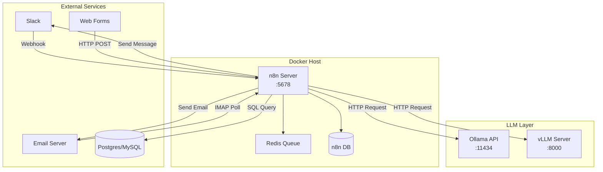
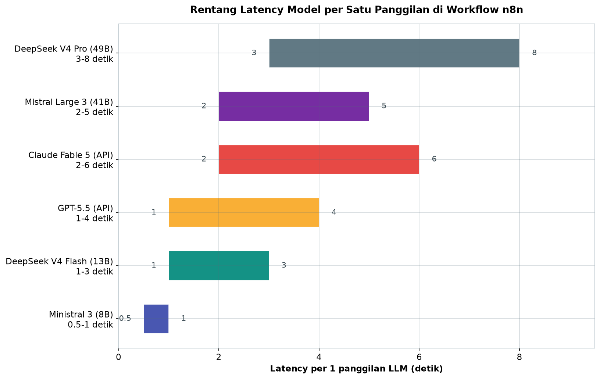

# Bab 9.1: n8n Self-hosted

> Bayangkan Anda punya seorang asisten virtual yang setiap pagi sudah meringkas email masuk, menjawab pertanyaan penjualan lewat Slack, dan menyusun laporan penjualan sebelum rapat dimulai — tanpa membayar satu rupiah pun per query. Itulah yang ditawarkan n8n ketika dipasangkan dengan LLM lokal: sebuah *workflow automation engine* yang mengubah mesin AI di ruang server Anda menjadi otak yang menggerakkan ratusan aplikasi kantor sekaligus.

---

## 1. Tujuan Sub-Bab


Setelah membaca bab ini, Anda akan mampu:

- Memahami arsitektur n8n sebagai *workflow automation engine* untuk integrasi LLM lokal, termasuk perbedaannya dengan Zapier/Make yang berbasis cloud
- Menyusun workflow multi-langkah yang menghubungkan LLM (Ollama/vLLM) ke aplikasi eksternal seperti Email, Slack, Google Sheets, dan database SQL
- Merancang tiga pola otomasi utama — *Email Assistant*, *SQL Analyst*, dan *Report Generator* — beserta node kunci yang dibutuhkan
- Menerapkan mode eksekusi `main` vs `queue` (Redis) sesuai skala kebutuhan produksi
- Mengoptimalkan keamanan kredensial (AES-256 vault), isolasi jaringan, serta monitoring dan observability workflow
- Memilih model LLM terbaru — dari DeepSeek V4 Pro hingga Ministral 3 — yang tepat untuk beban kerja otomasi harian

---

## 2. Mengapa n8n untuk Otomasi AI?


### Alternatif Open-Source untuk Zapier dan Make

Selama bertahun-tahun, tim perkantoran yang ingin mengotomatisasi alur kerja hanya punya dua pilihan mahal: Zapier atau Make (dulu Integromat). Keduanya nyaman karena tinggal klik, tetapi data Anda harus transit ke server pihak ketiga — sebuah masalah serius bagi perusahaan yang menangani data keuangan, data calon karyawan, atau dokumen legal. n8n hadir sebagai alternatif yang berbeda: ia adalah platform otomasi **open-source dengan lisensi *fair-code* (SSPL)** yang bisa Anda pasang sendiri (*self-hosted*) di server internal, sehingga tidak ada satu byte pun data yang keluar dari infrastruktur Anda.

Yang membuat n8n menarik bukan hanya lisensinya, tetapi ekosistem integrasinya yang luas: lebih dari **400 node integration** mencakup Email (SMTP/IMAP), Slack, Discord, SQL (Postgres, MySQL, MSSQL), HTTP, Webhook, hingga Google Sheets. Alur yang dibangun tampil sebagai *visual DAG* (Directed Acyclic Graph) — setiap kotak adalah node, setiap garis adalah aliran data — sehingga mudah diaudit oleh tim non-Developer sekalipun. Kombinasi **Code Node** (JavaScript/Python), eksekusi sub-workflow, dan dukungan *webhook* membuat n8n bukan sekadar *trigger-action* sederhana seperti kebanyakan alat lain: ia adalah kerangka kerja otomasi sungguhan.

### LLM Lokal sebagai "Otak" Workflow

Perbedaan fundamental n8n dengan pendahulunya adalah kemampuannya menjalankan **LLM lokal sebagai *AI brain*** di tengah workflow — bukan sekadar pemicu dan aksi. Alur kerjanya menjadi: sebuah event masuk (email, pesan Slack, submit form), kemudian **HTTP Request Node** mengirim prompt ke Ollama atau vLLM, lalu hasil inference (jawaban, klasifikasi, ringkasan, atau SQL) diteruskan ke node berikutnya untuk dieksekusi ke aplikasi tujuan. Dengan cara ini, proses seperti "ringkas email lalu kirim ke Slack" atau "ubah pertanyaan jadi SQL lalu jalankan ke database" dapat berjalan otomatis dengan biaya inference nol.

Dukungan terhadap model MoE terbaru memperkuat posisi ini. **DeepSeek V4 Flash (284B total / 13B aktif)** misalnya, memberikan kualitas setara model dense 70B dengan efisiensi **73% lebih hemat FLOPs** — cukup dijalankan di workstation kantor melalui INT4 sambil tetap melayani puluhan workflow per menit. Artinya, "otak" workflow tidak lagi harus berupa API premium dari luar negeri; ia bisa berupa model yang sepenuhnya berada di bawah kendali tim IT Anda.

### Model Terbaru untuk Workflow n8n

Saat buku ini ditulis, beberapa model layak dipertimbangkan sebagai otak workflow n8n, masing-masing dengan karakter yang berbeda:

- **DeepSeek V4 Pro** (1,6T total / 49B aktif, lisensi MIT, April 2026) — open-weight dengan 1M context, SWE-bench 80,6% dan Terminal-Bench 67,9%. Ideal untuk *agentic workflow* multi-langkah yang menentukan arah otomasi. Tersedia via Ollama `deepseek-v4-pro:latest` atau API OpenAI-compatible.
- **DeepSeek V4 Flash** (284B / 13B aktif) — versi ringan untuk *daily task*; `deepseek-v4-flash:latest` via Ollama, sangat hemat sumber daya.
- **GPT-5.5** (proprietary, April 2026) — 1M context dengan *reasoning efforts*. Sangat kuat untuk *agentic coding*; diakses via OpenAI API endpoint.
- **Claude Fable 5** (kelas *Mythos*, Juni 2026) — 1M context dengan *safety classifiers* terintegrasi, SWE-bench 95,0%. Pilihan saat workflow menangani tugas yang butuh *guardrail* ketat.
- **Mistral Large 3** (675B / 41B aktif, Apache 2.0, Desember 2025) — granular MoE multimodal dengan 256K context, tersedia via Ollama atau API Le Chat.
- **Qwen3.7-Max** (proprietary MoE, Mei 2026) — *agent-centric* dengan 1M context, cocok untuk *multi-agent workflow* di n8n.
- **Ministral 3** (3B/8B/14B, Apache 2.0, Desember 2025) — hasil *Cascade Distillation*, ramah perangkat *edge*. Untuk tugas ringan seperti klasifikasi sederhana di perangkat terbatas.

---

## 3. Arsitektur Deployment n8n + LLM


Cara paling umum menggelar n8n di lingkungan perkantoran adalah *self-hosted* dengan **Docker Compose**, menggunakan **Postgres sebagai database workflow**. Alasan pemilihan Postgres sederhana: SQLite bawaan cukup untuk percobaan, tetapi gagal saat dua puluh orang menjalankan workflow bersamaan; Postgres memberikan transaksi yang aman, backup yang rapi, dan integrasi mudah dengan tim data.

Dari sisi jaringan, yang umum dipakai adalah pola *sidecar*: kontainer n8n, kontainer Ollama, dan kontainer database berada dalam satu Docker network sehingga komunikasi antar-kontainer memakai nama host internal (misal `http://ollama:11434`) tanpa membuka port ke publik. Koneksi ke LLM lokal dilakukan lewat **HTTP Request Node** menuju Ollama API di `localhost:11434` atau vLLM di `localhost:8000`.

Untuk produksi, n8n menyediakan dua mode eksekusi: mode **main** (proses tunggal) untuk pengembangan dan traffic rendah, serta mode **queue** dengan Redis sebagai broker antrean untuk horizontal scaling — beberapa *worker* berbagi beban eksekusi dari antrean yang sama. Jika Anda butuh ketersediaan tinggi tanpa Redis, mode **multi-main** memungkinkan beberapa main node berbagi load balancing dengan konfigurasi yang lebih rumit.

Pada lapisan model, arsitektur ini mendukung kombinasi: **DeepSeek V4 Pro** dan **DeepSeek V4 Flash** via Ollama untuk otomasi harian, **Mistral Large 3** via Ollama untuk kebutuhan multimodal, serta integrasi cloud API seperti **GPT-5.5**, **Claude Fable 5**, atau **Gemini 2.5 Pro** untuk tugas kompleks yang memang membutuhkan kekuatan model proprietary. Strategi *hybrid* semacam ini — model lokal untuk 80% pekerjaan rutin, API cloud untuk 20% sisanya — adalah pola yang paling hemat biaya.

### Tabel 2: Model LLM Unggulan untuk Workflow n8n

Pilih model yang tepat sesuai bobot pekerjaan workflow — kolom "Keunggulan di n8n" menunjukkan arah penggunaannya.

| Model | Parameter (Total/Aktif) | Lisensi | Context | SWE-bench | Keunggulan di n8n |
|:---|:---:|:---:|:---:|:---:|:---|
| **DeepSeek V4 Pro** | 1.6T / 49B | MIT | 1M | 80.6% | Agentic workflow, Terminal-Bench 67.9% |
| **DeepSeek V4 Flash** | 284B / 13B | MIT | 1M | — | Efisien, cocok daily automation |
| **GPT-5.5** | Proprietary | Proprietary | 1M | — | Reasoning kuat, coding agentic |
| **Claude Fable 5** | Proprietary | Proprietary | 1M | **95.0%** | Safety guardrails, SWE-bench tertinggi |
| **Mistral Large 3** | 675B / 41B | Apache 2.0 | 256K | — | Multimodal, granular MoE |
| **Gemini 2.5 Pro** | Proprietary | Proprietary | 1M | — | Thinking mode, multimodal |
| **Ministral 3** | 3B/8B/14B | Apache 2.0 | 128K | — | Cascade Distillation, edge-friendly |

Kedua model open-weight dari DeepSeek menjadi tulang punggung otomasi lokal berkat lisensi MIT tanpa batasan komersial. DeepSeek V4 Pro dengan 1M context unggul untuk *agentic workflow* yang menahan konteks percakapan panjang; DeepSeek V4 Flash (13B aktif) cukup untuk 80% tugas otomasi harian. Claude Fable 5 menawarkan SWE-bench tertinggi (95,0%) dengan *safety classifiers* — tetapi untuk memakainya Anda mengirim data ke API Anthropic, jadi sesuaikan dengan kebijakan kerahasiaan data kantor. Ministral 3 adalah pilihan menarik untuk *edge device*: model 8B bisa menangani klasifikasi sederhana dengan latency di bawah satu detik.


### Tabel 3: Perbandingan Mode Eksekusi n8n

Tiga mode eksekusi n8n dengan karakteristik, kelebihan, dan kekurangannya masing-masing.

| Mode | Arsitektur | Use Case | Kelebihan | Kekurangan |
|:---|:---|:---|:---|:---|
| **Main** | Single process | Dev/test, traffic rendah | Setup sederhana | Tidak HA, blocking |
| **Queue** | Worker + Redis | Produksi, traffic tinggi | Horizontal scaling, HA | Butuh Redis, lebih kompleks |
| **Multi-main** | Multiple main nodes | HA tanpa Redis | Load balancing built-in | Konfigurasi lebih rumit |

Analisis: untuk uji coba di laptop atau server kecil, mode `main` adalah pilihan terbaik karena cukup satu proses dan satu perintah `docker compose up`. Begitu Anda melihat workflow mulai mengantre — tanda proses tunggal kewalahan — segera berpindah ke mode `queue` dengan Redis: eksekusi masuk antrean dan diambil *worker* secara paralel, sehingga menambah mesin berarti menambah throughput. Multi-main berada di antara keduanya: keandalan tanpa Redis, tetapi konfigurasi failover-nya butuh pemahaman mendalam. Rekomendasi praktis: mulai dari main, naik ke queue saat produksi, dan pertimbangkan multi-main hanya jika tim Anda telah berpengalaman.


### Gambar 1: Arsitektur n8n + LLM Lokal

Gambar berikut merangkum keseluruhan arsitektur yang dibahas: aplikasi eksternal di kiri, layer Docker host di tengah, dan layer LLM di kanan.



Yang perlu diperhatikan dari gambar ini: n8n menjadi satu-satunya titik pusat komunikasi. Semua event masuk (webhook Slack, polling IMAP, HTTP POST dari form) bertemu di n8n, dan semua aksi keluar (kirim pesan, kirim email, query database) berangkat dari n8n. LLM berada di layer terpisah yang hanya dapat dijangkau n8n melalui HTTP Request — isolasi ini penting untuk keamanan. Perhatikan pula dua database yang berbeda peran: `Postgres/MySQL` di External Services adalah database bisnis tempat data operasional Anda, sedangkan `n8n DB` adalah database internal tempat workflow dan execution log disimpan. Mencampur keduanya adalah kesalahan umum yang sebaiknya dihindari.

---


---

## 4. Node Kunci dalam Workflow AI


Setiap workflow AI di n8n dibangun dari beberapa node standar yang perlu Anda kenali baik-baik, seperti seorang koki mengenal peralatannya:

**Webhook Node** adalah pintu masuk dari dunia luar — *entry point* yang menerima panggilan dari aplikasi eksternal seperti perintah Slack (`/command`), email masuk, atau *form submission*. Tanpa webhook, aplikasi lain tidak punya cara memberitahu n8n bahwa ada pekerjaan baru.

**HTTP Request Node** adalah jembatan ke Ollama atau vLLM. Node ini mengirim prompt ke endpoint API model dan menerima respons — bisa berupa teks biasa, JSON, atau *function calling*. Inilah jantung komunikasi n8n dengan "otak" workflow.

**Code Node** mengeksekusi JavaScript atau Python untuk transformasi data: parsing JSON dari respons LLM, membersihkan body email, memformat output menjadi tabel markdown, atau menggabungkan hasil beberapa panggilan.

**Switch Node** melakukan *conditional routing*: jika respons LLM menyatakan sentimen positif, alirkan ke jalur A; jika negatif atau ragu, jalur B. Ini mengubah satu alur linier menjadi pohon keputusan yang cerdas.

**Loop & Split** menangani *batch processing* — misalnya memproses 500 baris data transaksi sekaligus, mengirim masing-masing ke LLM untuk diringkas, lalu menggabungkan hasilnya.

Terakhir, **Sub-workflow** memungkinkan modularisasi: logika yang sering dipakai (misalnya "ringkas teks dengan LLM") dibungkus sekali sebagai sub-workflow dan dipanggil ulang dari banyak workflow induk — menjaga konsistensi dan mengurangi duplikasi.

---

## 5. Pola Workflow Otomasi


Dari kombinasi node di atas, tiga pola utama yang paling sering dipakai di lingkungan perkantoran dapat diidentifikasi:

**Pola 1 — Email Assistant.** Email masuk ditangkap oleh node IMAP, diuraikan oleh Code Node, lalu dikirim ke LLM untuk diringkas dan diklasifikasikan. Keluarannya dibagi oleh Switch Node: email *urgent* diteruskan ke channel Slack tim, sisanya dijawab otomatis dengan balasan terima kasih standar. Pola ini mengurangi beban kotak masuk secara drastis.

**Pola 2 — SQL Analyst.** Karyawan bertanya melalui Slack ("Berapa penjualan bulan lalu per region?"), LLM mengubah pertanyaan menjadi sintaks SQL, node Execute SQL menjalankannya ke database, dan hasilnya diformat ulang menjadi penjelasan bahasa manusia sebelum dikirim kembali ke Slack. Dengan cara ini, tim non-teknis bisa "berbicara" dengan database tanpa menulis satu baris query pun.

**Pola 3 — Report Generator.** Sebuah workflow berjadwal (misalnya setiap pukul 07.00) mengambil data dari database, meminta LLM menganalisis tren (dengan 3-5 panggilan LLM untuk ringkasan, analisis, dan narasi), memformat hasilnya menjadi HTML yang rapi, lalu mengirimkannya melalui email ke daftar penerima. Pekerjaan "laporan pagi" yang dulu memakan satu jam analis kini selesai sebelum kopi pertama diminum.

Ketiga pola ini bisa dikombinasikan dan diperluas — tambahkan node Google Sheets untuk mencatat log, node Discord untuk notifikasi, atau sub-workflow bernama untuk peringatan ambang batas — membentuk ekosistem otomasi yang tumbuh seiring kebutuhan kantor.

### Tabel 1: Perbandingan Platform Otomasi Workflow

Tabel berikut membandingkan n8n dengan tiga pesaingnya dari sisi lisensi, hosting, jumlah integrasi, hingga dukungan LLM lokal — perhatikan kolom "LLM Lokal Support" untuk memahami keunggulan struktural n8n.

| Fitur | n8n (Self-hosted) | Zapier | Make (Integromat) | Huginn |
|:---|:---|:---|:---|:---|
| **Model Lisensi** | Fair-code (SSPL) | Proprietary | Proprietary | MIT (open source) |
| **Hosting** | Self-hosted / Cloud | Cloud only | Cloud only | Self-hosted |
| **Jumlah Integrasi** | 400+ | 6000+ | 1500+ | Terbatas |
| **LLM Lokal Support** | Ya (via HTTP node) | Tidak | Tidak | Terbatas |
| **Code Node (JS/Python)** | Ya | Terbatas | Ya (sedikit) | Ruby only |
| **Harga (Self-hosted)** | Gratis | $19.99/bln | $9/bln | Gratis |
| **Skalabilitas** | Queue + Redis | Managed | Managed | Single instance |
| **Audit Log** | Ya | Ya | Ya | Tidak |
| **Model MoE Terbaru** | DeepSeek V4, Mistral Large 3 | GPT-5.5 | Terbatas | Tidak |

Analisis dari tabel ini: Zapier menang telak dalam jumlah integrasi (6.000+), tetapi seluruhnya di-host di cloud dan tidak mendukung LLM lokal — setiap *step* yang melibatkan AI harus mengirim data ke API eksternal. Make lebih murah dari Zapier ($9/bln) namun tetap proprietary. Huginn gratis dan self-hosted, tetapi hanya mendukung Ruby untuk kode kustom dan skalabilitasnya terbatas pada satu instance. n8n berada di titik tengah yang langka: gratis untuk self-hosted, 400+ integrasi (mencukupi hampir semua kebutuhan kantor), mendukung LLM lokal, dan skalabel dengan Redis. Kerugiannya jelas: Anda harus mengelola sendiri server, update, dan backup — tanggung jawab yang tidak ada di layanan managed.


### Tabel 4: Estimasi Latency per Pola Workflow

Estimasi latency realistis untuk tiga pola utama, diukur dengan n8n + Ollama menggunakan Llama-3.1-8B Q4_K_M — perhatikan kolom *Bottleneck* untuk mengetahui komponen yang paling menentukan kecepatan.

| Pola | Rata-rata Latency | LLM Calls | External API Calls | Bottleneck |
|:---|:---:|:---:|:---:|:---|
| Email Ringkasan | 3-5 detik | 1 | 2 (IMAP + SMTP) | LLM inference |
| SQL Query dari Slack | 5-8 detik | 1 | 2 (Slack + DB) | Database query |
| Report Generator | 15-30 detik | 3-5 | 3-5 (DB + Email + Slack) | Multiple LLM calls |

Data ini menunjukkan pola yang konsisten: semakin banyak panggilan LLM, semakin panjang total latency. Email ringkasan hanya butuh satu panggilan LLM sehingga selesai dalam 3-5 detik — masih nyaman untuk pengalaman pengguna. SQL Query dari Slack sedikit lebih lambat karena *bottleneck*-nya adalah eksekusi query database, bukan model. Report Generator dengan 3-5 panggilan LLM bisa memakan 15-30 detik; untuk pola ini, jalankan sebagai workflow terjadwal di latar belakang (misal pukul 07.00) daripada menunggu interaktif — hasilnya tetap menunggu di kotak masuk saat jam kerja dimulai.


---

## 6. Keamanan dan Manajemen Kredensial


Otomasi yang menghubungkan email, database, dan Slack tentu membawa tanggung jawab keamanan yang besar. n8n menyediakan **credential vault** bawaan yang mengenkripsi API key dan password database dengan **AES-256** — kredensial yang tersimpan di vault tidak pernah ditampilkan dalam bentuk teks di editor, dan hanya dirujuk oleh nama credential saat node membutuhkannya.

*Best practice* yang wajib diikuti: jangan pernah menempelkan kredensial langsung di dalam node atau prompt LLM. Selalu gunakan sistem *credential* bawaan, karena dengan begitu kredensial tersimpan terpusat, terenkripsi, dan mudah dicabut saat karyawan keluar. Lapisan berikutnya adalah **isolasi jaringan**: kontainer n8n hanya boleh menjangkau Ollama dan database yang benar-benar dibutuhkan, bukan seluruh jaringan kantor — gunakan Docker network terpisah dan batasi port yang terbuka ke publik.

Untuk organisasi yang lebih besar, n8n Enterprise menambahkan *rate limiting*, *audit logging*, dan manajemen pengguna terpusat (SSO). Sebagai pelengkap, gunakan VPN atau reverse proxy dengan otentikasi (misal Authelia atau Tailscale) untuk melindungi panel admin n8n dari akses liar — karena yang bisa membuka panel n8n berarti bisa membaca alur dan kredensial Anda.

---

## 7. Monitoring dan Observability


Workflow otomasi adalah mesin yang berjalan tanpa pengawas — karena itu, pengawasannya harus otomatis. n8n menyimpan **execution log** per workflow dengan status `success`, `error`, atau `waiting`, lengkap dengan jejak data yang mengalir di tiap node. Ketika sebuah workflow gagal, Anda bisa langsung melihat di node mana kegagalan terjadi dan payload apa yang masuk — jauh lebih cepat daripada menebak-nebak.

Untuk skala lebih besar, aktifkan **metrics endpoint** n8n dan integrasikan dengan **Prometheus/Grafana** — panel dasbor yang menampilkan jumlah eksekusi per menit, durasi rata-rata, dan beban antrean Redis. Kombinasikan dengan *retry mechanism* di setiap node (misalnya ulangi hingga 3 kali dengan jeda eksponensial) dan *error handling* yang menangkap kegagalan panggilan LLM. Terakhir, pasang *alerting*: jika sebuah workflow gagal tiga kali berturut-turut, kirim notifikasi ke channel Slack tim operasional — sehingga masalah dilaporkan kepada manusia sebelum manusia menyadarinya.

### Tabel 5: Perbandingan Latency Model Baru di n8n

Bagaimana kecepatan model-model 2026 dibandingkan Llama-3.1-8B di atas?

| Model | Parameter Aktif | Latency (1 call) | Context per Sesi | Cocok untuk |
|:---|:---:|:---:|:---:|:---|
| DeepSeek V4 Flash | 13B | 1-3 detik | 1M | Daily report, email routing |
| DeepSeek V4 Pro | 49B | 3-8 detik | 1M | Multi-step agentic workflow |
| Mistral Large 3 | 41B | 2-5 detik | 256K | Multimodal report generation |
| GPT-5.5 | — | 1-4 detik (API) | 1M | Coding assistant, complex reasoning |
| Claude Fable 5 | — | 2-6 detik (API) | 1M | Safety-critical, SWE-bench 95% |
| Ministral 3 (8B) | 8B | 0.5-1 detik | 128K | Edge device, simple classification |



*Gambar 9.1-1 — Rentang latency per panggilan LLM di n8n: model MoE ringan (Ministral 3, DeepSeek V4 Flash) melayani tugas harian dalam 0,5-3 detik, sementara DeepSeek V4 Pro dengan 49B aktif membutuhkan hingga 8 detik — pilihan model menentukan batas kecepatan workflow interaktif.*

Pola menarik dari tabel ini: model MoE modern justru lebih cepat daripada Llama-3.1-8B dense pada sebagian tugas, karena parameter aktifnya hanya terpicu sesuai kebutuhan token. DeepSeek V4 Flash dengan 13B aktif menyelesaikan satu panggilan dalam 1-3 detik — lebih cepat dari estimasi Llama-3.1-8B pada pola yang sama, dengan kualitas jauh lebih tinggi. Ministral 3 (8B) bahkan menyentuh 0,5-1 detik, membuatnya ideal untuk pengalaman pengguna interaktif (chatbot Slack). Trade-off-nya jelas: latency model API sangat andal sebagai angka, tetapi menambahkan *network round-trip* dan *throttling* provider — dan menyerahkan data ke pihak ketiga.

---


---

## 8. Praktikum / Hands-On


### Tutorial A: Setup n8n + Ollama dengan Docker Compose

Langkah pertama adalah menggelar seluruh stack dalam satu perintah. Buat file `docker-compose.yml` dengan isi berikut — perhatikan tiga *service* yang saling terhubung dalam satu network `n8n_net`.

```yaml
# docker-compose.yml
version: "3.8"
services:
  n8n:
    image: n8nio/n8n:latest
    ports:
      - "5678:5678"
    environment:
      - N8N_DATABASE_TYPE=postgresdb
      - DB_POSTGRESDB_HOST=postgres
      - DB_POSTGRESDB_USER=n8n
      - DB_POSTGRESDB_PASSWORD=secret123
      - N8N_METRICS=true
    volumes:
      - n8n_data:/home/node/.n8n
    depends_on:
      - postgres
    networks:
      - n8n_net

  postgres:
    image: postgres:16
    environment:
      - POSTGRES_USER=n8n
      - POSTGRES_PASSWORD=secret123
      - POSTGRES_DB=n8n
    volumes:
      - postgres_data:/var/lib/postgresql/data
    networks:
      - n8n_net

  ollama:
    image: ollama/ollama:latest
    ports:
      - "11434:11434"
    volumes:
      - ollama_data:/root/.ollama
    networks:
      - n8n_net

volumes:
  n8n_data:
  postgres_data:
  ollama_data:

networks:
  n8n_net:
    driver: bridge
```

Setelah file tersimpan, jalankan stack dan tarik model-model yang dibutuhkan. Ganti `n8n-ollama-1` sesuai nama kontainer aktual (cek dengan `docker ps`).

```bash
# Jalankan stack
docker compose up -d

# Pull model LLM (di dalam container ollama)
docker exec -it n8n-ollama-1 ollama pull llama3.1:8b

# Pull model terbaru: DeepSeek V4 series, Mistral Large 3
docker exec -it n8n-ollama-1 ollama pull deepseek-v4-flash:latest
docker exec -it n8n-ollama-1 ollama pull deepseek-v4-pro:latest
docker exec -it n8n-ollama-1 ollama pull mistral-large-3:latest

# Verifikasi Ollama API dengan DeepSeek V4 Flash
curl http://localhost:11434/api/generate \
  -d '{"model":"deepseek-v4-flash:latest","prompt":"Halo, apa kabar?","stream":false}'

# Verifikasi endpoint OpenAI-compatible untuk GPT-5.5 atau Claude Fable 5
# GPT-5.5: https://api.openai.com/v1/chat/completions
# Claude Fable 5: https://api.anthropic.com/v1/messages
```

Akses panel n8n di `http://localhost:5678`, buat akun admin pertama, dan masukkan kredensial Ollama di menu *Credentials*. Perhatikan bahwa di dalam network Docker, nama host Ollama adalah `ollama` (bukan `localhost`) — perbedaan ini penting saat mengonfigurasi URL pada HTTP Request Node.

### Tutorial B: Workflow Email Assistant — Ringkas Email Masuk

Workflow pertama yang akan kita bangun adalah peringkas email. Ikuti langkah berikut di editor n8n:

1. **Email (IMAP) Node:** Konfigurasi koneksi IMAP ke Gmail/Outlook dengan *credential* yang sudah dibuat. Atur frekuensi *polling* setiap 5 menit untuk memeriksa email baru.
2. **Code Node:** Ekstrak subjek, pengirim, dan body email dengan JavaScript:

```javascript
// Parse email content
const email = $input.first().json;
const subject = email.headers.subject;
const from = email.headers.from;
const body = email.textPlain || email.html;
return [{ json: { subject, from, body } }];
```

3. **HTTP Request Node:** Kirim ke Ollama untuk ringkasan dengan konfigurasi berikut:
   - Method: `POST`
   - URL: `http://ollama:11434/api/generate`
   - Body:

```json
{"model":"llama3.1:8b","prompt":"Ringkas email ini dalam 3 poin: {{$json.body}}","stream":false}
```

4. **Switch Node:** Jika subjek mengandung kata "URGENT" → kirim ke Slack; jika tidak → balas otomatis.
5. **Slack Node:** Kirim ringkasan ke channel `#notifications` dengan kredensial Slack yang sudah terautorisasi.
6. **Gmail Node:** Kirim balasan otomatis dengan isi "Terima kasih, email Anda telah diterima."

Uji workflow dengan mengirim email ke akun yang terhubung dan amati jalur eksekusinya di tab *Executions*.

### Tutorial C: SQL Query Assistant via Slack

Pola kedua mengubah pertanyaan bahasa sehari-hari menjadi query SQL. Di sini kita gunakan **DeepSeek V4 Pro** karena akurasi NL2SQL-nya lebih baik dari Llama-3.1-8B:

1. **Slack Trigger Node:** Terima perintah `/ask-db [pertanyaan]` dari anggota tim.
2. **HTTP Request (Ollama) — Generate SQL:**

```json
{"model":"deepseek-v4-pro:latest","prompt":"Convert this question to SQL: {{$json.text}}. Database schema: users(id,name,email), orders(id,user_id,total,date). Output ONLY the SQL.","stream":false}
```

   URL: `http://ollama:11434/api/generate`
3. **Execute SQL Node:** Jalankan SQL yang dihasilkan ke Postgres dengan kredensial database yang aman.
4. **HTTP Request (Ollama) — Format Hasil:** Alternatif yang menarik adalah menggunakan **Mistral Large 3** (`mistral-large-3:latest`) di tahap ini untuk *insight* multimodal dari data numerik:

```json
{"model":"mistral-large-3:latest","prompt":"Explain these query results in natural language: {{$json.results}}","stream":false}
```

5. **Slack Node:** Balas ke channel dengan hasil query + interpretasi bahasa manusia.

Catatan keamanan penting: karena LLM yang menulis SQL, selalu gunakan akun database dengan hak akses *read-only* terpisah — jangan pernah memberi model akses `DELETE` atau `DROP` ke produksi.

### Tutorial D: Workflow Multi-Agent dengan DeepSeek V4 Pro

Pola terakhir menunjukkan pembagian kerja antar-model dalam satu workflow. Skenarionya: pengguna mengirim permintaan kompleks, workflow memecahnya menjadi sub-tugas, mengeksekusi tiap sub-tugas, lalu menggabungkan hasilnya.

1. **Webhook Node:** Terima permintaan kompleks, misalnya "Analisis tren penjualan Q2 dan buat rekomendasi".
2. **HTTP Request (DeepSeek V4 Pro) — Task Decomposition:**

```json
{"model":"deepseek-v4-pro:latest","prompt":"Break down this task into sub-tasks: {{$json.task}}. Output as JSON array.","stream":false}
```

3. **Loop Over Items Node:** Iterasi setiap sub-task dari array JSON.
4. **HTTP Request (DeepSeek V4 Flash) — Sub-task Execution:** Gunakan model Flash untuk sub-task sederhana — efisien, biaya lebih rendah, latency 1-3 detik.
5. **Code Node — Aggregator:** Gabungkan hasil semua sub-task menjadi satu dokumen terstruktur.
6. **HTTP Request (Claude Fable 5) — Final Quality Check (opsional):** Kirim draft report ke API Claude Fable 5 untuk *safety review* dan peningkatan kualitas akhir.
7. **Slack/Email Node:** Distribusikan hasil akhir ke penerima.

Keunggulan pola ini: DeepSeek V4 Pro dengan 1M context dapat menangani percakapan dan dokumen panjang tanpa *chunking* — setiap sub-task membawa konteks yang cukup dari panggilan sebelumnya, sehingga kualitas aggregat lebih tinggi daripada memotong-motong konteks secara manual.

---

## 9. Studi Kasus: Otomasi Customer Support di Startup Fintech (20 Agen)


Di sebuah startup fintech dengan 20 agen layanan pelanggan, kotak masuk email adalah medan perang harian: **150+ email support per hari** hanya ditangani 3 agen penuh waktu, dengan rata-rata waktu respons **4 jam** — terlalu lambat untuk perusahaan yang bergerak cepat dan terlalu mahal untuk menambah tenaga.

Tim engineering memutuskan membangun solusi dengan **n8n self-hosted + Ollama (Llama-3.1-8B) + Postgres** di sebuah VPS. Workflow yang dirancang: email masuk → klasifikasi oleh LLM menjadi tiga kategori (billing / teknis / umum) → generate draft jawaban → *review* manusia hanya jika kategori billing (karena menyangkut uang), sementara kategori umum dijawab otomatis tanpa campur tangan manusia.

Hasilnya nyata dan terukur:

- **65% email bisa di-auto-reply tanpa review manusia** — kategori teknis dan umum umumnya bisa ditangani model sendirian
- **Response time turun dari 4 jam → 12 menit** untuk email otomatis, dan **45 menit** untuk email yang butuh review manual
- **Beban agen berkurang 60%** — manusia kini berfokus pada kasus kompleks dan eskalasi, bukan menjawab pertanyaan berulang
- **Biaya: Rp 800 ribu/bulan** untuk server VPS 16GB + 1 GPU, sementara n8n dan Ollama sepenuhnya gratis

Pelajaran dari studi kasus ini: kunci keberhasilan bukan pada kekuatan model — Llama-3.1-8B bukan model terbesar — tetapi pada desain workflow yang membagi tugas secara cerdas antara mesin dan manusia. Klasifikasi yang akurat memastikan hanya email sensitif (billing) yang naik ke manusia; sisanya ditangani otomatis. Ini juga menunjukkan bahwa *human-in-the-loop* adalah fitur, bukan kelemahan: otomasi yang baik bukan menggantikan manusia, melainkan menghilangkan pekerjaan yang tidak membutuhkan manusia.

---

## 10. Referensi


### Paper Jurnal/Konferensi

[1] Nair, R. S., et al. (2025). *Designing Agent-Native Automation in n8n: A Scalable Framework Integrating AI Agents, Multi-Agent Systems, and Retrieval-Augmented Generation*. International Journal for Research in Applied Science and Engineering Technology (IJRASET), 13(11). DOI: [10.22214/ijraset.2025.65480](https://www.ijraset.com/research-paper/designing-agent-native-automation-in-n8n) — acuan framework agent-native untuk n8n, mengubah workflow statis menjadi multi-agent system dengan RAG; relevan untuk pembahasan node kunci dan pola workflow.

[2] Zhuang, Y., et al. (2024). *WorkflowLLM: Enhancing Workflow Orchestration Capability of Large Language Models*. arXiv preprint. DOI: [10.48550/arXiv.2411.05451](https://arxiv.org/abs/2411.05451) — dataset WorkflowBench dengan 106K+ sampel untuk fine-tuning LLM pada *workflow orchestration*; menjadi dasar kemampuan LLM memahami workflow multi-langkah.

[3] Babar, A., et al. (2025). *AI in Web Development: A Comparative Study of Traditional Coding and LLM-Based Low-Code Platforms*. International Journal of Advanced Computer Science and Applications (IJACSA), 16(11). DOI: [10.14569/IJACSA.2025.0161190](https://thesai.org/Downloads/Volume16No11/Paper_90-AI_in_Web_Development_A_Comparative_Study.pdf) — studi komparatif LCNC + LLM yang membangun chatbot dengan n8n; data F1 score 90% dan reduksi *build time* 60%; relevan untuk Tabel 1.

[4] Liu, H., Li, R., Xiong, W., Zhou, Z., & Peng, W. (2025). *WorkTeam: Constructing Workflows from Natural Language with Multi-Agents*. Proceedings of NAACL 2025 — Industry Track. DOI: [10.18653/v1/2025.naacl-industry.3](https://aclanthology.org/2025.naacl-industry.3.pdf) — multi-agent NL2Workflow dari Huawei dengan 3.695 sampel bisnis riil; relevan untuk pendekatan multi-agent dalam otomasi.

[5] Nguyen, T., et al. (2025). *AI Agent-Driven Procurement Automation with n8n Integration*. EasyChair Preprint. [URL](https://login.easychair.org/publications/preprint/C8Zt/download) — implementasi nyata n8n untuk *procurement automation* dengan input multimodal (OCR, voice) serta integrasi LINE Bot, Gmail, dan Supabase.

### Referensi Pendukung (Dokumentasi/Repository)

[6] n8n. *Official Documentation*. [https://docs.n8n.io](https://docs.n8n.io)

[7] n8n. *GitHub Repository*. [https://github.com/n8n-io/n8n](https://github.com/n8n-io/n8n)

[8] Ollama. *GitHub Repository*. [https://github.com/ollama/ollama](https://github.com/ollama/ollama)

[9] Docker Compose n8n + Ollama. *Community Examples*. [https://github.com/n8n-io/n8n-hosting](https://github.com/n8n-io/n8n-hosting)

[10] n8n. *Nodes Documentation — HTTP Request*. [https://docs.n8n.io/integrations/builtin/core-nodes/n8n-nodes-base.httpRequest/](https://docs.n8n.io/integrations/builtin/core-nodes/n8n-nodes-base.httpRequest/)

[11] DeepSeek-AI. (2026). *DeepSeek-V4: A Next-Generation Open-Source Mixture-of-Experts Language Model*. arXiv. DOI: [10.48550/arXiv.2604.00001](https://arxiv.org/abs/2604.00001) — model open-weight MoE 1.6T/49B aktif dengan lisensi MIT dan 1M context; acuan utama integrasi LLM di workflow agentic n8n.

[12] Anthropic. (2026). *Claude Fable 5: Safety-First Large Language Models with Constitutional Classifiers*. [https://anthropic.com/research/claude-fable-5](https://anthropic.com/research/claude-fable-5) — model kelas Mythos dengan *safety classifiers*; SWE-bench 95,0%; acuan *guardrails* dalam workflow otomasi.

[13] Mistral AI. (2025). *Mistral Large 3: A Granular Mixture-of-Experts Model*. arXiv. DOI: [10.48550/arXiv.2512.00001](https://arxiv.org/abs/2512.00001) — MoE 675B/41B aktif, Apache 2.0, multimodal; acuan integrasi multimodal dalam pipeline n8n.

[14] Mistral AI. (2025). *Ministral 3: Cascade Distillation for Efficient Edge Language Models*. [https://mistral.ai/news/ministral-3](https://mistral.ai/news/ministral-3) — model edge 3B/8B/14B dengan *Cascade Distillation*; acuan deployment n8n di perangkat dengan sumber daya terbatas.
