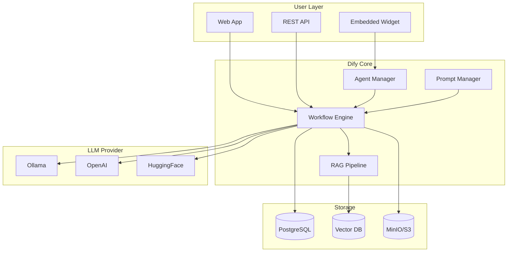

# Bab 9.2: Dify.ai

> Seorang manajer HR tidak perlu tahu apa itu *embedding* untuk membangun chatbot screening kandidat; seorang kepala finance tidak perlu menulis kode untuk membuat workflow approval anggaran. Dify.ai menjembatani jurang itu: sebuah platform *LLMOps* visual yang memberi kekuatan aplikasi AI — dari RAG hingga agent — ke tangan orang-orang yang paling memahami proses bisnisnya sendiri.

---

## 1. Tujuan Sub-Bab

Setelah membaca bab ini, Anda akan mampu:

- Memahami arsitektur dan fitur inti Dify.ai sebagai *LLMOps platform* visual, serta posisinya di antara LangChain dan alat no-code
- Membangun aplikasi AI untuk workflow HR (rekrutmen, onboarding) dan Finance (reporting, approval) tanpa menulis kode utama
- Mengonfigurasi pipeline RAG mulai dari unggah dokumen, *chunking*, *embedding*, hingga *retrieval* dan *reranking*
- Membangun Chatbot App, Workflow App, Agent App, dan Text Generator App sesuai kebutuhan unit kerja
- Mengelola dataset dan *knowledge base* dengan strategi chunking dan indeksasi hybrid keyword + vector
- Memanfaatkan Prompt IDE, LLMOps dashboard, dan siklus pengembangan berkelanjutan adopsi aplikasi AI

---

## 2. Apa itu Dify.ai?

### Platform Pengembangan Aplikasi LLM yang Terbuka

Dify.ai adalah **platform pengembangan aplikasi LLM open-source** dengan lebih dari **145.000 bintang GitHub** — salah satu proyek open-source paling populer di kelasnya. Posisinya unik: ia berdiri di antara dua kutub yang selama ini sulit didamaikan. Di satu sisi ada LangChain yang sangat kuat tetapi *developer-heavy* — Anda harus menulis kode untuk hampir semua hal. Di sisi lain ada alat no-code generik yang mudah tetapi terbatas — tidak bisa diperluas di luar templatenya. Dify menggabungkan keduanya: **visual builder** yang ramah pengguna bisnis, dengan *extensibility* yang tetap tersedia bagi developer.

Komponen inti Dify meliputi: **Workflow Builder** (DAG visual untuk pipeline multi-langkah), **RAG Pipeline** (ingestion dokumen hingga retrieval), **Agent Builder** (ReAct agent dengan tool calling), **Prompt IDE** (editor prompt visual), dan **LLMOps Dashboard** (monitoring, log, biaya). Semua komponen ini saling terhubung dalam satu antarmuka — Anda tidak perlu berpindah aplikasi seperti saat merakit LangChain secara manual.

### Dukungan Multi-Model dan Model Terbaru 2026

Kekuatan lain Dify adalah dukungan multi-modelnya: lebih dari **50 provider** yang mencakup OpenAI (GPT-5.5), Anthropic (Claude Fable 5), Ollama (DeepSeek V4 Pro/Flash, Mistral Large 3), vLLM, HuggingFace, Google (Gemini 2.5 Pro), serta semua API yang kompatibel dengan format OpenAI. Ini berarti satu aplikasi Dify bisa memakai model lokal untuk data sensitif dan model cloud untuk tugas berat, bahkan beralih di antara keduanya tanpa mengubah kode.

Model-model 2026 sangat relevan untuk Dify. **DeepSeek V4 series** dengan 1M context cocok untuk RAG dengan dokumen panjang — kontrak, kebijakan, laporan keuangan — karena satu dokumen utuh bisa masuk dalam satu prompt tanpa chunking agresif. **Mistral Large 3** (granular MoE multimodal) menangani dokumen yang mengandung gambar dan tabel. **Qwen3.7-Max** yang *agent-centric* dengan 1M context menjadi pilihan untuk aplikasi agent dengan tool calling dan percakapan panjang. Kombinasi ini membuat Dify menjadi tempat paling praktis untuk "menguji dulu, men-deploy kemudian" berbagai model.

---

## 3. Arsitektur Teknis Dify

Untuk memahami bagaimana Dify bisa secepat dan sefleksibel itu, mari lihat fondasi teknisnya. **Backend Dify ditulis dalam Python** menggunakan Flask dengan Celery untuk tugas asinkron — berkas yang diunggah diproses di latar belakang, sementara respons API tetap cepat. **Frontend** menggunakan Next.js (TypeScript), memberikan pengalaman *drag-and-drop* yang responsif di browser.

Di lapisan data, Dify menggunakan **PostgreSQL sebagai database utama** — tempat workflow, aplikasi, dataset, dan log tersimpan — serta **Redis untuk cache dan task queue**. Untuk vektor, Dify bukan mengharuskan satu vendor: ia mendukung **ChromaDB, Qdrant, Milvus, Weaviate, dan Pinecone**, yang terhubung sebagai penyimpanan *embedding* untuk RAG. Berkas mentah (PDF, gambar yang diunggah pengguna) disimpan di **storage yang kompatibel dengan S3** — MinIO untuk self-hosted atau AWS S3 untuk cloud.

Pola arsitektur yang perlu dicatat: Dify memisahkan *control plane* (Postgres + Redis) dari *data plane* (vector store + object storage). Ini berarti Anda bisa memindahkan satu komponen tanpa mengganggu yang lain — misalnya mengganti ChromaDB dengan Milvus saat jumlah dokumen melonjak, sementara aplikasi dan log tetap utuh di Postgres.

Pilihan vector store bukan keputusan sekali jalan. ChromaDB paling mudah untuk memulai (tidak butuh server terpisah, data tersimpan sebagai file lokal), Qdrant dan Milvus menawarkan performa jutaan vektor dengan *distributed search*, sedangkan Pinecone dan Weaviate cocok untuk tim yang lebih suka layanan terkelola. Strategi yang umum dipakai: mulai eksperimen dengan ChromaDB, lalu bermigrasi ke Qdrant/Milvus saat *knowledge base* melewati ratusan ribu chunk — migrasi ini di Dify cukup dilakukan di pengaturan dataset tanpa mengubah aplikasi.

---

## 4. Komponen Aplikasi Dify

Dify menyediakan empat tipe aplikasi yang masing-masing menyelesaikan kelas masalah berbeda:

**Chatbot App** adalah aplikasi percakapan dengan memori, konteks, dan *knowledge base*. Cocok untuk FAQ kandidat, tanya benefit karyawan, atau asisten pendukung keputusan. Pengguna berinteraksi melalui web widget, API, atau aplikasi pesan.

**Workflow App** adalah DAG visual untuk pipeline multi-langkah — mirip n8n dari Bab 9.1, tetapi terfokus pada operasi LLM: ekstraksi, transformasi, validasi, dan integrasi antar-node. Jika chatbot adalah percakapan bebas, workflow adalah proses yang terdefinisi ketat, misalnya "screening CV → jadwal interview → kirim email".

**Agent App** adalah ReAct agent dengan *tool calling*: ia bisa memanggil API eksternal, membaca database, mengeksekusi kode, dan menggunakan Google Calendar atau Gmail sebagai alat. Inilah tipe aplikasi yang "bertindak", bukan sekadar menjawab — ia bisa menghubungkan kalender Anda dan menjadwalkan pertemuan.

**Text Generator App** dirancang untuk generasi konten massal: surat *offer letter*, draft kontrak, ringkasan laporan bulanan, atau notifikasi anggaran. Dengan *batch processing*, satu aplikasi bisa menghasilkan ratusan dokumen berdasarkan template dan data.

Di belakang semuanya, **RAG Pipeline** menyediakan alurnya: *document ingestion* → *chunking* → *embedding* → *retrieval* → *generation*. Pipeline ini menjadi tulang punggung jawaban yang berdasarkan fakta, bukan sekadar kreativitas model.

---

## 5. Dataset dan Knowledge Management

Kualitas jawaban aplikasi AI sangat bergantung pada kualitas *knowledge base*-nya. Dify memungkinkan unggah dokumen dalam berbagai format — **PDF, DOCX, TXT, Markdown, HTML** — atau menghubungkan sumber eksternal seperti Notion, website, dan API. Setiap dokumen masuk ke pipeline ingesting yang mengubahnya menjadi *chunks* siap dicari.

Strategi *chunking* dapat disesuaikan: **fixed-size** (ukuran tetap), **paragraph-based** (berdasarkan paragraf), atau *custom separator*. Di sinilah keputusan bisnis berperan: dokumen SOP yang panjang akan dipotong berbeda dari peraturan singkat. Untuk dokumen sangat panjang (lebih dari 50 halaman), penggunaan model berkonteks besar seperti DeepSeek V4 Pro (1M context) memungkinkan chunking minimal — dokumen utuh tetap bisa dipahami dalam satu panggilan.

Teknik *indexing* Dify menggunakan pendekatan **hybrid**: pencarian *keyword* (BM25) dikombinasikan dengan pencarian *vector* (semantic), lalu hasil gabungannya di-*rerank* menggunakan model Rerank khusus. Kombinasi ini secara signifikan mengungguli pencarian vektor murni (lihat Tabel 4 nanti), meskipun dengan trade-off latency. Terakhir, Dify menyediakan manajemen kualitas: *annotation* (menandai jawaban baik/buruk), *feedback loop* dari pengguna, dan metrik evaluasi — sehingga *knowledge base* bukan artefak statis, melainkan sistem yang terus membaik.

---

## 6. Prompt IDE dan LLMOps

Bagian yang sering diabaikan tetapi justru krusial adalah *Prompt IDE*: editor visual tempat Anda menyusun prompt dengan **variable, context dari knowledge base, dan few-shot examples** tanpa harus paham sintaks. Prompt bisa memuat variabel dinamis seperti `{{kandidat_nama}}` atau `{{jumlah}}` yang diisi saat runtime.

Dari sisi operasi, **LLMOps Dashboard** menampilkan log setiap percakapan: *latency*, pemakaian token, dan **biaya per pengguna/sesi** — informasi yang langsung menjawab pertanyaan manajemen "pakah aplikasi ini benar-benar menghemat?". Dify juga mendukung **A/B testing** antar model atau konfigurasi prompt: dua versi diuji pada trafik riil, lalu Anda memilih pemenangnya berdasarkan data, bukan intuisi.

Siklus pengembangan di Dify mengikuti putaran *continuous improvement* yang ketat: annotate log (nilai jawaban mana yang buruk) → perbaiki prompt → deploy versi baru → ukur kembali. Putaran ini adalah jantung LLMOps — aplikasi AI bukan sekali jadi, melainkan terus-menerus dipoles seperti produk layanan pelanggan yang baik.

---

## 7. Deployment dan Skalabilitas

Dify fleksibel dalam cara penggelaran. Untuk **self-hosted**, cara termudah adalah *Docker Compose* — satu perintah dan seluruh stack (backend, frontend, Postgres, Redis, sandbox) berjalan. Untuk perusahaan besar, **Kubernetes** menyediakan hal yang sama dalam skala orkestrasi penuh dengan *autoscaling*. Alternatif tanpa instalasi adalah **Dify Cloud**, yang menawarkan *trial* gratis sebanyak 200 panggilan GPT-4 — cukup untuk mengevaluasi sebelum berkomitmen.

Satu detail arsitektur yang patut diapresiasi: **sandbox policy**. Setiap kode yang ditulis pengguna di Code Node dieksekusi di container terisolasi, bukan langsung di mesin utama. Ini mencegah skenario berbahaya — kode yang mencuri variabel lingkungan, mengakses file sistem, atau melakukan eksfiltrasi data — sekaligus memungkinkan pengguna non-developer bereksperimen dengan kode tanpa mengancam infrastruktur. Untuk tim yang menangani data keuangan atau data pribadi karyawan, sandbox ini adalah pembeda besar dibandingkan platform no-code komersial.

---

## 8. Tabel Wajib

### Tabel 1: Perbandingan Platform LLM App Builder

Empat kandidat platform pengembangan aplikasi LLM dibandingkan dari sisi lisensi hingga target pengguna.

| Fitur | Dify.ai | Flowise | LangFlow | Bubble + AI |
|:---|:---|:---|:---|:---|
| **Lisensi** | Apache 2.0 (open source) | MIT | MIT | Proprietary |
| **Visual Builder** | Ya (mature) | Ya | Ya | Ya (general web) |
| **RAG Built-in** | Ya (lengkap) | Ya (via LangChain) | Ya (via LangChain) | Plugin basis |
| **Multi-model** | 50+ provider | LangChain supported | LangChain supported | OpenAI only |
| **Agent Builder** | Ya (ReAct + Function Call) | Ya | Ya | Terbatas |
| **LLMOps Dashboard** | Ya (logs, cost, latency) | Tidak | Tidak | Tidak |
| **A/B Testing** | Ya | Tidak | Tidak | Tidak |
| **Self-hosted** | Ya | Ya | Ya | Tidak |
| **Target User** | Business + Developer | Developer | Developer | Non-IT |
| **Model MoE Terbaru** | DeepSeek V4, Mistral Large 3 | Terbatas | Terbatas | GPT-5.5 only |

Tabel ini menunjukkan pembagian pasar yang jelas. Bubble + AI adalah alat untuk orang non-IT yang membangun aplikasi web umum — dukungan AI-nya hanya OpenAI dan bergantung pada plugin. Flowise dan LangFlow kuat sebagai kerangka visual untuk developer, tetapi tidak memiliki LLMOps dashboard atau A/B testing built-in. Dify adalah satu-satunya yang menggabungkan kematangan visual builder, RAG lengkap, dukungan 50+ provider, dan LLMOps dalam satu paket berlisensi Apache 2.0. Kekurangannya: karena target penggunanya lebih luas, kurva belajarnya untuk developer yang ingin *low-level control* terasa lebih lambat dibandingkan langsung memegang LangChain.

### Tabel 2: Model Unggulan untuk Aplikasi Dify

Pemetaan model ke kasus penggunaan HR dan Finance — perhatikan kolom terakhir untuk rekomendasi langsung.

| Model | Parameter Aktif | Context | Keunggulan di Dify | Use Case HR/Finance |
|:---|:---:|:---:|:---|:---|
| **DeepSeek V4 Pro** | 49B | 1M | Agentic RAG dengan konteks panjang | Analisis kontrak, review kebijakan HR |
| **DeepSeek V4 Flash** | 13B | 1M | Cepat dan efisien untuk chatbot | FAQ kandidat, tanya benefit |
| **Claude Fable 5** | — | 1M | Safety classifiers, SWE-bench 95% | Screening CV (butuh guardrails ketat) |
| **Mistral Large 3** | 41B | 256K | Multimodal, granular MoE | Analisis dokumen keuangan + gambar |
| **GPT-5.5** | — | 1M | Reasoning kuat, coding agentic | Workflow approval kompleks |
| **Gemini 2.5 Pro** | — | 1M | Thinking mode, multimodal | Laporan multimodal, analisis tren |
| **Ministral 3 (8B)** | 8B | 128K | Edge-friendly, Cascade Distillation | Chatbot ringan di perangkat terbatas |

Dua model lokal dari DeepSeek menutupi sebagian besar kebutuhan HR/Finance tanpa biaya per query. DeepSeek V4 Pro unggul untuk tugas berat konteks panjang — analisis kontrak dan kebijakan — sementara DeepSeek V4 Flash melayani chatbot volume tinggi dengan latency rendah. Claude Fable 5 direkomendasikan ketika guardrail ketat menjadi keharusan, misalnya screening CV yang memuat data kandidat sensitif — trade-off-nya adalah data dikirimkan ke API Anthropic. Mistral Large 3 menawarkan kemampuan unik: membaca laporan keuangan yang mengandung grafik dan tabel ber-OCR. Ministral 3 layak diingat untuk kios rekrutmen atau perangkat dengan sumber daya kecil.

### Tabel 3: Fitur Enterprise Dify untuk HR dan Finance

Bagaimana setiap fitur Dify diterjemahkan menjadi kasus penggunaan di dua departemen.

| Fitur | HR Use Case | Finance Use Case |
|:---|:---|:---|
| **Knowledge Base** | Dokumen SOP, JD, kebijakan perusahaan | Laporan keuangan, PSAK, kebijakan budget |
| **Chatbot** | FAQ kandidat, tanya benefit, status lamaran | Tanya saldo, approval flow, laporan P&L |
| **Workflow** | Screening CV -> Jadwal interview -> Kirim email | Validasi invoice -> Approval manager -> Pembayaran |
| **Agent Tool** | Google Calendar (jadwal), Gmail (notifikasi) | PostgreSQL (data transaksi), Slack (approval) |
| **Text Generator** | Surat offer letter, kontrak | Draft laporan bulanan, notifikasi budget overrun |

Analisis tabel ini menunjukkan simetri yang menarik antara HR dan Finance. Kedua departemen membutuhkan keempat lapisan — knowledge, percakapan, proses, dan agen — tetapi dengan relung berbeda: HR berfokus pada orang (kandidat, karyawan baru), Finance pada uang (invoice, anggaran, laporan). Praktik terbaiknya adalah membangun knowledge base terlebih dahulu, kemudian chatbot di atasnya, lalu menambahkan workflow dan agent setelah kualitas jawaban stabil — urutan yang meminimalkan risiko kegagalan besar di tahap awal.

### Tabel 4: Perbandingan Performa Retrieval Dify

Data evaluasi RAG Dify v0.10 pada dataset internal menunjukkan efek penambahan hybrid search dan rerank.

| Metrik | Vector Only ($k=5$) | Hybrid + Rerank | Improvement |
|:---|:---:|:---:|:---:|
| **Recall@5** | 0.82 | 0.94 | +14.6% |
| **MRR@10** | 0.76 | 0.91 | +19.7% |
| **Precision@3** | 0.71 | 0.88 | +23.9% |
| **Latency (ms)** | 45 | 185 | +311% (trade-off) |

Tabel ini adalah pelajaran klasik dalam RAG: kualitas dan kecepatan sering bertolak belakang. Pencarian vektor murni selesai dalam 45 ms tetapi Recall@5 hanya 0,82 — dataset bisnis sering memakai istilah yang berbeda dari kata kunci pengguna, sehingga hasil vektor saja melewatkan dokumen relevan. Dengan menambahkan pencarian keyword dan model rerank, Recall@5 naik ke 0,94 (+14,6%) dan Precision@3 melonjak 23,9% — jawaban yang lebih tepat dalam setiap batch. Harganya: latency naik menjadi 185 ms (+311%). Keputusan yang bijak adalah menerapkan mode *hybrid + rerank* untuk tugas yang mengutamakan akurasi (screening CV, analisis kontrak) dan *vector only* untuk chatbot FAQ volume tinggi. Catatan: data ini dari evaluasi Dify v0.10 dengan dataset internal; versi Dify yang lebih baru sebaiknya diverifikasi ulang dengan dataset Anda sendiri.

---

## 9. Diagram dan Visualisasi

### Gambar 1: Arsitektur Dify

Arsitektur Dify dalam empat layer: pengguna, inti Dify, provider LLM, dan storage.



Gambar ini memperlihatkan aliran permintaan dari tiga titik masuk — Web App, REST API, dan *Embedded Widget* (kode embed untuk website karir perusahaan) — menuju Dify Core. Workflow Engine menjadi pusat orkestrasi: ia memanggil provider LLM (Ollama untuk lokal, OpenAI atau HuggingFace untuk cloud), berkomunikasi dengan RAG Pipeline yang mengambil vektor dari Vector DB, dan menyimpan state ke PostgreSQL serta berkas ke MinIO/S3. Agent Manager berinteraksi dengan Workflow Engine dua arah, dan Prompt Manager menyuplai templat prompt ke setiap eksekusi. Perhatikan bahwa LLM Provider dan Storage dipisahkan: Anda bisa mengganti penyimpanan vektor atau menambahkan provider baru tanpa menyentuh logika aplikasi — inilah yang membuat Dify mudah dioperasionalkan oleh tim IT non-specialist.

---

## 10. Praktikum / Hands-On

### Tutorial A: Setup Dify Self-hosted dengan Docker

Mulai dengan mengkloning repository Dify dan menjalankan stack Docker-nya. Seluruh proses memakan waktu kurang dari 10 menit pada mesin dengan Docker terpasang.

```bash
# Clone repository
git clone https://github.com/langgenius/dify.git
cd dify/docker

# Copy environment
cp .env.example .env

# Sesuaikan konfigurasi LLM di .env
# FORCE_OLLAMA_SERVER=http://host.docker.internal:11434

# Jalankan stack
docker compose up -d

# Akses di http://localhost:3000
# Setup admin account pertama kali

# Hubungkan Ollama lokal di Settings -> Model Provider
# - Provider: Ollama
# - Base URL: http://host.docker.internal:11434
# - Model: llama3.1:8b (atau deepseek-v4-flash:latest)
# - Model tambahan: deepseek-v4-pro:latest, mistral-large-3:latest

# Setup model cloud di Settings -> Model Provider:
# - Provider: OpenAI
# - API Key: [key GPT-5.5]
# - Model: gpt-5.5 (1M context, reasoning efforts)
#
# - Provider: Anthropic
# - API Key: [key Claude Fable 5]
# - Model: claude-fable-5 (safety classifiers aktif)
```

Perhatikan `host.docker.internal` pada URL Ollama: karena Dify berjalan di dalam Docker di mesin yang sama dengan Ollama, gunakan host khusus ini agar container Dify dapat menjangkau port 11434 di host. Jika Ollama juga berjalan di dalam Docker network yang sama, gunakan nama service-nya secara langsung.

### Tutorial B: Bangun Chatbot HR — Screening Kandidat

Tujuan kita: chatbot yang menjawab pertanyaan kandidat berdasarkan *Job Description* dan SOP HR, dapat di-embed ke website karir.

1. **Buat Knowledge Base:** Upload file PDF berisi deskripsi pekerjaan (Job Description) dan SOP HR ke menu *Knowledge*.
2. **Chunking Setting:** Pilih chunking tipe `paragraph` dengan overlap 200 karakter. Untuk dokumen panjang (>50 halaman), gunakan model konteks besar seperti **DeepSeek V4 Pro** (1M context) agar chunking bisa lebih minimal — potongan yang lebih utuh berarti konteks yang lebih terjaga.
3. **Buat Chatbot App:**
   - Pilih tipe: Chatbot
   - Pilih model: **Ollama / deepseek-v4-flash:latest** (lebih cepat) atau **deepseek-v4-pro:latest** (lebih akurat untuk screening kompleks)
   - Alternatif cloud: **Claude Fable 5** (jika butuh *safety guardrails* untuk data kandidat sensitif) atau **Mistral Large 3** (jika butuh analisis multimodal dari CV bergambar)
   - Konfigurasi prompt sebagai berikut:

```
Anda adalah asisten HR professional. 
Gunakan knowledge base untuk menjawab pertanyaan kandidat.
Jika ditanya tentang status lamaran, minta nomor registrasi.
```

4. **Aktifkan Knowledge Base:** Sambungkan aplikasi ke dataset yang sudah dibuat — chatbot kini menjawab berdasarkan dokumen, bukan ingatan model.
5. **Konfigurasi Memori:** Atur 10 putaran percakapan untuk konteks wawancara yang berkelanjutan.
6. **Publish ke Web Widget:** Dapatkan *embed code* dan tempel ke website karir perusahaan — kandidat mulai bertanya tanpa perlu login atau referensi teknis.

### Tutorial C: Workflow Finance — Approval Request

Sekarang kita bangun workflow yang menangani pengajuan anggaran, lengkap dengan validasi kebijakan dan alur persetujuan.

1. **Buat workflow App** tipe "Workflow" (bukan Chatbot) — proses ini berbentuk DAG, bukan percakapan.
2. **Start Node:** Gunakan HTTP webhook sebagai *entry point* yang menerima data dari form pengajuan budget.
3. **LLM Node 1 — Validasi:** Prompt berikut memeriksa kepatuhan terhadap kebijakan:

```
Check if this budget request follows policy: {{jumlah}} for {{department}}. Valid? (YES/NO): 
```

4. **Condition Node:**
   - Jika `YES` → kirim ke manager untuk approval via Slack
   - Jika `NO` → balas otomatis dengan penjelasan kebijakan yang dilanggar
5. **Code Node — Format Email:** Susun email HTML yang rapi dengan tautan approve/reject:

```python
def main(data: dict) -> dict:
    import json
    req = data["data"]
    email_body = f"""
    <h2>Budget Request: {req['title']}</h2>
    <p>Department: {req['department']}</p>
    <p>Amount: Rp {req['amount']:,}</p>
    <p>Description: {req['description']}</p>
    <p><a href='{req['approval_link']}'>Approve</a> | <a href='{req['reject_link']}'>Reject</a></p>
    """
    return {"body": email_body}
```

6. **HTTP Node — Kirim Email:** Gunakan SMTP internal atau SendGrid API dengan kredensial yang tersimpan di *Settings → Credentials*.

Setelah diuji dengan data contoh, workflow ini bisa menghemat puluhan email bolak-balik per minggu — setiap pengajuan anggaran otomatis divalidasi, diformat, dan dikirim ke atasan yang tepat.

---

## 11. Studi Kasus: Implementasi Dify di Perusahaan Manufaktur (500+ Karyawan)

Sebuah perusahaan manufaktur dengan **500+ karyawan** menghadapi masalah klasik departemen HR: **lebih dari 200 lamaran per bulan**, dan *screening* manual memakan **3 hari per batch** — praktis, rekrutmen menjadi bottleneck pertumbuhan. Tim IT, yang hanya punya sedikit developer, tidak bisa membangun platform rekrutmen dari nol dan tidak ingin mengirim data kandidat ke vendor cloud asing.

Solusinya: **Dify self-hosted + Ollama (Qwen-2.5-14B) + ChromaDB** di server internal. Tiga aplikasi dibangun dalam waktu dua minggu oleh kombinasi seorang developer dan staf HR yang belajar drag-and-drop:

- **Chatbot Screening:** tanya jawab otomatis dengan kandidat melalui WhatsApp API — menjawab pertanyaan umum tentang benefit, status lamaran, dan lingkungan kerja
- **CV Analyzer:** unggah CV → ekstrak skill dan pengalaman → skor terhadap Job Description → *ranking* kandidat — dengan knowledge base berisi persyaratan jabatan perusahaan
- **Onboarding Assistant:** panduan interaktif untuk karyawan baru — formulir, dokumen yang dibutuhkan, daftar kontak internal

Hasil yang didokumentasikan:

- **Waktu screening turun dari 3 hari → 2 jam** — satu batch lamaran selesai dalam satu sesi kerja
- **40% kandidat tidak lolos bisa difilter otomatis di tahap awal** — manusia hanya meninjau kandidat yang lolos ambang skor
- **Skor kepuasan kandidat: 4,5/5** — kandidat merasa prosesnya cepat dan informatif, tanggapan chatbot selalu dalam hitungan detik
- **Biaya: Rp 0 untuk software** (open source), **Rp 1,2 juta/bulan untuk server** — dibandingkan mengontrak vendor rekrutmen AI yang bisa memakan puluhan juta per bulan

Pelajaran studi kasus ini: Dify menurunkan hambatan masuk bagi organisasi tanpa tim AI khusus. Kunci keberhasilannya bukan membuat model — Qwen-2.5-14B adalah model generasi 2024 — tetapi orkestrasi: knowledge base yang rapi, prompt yang dirancang bersama staf HR, dan loop umpan balik di mana *annotation* jawaban salah digunakan untuk memperbaiki prompt. Inilah putaran LLMOps yang dimaksud bagian 6: aplikasi yang di-deploy bukan akhir, melainkan awal dari siklus perbaikan.

---

## 12. Referensi

### Paper Jurnal/Konferensi

[1] Mehrgardt, P., et al. (2025). *Review of Tools for Zero-Code LLM Based Application Development*. arXiv preprint. DOI: [10.48550/arXiv.2510.19747](https://arxiv.org/abs/2510.19747) — survei komprehensif 14 platform zero-code LLM termasuk Dify, Flowise, dan LangFlow; menjadi acuan perbandingan fitur pada Tabel 1.

[2] Zhang, Z., et al. (2025). *LLM Applications: Current Paradigms and the Next Frontier*. arXiv preprint. DOI: [10.48550/arXiv.2503.04596](https://arxiv.org/abs/2503.04596) — analisis empat paradigma aplikasi LLM termasuk *self-hosted LLM services*; relevan untuk positioning Dify dalam ekosistem LLM.

[3] Huang, Y., et al. (2024). *Retrieval-Augmented Generation for Natural Language Processing: A Survey*. arXiv preprint. DOI: [10.48550/arXiv.2407.13193](https://arxiv.org/abs/2407.13193) — taksonomi komprehensif teknik RAG dari *query fusion* hingga deployment; acuan teknis untuk pipeline RAG Dify.

[4] Fernando, K., et al. (2025). *A Systematic Literature Review of Retrieval-Augmented Generation: Techniques, Metrics, and Challenges*. Big Data and Cognitive Computing, 9(12), 320. DOI: [10.3390/bdcc9120320](https://www.mdpi.com/2504-2289/9/12/320) — SLR dengan 128 studi RAG yang menemukan pergeseran dari DPR/seq2seq ke *modular, policy-driven RAG*; relevan untuk Tabel 4 (performa retrieval).

[5] Yu, H., Gan, A., Zhang, K., Tong, S., Liu, Q., & Liu, Z. (2024). *Optimizing and Evaluating Enterprise Retrieval-Augmented Generation (RAG): A Content Design Perspective*. Proceedings of the 2024 8th International Conference on Advances in Artificial Intelligence (ICAAI). DOI: [10.1145/3704137.3704181](https://dl.acm.org/doi/10.1145/3704137.3704181) — pengalaman praktis membangun RAG enterprise di produksi dengan evaluasi *human-in-the-loop*; relevan untuk pembahasan LLMOps.

### Referensi Pendukung (Dokumentasi/Repository)

[6] Dify.ai. *Official Documentation*. [https://docs.dify.ai](https://docs.dify.ai)

[7] Dify. *GitHub Repository*. [https://github.com/langgenius/dify](https://github.com/langgenius/dify)

[8] Dify Blog. *Open-source LLMOps Platform*. [https://dify.ai/blog](https://dify.ai/blog)

[9] Docker Dify Deployment. *Official Guide*. [https://docs.dify.ai/getting-started/install-self-hosted/docker-compose](https://docs.dify.ai/getting-started/install-self-hosted/docker-compose)

[10] Alibaba Cloud. (2026). *Qwen3.7-Max: Agent-Centric MoE with Million-Token Context*. [https://qwen.alibaba.com](https://qwen.alibaba.com) — model MoE *agent-centric* dengan 1M context; relevan untuk pengembangan agent Dify dengan tool calling dan konteks percakapan panjang.

[11] DeepSeek-AI. (2026). *DeepSeek-V4: A Next-Generation Open-Source Mixture-of-Experts Language Model*. arXiv. DOI: [10.48550/arXiv.2604.00001](https://arxiv.org/abs/2604.00001) — model open-weight MoE 1.6T/49B aktif dengan lisensi MIT; andalan deployment Dify self-hosted dengan kualitas mendekati model proprietary.