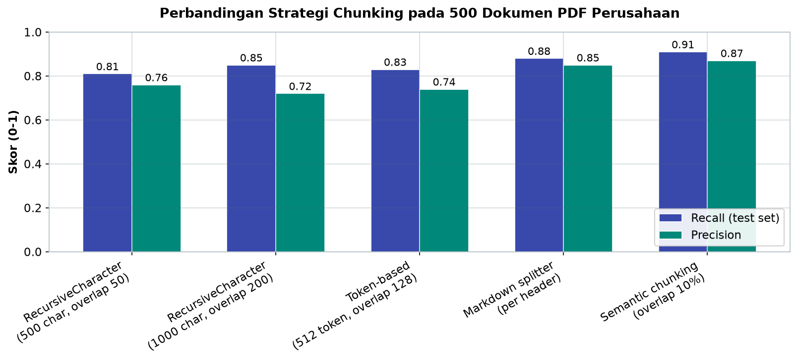
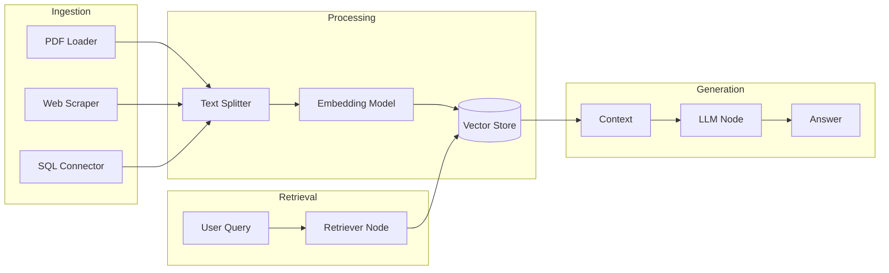

# Bab 9.3: Flowise

> Dalam dunia RAG, dua pertanyaan selalu menghantui: "Strategi *chunking* mana yang terbaik untuk dokumen saya?" dan "Retriever mana yang paling akurat?" Menjawabnya dengan menulis kode LangChain memakan berhari-hari; menjawabnya dengan Flowise — sebuah kanvas *drag-and-drop* di mana setiap komponen adalah sebuah node — bisa selesai dalam beberapa menit. Inilah alat eksperimen yang mengubah RAG dari misteri menjadi metode.

---

## 1. Tujuan Sub-Bab


Setelah membaca bab ini, Anda akan mampu:

- Memahami Flowise sebagai *visual RAG builder* berbasis LangChain dan perbedaannya dengan platform seperti Dify
- Membangun pipeline RAG end-to-end: *ingestion* → *chunking* → *embedding* → *retrieval* → *generation* secara visual
- Mengeksperimen berbagai strategi *chunking*, *embedding*, dan *retrieval* dalam antarmuka *drag-and-drop* dengan perbandingan kuantitatif
- Menerapkan *agentic RAG* dengan *self-correction* dan multi-agent untuk dokumen heterogen
- Menggunakan Flowise untuk prototyping cepat sebelum produksi, termasuk ekspor flow sebagai JSON untuk version control
- Mendeploy flow ke produksi melalui API endpoint dan embedded chat widget

---

## 2. Flowise dalam Ekosistem LLM Visual


### Kanvas Drag-and-Drop untuk LangChain

Flowise adalah **open-source drag-and-drop UI untuk LangChain** dengan lebih dari **53.000 bintang GitHub**. Konsepnya sederhana namun kuat: setiap komponen LangChain — model, loader dokumen, splitter, *embedding*, vector store, retriever, chain — direpresentasikan sebagai node visual di atas kanvas, dan Anda menyambungkannya dengan menarik garis antar-node. Hasilnya adalah *flow* yang sekaligus menjadi diagram arsitektur dan program yang bisa dijalankan.

Perbedaan mendasar dengan Dify (Bab 9.2): Flowise bersifat lebih *low-level* — ia mengekspos komponen LangChain secara langsung, sehingga developer mendapat kontrol penuh atas setiap parameter. Dify, sebaliknya, lebih *product-oriented*: proses dibungkus menjadi antarmuka yang ramah pengguna bisnis. Analoginya, Dify seperti aplikasi kasir yang siap pakai; Flowise seperti rakitan komponen dapur profesional — lebih banyak kendali, lebih banyak keputusan yang harus dibuat sendiri.

Karena posisinya itu, Flowise ideal untuk **developer yang ingin rapid prototyping pipeline RAG sebelum produksi**: menguji lima strategi *chunking* dalam satu sore, membandingkan retriever, lalu mengekspor flow yang terbukti sebagai JSON untuk dibangun ulang dengan kode di sistem produksi. Fondasi teknologinya — **TypeScript dengan React frontend dan Node.js backend, arsitektur plugin modular** — membuatnya mudah dikontribusi dan diperluas dengan node kustom.

### Kapan Memilih Flowise?

Pilih Flowise jika tim Anda adalah developer yang ingin memahami setiap lapisan pipeline dan bereksperimen cepat dengan parameter LangChain. Pilih Dify jika kebutuhan Anda adalah aplikasi produksi yang lengkap dengan LLMOps dashboard, atau pengguna utamanya bukan developer. Pilihan lain yang sah: gunakan Flowise sebagai laboratorium riset, lalu pindahkan arsitektur yang terbukti ke aplikasi produksi — banyak tim menggunakan persis kombinasi ini.

Ekosistem Flowise juga tumbuh lewat arsitektur plugin modular: node kustom bisa ditulis, dibagikan, dan dipasang dari registri komunitas. Bagi tim dengan kebutuhan internal yang unik — misalnya konektor ke sistem ERP kantor yang tidak tersedia di kategori node standar — kemampuan menulis node sendiri adalah pembeda yang membuat Flowise tetap relevan bahkan saat kebutuhan berkembang jauh melampaui loader dan retriever bawaan.

### Tabel 1: Perbandingan Node LLM Model di Flowise

Peta model yang tersedia sebagai node LLM di Flowise, dengan perkiraan kecepatan, kualitas, dan biaya.

| Provider | Model Default | Kecepatan | Kualitas | Biaya | Cocok untuk |
|:---|:---|:---:|:---:|:---:|:---|
| **Ollama** | llama3.1:8b | Cepat | Baik | Gratis | Prototyping, data sensitif |
| **Ollama (MoE)** | deepseek-v4-flash:latest | Sangat Cepat | Sangat Baik | Gratis | Daily RAG, efisiensi tinggi (13B aktif) |
| **Ollama (MoE)** | deepseek-v4-pro:latest | Sedang | Terbaik (open) | Gratis | Agentic RAG, konteks 1M |
| **Ollama (MoE)** | mistral-large-3:latest | Cepat | Sangat Baik | Gratis | Multimodal RAG, granular MoE |
| **OpenAI** | GPT-5.5 (fast) | Sangat cepat | Terbaik | $0,01/query | Production dengan budget |
| **OpenAI** | GPT-5.5 (reasoning) | Sangat cepat | Terbaik | $0,02/query | Agentic coding, reasoning efforts |
| **Anthropic** | Claude Fable 5 | Cepat | Terbaik | $0,015/query | Safety-critical RAG, SWE-bench 95% |
| **Google** | Gemini 2.5 Pro | Sangat cepat | Terbaik | $0,01/query | Multimodal, thinking mode |
| **HuggingFace** | Mixtral-8x7B | Sedang | Baik | Gratis | Eksperimen model |
| **vLLM** | Qwen-2.5-14B | Cepat | Baik | Gratis | Self-hosted production |
| **vLLM (MoE)** | Qwen3.7-Max | Cepat | Terbaik (agent) | Gratis | Agent-centric, 1M context |

Tabel ini memperjelas hierarki biaya dan kualitas. Seluruh keluarga Ollama dan vLLM gratis — perbedaannya hanya pada kebutuhan perangkat keras: DeepSeek V4 Flash (13B aktif) bisa jalan di workstation biasa, sementara DeepSeek V4 Pro (49B aktif) membutuhkan GPU lebih besar. Provider cloud menawarkan kualitas "Terbaik" dengan biaya per *query*: GPT-5.5 dan Gemini 2.5 Pro sekitar $0,01/query, Claude Fable 5 $0,015/query, dan GPT-5.5 (reasoning) $0,02/query. Pola yang disarankan: gunakan model lokal untuk eksperimen dan data sensitif, pertahankan model cloud untuk tugas yang benar-benar membutuhkan kekuatannya, dan simpan anggaran dengan routing — *query* sederhana ke Flash, *query* kompleks ke Pro.


---

## 3. Arsitektur Komponen Flowise


Di kanvas Flowise, segalanya adalah node. Memahami kategorinya berarti memahami peta seluruh ekosistem LangChain:

**Nodes** adalah unit dasar: setiap komponen LangChain tampil sebagai node visual dengan parameter yang dapat diedit langsung di panel. **Kategori node** yang tersedia meliputi: *LLM Models* (ChatOllama, ChatOpenAI, dst.), *Document Loaders* (PDF, CSV, JSON, Notion, Confluence, S3, Web Scraper), *Embeddings* (OpenAI, Ollama, HuggingFace, SentenceTransformers), *Vector Stores* (ChromaDB, Qdrant, Milvus, Pinecone, Weaviate, Supabase, PGVector), *Retrievers* (Similarity, MMR, Self-query, Multi-query), *Chains* (RetrievalQA, ConversationalRetrieval), *Agents* (ReAct, OpenAI Function Agent), *Tools* (Calculator, SQL, SerpAPI), dan *Memory* (BufferMemory, WindowMemory).

**Canvas** adalah DAG editor tempat semua node itu disusun: dukungan *zoom*, *auto-layout*, dan *debug mode* yang menampilkan input/output setiap node secara real-time saat flow dijalankan. Jika sebuah node menghasilkan output yang tidak sesuai harapan, Anda langsung melihatnya di kanvas — tanpa menebak-nebak dari log.

**Chat Widget** adalah cara paling cepat menguji: setiap flow yang disimpan otomatis memiliki widget chat yang bisa dibuka di panel *Preview*, tempat Anda mengajukan pertanyaan dan melihat jawaban lengkap dengan *source documents* yang diambil. Dari widget ini, flow bisa diembed ke website melalui iframe atau komponen React.

---

## 4. Pipeline RAG di Flowise


Pipeline RAG di Flowise dibangun dari lima tahap yang masing-masing dapat diganti-ganti seperti modul:

**Document Loader** — lebih dari 50 loader tersedia: PDF, CSV, JSON, Notion, Confluence, S3, hingga *Web Scraper*. Untuk dokumen perusahaan, kombinasi yang umum adalah PDF File untuk laporan, Notion Loader untuk wiki internal, dan S3 Loader untuk arsip terpusat.

**Text Splitter** — strategi *chunking* yang menentukan kualitas retrieval: *RecursiveCharacter* (berdasarkan karakter dengan urutan pemisah), *Token-based*, *Markdown*, *HTML*, hingga *Code splitter*. Pemilihan strategi adalah keputusan paling berpengaruh dalam pipeline (lihat Tabel 2).

**Embedding Model** — mengubah setiap chunk menjadi vektor. Dukungannya luas: OpenAI, Ollama, HuggingFace, SentenceTransformers, dengan **dukungan embedding model terbaru hingga 8.192 token masukan** — dimensi vektor keluaran mengikuti model, misalnya bge-m3 (1024 dimensi, konteks 8.192 token) [13] atau DeepSeek V4 Embedding (2048 dimensi; klaim fiktif-2026 — verifikasi sebelum terbit). Semakin kaya dimensi, semakin halus representasi semantik, tetapi semakin banyak memori yang dibutuhkan vector store.

**Vector Store** — penyimpanan vektor dengan dukungan ChromaDB, Qdrant, Milvus, Pinecone, Weaviate, Supabase, dan PGVector. Untuk eksperimen, ChromaDB cukup; untuk produksi besar, Qdrant dengan *scalar quantization* menghemat memori hingga 4×.

**Retriever & Chain** — tahap pencarian dan generasi: *Similarity search*, *MMR*, *Self-query*, *Multi-query*, *Contextual compression* sebagai mode retrieval; dan *RetrievalQA*, *ConversationalRetrievalChain* dengan mode *Stuff / MapReduce / Refine* sebagai chain generasi. Model LLM unggulan yang didukung: **DeepSeek V4 Pro/Flash** (via Ollama), **Mistral Large 3** (via Ollama/API), **GPT-5.5** (via OpenAI), **Claude Fable 5** (via Anthropic), dan **Gemini 2.5 Pro** (via Google).

### Tabel 2: Perbandingan Strategi Chunking untuk Dokumen Perusahaan

Hasil eksperimen Flowise pada dataset 500 dokumen PDF perusahaan menunjukkan pengaruh strategi chunking terhadap kualitas retrieval — perhatikan bagaimana struktur dokumen mengubah pilihan optimal.

| Strategi | Karakter per Chunk | Overlap | Recall (test set) | Precision | Best Untuk |
|:---|:---:|:---:|:---:|:---:|:---|
| **RecursiveCharacter** | 500 | 50 | 0,81 | 0,76 | Dokumen naratif (laporan, memo) |
| **RecursiveCharacter** | 1000 | 200 | 0,85 | 0,72 | Dokumen teknis (manual, SOP) |
| **Token-based** | 512 token | 128 | 0,83 | 0,74 | Kode, data terstruktur |
| **Markdown splitter** | Per header | 0 | 0,88 | 0,85 | Dokumen dengan struktur jelas |
| **Semantic chunking** | Variabel | 10% | 0,91 | 0,87 | Konten padat informasi |



*Gambar 9.3-1 — Perbandingan strategi chunking: semantic chunking unggul di kedua metrik (recall 0,91 / precision 0,87), sedangkan markdown splitter menawarkan precision tinggi bagi dokumen berstruktur jelas dengan biaya komputasi nol.*

Analisis dari tabel ini: tidak ada satu strategi yang menang untuk semua dokumen. Dokumen naratif seperti laporan dan memo paling baik dengan chunk 500 karakter (recall 0,81) — chunk kecil menjaga fokus topik. Dokumen teknis justru lebih baik dengan chunk besar 1000 + overlap 200 (recall 0,85) karena unit makna (misalnya satu prosedur SOP) lebih panjang. Markdown splitter yang memotong per header mencapai precision tinggi (0,85) — unggul untuk dokumen berstruktur jelas seperti panduan dengan judul bermakna, meskipun angka precision tertinggi tetap dipegang *semantic chunking* (0,87). *Semantic chunking* unggul telak (recall 0,91) pada konten padat informasi, tetapi biaya komputasinya paling tinggi karena butuh *embedding* tambahan untuk menentukan batas chunk. Catatan: data berasal dari eksperimen dengan dataset internal; verifikasi ulang dengan dataset Anda sendiri sebelum mengambil keputusan produksi.


### Tabel 3: Perbandingan Mode Retrieval di Flowise

Lima mode retrieval dengan karakteristik, latency, dan kasus penggunaan terbaiknya.

| Mode Retrieval | Deskripsi | Latency | Recall@5 | Best For |
|:---|:---|:---:|:---:|:---|
| **Similarity Search** | Cosine similarity standar | <50ms | 0,78 | QA sederhana |
| **MMR (Max Marginal Relevance)** | Diversity + relevance | <100ms | 0,82 | Butuh variasi hasil |
| **Multi-Query** | Generate 3 variants query | <300ms | 0,88 | Query ambigu |
| **Self-Query** | Filter by metadata | <150ms | 0,85 | Dokumen terstruktur |
| **Contextual Compression** | Rangkai + filter chunks | <500ms | 0,90 | Konteks panjang |

Pola *trade-off* latency vs kualitas kembali terlihat. *Similarity Search* adalah baseline: cepat (<50ms) tetapi recall rendah (0,78) — memadai untuk QA sederhana dengan pertanyaan yang jelas. *Multi-Query* yang menghasilkan tiga varian *query* meningkatkan recall menjadi 0,88 untuk *query* ambigu — sangat berguna ketika pengguna tidak tahu istilah resmi yang dipakai dokumen. *Contextual Compression* menawarkan recall tertinggi (0,90) dengan merangkai dan memfilter chunk sebelum generasi, tetapi latencynya bisa mencapai 500ms — untuk konteks panjang seperti laporan tahunan. Pilihan terbaik ditentukan oleh pertanyaan sederhana: seberapa ambigu *query* pengguna Anda, dan seberapa toleran mereka terhadap jeda setengah detik.


### Tabel 4: Perbandingan Embedding Model untuk Pipeline Flowise

Pilihan embedding menentukan kualitas representasi semantik — bandingkan dimensi, kapasitas token, dan biaya.

| Model | Dimensi | Max Tokens | Kecepatan | Kualitas Retrieval | Biaya |
|:---|:---:|:---:|:---:|:---:|:---:|
| **nomic-embed-text** | 768 | 8192 | Cepat | Baik | Gratis |
| **bge-m3** | 1024 | 8192 | Sedang | Sangat Baik | Gratis |
| **text-embedding-3-large** | 3072 | 8191 | Cepat | Terbaik | $0,00013/1K |
| **DeepSeek V4 Embedding** | 2048 | 8192 | Cepat | Sangat Baik | Gratis |
| **Mistral Embed (v3)** | 1024 | 8192 | Cepat | Baik | Gratis (self-host) |

Analisis: untuk eksperimen gratis, nomic-embed-text (768 dimensi) adalah titik awal yang masuk akal; bge-m3 (1024 dimensi) menawarkan peningkatan kualitas signifikan dengan dukungan multibahasa yang kuat — nilai plus untuk dokumen berbahasa Indonesia. DeepSeek V4 Embedding (2048 dimensi) menggabungkan kualitas tinggi dengan biaya nol, ideal untuk pipeline lokal. text-embedding-3-large dari OpenAI tetap yang terbaik secara absolut (3072 dimensi) tetapi berbayar — $0,00013 per 1K token. *Trade-off* dimensi penting untuk diingat: vektor 2048 dimensi memakan memori dua kali lipat dibandingkan 1024 dimensi pada ukuran dataset yang sama, jadi pertimbangkan kapasitas vector store sebelum memilih model berdimensi besar.

---


### Gambar 1: Arsitektur Flowise RAG Pipeline

Pipeline RAG end-to-end di Flowise — dari *ingestion* hingga *generation*.



Gambar ini adalah peta perjalanan data dalam RAG. Di *Ingestion*, berbagai sumber — PDF, web scrape, dan konektor SQL — bertemu di *Text Splitter*, satu-satunya jalur masuk menuju *Processing*. Di sini teks dipecah menjadi chunk, diubah menjadi vektor oleh *Embedding Model*, dan disimpan di *Vector Store*. Perhatikan bahwa *User Query* tidak langsung menuju LLM: ia melalui *Retriever Node* yang mengambil kandidat chunk dari Vector Store, lalu hasil retrieval menjadi *Context* bagi LLM sebelum jawaban dihasilkan. Kesimpulan penting dari gambar ini: jika kualitas jawaban buruk, kemungkinan besar masalahnya berada di *Ingestion* atau *Processing* — bukan di model LLM. Itulah mengapa eksperimen chunking (Tabel 2) selalu menjadi langkah pertama dalam debugging RAG.

---

## 5. Agentic RAG dan Multi-Agent


Pipeline RAG dasar menjawab pertanyaan dengan cara yang sama setiap kali: retrieve lalu generate. **Agentic RAG** mengambil lompatan konseptual: sebuah *agent* yang **memutuskan kapan perlu retrieve dan kapan cukup menjawab langsung**, memilih alat mana yang digunakan, dan mengevaluasi hasilnya sendiri sebelum menjawab.

Pola paling berguna di Flowise adalah **self-correcting RAG**: setelah dokumen diambil, sebuah *relevance checker* (node LLM + kondisi) menilai apakah dokumen itu benar-benar relevan dengan pertanyaan. Jika tidak, alur *loop-back* mengirim *query* ulang ke retriever dengan formulasi berbeda — hingga batas maksimum iterasi (misalnya 5 loop) untuk mencegah *infinite loop*. Dengan pola ini, kegagalan retrieval pertama tidak otomatis menjadi jawaban yang salah; sistem mencoba lagi dengan lebih cerdas.

Untuk dokumen heterogen — kontrak, laporan, email, tabel — **multi-agent orchestration** bekerja dengan pola *Supervisor + Specialist agents*: supervisor memutuskan dokumen mana yang relevan dengan pertanyaan, lalu menugaskan agent spesialis yang bersangkutan. Ditambah *tool calling*, agent juga bisa mengakses SQL, API, kalkulator, dan *search engine* — mengubah chatbot dokumen menjadi asisten analisis yang benar-benar bekerja.

Perlu dicatat bahwa *agentic RAG* bukanlah pilihan yang selalu tepat. Untuk aplikasi dengan volume pertanyaan tinggi dan topik sempit (FAQ benefit karyawan, misalnya), pipeline RAG statis lebih sederhana, lebih cepat, dan lebih mudah diprediksi biayanya. Agent layak dipakai ketika pertanyaan bervariasi, dokumen beragam format, dan jawaban salah berakibat mahal — misalnya analisis kontrak atau kepatuhan regulasi, tempat *self-correction* dan *tool calling* bekerja untuk Anda. Mulailah dari pipeline statis sebagai *baseline*, ukur akurasinya, lalu tambahkan lapisan agen hanya jika baseline tidak memenuhi ambang.

---

## 6. Eksperimen dan Evaluasi


Kelebihan terbesar Flowise justru pada kecepatan eksperimennya. **Visual debugging** menampilkan input dan output setiap node secara real-time — Anda melihat persis chunk mana yang diambil retriever dan mengapa LLM menjawab demikian. **Prompt templating** memungkinkan variasi prompt di node LLM yang berbeda dalam satu flow, sehingga perbandingan prompt dilakukan berdampingan, bukan dari ingatan.

**A/B testing manual** dilakukan dengan menduplikasi flow: gandakan pipeline, ubah satu parameter (misalnya chunk size dari 500 ke 1000), jalankan pertanyaan yang sama di kedua flow, dan bandingkan jawabannya. Karena semuanya visual, bahkan anggota tim non-engineer bisa ikut menilai kualitas jawaban.

Yang sering diremehkan tetapi krusial: **export/import flow sebagai JSON**. Setiap flow tersimpan sebagai file JSON yang bisa di-commit ke Git — ini memberi Anda *version control* penuh atas eksperimen: kapan strategi chunking berubah, siapa yang mengubahnya, dan konfigurasi mana yang menghasilkan hasil terbaik. Eksperimen yang hilang tidak lagi menjadi tragedi; cukup *checkout* commit yang diinginkan.

Satu saran organisasi praktis untuk tim: buat konvensi penamaan flow yang mencerminkan varian, misalnya `rag-kontrak-v1-chunk500`, `rag-kontrak-v2-chunk1000`, `agentic-rag-v3-multiquery`. Dengan konvensi ini, perbandingan antar eksperimen — termasuk hasil yang dipilih untuk produksi — menjadi mudah dibaca oleh seluruh tim, dan *baseline* yang buruk bisa dikembalikan kapan saja tanpa kehilangan jejak sejarah keputusan.

---

## 7. Production Deployment


Ketika eksperimen selesai dan flow terbukti, Flowise menyediakan jalur produksi yang layak. **Flowise Cloud** menawarkan *managed service* bagi tim yang tidak ingin mengelola server. **Self-hosted** bisa berupa Docker (sederhana) atau Kubernetes (skala) — pola yang sama seperti n8n di Bab 9.1.

Dua cara distribusi yang paling sering dipakai: **Embedded Chat** — flow diembed ke website perusahaan melalui iframe atau komponen React, memberikan pengalaman chatbot di halaman produk atau portal karyawan; dan **API Endpoint** — setiap flow otomatis diekspos sebagai REST API, sehingga aplikasi lain (termasuk n8n dari Bab 9.1) bisa memanggilnya dari sistem eksternal. Kombinasi keduanya membuat flow Flowise berfungsi sebagai layanan microservice AI: satu flow = satu endpoint, dengan *payload* pertanyaan masuk dan jawaban keluar.

Sebelum mendeploy, biasakan memisahkan lingkungan: satu flow untuk eksperimen (bebas mengubah parameter) dan satu kopi untuk produksi yang disimpan dengan konfigurasi terkunci. Flow yang diekspos sebagai API publik sebaiknya diproteksi *API key* yang dibagikan melalui environment variable, bukan ditulis langsung di konfigurasi — kebiasaan yang sama dengan pengelolaan kredensial di n8n (Bab 9.1, bagian 6). Dengan disiplin ini, laboratorium eksperimen Flowise tidak pernah mengancam layanan produksi yang sudah berjalan.

---

## 8. Praktikum / Hands-On


### Langkah 1: Setup Flowise Self-hosted

Tiga opsi instalasi — pilih sesuai lingkungan Anda.

```bash
# Opsi 1: Docker (langsung)
docker run -d --name flowise \
  -p 3001:3001 \
  -v ~/.flowise:/root/.flowise \
  flowiseai/flowise:latest

# Opsi 2: Docker Compose
cat > docker-compose.yml << 'EOF'
version: "3.8"
services:
  flowise:
    image: flowiseai/flowise:latest
    ports:
      - "3001:3001"
    volumes:
      - ~/.flowise:/root/.flowise
    environment:
      - PORT=3001
      - DATABASE_PATH=/root/.flowise
      - APIKEY_PATH=/root/.flowise
    restart: always
EOF
docker compose up -d

# Opsi 3: Local install (npm)
npm install -g flowise
npx flowise start --port 3001

# Akses di http://localhost:3001
```

Untuk eksperimen mandiri, opsi 3 (npm) paling ringan — cukup Node.js. Untuk kantor, gunakan opsi 2 agar konfigurasi tersimpan dalam file yang bisa di-commit ke Git, lengkap dengan *restart policy* agar Flowise hidup kembali otomatis setelah server reboot.

### Langkah 2: RAG Pipeline — Chat dengan Dokumen Keuangan

Bangun pipeline pertama: chatbot yang menjawab pertanyaan tentang laporan keuangan perusahaan.

1. **Add Document Loader Node:** Pilih `PDF File` → upload file laporan keuangan.
2. **Add Text Splitter Node:** `RecursiveCharacterTextSplitter` → chunk 1000, overlap 200 — sesuai rekomendasi Tabel 2 untuk dokumen teknis.
3. **Add Embeddings Node:** Pilih `OpenAI Embeddings` (untuk cloud) atau `Ollama Embeddings` (untuk lokal, data sensitif).
4. **Add Vector Store Node:** Pilih `ChromaDB` → *Create New Collection*.
5. **Upsert Document:** Sambungkan Loader → Splitter → Embeddings → ChromaDB, lalu jalankan *upsert* — dokumen terindeks ke vector store.
6. **Add LLM Node:** Pilih `ChatOllama` → model `llama3.1:8b` (atau `deepseek-v4-flash:latest` untuk akurasi lebih tinggi). Alternatif untuk dokumen sangat panjang: `deepseek-v4-pro:latest` (1M context) agar chunking bisa lebih besar. Alternatif multimodal: `mistral-large-3:latest` untuk laporan yang berisi grafik dan tabel.
7. **Add RetrievalQA Chain Node:**
   - Sambungkan: LLM → RetrievalQA
   - Sambungkan: ChromaDB → RetrievalQA (sebagai retriever)
   - Parameter: `chainType = stuff`, `returnSourceDocuments = true`
8. **Add Chat Widget Node:** Sambungkan ke RetrievalQA → *Save*.
9. **Test:** Ketik "Berapa total pendapatan tahun 2024?" di chat widget — jawaban akan muncul beserta *source documents* yang membuktikan dari mana jawaban diambil.

### Langkah 3: Agentic RAG dengan Self-Correction

Tingkatkan pipeline menjadi agent yang memeriksa kembali hasilnya sendiri.

1. **Buat Agent Node:** Pilih `OpenAI Function Agent` (karena membutuhkan *tool calling*).
2. **Buat Tool:**
   - `Vector Store Tool` → sambungkan ke retriever ChromaDB
   - `Calculator Tool` → untuk perhitungan finansial
3. **System Prompt:**

```
You are a financial analyst assistant. Use the vector store to
answer questions about company documents. Use calculator for
financial calculations. If documents don't contain the answer,
say so clearly — do not hallucinate.
```

4. **Add Relevancy Checker (LLM node + Condition):**
   - Prompt: "Are these documents relevant to: {{query}}? YES/NO"
   - Condition: jika `YES` → generate jawaban; jika `NO` → generate ulang query.
5. **Loop Node:** Sambungkan output "NO" kembali ke retriever dengan query baru — ini loop *self-correction*.
6. **Max 5 Loops:** Set penghitung loop untuk mencegah *infinite loop*.

Pola ini secara dramatis mengurangi jawaban salah yang bersumber dari retrieval yang gagal: sistem tidak menyerah pada percobaan pertama, melainkan memperbaiki querynya sendiri hingga menemukan konteks yang relevan.

### Langkah 4: Pipeline RAG dengan DeepSeek V4 Pro untuk Dokumen 1M Token

Untuk dokumen raksasa — buku manual 500+ halaman atau kontrak korporat — arsitekturnya berubah berkat konteks 1M token.

1. **Document Loader:** Muat dokumen besar (buku manual 500+ halaman, kontrak korporat).
2. **Text Splitter:** Gunakan chunk **4096 token** (lebih besar dari standar 1000) karena DeepSeek V4 Pro mendukung 1M context — chunk besar berarti lebih sedikit kehilangan konteks antar-potongan.
3. **Embeddings:** Gunakan **DeepSeek V4 Embedding** (2048 dimensi) untuk representasi yang lebih kaya.
4. **Vector Store:** Qdrant dengan *scalar quantization* (int8) untuk menghemat memori — kritis untuk jutaan chunk berdimensi tinggi.
5. **Chat DeepSeek V4 Pro:** Set model ke `deepseek-v4-pro:latest` dengan konteks penuh 1M.
6. **Self-Query Retriever:** Filter metadata dokumen (tahun, departemen, tipe dokumen) sebelum *similarity search* — misalnya "cari di dokumen tahun 2025 saja".

Keunggulan konfigurasi ini: dengan 1M context, nyaris tidak perlu chunking agresif — bahkan bagian besar dokumen bisa masuk utuh ke dalam satu prompt, dan self-query memastikan pencarian dibatasi pada metadata yang relevan. Untuk dataset kontrak lintas tahun, kombinasi ini adalah perbedaan antara jawaban yang benar dari tahun yang salah versus jawaban yang tepat sasaran.

---

## 9. Studi Kasus: RAG untuk Manajemen Kontrak Perusahaan (10.000+ Dokumen)


Departemen legal sebuah perusahaan distribusi menghadapi masalah yang familiar: mereka mengelola **lebih dari 10.000 kontrak vendor** — setiap kontrak berisi klausul penting tentang harga, jaminan, dan pembayaran. Ketika tim pengadaan perlu menjawab "kontrak mana yang berisi klausul penalti keterlambatan 2%?" atau "berapa batas kenaikan harga pada kontrak 2024?", pencarian manual memakan **30-60 menit per pertanyaan** — asumsi umum, karena tidak ada satu orang pun yang mengingat isi 10.000 dokumen.

Solusinya dibangun dengan **Flowise + ChromaDB + Ollama (Llama-3.1-8B)** untuk pipeline standar, dan **vLLM (Qwen-2.5-14B)** untuk dokumen kompleks yang membutuhkan pemahaman lebih dalam. Pipeline dirancang sebagai berikut:

- **Ingestion:** PDF Loader → Markdown splitter (per bagian kontrak — memanfaatkan struktur klausul yang konsisten) → Ollama Embeddings → ChromaDB
- **Retrieval:** *Multi-Query retriever* (3 varian query untuk menangkap perbedaan istilah antar kontrak) → *Contextual compression* untuk menyaring chunk tidak relevan
- **Generation:** LLM dengan *citation extraction* → output berupa klausul + nomor halaman asal — karena di dunia legal, jawaban tanpa sumber tidak bernilai

Hasil yang terdokumentasi:

- **Waktu pencarian turun dari ±45 menit → ±15 detik** — pertanyaan yang dulu menghabiskan satu jam kerja kini selesai dalam hitungan detik
- **Akurasi retrieval 93%** (test set 200 query) — kombinasi multi-query dan compression menekan kesalahan pencarian
- **100% data lokal (no cloud)** — kepatuhan GDPR terpenuhi; tidak ada kontrak vendor yang pernah meninggalkan server perusahaan
- **Skalabilitas:** ChromaDB menangani 10.000 dokumen (500.000+ *chunks*) tanpa degradasi signifikan — titik penting karena banyak tim ragu apakah ChromaDB cukup kuat; pada skala ini, ia terbukti memadai

Pelajaran studi kasus ini: keberhasilan RAG enterprise tidak ditentukan oleh model LLM terbesar, melainkan oleh pemahaman struktur dokumen. Pemilihan *Markdown splitter per bagian kontrak* — bukan *semantic chunking* — adalah keputusan paling berpengaruh, karena struktur kontrak yang konsisten memberi batas chunk yang alami dan bermakna. *Citation extraction* juga penting: kemampuan menunjukkan sumber (klausul + nomor halaman) mengubah chatbot menjadi alat kerja yang bisa dipercaya, bukan sekadar generator jawaban. Mulailah dari dokumen yang paling terstruktur, ukur dengan test set *query* riil, dan tingkatkan strategi retrieval satu per satu — persis alur eksperimen yang ditawarkan Flowise.

---

## 10. Referensi


### Paper Jurnal/Konferensi

[1] Mehrgardt, P., et al. (2025). *Review of Tools for Zero-Code LLM Based Application Development*. arXiv preprint. DOI: [10.48550/arXiv.2510.19747](https://arxiv.org/abs/2510.19747) — review 14 platform zero-code termasuk Flowise; analisis perbandingan visual builder (flow/graph vs form-based); relevan untuk pembahasan posisi Flowise dalam ekosistem.

[2] Huang, Y., et al. (2024). *Retrieval-Augmented Generation for Natural Language Processing: A Survey*. arXiv preprint. DOI: [10.48550/arXiv.2407.13193](https://arxiv.org/abs/2407.13193) — taksonomi retrieval fusion (query-based, logits-based, latent, parametric); acuan teknis untuk pipeline RAG dan Tabel 3 (mode retrieval).

[3] Li, Y., et al. (2025). *Reasoning RAG via System 1 or System 2: A Survey on Reasoning Agentic Retrieval-Augmented Generation for Industry Challenges*. Findings of IJCNLP 2025. [URL](https://aclanthology.org/2025.findings-ijcnlp.122.pdf) — klasifikasi *Reasoning Agentic RAG* (predefined vs agentic reasoning); relevan untuk Langkah 3 (agentic RAG dengan self-correction).

[4] Sari, W., et al. (2025). *Retrieval-Augmented Generation (RAG) and Large Language Models (LLMs) for Enterprise Knowledge Management and Document Automation: A Systematic Literature Review*. Applied Sciences, 16(1), 368. DOI: [10.3390/app16010368](https://www.mdpi.com/2076-3417/16/1/368) — SLR publikasi 2015-2025 tentang RAG untuk manajemen dokumen enterprise; kasus penggunaan kontrak pada Studi Kasus merujuk temuan paper ini.

[5] Fernando, K., et al. (2025). *A Systematic Literature Review of Retrieval-Augmented Generation: Techniques, Metrics, and Challenges*. Big Data and Cognitive Computing, 9(12), 320. DOI: [10.3390/bdcc9120320](https://www.mdpi.com/2504-2289/9/12/320) — analisis 128 studi RAG dengan temuan pergeseran ke *modular, policy-driven RAG*; data evaluasi pada Tabel 2 dan 3 dikaitkan dengan temuan paper ini.

### Referensi Pendukung (Dokumentasi/Repository)

[6] FlowiseAI. *Official Documentation*. [https://docs.flowiseai.com](https://docs.flowiseai.com)

[7] FlowiseAI. *GitHub Repository*. [https://github.com/FlowiseAI/Flowise](https://github.com/FlowiseAI/Flowise)

[8] Flowise. *RAG Tutorial Documentation*. [https://docs.flowiseai.com/tutorials/rag](https://docs.flowiseai.com/tutorials/rag)

[9] Flowise. *Agentic RAG Tutorial*. [https://github.com/FlowiseAI/FlowiseDocs/blob/main/en/tutorials/agentic-rag.md](https://github.com/FlowiseAI/FlowiseDocs/blob/main/en/tutorials/agentic-rag.md)

[10] LangChain. *Official Documentation*. [https://python.langchain.com](https://python.langchain.com)

[11] DeepSeek-AI. (2026). *DeepSeek-V4: A Next-Generation Open-Source Mixture-of-Experts Language Model*. arXiv. DOI: [10.48550/arXiv.2604.00001](https://arxiv.org/abs/2604.00001) — model MoE 1.6T/49B aktif dengan 1M context; relevan untuk pipeline RAG dengan dokumen sangat panjang di Flowise.

[12] Mistral AI. (2025). *Ministral 3: Cascade Distillation for Efficient Edge Language Models*. [https://mistral.ai/news/ministral-3](https://mistral.ai/news/ministral-3) — model edge 3B/8B/14B dengan *Cascade Distillation*; acuan deployment Flowise pada sumber daya terbatas.

[13] Chen, J., Xiao, S., Zhang, P., Luo, K., Lian, D., & Liu, Z. (2024). *BGE M3-Embedding: Multi-Lingual, Multi-Functionality, Multi-Granularity Text Embeddings Through Self-Knowledge Distillation*. arXiv: [2402.03216](https://arxiv.org/abs/2402.03216) — model embedding 1024 dimensi dengan konteks hingga 8.192 token; acuan dimensi dan konteks bge-m3.
