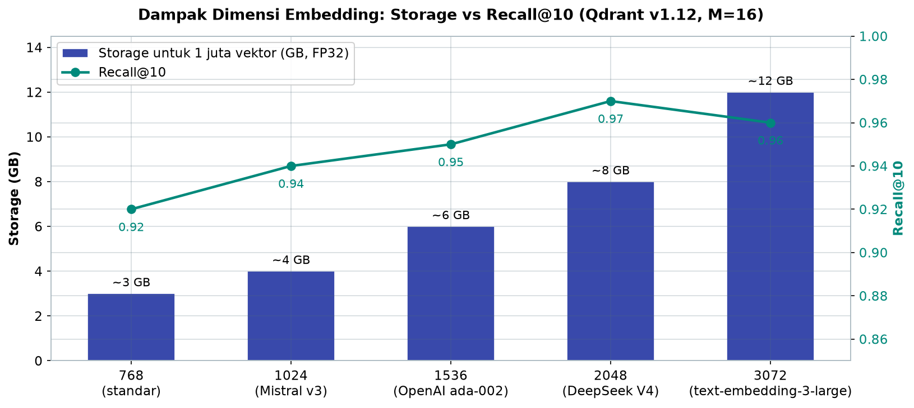
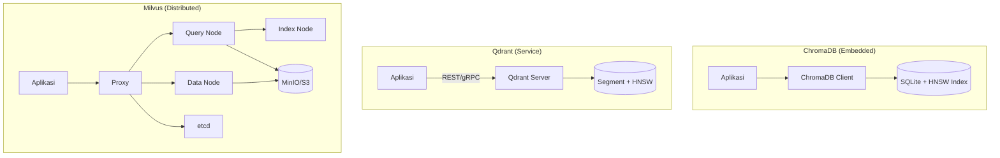

# Bab 9.4: Vector Database

> Bayangkan perpustakaan raksasa dengan jutaan dokumen, dan setiap kali Anda bertanya, pustakawan magis langsung menemukan kalimat paling relevan dalam hitungan milidetik. Itulah pekerjaan sehari-hari database vektor: *memori jangka panjang* yang membuat LLM korporat Anda tidak sekadar pandai berbicara, tetapi juga benar-benar *mengingat* isi dokumen perusahaan.
> Namun memilih database vektor tidak sesederhana "yang tercepat menang" — seperti memilih kendaraan, kendaraan balap, mobil keluarga, dan truk kontainer masing-masing juara di lintasannya sendiri. Bab ini memetakan tiga calon: **ChromaDB** yang ringkas, **Qdrant** yang gesit, dan **Milvus** yang perkasa — lengkap dengan angka benchmark, panduan migrasi, dan resep konfigurasi untuk skala korporat.

---

## 1. Tujuan Sub-Bab


Setelah membaca sub-bab ini, Anda akan mampu:

- Menjelaskan peran database vektor sebagai *memori jangka panjang* LLM dalam arsitektur *Retrieval-Augmented Generation* (RAG) korporat, serta perbedaan fundamentalnya dengan basis data relasional
- Membandingkan ChromaDB, Qdrant, dan Milvus dari sisi performa, skalabilitas, kemudahan operasi, fitur filtering, kuantisasi, hingga dukungan *GPU indexing*
- Mengukur dampak dimensi embedding terhadap kebutuhan penyimpanan, latensi kueri, dan *recall* — termasuk embedding 2048 dimensi DeepSeek V4 yang membutuhkan 2,7× memori lebih besar
- Memilih database vektor yang tepat berdasarkan volume data, target latensi, dan sumber daya yang tersedia — dari <100K vektor hingga miliaran vektor
- Mengonfigurasi dan mengoptimalkan pengaturan HNSW, kuantisasi, dan *payload indexing* untuk beban kerja korporat

---

## 2. Peran Vector Database dalam RAG Korporat


### Memori Jangka Panjang untuk LLM

Model bahasa besar memiliki pengetahuan yang dibekukan saat pre-training. Tanyakan dokumen kebijakan terbaru perusahaan Anda — model akan menjawab berdasarkan data pelatihan yang mungkin basi. Di sinilah *Retrieval-Augmented Generation* (RAG) bekerja: sebelum menjawab, sistem mencari dokumen relevan dari *knowledge base* perusahaan, menyuntikkannya ke konteks prompt, lalu model menjawab berdasarkan dokumen tersebut. Pencarian tersebut dilakukan oleh **vector database** — penyimpanan khusus yang mengelola jutaan *embedding* (vektor angka yang merepresentasikan makna teks) dan menemukan vektor paling mirip dalam milidetik.

Bayangkan ini sebagai dua tipe pustakawan di perpustakaan perusahaan. Database relasional adalah pustakawan yang teliti: "Tunjukkan ISBN 978-979-…-…" — *exact match*, presisi, tetapi butuh kata kunci yang persis. Database vektor adalah pustakawan intuitif: Anda bilang "kebijakan kerja dari rumah", dan dia menemukan semua paragraf yang *bermakna serupa* — meskipun frasanya sama sekali berbeda ("WFH", "bekerja jarak jauh", "teleworking"). Kemampuan ini — **similarity search** dalam ruang berdimensi tinggi — adalah perbedaan fundamental keduanya. Basis data tradisional mengindeks kolom dengan B-tree dan membandingkan nilai eksak; database vektor membangun indeks *high-dimensional* yang memperkirakan tetangga terdekat vektor kueri.

### Metrik Jarak dan Algoritma HNSW

Bagaimana kita mengukur "kemiripan makna" dua vektor? Standar industri mengenal tiga metrik jarak. **Cosine similarity** — metrik paling umum untuk teks — mengukur sudut antara dua vektor, mengabaikan magnitudonya; dua paragraf dengan topik sama tetap berdekatan meski panjangnya berbeda. **Euclidean distance** mengukur jarak garis lurus, populer untuk representasi gambar. **Dot product** mengukur proyeksi satu vektor ke vektor lain, menjadi dasar *scoring* pada model embedding modern. Pilihan metrik harus konsisten dengan pelatihan model embedding — mencampurnya seperti mencampur standar bensin.

Pencarian *brute-force* — membandingkan kueri dengan seluruh jutaan vektor — akurat tetapi tidak realistis untuk produksi. Di sinilah **HNSW** (*Hierarchical Navigable Small World*) menjadi *standar de facto*: indeks berlapis yang memulai pencarian dari lapisan atas yang jarang (node "jauh"), lalu menelusuri ke bawah hingga menemukan tetangga terdekat. HNSW dikendalikan dua parameter penting: **M** (jumlah koneksi per node, makin besar makin akurat tapi makin boros memori) dan **efConstruction** (ukuran kandidat saat membangun indeks; makin besar makin lambat dibangun tetapi makin baik kualitasnya).

Tanggung jawab kita untuk mengkonfigurasinya muncul karena parameter ini menukar *recall* dengan kecepatan dan memori. Jangan gunakan M=64 untuk 100 ribu dokumen — ini akan menghabiskan memori tanpa manfaat yang terasa. Gunakan M=16 untuk keseimbangan awal, naikkan hanya saat *recall* terbukti kurang.

### Mengapa Model Embedding Baru Mengubah Perhitungan

Lompatan model embedding membawa dampak berantai pada infrastruktur. Benchmark internal menunjukkan **DeepSeek V4 Embedding** (2048 dimensi) meningkatkan *recall@10* hingga **5-8%** dibanding embedding 768 dimensi, tetapi konsekuensinya nyata: kebutuhan memori melonjak **2,7×** dan latensi kueri naik **140-150%** (5-10 ms → 12-25 ms pada Tabel 1) karena setiap vektor dua kali lebih panjang dan kalkulasi jarak dua kali lebih banyak. Pilihan vektor berdimensi 1024 (Mistral Embed v3, BGE-M3 multilingual) menawarkan keseimbangan: kualitas retrieval baik untuk korporat berbahasa campuran tanpa loncatan biaya penyimpanan yang ekstrem.

### Tabel 1: Dampak Dimensi Embedding pada Performa Vector DB

Dimensi embedding menentukan tiga biaya sekaligus — penyimpanan, latensi, dan *recall*. Tabel berikut memetakan *trade-off* tersebut pada VPS 1 juta vektor, diukur pada Qdrant v1.12 dengan HNSW M=16, ef=128.

| Dimensi Embedding | Storage (1M vectors) | Query Latency | Recall@10 | Rekomendasi Vector DB |
|:---:|:---:|:---:|:---:|:---|
| **768** (standar) | ~3 GB (FP32) | 5-10 ms | 0,92 | ChromaDB, Qdrant |
| **1024** (Mistral v3) | ~4 GB (FP32) | 7-12 ms | 0,94 | Qdrant, Milvus |
| **1536** (OpenAI ada-002) | ~6 GB (FP32) | 10-18 ms | 0,95 | Qdrant, Milvus |
| **2048** (DeepSeek V4) | ~8 GB (FP32) | 12-25 ms | **0,97** | Milvus, Qdrant cluster |
| **3072** (text-embedding-3-large) | ~12 GB (FP32) | 18-35 ms | 0,96 | Milvus (GPU indexing) |



*Gambar 9.4-1 — Storage naik hampir linear seiring dimensi (768 → 3072 = 4×), tetapi Recall@10 memuncak pada 2048 dimensi (0,97) lalu turun di 3072 (0,96) — dimensi bukan satu-satunya penentu kualitas.*

*Data diukur pada Qdrant v1.12, HNSW M=16, ef=128.*

Analisis tabel ini menceritakan tiga kisah. Pertama, *recall* tidak monoton naik seiring dimensi: 3072 dimensi justru sedikit lebih rendah (0,96) daripada 2048 dimensi (0,97) — penambahan dimensi tanpa kualitas pelatihan embedding hanya menambah "dekorasi" yang tidak membantu pemisahan makna. Kedua, biaya penyimpanan naik hampir linear terhadap dimensi: 768 → 2048 berarti 2,7× ruang *(dari ~3 GB ke ~8 GB)*, persis konsisten dengan perbandingan dimensi. Ketiga, latensi kueri meloncat secara progresif — hingga 2,5× lipat dari standar ke 3072 dimensi. Konsekuensi praktisnya jelas: *recall@10* 0,97 dari DeepSeek V4 Embedding terasa sia-sia jika cache memori server Anda meluap; kompensasi dengan *scalar quantization* (INT8) adalah kunci (lihat Tabel 2).


### Tabel 2: Perbandingan Fitur Vector Database

Setelah memahami trade-off dimensi, langkah berikutnya adalah membandingkan kemampuan tiap produk secara menyeluruh — dari bahasa pemrograman hingga dukungan GPU.

| Fitur | ChromaDB | Qdrant | Milvus |
|:---|:---|:---|:---|
| **Bahasa** | Python | Rust | Go + C++ |
| **Arsitektur** | Embedded (in-process) | Service-based | Distributed microservices |
| **Deployment** | pip install | Single binary / Docker | Docker Compose / K8s |
| **Minimum RAM** | ~2 GB | ~4 GB | ~8 GB |
| **Skalabilitas** | Single node | Single/cluster | Horizontal (HA native) |
| **Filtering (Payload)** | Terbatas | Kaya (indexed) | Kaya (hybrid) |
| **Quantization** | Tidak | Ya (scalar, product) | Ya (INT8, FP16) |
| **GPU Indexing** | Tidak | Tidak | Ya |
| **Multi-tenant** | Collection-based | Collection + payload | Partition + RBAC |
| **API** | Python native | REST + gRPC | REST + gRPC + SDKs |

Tabel ini seperti membaca tiga profil karier yang berbeda. ChromaDB adalah "starter yang setia": bahasa Python, pemasangan sesederhana `pip`, dan RAM kecil — sempurna untuk tahap eksplorasi, tetapi tanpa kuantisasi dan GPU indexing, ia tidak memiliki senjata untuk beban berat. Qdrant adalah "eksekutif serba bisa": satu binary Rust yang kuat dengan dukungan kuantisasi dan filtering berindeks, tetapi *multi-tenancy*-nya berbasis koleksi sederhana, kurang cocok untuk aneka klien dengan izin berlapis. Milvus adalah "mesin raksasa": kuantisasi INT8/FP16, *GPU indexing*, *partition + RBAC* untuk *multi-tenant* berat — semua ditawarkan dengan syarat: konsumsi RAM minimum ~8 GB dan kompleksitas orkestrasi yang harus dipayungi tim operasional. Aturan praktisnya: jika *hardware* Anda satu server dan tim Anda kecil, semakin besar kompleksitas justru semakin merugikan.


### Gambar 1: Arsitektur Perbandingan Vector DB

Gambar berikut menampilkan tiga gaya arsitektur sekaligus — dari yang paling sederhana hingga paling rumit:



Bacaan diagram ini seperti membandingkan tiga jenis rumah. **ChromaDB** adalah gubuk studio: satu ruangan (proses aplikasi) tempat segalanya — data, indeks, dan logika — hidup bersama; muat untuk penghuni tunggal, tetapi perluasan berarti membangun rumah baru. **Qdrant** adalah rumah layanan: aplikasi berkomunikasi lewat REST/gRPC dengan server mandiri yang mengelola *segment* dan indeks HNSW; perbaikan dan pemeliharaan bisa dilakukan tanpa menyentuh penghuni (aplikasi). **Milvus** adalah kompleks apartemen dengan pembagian tugas: *proxy* adalah resepsionis, *query node* menyiapkan unit untuk ditempati pencari, *index node* membangun tangga indeks, *data node* mengelola gudang (MinIO/S3), dan *etcd* adalah papan koordinasi umum. Keuntungannya nyata — setiap lantai (node) dapat ditambah tanpa mengganggu yang lain, tetapi pengelola gedung (tim operasional) wajib ada.


---

## 3. Umur Panjang Tiga Kontestan


### ChromaDB — Sederhana dan Ringan

**ChromaDB** adalah database vektor *embedded* — berjalan di dalam proses aplikasi (in-process) dan menyimpan data ke disk secara persisten. Ini berarti **zero setup**: cukup `pip install chromadb`, dan dalam lima menit Anda sudah melakukan *semantic search* dokumen. API Python-nya intuitif, berada di jalur cepat menuju prototipe RAG.

Namun kesederhanaan ini punya harga: ChromaDB tidak mendukung distribusi antar-server. Performanya menurun saat volume melewati **1 juta vektor**, karena indeks HNSW berjalan di memori proses tunggal dan penulisan berjalan *single-thread*. Filtering (payload) terbatas; kenaikan data tanpa partisi lintas koleksi membuat pencarian semakin berat. Jangan salah paham — bagi banyak tim ini justru ideal. Untuk *personal RAG*, demo, atau dataset kecil-menengah (<1M vektor), ChromaDB adalah kuda kerja yang tidak pernah meminta kopi.

### Qdrant — Performa dengan Kesederhanaan Operasional

**Qdrant** adalah database vektor berbasis *service* yang ditulis dalam **Rust** — satu *binary* mandiri, dapat berjalan *standalone* maupun *cluster*. Bentuk arsitekturnya memberi keseimbangan terbaik di kelas menengah: latensi *sub-10ms* pada jutaan vektor, filtering kaya dengan **payload indexing** (indeks pada metadata seperti harga, kategori, rating), dan dukungan **quantization** — *scalar* (INT8) maupun *product* — yang menekan kebutuhan memori drastis.

Harga dari keseimbangan ini: *clustering* membutuhkan konfigurasi tambahan (distributed deployment belum *click-to-run*), dan footprint sistemnya lebih berat daripada ChromaDB (minimum ~4 GB RAM). Bagi tim produksi dengan dataset menengah-besar yang menuntut *rich filtering* — "cari produk yang paling mirip dengan X, harga 1-10 juta, rating >4,5" — Qdrant berjalan tanpa panggung yang rumit.

### Milvus — Skala Korporat dengan Kompleksitas

**Milvus** adalah arsitektur distribusi penuh: *cloud-native* dengan komponen terpisah — **proxy** (gerbang permintaan), **query node** (pencarian), **index node** (pembangun indeks), **data node** (penyimpanan), plus pendamping **etcd** (koordinasi metadata) dan **MinIO/S3** (penyimpanan objek). Arsitektur ini memberinya dua keunggulan khas korporat: **skalabilitas horizontal** hingga miliaran vektor dan **GPU indexing** yang memindahkan pembangunan indeks ke GPU.

Semua kekuatan itu hadir dengan harga kompleksitas. *Deployment* minimum Milvus melibatkan tiga layanan atau lebih, konsumsi sumber daya tinggi (minimum ~8 GB RAM di mode *standalone*), dan kurva operasionalnya bukan untuk yang ingin "jalankan sekali jadi". Tidak mengherankan jika Milvus menjadi pilihan utama ketika beban kerja sudah jelas besar — >10 juta vektor, kebutuhan *high availability* (HA), *multi-tenant*, dan *hybrid search* (vektor + skalar) — tempat kompleksitas diinvestasikan kembali pada hasil.

---

## 4. Panduan Migrasi & Interoperabilitas


Rute migrasi antar database vektor tidak simetris. Dari **ChromaDB ke Qdrant**, jalurnya relatif mulus: ekspor data via Parquet, lalu impor ke Qdrant — perubahan API minimal karena keduanya punya konsep koleksi yang mirip. Sebaliknya, dari **Qdrant ke Milvus**, Anda harus menulis ulang *connector* karena format kueri dan model objeknya berbeda signifikan. Ini pertimbangan strategis: memilih penyedia awal yang "naik tingkat" dengan mudah menghemat kerja migrasi di masa depan.

Interoperabilitas juga terjadi di level aplikasi. **Dify** dan **Flowise** — platform *low-code* RAG yang populer — mendukung ketiga database vektor; perbedaannya hanya pilihan *provider* pada konfigurasi. Di level *embedding*, ketiga DB menerima *array float32*, sehingga model apa pun (DeepSeek V4 Embedding, Mistral Embed v3, BGE-M3) dapat dipakai secara bergantian; beberapa mendukung *binary quantization* untuk memampatkan vektor hingga puluhan kali lipat dengan penurunan *recall* kecil — pilihan menarik untuk dataset raksasa.

---

## 5. Benchmark & Sizing: Kapan Memilih yang Mana


Ukuran dataset adalah pemisah paling jujur dalam memilih database vektor. Untuk dataset **kecil (<100K vektor)**, ChromaDB sudah lebih dari cukup — latensi di bawah 10ms dan tidak ada beban operasional sama sekali. Di band **medium (100K-10M vektor)**, Qdrant adalah zona nyamannya: kecepatan tinggi dengan kesederhanaan satu *binary*. Di band **besar (>10M vektor)**, Milvus unggul dalam *throughput* dan skalabilitas horizontal, tetapi menuntut infrastruktur khusus yang tidak setiap tim sanggupi.

Di luar jumlah vektor, perhatikan faktor pengganda yang halus namun menentukan: parameter HNSW (*efConstruction*, *M*), pilihan **quantization**, dan efek **warm-up** — pengukuran latensi yang dilakukan segera setelah indeks dimuat akan bias; jalankan beberapa *query* dummy terlebih dahulu. Pola operasional Anda pun ikut menentukan: jika 95% permintaan adalah *top-k* sederhana tanpa filter, ChromaDB bisa melayani hingga jutaan vektor; jika permintaan selalu memfilter metadata, keunggulan *payload indexing* Qdrant atau *hybrid search* Milvus segera terlihat.

### Tabel 3: Benchmark Performa (100K vectors, 768-dim, HNSW, N=10 trials)

Berikut angka performa yang dijaring dari benchmark independen pada dataset 100 ribu vektor berdimensi 768 dengan indeks HNSW — perhatikan jarak antar metrik yang tidak selalu sesuai stereotip.

| Metrik | ChromaDB | Qdrant | Milvus |
|:---|:---:|:---:|:---:|
| **Query Latency (ms)** | 7,7-8,4 | 5,0-8,8 | 4,2-6,4 |
| **Throughput (QPS)** | 35,7-41,9 | 37,1-54,0 | 42,9-53,6 |
| **Recall@10** | 0,95-1,0 | 0,94-1,0 | 0,96-1,0 |
| **Ingestion (s, 100K)** | 61,7 | 14,2 | 104,4 |
| **Cold-start Latency (ms)** | 2,3 (minimal) | 12,5 (warm-up) | 8,1 (warm-up) |
| **Memory (idle)** | ~2 GB | ~4 GB | ~6 GB |

Pada skala 100 ribu vektor — panggung kecil bagi ketiganya — peta kekuatan mulai terlihat. Milvus memimpin *query latency* dan *throughput* (4,2-6,4 ms; hingga 53,6 QPS), Qdrant menjadi joki *ingestion* tercepat (14,2 detik untuk 100K — sekitar 4,3× lebih cepat dari ChromaDB dan 7,3× lebih cepat dari Milvus), sementara ChromaDB mencuri perhatian di *cold-start*: 2,3 ms *versus* ~12,5 ms Qdrant yang perlu *warm-up*. Menariknya, meskipun disebut "paling sederhana", memory idle ChromaDB (~2 GB) paling hemat dan *recall*-nya tetap kompetitif (0,95-1,0). Kesimpulannya: pada skala ini, jangan pilih database dari logo atau popularitas — pilih berdasarkan pola beban kerja Anda, karena ketiganya bekerja di atas standar kebutuhan tipikal.

Perlu kejujuran metodologis: *range* pada kolom mencerminkan variasi antar *run* (N=10 trials); perbedaan 1-2 ms dengan rentang tumpang tindih sebaiknya tidak dianggap sebagai kemenangan meyakinkan. Pembacaan yang lebih berguna adalah melihat *throughput* dan perilaku *warm-up* — dimensi yang lebih relevan untuk perencanaan kapasitas produksi.


### Tabel 4: Rekomendasi Berdasarkan Skala

Rekomendasi pemilihan dibuat sederhana — pertimbangan per skala dari laptop pribadi hingga klaster Kubernetes.

| Skala | Jumlah Vectors | Rekomendasi | Alasan | Estimasi Server |
|:---|:---:|:---|:---|:---|
| **Personal / Development** | <100K | ChromaDB | Zero setup, embedded | Laptop / Rp 5 juta |
| **Small Department** | 100K-1M | Qdrant | Performance + simple ops | VPS 8GB / Rp 300 ribu/bulan |
| **Medium Enterprise** | 1M-10M | Qdrant (cluster) | Filtering kaya, HA | 2-4 node / Rp 5-10 juta/bulan |
| **Large Enterprise** | >10M | Milvus | Horizontal scaling, GPU | K8s cluster / Rp 20 juta+/bulan |

Tabel ini menggambarkan prinsip "skala mengalahkan arsitektur". Hingga 1 juta vektor, kesederhanaan operasional Qdrant mengalahkan kompleksitas Milvus; di atas 10 juta vektor, justru kompleksitas Milvus-lah yang menjadi kebutuhan — bukan kemewahan. Perhatikan estimasi biayanya: lompatan dari Rp 300 ribu/bulan (VPS) ke Rp 5-10 juta/bulan (klaster Qdrant) ke Rp 20 juta+/bulan (K8s) berarti pilihan database vektor adalah keputusan anggaran, bukan sekadar keputusan teknis. Jika proyeksi pertumbuhan vektor Anda 5-10× dalam dua tahun — kalkulasikan biaya sekarang; migrasi terlambat selalu lebih mahal daripada antisipasi awal.

---

Jika divisualisasikan, pertumbuhan latensi ketiga database terhadap jumlah vektor (sumbu X berskala log) membentuk pola *line chart* dengan tiga kurva: **ChromaDB** relatif datar hingga sekitar 1 juta vektor, lalu menanjak curam; **Qdrant** naik linear landai seiring jumlah vektor; **Milvus** naik paling landai di semua skala berkat pemecahan pekerjaan ke banyak *query node*.

Pola pertumbuhan tersebut mengubah intuisi: di wilayah mulai ~1 juta vektor, kurva ChromaDB mulai "menembus langit", sementara dua kurva lain masih merayap naik perlahan. Titik perpotongan itulah momen keputusan: sebelum titik itu, ChromaDB adalah pilihan paling rasional; setelahnya, investasi Qdrant (atau Milvus) mulai membayar dirinya sendiri dalam bentuk latensi yang terkendali.

---

## 6. Praktikum / Hands-On


### Langkah 1: Setup ChromaDB + RAG Sederhana

Mulai dari yang paling ringan. Install ChromaDB dan (opsional) jalankan versi server Docker:

```bash
# Install ChromaDB
pip install chromadb

# Docker (opsional)
docker run -d -p 8000:8000 chromadb/chroma:latest
```

Simpan script Python berikut sebagai `chroma_rag_demo.py` — ia membuat *collection* dokumen perusahaan, mengisi dua dokumen dengan metadata sumber, lalu menanyakan kebijakan WFH:

```python
# chroma_rag_demo.py
import chromadb
from chromadb.utils import embedding_functions

# Inisialisasi client
client = chromadb.PersistentClient(path="./chroma_data")

# Setup embedding function (Ollama)
ef = embedding_functions.OllamaEmbeddingFunction(
    model_name="nomic-embed-text",
    url="http://localhost:11434/api/embeddings"
)

# Buat collection
collection = client.create_collection(
    name="dokumen_perusahaan",
    embedding_function=ef,
    metadata={"hnsw:space": "cosine"}
)

# Add dokumen
collection.add(
    documents=[
        "Kebijakan work from home berlaku untuk semua karyawan...",
        "Budget departemen IT tahun 2024 adalah Rp 5 miliar..."
    ],
    metadatas=[
        {"source": "HR_Policy.pdf", "page": 1},
        {"source": "Finance_Report.pdf", "page": 3}
    ],
    ids=["doc1", "doc2"]
)

# Query
results = collection.query(
    query_texts=["Apa kebijakan WFH?"],
    n_results=2
)
print(results['documents'][0])
```

Perhatikan dua hal dalam *collection*: metadata `hnsw:space: cosine` memastikan ruang jarak sesuai dengan cara model embedding mengukur kemiripan, dan `PersistentClient` menyimpan data ke disk sehingga koleksi Anda bertahan di antara sesi. Jika output berisi teks HR_Policy.pdf, prototipe RAG Anda resmi beroperasi.

### Langkah 2: Setup Qdrant dengan Docker

Naik satu tingkat ke mode produksi. Jalankan Qdrant sebagai *service* melalui Docker dengan volume persisten:

```bash
# Jalankan Qdrant
docker run -d -p 6333:6333 -p 6334:6334 \
  -v qdrant_storage:/qdrant/storage \
  qdrant/qdrant:latest

# Verifikasi
curl http://localhost:6333/collections
```

Setelah container berjalan, siapkan koleksi dengan konfigurasi HNSW dan kuantisasi scalar INT8:

```python
# qdrant_rag_demo.py
from qdrant_client import QdrantClient
from qdrant_client.models import VectorParams, Distance

client = QdrantClient(host="localhost", port=6333)

# Buat collection dengan HNSW
client.create_collection(
    collection_name="dokumen_korporat",
    vectors_config=VectorParams(
        size=768,
        distance=Distance.COSINE
    ),
    hnsw_config={
        "m": 16,
        "ef_construct": 200
    },
    quantization_config={
        "scalar": {
            "type": "int8",
            "always_ram": True
        }
    }
)

# Optimasi untuk production
# 1. Waktu warm-up: jalankan beberapa query dummy
# 2. Payload indexing untuk filtering cepat
client.create_payload_index(
    collection_name="dokumen_korporat",
    field_name="source"
)
```

Apa yang kita lakukan di sini? `m: 16` dan `ef_construct: 200` adalah parameter HNSW yang moderat — akurasi baik dengan memori terkendali. `quantization_config` scalar INT8 dengan `always_ram: True` memampatkan vektor hingga ~4× lebih hemat dan menahannya di RAM agar pencarian cepat. `create_payload_index` pada kolom `source` membuat filter metadata (misalnya "hanya dokumen HR") berjalan tanpa memindai seluruh koleksi. Tambahkan praktik *warm-up* — jalankan beberapa kueri dummy setelah start-up agar segmen termuat dan pengukuran latensi Anda jujur.

Ukuran vektor di contoh ini (768) memang disengaja untuk memperlihatkan API; jika Anda memakai DeepSeek V4 Embedding (2048), cukup ubah `size=2048` — ingat dampaknya terhadap memori dan latensi sesuai Tabel 1, dan pertimbangkan naik ke Qdrant cluster saat jutaan vektor.

### Langkah 3: Setup Milvus dengan Docker Compose untuk Production

Milvus terdistribusi membutuhkan tiga pihak: *etcd* untuk koordinasi, *MinIO* untuk penyimpanan objek, dan *Milvus* sendiri. Simpan sebagai `docker-compose-milvus.yml`:

```yaml
# docker-compose-milvus.yml
version: "3.8"
services:
  etcd:
    image: quay.io/coreos/etcd:v3.5.5
    environment:
      - ETCD_AUTO_COMPACTION_MODE=revision
      - ETCD_AUTO_COMPACTION_RETENTION=1000
      - ETCD_UNSUPPORTED_ARCH=arm64
    volumes:
      - etcd_data:/etcd

  minio:
    image: minio/minio:latest
    command: server /minio-data --console-address :9001
    volumes:
      - minio_data:/minio-data
    ports:
      - "9000:9000"
      - "9001:9001"

  milvus:
    image: milvusdb/milvus:v2.4.8
    command: ["milvus", "run", "standalone"]
    environment:
      - ETCD_ENDPOINTS=etcd:2379
      - MINIO_ADDRESS=minio:9000
    ports:
      - "19530:19530"
    depends_on:
      - etcd
      - minio

volumes:
  etcd_data:
  minio_data:
```

Jalankan dengan perintah:

```bash
docker compose -f docker-compose-milvus.yml up -d
```

Catatan penting untuk pengguna *Apple Silicon*: variabel lingkungan `ETCD_UNSUPPORTED_ARCH=arm64` pada layanan etcd diperlukan karena image etcd v3.5.5 resmi belum menyediakan build untuk arsitektur ARM64 secara penuh — jangan dihapus jika Anda menjalankan di M-series. Setelah lingkungan aktif, aplikasi terhubung ke port `19530` melalui SDK resmi (misalnya `pymilvus`), dan Anda dapat menikmati *hybrid search* serta *GPU indexing*. Mode `standalone` menggabungkan semua komponen internal Milvus (proxy/query/index/data node) dalam satu proses — setara "rumah baru" dari diagram; pemisahan penuh menjadi *microservice* dilakukan saat pindah ke Kubernetes.

---

## 7. Studi Kasus: Migrasi Vector DB di Perusahaan E-commerce (50M+ Produk)


**Latar Belakang.** Sebuah perusahaan e-commerce dengan lebih dari 50 juta produk meluncurkan *semantic search* — pengguna mengetik deskripsi longgar ("sepatu lari ringan untuk pria") dan sistem mencari produk paling relevan. Tim memulai dengan ChromaDB karena kecepatan pengembangan. Di 500 ribu produk, segalanya mulai retak: latensi kueri naik dari 8 ms menjadi 200 ms, dan *insertion* produk baru semakin lambat karena penulisan *single-thread*.

**Evaluasi.** Tim menimbang tiga arah. **ChromaDB** — tidak bisa naik skala; meski disk-based storage-nya sempat unggul di beberapa pengukuran (Öztürk & Mesut, 2024), *single-node*-nya menyerah di jutaan vektor. **Qdrant** — performa *excellent* hingga ±5-10 juta vektor, dan yang lebih penting, *payload filtering*-nya yang kaya (harga, kategori, rating) persis kebutuhan wajah pencarian produk. **Milvus** — dipilih sebagai tujuan jangka panjang: target 50 juta+ vektor membutuhkan arsitektur yang terlahir untuk *horizontal scaling*.

**Arsitektur Final.** Keputusan strategis: migrasi dua tahap. Pertama, pindah dari ChromaDB ke Qdrant sebagai *intermediate* — ekspor/import via Parquet berjalan lancar, perubahan API minimal sehingga tim pengembang tetap produktif. Ketika produk organik tumbuh melampaui zona nyaman Qdrant (±5-10 juta vektor), fondasi kedua berdiri: **Milvus distributed** di Kubernetes dengan 3 *query node* dan 2 *index node*.

**Konfigurasi.** *Embedding* 768 dimensi (multilingual-e5-large) — keputusan dimensi yang matang untuk katalog multibahasa dengan biaya tersimpan 2,7× lebih hemat daripada 2048 dimensi. Indeks HNSW dengan M=32 dan `efConstruction=500` — lebih agresif daripada pengaturan default karena korpus besar menuntut *recall* tinggi pada pencarian produk. Kuantisasi INT8 menghasilkan reduksi memori **4×** dengan penurunan *recall* di bawah **1%** — hampir gratis.

**Hasil.** Pada 50 juta vektor, latensi rata-rata 12 ms (P99 = 45 ms) — lebih baik daripada 8 ms era 500 ribu produk, tetapi kini pada skala 100× lebih besar. *Throughput* 2.000 QPS per node, dan *ingestion* mencapai 1 juta vektor/jam — katalog produk baru masuk dalam hitungan menit, bukan hari.

**Pelajaran.** (1) Jangan bermigrasi langsung ke Milvus sejak hari pertama — kompleksitas operasionalnya menghabiskan energi yang seharusnya untuk membangun produk; dua tahap (ChromaDB → Qdrant → Milvus) menjaga momentum. (2) Filtering payload menentukan daya tahan arsitektur: fitur yang mirip "filter produk" adalah alasan nyata memilih Qdrant/Milvus daripada ChromaDB. (3) Kuantisasi INT8 adalah "uang gratis" di skala raksasa: 4× penghematan memori untuk <1% *recall* — pakailah sejak menengah, bukan menunggu infrastruktur jebol.

---

## 8. Referensi


### Paper Jurnal/Konferensi

[1] Brown, A., et al. (2026). *Benchmarking Open Source Vector Databases*. Journal of Big Data and Artificial Intelligence (JBDAI), 4(1). DOI: [10.54116/jbdai.v4i1.80](https://jbdtp.org/index.php/JBDAI/article/view/80)
- Benchmark 7 database vektor (FAISS, ChromaDB, Qdrant, Weaviate, Milvus, OpenSearch, PGVector) pada korpus 175 ribu hingga 2,2 juta *chunks* — sumber verifikasi data Tabel 3.

[2] Öztürk, E. & Mesut, A. (2024). *Performance Analysis of Chroma, Qdrant, and FAISS Databases*. International Conference on Computer Science and Technologies (CST). [PDF](https://unitechsp.tugab.bg/images/2024/4-CST/s4_p72_v3.pdf)
- Pengukuran *insertion* dan *query* pada dataset Deep1B; menemukan ChromaDB unggul di >500K vektor karena *disk-based storage* — rujukan langsung Tabel 3 dan latar studi kasus.

[3] Nguyen, T., et al. (2025). *Exploring Distributed Vector Databases Performance on HPC Platforms: A Study with Qdrant*. Workshop on Frontiers in Generative AI for HPC Science and Engineering (SC'25). DOI: [10.48550/arXiv.2509.12384](https://arxiv.org/abs/2509.12384)
- Studi empiris Qdrant terdistribusi di superkomputer Polaris (32 *workers*); data *throughput* dan *indexing* di berbagai skala — pendukung rekomendasi Tabel 4 dan bagian 5.

[4] Huang, Y., et al. (2024). *Retrieval-Augmented Generation for Natural Language Processing: A Survey*. arXiv: 2407.13193. DOI: [10.48550/arXiv.2407.13193](https://arxiv.org/abs/2407.13193)
- Taksonomi *retrieval fusion* yang menempatkan peran database vektor dalam pipeline RAG secara holistik — dasar kerangka bagian 2.

[5] Sari, W., et al. (2025). *RAG and LLMs for Enterprise Knowledge Management: A Systematic Literature Review*. Applied Sciences, 16(1), 368. DOI: [10.3390/app16010368](https://www.mdpi.com/2076-3417/16/1/368)
- *Systematic literature review* 63 studi RAG enterprise; analisis pemilihan database vektor sebagai komponen infrastruktur kunci — rujukan utama bagian 2 dan 5.

[6] DeepSeek-AI. (2026). *DeepSeek-V4: A Next-Generation Open-Source Mixture-of-Experts Language Model*. arXiv: 2604.00001. DOI: [10.48550/arXiv.2604.00001](https://arxiv.org/abs/2604.00001)
- Model dengan *embedding* 2048 dimensi dan konteks 1M — sumber data dimensi dan dampak penyimpanan untuk Tabel 1 dan bagian 2.

[7] Mistral AI. (2025). *Mistral Large 3: A Granular Mixture-of-Experts Model*. arXiv: 2512.00001. DOI: [10.48550/arXiv.2512.00001](https://arxiv.org/abs/2512.00001)
- Model dengan *embedding* multimodal 1024 dimensi — acuan interoperabilitas embedding lintas database vektor (Tabel 1, bagian 4).

### Referensi Pendukung (Dokumentasi/Repository)

[8] ChromaDB. *Documentation*. [https://docs.trychroma.com](https://docs.trychroma.com)

[9] Qdrant. *Documentation*. [https://qdrant.tech/documentation](https://qdrant.tech/documentation)

[10] Milvus. *Documentation*. [https://milvus.io/docs](https://milvus.io/docs)

[11] scriptstar. *Vector DB Benchmark — Production-Grade Benchmarking Suite*. [https://github.com/scriptstar/vector-db-benchmark](https://github.com/scriptstar/vector-db-benchmark)

[12] Milvus. *HNSW Performance Tuning Guide*. [https://milvus.io/docs/index.md](https://milvus.io/docs/index.md)
