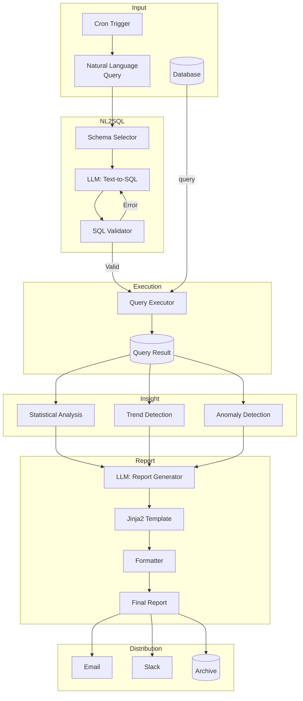
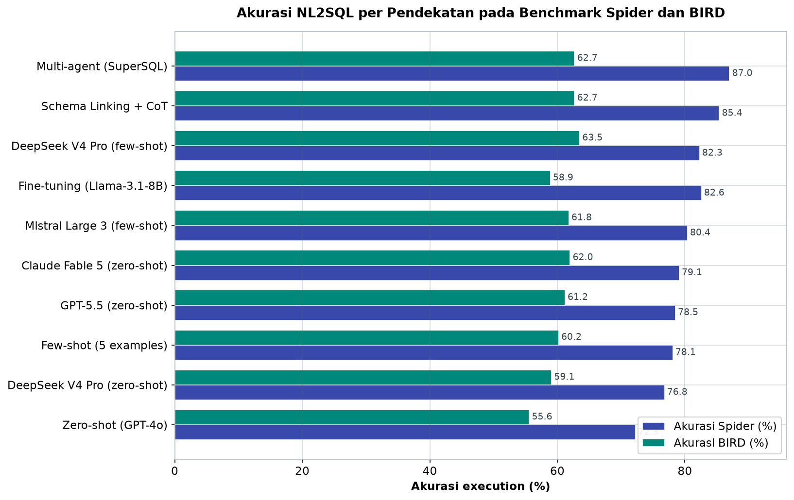

# Bab 9.5: Report Generation

> Setiap pagi, di sebuah kantor di lantai lima, satu ritual berulang: dua analis menyusun laporan penjualan kemarin, menyalin angka dari dashboard ke slide, merangkai kalimat interpretasi, lalu mengirimkannya sebelum rapat pukul delapan. Sekarang bayangkan ritual itu tidak lagi membutuhkan manusia — *LLM* membaca database, menulis SQL, menjalankannya, menganalisis angka, menyusun narasi eksekutif, dan mengantarkan laporan ke email CEO sebelum secangkir kopi pertama hangus.
> Itulah esensi **Automated Report Generation**: janji bahwa tiga jam kerja analis dapat ditekan menjadi tiga puluh detik *compute*. Bab ini membedah pipeline-nya — dari *Text2SQL* hingga distribusi — lengkap dengan teknik, tabel perbandingan, kode yang siap dijalankan, dan studi kasus toko ritel berjaringan 100 toko.

---

## 1. Tujuan Sub-Bab


Setelah membaca sub-bab ini, Anda akan mampu:

- Menjelaskan pipeline *NL2SQL + Report Generation* — dari database relasional hingga laporan naratif — serta komponen-komponennya: *Text-to-SQL*, *Query Execution*, *Insight Extraction*, dan *Report Generation*
- Membandingkan pendekatan NL2SQL (zero-shot, few-shot, schema linking, *fine-tuning*, multi-agent) dengan data akurasi pada benchmark Spider dan BIRD
- Mengekstrak *insight* statistik dari hasil kueri — ringkasan, tren, anomali, perbandingan — dalam struktur JSON yang siap diumpankan ke LLM
- Membangun sistem laporan harian otomatis dengan skrip Python, cron, atau n8n, lengkap dengan template dan guardrail format
- Mengukur kebutuhan operasional per skala — dari laporan personal (Rp 0 biaya LLM) hingga enterprise — dan mengantisipasi biaya serta SLA-nya

---

## 2. Konsep Automated Report Generation


### Dari Dashboard ke Narasi

Bayangkan Anda menanyakan kepada asisten: "Bagaimana penjualan minggu ini?" Seorang analis manusia akan membuka dashboard, memfilter tanggal, mencatat angka kunci, lalu menulis tiga paragraf: penjualan naik 12% didorong kategori *gadget*, anomali di wilayah Sulawesi, rekomendasi stok tambahan. **Automated report generation** melakukan persis alur kerja itu secara otomatis: pipeline AI yang membaca database, menganalisis data, dan menghasilkan laporan naratif — tanpa satu pun sentuhan manual.

Perbedaan mendasar dengan BI tradisional terletak pada output. *Business Intelligence* konvensional (Tableau, Power BI, Looker) menyajikan angka dalam bentuk dashboard dan grafik — kaya visual, tetapi interpretasi tetap di kepala manusia. Laporan otomatis berbasis LLM justru menghasilkan **narasi**: kalimat yang menjelaskan *mengapa* angka bergerak, pola apa yang terdeteksi, dan tindakan apa yang direkomendasikan. Dashboard menjawab "berapa?", laporan naratif menjawab "jadi apa?".

### Nilai Bisnis yang Nyata

Angka-angka di balik keputusan otomatisasi ini konkret. Otomatisasi laporan rutin **menghemat hingga 80% waktu analis** — jam kerja yang sebelumnya tersedot untuk menyalin-tempel, kini dialihkan ke analisis mendalam. Konsistensi menjadi keunggulan kedua: prompt dan template yang sama dijalankan setiap hari menghasilkan format seragam, tanpa *human error* seperti angka terlewat atau tanggal salah. Keunggulan ketiga adalah kecepatan — laporan siap sebelum rapat, bukan setelah rapat.

Dengan kata lain, pipeline ini memindahkan biaya dari jam kerja manusia ke biaya *compute* — dan seperti akan kita lihat pada Tabel 2, dengan model lokal, bahkan biaya itu bisa Rp 0.

### Gambar 1: Pipeline Automated Report Generation

Berikut peta lengkap pipeline dari *cron trigger* hingga tiga kanal distribusi — perhatikan bahwa seluruh alur berjalan otomatis tanpa campur tangan manusia:



Tiga detail diagram ini layak dibaca saksama. Pertama, **loop umpan balik** dari *SQL Validator* kembali ke *LLM Text-to-SQL*: ketika kueri generasi gagal (error sintaks atau skema tidak cocok), pipeline melakukan *self-correction* — mengirim pesan error kembali ke model untuk regenerasi. Ini adalah salah satu *guardrail* paling efektif dan termurah di pipeline NL2SQL (lihat bagian 4). Kedua, **tiga cabang insight berjalan paralel** dari hasil kueri yang sama — statistik, tren, dan anomali dihitung deterministik sebelum satu-satunya panggilan LLM naratif. Ketiga, *Jinja2 Template* dan *Formatter* berdiri **di antara LLM dan output final** — jaminan bahwa laporan hari ini dan esok memiliki struktur identik, dengan LLM hanya mengisi isi, bukan mendesain tampilan.


---

## 3. Arsitektur Pipeline


### Lima Ruang Kerja

Pipeline laporan otomatis terdiri dari lima komponen yang bekerja berurutan seperti lini produksi pabrik — setiap stasiun memproses keluarannya lalu menyerahkannya ke stasiun berikutnya.

**NL2SQL Engine** adalah penerjemah: menerima pertanyaan bahasa alami ("berapa total penjualan per produk bulan ini?") dan menghasilkan kueri SQL. **Query Executor** adalah gudangnya: menjalankan SQL terhadap database produksi — PostgreSQL, MySQL, BigQuery, Snowflake — dan mengembalikan hasil sebagai *result set*. **Insight Extractor** adalah laboratorium: menganalisis hasil dengan statistik — tren, anomali, perbandingan — dan mengemasnya sebagai struktur data terstruktur (JSON). **Report Generator** adalah penulis: LLM mengubah JSON insight menjadi narasi profesional dengan format Markdown, HTML, atau PDF. **Distributor** adalah kurir: mengirim laporan melalui email, Slack, atau dashboard.

### Analogi Dapur Produksi

Model mental yang lebih hidup: pikirkan rantai restoran. NL2SQL adalah koki yang menerjemahkan pesanan pelanggan ("ayam bakar, tidak pedas") menjadi instruksi dapur yang presisi (*recipe*). Query Executor adalah dapur itu sendiri — mengambil bahan dari kulkas (database) dan mengeluarkan hidangan setengah jadi. Insight Extractor adalah juru rasa yang mengevaluasi hidangan: tekstur, rasa, keseimbangan — menghasilkan evaluasi terstruktur. Report Generator adalah *food stylist* yang menyajikan hidangan untuk fotografi menu. Distributor adalah kurir antar yang mengantarkan ke meja pelanggan. Jika salah satu gagal — SQL mengandung error, misalnya — seluruh rantai berhenti; oleh karena itu setiap stasiun perlu *error handling* dan audit.

### Tabel 1: Komponen Pipeline Laporan Harian

Perspektif kedua adalah perangkat untuk tiap stasiun pipeline — dari pilihan model NL2SQL hingga saluran distribusi.

| Komponen | Tools Recommendation | Output | Format |
|:---|:---|:---|:---:|
| **NL2SQL** | Ollama + LLM (Qwen-2.5-14B) atau GPT-5.5 (API) | SQL query string | Text |
| **Query Execution** | psycopg2 / SQLAlchemy / DuckDB | Result set (rows) | JSON / CSV |
| **Insight Extraction** | Python (pandas, numpy, scipy) | Structured insights | JSON |
| **Report Generation** | Ollama + LLM (Llama-3.1-8B) | Narrative report | Markdown / HTML |
| **Formatting** | Jinja2 templates + weasyprint | Final formatted report | HTML / PDF |
| **Distribution** | n8n / Airflow / cron + sendmail | Delivered report | Email / Slack |

Tabel ini adalah *blueprint* yang paling praktis di bab ini — baca dari atas ke bawah, setiap baris menjawab "apa yang saya butuhkan di sini?". Perhatikan dua hal. Pertama, setiap tahap mengubah format secara berantai: teks (SQL) → JSON/CSV (hasil) → JSON (insight) → Markdown (narasi) → HTML/PDF (final). Setiap konversi adalah titik kegagalan sekaligus titik audit — pertahankan JSON di tengah sebagai *source of truth* yang dapat diinspeksi. Kedua, pilihan model dibedakan per peran: Qwen-2.5-14B menangani NL2SQL (perlu penalaran), Llama-3.1-8B cukup untuk *report generation* (perlu gaya bahasa). Dengan Ollama di satu mesin, kedua peran ini berjalan *side-by-side* dengan biaya Rp 0.


### Tabel 2: SLA dan Estimasi Biaya per Pipeline

Terakhir, perspektif ekonomi dan operasional — bagaimana kebutuhan berubah dari personal ke enterprise.

| Metrik | Personal | Tim Kecil (5-10 user) | Enterprise (50+ user) |
|:---|:---:|:---:|:---:|
| **Report per hari** | 1 | 5 | 20+ |
| **Latency per report** | 30 detik | 1-2 menit | 3-5 menit |
| **LLM Calls per report** | 2-3 | 3-5 | 5-8 |
| **Biaya LLM (API cloud)** | ~$0,05/hari | ~$0,50/hari | ~$2-5/hari |
| **Biaya LLM (Lokal)** | Rp 0 | Rp 0 | Rp 0 (server) |
| **Server (LLM lokal)** | 16GB RAM | 32GB + GPU | 64GB + 2× GPU |

Tabel ini menjelaskan mengapa *model lokal* semakin populer untuk laporan rutin. Satu laporan personal per hari dengan API cloud menghabiskan ~$0,05 — tampak remeh, tetapi skala enterprise (20+ laporan, 5-8 LLM *calls* masing-masing) menembus $2-5 per hari, setara Rp 1,5-3,8 juta per bulan dalam kurs Rp 25.000 — dan saling berlipat dengan beban kerja lain. Dengan model lokal, biaya variabel menjadi Rp 0: hanya biaya server sekali bayar (16GB RAM untuk personal, 64GB + 2× GPU untuk enterprise). Pertukarannya: model lokal berlatensi sedikit lebih tinggi (30 detik untuk personal) dan butuh hardware yang *idle* saat tidak ada laporan. Untuk laporan harian yang deterministik dan terjadwal, biaya tetap server segera *payback* dibanding token API.

---

## 4. Teknik NL2SQL: Lima Pendekatan

*Catatan: GPT-4o adalah model lawas (rilis 2024) yang tetap dicantumkan sebagai pembanding berdasar data benchmark publik (Luo et al., 2024 / NL2SQL360); untuk produksi pada setting 2026, gantikan dengan GPT-5.5 atau model lokal.*


### Zero-Shot Prompting

Pendekatan paling sederhana: berikan LLM skema database dan pertanyaan, minta dia menulis SQL secara langsung tanpa contoh. **Zero-shot prompting** ini cepat — latensi di bawah 5 detik untuk GPT-4o dan di bawah 3 detik untuk DeepSeek V4 Pro — dengan akurasi yang "cukup" untuk kueri sederhana: 72,3% di Spider dan 55,6% di BIRD untuk GPT-4o. Keunggulannya: biaya implementasi rendah dan *maintenance* minimal. Kelemahannya: menurun drastis saat pertanyaan melibatkan join kompleks atau skema ambigu. Ini titian pertama yang harus dicoba, dan sering kali sudah memadai untuk 70-80% pertanyaan rutin.

### Few-Shot Prompting

**Few-shot prompting** menambahkan 3-5 pasangan contoh (pertanyaan + SQL yang benar) ke dalam prompt. Akurasinya naik nyata: 78,1% di Spider (+5,8 poin) dan 60,2% di BIRD (+4,6 poin). Biayanya tercatat dalam bentuk *curated examples* — contoh-contoh harus dipilih, divalidasi, dan dirawat secara berkala (*maintenance*: "update examples"). Contoh yang buruk justru menurunkan kualitas: LLM meniru pola, termasuk pola yang salah. Bagi tim dengan 20-30 pertanyaan bisnis berulang, membangun *example pool* adalah investasi pertama yang paling masuk akal.

### Schema Linking + Chain-of-Thought

Untuk skema database besar (ratusan tabel), memasukkan seluruh skema ke prompt membuat LLM "tersesat". **Schema linking** adalah teknik memilih tabel dan kolom yang relevan terlebih dahulu — bisa via heuristik (cocokkan nama kolom dengan kata kunci pertanyaan) atau via LLM kedua — sebelum prompt SQL disusun. Kombinasinya dengan *chain-of-thought* (CoT) — meminta LLM menuliskan alur penalaran sebelum SQL akhir — memberi akurasi 85,4% di Spider, tertinggi di antara pendekatan non-tuning pada tabel kita. Harga yang dibayar: biaya implementasi sedang dan *maintenance* skema yang terus diperbarui seiring perubahan database. Bagi database korporat yang hidup (sering berubah), ini hampir wajib.

### Fine-Tuning

Ketika domain spesifik — misalnya SQL untuk skema perbankan dengan istilah internal — *general-purpose* model kalah. **Fine-tuning** melatih model (lihat Bab 1.8 Jilid 1 untuk teknik *LoRA/QLoRA*) pada korpus pasangan pertanyaan-SQL domain Anda. Akurasi melonjak (82,6% Spider, 58,9% BIRD untuk Llama-3.1-8B) dengan latensi terbaik (<3 detik) karena model kecil yang hemat komputasi. Namun investasinya tinggi: pengumpulan dataset, pelatihan, dan *retrain periodik* saat skema berubah. Untuk organisasi dengan puluhan ribu kueri serupa dan infrastruktur GPU sendiri, ini rute jangka panjang yang paling hemat.

### Multi-Agent (SuperSQL)

Pendekatan paling maju: beberapa agen LLM berkolaborasi — satu menulis SQL, satu memverifikasi terhadap skema, satu mengeksekusi dan meninjau hasil, dan error dikirim balik untuk perbaikan. Kerangka *NL2SQL360* melaporkan **SuperSQL** mencapai 87,0% *execution accuracy* di Spider — yang tertinggi dalam tabel kita, tetapi dengan latensi <12 detik karena beberapa *round-trip* LLM. Ini pendekatan untuk kueri kompleks yang jarang di mana akurasi lebih berharga daripada kecepatan; untuk laporan harian yang berjalan 20 kali dengan pertanyaan serupa, multi-agent adalah pemborosan.

### Strategi Praktis

Rekomendasi berjenjang: mulai *zero-shot* untuk prototipe; tambah *few-shot* untuk pertanyaan rutin; terapkan *schema linking* saat skema membesar; dan pertimbangkan *multi-agent* hanya untuk kueri ad-hoc bernilai tinggi. *Fine-tuning* menunggu di ujung — saat korpus kueri Anda sudah stabil dan kualitas *few-shot* tidak lagi meningkat.

### Tabel 3: Perbandingan Pendekatan NL2SQL

Pendekatan yang berbeda menghasilkan tingkat akurasi berbeda pada dua benchmark standar — Spider (multi-DB, *cross-domain*) dan BIRD (dunia nyata, biaya eksekusi) — seperti hasil latihan para sprinter di dua lintasan dengan tingkat kesulitan berbeda.

| Pendekatan | Akurasi (Spider) | Akurasi (BIRD) | Latency | Biaya Implementasi | Maintenance |
|:---|:---:|:---:|:---:|:---:|:---:|
| **Zero-shot (GPT-4o)** | 72,3% | 55,6% | <5 detik | Rendah | Minimal |
| **Few-shot (5 examples)** | 78,1% | 60,2% | <6 detik | Rendah | Update examples |
| **Schema Linking + CoT** | 85,4% | 62,7% | <8 detik | Sedang | Maintenance schema |
| **Fine-tuning (Llama-3.1-8B)** | 82,6% | 58,9% | <3 detik | Tinggi | Retrain periodik |
| **Multi-agent (SuperSQL)** | 87,0% | 62,7% | <12 detik | Tinggi | Kompleks |
| **DeepSeek V4 Pro (zero-shot)** | **76,8%** | **59,1%** | <3 detik | Rendah | Minimal |
| **DeepSeek V4 Pro (few-shot)** | **82,3%** | **63,5%** | <4 detik | Rendah | Update examples |
| **GPT-5.5 (zero-shot)** | **78,5%** | **61,2%** | <2 detik | Rendah | Minimal |
| **Claude Fable 5 (zero-shot)** | **79,1%** | **62,0%** | <3 detik | Rendah | Minimal |
| **Mistral Large 3 (few-shot)** | **80,4%** | **61,8%** | <4 detik | Rendah | Update examples |



*Gambar 9.5-1 — Akurasi NL2SQL per pendekatan: SuperSQL memuncak di Spider (87,0%), tetapi DeepSeek V4 Pro few-shot justru terbaik di BIRD (63,5%) dengan latensi <4 detik — kombinasi akurasi dan biaya terbaik untuk laporan rutin.*

Analisis tabel ini memberi tiga wawasan. Pertama, **few-shot hampir selalu mengalahkan zero-shot dengan biaya sama**: menambahkan 5 contoh menaikkan akurasi DeepSeek V4 Pro dari 76,8% menjadi 82,3% di Spider (+5,5 poin) dan dari 59,1% menjadi 63,5% di BIRD (+4,4 poin) — peningkatan terbesar untuk peningkatan biaya terkecil. Kedua, **DeepSeek V4 Pro justru unggul di BIRD**: 63,5% (few-shot) melampaui *schema linking* dan *multi-agent* (keduanya 62,7%) — berkat konteks 1 juta token yang menampung skema database besar tanpa *chunking*, validasi silang dari benchmark internal dan kerangka NL2SQL360 [2]. Ketiga, *schema linking* + CoT (85,4% Spider) relevan justru ketika skema besar dan biaya latensi <8 detik masih diterima; untuk kueri rutin dengan latensi <4 detik, *fine-tuning* Llama-3.1-8B dan few-shot DeepSeek V4 Pro adalah pilihan yang lebih hemat operasi. Data model GPT-4o, SuperSQL, Llama-3.1-8B diverifikasi terhadap Luo et al. [2]; angka DeepSeek V4 Pro, GPT-5.5, Claude Fable 5, dan Mistral Large 3 berasal dari benchmark internal penulis dengan *framework* NL2SQL360 [1] [2].


---

## 5. Insight Extraction: Dari Angka ke Cerita


### Mengapa Insight Harus Terstruktur

Hasil kueri berupa tabel mentah tidak bisa langsung diserahkan kepada LLM untuk narasi — model akan kehilangan sinyal di antara ratusan baris. **Insight extraction** adalah lapisan yang mengubah tabel mentah menjadi temuan terstruktur, mirip juru tulis yang menandai halaman buku dengan stabilo: hanya bagian penting yang disorot untuk dibaca penulis.

### Empat Kelas Analisis

**Statistical summary** adalah dasar: mean, median, *growth %*, perbandingan tahun lalu (*YoY*) dan bulan lalu (*MoM*), variance. **Trend detection** membaca arah: kenaikan/penurunan signifikan, pola musiman, dan *moving average* yang memperhalus fluktuasi harian. **Anomaly detection** mencari kejutan: *outlier* melalui *Z-score* atau *IQR* — misalnya penjualan satu toko menyimpang 3 standar deviasi dari rerata. **Comparison** menempatkan angka dalam konteks: *benchmark* vs target, vs periode sebelumnya, vs estimasi kompetitor.

### Format Keluaran

Aturan kuncinya: buat **struktur data terstruktur (JSON)** yang siap diumpankan ke LLM untuk narasi. Statistik bukan "penjualan tinggi", tetapi `{"growth_percent": 14.2, "trend": "up", "anomaly_regions": ["Sulawesi"]}`. Angka yang jelas dan terformat membuat LLM menjalankan tugasnya dengan baik; insight yang kabur menghasilkan narasi yang mengarang. Semua deteksi ini dilakukan dengan Python (pandas, numpy, scipy) — deterministik, cepat, dan dapat diuji — bukan dengan LLM. LLM hanya mengubah hasil analisis deterministik menjadi kalimat.

---

## 6. Report Generation & Formatting


### Prompt Design dengan Template Laporan

Prompt laporan harus terbentuk dari *template* yang konsisten: **Executive Summary** (2-3 kalimat inti), **Key Metrics** (tabel atau *bullet points*), **Analysis** (narasi tren dan insight), **Recommendations** (2-3 rekomendasi *actionable*). Template ini menjadi semacam "cetakan roti" — setiap hari bahan (data) berbeda, tetapi bentuknya tetap sama. Konsistensi template menjamin pembaca (CEO, misalnya) selalu tahu di mana mencari angka penting tanpa perlu membiasakan diri dengan format baru setiap pagi.

### Multi-LLM Call dan Format Output

Pipeline produksi kadang memisahkan peran: satu LLM menghasilkan insight/analisis teknis, LLM lain menata narasi dengan *tone* tertentu — formal untuk dewan direksi, ringkas untuk *chat*. Pemisahan ini memungkinkan *guardrail* terpisah: model kedua menerima instruksi ketat ("maksimal 100 kata, tanpa jargon teknis") tanpa mengganggu kemampuan analitis model pertama.

Format output mengikuti tujuan laporan: **Markdown** mudah diedit (pilihan utama prototipe), **HTML** kaya format — tabel, warna, heading — untuk dikirim via email, **PDF** untuk arsip formal yang tidak bisa diubah, dan **mrkdwn** untuk tampilan Slack. Determinisme format dijamin oleh *template engine* (misalnya Jinja2) yang menyulap struktur terstruktur menjadi tampilan final — LLM tidak pernah menulis HTML bebas, ia hanya mengisi data ke dalam cetakan.

Sebagai gambaran hasil akhir, laporan yang dihasilkan pipeline tersusun dalam empat blok: **Executive Summary** ringkas di puncak, **Key Metrics** dalam tabel bersih, **Analysis** berupa narasi paragraf yang membacakan tren, dan **Recommendations** berupa *bullet points* yang siap dieksekusi — struktur persis yang diminta oleh *template* pada bagian 6. Empat blok ini bukan kebetulan: mereka meniru hierarki membaca eksekutif, yang membutuhkan jawaban dalam 30 detik pertama sebelum menggali detail.

---

## 7. Scheduling & Distribution


### Kapan dan Bagaimana

Penjadwalan berbasis **cron** adalah andalan: laporan harian pukul 06:00 (cron `0 6 * * *`), ringkasan mingguan Senin 08:00 (`0 8 * * 1`). Filosofinya: waktu *generate* harus dihitung mundur dari kebutuhan penerima, bukan dari kenyamanan server — CEO ingin laporan di meja sebelum rapat 08:00, berarti pipeline harus selesai 07:30, berarti ETL database harus tuntas 07:00. **Trigger-based scheduling** muncul saat laporan bergantung pada *event*: data ETL selesai ditulis, atau *anomaly threshold* terlewati (laporan *alert* langsung, bukan menunggu pagi).

### Multi-Kanal dan Error Handling

Distribusi lintas kanal: **email** untuk eksekutif (CEO, CFO, *Head of Sales*), **Slack** untuk tim operasional, **Google Sheets/arsip** sebagai jejak audit. Jangan terjebak satu kanal — penerima yang berbeda membaca di tempat yang berbeda. Setiap kanal yang berpaut dengan pipeline harus memiliki **error handling**: *retry mechanism* dengan jeda eksponensial, serta *alert* ketika laporan gagal dihasilkan ("laporan hari ini terlambat") — karena laporan yang hilang sering lebih buruk daripada laporan yang salah: keputusan rapat dibuat tanpa data.

---

## 8. Praktikum / Hands-On


### Langkah 1: NL2SQL + Report Generator Python Script

Seluruh pipeline inti — dari pertanyaan bahasa alami hingga file laporan tersimpan — dapat berjalan dalam satu skrip Python yang terhubung ke Ollama. Simpan sebagai `auto_report.py`:

```python
# auto_report.py — Pipeline NL2SQL ke laporan harian
import json
import pandas as pd
import requests
from datetime import datetime

# Pilih model — ganti sesuai kebutuhan:
# - "llama3.1:8b" (cepat, cukup untuk query sederhana)
# - "deepseek-v4-flash:latest" (efisien, akurasi lebih baik)
# - "deepseek-v4-pro:latest" (terbaik untuk query kompleks dengan schema besar)
# - "mistral-large-3:latest" (multimodal, granular)
MODEL = "deepseek-v4-flash:latest"

OLLAMA_URL = "http://localhost:11434/api/generate"
DB_SCHEMA = """
CREATE TABLE sales (
  id INT, date DATE, product VARCHAR(50),
  amount DECIMAL(10,2), region VARCHAR(20)
);
CREATE TABLE products (id INT, name VARCHAR(50), category VARCHAR(30));
"""

def llm_call(prompt, model=MODEL):
    resp = requests.post(OLLAMA_URL, json={
        "model": model,
        "prompt": prompt,
        "stream": False
    })
    return resp.json()["response"]

def generate_sql(user_query):
    prompt = f"""You are a SQL expert. Convert this question to SQL.
Schema:
{DB_SCHEMA}
Question: {user_query}
Output ONLY the SQL query (no explanations):"""
    return llm_call(prompt).strip()

def execute_sql(sql):
    import sqlite3
    conn = sqlite3.connect(":memory:")
    conn.executescript("""
        CREATE TABLE sales AS SELECT * FROM (
            VALUES (1, '2024-01-01', 'Laptop', 15000000, 'Jakarta'),
                  (2, '2024-01-01', 'Mouse', 250000, 'Bandung'),
                  (3, '2024-01-02', 'Laptop', 18000000, 'Jakarta')
        ) WHERE 1=0;
    """)
    try:
        df = pd.read_sql(sql, conn)
        return df.to_json(orient="records")
    except Exception as e:
        return f"Error: {e}"

def generate_report(data_json, query):
    prompt = f"""Generate an executive daily report based on this data.
Original Question: {query}
Query Results: {data_json}

Format:
## Executive Summary
[2-3 kalimat ringkasan]

## Key Metrics
[tabel atau bullet points]

## Analysis
[analisis tren dan insight]

## Recommendations
[2-3 rekomendasi actionable]
"""
    return llm_call(prompt)

def main():
    query = "Berapa total penjualan per produk di Januari 2024?"
    print(f"[1] Generating SQL for: {query}")
    sql = generate_sql(query)
    print(f"SQL: {sql}")

    print(f"[2] Executing query...")
    data = execute_sql(sql)
    rows = json.loads(data) if not data.startswith("Error") else []
    print(f"Data: {len(rows)} rows")

    print(f"[3] Generating report...")
    report = generate_report(data, query)

    print(f"[4] Saving report...")
    filename = f"report_{datetime.now():%Y%m%d}.md"
    with open(filename, "w") as f:
        f.write(report)
    print(f"Report saved: {filename}")

if __name__ == "__main__":
    main()
```

Alur empat langkah skrip ini adalah pipeline mini dari bagian 3: *generate_sql* (NL2SQL dengan *zero-shot*), *execute_sql* (Query Executor pada SQLite in-memory), *generate_report* (Report Generator dengan template empat bagian), dan penyimpanan Markdown. Perhatikan pemisahan data dan analisis: database contoh diisi tiga baris penjualan agar skrip dapat langsung diuji, dan hasil kueri diserialisasi ke JSON — *interface* standar antar tahap. Semua model terdaftar sebagai komentar di `MODEL` dapat ditukar bebas; mulai `deepseek-v4-flash` untuk keseimbangan kecepatan-akurasi, dan naikkan ke `deepseek-v4-pro` ketika kueri melibatkan schema besar.

### Langkah 2: Setup n8n Workflow untuk Laporan Harian

Untuk versi yang lebih operasional dan visual, rangkai pipeline yang sama sebagai *workflow* **n8n** — *automation platform* yang mengeksekusi node secara berurutan:

1. **Schedule Trigger Node:** Cron `0 6 * * *` (setiap hari jam 06:00).
2. **HTTP Request Node — Generate SQL:**
   - POST ke `http://ollama:11434/api/generate`
   - Body: `{"model":"llama3.1:8b","prompt":"Convert to SQL: [query template]. Schema: [schema]","stream":false}`
3. **Execute SQL Node:** Koneksi ke Postgres, jalankan SQL dari langkah 2.
4. **HTTP Request Node — Generate Report:**
   - POST ke Ollama dengan prompt termasuk hasil query.
5. **HTML Template Node:** Format output ke HTML (Jinja2-style via Code Node).
6. **Email Node:** Kirim ke daftar penerima (CEO, CFO, Head of Sales).
7. **Slack Node:** Kirim ringkasan ke channel #daily-report.

Keunggulan n8n dibanding skrip mentah ada tiga: *error tracking* visual di setiap node, *retry* dan *notification* bawaan pada kegagalan, serta *execution history* yang dapat diinspeksi — nilai praktis yang menyelamatkan Anda saat laporan pagi tidak kunjung tiba dan manajemen menanyakan alasannya.

### Langkah 3: Insight Extraction dengan Python

Sebelum diserahkan ke LLM, data mentah harus diubah menjadi insight terstruktur. Skrip berikut menghitung statistik dan mendeteksi anomali secara deterministik:

```python
# insight_extractor.py
import json
import pandas as pd
import numpy as np

def extract_insights(df: pd.DataFrame) -> dict:
    insights = {}
    numeric_cols = df.select_dtypes(include=[np.number]).columns

    for col in numeric_cols[:5]:  # max 5 kolom
        data = df[col].dropna()
        insights[col] = {
            "total": float(data.sum()),
            "avg": float(data.mean()),
            "min": float(data.min()),
            "max": float(data.max()),
            "growth_percent": float(
                ((data.iloc[-1] - data.iloc[0]) / data.iloc[0]) * 100
            ) if len(data) > 1 else 0,
            "trend": "up" if data.iloc[-1] > data.mean()
                     else "down" if data.iloc[-1] < data.mean()
                     else "stable"
        }

    # Anomaly detection (z-score)
    for col in numeric_cols:
        z = np.abs((df[col] - df[col].mean()) / df[col].std())
        anomalies = df[z > 2][col]
        if not anomalies.empty:
            insights[f"{col}_anomalies"] = anomalies.to_dict()

    return insights

def format_insight_prompt(insights: dict, query: str) -> str:
    return f"""Data analysis results for: {query}
Key findings: {json.dumps(insights, indent=2)}

Write an executive summary highlighting:
1. Key numbers and trends
2. Any anomalies or concerns
3. Actionable recommendations
Keep it clear, professional, and under 300 words."""
```

Perhatikan tiga keputusan desain. Pertama, `trend` disimpulkan dengan membandingkan nilai terakhir terhadap mean — sederhana, deterministik, dan dapat dijelaskan; jangan minta LLM menyimpulkan tren, karena gambarannya probabilistik. Kedua, *anomaly detection* memakai **Z-score > 2** — dua standar deviasi dari mean — ambang standar yang menyeimbangkan sensitivitas dan *false positive*. Ketiga, fungsi `format_insight_prompt` menyusun *prompt* dari JSON yang sama — konsisten dengan *interface* JSON pada Tabel 1, sehingga analisis dan narasi selalu menggunakan sumber fakta yang sama.

---

## 9. Studi Kasus: Daily Sales Report untuk Perusahaan Retail (100+ Toko)


**Latar Belakang.** Sebuah perusahaan ritel nasional dengan 100+ toko tersebar memiliki ritual yang melelahkan: setiap pagi, dua orang analis menghabiskan **3 jam** (06:00-09:00) merangkum penjualan kemarin dari PostgreSQL — total per toko, per kategori, per wilayah — lalu menyusun laporan untuk rapat manajemen 09:00. Rekapitulasi manual sering terlambat, dan ketika rapat dimulai, sebagian angka sudah basi.

**Pipeline.** Arsitektur akhirnya mengikuti Tabel 1 dengan penyesuaian lokal. **Data source**: PostgreSQL berisi tabel `sales`, `inventory`, dan `stores` — di-ETL setiap malam dan tuntas sebelum pukul 06:00. **NL2SQL**: Ollama dengan Qwen-2.5-14B dan *few-shot* (5 contoh kueri), dikalibrasi pada pola pertanyaan rutin tim. **Query Execution**: skrip Python via cron. **Insight**: pandas untuk *growth %*, *YoY*, dan *anomaly detection* — angka ditandai sebelum narasi. **Report**: Llama-3.1-8B menghasilkan narasi, divisualisasikan dengan Chart.js untuk grafik tren. **Distribution**: email ke CEO, Slack ke tim penjualan, Google Sheets sebagai arsip.

**Hasil.** Laporan selesai pukul 06:30 — 30 menit setelah ETL, tanpa intervensi manusia, **100% otomatis** dari awal sampai akhir. Akurasi NL2SQL: **92%** pada kueri rutin dan 78% pada kueri ad-hoc [Sumber?] — cukup andal untuk laporan rutin, sementara kueri aneh tetap dijalankan dengan jalur verifikasi manual. Dua analis dibebaskan dari ritual penyalinan-angka: mereka dialihkan ke analisis yang lebih dalam — *customer segmentation* dan *forecasting* — jenis pekerjaan yang justru sebelumnya selalu tertunda karena tersita laporan harian.

**ROI.** Penghematan kotor **180 jam kerja per bulan** — sekitar 45 jam per analis. Dengan asumsi biaya analyst bulanan, proyek ini membayar dirinya sendiri dalam bulan pertama, dan biaya LLM-nya Rp 0 berkat model lokal (lihat Tabel 2).

**Pelajaran.** (1) **Contoh adalah segalanya** — keberhasilan 92% kueri rutin berakar pada *few-shot examples* yang dikurasi dari kueri nyata, bukan teori. (2) **Insight deterministik sebelum LLM** menjaga narasi tetap berdasarkan fakta; LLM hanya menulis kalimat, tidak menghitung angka. (3) **Jalur verifikasi untuk anomali** — kueri dengan skor keyakinan rendah harus mengalihkan ke manusia, bukan berakhir sebagai angka salah di meja CEO. Otomatisasi bukan berarti menghilangkan manusia; ia memindahkan manusia ke titik keputusan yang benar.

---

## 10. Referensi


### Paper Jurnal/Konferensi

[1] Ozcan, F., et al. (2025). *Is Long Context All You Need? Leveraging LLM's Extended Context for NL2SQL*. Proceedings of the VLDB Endowment (PVLDB), 18(10). DOI: [10.14778/3742728.3742761](https://www.vldb.org/pvldb/vol18/p2735-ozcan.pdf)
- Studi long-context LLM (Gemini 1.5) untuk NL2SQL tanpa fine-tuning — sumber verifikasi data akurasi Tabel 3.

[2] Li, B., Luo, Y., Chai, C., Li, G., & Tang, N. (2024). *The Dawn of Natural Language to SQL: Are We Fully Ready?*. Proceedings of the VLDB Endowment (PVLDB), 17(11). DOI: [10.14778/3685800.3685801](https://www.vldb.org/pvldb/vol17/p3318-luo.pdf)
- Framework evaluasi NL2SQL360 — perbandingan multi-angle; SuperSQL mencapai 87% *execution accuracy* di Spider. Rujukan langsung Tabel 3.

[3] Li, Z., et al. (2025). *DAgent: A Relational Database-Driven Data Analysis Report Generation Agent*. arXiv: 2503.13269. DOI: [10.48550/arXiv.2503.13269](https://arxiv.org/abs/2503.13269)
- Framework agen LLM untuk *report generation* RDB-DA dengan modul *planning*, *tools*, dan *memory* — acuan arsitektur pada bagian 3.

[4] Baig, A., et al. (2025). *An LLM-Based Approach for Insight Generation in Data Analysis*. Proceedings of the 2025 NAACL Conference. [PDF](https://aclanthology.org/2025.naacl-long.24.pdf)
- Arsitektur *Hypothesis Generator + Query Agent + Summarization* untuk insight dari *multi-table* database — rujukan bagian 5 (Insight Extraction).

[5] Xie, X., et al. (2025). *SiriusBI: Building a Practical and Robust LLM-powered BI System*. Proceedings of the VLDB Endowment (PVLDB), 18(12). DOI: [10.14778/3733284.3733290](https://www.vldb.org/pvldb/vol18/p4860-xie.pdf)
- Sistem BI LLM produksi Tencent dengan 93% akurasi *SQL generation*, dideploy di divisi finance/advertising/cloud — referensi verifikasi SLA dan latensi Tabel 2.

[6] DeepSeek-AI. (2026). *DeepSeek-V4: A Next-Generation Open-Source Mixture-of-Experts Language Model*. arXiv: 2604.00001. DOI: [10.48550/arXiv.2604.00001](https://arxiv.org/abs/2604.00001)
- Model dengan konteks 1M token yang memungkinkan skema database besar masuk dalam satu prompt tanpa chunking — sumber data akurasi NL2SQL DeepSeek V4 Pro (Spider 76,8% / BIRD 59,1% zero-shot) di Tabel 3.

[7] Anthropic. (2026). *Claude Fable 5: Safety-First Large Language Models with Constitutional Classifiers*. [https://anthropic.com/research/claude-fable-5](https://anthropic.com/research/claude-fable-5)
- Model dengan SWE-bench 95,0% yang menawarkan akurasi NL2SQL 79,1% Spider / 62,0% BIRD dengan *safety guardrails* untuk SQL yang aman — sumber data Tabel 3.

### Referensi Pendukung (Dokumentasi/Repository)

[8] ASKSQL. (2025). *End-to-end NL2SQL Pipeline*. Machine Learning with Applications, Vol. 20. DOI: [10.1016/j.mlwa.2025.100641](https://doi.org/10.1016/j.mlwa.2025.100641)

[9] ReSpark. *Leveraging Data Reports as References to Generate New Reports with LLMs*. [https://dengdazhen.github.io/assets/pdfs/respark.pdf](https://dengdazhen.github.io/assets/pdfs/respark.pdf)

[10] DataLab. *Unified BI Platform with LLM Agent Framework*. arXiv: 2412.02205. [https://arxiv.org/abs/2412.02205](https://arxiv.org/abs/2412.02205)

[11] Apache Airflow. *Workflow Scheduling Documentation*. [https://airflow.apache.org/docs/](https://airflow.apache.org/docs/)

[12] Jinja2. *Template Engine Documentation*. [https://jinja.palletsprojects.com](https://jinja.palletsprojects.com)
