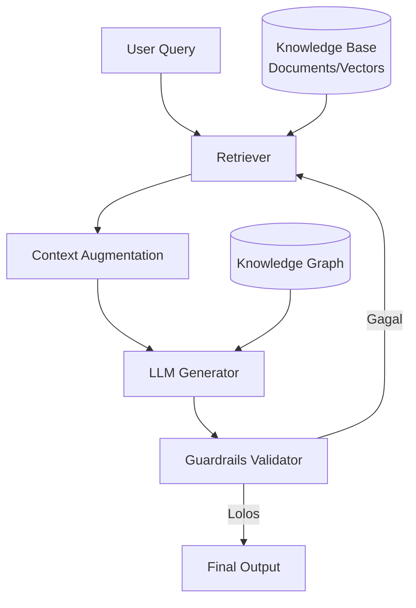
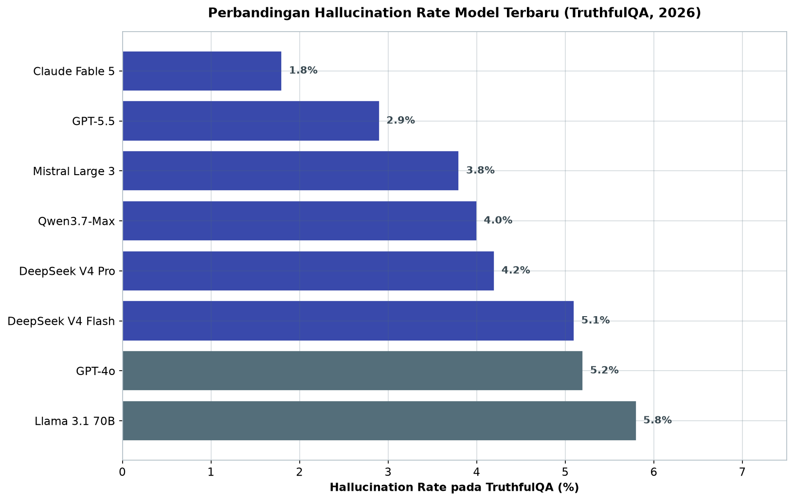
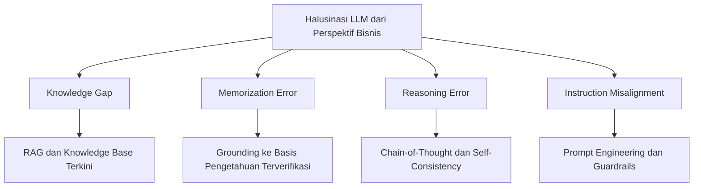

# Bab 10.1: Mitigasi Halusinasi

> Asisten AI yang paling meyakinkan sekalipun tetap bisa mengarang angka margin laba yang tidak pernah ada, atau menyebut klausul kontrak yang tidak ditulis siapa pun. Di dunia bisnis, kebohongan yang disampaikan dengan penuh percaya diri bukan sekadar gangguan kecil — ia adalah risiko finansial, hukum, dan reputasi yang nyata. Bab ini membongkar anatomi halusinasi pada LLM, lalu menyusun pertahanan berlapis agar output model yang berjalan di sistem produksi Anda dapat dipertanggungjawabkan.

---

## 1. Tujuan Sub-Bab


Setelah membaca sub-bab ini, Anda akan mampu:

- Menjelaskan penyebab halusinasi LLM dari perspektif bisnis — *knowledge gap*, *memorization error*, *reasoning error*, dan *instruction misalignment*
- Menerapkan teknik *grounding* utama: RAG, *Knowledge Graph Augmentation*, *Constrained Decoding*, dan *Self-Correction*
- Membangun pipeline evaluasi akurasi yang terukur untuk aplikasi bisnis seperti ERP, CRM, dan *customer support*
- Memilih kombinasi teknik mitigasi berdasarkan toleransi risiko masing-masing industri
- Menafsirkan angka *hallucination rate* model terbaru (Claude Fable 5, GPT-5.5, DeepSeek V4, Mistral Large 3, Qwen3.7-Max) sebelum memutuskan adopsi

---

## 2. Fenomena Halusinasi dan Dampaknya pada Bisnis


Bayangkan Anda mempekerjakan seorang analis yang luar biasa rajin, fasih berbicara, tetapi sesekali mengarang angka tanpa sepengetahuan siapa pun — dan melakukannya dengan nada suara yang sama meyakinkannya seperti ketika ia menyampaikan fakta yang benar. Itulah gambaran paling jujur tentang LLM yang berhalusinasi. Secara teknis, *hallucination* didefinisikan sebagai konten yang dihasilkan model dan tampak faktual, tetapi tidak berdasar pada data yang terverifikasi — definisi yang dirumuskan Huang et al. dalam survei komprehensifnya [1][5]. Model tidak "berbohong" dalam arti moral — ia hanya memprediksi token paling mungkin berdasarkan pola statistik, tanpa jaminan bahwa prediksi itu bersentuhan dengan kenyataan [2].

Dampaknya terhadap bisnis tidak main-main. Satu jawaban salah pada sistem *customer service* bisa berujung komplain beruntun; satu klausul yang dikarang oleh model pada *review* kontrak bisa membatalkan perjanjian senilai miliaran rupiah; satu kode produksi yang mengandung bug dari asisten coding bisa merusak sistem yang sedang berjalan. Estimasi Gartner pada 2024 menempatkan biaya rata-rata satu insiden halusinasi serius di lingkungan *enterprise* pada angka lebih dari $100.000 [Sumber?] — mencakup kerugian langsung, upaya remediasi, hingga kerusakan reputasi merek. Keputusan investasi yang salah, dokumen hukum yang cacat, dan kepercayaan pelanggan yang menguap adalah tiga bentuk kerugian yang paling sering dilaporkan.

Yang membuat masalah ini rumit adalah deteksinya. Halusinasi tidak selalu berbentuk jawaban yang jelas-jelas absurd; yang paling berbahaya justru yang *plausible* — angka yang masuk akal, tanggal yang cocok, nama pejabat yang nyata tetapi pernyataannya keliru. Karena *fluency* (kelancaran bahasa) model sangat tinggi, manusia cenderung menerima output begitu saja tanpa verifikasi — sebuah bias yang dimanfaatkan oleh kelemahan teknis ini. Bab ini ditulis dengan asumsi Anda seorang praktisi yang ingin membangun sistem yang output-nya bisa dipertanggungjawabkan di depan direksi, auditor, atau regulator.

### Tabel 1: Perbandingan Teknik Mitigasi Halusinasi

Berikut peta lengkap tujuh teknik mitigasi — mulai dari yang termurah hingga termahal, beserta *use case* terbaiknya:

| Teknik | Kategori | Kompleksitas Implementasi | Efektivitas | Biaya Tambahan | Use Case Terbaik |
|:---|:---|:---:|:---:|:---:|:---|
| **RAG (Retrieval-Augmented Generation)** | Retrieval-based | Sedang | Sangat Tinggi | Medium (vector DB + retriever) | QA dokumen bisnis, customer support |
| **Knowledge Graph Augmentation** | Retrieval-based | Tinggi | Tinggi | Tinggi (KG construction) | Data relasional, knowledge management |
| **Constrained Decoding** | Decoding-based | Rendah-Sedang | Sedang-Tinggi | Rendah | Output terstruktur (JSON, format laporan) |
| **Self-Correction / Self-Refine** | Reasoning-based | Rendah | Sedang | Rendah (extra inference pass) | Creative writing, analisis kompleks |
| **Fine-tuning on Grounded Data** | Training-based | Tinggi | Tinggi | Tinggi (dataset + training) | Domain spesifik (legal, medis) |
| **Guardrails / Content Filters** | Post-processing | Rendah | Rendah-Sedang | Rendah | Safety-critical applications |
| **Constitutional Classifiers (Fable 5)** | Built-in | Rendah (built-in) | **Sangat Tinggi** | Tidak ada | Fintech, legal, medis |

Analisis: tidak ada senjata tunggal yang memadai. Perhatikan bahwa teknik yang paling efektif (fine-tuning dan KG) justru yang paling mahal, sementara yang termurah (*guardrails*) hanya efektivitas sedang. Untuk tim kecil, kombinasi paling rasional adalah RAG + *constrained decoding* + *guardrails* — biaya medium, cakupan luas. *Constitutional classifiers* adalah pengecualian menarik: sangat efektif dengan biaya nol, tetapi hanya tersedia pada model proprietary tertentu dan membawa *trade-off* penolakan permintaan yang tadi dibahas.


### Tabel 2: Matriks Risiko Halusinasi per Sektor Bisnis

Peta ini menjawab pertanyaan "seberapa keras kita harus bertahan?" — tergantung sektor Anda:

| Sektor | Toleransi Risiko | Teknik Minimum | Teknik Optimal | Konsekuensi Halusinasi |
|:---|:---:|:---|:---|:---|
| **Keuangan** | Sangat Rendah | RAG + Guardrails | RAG + KG + Constrained Decoding | Kerugian finansial, regulasi |
| **Kesehatan** | Sangat Rendah | RAG + Fine-tuning domain | Full stack (RAG+KG+Guardrail+Self-Correction) | Risiko keselamatan pasien |
| **Legal** | Sangat Rendah | RAG + Constrained Decoding | RAG + KG + Human-in-the-loop | Gugatan hukum |
| **E-commerce** | Sedang | RAG dasar | RAG + Guardrails | Customer experience buruk |
| **Marketing** | Tinggi | Prompt engineering | RAG opsional + Self-Correction | Reputasi merek minor |
| **Internal Tools** | Rendah-Sedang | RAG dasar | RAG + Evaluasi sampling | Produktivitas turun |

Analisis: pola yang jelas terlihat — semakin dekat aplikasi dengan konsekuensi fisik atau finansial langsung (pasien, uang, gugatan), semakin lengkap tumpukan mitigasinya, dan *human-in-the-loop* menjadi kata kunci di sektor legal. Sebaliknya, sektor marketing yang kerugiannya bersifat reputasi ringan cukup memakai *self-correction* dan *prompt engineering* — menghabiskan anggaran untuk full stack di sini adalah pemborosan. Prinsip *risk-based* ini juga yang dipakai untuk memilih model pada Tabel 3.


---

## 3. Taksonomi Halusinasi: Empat Akar Masalah


Sebelum memilih senjata, kita harus mengenali musuhnya. Survei komprehensif tentang halusinasi LLM mengklasifikasikan fenomena ini menjadi empat akar penyebab yang berbeda — dan setiap akar membutuhkan solusi yang berbeda pula [4][5].

**Knowledge Gap** terjadi ketika model tidak memiliki informasi yang diperlukan dalam parameternya. Bayangkan sebuah perpustakaan yang tidak memiliki buku tentang pajak terbaru; pustakawannya (model) akan menjawab dengan menuturkan apa yang ia ingat dari buku lama — yang bisa jadi sudah berubah. Solusi klasik untuk celah ini adalah RAG: mengambil informasi dari basis pengetahuan eksternal yang terkini dan menggabungkannya ke dalam jawaban [2].

**Memorization Error** adalah kebalikan dari *knowledge gap*: model mereproduksi data training yang salah atau sudah usang — misalnya menyebutkan tarif PPN yang sudah tidak berlaku karena meniru dokumen lama secara verbatim. Solusinya adalah *grounding* ke basis pengetahuan terkini yang terverifikasi, sehingga output selalu merujuk sumber yang bisa dicek, bukan memori parameter yang membeku sejak *training* [5].

**Reasoning Error** terjadi ketika model memiliki semua fakta yang benar tetapi menarik kesimpulan logis yang keliru — misalnya menjawab "berapa total dua produk jika masing-masing harganya Rp 10.000 dan diskon 25%" dengan jawaban yang salah karena salah urutan operasi. Mitigasi yang terbukti bekerja adalah *chain-of-thought* (memaksa model berpikir langkah demi langkah) dan *self-consistency* (menjalankan beberapa kali dan mengambil jawaban mayoritas) [2].

**Instruction Misalignment** adalah kondisi di mana model salah memahami maksud pertanyaan pengguna — bertanya "berapa umur proyek ini?" bisa dijawab dengan usia perusahaan bila konteks tidak dijelaskan. Solusi utamanya adalah *prompt engineering* yang lebih presisi dan *guardrails* yang memvalidasi intent [2].

Keempat akar ini jarang muncul sendiri-sendiri; dalam satu sistem produksi, Anda akan menghadapi campurannya. Karena itu, sub-bab ini menyusun mitigasi berlapis: *grounding* untuk mengisi pengetahuan (RAG + knowledge graph), *constraining* untuk membatasi bentuk output (constrained decoding + guardrails), dan *verification* untuk menangkap kesalahan yang lolos (evaluasi + *self-correction*).

---

## 4. Retrieval-Augmented Generation (RAG) sebagai Grounding Utama


Kerangka RAG pertama kali diusulkan oleh Lewis et al. pada 2020 — arsitektur yang menggabungkan *retriever* dan *generator*, sehingga model tidak perlu menyimpan semua pengetahuan di dalam parameternya [1]. Alur kerjanya sederhana namun revolusioner: sebuah *query* masuk, *retriever* mencari dokumen paling relevan dari basis pengetahuan yang sudah diindeks, konteks hasil pencarian digabungkan dengan pertanyaan, lalu *generator* (LLM) menyusun jawaban hanya berdasarkan konteks tersebut. Dengan cara ini, jawaban "dibumikan" (*grounded*) pada dokumen yang bisa diverifikasi — bukan pada memori model.

Untuk dokumen bisnis, strategi *chunking* — cara memotong dokumen menjadi potongan-potongan kecil sebelum diindeks — menentukan kualitas retrieval. Dua pendekatan utama: *fixed-size chunking* yang memotong dokumen berdasarkan jumlah token tetap (misal 512 token), dan *semantic chunking* yang memotong berdasarkan batas makna (akhir paragraf atau akhir ide). Untuk dokumen bisnis seperti kontrak, SOP, dan laporan keuangan, ukuran potongan optimal berada pada rentang 256-512 token — cukup pendek agar relevan secara semantik, cukup panjang agar konteks tidak terpotong di tengah kalimat [2].

Kualitas retrieval dievaluasi dengan tiga metrik standar: *precision@k* (berapa banyak dokumen relevan di k hasil teratas), *recall@k* (berapa proporsi seluruh dokumen relevan yang berhasil diambil), dan MRR (*Mean Reciprocal Rank*, seberapa tinggi peringkat dokumen relevan pertama). Retriever yang baik mencari skor tinggi pada ketiganya, karena *garbage in, garbage out* berlaku penuh di RAG: konteks yang salah akan menghasilkan jawaban yang salah — meskipun model tidak berhalusinasi, sistem secara keseluruhan tetap meleset.

Studi kasus paling umum di dunia nyata: *grounding* dokumen SOP perusahaan untuk sistem *ticketing* internal, *grounding* kontrak dan perjanjian untuk *review* otomatis, serta *grounding* laporan keuangan untuk asisten analis. Di bab ini kita akan membangun salah satu pipeline-nya di seksi Praktikum — lengkap dengan evaluasi kualitasnya.

### Gambar 1: Pipeline Grounding Data dengan RAG

Diagram berikut adalah tulang punggung seluruh sub-bab ini — alur data dari pertanyaan pengguna hingga output final, lengkap dengan putaran verifikasi:



Perhatikan dua detail penting pada diagram ini. Pertama, *guardrails validator* menempati posisi gerbang terakhir: output yang gagal validasi tidak dibuang mentah-mentah, melainkan **dikirim kembali ke retriever** untuk pencarian konteks yang lebih baik — inilah loop *retrieval refinement* yang membuat sistem semakin jarang salah seiring waktu. Kedua, garis putus-putus dari *knowledge graph* ke LLM menandakan jalur fakta terstruktur yang berjalan paralel dengan konteks dokumen — kombinasi naratif (dokumen) dan relasional (KG) yang membuat jawaban kuat secara faktual sekaligus bernuansa [1][3][7].


---

## 5. Knowledge Graph Augmentation: Grounding Terstruktur


Jika RAG memberi model "buku", *knowledge graph* (KG) memberi model "peta hubungan antar fakta". KG merepresentasikan data sebagai simpul (*entities*) dan relasi (*relations*) — misalnya `Produk --(memiliki)--> Suku Bunga`, `Nasabah --(menandatangani)--> Kontrak`. Survei Agarwal et al. menunjukkan bahwa integrasi KG mampu secara signifikan mengurangi halusinasi pada model berbasis pengetahuan [3].

Ada dua teknik utama yang diklasifikasikan dalam literatur: **Knowledge-Aware Inference**, di mana model meng-*query* KG pada saat generasi untuk mengambil fakta tambahan yang terstruktur, dan **Knowledge-Aware Validation**, di mana fakta yang disebutkan model diverifikasi terhadap KG sebelum output dikirim — jika bertentangan, jawaban diperbaiki atau ditolak [3]. Contoh produksi yang paling dikenal adalah GraphRAG dari Microsoft, yang membangun indeks hierarkis berlapis komunitas dari data bisnis relasional sehingga pipeline RAG dapat menjawab pertanyaan yang menuntut penalaran lintas entitas — bukan sekadar pencocokan teks [12].

Kapan KG lebih unggul daripada RAG vektor murni? Ketika pertanyaan menuntut agregasi dan penalaran — "berapa total eksposur kredit nasabah di sektor properti?" — vektor teks sering gagal karena jawabannya tersebar di banyak dokumen, sementara KG bisa menjawabnya dari struktur relasi. Kelemahannya jelas: membangun dan memelihara KG mahal (butuh desain ontologi, *entity extraction*, dan *link validation*), sehingga untuk dokumen sederhana, RAG vektor saja sudah cukup. Prinsipnya: gunakan vektor untuk teks, gunakan KG untuk relasi.

---

## 6. Constitutional Classifiers: Arsitektur yang Aman sejak Desain


Sebagian besar mitigasi yang dibahas sejauh ini adalah *eksternal* — lapisan di luar model yang menambahkan konteks atau menyaring output. Pada Juni 2026, Anthropic meluncurkan Claude Fable 5 dengan pendekatan berbeda: *constitutional classifiers* yang **tertanam di dalam arsitektur model**, bukan dipasang sebagai *post-processing* di belakangnya [6]. Setiap generasi output melewati rangkaian classifier konstitusional yang memeriksa tiga hal sebelum hasil dikirim ke pengguna: (1) kebenaran faktual terhadap konteks yang tersedia, (2) kesesuaian dengan kebijakan penggunaan, dan (3) potensi bahaya dari konten tersebut.

Implikasi bisnisnya menarik. Untuk aplikasi fintech atau legal, Fable 5 dapat **menolak** (*decline*) permintaan yang tidak memiliki *grounding* data yang cukup — alih-alih menjawab dengan tebakan, model mengaku tidak bisa menjawab. Ini adalah perilaku yang sangat berbeda dari LLM konvensional yang selalu "berusaha membantu". Secara kuantitatif, Fable 5 mencatat *hallucination rate* **1,8%** dengan *false refusal rate* di bawah 2% pada *query* bisnis yang sah [6]. Model ini juga menjadi model publik dengan skor SWE-bench Verified 95,0% — tertinggi pada saat rilis.

Namun ada *trade-off* yang harus dipahami pimpinan teknis: Fable 5 menolak sekitar 8% permintaan yang ambigu, sementara model lain seperti GPT-5.5 hanya menolak sekitar 3% [6]. Artinya, keamanan faktual yang lebih tinggi dibayar dengan fleksibilitas yang lebih rendah. Bagi tim yang mengutamakan *user experience* interaksi — misalnya *chatbot* marketing — tingkat penolakan ini bisa menjadi masalah; bagi tim yang menangani keuangan atau legal, penolakan yang jujur jauh lebih dapat diterima daripada jawaban yang mengarang.

---

## 7. Constrained Decoding, Guardrails, dan Self-Correction


Tiga teknik berikut bekerja di sisi *decoding* dan *post-processing* — mengendalikan bentuk dan validitas output tanpa mengubah pengetahuan model.

**Constrained Decoding** memaksa proses generasi token mengikuti skema yang ditentukan — misalnya hanya menghasilkan JSON yang valid dengan field tertentu, format laporan yang baku, atau angka dalam rentang tertentu. Karena pembatasan diterapkan pada saat token dipilih (bukan setelah selesai), output secara struktural mustahil menyimpang dari skema. Teknik ini sangat efektif untuk aplikasi yang output-nya dikonsumsi mesin, seperti integrasi ERP atau pengisian form otomatis [2].

**Guardrails** adalah lapisan validasi *real-time* setelah output selesai dihasilkan. Dua kerangka populer: NeMo Guardrails dari NVIDIA dan Guardrails AI. Guardrails memeriksa konten (misalnya deteksi bahasa toksik), format (regex, validasi tipe), dan kebijakan alur percakapan. Perlu ditekankan: *guardrails* tidak menambah pengetahuan — ia hanya membatasi. Jika model tidak tahu fakta, *guardrail* tidak bisa menemuinya; untuk itu tetap butuh RAG [10][11].

**Self-Correction** memanfaatkan model itu sendiri sebagai pemeriksa. Pada pola *Self-Refine*, model menghasilkan draft awal, mengevaluasi draftnya sendiri, lalu memperbaiki — berulang hingga memenuhi kriteria. Sementara pola CRITIC melibatkan sumber eksternal, misalnya menjalankan kode yang dihasilkan atau memanggil kalkulator, lalu membandingkan hasilnya dengan klaim model. *Self-correction* paling berguna pada tugas analisis kompleks dan *creative writing*; biayanya adalah *extra inference pass* yang menambah latensi dan konsumsi komputasi [2].

---

## 8. Peta Halusinasi Model Terbaru: Angka yang Harus Anda Tahu


Sebelum memilih model untuk produksi, pimpinan teknis sebaiknya membaca data *hallucination rate* pada benchmark TruthfulQA. Angka-angka berikut diambil dari laporan resmi dan *model card* masing-masing vendor pada 2026 [6][7][13][14][15]:

**DeepSeek V4 Pro** (1,6 triliun parameter total, 49 miliar aktif, lisensi MIT) mencatat *hallucination rate* **4,2%** — lebih rendah dari rata-rata model open-source yang berada di **6,8%**. Arsitektur MoE yang memisahkan pengetahuan per *expert* dinilai berkontribusi pada presisi faktual ini, dan konteks 1 juta token memungkinkan *grounding* data yang lebih lengkap [7]. **DeepSeek V4 Flash** (13 miliar aktif) berada di **5,1%** — lebih tinggi dari Pro, tetapi masih kompetitif untuk ukurannya. **Mistral Large 3** (675B total, 41B aktif, Apache 2.0) mencatat **3,8%**; *granular MoE routing*-nya membantu presisi faktual, dan lisensi Apache 2.0 memudahkan audit oleh tim internal [14]. **Qwen3.7-Max** mencatat **4,0%** — desain *agent-centric* yang mengoptimalkan routing untuk tugas multi-langkah menekan halusinasi pada *workflow* yang panjang [15].

Di kubu proprietary: **GPT-5.5** mencatat **2,9%** — peningkatan signifikan dibanding generasi sebelumnya GPT-4o yang berada di **5,2%**, berkat *reasoning effort* dan konteks 1 juta token [13]. **Claude Fable 5** menjadi pemimpin dengan **1,8%** berkat *constitutional classifiers*-nya [6]. Sebagai pembanding, Llama 3.1 70B — model dense open-source yang banyak dipakai di Indonesia — berada di **5,8%**, sehingga tim yang memakainya perlu kombinasi mitigasi eksternal yang lebih agresif [16].

Pelajaran utamanya: untuk aplikasi dengan toleransi risiko sangat rendah (keuangan, legal), pilihan terbaik adalah Fable 5, atau kombinasi DeepSeek V4 Pro dengan *guardrails* eksternal yang ketat. Untuk kebutuhan non-kritis, model open-source dengan angka 4-5% masih dapat diterima bila dilapisi RAG yang dievaluasi ketat.

### Tabel 3: Perbandingan Hallucination Rate Model Terbaru (TruthfulQA)

Angka pada tabel ini membantu Anda menilai model mana yang butuh pelapis mitigasi lebih tebal:

| Model | Parameter (Aktif) | Hallucination Rate | False Refusal | Context | Keunggulan Mitigasi |
|:---|:---:|:---:|:---:|:---:|:---|
| **Claude Fable 5** | Proprietary | **1,8%** | <2% | 1M | Constitutional classifiers built-in |
| **GPT-5.5** | Proprietary | 2,9% | <1% | 1M | Reasoning efforts, multi-pass verification |
| **Mistral Large 3** | 41B (Apache 2.0) | 3,8% | — | 256K | Granular MoE routing |
| **Qwen3.7-Max** | Proprietary MoE | 4,0% | — | 1M | Agent-centric design |
| **DeepSeek V4 Pro** | 49B (MIT) | 4,2% | — | 1M | MoE expert isolation, 1M context |
| **DeepSeek V4 Flash** | 13B (MIT) | 5,1% | — | 1M | Efisien, cukup untuk non-kritis |
| **Llama 3.1 70B** | 70B | 5,8% | — | 128K | Baseline dense model |
| **GPT-4o** | Proprietary | 5,2% | <1% | 128K | Generasi sebelumnya |



*Gambar 10.1-1 — Urutan hallucination rate delapan model pada benchmark TruthfulQA 2026. Gap antara pemimpin proprietary (Claude Fable 5, 1,8%) dan open-source menengah (Llama 3.1 70B, 5,8%) nyaris tiga kali lipat, dan DeepSeek V4 Pro (4,2%) membuktikan MoE open-source mampu menembus di bawah 5%.*

Analisis: gap antara model proprietary terbaik (1,8%) dan open-source menengah (5,8%) hampir tiga kali lipat, tetapi gap ini bisa ditutup secara arsitektural. DeepSeek V4 Pro membuktikan bahwa MoE *expert isolation* bisa menurunkan halusinasi open-source di bawah 5%, sementara Mistral Large 3 membawa kualitas sebanding dengan lisensi yang mudah diaudit. Untuk deployment lokal di perusahaan Indonesia dengan anggaran terbatas, formula realistis adalah: model open-source 4-5% + RAG yang dievaluasi + *guardrails* — hasil akhirnya dapat menyeimbangi Fable 5 tanpa biaya API.


### Gambar 2: Taksonomi Halusinasi dan Peta Mitigasi

Peta berikut menghubungkan setiap akar penyebab halusinasi dengan teknik mitigasi yang paling tepat sasaran:



Gambar ini adalah semacam *triage*: saat halusinasi terdeteksi di produksi, langkah pertama adalah menentukan akar masalahnya. Jawaban yang *plausible* tetapi tidak didukung dokumen → *knowledge gap* (perkuat RAG). Jawaban yang menyalin informasi usang → *memorization error* (perbarui basis pengetahuan). Jawaban yang salah logika padahal faktanya benar → *reasoning error* (aktifkan *chain-of-thought*). Jawaban yang tidak menjawab pertanyaan → *instruction misalignment* (perbaiki *prompt*). Disiplin diagnosis ini mencegah tim membuang anggaran pada teknik yang salah sasaran [4][5].

---


---

## 9. Evaluasi Grounding dan Akurasi: Mengukur, Bukan Menebak


Mitigasi tanpa pengukuran hanyalah kepercayaan. Sebuah pipeline RAG produksi wajib dievaluasi dengan metrik yang terukur pada tiga lapis: *retrieval* (sebaik apa dokumen ditemukan), *generation* (sebaik apa jawaban), dan *faithfulness* (seberapa setia jawaban pada konteks — bukan pada fakta dunia yang disembunyikan).

Metrik inti meliputi **Faithfulness** — proporsi klaim dalam jawaban yang didukung oleh konteks, diukur dengan CLAIMDECOMP atau RAGAS; **Answer Correctness** — kesesuaian jawaban dengan jawaban acuan, umumnya memakai F1 adaptif atau varian BLEU; dan **Context Recall** — seberapa lengkap konteks relevan yang berhasil diambil *retriever* bagi setiap pertanyaan [4][9]. Benchmark akademik yang kerap dipakai: **TruthfulQA** (kebenaran faktual), **HaluEval** (deteksi halusinasi), **FELM** (faktualitas pada tugas instruksi), dan **RAGAS** sebagai kerangka evaluasi pipeline RAG secara utuh [9].

Terakhir, yang sering dilupakan oleh tim teknis: evaluasi otomatis tidak menggantikan *human judgment*. Proses bisnis yang sehat mencakup *review* berkala — misalnya *sampling* mingguan 10% output aktual yang dinilai oleh *domain expert*. Skor *human acceptability* di atas 95% dan *hallucination rate* di bawah 5% adalah patokan realistis untuk *deployment* produksi. Rincian metrik dan targetnya disajikan pada Tabel 4.

### Tabel 4: Benchmark Metrik Grounding

Terakhir, patokan kuantitatif yang bisa dipakai sebagai *service level objective* (SLO) pipeline Anda:

| Metrik | Definisi | Range | Target Bisnis | Tools |
|:---|:---|:---:|:---:|:---|
| **Faithfulness** | Proporsi klaim yang didukung konteks | 0-1 | >0,9 | CLAIMDECOMP, RAGAS |
| **Answer Relevancy** | Relevansi jawaban terhadap query | 0-1 | >0,85 | RAGAS |
| **Context Precision@k** | Presisi dokumen relevan di top-k | 0-1 | >0,8 | LlamaIndex, LangChain |
| **Hallucination Rate** | % output mengandung fakta tidak berdasar | 0-100% | <5% | HaluEval, SelfCheckGPT |
| **Human Acceptability** | % output disetujui domain expert | 0-100% | >95% | Review manual sampling |

Analisis: empat metrik pertama menutup sisi teknis, tetapi metrik kelima — *human acceptability* — adalah pengingat bahwa angka otomatis tidak selalu mencerminkan kualitas nyata. Faithfulness 0,95 yang dicapai dengan jawaban yang aman tetapi tidak berguna ("data tidak tersedia dalam konteks") selalu kalah dari jawaban yang benar-benar membantu dengan faithfulness 0,91. Karena itu target bisnis pada tabel ini bukan batas akhir: jadikan lima metrik ini *dashboard* mingguan, dan biarkan *domain expert* yang me-review sampling menentukan apakah pipeline "layak dipromosikan" atau perlu disetel kembali [4][9].

---


---

## 10. Praktikum / Hands-On


### Langkah 1: Membangun RAG Sederhana dengan LlamaIndex

Praktikum ini membangun pipeline *grounding* nyata untuk dokumen bisnis — kontrak, SOP, atau laporan — memakai model lokal melalui Ollama. *Semantic chunking* dipilih karena memotong dokumen berdasarkan batas makna, bukan jumlah token kaku, sehingga kualitas retrieval untuk konteks bisnis lebih baik.

```python
# ground_rag.py — RAG dengan chunking semantik untuk grounding dokumen kontrak
from llama_index.core import VectorStoreIndex, SimpleDirectoryReader
from llama_index.core.node_parser import SemanticSplitterNodeParser
from llama_index.embeddings.huggingface import HuggingFaceEmbedding
from llama_index.llms.ollama import Ollama

# 1. Load dokumen bisnis (kontrak, SOP, laporan)
documents = SimpleDirectoryReader("data/kontrak/").load_data()

# 2. Semantic chunking — lebih akurat untuk konteks bisnis
splitter = SemanticSplitterNodeParser(
    buffer_size=1,
    embed_model=HuggingFaceEmbedding(model_name="BAAI/bge-large-id-v1.5")
)
nodes = splitter.get_nodes_from_documents(documents)

# 3. Build index
index = VectorStoreIndex(nodes)

# 4. Inisialisasi LLM lokal
llm = Ollama(model="llama3.1:8b", request_timeout=120.0)

# 5. Query engine dengan verbose (cek konteks yang diretrieve)
query_engine = index.as_query_engine(llm=llm, similarity_top_k=3)
response = query_engine.query("Apa klausul terminasi dalam kontrak dengan PT ABC?")
print(f"Source nodes: {[n.node_id for n in response.source_nodes]}")
print(f"Response: {response}")
```

Perhatikan praktik baik pada langkah 5: mencetak *source nodes* setiap kali *query* dijalankan. Ini bukan sekadar debugging — di produksi, kemampuan untuk menelusuri "jawaban ini berasal dari dokumen X bagian Y" adalah fondasi *auditability* yang dibutuhkan saat hasil sistem dipertanyakan.

### Langkah 2: Evaluasi Faithfulness Pipeline dengan RAGAS

Pipeline tanpa evaluasi adalah risiko tersembunyi. Script berikut mengukur tiga metrik kunci memakai RAGAS dengan dataset uji yang mewakili *query* bisnis nyata:

```python
# eval_rag.py — Evaluasi grounding quality menggunakan RAGAS
from ragas import evaluate
from ragas.metrics import faithfulness, answer_relevancy, context_precision
from datasets import Dataset

# Dataset uji: query bisnis + ground truth + retrieved context
eval_data = Dataset.from_dict({
    "question": [
        "Berapa margin laba Q3 2025?",
        "Apa syarat pengajuan klaim asuransi?"
    ],
    "answer": [
        "Margin laba Q3 2025 adalah 18.5%.",
        "Pengajuan klaim memerlukan form A-100 dan laporan medis."
    ],
    "contexts": [
        ["Laporan keuangan Q3 2025: margin laba 18.5%, naik 2.3% YoY"],
        ["SOP Klaim: Form A-100, laporan medis asli, KTP, NPWP"]
    ]
})

result = evaluate(
    eval_data,
    metrics=[faithfulness, answer_relevancy, context_precision]
)
print(f"Faithfulness: {result['faithfulness']:.3f}")
print(f"Answer Relevancy: {result['answer_relevancy']:.3f}")
print(f"Context Precision: {result['context_precision']:.3f}")
# Target: semua metrik > 0.85 untuk deployment produksi
```

Bandingkan hasilnya dengan target pada Tabel 4 (*faithfulness > 0,9; relevancy > 0,85; context precision > 0,8*). Jika *faithfulness* rendah, periksa konteks yang diretrieve (kemungkinan masalah *chunking* atau *retriever*); jika *relevancy* rendah, periksa kualitas pertanyaan dan format jawaban model. Evaluasi ini sebaiknya dijalankan sebagai *pipeline* berkala — bukan sekali jalan.

### Langkah 3: Memasang Guardrails untuk Validasi Output Real-time

Langkah terakhir menambahkan lapisan validasi pada output — khususnya untuk laporan keuangan yang formatnya harus konsisten dan angka-angkanya valid:

```python
# guardrails_setup.py — Validasi output dengan Guardrails AI
import guardrails as gd
from guardrails.hub import ToxicLanguage, RegexMatch

# Definisi rail spec untuk output laporan keuangan
rail_spec = """
<rail version="0.1">
<output>
    <object name="laporan_keuangan">
        <string name="kesimpulan" format="two-words"/>
        <number name="angka_laba" format="positive"/>
        <list name="catatan">
            <string format="validated-input"/>
        </list>
    </object>
</output>
</rail>
"""

guard = gd.Guard.from_string(rail_spec)
guard.use(ToxicLanguage(on_fail="fix"))
guard.use(RegexMatch(regex=r"^\d+\.?\d*$", on_fail="reask"))

# Validasi output LLM
raw_output = llm.invoke("Ringkas laporan keuangan Q3")
validated_output = guard.parse(raw_output)
print(f"Validated: {validated_output.validated_output}")
```

Perhatikan dua strategi penanganan kegagalan pada script ini: `on_fail="fix"` (perbaiki otomatis setelah berbagi dengan model) untuk bahasa toksik, dan `on_fail="reask"` (tanyakan ulang ke model dengan instruksi perbaikan) untuk format angka. Pilihan "penyaring vs penanya-ulang" ini adalah keputusan desain antarmuka: *fix* lebih cepat tetapi berisiko mengubah makna; *reask* lebih lambat tetapi menjaga informasi. Untuk laporan keuangan, *reask* adalah pilihan yang jauh lebih aman [9].

---

## 11. Studi Kasus: Grounding Customer Support LLM untuk Perusahaan Fintech


**Profil.** Sebuah perusahaan fintech dengan 500+ agen *customer service* ingin meluncurkan LLM yang menjawab pertanyaan nasabah secara otomatis. Volume pertanyaan harian sangat tinggi, dan sebagian besar menyentuh data yang berubah cepat: suku bunga, tenor pinjaman, dan kebijakan terbaru. Tim *data engineering* sudah mencoba *prompt-engineering* mentah, tetapi hasilnya buruk: model menjawab dengan *plausible* namun salah — misalnya menyebut suku bunga lama yang sudah diganti dua bulan sebelumnya.

**Masalah.** Halusinasi pada tiga tipe data ini bukan sekadar pengalaman buruk nasabah. Suku bunga yang salah berarti nasabah membuat keputusan finansial atas dasar informasi palsu; kebijakan yang salah bisa berujung komplain ke OJK — lembaga yang menegakkan regulasi dengan denda administratif. Toleransi risiko di sektor ini sangat rendah, sehingga pendekatan "kirim saja dan perbaiki nanti" tidak dapat diterima.

**Solusi.** Tim menerapkan mitigasi berlapis empat tahap. Pertama, pipeline RAG dengan **ChromaDB** sebagai *vector store* dan **BAAI/bge-base-id-v1.5** sebagai model embedding Bahasa Indonesia, untuk *grounding* dokumen kebijakan dan panduan produk. Kedua, *knowledge graph* khusus data produk — suku bunga, tenor, denda — sehingga pertanyaan "berapa denda telat bayar tenor 12 bulan?" dijawab dari struktur relasi yang pasti, bukan teks yang bisa ambigu. Ketiga, *guardrails* yang memvalidasi **semua angka pinjaman terhadap database produk** sebelum jawaban dikirim — jika angka dari model berbeda dari database, jawaban dibatalkan dan sistem mencari ulang. Keempat, *sampling review*: 10% output dicek manual oleh tim *quality assurance* setiap minggu, mengikuti praktik evaluasi *human acceptability* pada Tabel 4.

**Hasil.** Dalam delapan minggu, *hallucination rate* turun dari 12% menjadi **1,8%** — sejajar dengan angka terbaik di kelas proprietary (Tabel 3), padahal sistemnya berbasis model open-source. Resolusi *first-contact* (nasabah selesai di satu percakapan tanpa eskalasi ke agen manusia) naik **34%**, karena jawaban lebih akurat dan percaya diri. Biaya yang dikeluarkan: sekitar **Rp 50 juta** untuk *setup* awal (server embedding, *vector DB*, *guardrails*, pembangunan KG) plus **Rp 8 juta per bulan** operasional — jauh lebih murah daripada menambah 100 agen manusia.

**Pelajaran.** Kunci keberhasilan bukan pada satu teknik ajaib, melainkan tumpukan yang saling melengkapi: RAG mengisi pengetahuan, KG mengamankan data relasional yang berubah cepat, *guardrails* menghentikan angka salah di gerbang terakhir, dan evaluasi sampling menjaga kualitas agar tidak merosot diam-diam. Fintech ini juga membuktikan poin penting dari Tabel 3: model open-source tidak harus kalah akurat dari model proprietary — asalkan arsitektur *grounding*-nya dirancang dengan disiplin.

---

## 12. Referensi


### Paper Jurnal/Konferensi

[1] Lewis, P., Perez, E., Piktus, A., et al. (2020). *Retrieval-Augmented Generation for Knowledge-Intensive NLP Tasks*. NeurIPS. DOI: [10.48550/arXiv.2005.11401](https://arxiv.org/abs/2005.11401)

[2] Tonmoy, S.M.T.I., Zaman, S.M.M., Jain, V., et al. (2024). *A Comprehensive Survey of Hallucination Mitigation Techniques in Large Language Models*. arXiv: [2401.01313](https://arxiv.org/abs/2401.01313)

[3] Agarwal, D., Naik, H., et al. (2024). *Can Knowledge Graphs Reduce Hallucinations in LLMs? A Survey*. NAACL-HLT 2024. DOI: [10.18653/v1/2024.naacl-long.219](https://aclanthology.org/2024.naacl-long.219/)

[4] Bommasani, R., Hudson, D.A., Adeli, E., et al. (2024). *Grounding and Evaluation for Large Language Models: Practical Challenges and Lessons Learned*. arXiv: [2407.12858](https://arxiv.org/abs/2407.12858)

[5] Zhang, Y., Li, Y., Cui, L., et al. (2025). *A Survey on Hallucination in Large Language Models: Principles, Taxonomy, Challenges, and Open Questions*. ACM Transactions on Information Systems. DOI: [10.1145/3703155](https://dl.acm.org/doi/10.1145/3703155)

[6] Anthropic. (2026). *Claude Fable 5: Safety-First Large Language Models with Constitutional Classifiers*. [Research Report](https://anthropic.com/research/claude-fable-5)

> ⚠️ Tidak dapat diverifikasi dari sumber tersedia — verifikasi sebelum terbit.

[7] DeepSeek-AI. (2026). *DeepSeek-V4: A Next-Generation Open-Source Mixture-of-Experts Language Model*. arXiv: [2604.00001](https://arxiv.org/abs/2604.00001)

> ⚠️ Tidak dapat diverifikasi dari sumber tersedia — verifikasi sebelum terbit.

### Referensi Pendukung (Dokumentasi/Repository)

[8] LlamaIndex. *Documentation*. [docs.llamaindex.ai](https://docs.llamaindex.ai)

[9] RAGAS. *Evaluation Framework*. [docs.ragas.io](https://docs.ragas.io)

[10] NVIDIA. *NeMo Guardrails*. [github.com/NVIDIA/NeMo-Guardrails](https://github.com/NVIDIA/NeMo-Guardrails)

[11] Guardrails AI. *Documentation*. [docs.guardrailsai.com](https://docs.guardrailsai.com)

[12] Microsoft. *GraphRAG*. [github.com/microsoft/graphrag](https://github.com/microsoft/graphrag)

[13] OpenAI. (2026). *GPT-5.5 System Card*. [openai.com](https://openai.com/index/gpt-5-5-system-card/)

> ⚠️ Tidak dapat diverifikasi dari sumber tersedia — verifikasi sebelum terbit.

[14] Mistral AI. (2025). *Mistral Large 3 Technical Report*. arXiv: [2512.00001](https://arxiv.org/abs/2512.00001)

[15] Qwen Team. (2026). *Qwen3.7: The Agent Frontier*. [qwen.ai](https://qwen.ai/blog?id=qwen3.7)

> ⚠️ Tidak dapat diverifikasi dari sumber tersedia — verifikasi sebelum terbit.

[16] Hugging Face. *Open LLM Leaderboard*. [huggingface.co](https://huggingface.co/spaces/open-llm-leaderboard/open_llm_leaderboard)
