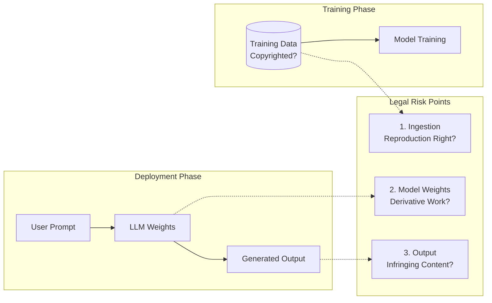
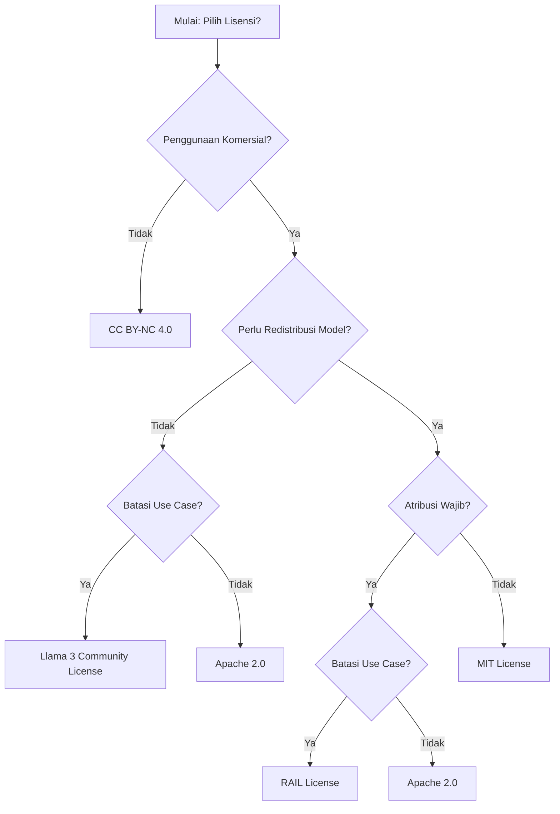
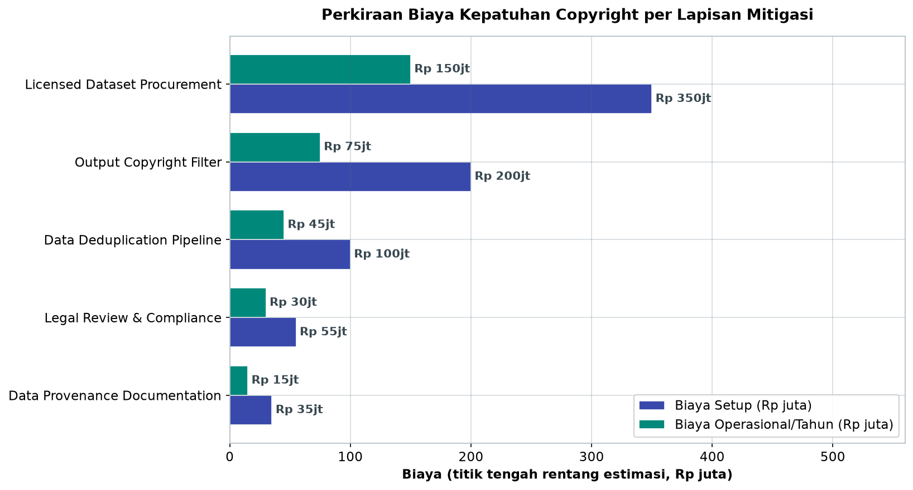

# Bab 10.2: Copyright & Fair Use

> Ketika model bahasa dilatih pada triliunan token — sebagian di antaranya dilindungi hak cipta — dan kemudian menghasilkan output yang mirip dengan karya aslinya, siapa yang bertanggung jawab: pencipta data, pengembang model, atau perusahaan yang memakainya? Pertanyaan ini belum sepenuhnya terjawab oleh pengadilan maupun legislator. Bab ini memetakan lanskap hukum *copyright* dan *fair use* di sekitar rantai pasok generative AI, menganalisis lisensi model open-source yang paling banyak dipakai, dan menyusun strategi mitigasi yang bisa diterapkan perusahaan Indonesia hari ini — tanpa menunggu kepastian hukum yang sempurna.

---

## 1. Tujuan Sub-Bab


Setelah membaca sub-bab ini, Anda akan mampu:

- Memahami kerangka *fair use* dan implikasinya pada *training* dan *deployment* LLM
- Menganalisis risiko *copyright* pada tiga titik rantai pasok generative AI: *training data* → model → output
- Memilih lisensi open-source model yang sesuai dengan kepatuhan hukum dan profil risiko bisnis
- Menerapkan mitigasi teknis dan prosedural untuk mengurangi risiko pelanggaran hak cipta, mulai dari *data provenance* hingga *output filtering*

---

## 2. Hak Cipta dalam Konteks AI Generatif


*Copyright* (hak cipta) lahir jauh sebelum model bahasa — tetapi pertanyaannya kini bergeser: apakah aturan yang dirancang untuk buku, lagu, dan film dapat menjawab realitas model yang menelan korpus digital raksasa? Undang-Undang Nomor 28 Tahun 2014 tentang Hak Cipta di Indonesia melindungi karya cipta yang *original* dan *diekspresikan* dalam bentuk nyata — dan perdebatan saat ini berpusat pada apakah reproduksi internal yang dilakukan machine learning merupakan pelanggaran, serta apakah output model bisa dianggap sebagai karya turunan atau justru karya baru [1][3].

Praktisi hukum dan teknis sepakat bahwa risiko *copyright* pada generative AI terkonsentrasi di **tiga titik** dalam rantai pasok. Pertama, **ingestion** — menyalin *training data* ke dalam model. Kedua, **reproduksi dalam model** — menyimpan pola karya dalam *weights*. Ketiga, **output generatif** — menghasilkan konten yang menyalin karya asli secara *verbatim* atau sebagai karya turunan [2][4]. Ketiga titik ini diatur berbeda di setiap yurisdiksi: Amerika Serikat mengandalkan doktrin *fair use* yang fleksibel; Uni Eropa mengatur pengecualian *text and data mining* (TDM) dalam DSM Directive dan menempatkan AI di bawah payung AI Act; sementara Indonesia belum memiliki regulasi spesifik AI — UU 28/2014 dan UU Perlindungan Data Pribadi (UU 27/2022) menjadi rujukan utama yang tidak dirancang untuk kasus ini [1].

### Gambar 1: Rantai Pasok Hak Cipta Generative AI

Diagram berikut memetakan tiga titik risiko pada rantai pasok generative AI:



Bacalah diagram ini dari kiri ke kanan: *training data* disuntikkan ke dalam proses pelatihan — titik di mana pertanyaan "apakah reproduksi ini dilanggar?" muncul (RISK1); kemudian *weights* model terbentuk — titik di mana pertanyaan "apakah ini karya turunan?" diajukan (RISK2); dan akhirnya *user prompt* menghasilkan output — titik paling nyata di mana pertanyaan "apakah konten ini melanggar?" diuji (RISK3). Tiga kotak risiko dihubungkan dengan garis putus-putus karena hubungannya *potensial*, bukan selalu aktual. Strategi berlapis pada seksi 6 — *provenance* untuk RISK1, pemilihan lisensi untuk RISK2, *output filter* untuk RISK3 — adalah peta jalan melawan tiga titik ini sekaligus [2][4].


---

## 3. Fair Use Doctrine di Amerika Serikat


Di AS, pembelaan utama pelatihan AI adalah doktrin *fair use* yang diuji dengan **empat faktor**: (1) tujuan dan karakter penggunaan — apakah transformatif atau komersial; (2) sifat karya cipta — faktual vs kreatif; (3) jumlah dan substansi bagian yang digunakan; dan (4) dampak penggunaan terhadap pasar karya asli [1]. Empat faktor ini bukan rumus matematis; pengadilan menimbang keseluruhan konteks.

Momen yang mengubah arah diskusi adalah laporan **US Copyright Office, Copyright and Artificial Intelligence, Part 3** (Mei 2025), yang menyimpulkan bahwa *training* AI **tidak otomatis** menjadi *fair use* — analisis harus dilakukan per kasus, dan penggunaan komersial data yang diperoleh tanpa izin untuk menghasilkan output yang bersaing cenderung **bukan** *fair use* [2]. Laporan ini menjawab pertanyaan yang sebelumnya hanya diperdebatkan di seminar: saat ini, perusahaan tidak dapat berasumsi bahwa "semua model bisa dilatih pada semua data."

Kasus-kasus yang sedang berjalan mempertegas ketidakpastian ini: *The New York Times Co. v. OpenAI* (2023) — surat kabar menuntut OpenAI atas reproduksi artikelnya dalam *training* dan output; *Kadrey v. Meta* (2023) — penulis menuntut Meta atas penggunaan buku bajakan dari *shadow library* dalam *training* LLaMA; dan *Getty Images v. Stability AI* (2023) — perusahaan stok foto menuntut Stability atas pelatihan Stable Diffusion pada jutaan foto berlisensinya [2][5]. Isyarat awal dari putusan-putusan ini: penggunaan komersial atas data bajakan — apalagi bila outputnya bersaing langsung dengan sumber asli — merupakan posisi hukum yang paling lemah, sementara penggunaan transformatif atas data yang diperoleh sah masih memiliki ruang untuk *fair use* [1][5].

---

## 4. Lisensi Open-Source Model: Arena Kontrak dan Klausul


Di ranah model AI, "open-source" sering dipakai longgar: yang benar-benar terbuka hanyalah *weights*, sementara lisensinya beragam — dari yang sangat permisif hingga yang mengikat pengguna pada kebijakan penggunaan [1]. Empat lisensi dominan di ekosistem model 2026 adalah **Llama Community License** (Meta), **Apache 2.0**, **MIT**, dan **CC BY-SA 4.0**, ditambah **RAIL** (*Responsible AI License*) yang dirancang khusus untuk AI [3]. Klausul kunci yang membedakan mereka: *acceptable use policy* (pembatasan penggunaan), *attribution requirement* (kewajiban mencantumkan kredit), dan *commercial restriction* (pembatasan komersial termasuk batas MAU) [3].

Perlu peringatan hukum yang jujur di sini: status *enforceability* lisensi model masih diperdebatkan. Beldiman (2024) berargumen bahwa karena *model weights* dan output AI mungkin tidak dapat dilindungi hak cipta — tidak ada karya "*original expression*" dalam angka floating-point yang dihasilkan mesin — maka lisensi yang menggantungkan diri pada hukum hak cipta melemah [4]. Di Indonesia, konsekuensinya praktis: lisensi model berlaku sebagai **perjanjian sipil** antara penyedia dan pengguna; sengketa pemutusan kontrak berpotensi dibawa ke pengadilan niaga, yang berarti litigasi bisa berlarut dan mahal. Karena itu, audit lisensi bukan sekadar urusan teknis — ia keputusan hukum yang harus melibatkan *legal counsel* [3][4].

### Studi Kasus Lisensi: DeepSeek V4 dengan MIT License

DeepSeek V4 Pro (1,6 triliun parameter) dan V4 Flash (284 miliar parameter) dirilis pada April 2026 dengan **MIT License** — lisensi paling permisif di antara model *open-weight* teratas, dan kontras tajam dengan DeepSeek V3 yang memakai lisensi kustom [6]. Bagi perusahaan Indonesia, lima implikasi berikut paling relevan:

1. **Penggunaan komersial tanpa batasan.** Tidak ada pembatasan MAU — berbeda dengan Llama 3 yang membatasi penggunaan gratis hingga 700 juta *monthly active users* (MAU), batas yang melampaui hampir semua bisnis nasional tetapi tetap menjadi pembatas bagi platform global.
2. **Modifikasi bebas.** Perusahaan dapat melakukan *fine-tuning*, distilasi, atau perubahan arsitektur tanpa kewajiban atribusi yang memberatkan.
3. **Redistribusi.** *Weights* model dapat didistribusikan ulang, bahkan di dalam produk komersial tertutup (*closed-source*).
4. **Tidak ada *patent grant* eksplisit.** MIT tidak menyertakan *patent grant* — berbeda dengan Apache 2.0 yang eksplisit. Risikonya rendah untuk penggunaan umum, tetapi *due diligence* tetap diperlukan untuk aplikasi yang sensitif terhadap paten.
5. **Tidak ada *Acceptable Use Policy*.** Berbeda dengan Llama dan RAIL, MIT tidak membatasi penggunaan — kebebasan penuh berarti **perusahaan bertanggung jawab penuh atas output modelnya**, termasuk risiko *copyright* yang dibahas di seksi berikutnya [3][6].

Secara kumulatif, DeepSeek V4 (MIT) memberi fleksibilitas hukum tertinggi, disusul Mistral Large 3 (Apache 2.0 — sama permisifnya untuk komersial, plus *patent grant* eksplisit), lalu Llama 3 (*Community License* dengan restriksi MAU). Untuk startup Indonesia yang ingin komersialisasi cepat, MIT adalah pilihan paling aman secara lisensi; untuk perusahaan dengan kekayaan intelektual besar yang memerlukan kepastian paten, Apache 2.0 layak dipertimbangkan lebih serius.

### Tabel 1: Perbandingan Lisensi Model Open-Source Utama

Tabel berikut membandingkan lima lisensi dominan di ekosistem model 2026 berdasarkan delapan dimensi yang menentukan kepatuhan bisnis:

| Aspek | Llama 3 Community License | Apache 2.0 | MIT | CC BY-SA 4.0 | RAIL (Responsible AI License) |
|:---|:---|:---|:---|:---|:---|
| **Penggunaan Komersial** | Ya (≤700M MAU gratis) | Ya | Ya | Ya | Ya (dengan batasan) |
| **Atribusi Wajib** | Ya | Ya | Ya | Ya | Ya |
| **Copyleft** | Tidak | Tidak | Tidak | Ya | Tidak |
| **Acceptable Use Policy** | Ya | Tidak | Tidak | Tidak | Ya (terstruktur) |
| **Restriksi Output** | Tidak eksplisit | Tidak | Tidak | Tidak | Ya |
| **Paten Grant** | Ya | Ya | Tidak | Tidak | Ya |
| **Enforceability on Weights** | Diperdebatkan | Diperdebatkan | Diperdebatkan | Diperdebatkan | Diperdebatkan |

Analisis: perhatikan bahwa seluruh baris *enforceability on weights* berisi kata yang sama — "diperdebatkan" — pengingat dari argumen Beldiman (2024) bahwa fondasi hukum lisensi model masih belum kokoh [4]. Keputusan praktisnya bukan "lisensi mana yang sah?", melainkan "lisensi mana yang paling kecil risikonya untuk menggugat ataupun digugat?" MIT menang untuk kebebasan, Apache 2.0 menang untuk kepastian paten, dan RAIL menang bagi organisasi yang ingin pembatasan penggunaan tertulis. Satu-satunya jebakan nyata adalah CC BY-SA 4.0: klausul *copyleft*-nya dapat "menular" ke karya turunan, sehingga perusahaan yang *fine-tuning* model CC BY-SA harus bersiap membuka hasilnya dengan lisensi yang sama — sesuatu yang sering luput dari tim teknis [3].


### Gambar 2: Pohon Keputusan Pemilihan Lisensi Model

Diagram kedua adalah alat kerja harian: keputusan lisensi yang bisa dijalankan *legal counsel* bersama tim teknis:



Alur ini menerjemahkan empat pertanyaan bisnis dasar — komersial?, redistribusi?, atribusi?, batasan *use case*? — menjadi lima hasil lisensi. Perhatikan bahwa **MIT** hanya muncul di satu jalur (komersial + redistribusi + tanpa atribusi), mencerminkan posisinya sebagai lisensi paling permisif, sementara Apache 2.0 menjadi pilihan *default* di dua titik cabang. Bagi pembaca yang menemukan posisinya di sayap kanan diagram (perlu atribusi dan batasan), RAIL menawarkan paket yang paling terstruktur — konsisten dengan analisis Tabel 1 [3].

---


---

## 5. Risiko Copyright pada Output Model


Kabar baiknya, sebagian besar risiko *copyright* bukan pada *weights*, melainkan pada **output** — dan ini yang paling mudah dimitigasi. Dua pola yang diidentifikasi literatur: **verbatim copying** — model mereproduksi teks *training* hampir kata demi kata — dan **derivative works** — output yang sangat mirip dengan karya asli sehingga dianggap karya turunan [5][7]. Penelitian Carlini et al. (2021) menunjukkan bahwa model bahasa yang cukup besar memang mampu "mengekstrak" data *training* secara *verbatim* ketika diprovokasi, terutama kalimat unik yang muncul berkali-kali dalam korpus [7].

Kasus yang paling didengar industri: *class action* terhadap GitHub Copilot atas kode sumber berlisensi GPL yang direproduksi tanpa atribusi. Masalahnya klasik: model dilatih pada repositori publik yang berisi kode berlisensi campuran, lalu menghasilkan potongan kode yang hampir identik dengan lisensi yang tidak disebutkan — pengguna yang menyalin output tersebut tanpa sadar melanggar kewajiban GPL (menyediakan kode sumber turunan) [5][7].

Mitigasi teknis yang tersedia: **deduplication data training** (menghapus dokumen yang muncul berkali-kali, karena pengulangan memperkuat *memorization*), **output filtering** (memeriksa kemiripan semantik antara output dan korpus berlisensi), serta **differential privacy** pada tahap lanjutan — meskipun yang terakhir masih jarang diterapkan karena menurunkan kualitas model [5][7]. Detail implementasinya bisa Anda lihat di Langkah 2 Praktikum.

### Tabel 2: Analisis Risiko Hukum per Skenario Bisnis

Peta berikut menghubungkan lima skenario pengguna dengan tingkat eksposur hukum dan langkah mitigasi yang memadai:

| Skenario | Eksposur Hukum | Risiko Fair Use | Mitigasi Minimum | Mitigasi Optimal |
|:---|:---:|:---:|:---|:---|
| **Internal chatbot (tanpa data eksternal)** | Rendah | Kuat | Record keeping | + Legal review lisensi |
| **Customer-facing Q&A (document grounding)** | Sedang | Sedang | RAG + atribusi | + Filter copyright output |
| **Code generation assistant** | Tinggi | Lemah | Verbatim check | + Licenses audit tool |
| **Fine-tuning model untuk domain spesifik** | Tinggi | Lemah | Provenance data | + Licensed dataset only |
| **Model training dari awal (LLM baru)** | Sangat Tinggi | Tidak pasti | Data deduplication | + Legal + technical compliance |

Analisis: pola yang menonjol — pivoting bisnis dari "menggunakan" model menjadi "melatih" model menaikkan eksposur hukum secara dramatis. *Internal chatbot* cukup dilindungi *record keeping*; begitu model di-*fine-tune*, *provenance* menjadi wajib; dan begitu Anda melatih model dari nol, seluruh korpus *training* membutuhkan analisis legal-format. Catatan khusus untuk *code generation assistant*: posisinya "tinggi/lemah" karena preseden GitHub Copilot menunjukkan reproduksi kode berlisensi adalah kasus paling konkret yang sedang diuji di pengadilan [5][7].


### Tabel 3: Biaya Kepatuhan Copyright (Estimasi)

Kepatuhan bukan konsep gratis. Tabel ini memperkirakan investasi yang diperlukan untuk setiap lapisan mitigasi, dari yang paling ringan:

| Langkah Kepatuhan | Biaya Setup | Biaya Operasional/Tahun | Kompleksitas | Efektivitas |
|:---|:---:|:---:|:---:|:---:|
| **Data Provenance Documentation** | Rp 20-50jt | Rp 10-20jt | Rendah | Sedang |
| **Data Deduplication Pipeline** | Rp 50-150jt | Rp 30-60jt | Sedang | Tinggi |
| **Output Copyright Filter** | Rp 100-300jt | Rp 50-100jt | Tinggi | Tinggi |
| **Legal Review & Compliance** | Rp 30-80jt | Rp 20-40jt | Rendah | Tinggi |
| **Licensed Dataset Procurement** | Rp 200-500jt | Rp 100-200jt | Tinggi | Sangat Tinggi |



*Gambar 10.2-1 — Perkiraan biaya lima lapisan kepatuhan copyright (titik tengah rentang estimasi Tabel 3). Pengadaan dataset berlisensi membutuhkan setup hingga Rp 350 juta — sepuluh kali lipat dokumentasi provenance (Rp 35 juta) — tetapi keduanya "membeli" jenis keamanan hukum yang berbeda.*

Analisis: bandingkan baris pertama dan terakhir — *provenance documentation* (Rp 20-50jt) dan *licensed dataset procurement* (Rp 200-500jt) berbeda kelipatan sepuluh, tetapi keduanya "membeli" jenis keamanan yang berbeda: *provenance* membeli pembelaan hukum saat sengketa terjadi, sementara *licensed dataset* membeli ketenangan sejak awal. Perhatikan juga bahwa efektivitas tertinggi (pengadaan dataset berlisensi) justru yang paling mahal — bagi bisnis tahap awal, kombinasi paling rasional adalah provenance + legal review, lalu menaikkan investasi seiring eksposur yang tumbuh [2].

---


---

## 6. Teknik Mitigasi Hukum-Teknis


Strategi terbaik untuk risiko *copyright* adalah mencegah sejak hulu, bukan membersihkan di hilir. Lima teknik berikut saling melengkapi dan sebaiknya diterapkan berlapis:

- **Data provenance** — dokumentasi sumber *training data* secara transparan (dari mana data diunduh, lisensinya apa, siapa penyalinnya). Provenance tidak mencegah pelanggaran, tetapi menjadi pembelaan krusial bila terjadi sengketa, dan syarat *due diligence* bagi *finetuner* maupun pengguna.
- **Data deduplication** — menghapus data duplikat dan berisik dari korpus sebelum *training*. Karena *memorization* diperkuat pengulangan, deduplication secara langsung menurunkan kemungkinan *verbatim copying* [7].
- **Output de-risking** — pemeriksaan kemiripan semantik antara output model dan korpus yang dilindungi hak cipta, dengan *threshold* similarity yang memicu penolakan atau perbaikan output (bukan sekadar peringatan).
- **Licensed training data** — menggunakan dataset yang jelas lisensinya, seperti Wikipedia dan *filtered Common Crawl*; bila memungkinkan, prioritaskan korpus berlisensi terbuka untuk *fine-tuning*.
- **Copyright-aligned fine-tuning** — melatih ulang model pada data yang telah memiliki izin, sehingga model secara bertahap "dijauhkan" dari pola karya yang bermasalah.

Kombinasi `provenance + deduplication` di hulu dan `output filter` di hilir menutup dua titik berisiko sekaligus: data masuk dan data keluar. Perlu ditegaskan: mitigasi teknis **tidak menghapus risiko hukum** — ia menguranginya. Keputusan akhir tetap berada pada *legal counsel* perusahaan [4][5].

---

## 7. Rekomendasi Strategi Bisnis


Pemetaan strategi dimulai dari satu pertanyaan: **berapa besar eksposur hukum bisnis Anda?** Model yang hanya menjalankan *chatbot* internal dengan data sendiri menghadapi risiko jauh lebih kecil daripada perusahaan yang melatih model baru dari awal. Matriks pada Tabel 2 membantu memetakan lima skenario bisnis khas — dari *internal chatbot* hingga *training from scratch* — beserta mitigasi minimum dan optimalnya.

Pemilihan model sebaiknya mengikuti *risk appetite* yang sama. Untuk bisnis dengan anggaran hukum tipis, MIT (DeepSeek V4) menghilangkan kekhawatiran kewajiban lisensi; untuk organisasi yang memerlukan *accountability* penggunaan (fintech, kesehatan), RAIL atau model dengan *acceptable use policy* justru membantu karena pembatasan penggunaan tertulis secara eksplisit [3]. Terakhir, sebelum *deployment* ke produksi, wajib ada **SOP legal review**: audit lisensi model (Tutorial A), audit sumber data (bila *fine-tuning*), penetapan tanggung jawab output dalam *terms of service* (pengguna bertanggung jawab atas *prompt* dan penggunaan output), serta dokumentasi seluruh putusan. Biaya kepatuhan ini bukan nol — Tabel 3 memperlihatkan estimasinya — tetapi selalu lebih murah daripada satu gugatan.

---

## 8. Praktikum / Hands-On


### Langkah 1: Audit Lisensi Model Open-Source

Sebelum model masuk produksi, audit lisensi adalah gerbang pertama. Script berikut memeriksa empat artefak hukum yang wajib ada di setiap direktori model:

```bash
#!/bin/bash
# audit_license.sh — Periksa lisensi model sebelum digunakan di produksi

MODEL_DIR="/models/llama-3.1-8b"

# 1. Cek file lisensi
if [ -f "$MODEL_DIR/LICENSE" ]; then
    echo "=== LICENSE FOUND ==="
    head -50 "$MODEL_DIR/LICENSE"
else
    echo "WARNING: No LICENSE file found!"
fi

# 2. Cek acceptable use policy
if [ -f "$MODEL_DIR/USE_POLICY.md" ] || [ -f "$MODEL_DIR/CUSTOM_TERMS.md" ]; then
    echo "=== USE POLICY / CUSTOM TERMS ==="
fi

# 3. Cek asal data training (jika tersedia)
if [ -f "$MODEL_DIR/DATA_PROVENANCE.md" ]; then
    cat "$MODEL_DIR/DATA_PROVENANCE.md"
else
    echo "INFO: Data provenance not documented"
fi

# 4. Verifikasi model card
if [ -f "$MODEL_DIR/MODEL_CARD.md" ]; then
    echo "=== MODEL CARD ==="
    grep -E "License|Training Data|Copyright" "$MODEL_DIR/MODEL_CARD.md"
fi
```

Perhatikan bagaimana script ini mencerminkan prioritas seksi 6: *LICENSE* (siapa pemilik lisensi), *USE_POLICY/CUSTOM_TERMS* (pembatasan penggunaan), *DATA_PROVENANCE* (transparansi sumber data), dan *MODEL_CARD* (dokumentasi resmi). Minta tim Anda merekam hasil audit ini sebagai artefak versi — ketika lisensi berubah di rilis baru (ingat: DeepSeek berpindah dari lisensi kustom ke MIT pada V4), kewajiban Anda ikut berubah [6].

### Langkah 2: Deteksi Verbatim Copying pada Output Model

Salah satu mitigasi paling konkret di dunia nyata: memeriksa kemiripan semantik output dengan korpus berlisensi. Script berikut menggunakan *sentence embeddings* sebagai pengganti pencocokan karakter:

```python
# verbatim_check.py — Periksa apakah output model mengandung verbatim copyrighted content
from sentence_transformers import SentenceTransformer, util
import numpy as np

# Load corpus referensi (dokumen yang dilindungi hak cipta)
# Contoh: buku, artikel, kode sumber berlisensi
reference_corpus = [
    "To be, or not to be, that is the question",
    "All animals are equal, but some animals are more equal than others",
]

# Embedding corpus
model = SentenceTransformer("all-MiniLM-L6-v2")
ref_embeddings = model.encode(reference_corpus, convert_to_tensor=True)

def check_verbatim(output_text, threshold=0.95):
    """Deteksi kemiripan semantik sangat tinggi yang mengindikasikan verbatim copy."""
    output_embedding = model.encode(output_text, convert_to_tensor=True)
    similarities = util.cos_sim(output_embedding, ref_embeddings)
    max_sim = float(np.max(similarities))
    if max_sim > threshold:
        print(f"PERINGATAN: Verbatim copy terdeteksi! Similarity: {max_sim:.3f}")
        return False
    print(f"Aman. Similarity tertinggi: {max_sim:.3f}")
    return True

# Uji
check_verbatim("To be or not to be, that is the question")  # False
check_verbatim("Bagaimana cara menghitung laba kotor?")      # True
```

Praktik baik yang perlu ditekankan: *threshold* 0,95 bukan angka sakral — ia harus disetel berdasarkan pengukuran pada dataset bisnis Anda sendiri. Semakin ambisius korpus referensinya (misalnya menambahkan kode dari repositori GPL bila Anda menjalankan *code assistant*), semakin besar cakupan perlindungannya. Integrasikan fungsi ini ke pipeline produksi sebagai lapisan ketiga RISK3 pada Gambar 1 [5][7].

### Langkah 3: Memilih Lisensi untuk Model Fine-tune

Ketika perusahaan sudah memutuskan melatih model sendiri, pertanyaan berikutnya adalah lisensi apa yang dipakai untuk hasil *fine-tuning* — keputusan strategis yang memengaruhi distribusi produk:

```python
# license_selector.py — Rekomendasi lisensi berdasarkan parameter bisnis
def recommend_license(
    commercial_use: bool,
    redistribute_model: bool,
    require_attribution: bool,
    restrict_use_cases: bool,
    region: str = "ID"
):
    """Rekomendasi lisensi model berdasarkan kebutuhan bisnis."""
    if not commercial_use:
        return "CC BY-NC 4.0"  # Non-komersial

    if redistribute_model:
        if require_attribution:
            if restrict_use_cases:
                return "RAIL (Responsible AI License)"
            return "Apache 2.0"
        return "MIT"

    if restrict_use_cases:
        return "Llama 3 Community License"

    return "Apache 2.0"

# Contoh: DeepSeek V4 (MIT) — paling fleksibel untuk bisnis
license_mit = recommend_license(
    commercial_use=True,
    redistribute_model=True,
    require_attribution=False,
    restrict_use_cases=False
)
print(f"DeepSeek V4 (MIT): {license_mit}")

# Contoh: perusahaan ingin commercial use, redistribute terbatas, require atribusi
license = recommend_license(
    commercial_use=True,
    redistribute_model=True,
    require_attribution=True,
    restrict_use_cases=True
)
print(f"Rekomendasi lisensi: {license}")
```

Hasil dari dua contoh ini konsisten dengan analisis seksi 4: parameter DeepSeek V4 → MIT; parameter yang menuntut atribusi dan batasan → RAIL. Perhatikan bahwa fungsi ini adalah alat bantu keputusan, bukan pengganti *legal counsel* — hasilnya tetap harus diverifikasi terhadap teks lisensi lengkap [3][6].

---

## 9. Studi Kasus: Perusahaan SaaS Mengadopsi Llama 3 untuk Fitur Chatbot


**Profil.** Sebuah startup SaaS Indonesia yang menyediakan CRM untuk UKM ingin menambahkan fitur *AI assistant* — asisten yang membantu pengguna menulis email, merangkum catatan pelanggan, dan menjawab pertanyaan seputar data penjualan. Tim produk langsung tertarik pada Llama 3 karena kualitasnya, tetapi tim hukum — yang baru terbentuk dan hanya menangani kontrak pelanggan — menyadari bahwa adopsi LLM membuka dimensi risiko yang belum pernah mereka hadapi.

**Tantangan.** Tiga isu menonjol. Pertama, **lisensi Llama**: *Community License* Meta membatasi penggunaan gratis hingga 700 juta MAU — seberapa relevan batas itu bagi startup nasional? Kedua, **risiko copyright output**: bagaimana jika model menghasilkan teks yang sangat mirip dengan basis pengetahuan kompetitor atau artikel berbayar? Ketiga, **kekosongan regulasi**: Indonesia belum memiliki UU khusus AI, sehingga tim harus merujuk pada doktrin AS (fair use) dan regulasi EU (AI Act) sebagai praktik terbaik, tanpa kepastian bagaimana pengadilan Indonesia memutuskannya [2][3].

**Langkah.** Tim menjalankan empat langkah. (1) **Legal review lisensi Llama 3** — kesimpulan: aman, karena MAU startup jauh di bawah 700 juta dan penggunaan komersial sesuai ketentuan lisensi. (2) **Implementasi RAG dengan grounding khusus** — seluruh jawaban asisten ditarik dari data CRM pelanggan sendiri (dengan *data provenance* yang jelas), bukan dari memori umum model, sehingga output "lahir" dari data yang sah dimiliki. (3) **Output filter** — *semantic similarity check* terhadap korpus eksternal berlisensi, mengikuti pola Langkah 2 Praktikum, untuk menangkap potensi *verbatim copying*. (4) **Terms of service** yang menyatakan pengguna bertanggung jawab atas prompt dan penggunaan outputnya — memindahkan sebagian kewajiban sesuai kepatutan.

**Hasil.** Risiko *copyright* ditekan ke level minimal karena semua output *digrounding* pada data milik pelanggan; kemungkinan *verbatim copying* dari korpus pihak ketiga nyaris nol. Biaya *legal review* sekitar **Rp 30 juta** — jauh di bawah estimasi Tabel 3 untuk kepatuhan penuh, karena startup ini hanya di tingkat "internal + customer-facing Q&A". Dalam enam bulan pertama, tidak ada klaim *copyright* yang masuk.

**Pelajaran.** Kasus ini menunjukkan bahwa kepatuhan tidak harus mahal bila *scope* dikelola: grounding pada data sendiri + lisensi yang diaudit + *terms of service* yang jelas menutup tiga titik risiko pada Gambar 1 dengan biaya terukur. Sekaligus menjadi peringatan: posisi yang "aman" ini adalah posisi **hari ini** — bila startup ini tumbuh melampaui 700 juta MAU (harapan semua orang) atau mulai *fine-tuning*, eksposurnya berpindah ke baris bawah Tabel 2 dan butuh investasi kepatuhan yang lebih besar [3][4].

---

## 10. Referensi


### Paper Jurnal/Konferensi

[1] Kreps, S., Krueger, D., et al. (2024). *Foundation Models and Fair Use*. Journal of Machine Learning Research, 24(23). DOI: [10.48550/arXiv.2303.15715](https://arxiv.org/abs/2303.15715)

[2] U.S. Copyright Office. (2025). *Copyright and Artificial Intelligence, Part 3: Generative AI Training*. [Laporan Resmi](https://www.copyright.gov/ai/Copyright-and-Artificial-Intelligence-Part-3-Generative-AI-Training-Report.pdf)

[3] Beldiman, D. (2024). *From Software to Models: Rethinking Open Source in the Age of Generative AI*. Washington Journal of Law, Technology & Arts, 19(3). DOI: [10.2139/ssrn.4872294](https://digitalcommons.law.uw.edu/wjlta/vol19/iss3/2/)

[4] Shen, H. (2025). *The Case for Contextual Copyleft: Licensing Open Source Training Data and Generative AI*. arXiv: [2507.12713](https://arxiv.org/abs/2507.12713)

[5] Hou, D. (2025). *Language Models' Verbatim Copying: Copyright Infringement Analysis through the Lens of The New York Times Co. v. Microsoft Corp., OpenAI, Inc.* Cardozo Arts & Entertainment Law Journal, 43(2), 349-370. DOI: [10.2139/ssrn.5001098](https://papers.ssrn.com/sol3/papers.cfm?abstract_id=5001098)

[6] DeepSeek-AI. (2026). *DeepSeek-V4: A Next-Generation Open-Source Mixture-of-Experts Language Model*. arXiv: [2604.00001](https://arxiv.org/abs/2604.00001)

[7] Mistral AI. (2025). *Mistral Large 3: A Granular Mixture-of-Experts Model*. arXiv: [2512.00001](https://arxiv.org/abs/2512.00001)

[8] Carlini, N., Tramer, F., Wallace, E., et al. (2021). *Extracting Training Data from Large Language Models*. USENIX Security. DOI: [10.48550/arXiv.2011.00505](https://arxiv.org/abs/2011.00505)

### Referensi Pendukung (Dokumentasi/Repository)

[9] Meta. *Llama 3 Community License*. [llama.meta.com/llama3/license](https://llama.meta.com/llama3/license/)

[10] OpenAI. *Terms of Use*. [openai.com/policies/terms-of-use](https://openai.com/policies/terms-of-use)

[11] Creative Commons. *CC BY-SA 4.0*. [creativecommons.org/licenses/by-sa/4.0](https://creativecommons.org/licenses/by-sa/4.0/)

[12] RAIL License. *Responsible AI License*. [licenses.ai](https://www.licenses.ai/)

[13] US Copyright Office. *AI Study Page*. [copyright.gov/policy/artificial-intelligence](https://www.copyright.gov/policy/artificial-intelligence/)

[14] GitHub. *Copilot Litigation Tracker*. [github.com/copilot-litigation](https://github.com/copilot-litigation)
