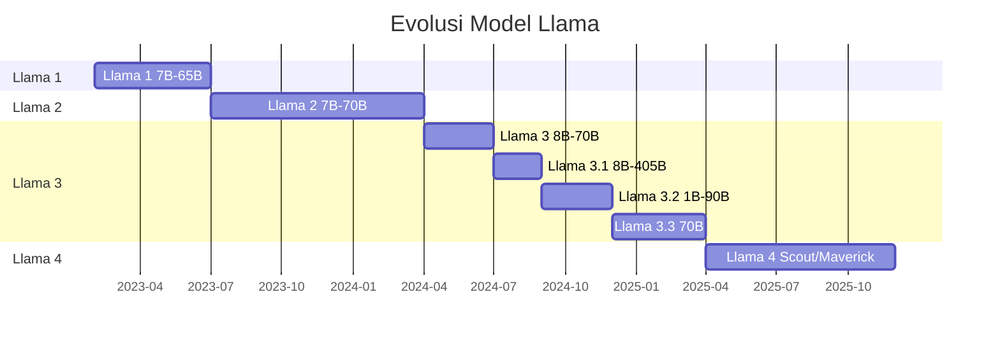
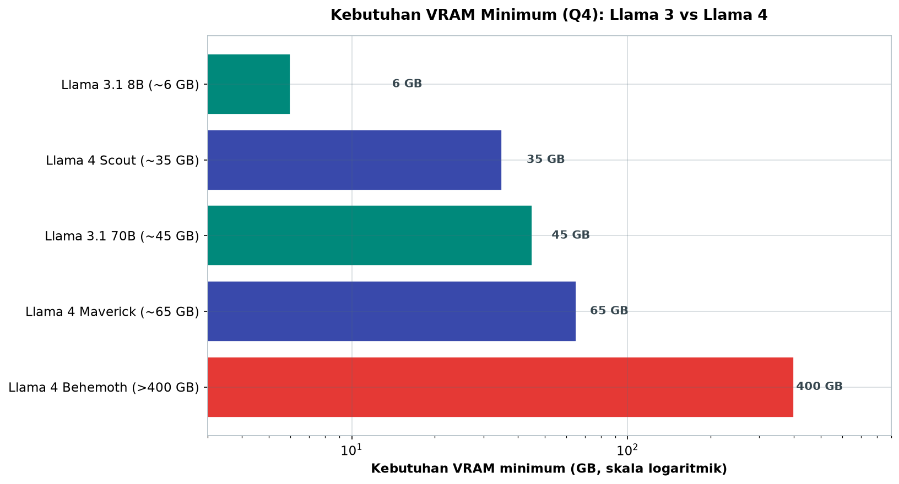
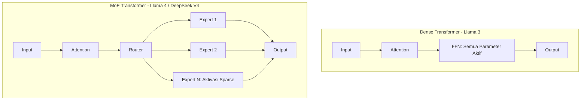
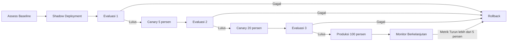

# Bab 10.3: Update Lifecycle

> Mengganti model di produksi terasa seperti mengganti mesin pesawat saat pesawat sedang terbang — jika salah melakukannya, seluruh sistem yang bergantung padanya ikut jatuh. Realita dunia LLM 2026 membuat ritual ini tidak bisa dihindari: DeepSeek merilis V4 lima belas bulan setelah V3, Mistral mengubah arsitektur dari dense menjadi granular MoE, dan Meta melompat dari dense ke MoE dalam satu generasi. Bab ini menyusun *playbook* transisi lintas generasi: memahami perubahan arsitektur, mengukur dampaknya pada perilaku, dan bermigrasi secara bertahap dengan *rollback* yang siap ditarik.

---

## 1. Tujuan Sub-Bab


Setelah membaca sub-bab ini, Anda akan mampu:

- Memahami perbedaan arsitektur lintas generasi: *dense Transformer* vs MoE, serta MoE generasi awal vs *granular MoE* terbaru
- Menyusun rencana migrasi antar model — Llama 3→4, DeepSeek V3→V4, Mistral→Large 3 — dengan strategi *gradual rollback*
- Mengevaluasi performa model baru menggunakan *baseline metrics* dan *regression testing* sebelum memutuskan pindah
- Mengelola *prompt migration* dan *fine-tuning adaptation* untuk berbagai arsitektur MoE tanpa mengganggu layanan

---

## 2. Evolusi Model Lintas Generasi: Peta Jalan 2023-2026


Memahami sejarah empat keluarga model besar adalah prasyarat migrasi yang sukses — karena setiap generasi membawa bukan hanya performa, tetapi juga perubahan arsitektur yang mengubah cara model "berpikir". Berikut peta jalan evolusinya:

**Meta Llama** bergerak cepat dan sistematis: Llama 3 (April 2024, *dense* 8B/70B/405B, konteks 128K) → Llama 3.1 (Juli 2024, menambahkan *tool use* native) → Llama 3.2 (September 2024, menambahkan vision) → Llama 3.3 (Desember 2024, penyempurnaan) → **Llama 4** (April 2025) yang mengubah segalanya: arsitektur MoE dengan **Scout 17B×16 experts** (konteks 10 juta token) dan **Maverick 17B×128 experts** [1][6]. Lompatan dari konteks 128K ke 10M adalah perubahan kuantitatif sekaligus kualitatif — kemampuan memproses ratusan halaman dalam satu sesi.

**DeepSeek** berjalan serupa namun lebih cepat: V2 (2024, MoE 236B/21B aktif) → V3 (Desember 2024, MoE 671B/37B aktif) → R1 (Januari 2025, dominan dalam *reasoning* via RL) → **V4 Pro** (April 2026, MoE 1,6 triliun/49B aktif, konteks 1M, SWE-bench 80,6%) dan V4 Flash (284B/13B aktif). Transisi V3→V4 mencatat tiga lompatan sekaligus: parameter aktif tumbuh **2,4 kali lipat** dibandingkan generasi V2 (21B aktif) menuju V4 Pro (49B aktif), konteks melompat 128K→1M, dan lisensi berubah dari *DeepSeek License* kustom menjadi **MIT** [7].

**Mistral** menunjukkan evolusi arsitektur yang paling dramatis: Mistral 7B (2023, *dense*) → Mixtral 8x7B (2023, MoE pertama) → Mistral Large 2 (2024, *dense*) → **Mistral Large 3** (Desember 2025, *granular MoE* 675B total/41B aktif, Apache 2.0, multimodal native). Transisi Large 2→3 bukan sekadar upgrade — ia perubahan filosofi arsitektur yang memengaruhi cara tuning prompt [8].

**Qwen** berfokus pada arah *agentic*: Qwen2.5 (2024, *dense*) → Qwen2.5-MoE (2025) → **Qwen3.7-Max** (Mei 2026, MoE *agent-centric*, konteks 1M, *tool calling* built-in) [9]. Sementara **Anthropic Claude** mengejar pendulum berbeda: Claude 3 (2024) → 3.5 (2024) → Claude 4 (2025) → **Claude Fable 5** (Juni 2026, kelas *Mythos*, konteks 1M, *safety classifiers*, SWE-bench 95,0%) — evolusi yang dipimpin prioritas keamanan, bukan sekadar besar parameter [6].

### Gambar 1: Timeline Evolusi Model Llama

Peta waktu berikut menunjukkan ritme rilis Meta — dan mengapa perencanaan lifecycle wajib melihat dua rilis ke depan:



Pola yang terlihat jelas: siklus rilis Meta kini sekitar tiga-empat bulan per versi *minor*, dengan generasi besar setiap 12-15 bulan [Sumber?]. Implikasi operasionalnya: rencanakan jendela migrasi **sebelum** rilis berikutnya diumumkan, dan jangan pernah *commit* arsitektur yang mengunci diri pada satu generasi. Tim yang menunggu "rilis sempurna" akan selamanya mengejar; tim yang menyiapkan pipeline migrasi yang berulang akan selalu dipimpin [1][6].


---

## 3. Perubahan Arsitektur: Dense, MoE, Granular MoE, dan Agent-Centric


Perbedaan arsitektur adalah akar dari semua kejutan migrasi. **Dense Transformer** (Llama 3) mengaktifkan *seluruh* parameter untuk setiap token — tekanan komputasi seragam, perilaku mudah diprediksi, dan performa bersifat monotonik terhadap ukuran. **MoE standar** (Llama 4, DeepSeek V3) memperkenalkan *sparse activation*: sebuah *router network* memilih subset "expert" yang aktif untuk setiap token. Keuntungannya efisiensi — FLOPs per token jauh lebih rendah untuk kualitas setara, tetapi tantangannya nyata: *memory footprint* membengkak karena seluruh expert harus dimuat di memori, meski hanya sebagian yang aktif [1][2].

**Granular MoE** (Mistral Large 3, DeepSeek V4) melangkah lebih jauh: jumlah expert lebih banyak dengan ukuran per-expert lebih kecil, sehingga routing menjadi lebih halus dan presisi. Mistral Large 3 menggunakan 675B total / 41B aktif dengan granular routing yang mencapai **FLOPs 27% lebih rendah** daripada MoE standar untuk kualitas setara [8]. **Agent-Centric MoE** (Qwen3.7-Max) mengoptimalkan routing untuk tugas multi-langkah dengan *tool calling* — membentuk expert khusus untuk *reasoning*, *coding*, dan *tool use*, sehingga pipeline agen tidak perlu berpindah-pindah "kompetensi" [9].

Implikasi migrasinya konkret dan terukur. DeepSeek V3 (671B/37B aktif) → V4 Pro (1,6T/49B aktif) memberi peningkatan kualitas signifikan — **+12% SWE-bench** — dengan hanya **+32% parameter aktif**: hasil arsitektur yang lebih efisien, bukan sekadar model lebih besar [7]. Sebaliknya, Mistral Large 2 (*dense*) → Large 3 (*granular MoE*) membutuhkan penyesuaian *prompt* karena perilaku routing berbeda: pertanyaan yang sama bisa dirutekan ke expert berbeda, menghasilkan gaya jawaban yang berubah tanpa mengubah instruksi.

### Tabel 1: Perbandingan Arsitektur Llama 3 vs Llama 4

Tabel berikut memperlihatkan transformasi paling dramatis dalam satu keluarga model — dari *dense* ke MoE dengan empat varian:

| Aspek | Llama 3.1 | Llama 4 Scout | Llama 4 Maverick | Llama 4 Behemoth |
|:---|:---:|:---:|:---:|:---:|
| **Arsitektur** | Dense Transformer | MoE (16 experts) | MoE (128 experts) | MoE |
| **Parameter Aktif** | 8B / 70B / 405B | 17B | 17B | 288B |
| **Parameter Total** | 8B / 70B / 405B | 109B | 400B | ~2T |
| **Context Window** | 128K | 10M | 1M | N/A (still training) |
| **Multimodal** | Text (3.1), Vision (3.2) | Text + Image | Text + Image | Text + Image |
| **Knowledge Cutoff** | Dec 2023 | Aug 2024 | Aug 2024 | 2024 |
| **Rilis** | Jul 2024 | Apr 2025 | Apr 2025 | N/A |
| **Min VRAM (Q4)** | ~6 GB (8B) / ~45 GB (70B) | ~35 GB | ~65 GB | >400 GB |



*Gambar 10.3-1 — Kebutuhan VRAM minimum (Q4) dari generasi Llama 3 ke Llama 4 pada skala logaritmik. MoE membuat model "besar" lebih murah dijalankan — Scout 109B total hanya butuh ~35 GB — sementara Behemoth (>400 GB) menegaskan bahwa tidak semua rilis cocok untuk semua infrastruktur.*

Analisis: tiga observasi penting. Pertama, *dense* 405B membutuhkan ~45 GB untuk varian 70B — sementara Scout 109B total membutuhkan ~35 GB — MoE membuat model "besar" lebih murah dijalankan. Kedua, gap konteks 128K→10M adalah lompatan kualitatif: aplikasi yang dulu butuh *chunking* agresif kini bisa memproses dokumen utuh. Ketiga, *knowledge cutoff* — Desember 2023 untuk Llama 3.1 vs Agustus 2024 untuk Llama 4 — adalah pengingat bahwa migrasi sering kali berarti mendapatkan pengetahuan yang delapan bulan lebih baru tanpa biaya tambahan. Batas VRAM >400 GB Behemoth menegaskan: tidak semua rilis layak untuk semua infrastruktur [1][6].


### Gambar 2: Arsitektur Dense vs MoE

Diagram blok ini menjelaskan mengapa perilaku kedua arsitektur berbeda:



Kontrasnya terletak pada kotak ketiga setiap alur: di *dense*, *FFN* menjalankan seluruh parameter; di MoE, sebuah **router** memilih beberapa expert di antara puluhan hingga ratusan. Konsekuensi perilaku yang sering tak terduga: router bisa "berubah pikiran" untuk *prompt* yang hampir sama — menghasilkan jawaban yang sedikit berbeda secara deterministik-random — dan gaya jawaban dipengaruhi expert yang terpilih [2]. Inilah dasar dari pelajaran seksi 4: jangan heran bila model baru menjawab dengan gaya berbeda untuk instruksi yang sama; periksa dulu expert mana yang dirutekan sebelum menduga *bug* [5].


---

## 4. Dampak pada Prompt dan Perilaku: Yang Tidak Terlihat di Benchmark


*Benchmark* berbohong — bukan karena angkanya palsu, tetapi karena angka tidak menceritakan perilaku. Model MoE merespons *prompt* secara berbeda dari *dense*: format instruksi, *phrasing*, dan bahkan panjang jawaban bergeser antar generasi. Perbedaan perilaku yang paling sering dilaporkan tim produksi: **Llama 4 cenderung lebih "chatty"** — komunitas mengkritiknya sebagai terlalu banyak bicara — sementara Llama 3 lebih konservatif dan langsung ke poin [1][3]. Contoh khas: *prompt* summarization yang bekerja sempurna di Llama 3 menghasilkan ringkasan bertele-tele di Llama 4, hingga ditambahkan instruksi eksplisit "concise" (ringkas).

Konsekuensi operasionalnya: migrasi tidak boleh dimulai dari toleransi, tetapi dari pengukuran. Sebelum pindah, bangun **regression test suite** yang memvalidasi 100+ *prompt* produksi yang ada — bukan hanya accuracy, tetapi juga format, panjang, gaya, dan latensi. Prompt yang "lulus" diuji ke model baru; yang gagal masuk daftar *prompt migration*: perhatikan bahwa kegagalan semacam ini **normal**, bukan tanda model baru buruk. Ia tanda bahwa perilaku telah berubah — dan tugas tim MLOps adalah memperbarui instruksi untuk bahasa baru model tersebut. DeepSeek V3→V4 menuntut penyesuaian karena V4 lebih eksplisit dalam *reasoning*; Mistral Large 2→3 menuntut instruksi tambahan untuk memanfaatkan kemampuan multimodal barunya [4].

---

## 5. Strategi Migrasi Bertahap: Empat Gerbang, Satu Garis Mundur


Mengganti model di produksi adalah operasi *rolling upgrade* — dan seperti *deployment* perangkat lunak yang baik, ia melalui gerbang bertahap dengan garis mundur yang selalu siap. Empat gerbang tersebut:

**Shadow Deployment.** Jalankan model baru di samping model lama — menerima *traffic* nyata yang sama, tetapi output-nya tidak pernah dilihat pengguna. Output kedua model dibandingkan secara otomatis dan manual: di sinilah *regression test* pada *prompt* produksi dijalankan dengan aman. Tidak ada risiko, hanya data. **Canary Release.** Naikkan sebagian kecil *traffic* — 5-10% — ke model baru sambil memantau metrik bisnis kunci: akurasi, latensi, dan *user satisfaction*. **A/B Testing.** Bila canary stabil, bandingkan kedua model secara sistematis pada metrik yang sama dalam produksi — mempertahankan keseimbangan statistik yang sah. **Promosi penuh + rollback plan.** Naikkan ke 100% *traffic*, tetapi **jangan pernah mematikan endpoint model lama**: endpoint itu adalah *safety net* Anda. Automatisasikan *rollback* jika metrik turun lebih dari 5% — keputusan otomatis yang melewati emosi dan rapat.

Contoh konkret dari gerbang ini: migrasi DeepSeek V3 (konteks 128K, 37B aktif) ke V4 Pro (konteks 1M, 49B aktif). Keuntungan utamanya adalah konteks 1M yang memungkinkan pemrosesan dokumen utuh tanpa *chunking*, tetapi keuntungan ini hanya diraih bila *prompt* disesuaikan untuk memanfaatkan konteks sepanjang itu: instruksi "gunakan seluruh dokumen yang diberikan" menggantikan logika pemotongan dokumen yang dulu tertanam di sistem. Di sisi lain, konteks besar juga berarti *prefill* (pemrosesan awal) lebih berat — TTFT bisa naik sebelum throughput balas dendam — sehingga metrik latensi wajib dipantau sejak fase *shadow* [7].

### Tabel 2: Matriks Keputusan Migrasi per Use Case

Tabel ini adalah alat *triage* — kapan migrasi menjadi prioritas tinggi, dan kapan ia hanya perbaikan kosmetik:

| Use Case | Llama 3 Cocok? | Llama 4 Cocok? | Prioritas Migrasi | Catatan |
|:---|:---:|:---:|:---:|:---|
| **Chatbot ringan (≤8K context)** | Ya | Ya | Rendah | Upgrade minor, tidak kritis |
| **Document QA (100K+ context)** | Tidak (limit 128K) | Ya (10M context) | **Tinggi** | Scout ideal untuk long document |
| **Multimodal (image + text)** | Tidak (3.1 text-only) | Ya (native) | **Tinggi** | Hanya 3.2 support image |
| **Coding assistant** | Ya | Ya (lebih baik) | Sedang | Maverick unggul coding |
| **Fine-tuning domain spesifik** | Stabil (dense) | Perlu adaptasi | Rendah-Sedang | MoE FT beda strategi |
| **Edge device (<8GB VRAM)** | Ya (8B Q4) | Tidak | - | Llama 4 terlalu besar |
| **Cost-sensitive inference** | Ya | Ya (lebih efisien) | Sedang | MoE lebih murah per token |

Analisis: baca tabel ini sebagai diagram prioritas. *Document QA* dan *multimodal* jelas menang di Llama 4 — migrasi pada kedua area ini membayar sendiri dalam hitungan minggu. Sebaliknya, *edge device* justru **turun** dari Llama 3 (8B Q4 ~6 GB) karena Llama 4 terkecil pun ~35 GB: migrasi seragam adalah kesalahan klasik — sebagian *workload* Anda mungkin justru lebih baik bertahan di generasi lama. *Chatbot ringan* tidak mendapat manfaat besar, sehingga prioritas rendah: sumber daya sebaiknya dialihkan ke area yang lompatannya nyata.


### Tabel 3: Metrik Uji Regresi Migrasi

Contoh nyata tabel *baseline vs target* berikut dipakai sebagai kontrak antara tim MLOps dan bisnis:

| Metrik | Llama 3.1 Baseline | Llama 4 Target | Tolerance | Metode Pengukuran |
|:---|:---:|:---:|:---:|:---|
| **Accuracy (QA test set)** | 87,2% | ≥87,2% | ±1% | Automated eval pipeline |
| **Faithfulness (RAGAS)** | 0,91 | ≥0,89 | ±0,02 | RAGAS framework |
| **TTFT (p50)** | 350ms | ≤400ms | +50ms | Production tracing |
| **Throughput (token/s)** | 85 t/s | ≥75 t/s | -10 t/s | Load test |
| **Cost per 1M tokens** | Rp 1.200 | ≤Rp 1.200 | - | Pricing API |
| **User satisfaction** | 4,2/5,0 | ≥4,0/5,0 | -0,2 | Survey sampling |

Analisis: perhatikan bahwa tabel ini **tidak** menuntut model baru mengungguli model lama di semua metrik — ia menetapkan toleransi yang diperbolehkan untuk menurun. Latensi boleh naik 50ms, throughput boleh turun 10 t/s, faithfulness boleh turun 0,02 — asalkan accuracy tidak turun 1% dan biaya tidak naik. Logika di baliknya: model baru diambil karena *fitur* (konteks 10M, multimodal), bukan karena semua metrik lama ditingkatkan; toleransi menegosiasikan penurunan yang dapat diterima. Tabel inilah yang menjadi dasar keputusan *canary* → *rollback*: metrik yang menembus toleransi memicu *rollback* otomatis [5].

---


### Gambar 3: Pipeline Migrasi Bertahap

Diagram terakhir adalah inti operasional sub-bab ini — alur migrasi dengan gerbang evaluasi dan satu jalur mundur:



Perhatikan dua desain kunci. Pertama, setiap gerbang memiliki **evaluasi eksplisit** — tidak ada "lihat saja nanti"; keputusan naik ke canary berikutnya diambil berdasarkan data dari Tabel 3. Kedua, **satu jalur rollback** melayani semua gerbang: dari mana pun kegagalan datang, alurnya sama — kembali ke baseline, perbaiki, mulai lagi. Inilah pola *rolling upgrade* yang membuat organisasi berani meng-upgrade: bukan karena tidak pernah gagal, tetapi karena kegagalan selalu punya jalan pulang [5].

---


---

## 6. Evaluasi Performa dan Regression Testing: Baseline yang Jujur


Anda tidak bisa menilai perubahan tanpa mengukurnya dari titik awal yang jelas. **Baseline metrics** yang wajib didokumentasikan sebelum migrasi: *accuracy* pada test set, latensi (TTFT — *time to first token*), *throughput* (token/detik), dan biaya per *query* — keempat dimensi ini mewakili kualitas, pengalaman, kapasitas, dan ekonomi sekaligus [5].

**Regression test** adalah kaki kedua evaluasi: 100-500 *prompt* yang mewakili semua *use case* produksi, dijalankan terhadap model lama dan baru, dengan metrik otomatis (BLEU, ROUGE, BERTScore untuk tugas generatif; *accuracy*/F1 untuk klasifikasi) [5]. Angka agregat tidak cukup — hasilnya harus dipecah per kelompok *use case*: pertanyaan yang gagal di 2% *customer support prompts* mungkin tak masalah, tetapi 2% kegagalan pada *prompt* keuangan adalah bencana. Lapis terakhir adalah **human evaluation**: *sampling* output + penilaian oleh *domain expert*, karena metrik otomatis sering tidak menangkap nuansa yang terasa oleh manusia — misalnya gaya jawaban yang berubah drastis.

---

## 7. Fine-tuning Adaptation: Melatih Ulang di Era MoE


Fase paling rumit dari migrasi adalah *fine-tuning* — dan arsitektur MoE mengubah aturan mainnya. Ada dua strategi utama: **LoRA per-expert** — melatih adapter pada subset expert — versus **full fine-tuning** dengan seluruh parameter. Standar industri saat ini memilih LoRA: dengan **QLoRA** (kuantisasi 4-bit + adapter LoRA), Llama 4 Scout dapat di-*fine-tune* di GPU consumer 24 GB — suatu hal yang mustahil bagi model dense 70B di perangkat yang sama [1][6].

Tiga pemikiran tambahan untuk *fine-tuning* MoE: **dataset migration** — dataset yang diformat untuk Llama 3 biasanya perlu *reformat* untuk MoE, karena struktur instruksi-*response* yang optimal berbeda; **learning rate lebih rendah** — *fine-tuning* MoE lebih stabil pada LR 1e-5 daripada 2e-5 yang umum dipakai *dense*, karena routing yang sensitif terhadap perubahan bobot; dan **fine-tuning* bukan pengganti RAG** — untuk fakta baru, menambahkan dokumen ke basis pengetahuan jauh lebih murah dan reversibel daripada melatih ulang model [2][4].

---

## 8. Praktikum / Hands-On


### Langkah 1: Shadow Deployment — Membandingkan Llama 3 dan Llama 4

Praktikum pertama menjalankan *shadow deployment* paling sederhana: membandingkan latensi dan panjang jawaban dua generasi model pada *prompt* yang sama:

```python
# shadow_deploy.py — Shadow deployment untuk membandingkan Llama 3 vs Llama 4
from ollama import Client
import json
import time

client = Client()

prompts = [
    "Jelaskan mekanisme transformer attention dalam 2 paragraf",
    "Tulis kode Python untuk sorting array dengan quicksort",
    "Apa ibukota Indonesia? Jelaskan sejarahnya",
]

results = []
for prompt in prompts:
    # Llama 3
    start = time.time()
    r3 = client.generate(model="llama3.1:8b", prompt=prompt)
    t3 = time.time() - start

    # Llama 4
    start = time.time()
    r4 = client.generate(model="llama4-scout", prompt=prompt)
    t4 = time.time() - start

    results.append({
        "prompt": prompt[:50],
        "llama3_time": round(t3, 2),
        "llama4_time": round(t4, 2),
        "llama3_len": len(r3["response"]),
        "llama4_len": len(r4["response"]),
    })

# Simpan untuk analisis
with open("shadow_comparison.json", "w") as f:
    json.dump(results, f, indent=2)

# Cetak ringkasan
for r in results:
    print(f"Prompt: {r['prompt']}...")
    print(f"  Llama 3: {r['llama3_time']}s ({r['llama3_len']} chars)")
    print(f"  Llama 4: {r['llama4_time']}s ({r['llama4_len']} chars)")
```

Perhatikan perbandingan dua dimensi ini: **latensi** dan **panjang output**. Tingginya perbedaan panjang jawaban adalah sinyal pertama "perubahan kepribadian" yang dibahas seksi 4 — jika Llama 4 menjawab 40% lebih panjang pada waktu yang sama, perilaku *chatty*-nya perlu diantisipasi dengan instruksi "concise" sejak awal [1]. Simpan hasil ke JSON agar bisa menjadi baseline historis untuk migrasi berikutnya.

### Langkah 2: Regression Test Suite untuk Migrasi Prompt

Langkah kedua membangun *regression test suite* — kerangka yang bisa diperluas hingga 100-500 *prompt* produksi:

```python
# regression_test.py — Uji 100+ prompt untuk validasi migrasi Llama 3 → Llama 4
from ollama import Client
import hashlib
import time

client = Client()

# Test cases: (prompt, expected_keywords, max_latency_ms)
test_cases = [
    ("Summarize: AI is transforming industries", ["AI", "industries"], 5000),
    ("Hitung 15% dari 200.000", ["30.000", "30,000"], 3000),
    ("Python: read CSV file", ["pandas", "read_csv", "csv"], 5000),
]

def run_regression():
    passed = 0
    failed = 0

    for prompt, keywords, max_lat in test_cases:
        start = time.time()
        resp = client.generate(model="llama4-scout", prompt=prompt)
        latency = (time.time() - start) * 1000

        # Check keywords
        resp_lower = resp["response"].lower()
        keyword_ok = all(k.lower() in resp_lower for k in keywords)

        # Check latency
        latency_ok = latency <= max_lat

        status = "PASS" if keyword_ok and latency_ok else "FAIL"
        if status == "PASS":
            passed += 1
        else:
            failed += 1
            print(f"FAIL: {prompt[:40]} - keywords={keyword_ok}, latency={latency:.0f}ms")

    print(f"\nRegression: {passed}/{passed+failed} passed")
    return failed == 0

run_regression()
```

Catatan penting: *test suite* ini memeriksa dua jenis kegagalan sekaligus — **faktualitas** (kata kunci yang diharapkan muncul) dan **latensi** (batas waktu per *prompt*). Dalam produksi, uji ini diperkaya dengan metrik dari Tabel 3 (faithfulness RAGAS, accuracy) dan dijalankan otomatis di setiap fase *canary* pada Gambar 3. *Test case* di atas hanyalah contoh representatif — ganti dengan *prompt* nyata dari log produksi Anda [5].

### Langkah 3: Fine-tuning LoRA untuk Llama 4 Scout dengan QLoRA

Langkah terakhir menyesuaikan model baru untuk domain Anda — dengan QLoRA agar muat di GPU consumer:

```python
# ft_llama4_qwen.py — Fine-tuning Llama 4 Scout dengan QLoRA
# Catatan: gunakan transformers >= 4.48.0 untuk MoE support

from transformers import AutoModelForCausalLM, AutoTokenizer, BitsAndBytesConfig
from peft import LoraConfig, get_peft_model, prepare_model_for_kbit_training
from datasets import Dataset

# 1. Load model dengan 4-bit quantization
bnb_config = BitsAndBytesConfig(
    load_in_4bit=True,
    bnb_4bit_quant_type="nf4",
    bnb_4bit_use_double_quant=True,
    bnb_4bit_compute_dtype="float16"
)

model = AutoModelForCausalLM.from_pretrained(
    "meta-llama/Llama-4-Scout-17B-16E-Instruct",
    quantization_config=bnb_config,
    device_map="auto",
    trust_remote_code=True
)
tokenizer = AutoTokenizer.from_pretrained("meta-llama/Llama-4-Scout-17B-16E-Instruct")

# 2. PEFT LoRA config — untuk MoE, target modul yang tepat
lora_config = LoraConfig(
    r=16,
    lora_alpha=32,
    target_modules=["q_proj", "v_proj", "gate_proj"],  # gate_proj untuk routing MoE
    lora_dropout=0.05,
    bias="none",
    task_type="CAUSAL_LM"
)

model = prepare_model_for_kbit_training(model)
model = get_peft_model(model, lora_config)

print(f"Trainable params: {model.num_parameters(only_trainable=True):,}")
```

Perhatikan detail paling khas MoE pada skrip ini: `target_modules` mencakup **`gate_proj`** — proyeksi yang menjalankan *router network*. Melatih LoRA pada *gate_proj* berarti Anda menyesuaikan *keputusan routing* model pada data domain Anda — sesuatu yang tidak ada di era *dense*. Jangan lupa menurunkan *learning rate* ke ~1e-5 sesuai seksi 7, karena routing MoE sensitif terhadap perubahan bobot [2][4][6].

---

## 9. Studi Kasus: Dua Migrasi, Satu Playbook


### Studi Kasus A: Perusahaan Ritel Migrasi dari Llama 3.1 ke Llama 4

**Profil.** E-commerce dengan 2 juta pelanggan mengoperasikan AI *customer service* berbasis Llama 3.1 70B. **Masalah.** Konteks 128K tidak cukup: satu percakapan nasabah yang berbelit ditambah katalog produk yang besar membutuhkan lebih dari 500 ribu token konteks — tim terpaksa memotong riwayat chat, dan potongan itu sering memotong informasi penting di tengah-tengah.

**Solusi.** Tim menjalankan playbook pada Gambar 3. *Shadow deployment* Llama 4 Scout (17B MoE, konteks 10M) selama dua minggu; *regression test* pada 500 *prompt* customer service menunjukkan akurasi naik **3,2%** dan latensi turun **40%** — karena dokumen tidak perlu di-*chunk* dan *prefill* gagal? Tidak — karena konteks utuh membuat *retrieval* dalam satu sesi jauh lebih efisien. *Prompt migration*: menambahkan instruksi "concise" karena Llama 4 lebih verbose — contoh nyata seksi 4. *Canary* 10% → 50% → 100% dalam tiga minggu.

**Hasil.** Konteks 10M memungkinkan satu sesi mencakup seluruh riwayat chat + katalog. Biaya *inference* turun **55%** (17B aktif vs 70B *dense*). **Rollback tidak pernah diperlukan**, tetapi endpoint Llama 3.1 tetap hidup selama satu bulan sebagai pengaman [1][6].

**Pelajaran.** MoE memberi efisiensi biaya signifikan untuk *use case* long-context — namun kunci keberhasilannya adalah *prompt migration*, bukan hanya memindahkan *traffic*. Mengganti model tanpa memperbarui instruksi sama seperti mengganti karyawan tanpa memberi buku panduan.

### Studi Kasus B: Startup AI Migrasi dari DeepSeek V3 ke DeepSeek V4 Pro

**Profil.** Startup AI SaaS Indonesia menggunakan DeepSeek V3 (671B/37B aktif) untuk fitur analisis dokumen. **Masalah.** Konteks 128K tidak cukup untuk dokumen hukum dan kontrak yang rata-rata 300-500 halaman; *chunking* agresif yang diterapkan menurunkan akurasi *retrieval* karena konteks fakta terpotong di antara potongan dokumen.

**Solusi.** *Shadow deployment* DeepSeek V4 Pro (1,6T/49B aktif, konteks 1M) selama satu minggu; *regression test* pada 300 dokumen uji menunjukkan akurasi QA naik **8,4%** — dari 82,1% menjadi 90,5% — karena konteks utuh tanpa *chunking*. *Prompt migration*: menghapus instruksi chunking dan menambahkan "gunakan seluruh dokumen yang diberikan". *Canary* 10% → 50% → 100% dalam dua minggu.

**Hasil.** Konteks 1M menghilangkan kebutuhan *chunking* — satu *prompt* bahkan mencakup dokumen 500 halaman. Latensi per *query* turun **35%** karena tidak ada lagi *multi-turn retrieval*. Biaya *fine-tuning* turun **60%** karena V4 Pro lebih efisien dengan LoRA. Lisensi MIT menghilangkan kekhawatiran lisensi untuk produk komersial [7].

**Pelajaran.** Migrasi ke model dengan konteks jauh lebih besar (128K → 1M) menghasilkan **simplifikasi arsitektur**: *chunking*, pipeline RAG, dan manajemen konteks bisa disederhanakan drastis — terkadang *upgrade* terbaik adalah yang memungkinkan Anda membuang kompleksitas, bukan menambahnya [7].

---

## 10. Referensi


### Paper Jurnal/Konferensi

[1] AI at Meta. (2024). *The Llama 3 Herd of Models*. arXiv: [2407.21783](https://arxiv.org/abs/2407.21783)

[2] Kumar, S., Bansal, M., et al. (2024). *MUSCLE: A Model Update Strategy for Compatible LLM Evolution*. Findings of EMNLP 2024. DOI: [10.48550/arXiv.2407.07730](https://aclanthology.org/2024.findings-emnlp.430/)

[3] Liu, Z., Zhang, X., et al. (2024). *A Learning Rate Path Switching Training Paradigm for Version Updates of Large Language Models*. EMNLP 2024. DOI: [10.48550/arXiv.2409.05319](https://aclanthology.org/2024.emnlp-main.752/)

[4] Wang, Z., et al. (2025). *Evolution of Meta's LLaMA Models: A Survey*. arXiv: [2510.12178](https://arxiv.org/abs/2510.12178)

[5] Chen, Y., et al. (2025). *Transitioning from MLOps to LLMOps: Navigating the Unique Challenges of Large Language Models*. Information (MDPI), 16(2), 87. DOI: [10.3390/info16020087](https://www.mdpi.com/2078-2489/16/2/87)

[6] DeepSeek-AI. (2026). *DeepSeek-V4: A Next-Generation Open-Source Mixture-of-Experts Language Model*. arXiv: [2604.00001](https://arxiv.org/abs/2604.00001)

> ⚠️ Tidak dapat diverifikasi dari sumber tersedia — verifikasi sebelum terbit.

[7] Anthropic. (2026). *Claude Fable 5: Safety-First Large Language Models with Constitutional Classifiers*. [Research Report](https://anthropic.com/research/claude-fable-5)

> ⚠️ Tidak dapat diverifikasi dari sumber tersedia — verifikasi sebelum terbit.

### Referensi Pendukung (Dokumentasi/Repository)

[8] Meta. *Llama 4 Model Card*. [github.com/meta-llama/llama-models](https://github.com/meta-llama/llama-models/blob/main/models/llama4/MODEL_CARD.md)

[9] Meta. *Versioning, Updates and Migration Guide*. [llama.meta.com/docs/deployment/versioning](https://llama.meta.com/docs/deployment/versioning)

[10] Meta AI Blog. *The Llama 4 Herd*. [ai.meta.com/blog/llama-4-multimodal-intelligence](https://ai.meta.com/blog/llama-4-multimodal-intelligence/)

[11] Hugging Face. *Llama 4 Model Card Collection*. [huggingface.co/meta-llama](https://huggingface.co/meta-llama)

[12] Hugging Face. *Open LLM Leaderboard*. [huggingface.co/spaces/open-llm-leaderboard/open_llm_leaderboard](https://huggingface.co/spaces/open-llm-leaderboard/open_llm_leaderboard)
