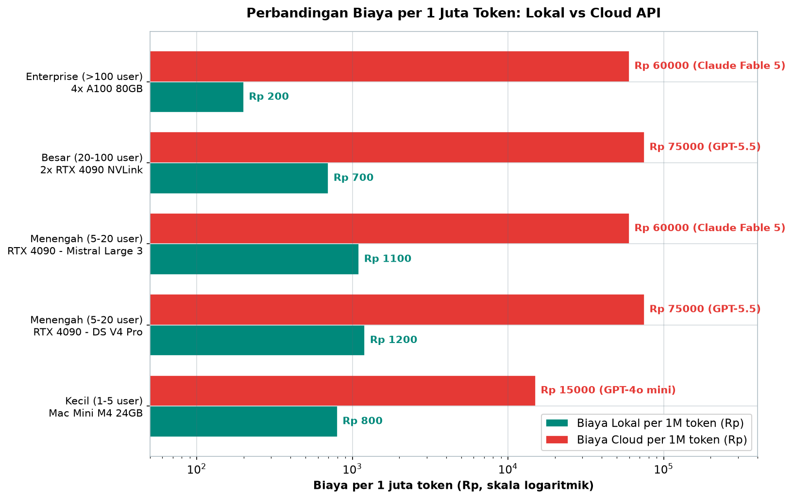
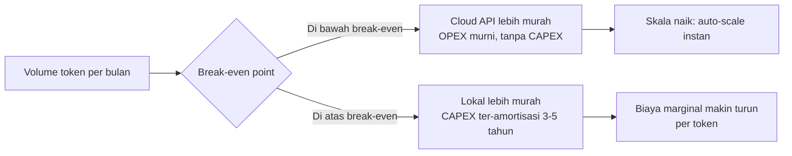
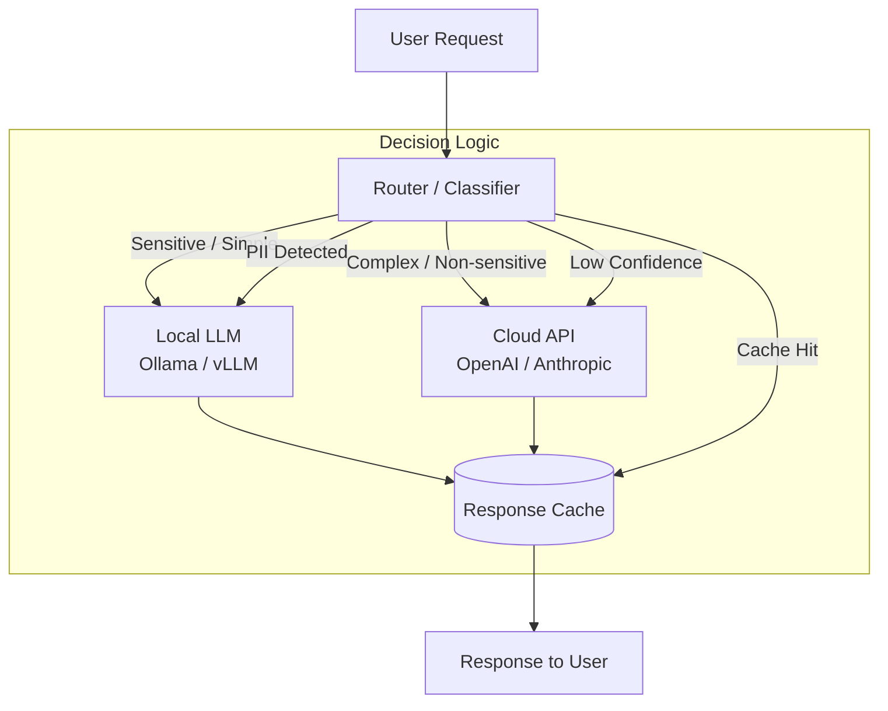
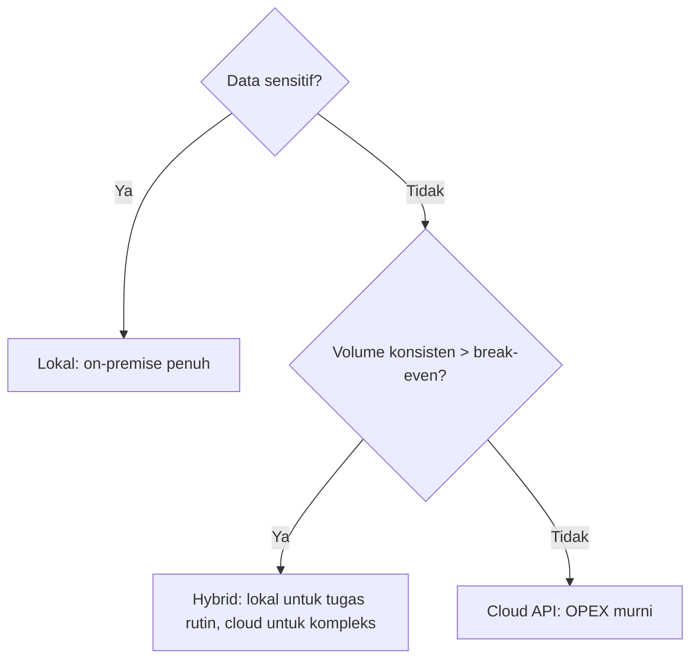

# Bab 10.4: Local vs Cloud

> Ketika kualitas model *open-weight* sudah menyentuh kelas *proprietary*, pertanyaan "model mana yang terbaik" perlahan tergantikan oleh pertanyaan yang lebih membumi: *di mana* model itu seharusnya berjalan? Apakah di hardware milik sendiri, di API cloud, atau di keduanya sekaligus? Sub-bab ini membedah trade-off biaya, privasi, latency, dan kualitas antara **local LLM** dan **cloud API**, menuntun Anda menemukan titik *break-even*, merancang arsitektur **hybrid** yang hemat, sampai menutupnya dengan kerangka keputusan siap pakai untuk profil bisnis Anda.

---

## 1. Tujuan Sub-Bab


Setelah membaca sub-bab ini, Anda akan mampu:

- Menganalisis trade-off biaya, privasi, latency, dan kualitas antara *local*, *cloud*, dan *hybrid* deployment LLM
- Menentukan *threshold* kapan deployment lokal lebih ekonomis daripada cloud API melalui analisis *break-even*
- Merancang arsitektur hybrid yang mengoptimalkan biaya tanpa mengorbankan kualitas output
- Mengevaluasi faktor keputusan: *compliance*, sensitivitas data, *user concurrency*, dan anggaran
- Menyusun klasifikasi data berjenjang, pipeline *anonymization*, dan *audit log* untuk skenario hybrid yang aman (UU PDP)

---

## 2. Tiga Pilar Deployment LLM


### Model Lokal (On-premise): Kontrol Penuh, Biaya Di Muka

**Deployment lokal** berarti LLM berjalan di hardware milik Anda sendiri — laptop workstation, server GPU di kantor, atau *edge device*. Keunggulan pertamanya adalah *kontrol penuh*: Anda bebas memilih model, versi, *quantization*, dan kebijakan keamanan tanpa campur tangan pihak ketiga. Privasi menjadi maksimal karena data tidak pernah meninggalkan perimeter jaringan Anda — sebuah keuntungan krusial saat berhadapan dengan data pasien, kontrak, atau catatan keuangan. Konsekuensinya, biaya awal (CAPEX) menjadi tinggi: Anda harus membeli GPU, server, *cooling*, dan membayar listrik serta tim *maintenance*. Model-model *open-weight* unggulan era 2026 — **DeepSeek V4 Pro** (49B aktif dari 1,6T total, context 1M), **Mistral Large 3** (41B aktif, 256K context, multimodal), hingga **Qwen3.7-Max** — membuat jalur ini semakin menarik karena kualitasnya mendekati model *proprietary* tanpa biaya per token.

### Cloud API: Skalabilitas Tanpa Batas, Kualitas Tertinggi

**Cloud API** adalah model distribusi klasik: Anda membayar per token dan menyerahkan urusan infrastruktur kepada *provider* seperti OpenAI, Anthropic, atau Google. Tidak ada CAPEX, skala naik-turun instan mengikuti *traffic*, dan kualitas model tetap menjadi yang tertinggi — **GPT-5.5**, **Claude Fable 5**, dan **Gemini 2.5 Pro** masih memimpin untuk tugas *creative writing* dan *reasoning* kompleks. Di sisi lain, biaya bulanan (OPEX) berbentuk per-token dan bisa melonjak seiring volume; data Anda dikirim keluar jaringan; dan latency harus berbagi ruang dengan jaringan internet. Untuk *startup* yang belum punya modal besar atau yang mengalami *traffic spike*, jalur ini adalah batu loncatan paling murah.

### Hybrid: Keseimbangan Optimal

**Arsitektur hybrid** menggabungkan keduanya secara sadar: model lokal melayani tugas sederhana dan data sensitif, model cloud menangani tugas kompleks yang membutuhkan kualitas tertinggi. Inilah *sweet spot* untuk perusahaan menengah-besar — biaya terkendali, privasi terjaga, dan kualitas tidak pernah diturunkan. Sebuah *router* atau *classifier* di depan sistem memutuskan ke mana setiap permintaan dikirim, dan mekanisme *fallback* menjamin layanan tetap berjalan meskipun salah satu sisi gagal. Sebagian besar isi sub-bab ini berfokus pada bagaimana membangun pola hybrid yang benar.

### Konteks Indonesia: Listrik, Bandwidth, dan Regulasi

Keputusan deployment di Indonesia memiliki karakteristik khusus. Biaya listrik berada di kisaran **Rp 1.500-2.500/kWh**, cukup rendah untuk membuat server lokal ekonomis bila dimanfaatkan penuh, tetapi bandwidth internet yang bervariasi antar wilayah menambah latency cloud secara tidak merata. Regulatori menjadi penentu: **UU PDP** (Undang-Undang Pelindungan Data Pribadi, UU No. 27 Tahun 2022) — khususnya pasal-pasal terkait perlindungan data — mewajibkan pengendali data menjaga kerahasiaan dan keamanan data pribadi, sehingga data sensitif umumnya *wajib* diproses lokal atau dengan mekanisme yang terdokumentasi (misalnya *Data Processing Agreement*/DPA) bila memakai pihak ketiga.

### Tabel A1: Model Open-Weight Terbaru untuk Deployment Lokal

Argumen "model lokal kualitasnya jadul" sudah gugur. Tabel berikut membandingkan enam model *open-weight* terdepan yang mengubah kalkulasi *local deployment* di tahun 2026.

| Model | Parameter (Aktif) | Context | VRAM (Q4) | SWE-bench | Lisensi | Keunggulan |
|:---|:---:|:---:|:---:|:---:|:---:|:---|
| **DeepSeek V4 Pro** | 49B (1.6T total) | 1M | ~32 GB | **80.6%** | MIT | Open-weight terkuat, agentic |
| **DeepSeek V4 Flash** | 13B (284B total) | 1M | ~10 GB | — | MIT | Efisien, context besar |
| **Mistral Large 3** | 41B (675B total) | 256K | ~28 GB | — | Apache 2.0 | Multimodal, granular MoE |
| **Qwen3.7-Max** | ~40B (MoE) | 1M | ~28 GB | — | Proprietary | Agent-centric, tool calling |
| **Ministral 3 (8B)** | 8B (dense) | 128K | ~6 GB | — | Apache 2.0 | Edge-friendly, Cascade Distillation |
| **Llama 4 Scout** | 17B (109B total) | 10M | ~35 GB | — | Llama Community | Context terbesar (10M) |

Dua hal penting dari Tabel A1. Pertama, **DeepSeek V4 Pro** dengan VRAM Q4 hanya ~32 GB — muat di satu RTX 4090 — sekaligus membawa context 1M dan SWE-bench 80.6%: kombinasi yang secara langsung menantang dominasi cloud untuk beban kerja *agentic coding*. Kedua, spektrum ukuran sangat lebar: dari **Ministral 3** yang hanya butuh ~6 GB (komputer laptop sekalipun) hingga **Llama 4 Scout** dengan context 10 juta token. Dengan lisensi permisif (MIT/Apache 2.0), tidak ada lagi alasan regulasi yang menghambat adopsi lokal.


---

## 3. Faktor Keputusan: Analisis Multi-Dimensi


### Privasi & Kepatuhan

Faktor pertama dan sering kali paling menentukan adalah **privasi & kepatuhan**. Data medis, legal, dan finansial kategori sensitif *wajib* berjalan lokal — mengirimkan riwayat kesehatan pasien atau saldo nasabah ke API pihak ketiga adalah pelanggaran kepatuhan yang berisiko sanksi pidana di bawah UU PDP. Pertanyaannya bukan "apakah provider cloud menyimpan data", melainkan "apakah Anda dapat membuktikan kontrol penuh atas sirkulasi data tersebut kepada regulator". Jika jawabannya tidak, maka *local deployment* bukan lagi pilihan, melainkan keharusan. Untuk data non-sensitif, cloud dapat digunakan dengan *Data Processing Agreement* sebagai jembatan kepatuhan.

### Latency

Kebutuhan *latency* membagi workload menjadi dua kutub. Aplikasi *real-time* — chat assistant, *autocomplete* kode, transaksi — menuntut respons di bawah **500 ms**; di kutub ini lokal hampir selalu menang karena tidak ada perjalanan jaringan. Sebaliknya, *batch processing* — analisis ribuan dokumen semalam, *report generation* — toleran terhadap delay, sehingga cloud yang lebih murah per token bisa menjadi pilihan utama. Prinsipnya sederhana: *interactive workload jalan di lokal, batch workload boleh ke cloud*.

### Kualitas Output

Selama bertahun-tahun, kualitas menjadi alasan utama orang memilih cloud. Namun jaraknya menyempit drastis. **DeepSeek V4 Pro** — *open-weight* berlisensi MIT — mencatat **SWE-bench 80.6%** untuk tugas *agentic coding*, mendekati model *proprietary* terbaik dengan biaya lokal *nol rupiah per token*. Mistral Large 3 menawarkan multimodal native, dan Qwen3.7-Max unggul dalam *tool calling*. Kualitas cloud (GPT-5.5, Claude Fable 5) masih unggul untuk *creative writing* dan *reasoning* yang sangat kompleks, tetapi untuk sebagian besar kebutuhan operasional — summarization, coding, Q&A dokumen — model lokal sudah "cukup baik". Keputusan kualitas kini bergeser dari "mana yang terbaik" menjadi "mana yang terbaik untuk tugas ini".

### Biaya

Faktor biaya adalah inti matematis sub-bab ini: membandingkan **CAPEX** (pembelian hardware) dan **OPEX** (listrik, *maintenance*, token API) untuk menemukan *break-even point* — volume token bulanan di mana biaya lokal dan cloud berpotongan. Detailnya dibahas menyeluruh di Seksi 4. Prinsip awalnya: cloud murah di volume kecil karena nol investasi, lokal murah di volume besar karena biaya marginal per token mendekati nol.

### Skalabilitas

*Traffic spike* adalah musuh server lokal: 50 pengguna tiba-tiba pada jam promo akan membuat GPU lokal kehabisan napas dalam hitungan detik. Cloud unggul di sini dengan *auto-scaling* tanpa batas. Sebaliknya, *traffic* yang stabil dan dapat diprediksi adalah wilayah lokal — kapasitas yang terpasang langsung tercermin dalam utilisasi yang konsisten, tanpa khawatir lonjakan tagihan.

### Keandalan

Keandalan mengikuti pola simetris. Lokal menggantungkan diri pada hardware sendiri: satu PSU rusak atau mati listrik bisa mematikan layanan. Cloud menawarkan **SLA 99.9%+** dengan redundansi antar *availability zone*. Namun keandalan lokal bisa "dibeli" dengan redundansi internal (GPU cadangan, UPS) — keputusan yang kembali lagi ke kalkulasi biaya. Arsitektur hybrid secara alami meningkatkan keandalan total: jika lokal mati, cloud menangkap beban, dan sebaliknya.

---

## 4. Analisis Biaya: CAPEX vs OPEX


### Menghitung Biaya Lokal

Biaya lokal bukan sekadar harga GPU. Komponen lengkapnya: **hardware** (GPU/server), **listrik** (di Indonesia sekitar Rp 1.500-2.500/kWh), **pendingin** ruangan server, **maintenance** (tim internal atau kontrak vendor), dan **depresiasi** hardware 3-5 tahun. Sebuah server mini dengan Mac Mini M4 Pro 48GB + Ollama bisa dimulai dari puluhan juta rupiah; konfigurasi 2x RTX 4090 NVLink untuk skala menengah-besar sekitar Rp 90 juta; dan klaster enterprise 4x A100 80GB bisa menyentuh miliaran rupiah. Kuncinya adalah meng-amortisasi seluruh CAPEX ke biaya bulanan, lalu membaginya dengan volume token — barulah terlihat biaya lokal per 1 juta token yang bisa sangat rendah: dari kisaran Rp 200-1.200 per juta token tergantung skala.

### Menghitung Biaya Cloud

Biaya cloud lebih mudah dihitung karena transparan: **harga per-token** dari API, ditambah *throughput commitment* (jika ada) dan *data transfer*. OpenAI mematok GPT-4o mini di kisaran **Rp 15.000 per juta token**, sementara model frontier seperti **GPT-5.5** dan **Claude Fable 5** berada di kisaran **Rp 60.000-75.000 per juta token**. Tanpa volume yang besar, angka ini nyaman; dengan 100 juta token per bulan, tagihan cloud bisa menembus puluhan hingga ratusan juta rupiah per bulan.

### Konsep Break-even

**Break-even point** adalah volume token bulanan di mana kurva biaya kumulatif lokal (CAPEX ter-amortisasi + OPEX) menyilang kurva cloud (OPEX murni). Di bawah titik itu, cloud lebih murah; di atasnya, lokal menang — dan selisihnya melebar seiring waktu karena biaya marginal lokal terus menurun. Estimasi umum model dan hardware berbagai kelas: **5-20 juta token/bulan**. Contoh konkret: Mac Mini M4 Pro 48GB + Ollama melawan API GPT-4o mini memiliki *break-even* sekitar **8 juta token/bulan** — volume yang cukup masuk akal untuk tim 10-20 orang yang aktif memakai LLM setiap hari kerja. Tabel B di Seksi 5 merinci perhitungan ini untuk lima profil ukuran organisasi.

### Tabel B: Break-even Analysis — Local vs Cloud dengan Model Terbaru

Inilah inti matematis keputusan deployment. Tabel ini membandingkan biaya lokal dan cloud — dengan asumsi depresiasi 3 tahun dan harga listrik Rp 1.500/kWh — untuk lima profil organisasi.

| Skenario | Hardware | Model Lokal | CAPEX | Biaya/1M Token (local) | Biaya/1M Token (cloud) | Break-even (token/bulan) |
|:---|:---|:---|:---:|:---:|:---:|:---:|
| **Kecil (1-5 user)** | Mac Mini M4 24GB | DS V4 Flash (13B) | Rp 20jt | Rp 800 | Rp 15.000 (GPT-4o mini) | ~1.4M |
| **Menengah (5-20 user)** | PC RTX 4090 24GB | DS V4 Pro (49B Q4) | Rp 45jt | Rp 1.200 | Rp 75.000 (GPT-5.5) | ~610K |
| **Menengah (5-20 user)** | PC RTX 4090 24GB | Mistral Large 3 (41B Q4) | Rp 45jt | Rp 1.100 | Rp 60.000 (Claude Fable 5) | ~765K |
| **Besar (20-100 user)** | 2x RTX 4090 NVLink | DS V4 Pro + V4 Flash | Rp 90jt | Rp 700 | Rp 75.000 (GPT-5.5) | ~1.2M |
| **Enterprise (>100 user)** | 4x A100 80GB | DS V4 Pro + Mistral L3 | Rp 2,5 miliar | Rp 200 | Rp 60.000 (Claude Fable 5) | ~42K |
| **Catatan:** | Estimasi 3 tahun depresiasi | | | Rp/kWh = 1.500 | Harga API | Semakin besar volume, semakin murah lokal |



*Gambar 10.4-1 — Perbandingan biaya per 1 juta token lokal vs cloud untuk lima profil organisasi (skala logaritmik). Gap 300x pada profil enterprise (Rp 200 vs Rp 60.000) membuat break-even tercapai hanya dalam ribuan token per bulan, sedangkan profil kecil menghadapi gap 18x yang memerlukan ~1,4 juta token.*

Perhatikan dua *insight* kunci. Pertama, **volume menentukan pemenang**: satu tim kecil dengan 200 ribu token/bulan (sekitar 10 ribu percakapan) tidak akan pernah *break-even* — cloud tetap menang; tetapi organisasi besar yang memproses 50 juta token/bulan *harus* beralih ke lokal, karena penghematannya mencapai puluhan juta rupiah per bulan. Kedua, **jarak harga per token menentukan kecepatan *break-even***: maskot yang paling cepat balik modal adalah konfigurasi enterprise (volume tinggi + biaya lokal per token yang sangat rendah Rp 200 vs cloud Rp 60.000) — gap 300x yang membuat *break-even* tercapai hanya dalam hitungan ribuan token per bulan. Angka-angka ini sensitif terhadap asumsi — harga listrik, harga GPU, dan harga API berubah seiring waktu — sehingga sebelum keputusan besar, jalankan ulang kalkulator *break-even* di Tutorial B dengan harga pasar terkini.


### Gambar 2: Dinamika Break-even

Grafik *break-even* sesungguhnya adalah dua garis pada sumbu yang sama — x adalah volume token/bulan (skala log), y adalah biaya kumulatif dalam rupiah — di mana garis lokal (CAPEX + OPEX, dimulai tinggi karena investasi awal) dan garis cloud (OPEX murni, dimulai dari nol tetapi curam) berpotongan di titik *break-even*. Diagram konseptual berikut menangkap arah kedua kurva tersebut.



Inti dari gambar ini: *break-even* bukan satu titik statis, melainkan **keadaan yang bergeser** seiring depresiasi (semakin tua hardware, semakin murah biaya lokal per bulan, sehingga garis lokal turun dan *break-even* maju ke kiri) dan seiring skala (semakin besar volume bulanan, semakin jauh Anda berada di kanan titik potong — wilayah keunggulan lokal). Untuk volume di kiri titik potong, cloud tetap rasional meskipun kualitas lokal sudah setara: membayar mahal untuk infrastruktur yang menganggur adalah pemborosan yang sama buruknya dengan membayar token berlebih.


---

## 5. Arsitektur Hybrid Optimal


### Routing Logic

Jantung arsitektur hybrid adalah **routing logic** — aturan yang menentukan ke mana setiap permintaan dikirim. Dua dimensi utama: *sensitivitas data* (jika mengandung PII atau data rahasia → lokal) dan *kompleksitas tugas* (jika menuntut *reasoning* mendalam → cloud). Aturan ini bisa sederhana — daftar kata kunci seperti "saldo", "diagnosis", "NIK" — atau berbasis *classifier* yang dilatih khusus, seperti pendekatan unified routing yang diusulkan Wang et al. [5]. Local-first adalah pola default paling aman: kirim ke lokal dulu, dan hanya jika lokal ragu (skor *confidence* rendah), tugas diteruskan ke cloud.

### Local-First Approach

Prinsip **local-first** menjawab pertanyaan "kapan pindah ke cloud?" — bukan "kapan pakai lokal?". Semua permintaan berangkat dari model lokal; model cloud adalah *escalation path*. Keuntungannya ganda: mayoritas permintaan (estimasi 80%+) terlayani tanpa biaya token, dan data sensitif hampir tidak pernah keluar jaringan karena sistem "default aman". Model lokal modern cukup mampu memberi *confidence score* untuk memutuskan kapan harus *escalate* — misalnya saat jawaban mengandung permintaan klarifikasi, atau saat token yang dihasilkan berputar tanpa arah.

### Framework Hybrid

Membangun router sendiri dari nol bisa mahal; gunakan *framework* yang sudah matang. **LiteLLM** menyediakan *proxy* dengan routing dan *fallback* antar ratusan model — lokal dan cloud dalam satu antarmuka OpenAI-compatible. **OpenRouter** adalah agregator API yang memungkinkan *fallback strategy* antar *provider cloud* secara virtual. Keduanya bisa dikombinasikan: LiteLLM di depan (mengelola lokal + cloud), OpenRouter sebagai lapisan cadangan antar *provider*. Tutorial A di Seksi 8 memperlihatkan implementasi nyatanya.

### Teknik Offloading dari Riset

Riset 2024-2025 memperkaya pola hybrid dengan mekanisme *offloading* adaptif. **TMO** [1] memperkenalkan *offloading* inference lokal-cloud untuk setting *multi-modal, multi-task, multi-dialogue* — cocok untuk asisten yang menangani teks, gambar, dan percakapan bergantian. **MINIONS** [2] membangun kolaborasi hemat-biaya antara model *on-device* dan cloud melalui *task decomposition*: model kecil menyelesaikan subtask yang murah, dan hanya subtask sulit yang didelegasikan ke cloud. **ADASWITCH** [3] menggunakan agen adaptif untuk memutuskan *switching* lokal-cloud berdasarkan kondisi runtime — tepat untuk beban kerja yang berubah-ubah. Sementara itu, **HERA** [4] menunjukkan bahwa dengan *scheduler* edge-cloud yang cerdas, 45,67% subtask dapat diselesaikan di sisi lokal — penghematan biaya yang langsung terasa.

### Sinkronisasi Cache Respons

Satu trik yang sering dilupakan: **cache respons**. Pertanyaan yang identik atau serupa — "Bagaimana cara reset password?", prosedur refund, penjelasan kebijakan — sering diulang pengguna. Dengan men-cache respons cloud di penyimpanan lokal (keyed by hash prompt), permintaan berulang tidak perlu lagi mengeluarkan biaya token maupun latency jaringan. Pada sistem dengan 30-40% pertanyaan berulang, *response cache* saja bisa memangkas tagihan cloud hingga sepertiga.

### Tabel A: Perbandingan Local vs Cloud vs Hybrid

Tabel ini merangkum kontras tiga pilihan deployment dari sepuluh aspek yang dibahas di seksi sebelumnya — perhatikan bagaimana setiap kolom memiliki "harga" yang harus dibayar di kolom lainnya.

| Aspek | Local (On-premise) | Cloud API | Hybrid |
|:---|:---:|:---:|:---:|
| **Biaya Awal (CAPEX)** | Rp 30-250jt | Rp 0 | Rp 15-150jt |
| **Biaya Bulanan (OPEX)** | Rp 1-5jt (listrik) | Rp 5-100jt (token) | Rp 1-30jt |
| **Privasi Data** | Sangat Tinggi | Tergantung provider | Tinggi |
| **Kualitas Model** | Meningkat drastis (DS V4 Pro, Mistral Large 3) | Tertinggi (GPT-5.5, Fable 5) | Optimal |
| **Latency** | 50-500ms (lokal) | 500-3000ms (network) | 50-2000ms |
| **Skalabilitas** | Terbatas hardware | Unlimited | Sedang |
| **Maintenance** | Tinggi (tim internal) | None (provider) | Sedang |
| **Compliance (UU PDP)** | Mudah | Perlu DPA | Perlu DPA parsial |
| **Best For** | Data sensitif, traffic tetap | Startup, traffic spike | Perusahaan menengah-besar |
| **Model Open-Weight Unggulan** | DS V4 Pro (49B, 1M ctx), Mistral Large 3 (41B, 256K), Qwen3.7-Max | GPT-5.5, Claude Fable 5, Gemini 2.5 Pro | Kombinasi optimal |

Tabel A membuktikan bahwa tidak ada kolom yang menang mutlak. Cloud unggul di CAPEX, skalabilitas, dan kualitas; lokal unggul di privasi, latency, dan kepatuhan; hybrid mengambil tengah secara selektif — "Tinggi" untuk privasi, "Sedang" untuk skalabilitas — karena memang dirancang untuk meminimalkan kelemahan kedua sisi. Perhatikan juga baris *Best For*: pilihan deployment bukan soal mana yang "lebih canggih", melainkan mana yang sesuai profil *traffic* dan sensitivitas data Anda.


### Gambar 1: Arsitektur Hybrid Local-Cloud

Diagram berikut memetakan alur permintaan pada arsitektur hybrid: satu *router* menjadi gerbang tunggal, memisahkan lalu lintas sensitif/sederhana ke lokal dan kompleks/non-sensitif ke cloud, dengan *response cache* di tengah yang melayani permintaan berulang tanpa menyentuh keduanya.



Perhatikan *Decision Logic* di dalam *subgraph*: ini adalah tiga aturan yang sebenarnya menentukan perilaku sistem. *PII Detected* memaksa lalu lintas ke lokal apa pun kompleksitasnya — kepatuhan mengalahkan efisiensi. *Low Confidence* adalah *escalation path* yang mengizinkan lokal menyerah kepada cloud saat ragu. Dan *Cache Hit* memotong seluruh rantai komputasi untuk permintaan yang sudah pernah dijawab. Dengan ketiga aturan ini, sistem secara otomatis menjaga privasi (lokal menangani PII), kualitas (cloud menangkap kasus sulit), dan biaya (cache menekan volume token cloud).


---

## 6. Keamanan Data di Skenario Hybrid


### Klasifikasi Sensitivitas Data Berjenjang

Keamanan hybrid dimulai dari **klasifikasi data tiga tier**. *Tier 1*: data wajib lokal — PII, data medis, data transaksi finansial, rahasia dagang; tidak boleh keluar jaringan, apa pun alasannya. *Tier 2*: data yang boleh hybrid dengan *masking* — dapat dikirim ke cloud setelah PII di-*scrub*, hasilnya di-*re-identify* kembali di sisi lokal. *Tier 3*: data aman untuk cloud — pertanyaan produk, konten publik, edukasi. Klasifikasi ini harus tertanam di *router* (lihat Tutorial A), bukan sekadar kebijakan di kertas.

### Anonymization

Untuk tier 2, **anonymization** menjadi proses wajib: sebelum request dikirim ke cloud, seluruh PII — NIK, nomor telepon, email, nama — direduksi menjadi *placeholder* (misalnya `[NIK]`), dan setelah respons kembali, *placeholder* dipetakan ulang ke nilai asli. Teknik ini dikenal sebagai *scrub & re-identify*. Penting ditekankan: anonymization bukan pengganti menjaga data, melainkan lapisan pengaman tambahan — jika pun data bocor di sisi cloud, nilai yang bocor sudah tidak bermakna. Tutorial C memberikan implementasi lengkapnya.

### Enkripsi dan Zero-Trust

Koneksi antara lokal dan cloud wajib **TLS in-transit** dalam arsitektur *zero-trust*: setiap *request* diautentikasi dan diautorisasi secara eksplisit, tidak ada kepercayaan implisit terhadap jaringan internal. API key disimpan di *secret manager*, bukan di kode. Bagi organisasi yang lebih ketat, pertimbangkan *private endpoint* atau *VPC peering* ke region cloud tertentu agar lalu lintas tidak melintas internet publik sama sekali.

### Audit Log

Setiap *request* ke cloud **wajib tercatat** dalam *audit log*: *timestamp*, model yang dipakai, jumlah token input/output, klasifikasi tier data, dan hasil *anonymization*. Log ini bukan birokrasi — ia adalah bukti kepatuhan saat regulator atau auditor UU PDP datang. Dengan *audit log* yang rapi, organisasi bisa menunjukkan secara konkret: "data sensitif tidak pernah keluar; yang keluar hanya representasi yang sudah dianonimkan, sebanyak X juta token, pada jangka waktu berikut."

### Tabel C: Matriks Keputusan per Skenario

Matriks berikut menerjemahkan semua faktor di atas menjadi rekomendasi langsung untuk delapan skenario bisnis yang umum ditemui.

| Skenario | Privasi | Latency | Budget | Kualitas | Rekomendasi | Rasional |
|:---|:---:|:---:|:---:|:---:|:---|:---|
| **Chatbot medis (data pasien)** | Wajib | <2s | Sedang | Tinggi | **Lokal** (Llama 3 70B Q4) | UU PDP + kerahasiaan pasien |
| **CS ritel (non-PII)** | Rendah | <5s | Rendah | Sedang | **Cloud** (GPT-4o mini) | Biaya lebih murah, quality cukup |
| **Dokumen legal (kontrak)** | Tinggi | <10s | Tinggi | Sangat Tinggi | **Hybrid** (lokal + cloud review) | Data sensitif, tapi butuh quality |
| **Internal knowledge base** | Sedang | <3s | Sedang | Sedang | **Lokal** (Qwen 2.5 14B) | Cukup untuk dokumentasi internal |
| **AI coding assistant** | Rendah | <1s | Sedang | Sangat Tinggi | **Hybrid** (lokal DS V4 Pro + cloud Fable 5) | DS V4 Pro (SWE-bench 80.6%) kuat untuk coding lokal |
| **Multimodal (image analysis)** | Sedang | <5s | Tinggi | Tinggi | **Hybrid** (lokal Mistral Large 3 + cloud Gemini 2.5) | Mistral Large 3 multimodal native |
| **Agentic workflow multi-step** | Sedang | <5s | Sedang | Sangat Tinggi | **Lokal** (DS V4 Pro 1M context) | 1M context + agentic benchmark tertinggi open-source |
| **Edge/IoT device** | Sedang | <1s | Rendah | Sedang | **Lokal** (Ministral 3 8B) | Cascade Distillation, 6GB VRAM cukup |

Pola yang muncul konsisten: semakin tinggi kolom *Privasi* dan semakin ketat *Latency*, semakin kuat arah ke **Lokal**; semakin rendah *Budget* dan semakin tinggi *Kualitas* yang dituntut, semakin besar godaan **Cloud** — dan **Hybrid** adalah jawaban ketika dua sumbu itu bertabrakan (legal, coding, multimodal). Perhatikan juga bahwa "lokal" tidak lagi identik dengan model kecil: *agentic workflow* multi-step direkomendasikan berjalan sepenuhnya di DeepSeek V4 Pro dengan context 1M — kelas yang lima tahun lalu mustahil dibayangkan *on-premise*.

---


---

## 7. Rekomendasi per Profil Bisnis


Setiap profil organisasi memiliki titik keseimbangan yang berbeda. *Startup* kecil dengan satu-dua developer dan volume rendah memulai dari cloud murah (GPT-4o mini) karena CAPEX nol dan risiko teknis minimal. *UKM* dengan 5-20 pengguna rutin mulai menarik manfaat dari satu mesin lokal (RTX 4090) untuk beban rutin, dengan cloud sebagai *fallback* kualitas. *Perusahaan menengah* dengan puluhan hingga ratusan pengguna adalah kandidat kuat arsitektur hybrid penuh: lokal untuk volume + PII, cloud untuk kualitas + *spike*. *Enterprise* dengan >100 pengguna dan kebutuhan kepatuhan tinggi (bank, rumah sakit) berjalan hampir sepenuhnya lokal dengan klaster GPU kelas A100, menggunakan cloud hanya untuk tugas yang benar-benar membutuhkan model frontier. Matriks lengkapnya — termasuk delapan skenario spesifik dari chatbot medis hingga perangkat *edge* — dapat dilihat pada **Tabel C** di Seksi 5.

### Gambar 3: Decision Tree Pemilihan Deployment

Jika Anda hanya mengingat satu bagian dari sub-bab ini, ingatlah diagram keputusan berikut — tiga pertanyaan berurutan yang menuntun ke salah satu dari tiga pilar deployment.



Dua pertanyaan, tiga jawaban. Pertanyaan pertama menegakkan kepatuhan — data sensitif tidak pernah ditawar. Pertanyaan kedua melakukan kalkulasi — seberapa besar volume Anda relatif terhadap titik *break-even* pada Tabel B. Jika volume di bawah *break-even*: cloud, selesai, tidak perlu membeli hardware. Jika di atas: hybrid, karena lokal menanggung volume rutin yang murah sementara cloud menjaga kualitas untuk kasus kompleks dan *spike* yang sesekali datang.

---


---

## 8. Praktikum: Membangun Router Hybrid


### Langkah 1: Setup Hybrid Router dengan LiteLLM

Tutorial ini membangun *router hybrid* minimal: permintaan berangkat ke model lokal (Ollama) dengan *fallback* otomatis ke cloud ketika lokal gagal. Install LiteLLM terlebih dahulu dengan `pip install litellm`, lalu simpan skrip berikut sebagai `hybrid_router.py`.

```python
# hybrid_router.py — Router hybrid: lokal dulu, fallback ke cloud jika perlu
import litellm
from litellm import Router

# 1. Konfigurasi model pool
model_list = [
    {
        "model_name": "gpt-4o-mini",  # Cloud fallback
        "litellm_params": {
            "model": "gpt-4o-mini",
            "api_key": "sk-...",
        }
    },
    {
        "model_name": "llama-local",  # Local Ollama
        "litellm_params": {
            "model": "ollama/llama3.1:8b",
            "api_base": "http://localhost:11434",
        }
    }
]

router = Router(model_list=model_list)

def classify_query(query: str) -> str:
    """Klasifikasi sederhana: apakah query mengandung data sensitif?"""
    sensitive_patterns = [
        "nik", "ktp", "alamat", "nomor telepon", "rekening",
        "password", "medical record", "diagnosis"
    ]
    query_lower = query.lower()
    for pattern in sensitive_patterns:
        if pattern in query_lower:
            return "llama-local"
    return "llama-local"  # local first

# 2. Routing logic
def hybrid_completion(query: str):
    model = classify_query(query)
    try:
        response = router.completion(
            model=model,
            messages=[{"role": "user", "content": query}]
        )
        return response["choices"][0]["message"]["content"]
    except Exception as e:
        # Fallback ke cloud jika lokal error
        print(f"Local failed ({e}), falling back to cloud...")
        response = router.completion(
            model="gpt-4o-mini",
            messages=[{"role": "user", "content": query}]
        )
        return response["choices"][0]["message"]["content"]

# Uji
print(hybrid_completion("Apa ibu kota Indonesia?"))
print(hybrid_completion("NIK saya 1234567890, validasi data"))
```

Perhatikan dua desain penting. Pertama, fungsi `classify_query` mengembalikan `"llama-local"` di kedua cabang — ini implementasi *local-first* yang disengaja: daftar pola sensitif hanya untuk keamanan, bukan untuk memilih cloud. Kedua, `try/except` adalah *fallback*: jika Ollama mati atau GPU kehabisan memori, permintaan otomatis diarahkan ke cloud sehingga layanan tidak pernah terputus. Untuk produksi, ganti daftar pola statis dengan *classifier* berbasis model kecil atau layanan PII-detection.

### Langkah 2: Menghitung Break-even Point

Kalkulator berikut menurunkan *break-even point* langsung dari tiga angka masukan: CAPEX hardware, biaya lokal per token, dan biaya cloud per token. Simpan sebagai `breakeven.py` dan jalankan untuk profil organisasi Anda sendiri.

```python
# breakeven.py — Hitung break-even point local vs cloud
def calculate_breakeven(
    hardware_cost: float,      # CAPEX hardware (Rp)
    local_cost_per_token: float,  # Rp per token (listrik + maintenance)
    cloud_cost_per_token: float,  # Rp per token (API pricing)
    months: int = 36           # Depresiasi (bulan)
):
    """Hitung break-even point dalam token per bulan."""
    monthly_hw_cost = hardware_cost / months

    # Break-even: monthly_hw_cost + tokens * local = tokens * cloud
    # tokens * (cloud - local) = monthly_hw_cost
    # tokens = monthly_hw_cost / (cloud - local)

    savings_per_token = cloud_cost_per_token - local_cost_per_token
    if savings_per_token <= 0:
        return "Tidak break-even: cloud lebih murah per token"

    tokens_break_even = monthly_hw_cost / savings_per_token
    return {
        "break_even_tokens_per_month": int(tokens_break_even),
        "break_even_tokens_per_day": int(tokens_break_even / 30),
        "monthly_hw_cost": monthly_hw_cost,
        "savings_per_token": savings_per_token,
        "months_to_break_even": months,
    }

# Contoh: Mac Mini M4 Pro 48GB (Rp 35jt) vs GPT-4o mini
result = calculate_breakeven(
    hardware_cost=35_000_000,
    local_cost_per_token=0.0012,   # Rp 1.2/token (listrik + Ollama)
    cloud_cost_per_token=0.015,    # Rp 15/token (GPT-4o mini)
    months=36
)
print(f"Break-even: {result['break_even_tokens_per_month']:,} token/bulan")
# Output: ~882.000 token/bulan
```

Logika di balik kalkulator ini membentuk `monthly_hw_cost + token × local = token × cloud`, yang disederhanakan menjadi `token = monthly_hw_cost / (cloud - local)`. Uji sensitivitasnya: naikkan biaya listrik (Rp 2.500/kWh), atau bandingkan dengan GPT-5.5 (Rp 75.000/juta token) — Anda akan melihat *break-even* bergeser drastis, membuktikan bahwa keputusan deployment harus dihitung ulang setiap kali asumsi berubah. Amati juga *guard* `if savings_per_token <= 0` — ia mengingatkan bahwa di skala mikro, cloud *memang* lebih murah, dan tidak ada rasa malu untuk tetap di cloud.

### Langkah 3: Pipeline Anonymization untuk Hybrid

Langkah terakhir melengkapi sisi keamanan: *scrub* PII sebelum data tier 2 dikirim ke cloud, dan *re-identify* setelah respons kembali. Simpan sebagai `anonymize.py`.

```python
# anonymize.py — Anonimisasi data sensitif sebelum kirim ke cloud
import re

def anonymize_pii(text: str) -> str:
    """Scrub PII dari teks sebelum dikirim ke cloud API."""
    patterns = {
        "NIK": r"\b\d{16}\b",
        "EMAIL": r"\b[A-Za-z0-9._%+-]+@[A-Za-z0-9.-]+\.[A-Z|a-z]{2,}\b",
        "PHONE": r"\b(\+62|0)8[1-9][0-9]{7,11}\b",
        "NAMA": r"\b([A-Z][a-z]+)\s([A-Z][a-z]+)\b",  # Sederhana
    }

    masked = text
    for label, pattern in patterns.items():
        masked = re.sub(pattern, f"[{label}]", masked)

    return masked

def deanonimize(masked_text: str, original_map: dict) -> str:
    """Kembalikan data yang sudah dianonimisasi (untuk response)."""
    result = masked_text
    for placeholder, original in original_map.items():
        result = result.replace(placeholder, original)
    return result

# Uji
original = "Nama saya Budi Santoso, NIK 3174051234567890, email budi@email.com"
anonymized = anonymize_pii(original)
print(f"Original:   {original}")
print(f"Anonymized: {anonymized}")
# Output: Nama saya [NAMA] [NAMA], NIK [NIK], email [EMAIL]
```

Versi sederhana ini cukup untuk memahami pola; untuk produksi, lengkapi dengan pemetaan `placeholder → nilai asli` yang disimpan aman di sisi lokal (itulah `original_map` pada fungsi `deanonimize`, yang dalam contoh di atas perlu dibangun bersama proses *masking*), dan perkuat pola *regex* NAMA agar tidak menangkap kata umum. Ingat aturan praktisnya: **yang keluar jaringan hanya teks yang sudah tidak bermakna, dan hanya untuk data tier 2** — data tier 1 tidak pernah melewati fungsi ini karena tidak akan pernah dikirim ke cloud.

---

## 9. Studi Kasus: Bank Digital — Hybrid Deployment untuk Customer Service


**Skenario.** Sebuah bank digital dengan 1 juta nasabah ingin menghadirkan asisten AI untuk *customer service* 24/7. Tiga persyaratan mengikat: (1) semua data transaksi *wajib* diproses lokal sesuai UU PDP, (2) pertanyaan umum boleh berjalan hybrid, dan (3) latency rata-rata harus di bawah 2 detik. Dengan 1 juta nasabah, perkiraan lalu lintas awal adalah puluhan ribu pertanyaan per hari — terlalu mahal jika semuanya dilempar ke cloud *frontier*.

**Analisis pilihan.** Opsi cloud-only dihitung Rp 45 juta/bulan — mayoritas dari percakapan rutin ("cek saldo", "cara transfer", "status mutasi") yang sebenarnya tidak memerlukan model frontier. Opsi lokal murni dianggap gagal untuk pertanyaan *educative* yang membutuhkan kualitas penjelasan tinggi. Keputusan jatuh pada **hybrid**: kelas pertanyaan ditentukan oleh isi, bukan oleh jenis pengguna.

**Langkah solusi.**

- **Lokal:** 2x RTX 4090 (NVLink) + vLLM melayani Llama 3.1 70B Q3_K_M untuk query transaksi dan data nasabah — data sensitif tidak pernah meninggalkan jaringan bank.
- **Cloud:** GPT-4o untuk pertanyaan produk, edukasi keuangan, dan informasi umum — tidak ada PII di dalamnya.
- **Router:** klasifikasi otomatis berbasis kata kunci — query mengandung "saldo", "transfer", "mutasi" → lokal; lainnya → cloud.
- **Anonymization:** seluruh PII di-*scrub* sebelum request ke cloud, dan respons di-*re-identify* kembali di sisi lokal.

**Hasil.** Biaya: CAPEX Rp 90 juta (2x RTX 4090) + cloud sekitar Rp 15 juta/bulan — dibandingkan cloud-only sekitar Rp 45 juta/bulan, **penghematan 67%** pada OPEX, dengan investasi awal yang balik modal dalam hitungan bulan. Distribusi trafik: **82% dilayani lokal, 18% cloud** — konsisten dengan temuan riset bahwa mayoritas subtask dapat diselesaikan di sisi lokal. Latency rata-rata: lokal 800 ms, cloud 1,5 s — keduanya di bawah batas 2 detik. Kepatuhan UU PDP tercapai 100% dengan *audit log* yang mencatat setiap request cloud.

**Pelajaran.** Kunci keberhasilan bukan pada memilih model terbaik, melainkan pada *routing* yang benar: memisahkan 82% pertanyaan rutin berbiaya nol dari 18% pertanyaan yang memang membutuhkan cloud. Disiplin *anonymization* dan *audit log* mengubah hybrid dari keputusan teknis menjadi keputusan kepatuhan yang dapat dipertanggungjawabkan kepada regulator.

---

## 10. Referensi


### Paper Jurnal/Konferensi

[1] Li, Y., et al. (2025). *TMO: Local-Cloud Inference Offloading for LLMs in Multi-Modal, Multi-Task, Multi-Dialogue Settings*. arXiv preprint arXiv:2502.11007. DOI: [10.48550/arXiv.2502.11007](https://arxiv.org/abs/2502.11007)

[2] Narayan, S., et al. (2025). *Cost-efficient Collaboration between On-device and Cloud Language Models*. Proceedings of the 42nd International Conference on Machine Learning (ICML). DOI: [10.48550/arXiv.2502.05226](https://arxiv.org/abs/2502.05226). URL: [https://proceedings.mlr.press/v267/narayan25a.html](https://proceedings.mlr.press/v267/narayan25a.html)

[3] Li, J., et al. (2024). *ADASWITCH: Adaptive Switching between Local and Cloud LLMs*. arXiv preprint arXiv:2410.13181. DOI: [10.48550/arXiv.2410.13181](https://arxiv.org/abs/2410.13181)

[4] Nguyen, D., et al. (2025). *HERA: Hybrid Edge-cloud Resource Allocation for Cost-Efficient AI Agents*. arXiv preprint arXiv:2504.00434. DOI: [10.48550/arXiv.2504.00434](https://arxiv.org/abs/2504.00434)

[5] Wang, Z., et al. (2025). *Bridging On-Device and Cloud LLMs for Collaborative Reasoning: A Unified Methodology for Local Routing and Post-Training*. arXiv preprint arXiv:2509.24050. DOI: [10.48550/arXiv.2509.24050](https://arxiv.org/abs/2509.24050)

[6] DeepSeek-AI. (2026). *DeepSeek-V4: A Next-Generation Open-Source Mixture-of-Experts Language Model*. arXiv preprint arXiv:2604.00001. DOI: [10.48550/arXiv.2604.00001](https://arxiv.org/abs/2604.00001)

### Referensi Pendukung (Dokumentasi/Repository)

[7] Mistral AI. (2025). *Ministral 3: Cascade Distillation for Efficient Edge Language Models*. [https://mistral.ai/news/ministral-3](https://mistral.ai/news/ministral-3)

[8] Ollama. *GitHub Repository*. [https://github.com/ollama/ollama](https://github.com/ollama/ollama)

[9] LiteLLM. *Documentation*. [https://docs.litellm.ai](https://docs.litellm.ai)

[10] OpenAI. *API Pricing*. [https://openai.com/pricing](https://openai.com/pricing)

[11] vLLM. *Documentation*. [https://docs.vllm.ai](https://docs.vllm.ai)

[12] OpenRouter. *API Routing*. [https://openrouter.ai](https://openrouter.ai)
