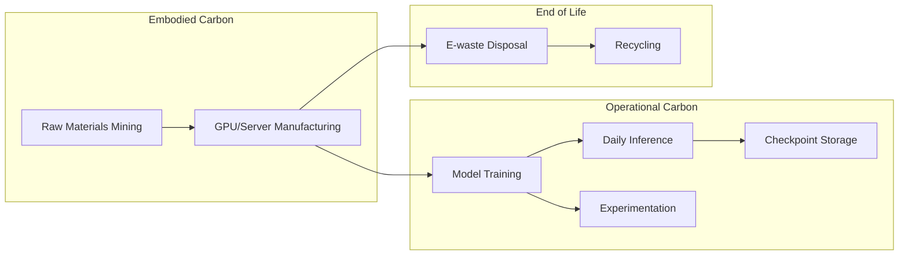
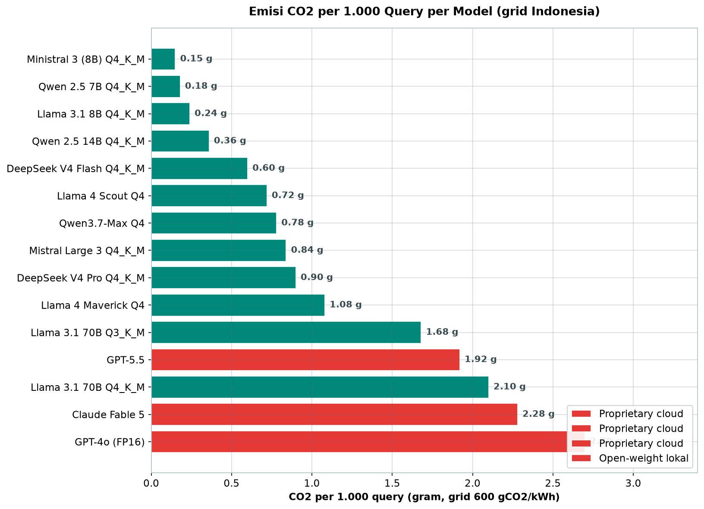
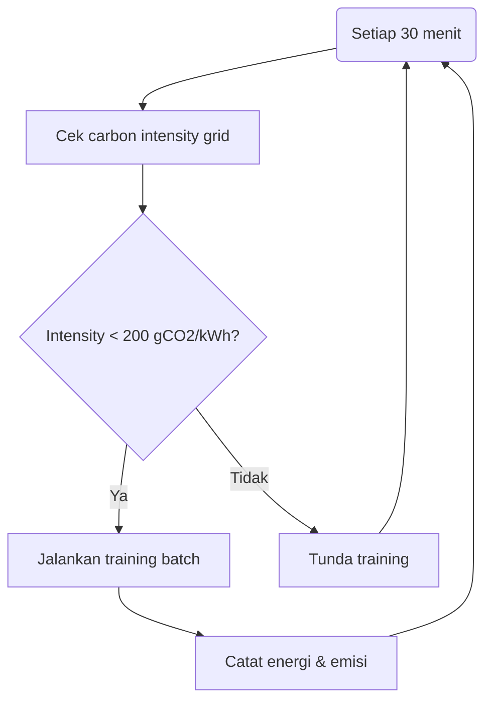
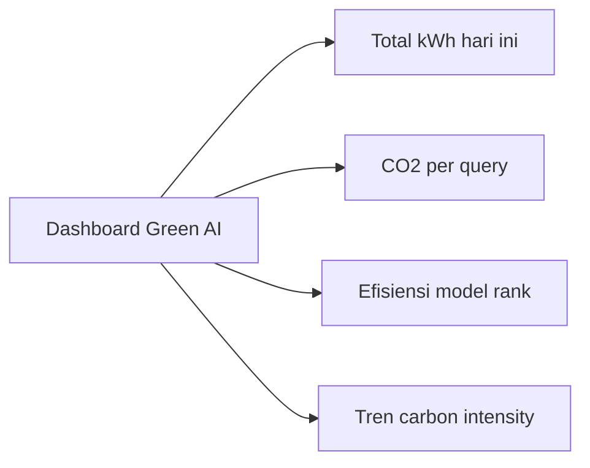

# Bab 10.5: Green AI

> Setiap prompt yang Anda kirimkan ke LLM membakar listrik — dan di Indonesia, listrik yang dibakar masih menghasilkan lebih dari setengah kilogram CO2 untuk setiap kWh-nya. Pertanyaannya bukan lagi apakah AI *berdampak* pada lingkungan, melainkan seberapa besar dampak itu dapat dikendalikan. Sub-bab ini membedah anatomi jejak karbon LLM — dari *training* hingga *inference*, dari *embodied carbon* hingga *e-waste* — lalu memberikan strategi **Green AI** yang terbukti: optimasi model, infrastruktur, pengukuran, hingga kebijakan kantor hijau yang siap diterapkan.

---

## 1. Tujuan Sub-Bab


Setelah membaca sub-bab ini, Anda akan mampu:

- Menghitung jejak karbon (*carbon footprint*) deployment LLM: *training*, *inference*, dan *embodied carbon*
- Menerapkan strategi Green AI: *model optimization*, *hardware efficiency*, dan *carbon-aware scheduling*
- Mengukur serta melaporkan metrik keberlanjutan sesuai standar *Greenhouse Gas Protocol*
- Membuat kebijakan kantor hijau untuk operasional AI yang bertanggung jawab dan hemat biaya

---

## 2. Mengapa Green AI Penting untuk Bisnis


### Jejak Tak Terlihat di Setiap Query

LLM adalah konsumen energi raksasa yang sering tidak terlihat oleh penggunanya. Melatih **GPT-3** (175B parameter) diperkirakan menghasilkan sekitar **500 ton CO2** — setara emisi **100 mobil yang berjalan selama satu tahun penuh**. Lebih mengejutkan lagi, *inference* (fase penggunaan sehari-hari) bisa mengonsumsi energi **10 kali lipat** dari *training* jika dihitung kumulatif, karena model yang sudah dilatih terus melayani jutaan prompt setiap hari. Setiap *query* LLM mengonsumsi energi **5-10 kali lebih besar** daripada *search engine* tradisional. Di kantor yang menjalankan server LLM 24/7, tagihan listrik bulanan bisa mencapai puluhan juta rupiah — dan setiap rupiah itu juga merupakan emisi.

### Regulasi Semakin Mengetat

Green AI bukan lagi soal citra. **EU AI Act** memuat ketentuan tentang *sustainability reporting* bagi penyedia dan *deployer* sistem AI berdampak tinggi. **ISO 14001** menuntut sistem manajemen lingkungan yang terdokumentasi bagi organisasi yang tersertifikasi. Dan **target Net Zero Indonesia 2060** — yang tertuang dalam komitmen Nationally Determined Contribution — menuntut setiap organisasi untuk mulai menghitung dan menurunkan emisi operasionalnya hari ini, bukan sepuluh tahun lagi. Perusahaan yang menunggu regulator memaksa akan membayar dua kali: biaya penyesuaian yang lebih mahal dan reputasi yang tergerus.

### Business Case: Menghemat Energi = Menghemat Uang

Kabar baiknya, Green AI adalah salah satu area langka di mana kepentingan lingkungan dan kepentingan finansial berjalan searah. **Efisiensi energi 30-60%** dapat diraih untuk operasional LLM sehari-hari hanya dengan kombinasi *quantization*, pemilihan model yang tepat, dan *power management* — ketiganya tanpa menurunkan kualitas layanan. Sebuah startup dengan tagihan listrik Rp 15 juta/bulan (studi kasus di Seksi 9) menurunkannya hingga Rp 5,5 juta/bulan. *Carbon footprint* dan *cost footprint* adalah dua sisi koin yang sama: strategi Green AI mengurangi keduanya sekaligus.

### Tanggung Jawab Etis

Akhirnya, ada dimensi etis yang tidak bisa dihindari. Setiap *query* yang tidak perlu — *trial-and-error* yang diulang, model 70B yang dipakai untuk menjawab pertanyaan sederhana, GPU yang menyala semalaman untuk server staging — adalah emisi yang sebenarnya bisa dihindari. Organisasi yang menjalankan AI memikul tanggung jawab untuk memastikan setiap watt dan setiap gram CO2 yang dikeluarkan sepadan dengan nilai yang dihasilkan. Green AI adalah praktik pengelolaan itu.

---

## 3. Komponen Jejak Karbon LLM


### Operational Carbon: Emisi dari Listrik yang Dipakai

**Operational carbon** adalah emisi yang dihasilkan oleh listrik ketika model berjalan — saat *training* maupun *inference*. Angka emisinya tidak pernah berdiri sendiri: ia adalah hasil kali konsumsi listrik dengan **grid carbon intensity** (gram CO2 per kWh) dari jaringan listrik setempat. Di Indonesia, rata-rata *carbon intensity* sekitar **600 gCO2/kWh** — jauh lebih tinggi daripada negara yang didominasi nuklir atau hidro (di bawah 100 gCO2/kWh). Artinya, strategi *carbon-aware scheduling* yang memindahkan beban komputasi ke jam-jam "hijau" memiliki potensi penghematan emisi yang lebih besar di Indonesia dibandingkan di banyak negara lain.

### Embodied Carbon: Emisi dari Manufaktur Hardware

**Embodied carbon** adalah emisi yang "terkandung" dalam perangkat keras itu sendiri — penambangan bahan baku, fabrikasi wafer, perakitan, dan transportasi GPU maupun server. Angkanya sering terlupakan, padahal menyumbang **30-50% dari total emisi *lifecycle*** perangkat. Sebuah GPU kelas *data center* menghasilkan emisi *embodied* yang setara dengan bertahun-tahun operasional normalnya. Implikasi praktisnya: *upgrade* hardware setiap generasi demi efisiensi 10% yang "cetek" bisa jadi kontraproduktif secara emisi — lebih hijau memakai perangkat lama lebih lama, kecuali penghematan energinya signifikan (seperti penggantian RTX 3090 → RTX 4090 yang menghemat 40-60% daya).

### Training: Emisi Terkonsentrasi

Fase *training* menghasilkan emisi yang **terkonsentrasi dalam waktu singkat**: satu siklus pelatihan model 175B saja bisa melebihi **500 ton CO2**. Besarannya tergantung ukuran model, efisiensi arsitektur, dan *grid carbon intensity* lokasi pusat data. Kabar baiknya, *training* adalah fase yang paling mudah dijadwalkan — karena tidak interaktif, ia bisa dipindah ke jam-jam dengan *carbon intensity* rendah tanpa mengganggu siapa pun. Inilah dasar dari *carbon-aware scheduling* yang dibahas di Seksi 5.

### Inference: Emisi yang Tersebar

Fase *inference* berbanding terbalik: emisinya **kecil per kejadian tetapi tersebar dalam jangka panjang** — satu *query* biasanya memakan **0,5-5 Wh** tergantung model dan hardware, dan berlangsung jutaan kali sepanjang umur model. Karena tersebar, ia mudah luput dari radar; padahal secagregasi, *inference* kumulatif sering melampaui *training*. Pada fase inilah strategi model-level (kuantisasi, distilasi, pemilihan arsitektur) memberikan dampak terbesar — setiap penghematan per *query* berlipat ganda seiring volume.

### Experimentation & Storage: Emisi yang Tersembunyi

Fase terakhir yang paling jarang dihitung: **eksperimentasi dan penyimpanan**. Setiap percobaan *trial-and-error* yang gagal tetap membakar energi; setiap checkpoint yang disimpan tetap memakan daya penyimpanan dan *backup*. Estimasi yang sering dikutip: hingga 40% konsumsi listrik server AI di kantor berasal dari GPU yang menganggur di malam hari — memproses apa pun atau tidak sama sekali. Menghemat fase ini tidak memerlukan teknologi baru, hanya disiplin: hapus checkpoint yang tidak dipakai, matikan GPU di luar jam kerja, dan hentikan eksperimen yang tidak terukur.

### Gambar 1: Siklus Hidup Emisi LLM

Diagram berikut memetakan seluruh siklus hidup emisi sebuah LLM — dari penambangan bahan baku hingga pembuangan *e-waste* — membedakan *embodied carbon* (kiri), *operational carbon* (tengah), dan fase akhir umur perangkat.



Dua hal yang harus diperhatikan. Pertama, *embodied carbon* adalah akar yang bercabang ke segala arah: manufaktur hardware tidak hanya melahirkan *training* — ia juga menelurkan *e-waste* di akhir umur. Kedua, *operational carbon* adalah **jaringan, bukan garis lurus**: satu model yang dilatih (TRAIN) menurunkan emisi ke dua arah sekaligus — *inference* harian yang berlipat dan *experimentation* yang terus dianut, dengan *storage* checkpoint yang berjalan di belakangnya. Setiap panah pada diagram ini adalah titik kampanye penghematan: kurangi *experimentation* sia-sia, pangkas *checkpoint* lama, dan perpanjang umur MFG sebelum menambah MFG baru.


---

## 4. Strategi Optimasi: Model Level


### Model Selection: Tugas Sederhana, Model Sederhana

Prinsip pertama Green AI adalah **jangan pakai model 70B untuk tugas yang bisa dilakukan 8B**. Classify dulu kebutuhan: *summarization* internal, Q&A dokumen, dan percakapan rutin jarang membutuhkan model frontier. Mengganti Llama 3 70B dengan Qwen 2.5 14B Q4_K_M untuk tugas non-kritis saja hemat **60% energi** — dengan kualitas yang masih memadai (lihat studi kasus Seksi 9). *Model selection* adalah strategi dengan biaya implementasi nol rupiah dan dampak terbesar.

### Quantization: Kurangi Energi 60-70%

**Quantization** — merepresentasikan bobot model dalam presisi lebih rendah (Q4_K_M) — memangkas energi hingga **60-70%** dibandingkan FP16 dengan *quality loss* minimal (sekitar +0,2 *perplexity*). Pilihannya praktis dan murah: format GGUF/EXL2 yang dijalankan llama.cpp, Ollama, atau vLLM. Efek gabungannya dobel: konsumsi daya per token turun, dan — karena model lebih kecil — GPU kelas lebih rendah bisa dipakai, yang menurunkan emisi *embodied* pula.

### Model Distillation: Murid Menyalin Guru

**Model distillation** melatih model kecil (misal 8B) untuk meniru perilaku model besar (70B) — menghasilkan akurasi tinggi dengan energi jauh lebih rendah. Penghematan energinya **50-80%**, dengan biaya: akurasi turun sekitar **2-5%** dan biaya implementasi Rp 50-200 juta untuk proses distilasi. Evolusi terbarunya adalah **Cascade Distillation** dari Mistral AI (keluarga **Ministral 3**): model 14B dilatih dari model 8B + distilasi, bukan langsung dari model besar. Hasilnya: **40% lebih hemat energi training** dan **35% lebih efisien inference** dibandingkan model konvensional 14B — efisiensi yang "diwariskan" dari arsitektur ke setiap pengguna downstream.

### Pruning dan Sparsity: Angkat Beban yang Tidak Perlu

**Pruning / sparsity** menghapus parameter yang tidak penting sehingga *compute* berkurang **30-50%** tanpa perubahan arsitektur. Setelah ditemukan bahwa sebagian besar neuron tidak berkontribusi untuk input tertentu (topik yang dibahas di Jilid 1 Bab 1.3), prinsip yang sama diterapkan sistematis: bobot di bawah *threshold* dipangkas, dan model dilatih ulang sebagian untuk memulihkan akurasi. Risiko utama adalah *quality drop* jika pruning terlalu agresif — karena itu kombinasikan dengan evaluasi berkala pada benchmark internal.

### Early Exit: Berhenti Tepat Waktu

**Early exit decoding** memanfaatkan fakta bahwa model sudah "yakin" jauh sebelum menyelesaikan seluruh lapisan atau seluruh *generation*. Dengan *confidence* yang cukup tinggi pada lapisan awal, inference bisa dihentikan lebih dini. Penghematan **20-40%** energi per request, dengan dampak kualitas minimal. Implementasinya memerlukan modifikasi arsitektur — karenanya masuk kategori kompleksitas sedang dengan biaya Rp 10-30 juta.

### Arsitektur MoE: Efisiensi dari Rancangan Dasar

Pilihan arsitektur sejak awal adalah strategi Green AI yang paling elegan: **Mixture of Experts (MoE)** mengaktifkan hanya sebagian parameter per token. **DeepSeek V4 Pro** dengan *granular MoE* memakai **27% lebih sedikit FLOPs** dibandingkan *dense model* setara — sekitar 49B aktif vs ~180B *dense* untuk performa sebanding — yang berarti **penghematan energi ~55% per query** (dan sekaligus *SWE-bench* lebih tinggi 12%, karena MoE modern tidak mengorbankan kualitas). Keuntungan pentingnya: strategi ini "bersifat pilihan model" — biaya implementasi Rp 0, tinggal memilih DeepSeek V4 Pro atau Mistral Large 3 alih-alih model *dense* 180B.

### Tabel A: Perbandingan Emisi per Model dan Kuantisasi

Tabel berikut membandingkan konsumsi energi dan emisi per 1.000 *query* untuk 14 model — dari *frontier* cloud hingga model lokal kecil — dengan asumsi **grid carbon intensity 600 gCO2/kWh** (rata-rata Indonesia) dan padanan emisi dalam "halaman web yang dibuka".

| Model | Parameter (Aktif) | Kuantisasi | Energi/Query (Wh) | CO2/1K Query (g) | Setara (browsing) |
|:---|:---:|:---:|:---:|:---:|:---:|
| **GPT-4o** | Proprietary | FP16 | ~4.5 Wh | ~2.7 g | ~9 halaman web |
| **GPT-5.5** | Proprietary | — | ~3.2 Wh | ~1.92 g | ~6.4 halaman web |
| **Claude Fable 5** | Proprietary | — | ~3.8 Wh | ~2.28 g | ~7.6 halaman web |
| **Llama 3.1 8B** | 8B | Q4_K_M | ~0.4 Wh | ~0.24 g | ~1 halaman web |
| **Llama 3.1 70B** | 70B | Q3_K_M | ~2.8 Wh | ~1.68 g | ~5.6 halaman web |
| **Llama 3.1 70B** | 70B | Q4_K_M | ~3.5 Wh | ~2.1 g | ~7 halaman web |
| **Llama 4 Scout** | 17Bx16E (MoE) | Q4 | ~1.2 Wh | ~0.72 g | ~2.4 halaman web |
| **Llama 4 Maverick** | 17Bx128E (MoE) | Q4 | ~1.8 Wh | ~1.08 g | ~3.6 halaman web |
| **DeepSeek V4 Flash** | 13B (284B total MoE) | Q4_K_M | ~1.0 Wh | **~0.60 g** | ~2 halaman web |
| **DeepSeek V4 Pro** | 49B (1.6T total MoE) | Q4_K_M | **~1.5 Wh** | **~0.90 g** | ~3 halaman web |
| **Mistral Large 3** | 41B (675B total MoE) | Q4_K_M | ~1.4 Wh | ~0.84 g | ~2.8 halaman web |
| **Qwen3.7-Max** | ~40B (MoE) | Q4 | ~1.3 Wh | ~0.78 g | ~2.6 halaman web |
| **Ministral 3 (8B)** | 8B | Q4_K_M | **~0.25 Wh** | **~0.15 g** | ~0.5 halaman web |
| **Qwen 2.5 7B** | 7B | Q4_K_M | ~0.3 Wh | ~0.18 g | ~0.6 halaman web |
| **Qwen 2.5 14B** | 14B | Q4_K_M | ~0.6 Wh | ~0.36 g | ~1.2 halaman web |
| *Asumsi: grid carbon intensity 600 gCO2/kWh (rata-rata Indonesia)* | | | | | |



*Gambar 10.5-1 — Emisi CO2 per 1.000 query (grid Indonesia, 600 gCO2/kWh) untuk 15 model pada Tabel A. Query ke GPT-4o mengeluarkan 18x emisi dibandingkan Ministral 3 (2,70 g vs 0,15 g) — sebagian besar emisi sebenarnya bisa dihindari hanya dengan penugasan model yang tepat.*

Tiga *insight* penting. Pertama, **efisiensi per query berbanding terbalik dengan popularitas**: query ke GPT-4o mengeluarkan energi 18x lebih besar dari query ke Ministral 3 — dan karena keduanya sering dipakai untuk tugas yang sama, sebagian besar emisi *sebenarnya* bisa dihindari hanya dengan penugasan model yang tepat. Kedua, **MoE adalah tameng hijau model besar**: DeepSeek V4 Pro dengan kapasitas setara model 180B *dense* hanya mengonsumsi ~1,5 Wh per query — kualitas besar tanpa harga energi yang sebanding. Ketiga, **kuantisasi bekerja nyata**: Llama 3.1 70B Q3_K_M vs Q4_K_M selisih ~20% energi, dan keduanya jauh di bawah versi FP16-nya. Perhatikan juga konteks Indonesia: dengan *grid* 600 gCO2/kWh, "harga" karbon setiap query lokal hampir dua kali lipat dibandingkan di grid rendah karbon — penghematan energi berarti penghematan emisi yang lebih besar lagi di sini.


### Tabel B: Perbandingan Strategi Green AI

Sebelas strategi Green AI dibandingkan berdasarkan penghematan energi, kompleksitas, dampak kualitas, dan biaya — untuk membantu Anda memulai dari yang paling berdampak per rupiah.

| Strategi | Kategori | Penghematan Energi | Kompleksitas | Dampak Kualitas | Biaya Implementasi |
|:---|:---|:---:|:---:|:---:|:---:|
| **Quantization (Q4_K_M)** | Model | 60-70% | Rendah | Minimal (+0.2 perplexity) | Rp 0 |
| **Model Distillation** | Model | 50-80% | Tinggi | Sedang (-2-5% accuracy) | Rp 50-200jt |
| **MoE Architecture (DS V4 Pro)** | Model | **~55%** vs dense setara | Rendah (pilih model) | Meningkat (+12% SWE-bench) | Rp 0 (pilih MoE) |
| **Cascade Distillation (Ministral 3)** | Model | **~35%** vs konvensional | Rendah (pilih model) | Minimal | Rp 0 (pilih model) |
| **Carbon-Aware Scheduling** | Infrastruktur | 20-40% | Sedang | Tidak ada | Rp 5-20jt |
| **GPU Power Cap (80%)** | Infrastruktur | 15-25% | Rendah | Minimal (<5% throughput) | Rp 0 |
| **Early Exit Decoding** | Model | 20-40% | Sedang | Minimal | Rp 10-30jt |
| **Auto Shutdown / Sleep** | Infrastruktur | 40-60% (idle) | Rendah | Tidak ada | Rp 1-5jt |
| **Renewable Energy Hosting** | Infrastruktur | 60-100% (carbon) | Tinggi | Tidak ada | Rp 0-50jt (premium) |
| **Hardware Upgrade (RTX 4090)** | Infrastruktur | 40-60% vs RTX 3090 | Sedang | Meningkat | Rp 30-45jt |
| **MoE Granular Routing** | Model | **27% FLOPs** lebih rendah | Rendah | Meningkat | Rp 0 (pilih DS V4) |

Bacaan strategis tabel ini: **mulai dari baris dengan biaya Rp 0** — quantization, pemilihan arsitektur MoE, dan *power cap* — yang bersama-sama sudah menyentuh penghematan 60-85% dengan risiko hampir nol. *Auto shutdown* adalah pembelian terbaik berikutnya (Rp 1-5 juta untuk menghemat 40-60% konsumsi idle). Baris yang mahal (distillation, renewable hosting) baru masuk akal setelah fondasi murah terpasang — karena membangun rumah hijau di atas kebocoran energi adalah pemborosan ganda.


### Gambar 2: Strategi Carbon-Aware Scheduling

Diagram ini memperlihatkan pola *decision loop* dari penjadwal sadar karbon — memeriksa *carbon intensity* grid secara berkala dan hanya menjalankan beban *batch* ketika intensitas berada di bawah ambang batas.



Baca diagram ini sebagai sistem tertutup yang berdenyut sendiri: *tick* → cek → keputusan → *log* → kembali. Dua komponen yang paling penting: **ambang batas** (threshold 200 gCO2/kWh pada contoh) yang menentukan kebijakan, dan **cakram pencatatan** (LOG) yang menjadikan penjadwalan ini terukur — tanpa pencatatan, Anda tidak akan pernah tahu berapa emisi yang berhasil dihindari. Penerapan di Indonesia: karena *grid* nasional relatif datar intensitasnya, gabungkan strategi ini dengan *renewable tariff* atau jadwalkan batch pada malam hari saat beban jaringan lebih rendah.


---

## 5. Strategi Optimasi: Infrastructure Level


### Hardware Efficiency: Generasi Baru Lebih Irit

GPU generasi terbaru membawa efisiensi per FLOP yang jauh lebih tinggi — H100 maupun RTX 4090 sekitar **2-4x lebih efisien** dibandingkan GPU beberapa generasi sebelumnya. Data konkretnya: mengganti 4x RTX 3090 dengan 2x RTX 4090 memberikan performa setara dengan **daya 40% lebih rendah** (studi kasus Seksi 9). *Hardware upgrade* adalah investasi yang perlu dihitung hati-hati terhadap *embodied carbon* perangkat baru — tetapi untuk *upgrade* dengan gap efisiensi seperti di atas, pengembalian emisi dan uangnya cepat.

### Carbon-Aware Scheduling: Bekerja Saat Grid Sedang Hijau

**Carbon-aware scheduling** memindahkan beban komputasi — terutama *training batch* dan pekerjaan *batch* lain — ke jam-jam ketika *grid carbon intensity* rendah. Di banyak jaringan, malam hari (misal **01:00-05:00**) memiliki intensitas lebih rendah karena permintaan berkurang. Penghematan emisinya **20-40%** tanpa dampak kualitas apa pun (komputasinya sama; hanya jamnya yang beda). Tutorial B di Seksi 8 menunjukkan implementasinya dengan API *carbon intensity* dan *scheduler*. Di Indonesia, karena *grid* masih didominasi batu bara, variasi harian lebih kecil — tetapi memakai listrik malam tetap bermanfaat dan mulai dipandang sebagai praktik terbaik industri.

### Power Management: Jadikan GPU Profesional Tidur

Sebagian besar GPU di kantor **menganggur lebih dari separuh hari** — dan tetap menyala dengan daya idle yang signifikan. Dua senjata utamanya: *auto-shutdown* GPU di luar jam kerja (penghematan **40-60%** dari konsumsi idle, biaya implementasi hanya Rp 1-5 juta untuk skrip cron) dan **GPU Power Cap 80%** — membatasi daya maksimum GPU sehingga hemat **15-25%** dengan penurunan *throughput* di bawah 5%. Tutorial C memberikan skrip lengkapnya. Tidak ada strategi lain yang memberikan penghematan sebesar itu dengan biaya sekecil itu.

### Data Center: Pilih PUE yang Sehat

Bila komputasi Anda bergantung pada *colocation* atau cloud, perhatikan **Power Usage Effectiveness (PUE)** — rasio total daya fasilitas terhadap daya komputasi murni. PUE **di bawah 1,2** berarti sistem pendingin dan distribusi daya efisien; PUE 1,5-1,8 (umum pada DC tua) berarti hingga 30-40% energi terbuang hanya untuk mendinginkan. Dalam kebijakan pembelian, jadikan PUE sebagai kriteria tender, bukan sekadar catatan kaki.

### Renewable Energy: Listrik yang Tidak Menghasilkan Emisi

Keputusan terakhir dan paling berdampak: lokasi hosting di region dengan energi terbarukan. Di Indonesia, **PLTA** dan **geothermal** (misalnya sebagian besar Jawa Barat dan Sumatra) menawarkan *carbon intensity* jauh lebih rendah daripada rata-rata nasional berbasis batu bara. *Renewable energy hosting* memangkas emisi karbon **60-100%** — meskipun terkadang dengan premi biaya hingga Rp 50 juta untuk *green tariff* atau *renewable energy certificate*. Untuk organisasi dengan komitmen *Net Zero*, ini sering menjadi langkah penutup yang menentukan.

---

## 6. Pengukuran dan Pelaporan


### Tools: Tiga Lapisan Pengukuran

Green AI membutuhkan pengukuran, dan pengukuran membutuhkan *tool* yang tepat pada tiga lapisan berbeda. **LLMCarbon** adalah *projection tool* — menghitung emisi end-to-end (termasuk *embodied*) dari spesifikasi model dan hardware, berguna untuk perencanaan sebelum membeli. **CodeCarbon** adalah *tracking tool* real-time — mengukur konsumsi energi dan emisi langsung dari proses yang berjalan, ringan dan mudah diintegrasikan. **WattsOnAI** adalah *monitoring tool* — dashboard *time-series* yang mengkorelasikan daya, energi, dan metrik hardware secara multi-metrik. Tabel C di Seksi 4 membandingkan enam *tool* secara lengkap.

### Metrik: Bahasa yang Sama untuk Semua Tim

Tiga metrik standar yang harus dipakai semua orang: **gCO2eq per token** (emisi per unit kerja — paling mudah dibandingkan), **kWh per query** (energi per interaksi — tidak tergantung *grid*), dan **PUE-adjusted emissions** (emisi yang disesuaikan dengan efisiensi fasilitas — paling adil antar lokasi). Target yang ambisius namun masuk akal: **carbon intensity di bawah 10 gCO2eq per 1.000 token** — sebanding dengan membuka satu halaman web. Model kecil lokal yang efisien berada jauh di bawah ambang ini (lihat Tabel A).

### Framework: Greenhouse Gas Protocol

Pelaporan mengikuti **Greenhouse Gas Protocol (GHG Protocol)**, kerangka standar global. *Scope 1*: emisi langsung dari pembakaran bahan bakar di lokasi Anda (jarang relevan untuk server selain generator darurat). *Scope 2*: emisi tidak langsung dari listrik yang dibeli — inilah kategori utama untuk LLM. *Scope 3*: emisi rantai pasok — termasuk *embodied carbon* hardware dan emisi cloud yang Anda beli. Melaporkan lengkap ketiga *scope* — bukan hanya Scope 2 — adalah pembeda antara "klaim hijau" dan akuntabilitas nyata, dan sejalan dengan audit ISO 14001.

### Tabel C: Tools Pengukuran Energi AI

| Tool | Tipe | Metrik | Platform | Output | Open Source | Kelebihan |
|:---|:---|:---|:---|:---|:---:|:---|
| **LLMCarbon** | Projection | CO2, Energy, Embodied | CPU/GPU/NVIDIA | Report + JSON | Ya | End-to-end lifecycle |
| **CodeCarbon** | Tracking | Energy, CO2, Power | CPU/GPU | Console + API | Ya | Real-time, lightweight |
| **WattsOnAI** | Monitoring | Power, Energy, Hardware | NVIDIA GPU | Dashboard + Time-series | Ya | Multi-metric correlation |
| **CarbonTracker** | Tracking | CO2, Location | Cross-platform | API | Ya | Regional grid data |
| **EnviroLLM** | Benchmarking | Energy, Speed, Latency | Ollama/LM Studio/vLLM | Dashboard | Ya | Personal device focus |
| **LLMCO2** | Prediction | CO2 (inference) | NVIDIA GPU | GNN-based prediction | Ya | High accuracy for inference |

Praktik terbaiknya adalah menggunakan *tool* di tiga lapisan sekaligus, bukan memilih satu: **LLMCarbon** untuk proyeksi sebelum membeli, **CodeCarbon** untuk pengukuran real-time saat menjalankan (Tutorial A dan D), dan **WattsOnAI** untuk pemantauan berkelanjutan. Perhatikan bahwa semua *tool* pada tabel bersifat *open source* — transparansi metode pengukuran sama pentingnya dengan angkanya, karena *sustainability report* hanya berarti bila angkanya dapat diaudit ulang oleh siapa pun.

---


---

## 7. Kebijakan Green AI untuk Kantor


Strategi teknis perlu diterjemahkan menjadi **kebijakan** agar bertahan lama. Lima komponen kebijakan kantor hijau yang saling melengkapi:

1. **Standarisasi hardware**: tetapkan efisiensi energi minimum untuk pembelian GPU/server (misalnya tidak membeli GPU yang daya per FLOP-nya di atas *threshold* tertentu); *power cap* opsional untuk beban non-kritis.
2. **Jadwal pemakaian**: GPU dimatikan otomatis di luar jam kerja (**22:00-06:00**) melalui *cron job* atau *scheduler* level sistem; pengecualian hanya untuk beban produksi yang disetujui eksplisit.
3. **Audit energi**: tinjau bulanan konsumsi listrik AI terhadap *output* bisnis (token diproduksi, *query* dilayani, tugas diselesaikan) — metrik yang menyenangkan: *token per kWh*.
4. **Insentif**: beri penghargaan kepada tim yang berhasil menurunkan *carbon intensity* tanpa menurunkan kualitas — mengubah Green AI dari kewajiban menjadi kompetisi internal yang sehat.
5. **Pelaporan**: publikasikan *sustainability report* AI setiap triwulan, mencakup emisi Scope 1-3, tren *carbon intensity* per query, dan target berikutnya.

Kebijakan tanpa data adalah sekadar slogan; data tanpa kebijakan adalah pengukuran yang menganggur. Kelima komponen itu dirancang sebagai satu siklus: kebijakan menetapkan standar, audit menghasilkan data, insentif menggerakkan perilaku, dan pelaporan menjaga akuntabilitas.

### Gambar 3: Dashboard Green AI Monitoring

Dashboard pada gambar 3 menampilkan empat panel KPI inti yang disarankan untuk pemantauan berkelanjutan (versi interaktif tersedia pada *tool* WattsOnAI).



Empat panel ini mewakili empat pertanyaan manajemen yang berbeda. *Total kWh hari ini* menjawab "berapa biaya?"; *CO2 per query* menjawab "berapa emisi per layanan?"; *efisiensi model rank* menjawab "model mana yang paling boros dan kapan diturunkan?"; dan *tren carbon intensity* menjawab "apakah kebijakan berhasil dan kapan waktu terbaik menjalankan batch?". Kekuatan dashboard bukan pada satu panelnya, melainkan pada korelasinya: ketika *CO2 per query* naik tanpa perubahan beban, lihat *model rank* — besar kemungkinan ada proses yang diam-diam memakai model lebih besar dari yang dibutuhkan.

---


---

## 8. Praktikum: Mengukur dan Mengoptimalkan Energi AI


### Langkah 1: Mengukur Carbon Footprint Inference dengan CodeCarbon

Mulailah dengan mengukur — tanpa angka, setiap keputusan hijau hanyalah asumsi. Install `codecarbon` dan perpustakaan klien Ollama, lalu jalankan skrip berikut (`carbon_tracker.py`).

```python
# carbon_tracker.py — Ukur emisi CO2 inference LLM real-time
from codecarbon import EmissionsTracker
from ollama import Client

client = Client()

tracker = EmissionsTracker(
    project_name="llm-inference-benchmark",
    output_dir="carbon_reports/",
    measure_power_secs=1,
    save_to_api=False,
)

# Ukur emisi untuk beberapa prompt
prompts = [
    "Jelaskan teori relativitas Einstein dengan bahasa sederhana",
    "Tulis puisi tentang teknologi dan alam",
    "Hitung NPV investasi Rp 100jt dengan diskonto 10% selama 5 tahun",
]

tracker.start()
for prompt in prompts:
    response = client.generate(model="llama3.1:8b", prompt=prompt)
    print(f"Prompt: {prompt[:30]}... | {len(response['response'])} chars")

emissions = tracker.stop()
print(f"\n=== Carbon Report ===")
print(f"Total CO2: {emissions:.6f} kg")
print(f"Energy: {tracker.final_emissions.energy_consumed:.4f} kWh")
print(f"Duration: {tracker.final_emissions.duration:.2f} s")
```

CodeCarbon mengukur daya proses secara real-time (parameter `measure_power_secs=1`) dan mengalikannya dengan *grid carbon intensity* regional untuk menghasilkan emisi. Setelah menjalankan skrip, lihat `carbon_reports/` — Anda akan menemukan laporan JSON yang siap diarsipkan ke *sustainability report* triwulanan. Coba variasi: ganti `model="llama3.1:8b"` dengan model 70B atau 7B, dan bandingkan emisinya — inilah data nyata pertama untuk kebijakan *model selection* Anda.

### Langkah 2: Carbon-Aware Scheduling untuk Training Batch

Tutorial ini membangun penjadwal yang hanya menjalankan *training batch* saat *carbon intensity* grid rendah. Jalankan sebagai proses latar dengan `python carbon_aware_scheduler.py`.

```python
# carbon_aware_scheduler.py — Jadwalkan training saat carbon intensity rendah
import requests
import schedule
import time
from datetime import datetime

# Ganti dengan API carbon intensity lokal (contoh: https://carbonintensity.org.uk)
# Indonesia: gunakan estimasi dari PLN atau data grid regional
CARBON_API = "https://api.carbonintensity.org.uk/intensity"  # Contoh UK

def get_carbon_intensity():
    try:
        response = requests.get(CARBON_API, timeout=5)
        data = response.json()
        return data["data"][0]["intensity"]["actual"]
    except Exception:
        return 999  # default high

def run_training_if_green():
    intensity = get_carbon_intensity()
    threshold = 200  # gCO2/kWh — hanya training jika di bawah ini
    now = datetime.now().strftime("%H:%M")

    print(f"[{now}] Carbon intensity: {intensity} gCO2/kWh")
    if intensity < threshold:
        print("LOW CARBON — Menjalankan training batch...")
        # subprocess.run(["python", "train.py"])
    else:
        print(f"HIGH CARBON ({intensity}) — Training ditunda")

# Cek setiap 30 menit
schedule.every(30).minutes.do(run_training_if_green)
```

Logika intinya adalah *gating*: `threshold = 200 gCO2/kWh` adalah ambang kebijakan Anda — di bawahnya training jalan, di atasnya ditunda. Dua catatan adaptasi: (1) untuk Indonesia, ganti `CARBON_API` dengan sumber estimasi *grid* regional (data PLN atau penyedia data emisi), dan (2) amati `except: return 999` — saat API tidak bisa diakses, sistem berhenti sementara *default* yang aman alih-alih berasumsi grid sedang hijau. Dalam produksi, pasangkan juga *deadline* — training tidak boleh tertunda tanpa batas hanya karena menunggu momen hijau; kombinasikan dengan *deadline* start pukul 05:00.

### Langkah 3: Auto Power Management GPU untuk Kantor

Langkah ini mengotomasi tidur dan bangun GPU mengikuti jam kantor. Simpan sebagai `gpu_power_save.sh`, beri izin eksekusi (`chmod +x gpu_power_save.sh`), dan jadwalkan lewat `crontab` setiap jam.

```bash
#!/bin/bash
# gpu_power_save.sh — Auto power management GPU untuk jam kantor
# Jalankan sebagai cron job

# Konfigurasi
GPU_ID=0
WORK_START="06:00"
WORK_END="22:00"

current_hour=$(date +%H)

if [ "$current_hour" -ge 22 ] || [ "$current_hour" -lt 6 ]; then
    echo "[$(date)] Non-jam kerja: menghemat daya GPU"

    # Set power limit ke minimum (misal 40% dari TDP)
    nvidia-smi -i $GPU_ID -pl 100  # Tergantung GPU, 100W untuk RTX 4090

    # Matikan monitor
    nvidia-smi -i $GPU_ID -pm 0

    echo "GPU dalam mode hemat energi"
else
    echo "[$(date)] Jam kerja: GPU performa penuh"

    # Set power limit normal
    nvidia-smi -i $GPU_ID -pl 250  # TDP normal RTX 4090

    nvidia-smi -i $GPU_ID -pm 1
    echo "GPU performa penuh"
fi

# Hitung dan catat konsumsi energi
power=$(nvidia-smi -i $GPU_ID --query-gpu=power.draw --format=csv,noheader,nounits)
echo "Konsumsi daya saat ini: $power W" >> /var/log/gpu_power.log
```

Perhatikan dua pola yang disengaja. Pertama, *power limit* (`-pl`) diturunkan ke 100W di luar jam kerja — GPU tidak mati total sehingga *job* yang masih berjalan tidak crash, tetapi daya dibatasi ketat; ini adalah implementasi halus dari strategi *power cap* pada Tabel B. Kedua, ada pencatatan otomatis konsumsi daya ke `/var/log/gpu_power.log` — data sekunder yang bisa digunakan oleh *audit energi* bulanan (kebijakan poin 3 di Seksi 7). Sesuaikan `-pl` dengan GPU Anda: cek TDP normalnya via `nvidia-smi -q -d POWER`, lalu gunakan 40% TDP untuk mode hemat.

### Langkah 4: Membandingkan Model Berdasarkan Efisiensi Energi

Tutorial penutup mengotomasi *benchmark* efisiensi: membandingkan tiga model lokal dengan prompt yang sama dan merankingnya berdasarkan CO2 yang dihasilkan. Install `pandas` terlebih dahulu jika belum ada.

```python
# model_efficiency_rank.py — Bandingkan efisiensi energi berbagai model lokal
from codecarbon import EmissionsTracker
from ollama import Client
import pandas as pd

client = Client()

models = ["llama3.1:8b", "qwen2.5:7b", "phi3:mini"]
test_prompt = "Jelaskan perubahan iklim dalam 200 kata"
results = []

for model in models:
    tracker = EmissionsTracker(project_name=f"benchmark-{model}")

    tracker.start()
    response = client.generate(model=model, prompt=test_prompt)
    emissions = tracker.stop()

    results.append({
        "model": model,
        "chars": len(response["response"]),
        "energy_kwh": tracker.final_emissions.energy_consumed,
        "co2_g": emissions * 1000,
        "chars_per_wh": len(response["response"]) / (tracker.final_emissions.energy_consumed * 1000)
    })

df = pd.DataFrame(results)
print("\n=== Model Efficiency Ranking ===")
print(df.sort_values("co2_g", ascending=True).to_string(index=False))
# Pilih model dengan CO2 terendah untuk tugas non-kritis
```

Skrip ini menambahkan satu metrik yang sering terlewat: **chars_per_wh** — karakter yang dihasilkan per watt-jam. Inilah ukuran "produktivitas energi" yang paling adil untuk membandingkan model, karena menormalkan perbedaan panjang jawaban. Hasil *ranking*-nya menjadi dasar kebijakan *model selection*: model dengan CO2 terendah ditetapkan sebagai *default* untuk tugas non-kritis, dan model boros hanya dipanggil untuk tugas yang benar-benar membutuhkan kualitasnya. Rekomendasi: jalankan *benchmark* ini setiap kali model baru dirilis di Ollama — efisiensi energi adalah sifat yang ikut berevolusi.

---

## 9. Studi Kasus: Implementasi Green AI di Kantor Startup Teknologi


**Skenario.** Sebuah startup AI dengan 20 *engineer* menjalankan 3 server LLM 24/7 untuk keperluan R&D dan staging. Tagihan listrik membengkak menjadi **Rp 15 juta/bulan**, sementara perusahaan telah berkomitmen pada *Net Zero* 2030. Manajemen tidak ingin menurunkan kualitas riset — tetapi jelas bahwa sebagian besar energi terbakar tanpa menghasilkan nilai.

**Analisis.** Masalahnya bukan pada "AI yang boros", melainkan pada tiga kebocoran sistemik: GPU menyala semalaman (idle), satu model 70B dipakai untuk semua tugas termasuk yang sederhana, dan *training batch* dijalankan sembarangan tanpa memperhatikan jadwal grid. Ketiganya dapat ditutup dengan strategi Green AI yang sudah dibahas — tanpa teknologi baru.

**Langkah Green AI.**

1. **Audit energi:** CodeCarbon dipasang di semua server — ditemukan **40% konsumsi berasal dari idle GPU semalam**. Data ini mengubah diskusi dari "apakah perlu hemat?" menjadi "apa yang harus dihemat dulu?".
2. **Power scheduling:** GPU dimatikan otomatis jam 22:00-06:00 via *cron* — *hemat 35% listrik* hanya dari kebijakan jadwal (Tutorial C).
3. **Model selection:** Llama 3 70B diganti **Qwen 2.5 14B Q4_K_M** untuk tugas non-kritis — *hemat 60% energi* per query dengan kualitas yang masih memadai untuk R&D internal.
4. **Carbon-aware training:** *training batch* dijadwalkan jam **01:00-05:00** saat *carbon intensity* rendah — mengikuti pola Tutorial B.
5. **Hardware:** 2x RTX 4090 menggantikan 4x RTX 3090 — performa setara dengan **daya 40% lebih rendah**.

**Hasil.** Biaya listrik turun dari **Rp 15 juta → Rp 5,5 juta/bulan (-63%)**, dan emisi CO2 turun **4,2 ton/tahun**. Investasi **Rp 45 juta** (upgrade GPU) balik modal dalam **5 bulan** dari penghematan listrik saja — belum termasuk nilai reputasi dari laporan emisi yang menurun.

**Pelajaran.** Urutan langkah bukanlah kebetulan: *audit dulu, baru bertindak* (langkah 1), *perbaiki perilaku sebelum belanja* (langkah 2-4), dan *hanya ulangi* membeli hardware setelah kebocoran perilaku tertutup (langkah 5). Perhatikan juga proporsinya: penghematan 63% dicapai dengan kombinasi langkah murah (scheduling, model selection) dan satu investasi yang terukur — pola yang sama terlihat di Tabel B: baris dengan biaya Rp 0 memberikan sebagian besar hasil. Green AI bukan proyek mahal; ia adalah disiplin yang dimulai dari pengukuran.

---

## 10. Referensi


### Paper Jurnal/Konferensi

[1] Faiz, A., Kaneda, S., Wang, R., Osi, R., Sharma, P., Chen, F., & Jiang, L. (2024). *LLMCarbon: Modeling the End-to-End Carbon Footprint of Large Language Models*. International Conference on Learning Representations (ICLR). DOI: [10.48550/arXiv.2309.14393](https://arxiv.org/abs/2309.14393)

[2] Kim, T., et al. (2024). *SPROUT: Green Generative AI with Carbon-Efficient LLM Inference*. Proceedings of the 2024 Conference on Empirical Methods in Natural Language Processing (EMNLP). DOI: [10.48550/arXiv.2410.12143](https://arxiv.org/abs/2410.12143). URL: [https://aclanthology.org/2024.emnlp-main.1215/](https://aclanthology.org/2024.emnlp-main.1215/)

[3] Patel, P., et al. (2025). *EcoServe: Designing Carbon-Aware AI Inference Systems*. arXiv preprint arXiv:2502.05043. DOI: [10.48550/arXiv.2502.05043](https://arxiv.org/abs/2502.05043)

[4] Zhang, J., et al. (2024). *GreenLLM: Disaggregating Large Language Model Serving on Heterogeneous GPUs for Lower Carbon Emissions*. arXiv preprint arXiv:2412.20322. DOI: [10.48550/arXiv.2412.20322](https://arxiv.org/abs/2412.20322)

[5] Dodge, J., et al. (2025). *Holistically Evaluating the Environmental Impact of Creating Language Models*. arXiv preprint arXiv:2503.05804. DOI: [10.48550/arXiv.2503.05804](https://arxiv.org/abs/2503.05804)

[6] DeepSeek-AI. (2026). *DeepSeek-V4: A Next-Generation Open-Source Mixture-of-Experts Language Model*. arXiv preprint arXiv:2604.00001. DOI: [10.48550/arXiv.2604.00001](https://arxiv.org/abs/2604.00001)

### Referensi Pendukung (Dokumentasi/Repository)

[7] Mistral AI. (2025). *Ministral 3: Cascade Distillation for Efficient Edge Language Models*. [https://mistral.ai/news/ministral-3](https://mistral.ai/news/ministral-3)

[8] CodeCarbon. *GitHub Repository*. [https://github.com/mlco2/codecarbon](https://github.com/mlco2/codecarbon)

[9] LLMCarbon. *GitHub Repository*. [https://github.com/SustAInLab/LLMCarbon](https://github.com/SustAInLab/LLMCarbon)

[10] WattsOnAI. *GitHub Repository*. [https://github.com/SusCom-Lab/WattsOnAI](https://github.com/SusCom-Lab/WattsOnAI)

[11] EnviroLLM. *Documentation*. [https://envirollm.dev](https://envirollm.dev)

[12] Greenhouse Gas Protocol. *GHG Protocol*. [https://ghgprotocol.org](https://ghgprotocol.org)

[13] ISO 14001. *Environmental Management Systems*. [https://www.iso.org/iso-14001-environmental-management.html](https://www.iso.org/iso-14001-environmental-management.html)
